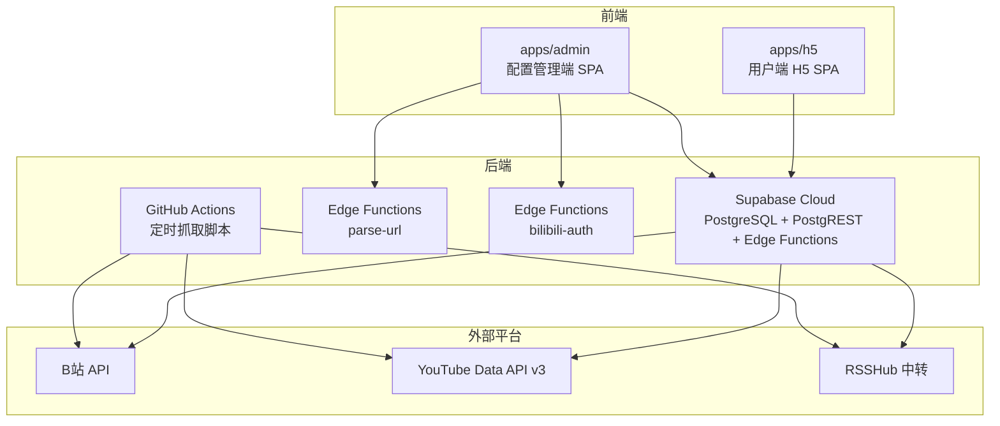
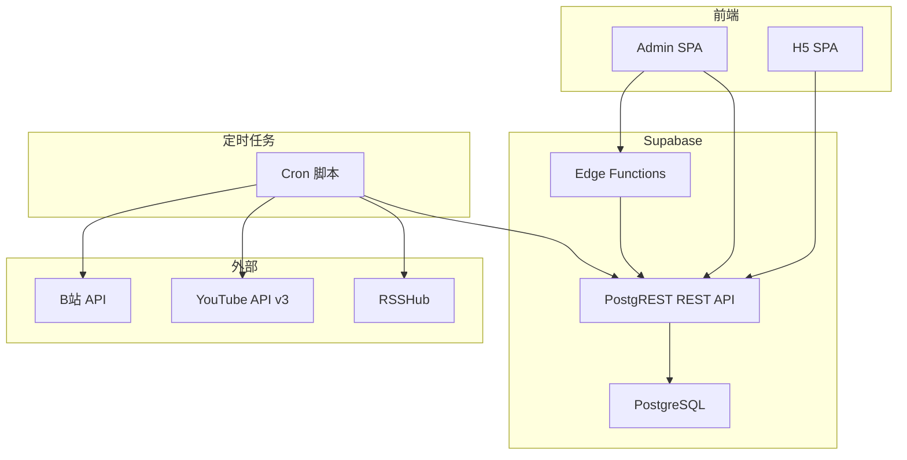
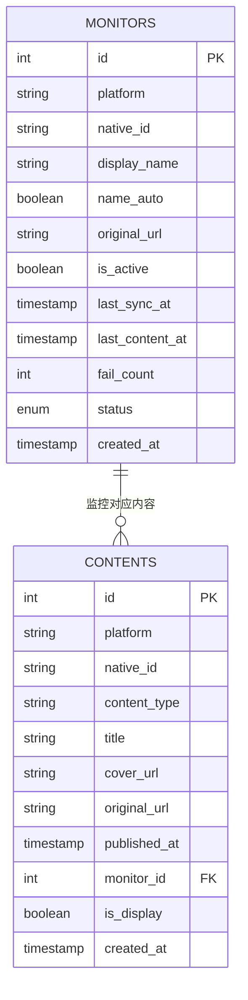
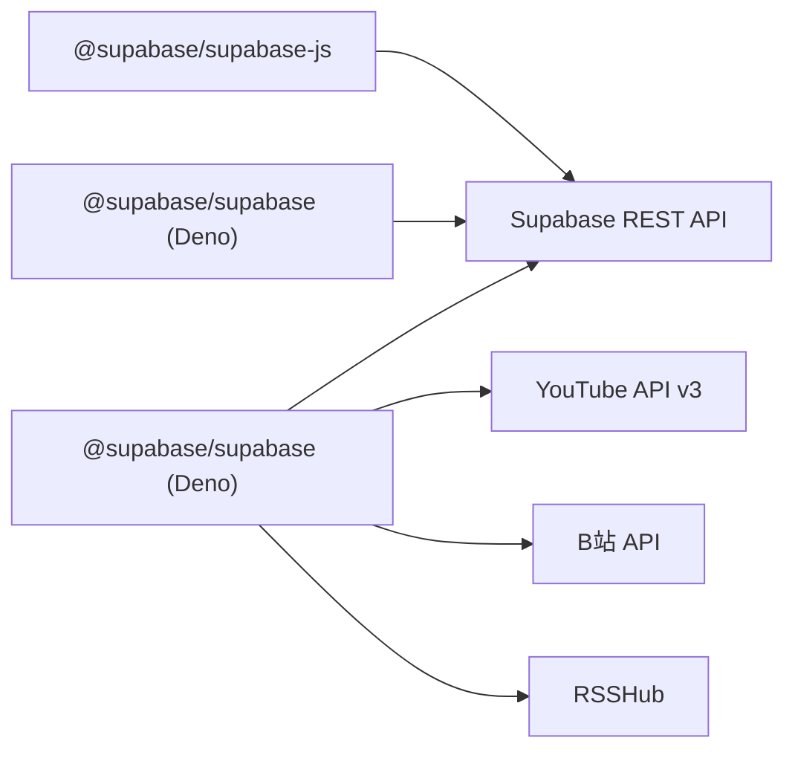

# API参考

<cite>
**本文档引用的文件**
- [PROJECT_CONTEXT.md](file://PROJECT_CONTEXT.md)
- [多平台中枢_PRD.md](file://多平台中枢_PRD.md)
</cite>

## 目录
1. [简介](#简介)
2. [项目结构](#项目结构)
3. [核心组件](#核心组件)
4. [架构总览](#架构总览)
5. [详细组件分析](#详细组件分析)
6. [依赖分析](#依赖分析)
7. [性能考量](#性能考量)
8. [故障排查指南](#故障排查指南)
9. [结论](#结论)
10. [附录](#附录)

## 简介
本API参考文档面向“多平台内容中枢”项目，系统性梳理Supabase REST API、Supabase Edge Functions以及Cron脚本内部接口规范，涵盖HTTP方法、URL模式、请求/响应格式、认证方式、错误码与状态码、速率限制、版本控制与向后兼容性等。文档同时提供调用示例、SDK使用要点与最佳实践，帮助前端SPA、Cron脚本与Edge Functions开发者高效集成与排障。

## 项目结构
项目采用Monorepo组织方式，结合Supabase官方推荐的Edge Functions组织方式（fat functions + _shared目录）与前端社区主流的apps/packages分层模式。核心目录与职责如下：
- apps/admin：配置管理端（React SPA）
- apps/h5：用户端H5（React SPA）
- packages/shared：前后端共享类型定义
- supabase/functions/_shared：Edge Functions共享代码（下划线前缀，不部署）
- supabase/functions/parse-url：URL解析与平台识别
- supabase/functions/bilibili-auth：B站扫码登录
- scripts/cron：GitHub Actions定时抓取脚本（平台适配器层、工具函数、主入口）
- .github/workflows/cron-fetch.yml：定时工作流

图表来源
- [PROJECT_CONTEXT.md: 52-141:52-141](file://PROJECT_CONTEXT.md#L52-L141)

章节来源
- [PROJECT_CONTEXT.md: 52-141:52-141](file://PROJECT_CONTEXT.md#L52-L141)

## 核心组件
- Supabase REST API：PostgREST自动生成的HTTPS RESTful API，支持标准CRUD与查询参数。
- Edge Functions：Deno函数，提供parse-url与bilibili-auth两类轻量逻辑。
- Cron脚本：Node.js定时任务，负责平台适配器抓取、数据清洗、UPSERT写入与状态回写。
- 数据模型：monitors与contents两张核心表，配合RLS策略与软删除机制。

章节来源
- [PROJECT_CONTEXT.md: 420-473:420-473](file://PROJECT_CONTEXT.md#L420-L473)
- [PROJECT_CONTEXT.md: 475-568:475-568](file://PROJECT_CONTEXT.md#L475-L568)
- [PROJECT_CONTEXT.md: 570-598:570-598](file://PROJECT_CONTEXT.md#L570-L598)

## 架构总览
系统由“前端SPA + Supabase后端 + GitHub Actions定时任务 + 外部平台API”构成，数据流如下：
- 写入流：GitHub Actions → 第三方API → 清洗标准化 → Supabase REST API（UPSERT）→ PostgreSQL
- 读取流：H5 SPA → Supabase REST API（SELECT is_display=true）→ PostgreSQL
- 配置流：Admin SPA → Edge Function（parse-url）→ Supabase REST API → PostgreSQL；Admin SPA → Edge Function（bilibili-auth）→ B站API → Supabase（存Cookie）

图表来源
- [PROJECT_CONTEXT.md: 169-239:169-239](file://PROJECT_CONTEXT.md#L169-L239)

章节来源
- [PROJECT_CONTEXT.md: 169-239:169-239](file://PROJECT_CONTEXT.md#L169-L239)

## 详细组件分析

### Supabase REST API 规范
- 协议与访问方式：HTTPS RESTful，PostgREST自动生成。
- 认证方式：
  - 前端SPA使用匿名密钥（anon key）进行RLS保护下的读写。
  - Cron脚本与Edge Functions使用服务角色密钥（service_role key）绕过RLS进行写入与内部操作。
- URL模式与方法：
  - 监控管理：GET/POST/PATCH/DELETE on /rest/v1/monitors
  - 内容查询：GET on /rest/v1/contents（支持分页、排序、过滤）
- 请求头：
  - apikey: {SUPABASE_ANON_KEY 或 SUPABASE_SERVICE_ROLE_KEY}
  - Authorization: Bearer {token}
  - Content-Type: application/json
  - Prefer: return=representation（创建/更新时返回完整对象）
  - Prefer: resolution=merge-duplicates（UPSERT模式）
- 响应格式：
  - 成功：包含data数组与status字段
  - 失败：包含code、message、details、hint等字段
- 查询示例：
  - 查询活动监控：GET /rest/v1/monitors?select=*&is_active=eq.true
  - 分页查询内容：GET /rest/v1/contents?select=*&is_display=eq.true&order=published_at.desc&limit=20&offset=0

章节来源
- [PROJECT_CONTEXT.md: 431-473:431-473](file://PROJECT_CONTEXT.md#L431-L473)

### Edge Functions API 规范
- 统一请求格式：
  - 方法：POST
  - 路径：/functions/v1/{function-name}
  - Content-Type: application/json
  - Authorization: Bearer {anon_key或auth_token}
  - Body：包含action字段及具体参数
- 统一响应格式：
  - 成功：{ success: true, data: { ... } }
  - 失败：{ success: false, error: { code, message } }
- parse-url 接口
  - 功能：根据URL特征识别平台并提取native_id，必要时补充display_name
  - 请求：{ url: string }
  - 成功响应：{ success: true, data: { platform, native_id, display_name? } }
  - 失败响应：{ success: false, error: { code, message } }
- bilibili-auth 接口
  - 获取二维码：POST body { action: "qrcode" } → { success: true, data: { qr_url, qrcode_key } }
  - 轮询扫码状态：POST body { action: "poll", qrcode_key: string } → { success: true, data: { status: "waiting"|"success"|"expired" } }

章节来源
- [PROJECT_CONTEXT.md: 475-568:475-568](file://PROJECT_CONTEXT.md#L475-L568)

### Cron脚本内部接口（平台适配器）
- 统一接口定义（适配器层）：
  - RawContent：原始内容数据结构，包含native_id、content_type、title、cover_url、original_url、published_at等字段
  - PlatformAdapter：统一接口，包含platform标识、fetchLatest(monitor)与fetchDisplayName(monitor)
- 平台适配器差异：
  - B站：空间API，Cookie鉴权，同平台请求间隔≥1.5秒
  - YouTube：Data API v3，API Key鉴权，每4小时对同一monitor执行一次
  - 知乎：RSSHub中转，API Key鉴权，同平台请求间隔≥1.5秒
- UPSERT去重策略：
  - 唯一索引：(platform, native_id)
  - 新内容INSERT，已存在内容UPDATE元数据，软删除记录禁止复活
  - 状态回写：last_sync_at、last_content_at、fail_count

章节来源
- [PROJECT_CONTEXT.md: 570-598:570-598](file://PROJECT_CONTEXT.md#L570-L598)
- [多平台中枢_PRD.md: 207-231:207-231](file://多平台中枢_PRD.md#L207-L231)

### 数据模型与关系

图表来源
- [多平台中枢_PRD.md: 328-361:328-361](file://多平台中枢_PRD.md#L328-L361)

章节来源
- [多平台中枢_PRD.md: 328-361:328-361](file://多平台中枢_PRD.md#L328-L361)

### API调用示例与SDK使用指南
- 前端SPA调用Supabase REST API：
  - 使用@supabase/supabase-js初始化客户端，设置SUPABASE_URL与SUPABASE_ANON_KEY
  - 读取内容：GET /rest/v1/contents?select=*&is_display=eq.true&order=published_at.desc&limit=20&offset=0
  - 写入监控：POST /rest/v1/monitors，Body包含platform、native_id、display_name、original_url、is_active等
- Edge Functions调用：
  - parse-url：POST /functions/v1/parse-url，Body { url }
  - bilibili-auth：POST /functions/v1/bilibili-auth，action为"qrcode"或"poll"
- Cron脚本调用Supabase REST API：
  - 使用@supabase/supabase（Deno）初始化客户端，设置SUPABASE_URL与SUPABASE_SERVICE_ROLE_KEY
  - UPSERT写入：通过Prefer: resolution=merge-duplicates实现ON CONFLICT更新
- 最佳实践：
  - 前端仅使用anon key，服务端使用service_role key
  - 严格遵守同平台请求间隔≥1.5秒，避免触发反爬
  - 使用RLS策略控制访问，确保敏感信息（如Cookie）不泄露
  - 对外暴露的Edge Functions仅做轻量逻辑，数据密集型操作通过PostgREST或Database Functions

章节来源
- [PROJECT_CONTEXT.md: 29-32:29-32](file://PROJECT_CONTEXT.md#L29-L32)
- [PROJECT_CONTEXT.md: 447-455:447-455](file://PROJECT_CONTEXT.md#L447-L455)
- [PROJECT_CONTEXT.md: 481-490:481-490](file://PROJECT_CONTEXT.md#L481-L490)
- [PROJECT_CONTEXT.md: 513-568:513-568](file://PROJECT_CONTEXT.md#L513-L568)

### 错误码规范与状态码说明
- Edge Function错误码：
  - UNKNOWN_PLATFORM：400，无法识别URL对应的平台
  - INVALID_URL：400，URL格式不合法
  - DUPLICATE_MONITOR：409，该博主已添加
  - BILIBILI_QRCODE_EXPIRED：400，B站二维码已过期
  - BILIBILI_COOKIE_INVALID：401，B站Cookie已失效
  - YOUTUBE_API_ERROR：502，YouTube API调用失败
  - RSSHUB_ERROR：502，RSSHub接口调用失败
  - INTERNAL_ERROR：500，未预期的内部错误
- Supabase REST API错误：
  - 失败响应包含code、message、details、hint等字段，便于定位问题

章节来源
- [PROJECT_CONTEXT.md: 600-614:600-614](file://PROJECT_CONTEXT.md#L600-L614)
- [PROJECT_CONTEXT.md: 466-473:466-473](file://PROJECT_CONTEXT.md#L466-L473)

### Rate Limiting、版本控制与向后兼容性
- 速率限制：
  - 同平台请求间隔≥1.5秒，防止触发平台频率限制
  - YouTube适配器每4小时对同一monitor执行一次，保护API配额
- 版本控制与兼容性：
  - Edge Functions采用连字符命名（kebab-case），URL友好
  - 共享类型在packages/shared中作为Single Source of Truth，Edge Functions通过手动同步保持一致
  - GitHub Actions工作流使用固定Node版本与pnpm锁定文件，保证构建一致性

章节来源
- [PROJECT_CONTEXT.md: 148-157:148-157](file://PROJECT_CONTEXT.md#L148-L157)
- [PROJECT_CONTEXT.md: 164-166:164-166](file://PROJECT_CONTEXT.md#L164-L166)
- [PROJECT_CONTEXT.md: 615-643:615-643](file://PROJECT_CONTEXT.md#L615-L643)

## 依赖分析
- 前端依赖：
  - @supabase/supabase-js：前端与Supabase交互
- Edge Functions依赖：
  - @supabase/supabase（Deno）：Edge Functions内使用
- Cron脚本依赖：
  - @supabase/supabase（Deno）：Supabase客户端
  - youtubei.js或googleapis：YouTube Data API v3调用
  - RSSHub：知乎内容中转
- 外部平台依赖：
  - B站空间API（Cookie鉴权）
  - YouTube Data API v3（API Key）
  - RSSHub（API Key鉴权）

图表来源
- [PROJECT_CONTEXT.md: 29-32:29-32](file://PROJECT_CONTEXT.md#L29-L32)

章节来源
- [PROJECT_CONTEXT.md: 29-32:29-32](file://PROJECT_CONTEXT.md#L29-L32)

## 性能考量
- 读取性能：
  - H5信息流仅查询is_display=true的记录，减少无效数据传输
  - 分页查询（limit/offset）与时间倒序（published_at desc）提升用户体验
- 写入性能：
  - UPSERT使用ON CONFLICT更新，避免重复插入
  - 软删除（is_display=false）保留历史数据，前端过滤减少查询负担
- 并发与互斥：
  - Cron互斥锁基于pg_advisory_lock，避免重复执行
  - 同平台请求间隔≥1.5秒，降低反爬风险
- 缓存与降级：
  - Cookie失效时H5继续展示历史缓存，保障可用性
  - RSSHub失败时降级策略，提升整体稳定性

章节来源
- [PROJECT_CONTEXT.md: 216-222:216-222](file://PROJECT_CONTEXT.md#L216-L222)
- [多平台中枢_PRD.md: 233-239:233-239](file://多平台中枢_PRD.md#L233-L239)

## 故障排查指南
- Edge Functions常见问题：
  - 二维码过期：检查qrcode_key是否超时，重新获取二维码
  - Cookie失效：检查B站Cookie有效性，重新扫码登录
  - 平台识别失败：确认URL格式与平台特征匹配
- Supabase REST API常见问题：
  - 401/403：检查apikey与Authorization头是否正确
  - 409冲突：确认(platform, native_id)唯一性
  - 502：外部平台API异常，检查上游服务状态
- Cron脚本常见问题：
  - 互斥锁未释放：检查上一轮是否异常退出
  - 平台限速：调整同平台请求间隔
  - UPSERT失败：检查唯一索引与软删除状态

章节来源
- [PROJECT_CONTEXT.md: 600-614:600-614](file://PROJECT_CONTEXT.md#L600-L614)
- [PROJECT_CONTEXT.md: 615-643:615-643](file://PROJECT_CONTEXT.md#L615-L643)

## 结论
本API参考文档系统梳理了Supabase REST API、Edge Functions与Cron脚本内部接口，明确了认证方式、请求/响应格式、错误码与状态码、速率限制与版本控制策略。通过RLS与服务角色密钥的安全隔离、同平台限速与互斥锁的并发控制、UPSERT去重与软删除的数据治理，项目实现了稳定、可扩展且安全的内容中枢架构。建议在实际集成中严格遵循本文档规范与最佳实践，确保系统的可靠性与可维护性。

## 附录
- 环境变量清单（节选）：
  - SUPABASE_URL、SUPABASE_ANON_KEY、SUPABASE_SERVICE_ROLE_KEY
  - YOUTUBE_API_KEY、BILIBILI_COOKIE_*、RSSHUB_URL、RSSHUB_API_KEY
- GitHub Actions工作流：
  - 每30分钟触发一次，支持手动触发，使用固定Node版本与pnpm锁定文件

章节来源
- [PROJECT_CONTEXT.md: 34-45:34-45](file://PROJECT_CONTEXT.md#L34-L45)
- [PROJECT_CONTEXT.md: 615-643:615-643](file://PROJECT_CONTEXT.md#L615-L643)