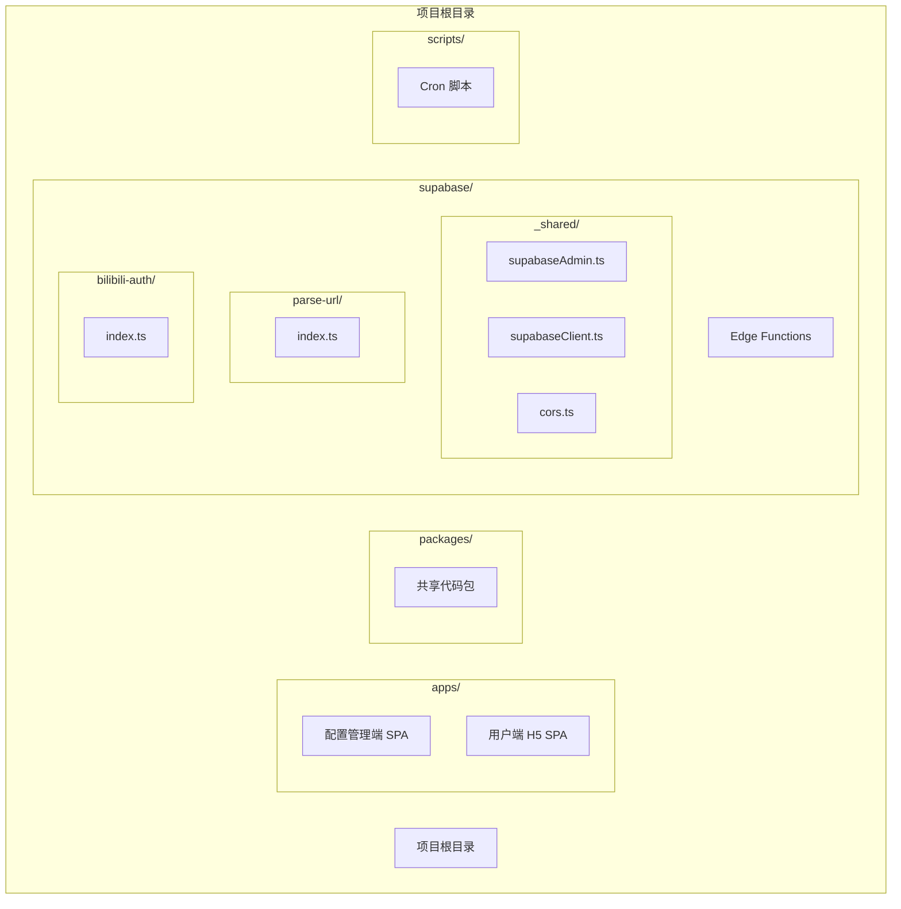
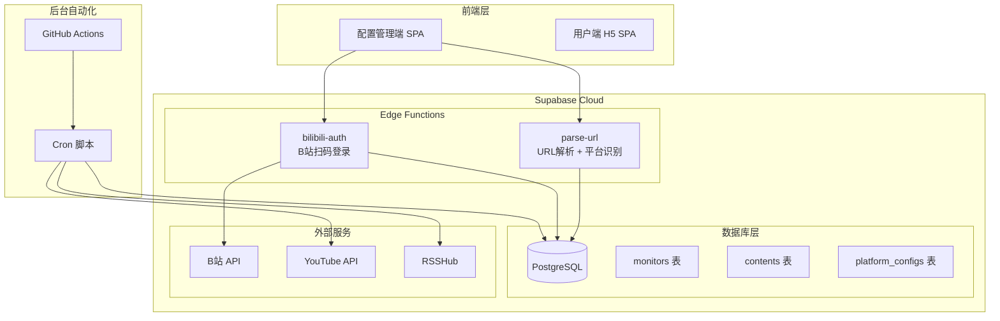
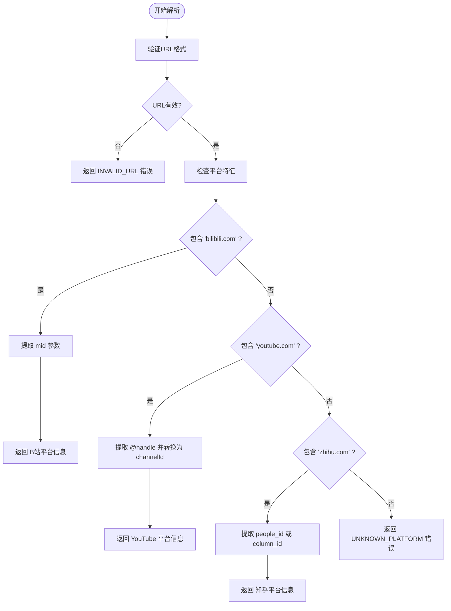
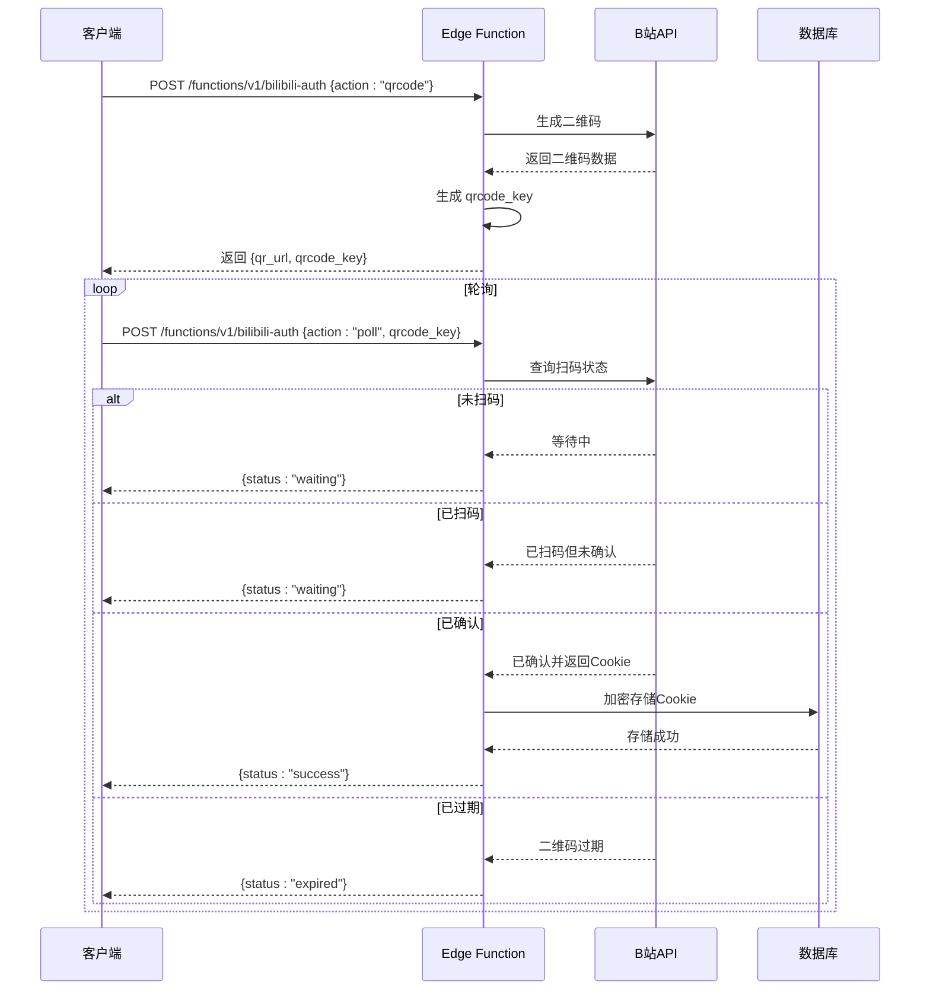
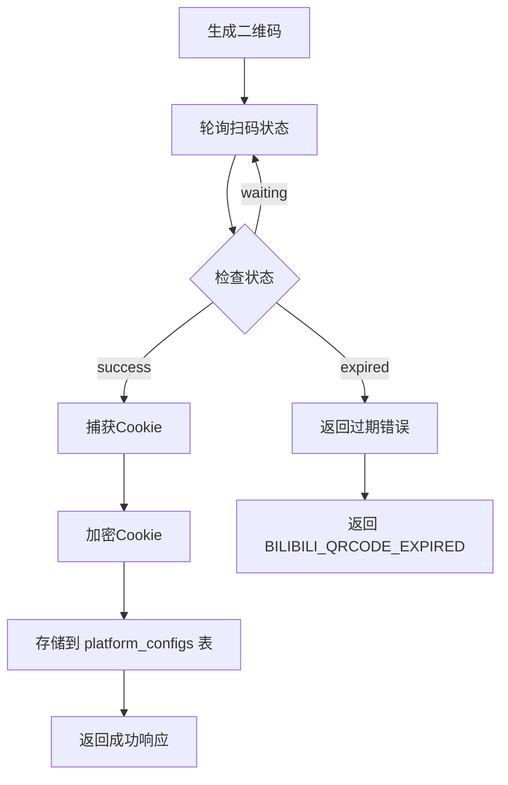
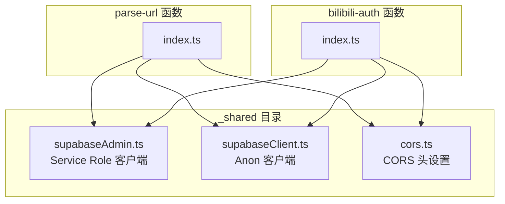
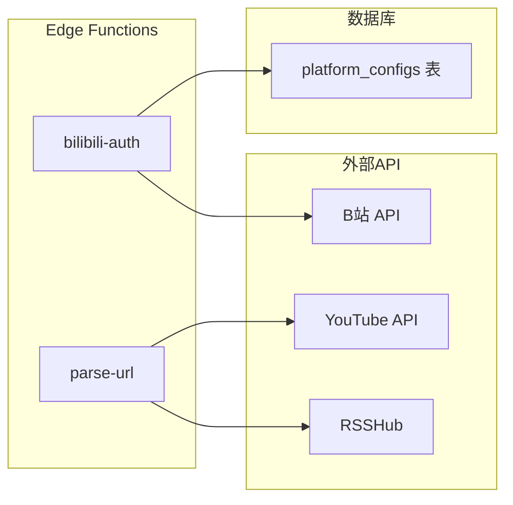

# Edge Functions API

<cite>
**本文档引用的文件**
- [PROJECT_CONTEXT.md](file://PROJECT_CONTEXT.md)
</cite>

## 目录
1. [简介](#简介)
2. [项目结构](#项目结构)
3. [核心组件](#核心组件)
4. [架构概览](#架构概览)
5. [详细组件分析](#详细组件分析)
6. [依赖关系分析](#依赖关系分析)
7. [性能考虑](#性能考虑)
8. [故障排除指南](#故障排除指南)
9. [结论](#结论)

## 简介

本文档为多平台内容中枢项目中的Supabase Edge Functions提供完整的API参考文档。项目采用Supabase Cloud的Edge Functions服务，使用Deno + TypeScript开发，实现了两个核心功能：URL解析和B站扫码登录授权。

Edge Functions作为轻量级serverless函数，部署在Supabase Cloud上，通过HTTPS POST接口提供服务。项目采用官方推荐的"fat functions + _shared"组织方式，将共享代码放入下划线前缀的_shared目录中（该目录不会被部署）。

## 项目结构

项目采用Monorepo结构，Edge Functions位于`supabase/functions/`目录下，具体结构如下：



**图表来源**
- [PROJECT_CONTEXT.md:97-113](file://PROJECT_CONTEXT.md#L97-L113)

**章节来源**
- [PROJECT_CONTEXT.md:49-142](file://PROJECT_CONTEXT.md#L49-L142)

## 核心组件

### Edge Functions通用规范

所有Edge Functions都遵循统一的请求/响应格式规范：

#### 通用请求格式
- **HTTP方法**: POST
- **路径**: `/functions/v1/{function-name}`
- **Content-Type**: application/json
- **Authorization**: Bearer {anon_key或auth_token}
- **请求体**: 
  - `"action"`: 字符串，指定具体操作类型
  - 其他特定于功能的字段

#### 通用响应格式
- **成功响应**:
  ```json
  {
    "success": true,
    "data": { }
  }
  ```

- **失败响应**:
  ```json
  {
    "success": false,
    "error": {
      "code": "ERROR_CODE",
      "message": "错误描述"
    }
  }
  ```

#### 错误码规范
| 错误码 | HTTP状态 | 含义 |
|---|---|---|
| `UNKNOWN_PLATFORM` | 400 | 无法识别 URL 对应的平台 |
| `INVALID_URL` | 400 | URL 格式不合法 |
| `DUPLICATE_MONITOR` | 409 | 该博主已添加 |
| `BILIBILI_QRCODE_EXPIRED` | 400 | B站二维码已过期 |
| `BILIBILI_COOKIE_INVALID` | 401 | B站 Cookie 已失效 |
| `YOUTUBE_API_ERROR` | 502 | YouTube API 调用失败 |
| `RSSHUB_ERROR` | 502 | RSSHub 接口调用失败 |
| `INTERNAL_ERROR` | 500 | 未预期的内部错误 |

**章节来源**
- [PROJECT_CONTEXT.md:475-614](file://PROJECT_CONTEXT.md#L475-L614)

## 架构概览



**图表来源**
- [PROJECT_CONTEXT.md:169-207](file://PROJECT_CONTEXT.md#L169-L207)

## 详细组件分析

### parse-url 函数

#### 功能概述
parse-url Edge Function负责根据URL特征识别平台并提取核心标识符，实现URL解析和平台识别功能。

#### 接口规范

**请求格式**
```json
POST /functions/v1/parse-url
Content-Type: application/json
Authorization: Bearer {anon_key或auth_token}

{
  "url": "https://space.bilibili.com/12345"
}
```

**成功响应**
```json
{
  "success": true,
  "data": {
    "platform": "bilibili",
    "native_id": "12345",
    "display_name": "B站_12345"
  }
}
```

**失败响应**
```json
{
  "success": false,
  "error": {
    "code": "UNKNOWN_PLATFORM",
    "message": "无法识别该平台"
  }
}
```

#### URL解析逻辑和平台识别规则



**图表来源**
- [PROJECT_CONTEXT.md:281-291](file://PROJECT_CONTEXT.md#L281-L291)

#### 平台识别详细规则

1. **B站识别规则**
   - URL包含 `bilibili.com`
   - 提取 `mid` 参数作为 `native_id`
   - 示例: `https://space.bilibili.com/12345` → `platform: "bilibili"`, `native_id: "12345"`

2. **YouTube识别规则**
   - URL包含 `youtube.com`
   - 提取 `@handle` 格式的频道标识符
   - 调用 `channels.list?forHandle=` API转换为 `channelId`
   - 将 `channelId` 作为 `native_id`

3. **知乎识别规则**
   - URL包含 `zhihu.com`
   - 提取 `people_id` 或 `column_id` 作为 `native_id`
   - 示例: `https://www.zhihu.com/people/username` → `platform: "zhihu"`

#### 调用示例

**成功示例**
```javascript
// 请求
fetch('/functions/v1/parse-url', {
  method: 'POST',
  headers: {
    'Content-Type': 'application/json',
    'Authorization': 'Bearer YOUR_ANON_KEY'
  },
  body: JSON.stringify({
    url: 'https://space.bilibili.com/12345'
  })
})

// 响应
{
  "success": true,
  "data": {
    "platform": "bilibili",
    "native_id": "12345",
    "display_name": "B站_12345"
  }
}
```

**错误示例**
```javascript
// 请求
{
  url: 'https://invalid-platform.com/123'
}

// 响应
{
  "success": false,
  "error": {
    "code": "UNKNOWN_PLATFORM",
    "message": "无法识别该平台"
  }
}
```

**章节来源**
- [PROJECT_CONTEXT.md:511-537](file://PROJECT_CONTEXT.md#L511-L537)
- [PROJECT_CONTEXT.md:281-291](file://PROJECT_CONTEXT.md#L281-L291)

### bilibili-auth 函数

#### 功能概述
bilibili-auth Edge Function实现B站扫码登录的完整流程，包括二维码生成、扫码状态轮询和Cookie捕获存储。

#### 接口规范

**获取二维码**
```json
POST /functions/v1/bilibili-auth

请求:
{
  "action": "qrcode"
}

响应:
{
  "success": true,
  "data": {
    "qr_url": "https://...",
    "qrcode_key": "xxx"
  }
}
```

**轮询扫码状态**
```json
POST /functions/v1/bilibili-auth

请求:
{
  "action": "poll",
  "qrcode_key": "xxx"
}

响应（等待中）:
{
  "success": true,
  "data": { "status": "waiting" }
}

响应（成功）:
{
  "success": true,
  "data": { "status": "success" }
}

响应（过期）:
{
  "success": true,
  "data": { "status": "expired" }
}
```

#### 二维码生成和扫码流程



**图表来源**
- [PROJECT_CONTEXT.md:292-299](file://PROJECT_CONTEXT.md#L292-L299)

#### Cookie捕获和存储流程



**图表来源**
- [PROJECT_CONTEXT.md:292-299](file://PROJECT_CONTEXT.md#L292-L299)

#### 调用示例

**获取二维码**
```javascript
// 请求
const qrResponse = await fetch('/functions/v1/bilibili-auth', {
  method: 'POST',
  headers: {
    'Content-Type': 'application/json',
    'Authorization': 'Bearer YOUR_ANON_KEY'
  },
  body: JSON.stringify({
    action: 'qrcode'
  })
})

// 响应
{
  "success": true,
  "data": {
    "qr_url": "https://qr.bilibili.com/qrcode/...",
    "qrcode_key": "abc123xyz"
  }
}
```

**轮询扫码状态**
```javascript
// 轮询直到成功或过期
let pollResponse;
do {
  pollResponse = await fetch('/functions/v1/bilibili-auth', {
    method: 'POST',
    headers: {
      'Content-Type': 'application/json',
      'Authorization': 'Bearer YOUR_ANON_KEY'
    },
    body: JSON.stringify({
      action: 'poll',
      qrcode_key: 'abc123xyz'
    })
  })
  
  const result = await pollResponse.json();
  console.log('扫码状态:', result.data.status);
  
  // 等待一段时间后继续轮询
  await new Promise(resolve => setTimeout(resolve, 2000));
} while (result.data.status === 'waiting')
```

**章节来源**
- [PROJECT_CONTEXT.md:539-568](file://PROJECT_CONTEXT.md#L539-L568)
- [PROJECT_CONTEXT.md:292-299](file://PROJECT_CONTEXT.md#L292-L299)

## 依赖关系分析

### Edge Functions共享依赖



**图表来源**
- [PROJECT_CONTEXT.md:99-102](file://PROJECT_CONTEXT.md#L99-L102)

### 外部依赖关系



**图表来源**
- [PROJECT_CONTEXT.md:185-187](file://PROJECT_CONTEXT.md#L185-L187)

**章节来源**
- [PROJECT_CONTEXT.md:99-102](file://PROJECT_CONTEXT.md#L99-L102)

## 性能考虑

### Edge Functions设计原则

1. **轻量级设计**: Edge Functions仅用于轻量逻辑，避免复杂的数据处理
2. **共享代码复用**: 使用_shared目录存放公共代码，减少重复
3. **异步处理**: 利用Deno的异步特性处理外部API调用
4. **错误处理**: 实现完善的错误处理机制，确保函数稳定性

### 调用频率和限制

- **parse-url**: 用于URL解析，调用频率较低
- **bilibili-auth**: 二维码轮询，建议2秒间隔轮询一次
- **外部API限制**: 遵循各平台API的速率限制和使用条款

## 故障排除指南

### 常见问题和解决方案

#### URL解析失败
- **症状**: 返回 `UNKNOWN_PLATFORM` 错误
- **原因**: URL不在支持的平台范围内
- **解决方案**: 确认URL格式正确且属于支持的平台

#### 二维码过期
- **症状**: 返回 `BILIBILI_QRCODE_EXPIRED` 错误
- **原因**: 二维码超过有效期
- **解决方案**: 重新获取新的二维码

#### Cookie无效
- **症状**: 返回 `BILIBILI_COOKIE_INVALID` 错误
- **原因**: 存储的Cookie已过期或失效
- **解决方案**: 重新执行扫码登录流程

#### 内部服务器错误
- **症状**: 返回 `INTERNAL_ERROR` 错误
- **原因**: Edge Functions内部异常
- **解决方案**: 检查函数日志，重新部署或联系支持

### 调试建议

1. **启用日志**: 在Edge Functions中添加适当的日志记录
2. **测试环境**: 在开发环境中充分测试各种边界情况
3. **错误监控**: 设置适当的错误监控和告警机制
4. **超时处理**: 为外部API调用设置合理的超时时间

**章节来源**
- [PROJECT_CONTEXT.md:600-614](file://PROJECT_CONTEXT.md#L600-L614)

## 结论

本项目中的Edge Functions为多平台内容中枢提供了关键的轻量级服务支持。通过parse-url函数实现的URL解析和平台识别，以及bilibili-auth函数实现的扫码登录流程，为整个系统的数据采集和用户认证奠定了基础。

Edge Functions的设计遵循了Supabase官方的最佳实践，采用fat functions模式和_shared目录组织方式，确保了代码的可维护性和可扩展性。同时，完善的错误处理机制和统一的API规范为前端集成提供了便利。

未来可以考虑的功能增强包括：
- 更多平台的支持和识别规则
- Edge Functions的性能监控和优化
- 更丰富的错误诊断和日志记录
- 自动化的健康检查和故障恢复机制