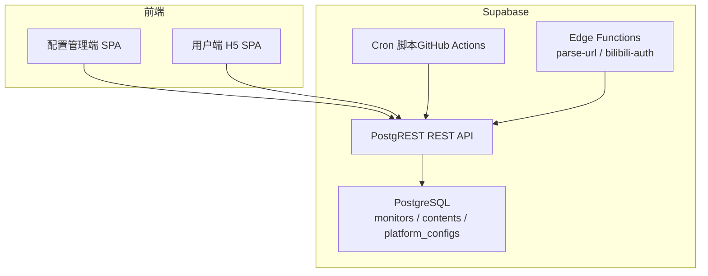
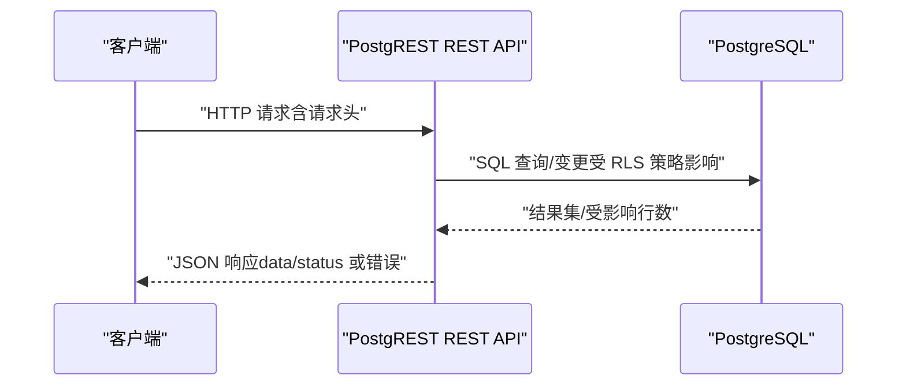
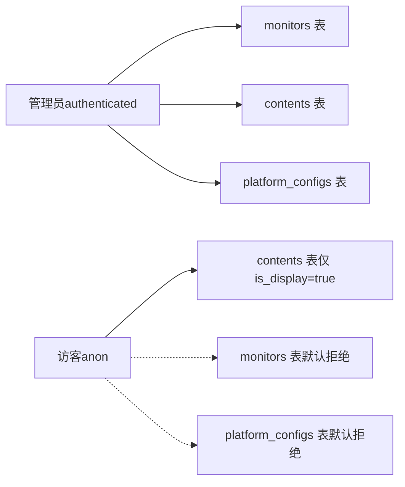

# Supabase REST API

<cite>
**本文引用的文件**   
- [PROJECT_CONTEXT.md](file://PROJECT_CONTEXT.md)
- [多平台中枢_PRD.md](file://多平台中枢_PRD.md)
</cite>

## 目录
1. [简介](#简介)
2. [项目结构](#项目结构)
3. [核心组件](#核心组件)
4. [架构总览](#架构总览)
5. [详细组件分析](#详细组件分析)
6. [依赖分析](#依赖分析)
7. [性能考虑](#性能考虑)
8. [故障排查指南](#故障排查指南)
9. [结论](#结论)
10. [附录](#附录)

## 简介
本文件为 Supabase REST API 的详细接口文档，聚焦 PostgREST 自动生成的 RESTful API 规范，覆盖 monitors、contents、platform_configs 三大核心表的 CRUD 与查询能力，说明 HTTP 方法、URL 模式、查询参数与过滤条件，给出请求头规范、响应格式与常见调用示例，并解释 RLS 策略对访问权限的影响及不同角色的权限边界。

## 项目结构
- 项目采用 Monorepo 结构，Supabase 位于 supabase 目录，包含数据库迁移、种子数据、配置与 Edge Functions。
- 数据库包含三张核心表：monitors、contents、platform_configs。
- 前端（Admin SPA 与 H5 SPA）通过 Supabase REST API 与数据库交互；Cron 脚本与 Edge Functions 通过 Supabase REST API 或 Service Role Key 完成写入与内部操作。

**章节来源**
- [PROJECT_CONTEXT.md: 97-141:97-141](file://PROJECT_CONTEXT.md#L97-L141)

## 核心组件
- monitors 表：存储监控目标（平台、唯一标识、显示名称、状态、开关、时间戳等），支持 CRUD。
- contents 表：存储聚合内容卡片（平台、内容 ID、类型、标题、封面、原文链接、发布时间、归属监控、展示状态、时间戳等），支持分页查询与筛选。
- platform_configs 表：存储平台配置与敏感信息（如加密的 Cookie），管理员可读写，访客不可见。

**章节来源**
- [PROJECT_CONTEXT.md: 364-400:364-400](file://PROJECT_CONTEXT.md#L364-L400)
- [多平台中枢_PRD.md: 328-361:328-361](file://多平台中枢_PRD.md#L328-L361)

## 架构总览
Supabase REST API 由 PostgREST 自动生成，遵循标准 RESTful 约定。请求通过 apikey 或 Authorization 进行身份鉴别，Prefer 头用于控制返回体与 UPSERT 行为。RLS 策略决定不同角色的访问范围。

**图表来源**
- [PROJECT_CONTEXT.md: 431-473:431-473](file://PROJECT_CONTEXT.md#L431-L473)

**章节来源**
- [PROJECT_CONTEXT.md: 431-473:431-473](file://PROJECT_CONTEXT.md#L431-L473)

## 详细组件分析

### monitors 表接口规范
- 基本路径
  - GET /rest/v1/monitors?select=*&is_active=eq.true
  - POST /rest/v1/monitors
  - PATCH /rest/v1/monitors?id=eq.{id}
  - DELETE /rest/v1/monitors?id=eq.{id}
- 查询语法与过滤
  - select=*：返回所有列
  - is_active=eq.true：仅查询开启的监控
  - id=eq.{id}：按主键过滤
- 排序与分页
  - 未指定 order 时默认顺序由数据库定义；可通过 order=... 指定排序
  - 分页通过 limit 与 offset 控制
- 请求头
  - apikey：使用 SUPABASE_ANON_KEY 或 SUPABASE_SERVICE_ROLE_KEY
  - Authorization：Bearer {token}（管理员登录后）
  - Content-Type：application/json
  - Prefer：return=representation（创建/更新返回完整对象）
- 响应
  - 成功：data 为数组，status 为 200/201
  - 失败：包含 code/message/details/hint
- 角色与 RLS
  - 管理员（authenticated）：对 monitors 全部读写
  - 访客（anon）：默认拒绝（不可见）

示例调用
- 查询活跃监控列表
  - GET /rest/v1/monitors?select=*&is_active=eq.true
- 新增监控目标
  - POST /rest/v1/monitors
  - Body：包含 platform、native_id、display_name、original_url、is_active 等字段
  - Prefer：return=representation
- 更新监控目标
  - PATCH /rest/v1/monitors?id=eq.{id}
  - Body：更新字段（如 is_active、display_name）
  - Prefer：return=representation
- 删除监控目标
  - DELETE /rest/v1/monitors?id=eq.{id}

**章节来源**
- [PROJECT_CONTEXT.md: 435-445:435-445](file://PROJECT_CONTEXT.md#L435-L445)
- [PROJECT_CONTEXT.md: 447-455:447-455](file://PROJECT_CONTEXT.md#L447-L455)
- [PROJECT_CONTEXT.md: 460-473:460-473](file://PROJECT_CONTEXT.md#L460-L473)
- [PROJECT_CONTEXT.md: 364-374:364-374](file://PROJECT_CONTEXT.md#L364-L374)

### contents 表接口规范
- 基本路径
  - GET /rest/v1/contents?select=*&is_display=eq.true&order=published_at.desc&limit=20&offset=0
- 查询语法与过滤
  - is_display=eq.true：仅展示未软删除的内容
  - order=published_at.desc：按发布时间倒序
  - limit/offset：分页控制
  - platform=eq.{platform}：按平台筛选（如 bilibili、youtube 等）
- 排序规则
  - 默认按 published_at 降序
- 分页机制
  - 每页固定数量（如 20），通过 offset 控制偏移
- 请求头
  - apikey：使用 SUPABASE_ANON_KEY（访客）
  - Authorization：Bearer {token}（管理员登录后）
  - Content-Type：application/json
  - Prefer：resolution=merge-duplicates（UPSERT 模式）
- 响应
  - 成功：data 为数组，status 为 200
  - 失败：包含 code/message/details/hint
- 角色与 RLS
  - 管理员：对 contents 全部读写
  - 访客：仅可读取 is_display=true 的记录

示例调用
- 分页获取内容信息流
  - GET /rest/v1/contents?select=*&is_display=eq.true&order=published_at.desc&limit=20&offset=0
- 按平台筛选
  - GET /rest/v1/contents?select=*&is_display=eq.true&platform=eq.bilibili&order=published_at.desc&limit=20&offset=0

**章节来源**
- [PROJECT_CONTEXT.md: 435-445:435-445](file://PROJECT_CONTEXT.md#L435-L445)
- [PROJECT_CONTEXT.md: 447-455:447-455](file://PROJECT_CONTEXT.md#L447-L455)
- [PROJECT_CONTEXT.md: 460-473:460-473](file://PROJECT_CONTEXT.md#L460-L473)
- [PROJECT_CONTEXT.md: 376-388:376-388](file://PROJECT_CONTEXT.md#L376-L388)

### platform_configs 表接口规范
- 基本路径
  - GET /rest/v1/platform_configs?select=*&...（按需过滤）
  - POST /rest/v1/platform_configs
  - PATCH /rest/v1/platform_configs?id=eq.{id}
  - DELETE /rest/v1/platform_configs?id=eq.{id}
- 查询语法与过滤
  - select=*：返回所有列
  - id=eq.{id}：按主键过滤
- 请求头
  - apikey：使用 SUPABASE_SERVICE_ROLE_KEY（仅 Cron 与 Edge Functions）
  - Authorization：Bearer {token}（管理员登录后）
  - Content-Type：application/json
- 响应
  - 成功：data 为数组，status 为 200/201
  - 失败：包含 code/message/details/hint
- 角色与 RLS
  - 管理员：对 platform_configs 全部读写
  - 访客：默认拒绝（不可见）

说明
- 该表用于存储敏感信息（如加密的 Cookie），RLS 策略仅允许管理员访问。

**章节来源**
- [PROJECT_CONTEXT.md: 390-400:390-400](file://PROJECT_CONTEXT.md#L390-L400)
- [PROJECT_CONTEXT.md: 447-455:447-455](file://PROJECT_CONTEXT.md#L447-L455)
- [PROJECT_CONTEXT.md: 460-473:460-473](file://PROJECT_CONTEXT.md#L460-L473)

### Edge Functions 接口（与 REST API 的关系）
- Edge Functions 通过 /functions/v1/{function-name} 调用，请求/响应格式统一。
- parse-url：根据 URL 解析平台与标识。
- bilibili-auth：二维码生成与轮询扫码状态。
- 与 REST API 的关系：Edge Functions 通常用于轻量逻辑（URL 解析、扫码授权），数据密集型操作通过 REST API 或数据库函数完成。

**章节来源**
- [PROJECT_CONTEXT.md: 475-568:475-568](file://PROJECT_CONTEXT.md#L475-L568)

## 依赖分析
- 角色与密钥
  - SUPABASE_ANON_KEY：前端 SPA 使用，受 RLS 策略约束
  - SUPABASE_SERVICE_ROLE_KEY：Cron 与 Edge Functions 使用，绕过 RLS
  - 管理员登录后：Authorization: Bearer {token}，角色为 authenticated
- RLS 策略
  - monitors：管理员全部读写；访客默认拒绝
  - contents：管理员全部读写；访客仅可读取 is_display=true
  - platform_configs：管理员全部读写；访客默认拒绝

**图表来源**
- [PROJECT_CONTEXT.md: 355-400:355-400](file://PROJECT_CONTEXT.md#L355-L400)

**章节来源**
- [PROJECT_CONTEXT.md: 355-400:355-400](file://PROJECT_CONTEXT.md#L355-L400)

## 性能考虑
- 分页与排序
  - 使用 limit/offset 控制分页，order=published_at.desc 保证热点内容优先展示
- 去重与 UPSERT
  - Prefer: resolution=merge-duplicates 用于合并重复记录，避免重复写入
- 软删除与生命周期
  - contents 表通过 is_display 控制展示，pg_cron 定期将超期记录标记为不可见，降低查询负载
- 并发与互斥
  - Cron 互斥锁避免重复执行，同平台请求间隔 ≥ 1.5s，降低平台反爬压力

**章节来源**
- [PROJECT_CONTEXT.md: 447-455:447-455](file://PROJECT_CONTEXT.md#L447-L455)
- [PROJECT_CONTEXT.md: 233-239:233-239](file://PROJECT_CONTEXT.md#L233-L239)

## 故障排查指南
- 常见错误码与含义
  - PGRST116：请求 JSON 对象但返回多行或无行
  - 其他 PostgREST 错误：根据 code/message/details/hint 定位问题
- Edge Function 错误码
  - UNKNOWN_PLATFORM、INVALID_URL、DUPLICATE_MONITOR、BILIBILI_QRCODE_EXPIRED、BILIBILI_COOKIE_INVALID、YOUTUBE_API_ERROR、RSSHUB_ERROR、INTERNAL_ERROR
- 建议排查步骤
  - 检查请求头：apikey、Authorization、Content-Type、Prefer
  - 核对过滤条件与排序参数
  - 确认角色与 RLS 策略是否允许访问
  - 对于 Edge Functions，检查 action 参数与输入格式

**章节来源**
- [PROJECT_CONTEXT.md: 460-473:460-473](file://PROJECT_CONTEXT.md#L460-L473)
- [PROJECT_CONTEXT.md: 600-614:600-614](file://PROJECT_CONTEXT.md#L600-L614)

## 结论
本接口文档基于 PostgREST 自动生成的 REST API，结合 RLS 策略与角色模型，明确了 monitors、contents、platform_configs 三张核心表的 CRUD 与查询能力、请求头规范、响应格式与调用示例。管理员与访客的权限边界清晰，配合 Prefer 头与软删除机制，既保障了数据一致性，又提升了用户体验。

## 附录

### 请求头规范
- apikey：Supabase Anon Key 或 Service Role Key
- Authorization：Bearer {token}（管理员登录后）
- Content-Type：application/json
- Prefer：
  - return=representation：创建/更新返回完整对象
  - resolution=merge-duplicates：UPSERT 模式

**章节来源**
- [PROJECT_CONTEXT.md: 447-455:447-455](file://PROJECT_CONTEXT.md#L447-L455)

### 响应格式
- 成功（200/201）
  - {
    - "data": [ ... ],
    - "status": 200
    - }
- 失败
  - {
    - "code": "PGRST116",
    - "message": "JSON object requested, multiple (or no) rows returned",
    - "details": "...",
    - "hint": "..."
    - }

**章节来源**
- [PROJECT_CONTEXT.md: 457-473:457-473](file://PROJECT_CONTEXT.md#L457-L473)

### 典型调用示例
- 查询活跃监控列表
  - GET /rest/v1/monitors?select=*&is_active=eq.true
- 分页获取内容信息流
  - GET /rest/v1/contents?select=*&is_display=eq.true&order=published_at.desc&limit=20&offset=0
- 新增监控目标
  - POST /rest/v1/monitors
  - Header: Prefer: return=representation
- 更新监控目标
  - PATCH /rest/v1/monitors?id=eq.{id}
  - Header: Prefer: return=representation
- 删除监控目标
  - DELETE /rest/v1/monitors?id=eq.{id}
- 平台配置写入（Cron/Edge Functions）
  - POST /rest/v1/platform_configs
  - Header: apikey: {SUPABASE_SERVICE_ROLE_KEY}

**章节来源**
- [PROJECT_CONTEXT.md: 435-445:435-445](file://PROJECT_CONTEXT.md#L435-L445)
- [PROJECT_CONTEXT.md: 447-455:447-455](file://PROJECT_CONTEXT.md#L447-L455)