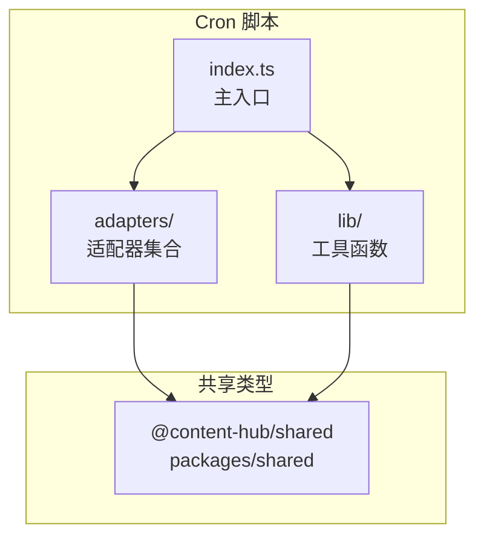
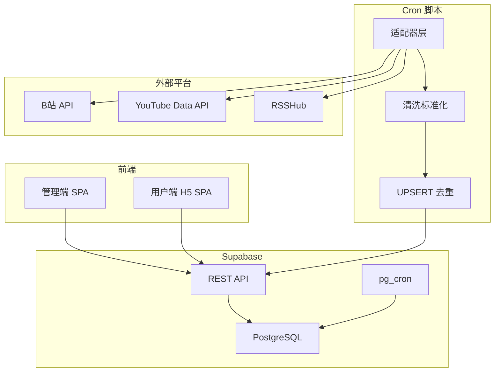
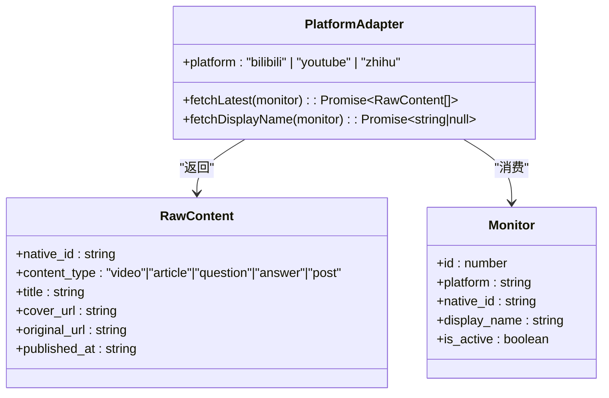
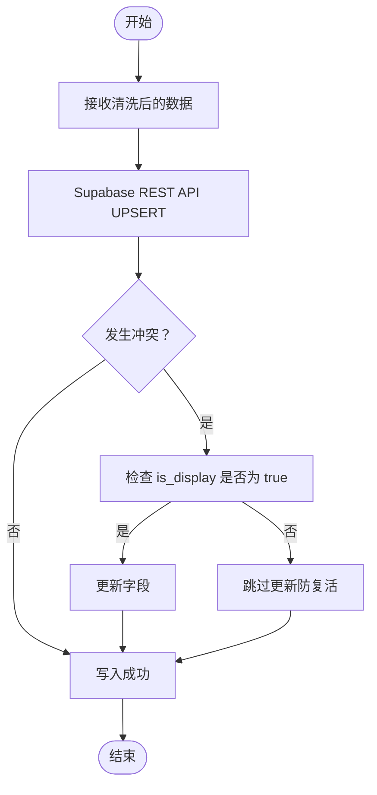
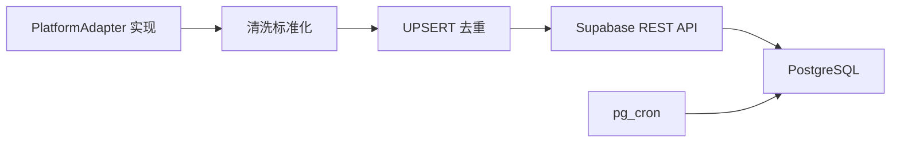
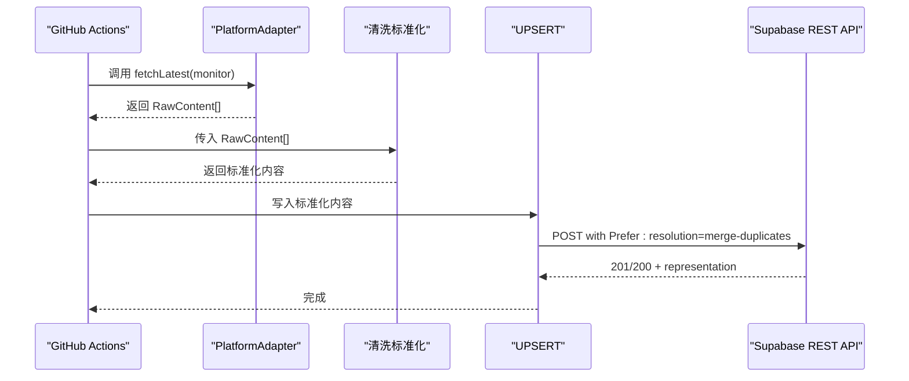

# 内部接口规范

<cite>
**本文引用的文件**
- [PROJECT_CONTEXT.md](file://PROJECT_CONTEXT.md)
- [目录规范:55-142](file://PROJECT_CONTEXT.md#L55-L142)
- [共享类型同步策略:159-166](file://PROJECT_CONTEXT.md#L159-L166)
- [平台适配器接口定义:570-598](file://PROJECT_CONTEXT.md#L570-L598)
- [数据流约束:224-239](file://PROJECT_CONTEXT.md#L224-L239)
- [核心业务模块:243-271](file://PROJECT_CONTEXT.md#L243-L271)
- [Cron 脚本内部接口（平台适配器）:570-598](file://PROJECT_CONTEXT.md#L570-L598)
- [Supabase REST API 规范:431-473](file://PROJECT_CONTEXT.md#L431-L473)
- [Edge Function 接口规范:475-568](file://PROJECT_CONTEXT.md#L475-L568)
- [GitHub Actions 工作流规范:615-643](file://PROJECT_CONTEXT.md#L615-L643)
</cite>

## 目录
1. [简介](#简介)
2. [项目结构](#项目结构)
3. [核心组件](#核心组件)
4. [架构总览](#架构总览)
5. [组件详解](#组件详解)
6. [依赖关系分析](#依赖关系分析)
7. [性能考量](#性能考量)
8. [故障排查指南](#故障排查指南)
9. [结论](#结论)
10. [附录](#附录)

## 简介
本文件面向 Cron 脚本内部接口的技术参考，聚焦平台适配器层的统一接口规范、数据结构与模型、数据清洗标准化流程、UPSERT 去重逻辑、软删除生命周期、共享类型系统的同步机制与版本管理策略，并提供扩展新平台适配器的步骤与最佳实践。

## 项目结构
- 适配器层位于 Cron 脚本内部，统一接口不对外暴露，仅在 GitHub Actions 定时任务中调用。
- 适配器目录包含 TypeScript 模块，分别对接不同平台的数据源与鉴权方式。
- 共享类型通过 monorepo workspace 在前端与 Cron 脚本中复用；Edge Functions 由于运行环境限制，需手动同步类型副本。

**图表来源**
- [目录规范:55-142](file://PROJECT_CONTEXT.md#L55-L142)

**章节来源**
- [目录规范:55-142](file://PROJECT_CONTEXT.md#L55-L142)

## 核心组件
- 平台适配器接口：统一的抓取契约，屏蔽平台差异。
- RawContent 数据结构：适配器返回的原始内容载体。
- Monitor 模型：监控目标实体，驱动适配器抓取。
- 数据清洗标准化：统一字段、格式与时间戳。
- UPSERT 去重：基于唯一索引的幂等写入。
- 软删除生命周期：基于时间窗口的软删除策略。
- 共享类型系统：Monorepo 内的类型同步与版本管理。

**章节来源**
- [平台适配器接口定义:570-598](file://PROJECT_CONTEXT.md#L570-L598)
- [数据流约束:224-239](file://PROJECT_CONTEXT.md#L224-L239)
- [共享类型同步策略:159-166](file://PROJECT_CONTEXT.md#L159-L166)

## 架构总览
Cron 脚本内部接口围绕“适配器层 + 清洗 + UPSERT”的流水线组织，严格遵循“前端不直接调用第三方平台 API”“Cron 不直连数据库”的约束。

**图表来源**
- [数据流约束:224-239](file://PROJECT_CONTEXT.md#L224-L239)
- [核心业务模块:243-271](file://PROJECT_CONTEXT.md#L243-L271)
- [Cron 脚本内部接口（平台适配器）:570-598](file://PROJECT_CONTEXT.md#L570-L598)

## 组件详解

### 平台适配器接口规范
- 统一接口：每个适配器实现统一的接口，屏蔽平台差异。
- 关键方法：
  - 获取博主最新内容：fetchLatest(monitor)
  - 获取昵称（新增时同步调用）：fetchDisplayName(monitor)
- 平台标识：readonly platform 字段限定为内置枚举值。
- 适配器差异：数据源、鉴权方式、限速策略因平台而异。

**图表来源**
- [平台适配器接口定义:570-598](file://PROJECT_CONTEXT.md#L570-L598)

**章节来源**
- [平台适配器接口定义:570-598](file://PROJECT_CONTEXT.md#L570-L598)

### RawContent 数据结构
- 字段含义与约束：统一承载内容 ID、类型、标题、封面、原文链接、发布时间（ISO 8601 UTC）。
- 作用：作为适配器输出与清洗标准化的中间载体，确保后续处理一致性。

**章节来源**
- [平台适配器接口定义:570-598](file://PROJECT_CONTEXT.md#L570-L598)

### Monitor 模型
- 作用：描述监控目标，驱动适配器抓取流程。
- 关键字段：平台标识、原生 ID、显示名称、是否激活等。
- 与适配器的关系：适配器以 Monitor 为输入，产出 RawContent 列表。

**章节来源**
- [平台适配器接口定义:570-598](file://PROJECT_CONTEXT.md#L570-L598)

### 数据清洗标准化流程
- 目标：将来自不同平台的 RawContent 统一为一致的数据形态，便于后续写入与展示。
- 关键点：字段对齐、类型收敛、时间格式统一、URL 规范化、必要字段补全。
- 输入：适配器返回的 RawContent[]
- 输出：清洗后的标准化内容，进入 UPSERT 步骤。

**章节来源**
- [数据流约束:224-239](file://PROJECT_CONTEXT.md#L224-L239)

### UPSERT 去重逻辑
- 去重依据：(platform, native_id) 唯一索引。
- 写入策略：ON CONFLICT DO UPDATE，仅当 is_display = true 时才更新，防止软删除记录被复活。
- 请求方式：通过 Supabase REST API 的 upsert 模式（Prefer: resolution=merge-duplicates）。

**图表来源**
- [Supabase REST API 规范:431-473](file://PROJECT_CONTEXT.md#L431-L473)

**章节来源**
- [Supabase REST API 规范:431-473](file://PROJECT_CONTEXT.md#L431-L473)

### 软删除生命周期
- 触发机制：pg_cron 定时任务。
- 删除条件：created_at 小于阈值（例如 30 天）。
- 行为：将 is_display 设为 false，实现软删除，避免物理删除带来的复杂性与数据回溯成本。

**章节来源**
- [数据流约束:224-239](file://PROJECT_CONTEXT.md#L224-L239)

### 共享类型系统的同步机制与版本管理
- 单一真实来源：packages/shared 提供共享类型，前端与 Cron 脚本通过 workspace 依赖复用。
- Edge Functions 类型同步：由于 Deno 环境限制，需在 _shared/types.ts 中维护副本，并标注同步来源路径，确保类型一致性。
- 版本管理建议：通过包版本升级与变更日志管理类型演进，保持跨模块一致性。

**章节来源**
- [共享类型同步策略:159-166](file://PROJECT_CONTEXT.md#L159-L166)

### 扩展新平台适配器的步骤
- 新建适配器文件：在 scripts/cron/src/adapters 下新增平台适配器模块。
- 实现统一接口：提供 platform、fetchLatest、fetchDisplayName 方法。
- 配置鉴权与限速：根据平台特性设置 API Key/Cookie 与请求间隔。
- 集成到主流程：在 Cron 主入口注册新适配器，确保按平台串行、平台间可并行。
- 类型同步：如涉及新类型，先在 packages/shared 更新，再同步至 Edge Functions 的副本。

**章节来源**
- [目录规范:55-142](file://PROJECT_CONTEXT.md#L55-L142)
- [平台适配器接口定义:570-598](file://PROJECT_CONTEXT.md#L570-L598)

## 依赖关系分析
- 适配器层依赖共享类型与工具函数（清洗、UPSERT、告警）。
- Cron 主入口负责编排适配器执行顺序与并发策略。
- 写入阶段依赖 Supabase REST API 的 upsert 模式与 PostgreSQL 的唯一索引。
- 软删除依赖 pg_cron 的定时任务。

**图表来源**
- [数据流约束:224-239](file://PROJECT_CONTEXT.md#L224-L239)
- [Supabase REST API 规范:431-473](file://PROJECT_CONTEXT.md#L431-L473)

**章节来源**
- [数据流约束:224-239](file://PROJECT_CONTEXT.md#L224-L239)
- [Supabase REST API 规范:431-473](file://PROJECT_CONTEXT.md#L431-L473)

## 性能考量
- 平台内限速：同平台请求间隔 ≥ 1.5 秒，降低反爬风险与 API 限流影响。
- 并发策略：平台间可并行，平台内串行，平衡吞吐与稳定性。
- 写入幂等：UPSERT 保证重复写入不产生重复记录，减少无效请求。
- 软删除：通过时间窗口清理历史数据，避免表膨胀。

**章节来源**
- [数据流约束:224-239](file://PROJECT_CONTEXT.md#L224-L239)

## 故障排查指南
- 适配器调用失败：检查平台鉴权（API Key/Cookie）、限速策略与网络连通性。
- 数据未入库：确认 Supabase REST API 请求头包含 Prefer: resolution=merge-duplicates，以及唯一索引是否存在。
- 软删除异常：检查 pg_cron 任务是否按计划执行，SQL 条件是否正确。
- 类型不一致：核对 packages/shared 与 Edge Functions 类型副本是否同步，避免运行时类型错误。

**章节来源**
- [Supabase REST API 规范:431-473](file://PROJECT_CONTEXT.md#L431-L473)
- [共享类型同步策略:159-166](file://PROJECT_CONTEXT.md#L159-L166)

## 结论
本文档系统化梳理了 Cron 脚本内部接口的统一规范与实现要点，明确了适配器层设计模式、数据清洗与去重策略、软删除生命周期及共享类型同步机制。遵循这些规范与最佳实践，可稳定扩展新平台适配器并保障整体数据质量与一致性。

## 附录

### Cron 脚本调用序列（概念示意）

**图表来源**
- [Cron 脚本内部接口（平台适配器）:570-598](file://PROJECT_CONTEXT.md#L570-L598)
- [Supabase REST API 规范:431-473](file://PROJECT_CONTEXT.md#L431-L473)

### GitHub Actions 工作流规范
- 触发周期：每 30 分钟一次。
- 环境变量：包含 Supabase 服务密钥、第三方平台 API Key 等。
- 执行步骤：安装依赖、运行 Cron 主入口脚本。

**章节来源**
- [GitHub Actions 工作流规范:615-643](file://PROJECT_CONTEXT.md#L615-L643)