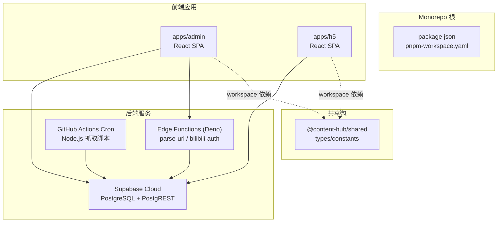
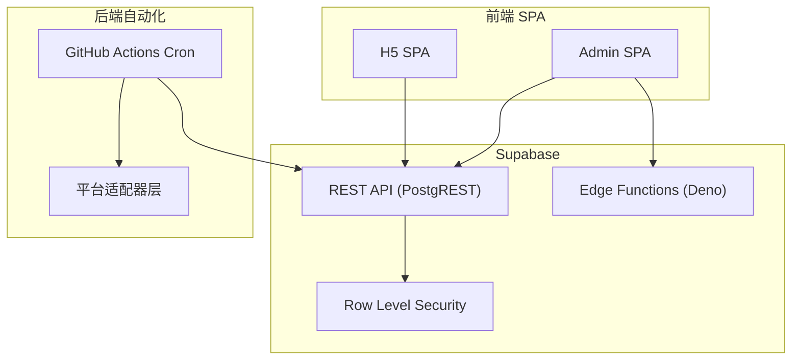
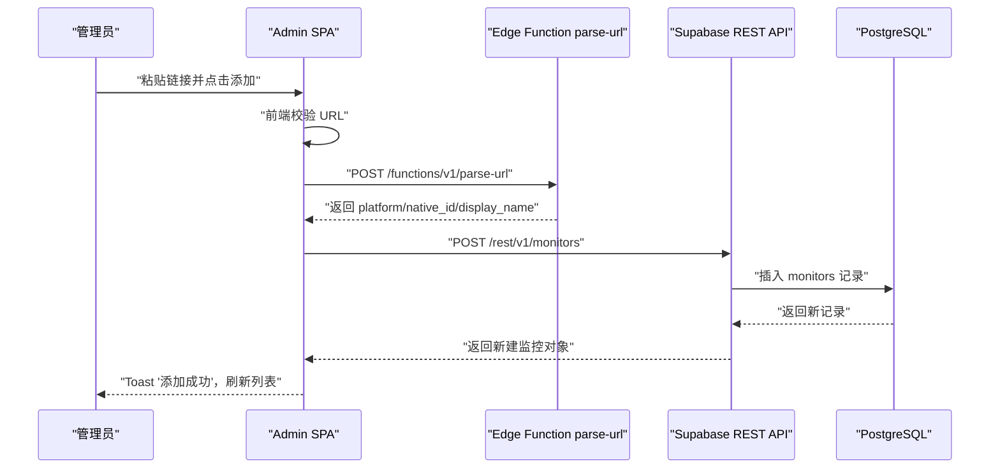
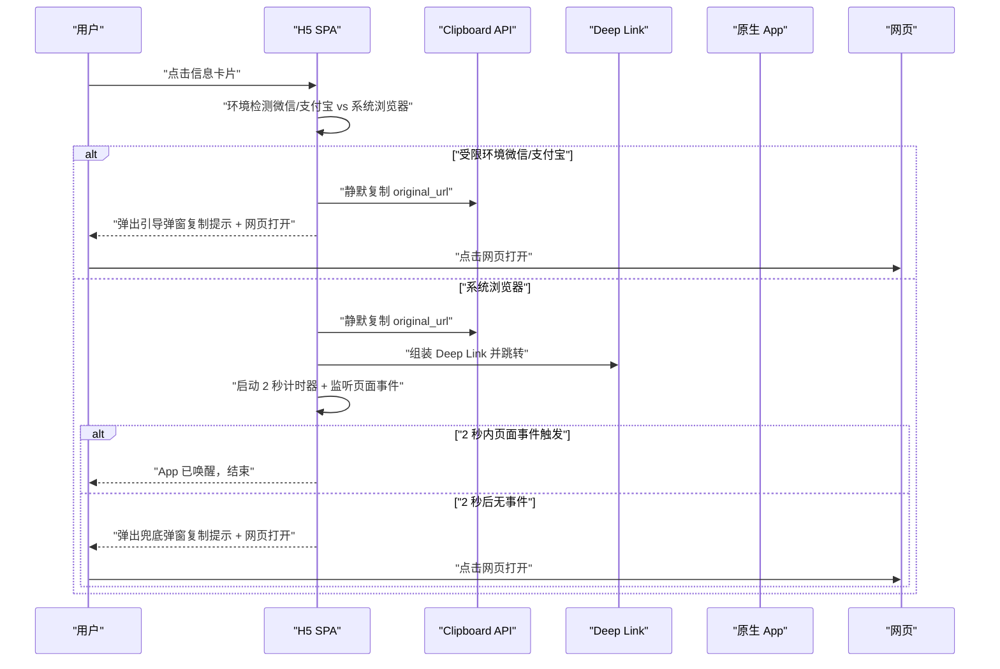
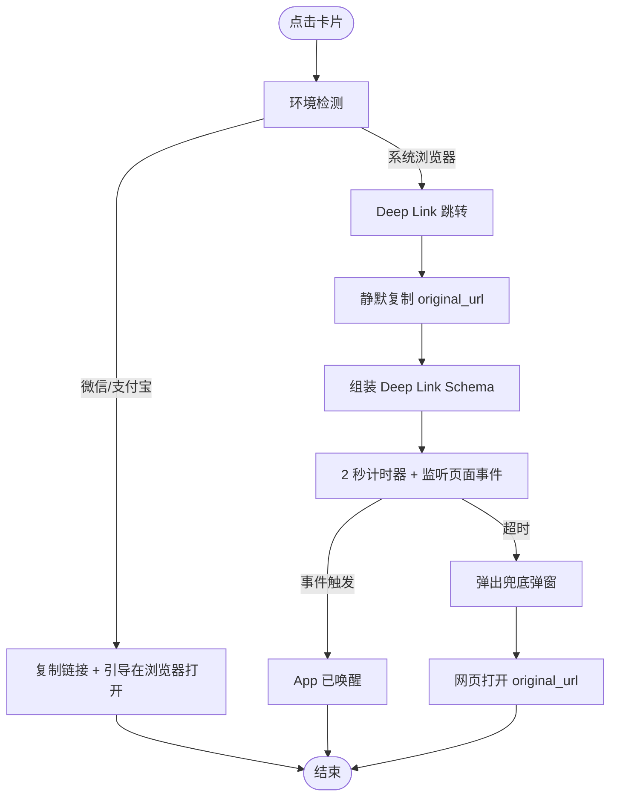
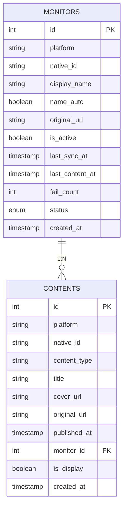
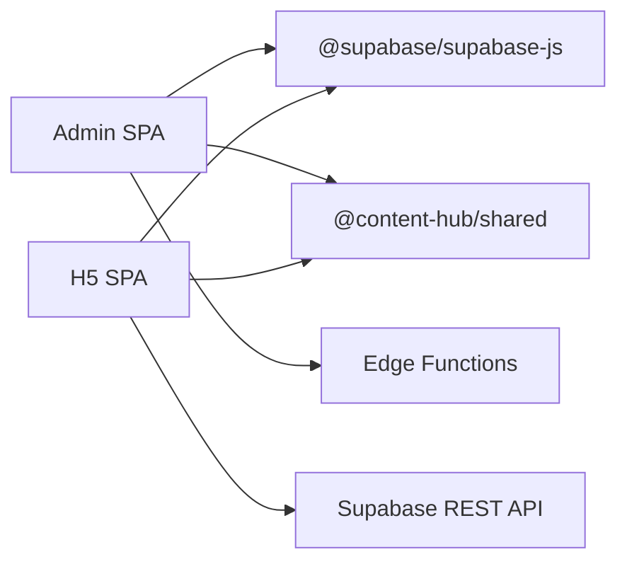

# 前端应用

<cite>
**本文引用的文件**
- [PROJECT_CONTEXT.md](file://PROJECT_CONTEXT.md)
- [多平台中枢_PRD.md](file://多平台中枢_PRD.md)
</cite>

## 目录
1. [简介](#简介)
2. [项目结构](#项目结构)
3. [核心组件](#核心组件)
4. [架构总览](#架构总览)
5. [详细组件分析](#详细组件分析)
6. [依赖分析](#依赖分析)
7. [性能考虑](#性能考虑)
8. [故障排查指南](#故障排查指南)
9. [结论](#结论)
10. [附录](#附录)

## 简介
本文件面向“多平台内容中枢”的前端应用，聚焦于两个独立的 SPA：配置管理端（Admin SPA）与用户端 H5（H5 SPA）。项目采用 React 18 + TypeScript，构建工具为 Vite 5，样式方案为 Tailwind CSS 3，移动端优先设计。前端通过 Supabase REST API 与 Edge Functions 与后端交互，实现“配置驱动抓取”的内容聚合与 Deep Link 跳转体验。本文将从架构、组件设计、状态管理、移动端适配、Tailwind 使用、Deep Link 机制、开发指南、样式规范与性能优化等方面进行系统化说明，帮助开发者理解与扩展前端功能。

## 项目结构
前端应用位于 monorepo 的 apps 目录下，采用 apps/admin 与 apps/h5 两个独立 SPA，分别服务于配置管理端与用户端 H5。共享类型与常量位于 packages/shared，确保前后端类型一致性与可维护性。

图表来源
- [PROJECT_CONTEXT.md:51-142](file://PROJECT_CONTEXT.md#L51-L142)

章节来源
- [PROJECT_CONTEXT.md:51-142](file://PROJECT_CONTEXT.md#L51-L142)

## 核心组件
- 应用入口与路由
  - Admin SPA 与 H5 SPA 均通过 src/main.tsx 初始化应用，src/App.tsx 作为顶层组件承载路由与布局。
  - 路由采用 React Router（约定式或自定义路由），Admin SPA 提供配置管理页面，H5 SPA 提供信息流与跳转兜底弹窗。
- 页面组件
  - Admin SPA：监控目标管理（CRUD）、URL 解析与平台识别、B站扫码授权、状态面板等。
  - H5 SPA：信息流主页（分页 + 筛选）、Deep Link 跳转、兜底弹窗。
- 通用组件
  - 表单组件（输入校验、提交）、卡片组件（平台 Tag、封面图、发布时间）、弹窗组件（复制提示、网页打开）、状态指示器（🟢🟡🔴）。
- 自定义 Hooks
  - 状态管理（useSupabaseQuery/useSupabaseMutation）、Deep Link 跳转（useDeepLink）、环境检测（useEnvDetect）、分页加载（usePagination）。
- 工具函数
  - Supabase 客户端封装、URL 解析、平台识别、剪贴板操作、时间格式化、错误处理。

章节来源
- [PROJECT_CONTEXT.md:58-82](file://PROJECT_CONTEXT.md#L58-L82)
- [PROJECT_CONTEXT.md:84-95](file://PROJECT_CONTEXT.md#L84-L95)

## 架构总览
前端 SPA 通过 Supabase REST API 与 Edge Functions 与后端交互，遵循“前端不直接调用第三方平台 API”的约束，所有抓取与数据写入由 Cron 脚本与 Edge Functions 完成。H5 SPA 仅负责展示与交互，Admin SPA 负责配置与状态管理。

图表来源
- [PROJECT_CONTEXT.md:169-240](file://PROJECT_CONTEXT.md#L169-L240)

章节来源
- [PROJECT_CONTEXT.md:169-240](file://PROJECT_CONTEXT.md#L169-L240)

## 详细组件分析

### 配置管理端（Admin SPA）
- 页面与路由
  - 顶部通用输入框粘贴博主主页链接，点击“添加”触发前端校验与后端解析。
  - 监控列表展示（昵称、平台 Tag、开关、最后同步时间、运行状态、活跃度提示、操作按钮）。
- 核心流程
  - URL 校验 → 调用 parse-url Edge Function → 去重校验 → 获取昵称（异步） → 写入 monitors 表 → 刷新列表。
- 状态管理
  - 使用 React Query 或自定义 Hook 管理 monitors 列表、添加状态、错误状态与刷新策略。
- 组件设计
  - 表格/卡片列表（可选），每行包含昵称编辑（行内编辑）、开关（Toggle）、状态标识、活跃度提示、操作按钮（删除）。
- API 集成
  - Supabase REST API：monitors 表的 CRUD；Edge Functions：parse-url、bilibili-auth。
- 安全与权限
  - 使用 Supabase Auth Token 与 RLS 策略，管理员具备全部读写权限。

图表来源
- [PROJECT_CONTEXT.md:511-537](file://PROJECT_CONTEXT.md#L511-L537)
- [PROJECT_CONTEXT.md:420-474](file://PROJECT_CONTEXT.md#L420-L474)

章节来源
- [PROJECT_CONTEXT.md:274-300](file://PROJECT_CONTEXT.md#L274-L300)
- [PROJECT_CONTEXT.md:511-537](file://PROJECT_CONTEXT.md#L511-L537)
- [PROJECT_CONTEXT.md:420-474](file://PROJECT_CONTEXT.md#L420-L474)

### 用户端 H5（H5 SPA）
- 页面与路由
  - 顶部导航：Logo/标题 + 平台筛选 Tab（全部 | 抖音 | B站 | 知乎 | YouTube）。
  - 主体：信息卡片流（封面图、标题、平台 Tag、发布时间），支持无限滚动分页。
- 核心流程
  - 加载：GET /api/contents?page=1&size=20（默认全平台，按 published_at DESC）。
  - 筛选：点击平台 Tab → 追加 platform 参数 → 重新请求。
  - 滚动：到达底部 → page++ → 追加数据；空数组 → “没有更多内容了”。
- Deep Link 跳转机制
  - 环境检测：微信/支付宝内 → 走“复制链接 + 引导在浏览器打开”路径；系统浏览器 → 走 Deep Link 路径。
  - Deep Link 组装：根据 (platform, content_type) 选择 Schema；无法匹配 → 直接 window.open(original_url)。
  - 超时检测：2 秒计时器 + visibilitychange/pagehide/blur 事件；超时 → 弹出兜底弹窗。
- 兜底弹窗
  - 提示文案：“链接已自动复制，打开 App 即可直接看”，按钮“网页打开”“关闭”。

图表来源
- [多平台中枢_PRD.md:789-898](file://多平台中枢_PRD.md#L789-L898)

章节来源
- [多平台中枢_PRD.md:244-293](file://多平台中枢_PRD.md#L244-L293)
- [多平台中枢_PRD.md:789-898](file://多平台中枢_PRD.md#L789-L898)

### Deep Link 跳转机制与兼容性处理
- 支持范围
  - B站：video → bilibili://video/{native_id}；article → bilibili://article/{native_id}
  - YouTube：video → youtube://watch?v={native_id}
  - 知乎：不支持 Deep Link，直接 original_url
- 兼容性策略
  - 微信/支付宝内：不尝试 Deep Link，直接弹出引导弹窗。
  - 系统浏览器：Deep Link 唤醒 + 2 秒超时检测 + 兜底弹窗。
- 超时检测
  - 计时器 + visibilitychange/pagehide/blur 事件，任一触发即视为唤醒成功。
- 兜底弹窗
  - 复制提示 + “网页打开”按钮（window.open(original_url)）。

图表来源
- [多平台中枢_PRD.md:789-898](file://多平台中枢_PRD.md#L789-L898)

章节来源
- [多平台中枢_PRD.md:789-898](file://多平台中枢_PRD.md#L789-L898)

### 移动端适配与 Tailwind CSS 使用
- 移动端优先
  - 使用 Tailwind 原子类，配合 flex、gap、text-truncate、w-full 等实现响应式布局。
  - 卡片采用 16:9 封面图比例，标题最多两行，溢出截断。
- 平台 Tag 配色
  - 抖音：黑色；B站：粉色；知乎：蓝色；YouTube：红色。
- 交互与状态
  - Toggle 开关、Tab 切换、下拉刷新、无限滚动分页。
- 样式规范
  - 优先使用 Tailwind 原子类，避免内联样式；语义化类名（如 btn-primary、card-content）。

章节来源
- [多平台中枢_PRD.md:244-256](file://多平台中枢_PRD.md#L244-L256)

### 状态管理与数据流
- Admin SPA
  - 监控列表：查询 monitors 表，支持筛选（平台/状态）、开关切换、删除。
  - 添加流程：parse-url Edge Function 解析 + 去重校验 + 写入 + 刷新。
- H5 SPA
  - 信息流：查询 contents 表（is_display=true），按 published_at DESC，分页加载。
  - 筛选：追加 platform 参数，重新请求。
  - Deep Link：复制链接 + 跳转 + 超时检测 + 兜底弹窗。

图表来源
- [多平台中枢_PRD.md:328-361](file://多平台中枢_PRD.md#L328-L361)

章节来源
- [多平台中枢_PRD.md:328-361](file://多平台中枢_PRD.md#L328-L361)

## 依赖分析
- 技术栈
  - 前端框架：React 18 + TypeScript
  - 构建工具：Vite 5
  - 样式方案：Tailwind CSS 3
  - 状态管理：React Query 或自定义 Hooks
  - 路由：React Router
  - Supabase：@supabase/supabase-js
- 依赖关系
  - Admin SPA 与 H5 SPA 通过 workspace 依赖 @content-hub/shared，共享类型与常量。
  - Edge Functions（Deno）无法引用 npm 包，需手动维护类型同步。

图表来源
- [PROJECT_CONTEXT.md:8-24](file://PROJECT_CONTEXT.md#L8-L24)
- [PROJECT_CONTEXT.md:84-95](file://PROJECT_CONTEXT.md#L84-L95)

章节来源
- [PROJECT_CONTEXT.md:8-24](file://PROJECT_CONTEXT.md#L8-L24)
- [PROJECT_CONTEXT.md:84-95](file://PROJECT_CONTEXT.md#L84-L95)

## 性能考虑
- 构建与打包
  - Vite 5 提供快速 HMR 与生产构建优化，建议启用压缩与 Tree Shaking。
- 数据加载
  - H5 信息流分页加载（每页 20 条），滚动到底部自动加载下一页；下拉刷新重置 page=1。
  - Admin SPA 列表支持筛选与排序，避免一次性加载过多数据。
- 图片与资源
  - 封面图 onerror 显示平台默认占位图；合理设置尺寸与懒加载。
- 交互优化
  - Deep Link 跳转前静默复制链接，减少用户操作；超时检测与兜底弹窗提升可用性。
- 缓存策略
  - 利用浏览器缓存与 CDN，减少重复请求；对不频繁变化的数据进行本地缓存。

## 故障排查指南
- 添加监控失败
  - URL 格式不合法：前端校验失败，提示“链接格式不正确”。
  - 无法识别平台：parse-url Edge Function 返回错误，提示“无法识别该平台”。
  - 重复添加：去重校验失败，提示“该博主已添加”。
- 监控状态异常
  - Cookie 过期：B站 Cookie 失效，状态变为“cookie_expired”，需重新授权。
  - 接口受限：连续失败 ≥3 次，状态变为“rate_limited”，触发告警。
- H5 跳转失败
  - 微信/支付宝内：受限环境，直接弹出引导弹窗。
  - 系统浏览器：Deep Link 超时（>2s），弹出兜底弹窗。
- 数据问题
  - 软删除：超过 30 天的内容 is_display=false，H5 不可见但数据保留。
  - 互斥锁：上一轮 Cron 未完成则跳过本轮，等待下一周期。

章节来源
- [PROJECT_CONTEXT.md:600-614](file://PROJECT_CONTEXT.md#L600-L614)
- [多平台中枢_PRD.md:928-951](file://多平台中枢_PRD.md#L928-L951)

## 结论
本前端应用围绕“配置驱动抓取”的核心理念，通过 Admin SPA 与 H5 SPA 的清晰分工，结合 Supabase 与 Edge Functions 的后端能力，实现了从配置、抓取、清洗、去重到展示与跳转的完整闭环。React 18 + TypeScript 的强类型保障、Vite 的高效构建、Tailwind 的原子化样式与移动端优先设计，共同构成了可维护、可扩展且用户体验良好的前端架构。Deep Link 跳转机制在兼容微信等受限环境的同时，提供了流畅的原生 App 唤醒体验。建议在后续迭代中持续完善平台扩展、性能优化与可访问性。

## 附录
- 开发指南
  - 组件开发：遵循帕斯卡命名（组件类名）、连字符命名（文件名）、原子类优先（Tailwind）。
  - 状态管理：使用 React Query 或自定义 Hooks 管理查询、变更与缓存。
  - API 集成：统一使用 Supabase REST API 与 Edge Functions，严格区分 anon key 与 service_role key 的使用场景。
  - 样式规范：优先使用 Tailwind 原子类，语义化类名，避免内联样式。
  - 性能优化：分页加载、图片懒加载、缓存策略、Tree Shaking。
- 最佳实践
  - 前端不直接调用第三方平台 API，所有抓取与写入由 Cron 与 Edge Functions 完成。
  - 所有表启用 RLS，管理员使用 Auth Token，访客使用 anon key。
  - 敏感信息（API Key、Cookie）通过环境变量或 Supabase Vault 管理。
  - RSSHub 必须启用 API Key 鉴权，限制公网访问。