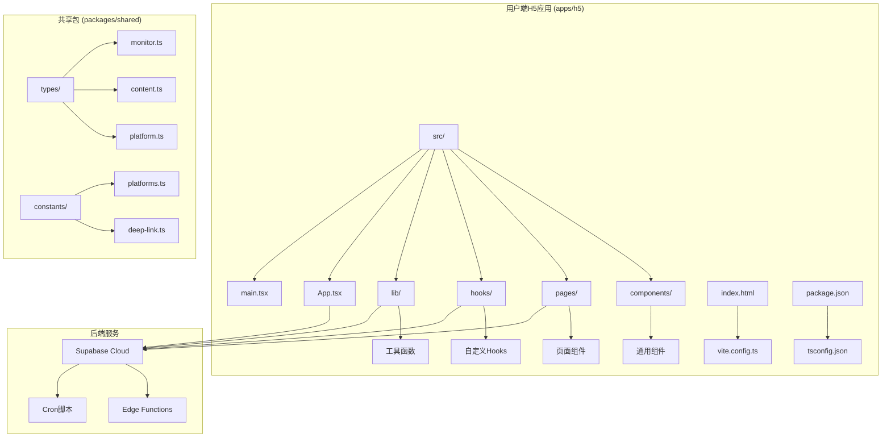
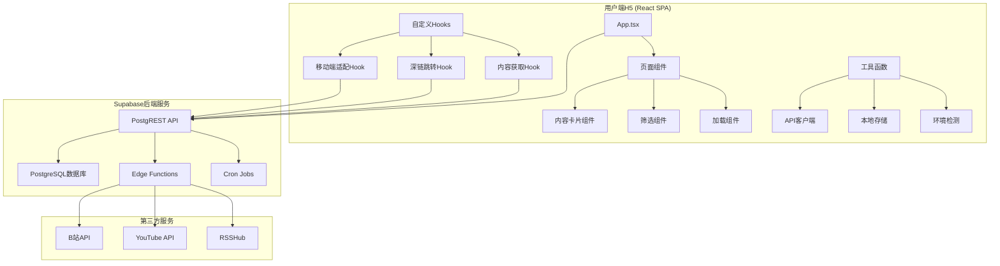
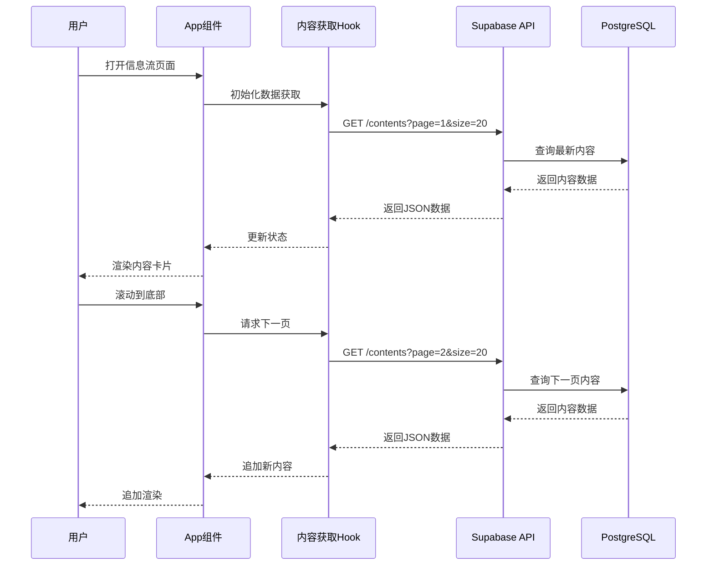
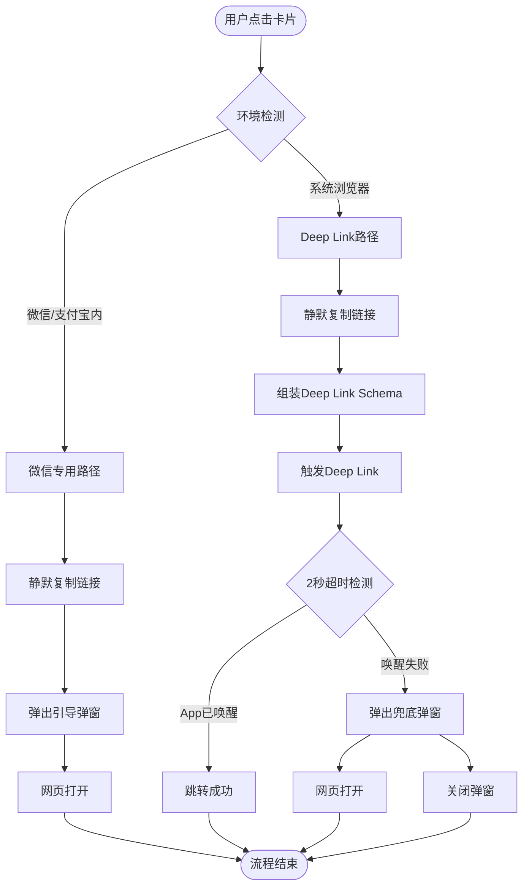

# 用户端H5 (H5 SPA)

<cite>
**本文档引用的文件**
- [PROJECT_CONTEXT.md](file://PROJECT_CONTEXT.md)
- [多平台中枢_PRD.md](file://多平台中枢_PRD.md)
</cite>

## 目录
1. [简介](#简介)
2. [项目结构](#项目结构)
3. [核心组件](#核心组件)
4. [架构概览](#架构概览)
5. [详细组件分析](#详细组件分析)
6. [依赖关系分析](#依赖关系分析)
7. [性能考虑](#性能考虑)
8. [故障排除指南](#故障排除指南)
9. [结论](#结论)
10. [附录](#附录)

## 简介

用户端H5 (H5 SPA) 是多平台内容中枢项目中的移动端前端应用，基于React 18 + TypeScript构建，采用Vite 5进行快速开发和构建。该应用为用户提供了一个轻量级的内容聚合平台，支持在单一页面中浏览抖音、B站、知乎、YouTube四个平台的关注博主最新内容，并提供一键跳转至原生App的深度阅读体验。

该应用采用纯客户端渲染架构，通过Supabase REST API与后端服务通信，实现了高性能、低延迟的内容展示和交互体验。应用特别针对移动端进行了优化，使用Tailwind CSS实现响应式布局，确保在各种移动设备上都能提供优秀的用户体验。

## 项目结构

基于项目上下文文档，用户端H5应用采用Monorepo结构，具体组织如下：



**图表来源**
- [PROJECT_CONTEXT.md:55-82](file://PROJECT_CONTEXT.md#L55-L82)

**章节来源**
- [PROJECT_CONTEXT.md:51-82](file://PROJECT_CONTEXT.md#L51-L82)

## 核心组件

用户端H5应用的核心组件包括：

### 应用入口组件
- **App.tsx**: 应用根组件，负责路由配置和全局状态管理
- **main.tsx**: 应用入口点，初始化React应用和必要的服务

### 页面组件
- **信息流主页**: 主要内容展示页面，包含无限滚动分页和平台筛选功能
- **详情页面**: 内容详情展示页面，提供深度阅读体验

### 通用组件
- **内容卡片组件**: 信息流中的内容展示单元，包含封面图、标题、平台标签等
- **平台筛选组件**: 支持按平台类型筛选内容的导航组件
- **加载指示器**: 提供用户友好的加载状态反馈

### 自定义Hooks
- **内容获取Hook**: 处理信息流数据的获取、缓存和分页逻辑
- **深链跳转Hook**: 实现Deep Link跳转和环境检测功能
- **移动端适配Hook**: 处理移动端特有的交互和布局问题

**章节来源**
- [PROJECT_CONTEXT.md:71-82](file://PROJECT_CONTEXT.md#L71-L82)
- [PROJECT_CONTEXT.md:84-95](file://PROJECT_CONTEXT.md#L84-L95)

## 架构概览

用户端H5应用采用前后端分离的架构设计，通过Supabase提供的REST API与后端服务通信：



**图表来源**
- [PROJECT_CONTEXT.md:173-206](file://PROJECT_CONTEXT.md#L173-L206)

该架构具有以下特点：

1. **纯前端渲染**: 应用完全在客户端运行，无需服务端渲染
2. **API驱动**: 所有数据交互通过REST API完成
3. **实时更新**: 通过定时轮询和事件监听实现内容的实时更新
4. **离线支持**: 采用合理的缓存策略，支持离线浏览

**章节来源**
- [PROJECT_CONTEXT.md:169-206](file://PROJECT_CONTEXT.md#L169-L206)

## 详细组件分析

### 聚合信息流实现

信息流是用户端H5的核心功能，实现了高效的内容展示和交互体验：

#### 分页加载机制
- **无限滚动**: 基于Intersection Observer API实现无缝滚动加载
- **分页参数**: 支持`page`和`size`参数控制分页行为
- **缓存策略**: 采用内存缓存和localStorage双重缓存机制
- **加载状态**: 提供多种加载状态反馈，包括骨架屏和进度指示器

#### 筛选功能
- **平台筛选**: 支持按平台类型筛选内容（全部/B站/YouTube/知乎/抖音）
- **状态筛选**: 支持按内容状态进行筛选
- **实时更新**: 筛选条件变更时自动重新加载数据

#### 实时更新机制
- **定时轮询**: 每30分钟自动刷新数据
- **事件监听**: 监听页面可见性变化和网络状态变化
- **增量更新**: 仅更新新增内容，避免全量刷新



**图表来源**
- [PROJECT_CONTEXT.md:902-924](file://PROJECT_CONTEXT.md#L902-L924)

**章节来源**
- [PROJECT_CONTEXT.md:244-256](file://PROJECT_CONTEXT.md#L244-L256)
- [PROJECT_CONTEXT.md:902-924](file://PROJECT_CONTEXT.md#L902-L924)

### Deep Link跳转机制

Deep Link跳转是用户端H5的重要功能，实现了从H5页面到原生App的无缝跳转：

#### Schema匹配策略
- **平台识别**: 基于`(platform, content_type)`组合选择合适的Schema
- **内容类型支持**: 支持视频和文章等多种内容类型
- **Schema模板**: 使用预定义的Schema模板进行动态拼接

#### 唤醒流程
- **环境检测**: 通过UserAgent检测当前运行环境
- **静默复制**: 使用Clipboard API复制原始链接
- **超时检测**: 2秒超时检测机制判断跳转是否成功
- **兜底处理**: 跳转失败时提供网页打开选项



**图表来源**
- [PROJECT_CONTEXT.md:789-898](file://PROJECT_CONTEXT.md#L789-L898)

**章节来源**
- [PROJECT_CONTEXT.md:335-345](file://PROJECT_CONTEXT.md#L335-L345)
- [PROJECT_CONTEXT.md:789-898](file://PROJECT_CONTEXT.md#L789-L898)

### 移动端适配策略

用户端H5应用针对移动端进行了全面的适配优化：

#### 响应式布局
- **Tailwind CSS**: 使用原子化CSS框架实现响应式设计
- **移动端优先**: 采用移动端优先的设计理念
- **弹性布局**: 支持不同屏幕尺寸的自适应布局

#### Touch交互优化
- **触摸手势**: 支持滚动、点击等基本触摸操作
- **虚拟按键**: 适配不同设备的虚拟按键高度
- **滚动性能**: 优化滚动性能，避免卡顿现象

#### 性能优化
- **懒加载**: 图片和组件的懒加载机制
- **资源压缩**: 静态资源的压缩和优化
- **缓存策略**: 合理的缓存策略提升加载速度

**章节来源**
- [PROJECT_CONTEXT.md:16-16](file://PROJECT_CONTEXT.md#L16-L16)
- [多平台中枢_PRD.md:72-75](file://多平台中枢_PRD.md#L72-L75)

## 依赖关系分析

用户端H5应用的依赖关系体现了清晰的分层架构：

```mermaid
graph TB
subgraph "应用层"
A[App.tsx]
B[页面组件]
C[通用组件]
D[自定义Hooks]
end
subgraph "工具层"
E[API客户端]
F[本地存储]
G[环境检测]
H[类型定义]
end
subgraph "共享层"
I[@content-hub/shared]
J[平台常量]
K[深链模板]
L[内容类型]
end
subgraph "基础库"
M[React 18]
N[TypeScript]
O[Tailwind CSS]
P[Vite 5]
end
A --> B
A --> C
A --> D
B --> E
C --> E
D --> E
E --> I
I --> J
I --> K
I --> L
A --> M
B --> M
C --> M
D --> M
E --> N
F --> N
G --> N
H --> N
A --> O
B --> O
C --> O
D --> O
A --> P
```

**图表来源**
- [PROJECT_CONTEXT.md:161-166](file://PROJECT_CONTEXT.md#L161-L166)

**章节来源**
- [PROJECT_CONTEXT.md:161-166](file://PROJECT_CONTEXT.md#L161-L166)

## 性能考虑

用户端H5应用在性能方面采用了多项优化策略：

### 加载性能
- **代码分割**: 按需加载页面组件，减少初始包体积
- **资源预加载**: 关键资源的预加载策略
- **CDN加速**: 静态资源通过CDN进行加速

### 运行时性能
- **虚拟DOM优化**: React 18的并发特性优化
- **状态管理**: 合理的状态管理减少不必要的重渲染
- **内存管理**: 及时清理事件监听器和定时器

### 网络性能
- **HTTP缓存**: 合理设置HTTP缓存头
- **请求合并**: 合并相似的API请求
- **错误重试**: 智能的错误重试机制

## 故障排除指南

### 常见问题及解决方案

#### Deep Link跳转失败
**问题症状**: 点击卡片后无法跳转到原生App
**可能原因**:
- App未安装或版本过低
- Schema协议不支持
- 微信/支付宝等受限环境

**解决方案**:
- 检查应用是否已安装
- 验证Schema协议的有效性
- 在受限环境中使用网页打开选项

#### 信息流加载缓慢
**问题症状**: 页面加载时间过长或内容显示不完整
**可能原因**:
- 网络连接不稳定
- API响应时间过长
- 缓存策略不当

**解决方案**:
- 检查网络连接质量
- 优化API请求参数
- 调整缓存策略和超时设置

#### 移动端兼容性问题
**问题症状**: 在某些移动设备上出现布局或交互问题
**可能原因**:
- 浏览器兼容性问题
- Touch事件处理不当
- 屏幕尺寸适配问题

**解决方案**:
- 检查浏览器兼容性
- 优化Touch事件处理
- 调整响应式布局参数

**章节来源**
- [PROJECT_CONTEXT.md:928-951](file://PROJECT_CONTEXT.md#L928-L951)

## 结论

用户端H5 (H5 SPA) 应用通过采用现代化的技术栈和架构设计，成功实现了轻量级、高性能的内容聚合平台。应用不仅提供了优秀的用户体验，还具备良好的可维护性和扩展性。

该应用的核心优势包括：
- **技术先进**: 基于React 18 + TypeScript + Vite 5的现代技术栈
- **性能优异**: 通过多种优化策略确保快速的加载和流畅的交互
- **用户体验**: 针对移动端的全面优化和友好的交互设计
- **架构清晰**: 分层明确的架构便于维护和扩展

随着项目的不断发展，用户端H5应用将继续演进，为用户提供更加丰富和便捷的内容消费体验。

## 附录

### 开发指南

#### 项目启动
```bash
# 安装依赖
pnpm install

# 开发模式启动
pnpm dev

# 生产构建
pnpm build
```

#### 代码规范
- 使用PascalCase命名组件
- 使用kebab-case命名TypeScript文件
- 遵循Tailwind CSS原子类优先原则

#### 组件开发最佳实践
- 组件职责单一，避免过度复杂的组件
- 合理使用React Hooks进行状态管理
- 提供完善的错误边界和加载状态处理
- 注重可访问性设计

### 性能优化建议

#### 前端性能优化
- 使用React.lazy进行代码分割
- 实现合理的缓存策略
- 优化图片资源和静态文件
- 减少不必要的重渲染

#### 移动端优化
- 优化触摸交互响应
- 考虑不同网络环境的性能表现
- 实现离线缓存策略
- 优化电池使用效率