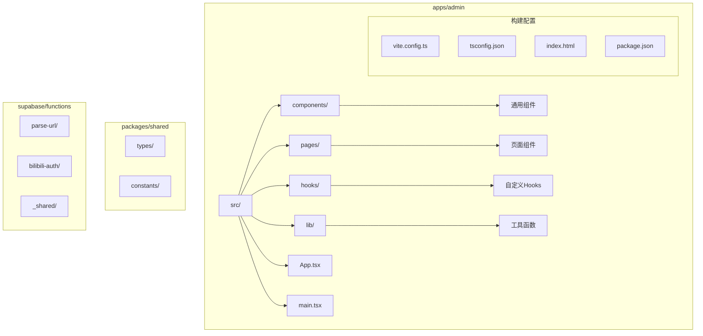
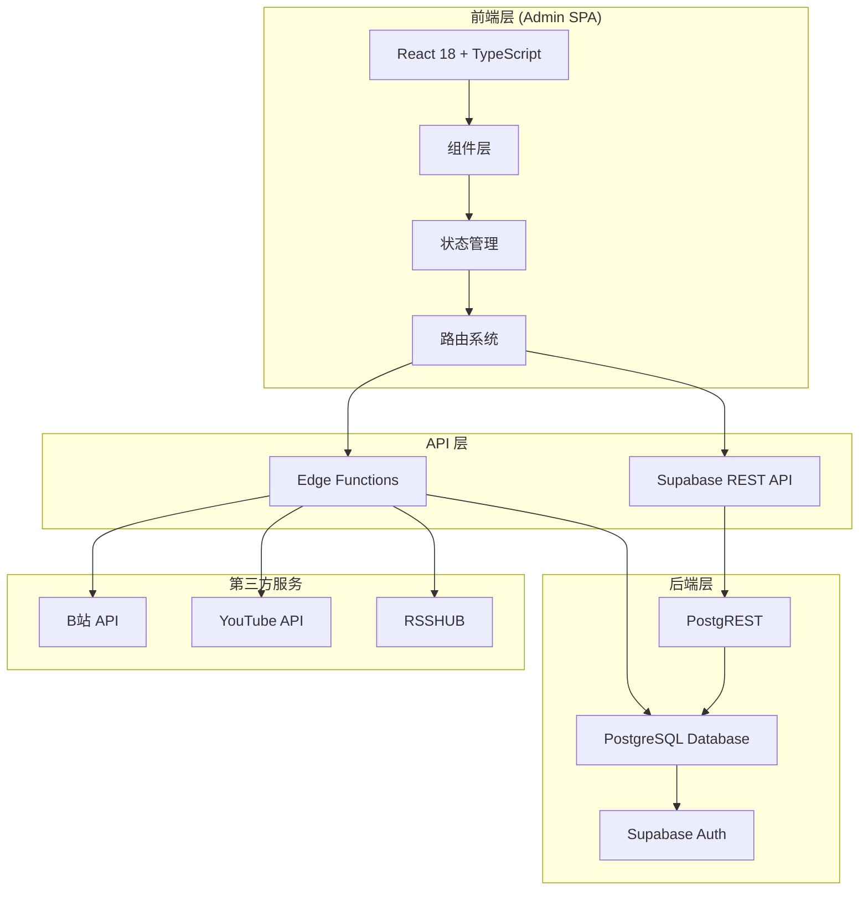
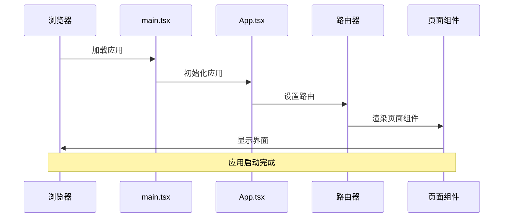
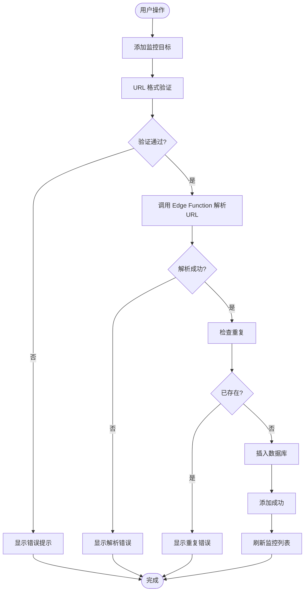
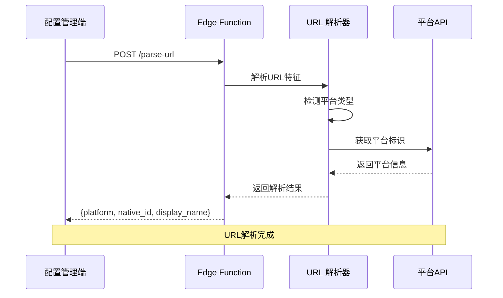
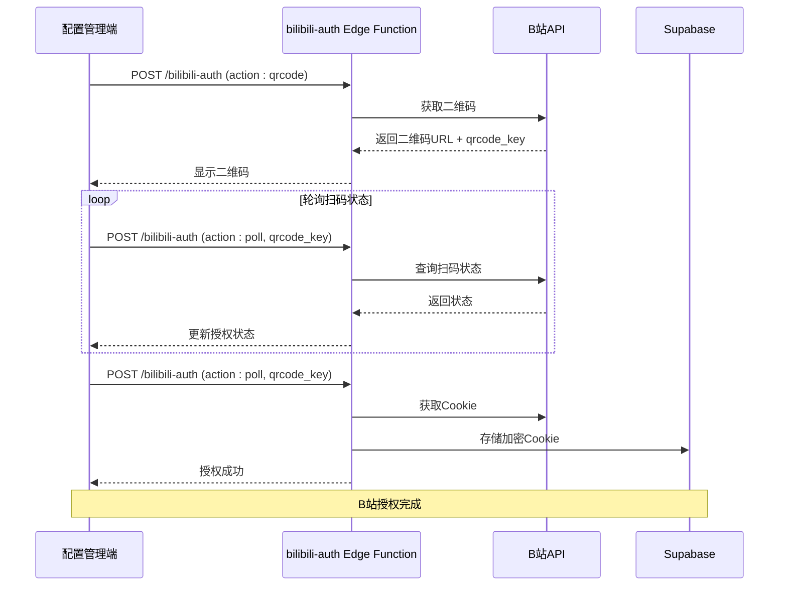
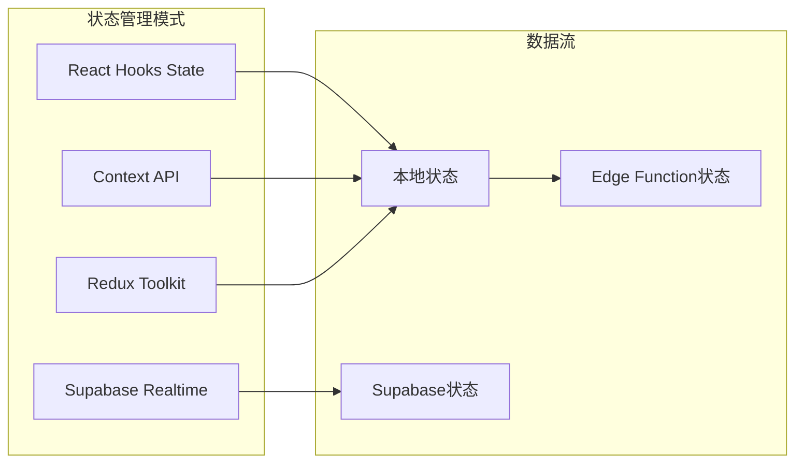
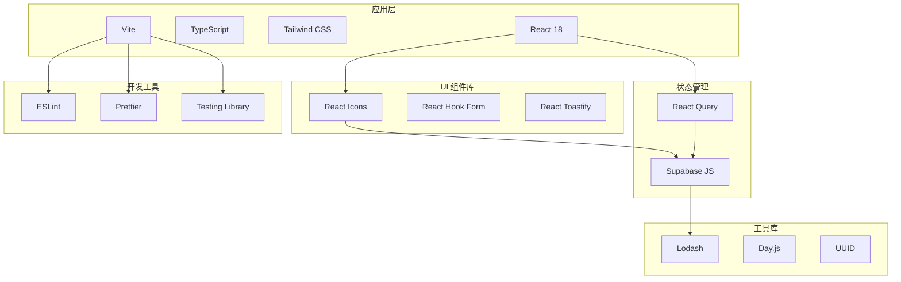
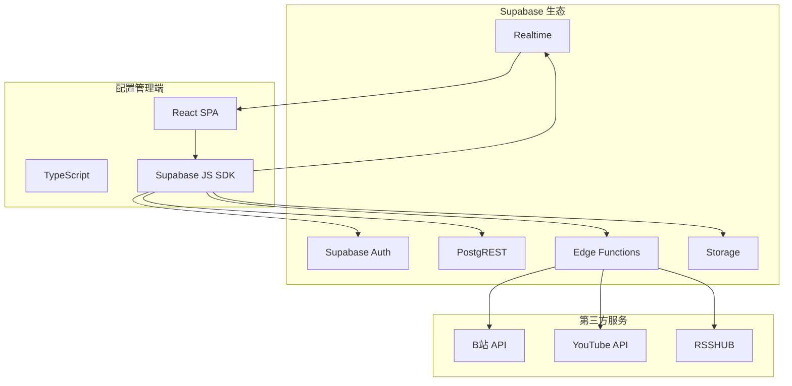

# 配置管理端 (Admin SPA)

<cite>
**本文档引用的文件**
- [PROJECT_CONTEXT.md](file://PROJECT_CONTEXT.md)
- [多平台中枢_PRD.md](file://多平台中枢_PRD.md)
</cite>

## 目录
1. [简介](#简介)
2. [项目结构](#项目结构)
3. [核心组件](#核心组件)
4. [架构概览](#架构概览)
5. [详细组件分析](#详细组件分析)
6. [依赖分析](#依赖分析)
7. [性能考虑](#性能考虑)
8. [故障排除指南](#故障排除指南)
9. [结论](#结论)
10. [附录](#附录)

## 简介

配置管理端（Admin SPA）是多平台内容中枢项目中的重要组成部分，采用 React 18 + TypeScript 构建，负责管理监控目标、平台识别、B站扫码授权等核心功能。该项目是一个基于 Supabase 的全栈应用，实现了"配置驱动抓取"的多平台内容聚合系统。

### 项目特色
- **React 18 + TypeScript**：现代化前端技术栈，提供类型安全和更好的开发体验
- **Vite 5 构建工具**：快速热重载和高效的生产构建
- **Tailwind CSS 3**：原子化 CSS 框架，支持移动端优先的设计
- **Supabase 后端**：PostgreSQL + PostgREST + Edge Functions 的云原生架构
- **Monorepo 结构**：pnpm workspace 管理的多包架构

## 项目结构

配置管理端位于 `apps/admin` 目录下，采用标准的 React 应用结构：

**图表来源**
- [PROJECT_CONTEXT.md:55-141](file://PROJECT_CONTEXT.md#L55-L141)

### 目录规范
- **src/components/**：通用 UI 组件
- **src/pages/**：页面级组件
- **src/hooks/**：自定义 React Hooks
- **src/lib/**：工具函数和 Supabase 客户端
- **src/App.tsx**：应用根组件
- **src/main.tsx**：应用入口点

**章节来源**
- [PROJECT_CONTEXT.md:55-141](file://PROJECT_CONTEXT.md#L55-L141)

## 核心组件

配置管理端的核心功能围绕监控目标管理展开，主要包括以下组件：

### 监控目标管理组件
- **MonitorList**：监控列表展示组件
- **MonitorForm**：监控添加表单组件  
- **StatusBadge**：状态徽章组件
- **PlatformTag**：平台标签组件

### 授权相关组件
- **BilibiliAuthModal**：B站扫码授权模态框
- **QRCodeDisplay**：二维码显示组件
- **AuthStatus**：授权状态显示组件

### 状态管理组件
- **MonitorStats**：监控统计面板
- **SyncHistory**：同步历史记录

**章节来源**
- [PROJECT_CONTEXT.md:243-271](file://PROJECT_CONTEXT.md#L243-L271)
- [多平台中枢_PRD.md:430-508](file://多平台中枢_PRD.md#L430-L508)

## 架构概览

配置管理端采用分层架构设计，与后端服务通过 REST API 和 Edge Functions 进行通信：

**图表来源**
- [PROJECT_CONTEXT.md:169-240](file://PROJECT_CONTEXT.md#L169-L240)

### 数据流架构
配置管理端的数据流遵循清晰的层次结构：

1. **配置流**：Admin SPA → Edge Function → Supabase REST API → PostgreSQL
2. **读取流**：H5 SPA → Supabase REST API → PostgreSQL
3. **写入流**：GitHub Actions → 第三方 API → 清洗标准化 → Supabase REST API → PostgreSQL

**章节来源**
- [PROJECT_CONTEXT.md:224-239](file://PROJECT_CONTEXT.md#L224-L239)

## 详细组件分析

### 应用入口与路由配置

配置管理端的应用入口采用标准的 React 18 结构：

**图表来源**
- [PROJECT_CONTEXT.md:64-65](file://PROJECT_CONTEXT.md#L64-L65)

### 监控目标管理功能

监控目标管理是配置管理端的核心功能，实现完整的 CRUD 操作：

**图表来源**
- [PROJECT_CONTEXT.md:275-279](file://PROJECT_CONTEXT.md#L275-L279)
- [多平台中枢_PRD.md:599-650](file://多平台中枢_PRD.md#L599-L650)

### URL 解析与平台识别

URL 解析功能通过 Edge Function 实现，支持多种平台的自动识别：

**图表来源**
- [PROJECT_CONTEXT.md:281-291](file://PROJECT_CONTEXT.md#L281-L291)

### B站扫码授权流程

B站扫码授权是配置管理端的重要功能，实现安全的第三方授权：

**图表来源**
- [PROJECT_CONTEXT.md:292-299](file://PROJECT_CONTEXT.md#L292-L299)

### 状态管理策略

配置管理端采用多种状态管理模式：

**图表来源**
- [PROJECT_CONTEXT.md:14-23](file://PROJECT_CONTEXT.md#L14-L23)

### API 集成方式

配置管理端通过以下方式集成各种 API：

1. **Supabase REST API**：主要的数据读写接口
2. **Edge Functions**：轻量级后端逻辑处理
3. **第三方平台 API**：B站、YouTube、RSSHub 等

**章节来源**
- [PROJECT_CONTEXT.md:420-568](file://PROJECT_CONTEXT.md#L420-L568)

## 依赖分析

配置管理端的依赖关系体现了清晰的分层架构：

**图表来源**
- [PROJECT_CONTEXT.md:25-46](file://PROJECT_CONTEXT.md#L25-L46)

### 外部依赖关系

配置管理端与 Supabase 生态系统的深度集成：

**图表来源**
- [PROJECT_CONTEXT.md:173-206](file://PROJECT_CONTEXT.md#L173-L206)

**章节来源**
- [PROJECT_CONTEXT.md:169-240](file://PROJECT_CONTEXT.md#L169-L240)

## 性能考虑

配置管理端在性能方面采用了多项优化策略：

### 构建优化
- **Vite 快速构建**：利用 Vite 的快速热重载和预构建功能
- **Tree Shaking**：通过 ES6 模块系统实现代码分割
- **懒加载**：路由级别的代码分割，减少初始包体积

### 运行时优化
- **React 18 新特性**：使用并发特性和自动批处理
- **状态缓存**：React Query 提供智能缓存和数据同步
- **虚拟滚动**：大数据列表的虚拟化处理

### 网络优化
- **HTTP 缓存**：合理设置缓存策略
- **请求合并**：减少不必要的 API 调用
- **错误边界**：提供优雅的降级体验

## 故障排除指南

### 常见问题及解决方案

#### 登录认证问题
- **症状**：无法登录或登录状态异常
- **原因**：Supabase Auth 配置问题或会话过期
- **解决方案**：检查环境变量配置，重新登录并清除浏览器缓存

#### API 调用失败
- **症状**：监控列表无法加载或添加失败
- **原因**：Supabase 服务不可用或网络问题
- **解决方案**：检查网络连接，验证 Supabase 项目配置

#### Edge Function 调用错误
- **症状**：URL 解析或 B站授权失败
- **原因**：Edge Function 配置错误或第三方 API 限制
- **解决方案**：检查 Edge Function 日志，验证第三方 API 凭据

#### 数据同步问题
- **症状**：监控状态显示异常或数据不一致
- **原因**：Supabase Realtime 连接问题或数据冲突
- **解决方案**：检查实时订阅状态，重新初始化连接

**章节来源**
- [PROJECT_CONTEXT.md:402-417](file://PROJECT_CONTEXT.md#L402-L417)

## 结论

配置管理端（Admin SPA）是一个设计精良的 React 18 + TypeScript 应用，展现了现代前端开发的最佳实践。通过采用 Monorepo 架构、TypeScript 类型系统、以及与 Supabase 生态系统的深度集成，该项目实现了高可维护性和良好的开发体验。

### 核心优势
- **类型安全**：TypeScript 提供编译时类型检查，减少运行时错误
- **开发效率**：Vite 提供快速的开发体验和热重载
- **架构清晰**：分层架构和明确的职责分离
- **可扩展性**：模块化的组件设计支持功能扩展

### 技术亮点
- **现代化技术栈**：React 18 + TypeScript + Tailwind CSS
- **云原生架构**：基于 Supabase 的无服务器架构
- **安全设计**：严格的权限控制和数据加密
- **性能优化**：多层缓存和懒加载策略

## 附录

### 开发指南

#### 项目设置
1. 克隆项目并安装依赖
2. 配置环境变量
3. 启动开发服务器

#### 组件开发规范
- 使用 PascalCase 命名组件
- 采用函数式组件 + Hooks
- 实现类型安全的 Props 接口
- 编写单元测试和集成测试

#### 样式规范
- 使用 Tailwind CSS 原子化类名
- 遵循移动端优先的设计原则
- 实现响应式布局
- 维护一致的色彩系统

#### 性能优化建议
- 实现组件懒加载
- 使用 React.memo 优化渲染
- 实施数据缓存策略
- 监控应用性能指标

**章节来源**
- [PROJECT_CONTEXT.md:144-157](file://PROJECT_CONTEXT.md#L144-L157)