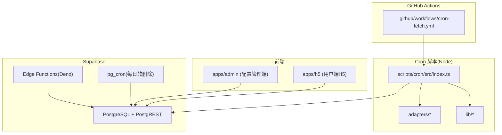
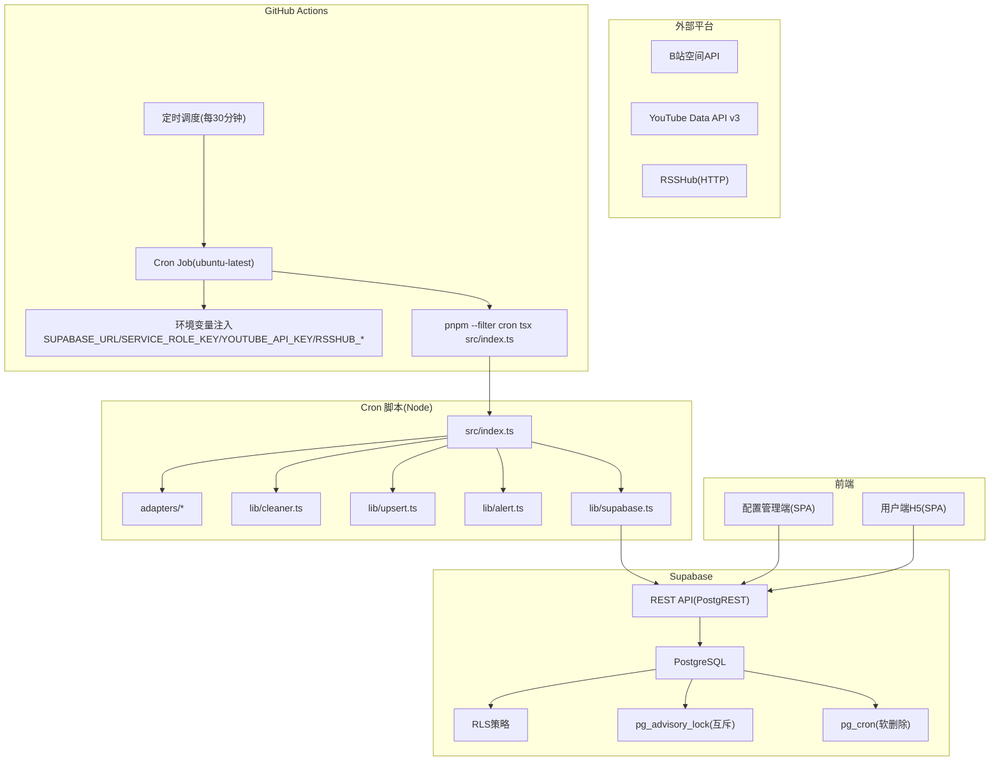
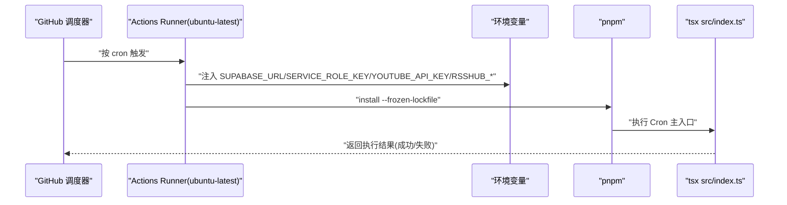
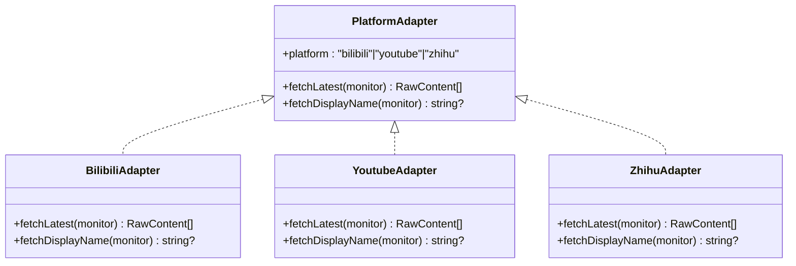
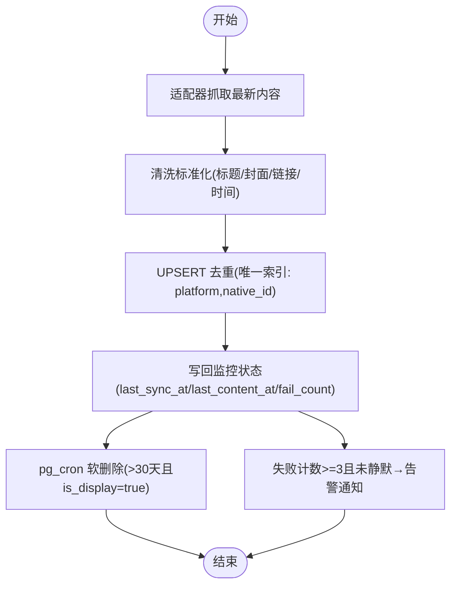
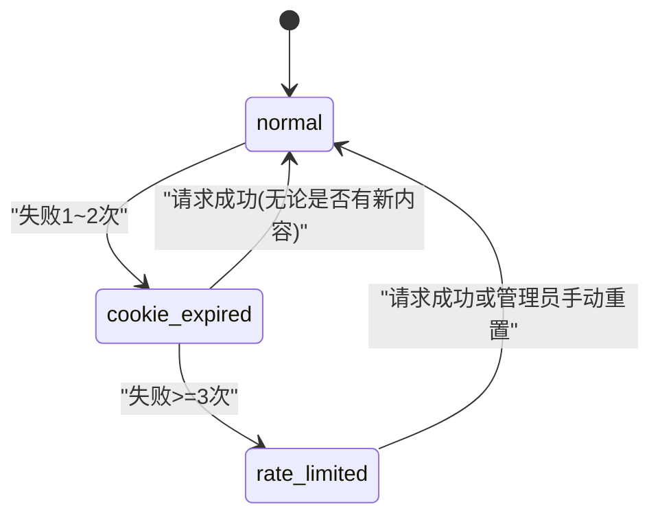
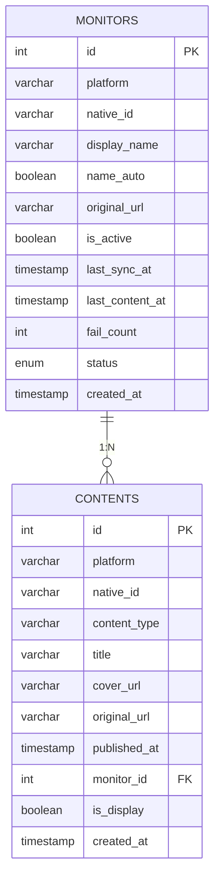
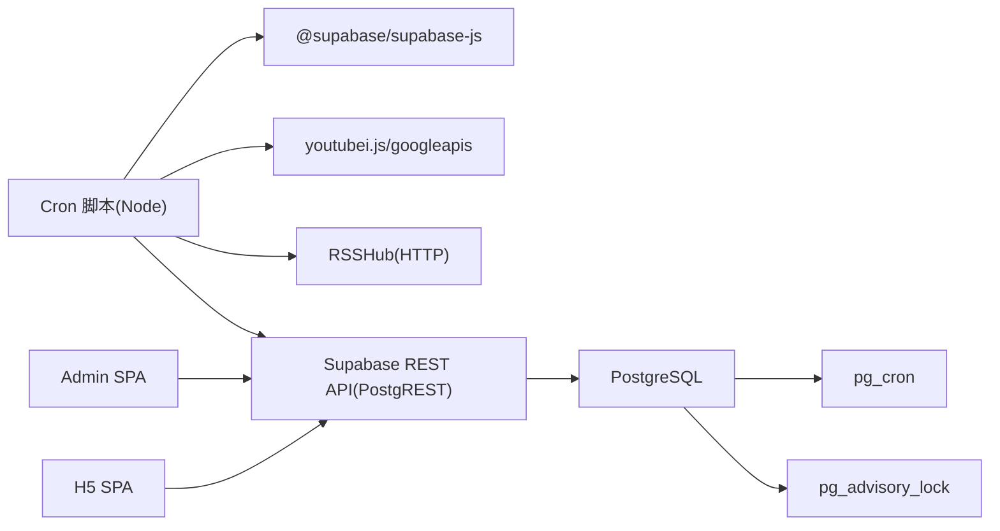

# GitHub Actions Cron工作流

<cite>
**本文引用的文件**
- [PROJECT_CONTEXT.md](file://PROJECT_CONTEXT.md)
- [多平台中枢_PRD.md](file://多平台中枢_PRD.md)
</cite>

## 目录
1. [简介](#简介)
2. [项目结构](#项目结构)
3. [核心组件](#核心组件)
4. [架构总览](#架构总览)
5. [详细组件分析](#详细组件分析)
6. [依赖分析](#依赖分析)
7. [性能考虑](#性能考虑)
8. [故障排查指南](#故障排查指南)
9. [结论](#结论)
10. [附录](#附录)

## 简介
本文件为“GitHub Actions Cron工作流”的技术文档，聚焦于定时任务调度机制、工作流配置与执行流程，以及平台适配器层的设计与实现要点。文档还涵盖数据处理流水线（清洗标准化、UPSERT去重、软删除生命周期管理、告警通知）、工作流监控与错误处理、性能优化建议等内容。为便于非技术读者理解，文档采用渐进式讲解与可视化图示相结合的方式组织内容。

## 项目结构
根据项目上下文文件，整体采用 Monorepo 结构，其中与 Cron 工作流直接相关的目录与文件如下：
- GitHub Actions 工作流：.github/workflows/cron-fetch.yml
- Cron 脚本（Node.js）：scripts/cron/src/index.ts 及其子模块（adapters、lib）
- 共享类型与常量：packages/shared/src/types、constants
- Supabase 边缘函数与数据库迁移：supabase/functions、supabase/migrations
- 前端应用：apps/admin、apps/h5
- 文档与示例：docs、.env.example

图表来源
- [PROJECT_CONTEXT.md:55-141](file://PROJECT_CONTEXT.md#L55-L141)

章节来源
- [PROJECT_CONTEXT.md:49-141](file://PROJECT_CONTEXT.md#L49-L141)

## 核心组件
- GitHub Actions 工作流：定义定时触发策略、环境变量注入与执行步骤。
- 平台适配器层：封装各平台 API 调用细节，统一返回标准化的原始内容结构。
- 数据处理流水线：清洗标准化、UPSERT 去重、软删除生命周期管理、告警通知。
- Supabase 集成：通过 REST API（Service Role Key）进行写入与查询，配合 RLS 与 pg_cron。
- 前后端共享类型：packages/shared 作为类型单一事实源，保证跨端一致性。

章节来源
- [PROJECT_CONTEXT.md:108-130](file://PROJECT_CONTEXT.md#L108-L130)
- [PROJECT_CONTEXT.md:301-317](file://PROJECT_CONTEXT.md#L301-L317)
- [PROJECT_CONTEXT.md:318-334](file://PROJECT_CONTEXT.md#L318-L334)
- [PROJECT_CONTEXT.md:420-473](file://PROJECT_CONTEXT.md#L420-L473)

## 架构总览
下图展示了 GitHub Actions Cron 工作流在整体系统中的位置与交互关系，包括定时触发、平台适配器、数据写入与前端读取等环节。

图表来源
- [PROJECT_CONTEXT.md:194-206](file://PROJECT_CONTEXT.md#L194-L206)
- [PROJECT_CONTEXT.md:617-643](file://PROJECT_CONTEXT.md#L617-L643)

章节来源
- [PROJECT_CONTEXT.md:169-240](file://PROJECT_CONTEXT.md#L169-L240)

## 详细组件分析

### GitHub Actions 工作流（定时调度）
- 触发策略：每 30 分钟执行一次，支持手动触发（workflow_dispatch）以便调试。
- 运行环境：ubuntu-latest，设置 Node.js 20 与 pnpm。
- 环境变量：注入 Supabase URL、Service Role Key、YouTube API Key、RSSHub 地址与 API Key。
- 执行步骤：检出代码、安装依赖、进入 cron 包并执行 tsx src/index.ts。

图表来源
- [PROJECT_CONTEXT.md:617-643](file://PROJECT_CONTEXT.md#L617-L643)

章节来源
- [PROJECT_CONTEXT.md:615-643](file://PROJECT_CONTEXT.md#L615-L643)

### 平台适配器层（B站/YouTube/知乎）
- 统一接口：PlatformAdapter.fetchLatest(monitor) 返回 RawContent[]，fetchDisplayName(monitor) 返回昵称。
- 适配器差异：
  - B站：空间 API + Cookie（SESSDATA），同平台请求间隔 ≥ 1.5 秒。
  - YouTube：Data API v3 + API Key，按平台分组执行，YouTube 专属降频（每 4 小时一次）。
  - 知乎：通过 RSSHub 中转，HTTP 调用 + API Key 鉴权。
- 数据模型：RawContent 包括 platform、native_id、content_type、title、cover_url、original_url、published_at。

图表来源
- [PROJECT_CONTEXT.md:574-598](file://PROJECT_CONTEXT.md#L574-L598)

章节来源
- [PROJECT_CONTEXT.md:301-317](file://PROJECT_CONTEXT.md#L301-L317)
- [PROJECT_CONTEXT.md:570-598](file://PROJECT_CONTEXT.md#L570-L598)

### 数据处理流水线（清洗标准化、UPSERT 去重、软删除、告警）
- 清洗标准化：统一字段（标题、封面、链接、发布时间），统一为 UTC。
- UPSERT 去重：基于 (platform, native_id) 唯一索引，命中时仅更新元数据，禁止复活软删除记录。
- 软删除生命周期：pg_cron 每日扫描，将超过 30 天且 is_display=true 的记录标记为 false。
- 告警通知：连续失败 ≥ 3 次触发，24 小时静默期内不再重复告警。

图表来源
- [PROJECT_CONTEXT.md:180-241](file://PROJECT_CONTEXT.md#L180-L241)
- [PROJECT_CONTEXT.md:318-334](file://PROJECT_CONTEXT.md#L318-L334)

章节来源
- [PROJECT_CONTEXT.md:178-241](file://PROJECT_CONTEXT.md#L178-L241)

### 监控与状态管理
- 监控状态机：normal → cookie_expired → rate_limited，成功即恢复。
- 失败计数：fail_count，成功即清零；写回前再次校验 monitor 是否仍存在且 is_active=true。
- 告警静默期：同一博主 24 小时内不重复告警。

图表来源
- [PROJECT_CONTEXT.md:721-785](file://PROJECT_CONTEXT.md#L721-L785)

章节来源
- [PROJECT_CONTEXT.md:721-785](file://PROJECT_CONTEXT.md#L721-L785)

### 数据模型与约束
- monitors 表：包含平台、native_id、display_name、is_active、last_sync_at、last_content_at、fail_count、status、created_at。
- contents 表：包含 platform、native_id、content_type、title、cover_url、original_url、published_at、monitor_id、is_display、created_at；唯一索引(platform, native_id)。
- RLS 策略：管理员可读写，访客仅可读取 is_display=true 的记录。

图表来源
- [PROJECT_CONTEXT.md:328-361](file://PROJECT_CONTEXT.md#L328-L361)

章节来源
- [PROJECT_CONTEXT.md:328-400](file://PROJECT_CONTEXT.md#L328-L400)

## 依赖分析
- Cron 脚本依赖：
  - @supabase/supabase-js：前端与 Cron 脚本共用 Supabase 客户端。
  - youtubei.js 或 googleapis：YouTube Data API v3 调用。
  - RSSHub：HTTP 调用，API Key 鉴权。
- Supabase 依赖：
  - PostgREST：自动生成 REST API。
  - pg_cron：每日软删除任务。
  - pg_advisory_lock：Cron 互斥锁。
- 前后端共享类型：packages/shared 作为类型单一事实源，Denos 环境通过副本同步。

图表来源
- [PROJECT_CONTEXT.md:25-32](file://PROJECT_CONTEXT.md#L25-L32)
- [PROJECT_CONTEXT.md:179-189](file://PROJECT_CONTEXT.md#L179-L189)

章节来源
- [PROJECT_CONTEXT.md:25-32](file://PROJECT_CONTEXT.md#L25-L32)
- [PROJECT_CONTEXT.md:169-240](file://PROJECT_CONTEXT.md#L169-L240)

## 性能考虑
- 并发与互斥：使用 pg_advisory_lock 避免 Cron 并发冲突；同平台请求间隔 ≥ 1.5 秒，YouTube 专属降频（每 4 小时一次）。
- 写入优化：UPSERT 基于唯一索引，避免重复写入；软删除仅标记 is_display=false，不频繁物理删除。
- 前端读取：RLS + 前端过滤 is_display=true，减少无效数据传输。
- 环境与依赖：固定 Node.js 20 与 pnpm，冻结锁文件，提升执行稳定性与速度。

章节来源
- [PROJECT_CONTEXT.md:180-206](file://PROJECT_CONTEXT.md#L180-L206)
- [PROJECT_CONTEXT.md:420-473](file://PROJECT_CONTEXT.md#L420-L473)

## 故障排查指南
- 常见错误码（Cron 脚本内部适配器层）：
  - UNKNOWN_PLATFORM / INVALID_URL / DUPLICATE_MONITOR：URL 解析问题。
  - BILIBILI_QRCODE_EXPIRED / BILIBILI_COOKIE_INVALID：B站 Cookie 失效或过期。
  - YOUTUBE_API_ERROR：YouTube API 调用失败。
  - RSSHUB_ERROR：RSSHub 接口调用失败。
  - INTERNAL_ERROR：未预期的内部错误。
- 状态流转与告警：
  - normal → cookie_expired → rate_limited，成功即恢复；连续失败 ≥ 3 次触发告警，24 小时静默期。
- 监控写回校验：写回前再次校验 monitor 是否仍存在且 is_active=true，避免并发删除或关闭导致的脏写。

章节来源
- [PROJECT_CONTEXT.md:600-614](file://PROJECT_CONTEXT.md#L600-L614)
- [PROJECT_CONTEXT.md:721-785](file://PROJECT_CONTEXT.md#L721-L785)

## 结论
本工作流通过 GitHub Actions 定时调度、平台适配器层抽象、数据清洗与 UPSERT 去重、软删除生命周期管理与告警通知，形成完整的“配置驱动抓取”闭环。结合 Supabase 的 RLS、PostgREST 与 pg_cron，系统在安全性、可维护性与可扩展性方面具备良好基础。建议持续关注平台 API 变更、Cookie 生命周期与 RSSHub 可用性，完善异常监控与告警策略。

## 附录
- 环境变量清单（节选）：
  - SUPABASE_URL、SUPABASE_ANON_KEY、SUPABASE_SERVICE_ROLE_KEY
  - YOUTUBE_API_KEY
  - BILIBILI_COOKIE_*（加密存储于数据库）
  - RSSHUB_URL、RSSHUB_API_KEY
  - WECOM_WEBHOOK_URL（可选）

章节来源
- [PROJECT_CONTEXT.md:34-46](file://PROJECT_CONTEXT.md#L34-L46)