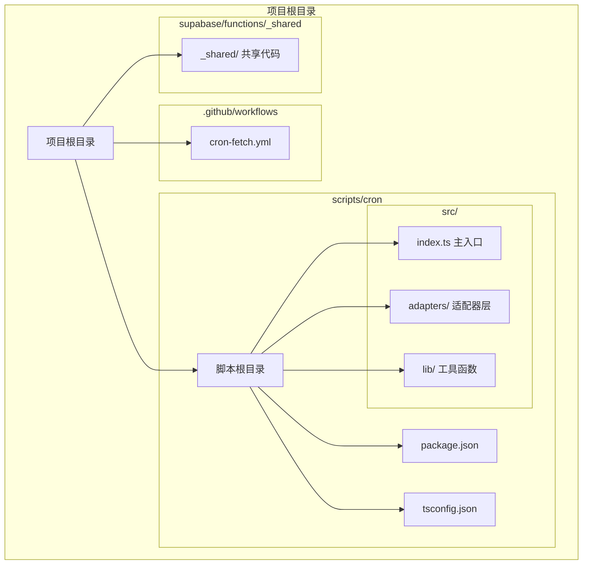
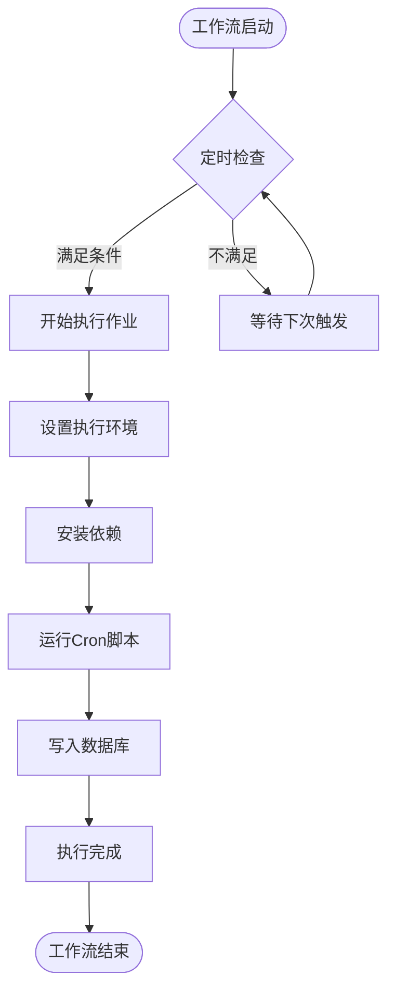
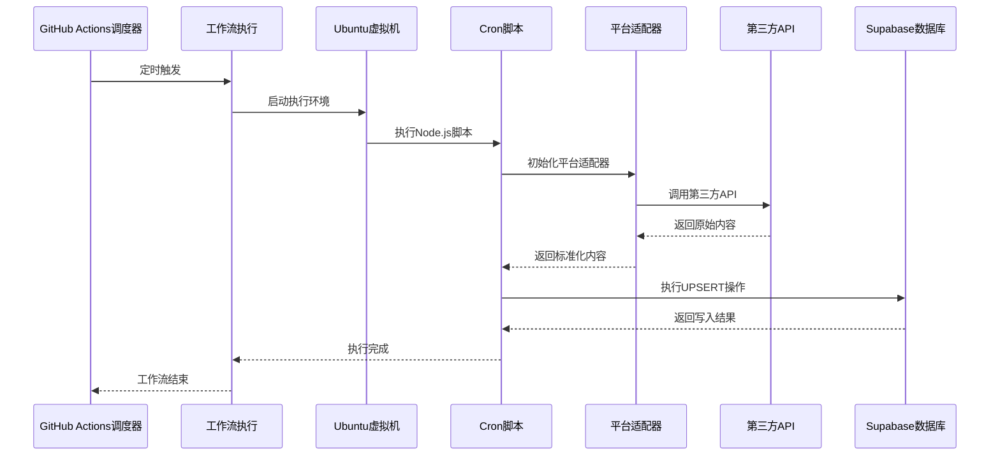
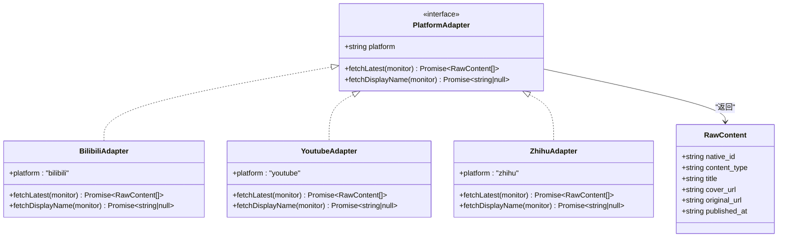
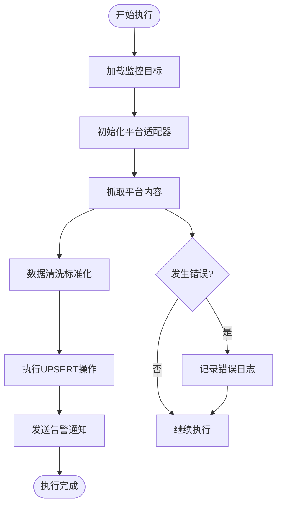
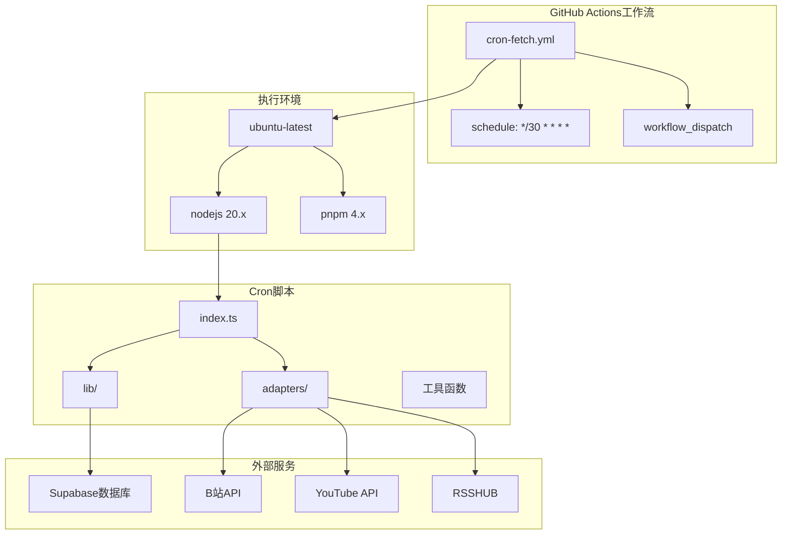

# 工作流配置与调度

<cite>
**本文档引用的文件**
- [PROJECT_CONTEXT.md](file://PROJECT_CONTEXT.md)
- [.github/workflows/cron-fetch.yml](file://.github/workflows/cron-fetch.yml)
- [scripts/cron/package.json](file://scripts/cron/package.json)
- [scripts/cron/tsconfig.json](file://scripts/cron/tsconfig.json)
- [scripts/cron/src/index.ts](file://scripts/cron/src/index.ts)
- [scripts/cron/src/adapters/types.ts](file://scripts/cron/src/adapters/types.ts)
- [scripts/cron/src/lib/supabase.ts](file://scripts/cron/src/lib/supabase.ts)
- [scripts/cron/src/lib/upsert.ts](file://scripts/cron/src/lib/upsert.ts)
- [scripts/cron/src/lib/alert.ts](file://scripts/cron/src/lib/alert.ts)
</cite>

## 目录
1. [简介](#简介)
2. [项目结构](#项目结构)
3. [核心组件](#核心组件)
4. [架构概览](#架构概览)
5. [详细组件分析](#详细组件分析)
6. [依赖关系分析](#依赖关系分析)
7. [性能考虑](#性能考虑)
8. [故障排除指南](#故障排除指南)
9. [结论](#结论)

## 简介

本文档详细介绍了多平台内容中枢项目的GitHub Actions Cron工作流配置。该项目采用每30分钟自动触发的定时任务机制，通过Node.js脚本从多个第三方平台（B站、YouTube、知乎）抓取内容，并将数据写入Supabase数据库。工作流配置涵盖了YAML语法、调度时间设置、环境变量配置、依赖管理和并发控制等关键方面。

## 项目结构

项目采用Monorepo架构，其中GitHub Actions工作流位于`.github/workflows/`目录下，Cron脚本位于`scripts/cron/`目录中：



**图表来源**
- [PROJECT_CONTEXT.md: 115-141:115-141](file://PROJECT_CONTEXT.md#L115-L141)

**章节来源**
- [PROJECT_CONTEXT.md: 115-141:115-141](file://PROJECT_CONTEXT.md#L115-L141)

## 核心组件

### GitHub Actions工作流配置

工作流配置位于`.github/workflows/cron-fetch.yml`文件中，采用YAML语法定义了完整的定时任务流程：



**图表来源**
- [PROJECT_CONTEXT.md: 617-643:617-643](file://PROJECT_CONTEXT.md#L617-L643)

### Cron表达式详解

工作流使用标准的Cron表达式进行调度：

| 字段 | 允许值 | 描述 | 示例 |
|------|--------|------|------|
| 分钟 | 0-59 | 分钟数 | `*/30` 表示每30分钟 |
| 小时 | 0-23 | 小时数 | `*` 表示每小时 |
| 日期 | 1-31 | 月份中的日期 | `*` 表示每天 |
| 月份 | 1-12 | 月份 | `*` 表示每月 |
| 星期 | 0-7 | 星期几 | `*` 表示每周 |

**章节来源**
- [PROJECT_CONTEXT.md: 617-643:617-643](file://PROJECT_CONTEXT.md#L617-L643)

## 架构概览

整个Cron工作流的执行架构如下：



**图表来源**
- [PROJECT_CONTEXT.md: 194-200:194-200](file://PROJECT_CONTEXT.md#L194-L200)
- [PROJECT_CONTEXT.md: 617-643:617-643](file://PROJECT_CONTEXT.md#L617-L643)

## 详细组件分析

### 环境变量配置

工作流配置中定义了多个关键环境变量，这些变量存储在GitHub Secrets中：

| 环境变量名 | 存储位置 | 用途 | 安全级别 |
|------------|----------|------|----------|
| `SUPABASE_URL` | GitHub Secrets | Supabase项目URL | 高 |
| `SUPABASE_SERVICE_ROLE_KEY` | GitHub Secrets | 绕过RLS的密钥 | 最高 |
| `YOUTUBE_API_KEY` | GitHub Secrets | YouTube API密钥 | 高 |
| `RSSHUB_URL` | GitHub Secrets | RSSHub实例地址 | 高 |
| `RSSHUB_API_KEY` | GitHub Secrets | RSSHub访问密钥 | 高 |

**章节来源**
- [PROJECT_CONTEXT.md: 34-46:34-46](file://PROJECT_CONTEXT.md#L34-L46)
- [PROJECT_CONTEXT.md: 617-643:617-643](file://PROJECT_CONTEXT.md#L617-L643)

### 依赖管理配置

Cron脚本使用pnpm进行依赖管理，配置文件位于`scripts/cron/package.json`：

```mermaid
graph LR
subgraph "依赖管理"
PNPM[pnpm包管理器]
LockFile[pnpm-lock.yaml]
Workspace[Monorepo工作区]
end
subgraph "开发依赖"
TS[TypeScript]
DevTools[开发工具]
end
subgraph "运行时依赖"
SupabaseJS[@supabase/supabase-js]
PlatformAPIs[平台API客户端]
end
PNPM --> LockFile
PNPM --> Workspace
PNPM --> TS
PNPM --> DevTools
PNPM --> SupabaseJS
PNPM --> PlatformAPIs
```

**图表来源**
- [PROJECT_CONTEXT.md: 115-131:115-131](file://PROJECT_CONTEXT.md#L115-L131)
- [PROJECT_CONTEXT.md: 25-33:25-33](file://PROJECT_CONTEXT.md#L25-L33)

**章节来源**
- [PROJECT_CONTEXT.md: 115-131:115-131](file://PROJECT_CONTEXT.md#L115-L131)
- [PROJECT_CONTEXT.md: 25-33:25-33](file://PROJECT_CONTEXT.md#L25-L33)

### 平台适配器架构

Cron脚本实现了统一的平台适配器接口，支持三种不同的内容平台：



**图表来源**
- [PROJECT_CONTEXT.md: 570-598:570-598](file://PROJECT_CONTEXT.md#L570-L598)

**章节来源**
- [PROJECT_CONTEXT.md: 570-598:570-598](file://PROJECT_CONTEXT.md#L570-L598)

### 数据处理流程

Cron脚本的数据处理流程包括内容抓取、清洗标准化和数据库写入三个主要阶段：



**图表来源**
- [PROJECT_CONTEXT.md: 318-334:318-334](file://PROJECT_CONTEXT.md#L318-L334)

**章节来源**
- [PROJECT_CONTEXT.md: 318-334:318-334](file://PROJECT_CONTEXT.md#L318-L334)

## 依赖关系分析

### 工作流依赖图



**图表来源**
- [PROJECT_CONTEXT.md: 617-643:617-643](file://PROJECT_CONTEXT.md#L617-L643)
- [PROJECT_CONTEXT.md: 194-200:194-200](file://PROJECT_CONTEXT.md#L194-L200)

### 并发控制机制

工作流采用了多层并发控制机制来确保系统的稳定性和可靠性：

1. **平台间并行，平台内串行**：不同平台的内容抓取可以并行执行，但同一平台内的请求间隔至少1.5秒，防止反爬虫检测

2. **数据库互斥锁**：使用PostgreSQL的`pg_advisory_lock`确保Cron任务的互斥执行，避免重复执行

3. **工作流超时控制**：设置10分钟的执行超时时间，防止长时间阻塞

**章节来源**
- [PROJECT_CONTEXT.md: 218-222:218-222](file://PROJECT_CONTEXT.md#L218-L222)

## 性能考虑

### 资源限制配置

工作流配置中包含了多项资源限制措施：

- **执行超时**：10分钟超时限制，防止长时间运行的任务占用资源
- **内存限制**：Ubuntu虚拟机默认内存限制，适合中小型数据处理任务
- **网络超时**：第三方API调用设置了合理的超时时间，避免网络问题导致的长时间等待

### 优化建议

1. **批量处理**：对于大量监控目标的情况，可以考虑实现批量处理机制，减少API调用次数

2. **缓存策略**：对频繁访问但不经常变化的数据实施缓存策略，减少不必要的API调用

3. **错误重试**：为第三方API调用实现指数退避的重试机制，提高系统的容错能力

## 故障排除指南

### 常见配置错误

1. **Cron表达式格式错误**
   - 症状：工作流不按预期触发
   - 解决方案：确保Cron表达式符合5字段格式，使用在线验证工具检查表达式正确性

2. **环境变量未正确设置**
   - 症状：工作流执行时报错，提示找不到必要的密钥
   - 解决方案：检查GitHub Secrets中变量名是否正确，确认变量值是否完整

3. **依赖安装失败**
   - 症状：pnpm安装过程中出现网络错误或版本冲突
   - 解决方案：检查`pnpm-lock.yaml`文件完整性，清理缓存后重新安装

### 调试技巧

1. **手动触发测试**：利用`workflow_dispatch`事件手动触发工作流，便于快速测试配置正确性

2. **分步调试**：将复杂的Cron脚本拆分为多个独立的步骤，分别测试每个步骤的功能

3. **日志分析**：仔细分析工作流执行日志，重点关注错误信息和警告信息

**章节来源**
- [PROJECT_CONTEXT.md: 617-643:617-643](file://PROJECT_CONTEXT.md#L617-L643)

## 结论

本项目的工作流配置展现了现代CI/CD实践的最佳实践。通过合理的Cron表达式设计、严格的环境变量管理、清晰的依赖关系配置以及完善的错误处理机制，实现了稳定可靠的内容抓取系统。

关键优势包括：
- **安全性**：敏感信息通过GitHub Secrets管理，避免硬编码
- **可维护性**：模块化的平台适配器设计，便于扩展新的内容平台
- **可靠性**：多层次的错误处理和超时控制机制
- **可观测性**：完整的日志记录和告警通知系统

这套配置为类似的内容聚合项目提供了完整的参考模板，可以根据具体需求进行调整和扩展。