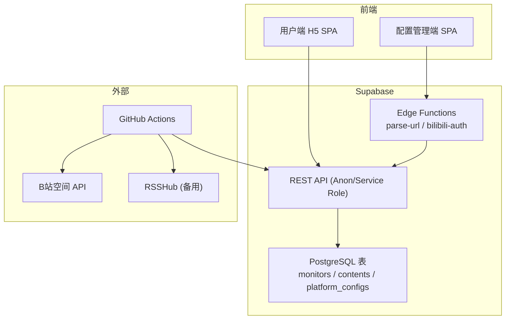
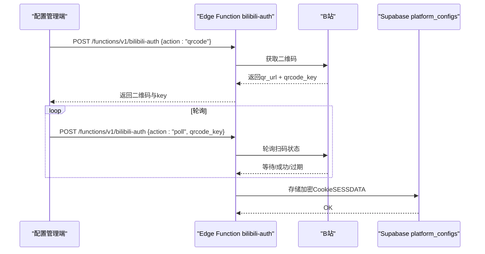
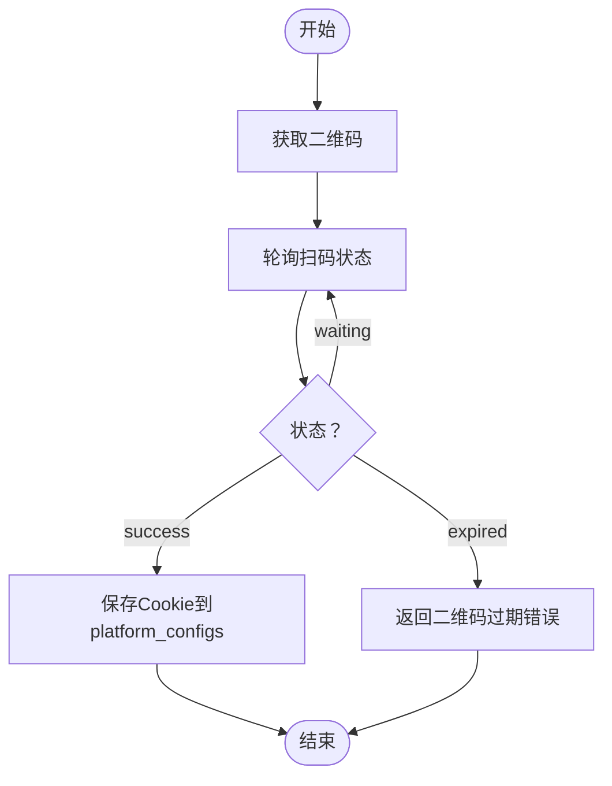
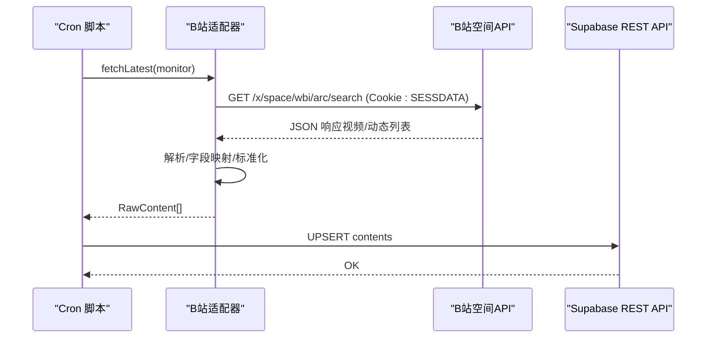
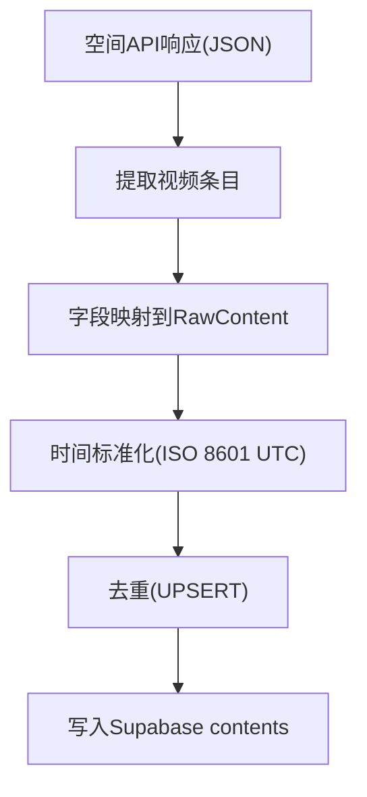
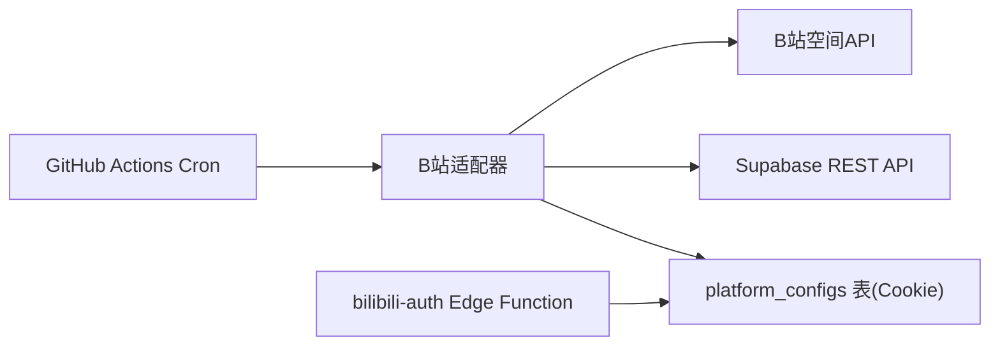

# B站适配器

<cite>
**本文档引用的文件**
- [PROJECT_CONTEXT.md](file://PROJECT_CONTEXT.md)
- [多平台中枢_PRD.md](file://多平台中枢_PRD.md)
</cite>

## 目录
1. [简介](#简介)
2. [项目结构](#项目结构)
3. [核心组件](#核心组件)
4. [架构总览](#架构总览)
5. [详细组件分析](#详细组件分析)
6. [依赖关系分析](#依赖关系分析)
7. [性能考虑](#性能考虑)
8. [故障排查指南](#故障排查指南)
9. [结论](#结论)
10. [附录](#附录)

## 简介
本文件面向“B站适配器”的技术文档，聚焦于以下目标：
- 深入解释B站Cookie认证机制的实现原理，包括扫码登录流程、Cookie获取与验证过程
- 详解空间API调用的技术细节，包括API端点、请求参数、响应格式与错误处理
- 阐述视频数据获取策略，包括内容解析、字段映射与数据标准化
- 提供适配器配置选项、性能优化建议与常见问题解决方案

## 项目结构
B站适配器位于“后端自动化引擎”的“平台适配器层”，由GitHub Actions定时触发的Node.js脚本调用，抓取来源为B站空间API，并使用已存储的Cookie进行鉴权。

图表来源
- [PROJECT_CONTEXT.md: 173-207:173-207](file://PROJECT_CONTEXT.md#L173-L207)
- [PROJECT_CONTEXT.md: 115-131:115-131](file://PROJECT_CONTEXT.md#L115-L131)

章节来源
- [PROJECT_CONTEXT.md: 173-207:173-207](file://PROJECT_CONTEXT.md#L173-L207)
- [PROJECT_CONTEXT.md: 115-131:115-131](file://PROJECT_CONTEXT.md#L115-L131)

## 核心组件
- 平台适配器接口（内部）
  - 统一方法：fetchLatest(monitor) → Promise<RawContent[]>
  - 统一类型：RawContent（包含native_id、content_type、title、cover_url、original_url、published_at）
- B站适配器职责
  - 数据源：B站空间API（x/space/wbi/arc/search）
  - 鉴权：Cookie（SESSDATA）
  - 限速：同平台请求间隔≥1.5秒
- Cookie管理
  - 通过Edge Function bilibili-auth完成扫码登录，轮询二维码状态，成功后将Cookie加密存储至platform_configs表

章节来源
- [PROJECT_CONTEXT.md: 574-598:574-598](file://PROJECT_CONTEXT.md#L574-L598)
- [PROJECT_CONTEXT.md: 301-317:301-317](file://PROJECT_CONTEXT.md#L301-L317)
- [PROJECT_CONTEXT.md: 292-299:292-299](file://PROJECT_CONTEXT.md#L292-L299)

## 架构总览
B站适配器在整体架构中的定位如下：
- 前端不直接调用第三方平台API；B站/YouTube/知乎的抓取均在GitHub Actions Cron脚本内完成
- Edge Function负责URL解析与B站扫码授权；Cron脚本通过Supabase REST API写入数据
- B站Cookie通过bilibili-auth接口扫码登录后存入platform_configs表（加密）

图表来源
- [PROJECT_CONTEXT.md: 539-568:539-568](file://PROJECT_CONTEXT.md#L539-L568)
- [PROJECT_CONTEXT.md: 292-299:292-299](file://PROJECT_CONTEXT.md#L292-L299)

章节来源
- [PROJECT_CONTEXT.md: 213-222:213-222](file://PROJECT_CONTEXT.md#L213-L222)
- [PROJECT_CONTEXT.md: 539-568:539-568](file://PROJECT_CONTEXT.md#L539-L568)

## 详细组件分析

### B站Cookie认证机制
- 扫码登录流程
  - 获取二维码：Edge Function接收action="qrcode"，返回qr_url与qrcode_key
  - 轮询扫码状态：action="poll"携带qrcode_key，返回waiting/success/expired
  - 成功后将Cookie（SESSDATA）加密写入platform_configs表
- Cookie获取与验证
  - Cookie来源于B站扫码登录成功后的会话
  - 适配器抓取时以Cookie作为请求头进行鉴权
  - 若Cookie失效，返回401（BILIBILI_COOKIE_INVALID）

图表来源
- [PROJECT_CONTEXT.md: 539-568:539-568](file://PROJECT_CONTEXT.md#L539-L568)
- [PROJECT_CONTEXT.md: 609-610:609-610](file://PROJECT_CONTEXT.md#L609-L610)

章节来源
- [PROJECT_CONTEXT.md: 539-568:539-568](file://PROJECT_CONTEXT.md#L539-L568)
- [PROJECT_CONTEXT.md: 609-610:609-610](file://PROJECT_CONTEXT.md#L609-L610)

### 空间API调用技术细节
- API端点
  - 数据源：B站空间API（x/space/wbi/arc/search）
- 请求参数
  - 鉴权：Cookie（SESSDATA）
  - 限速：同平台请求间隔≥1.5秒
- 响应格式
  - 适配器返回RawContent数组，字段包括native_id、content_type、title、cover_url、original_url、published_at
- 错误处理
  - Cookie无效：401（BILIBILI_COOKIE_INVALID）
  - 平台识别错误：400（UNKNOWN_PLATFORM）
  - 其他平台错误：参考统一错误码规范

图表来源
- [PROJECT_CONTEXT.md: 314-314:314-314](file://PROJECT_CONTEXT.md#L314-L314)
- [PROJECT_CONTEXT.md: 574-598:574-598](file://PROJECT_CONTEXT.md#L574-L598)
- [PROJECT_CONTEXT.md: 435-473:435-473](file://PROJECT_CONTEXT.md#L435-L473)

章节来源
- [PROJECT_CONTEXT.md: 314-314:314-314](file://PROJECT_CONTEXT.md#L314-L314)
- [PROJECT_CONTEXT.md: 574-598:574-598](file://PROJECT_CONTEXT.md#L574-L598)
- [PROJECT_CONTEXT.md: 435-473:435-473](file://PROJECT_CONTEXT.md#L435-L473)

### 视频数据获取策略
- 内容解析
  - 从空间API响应中提取视频元数据（标题、封面、链接、发布时间等）
- 字段映射
  - 将平台字段映射到RawContent标准字段集
- 数据标准化
  - 时间字段统一为ISO 8601 UTC
  - 去重策略：基于(platform, native_id)唯一索引的UPSERT
  - 软删除：is_display=false的记录不参与更新

图表来源
- [PROJECT_CONTEXT.md: 574-598:574-598](file://PROJECT_CONTEXT.md#L574-L598)
- [PROJECT_CONTEXT.md: 320-333:320-333](file://PROJECT_CONTEXT.md#L320-L333)

章节来源
- [PROJECT_CONTEXT.md: 574-598:574-598](file://PROJECT_CONTEXT.md#L574-L598)
- [PROJECT_CONTEXT.md: 320-333:320-333](file://PROJECT_CONTEXT.md#L320-L333)

### 适配器配置选项与最佳实践
- 配置项
  - SUPABASE_SERVICE_ROLE_KEY：Cron与Edge Function写入数据库使用
  - BILIBILI_COOKIE_*：存储在platform_configs表中，使用Supabase Vault加密
- 性能优化
  - 同平台请求间隔≥1.5秒，避免反爬
  - 平台间可并行，提升吞吐
- 最佳实践
  - Cookie有效期管理：定期刷新或轮换
  - 错误分类与重试：区分网络错误与鉴权错误，避免无效重试
  - 日志与告警：结合企业微信Webhook进行异常通知

章节来源
- [PROJECT_CONTEXT.md: 34-46:34-46](file://PROJECT_CONTEXT.md#L34-L46)
- [PROJECT_CONTEXT.md: 220-221:220-221](file://PROJECT_CONTEXT.md#L220-L221)
- [PROJECT_CONTEXT.md: 615-643:615-643](file://PROJECT_CONTEXT.md#L615-L643)

## 依赖关系分析
- 组件耦合
  - B站适配器依赖Cookie存储（platform_configs）与Supabase REST API
  - Edge Function bilibili-auth为适配器提供鉴权凭据
- 外部依赖
  - B站空间API（x/space/wbi/arc/search）
  - Supabase（PostgreSQL + PostgREST + Edge Functions）
- 错误边界
  - Cookie失效：401（BILIBILI_COOKIE_INVALID）
  - URL识别失败：400（UNKNOWN_PLATFORM）
  - 平台特定错误：参考统一错误码规范

图表来源
- [PROJECT_CONTEXT.md: 301-317:301-317](file://PROJECT_CONTEXT.md#L301-L317)
- [PROJECT_CONTEXT.md: 292-299:292-299](file://PROJECT_CONTEXT.md#L292-L299)
- [PROJECT_CONTEXT.md: 609-610:609-610](file://PROJECT_CONTEXT.md#L609-L610)

章节来源
- [PROJECT_CONTEXT.md: 301-317:301-317](file://PROJECT_CONTEXT.md#L301-L317)
- [PROJECT_CONTEXT.md: 609-610:609-610](file://PROJECT_CONTEXT.md#L609-L610)

## 性能考虑
- 请求限速
  - 同平台请求间隔≥1.5秒，降低风控风险
- 并发策略
  - 平台间可并行执行，提升整体吞吐
- 数据写入
  - 使用UPSERT去重，减少重复写入开销
- 缓存与降级
  - Cookie轮换与失效快速检测，避免无效请求

## 故障排查指南
- 常见错误与处理
  - BILIBILI_COOKIE_INVALID（401）：重新扫码登录，刷新Cookie
  - UNKNOWN_PLATFORM（400）：确认URL是否包含bilibili.com且mid格式正确
  - BILIBILI_QRCODE_EXPIRED（400）：重新发起二维码获取与轮询
- 监控与诊断
  - 查看monitor状态（normal/cookie_expired/rate_limited）
  - 结合日志与告警（企业微信Webhook）定位问题
- 数据一致性
  - 关注软删除（is_display=false）对更新的影响
  - UPSERT策略确保重复内容不覆盖非显示记录

章节来源
- [PROJECT_CONTEXT.md: 609-610:609-610](file://PROJECT_CONTEXT.md#L609-L610)
- [PROJECT_CONTEXT.md: 403-407:403-407](file://PROJECT_CONTEXT.md#L403-L407)
- [PROJECT_CONTEXT.md: 339-345:339-345](file://PROJECT_CONTEXT.md#L339-L345)

## 结论
B站适配器通过Edge Function完成扫码登录并获取Cookie，随后在Cron脚本中调用B站空间API抓取内容，借助Supabase实现数据清洗、标准化与去重。遵循限速与加密存储策略，可在保证合规的前提下稳定获取B站内容。

## 附录
- API与接口参考
  - parse-url接口：解析URL并识别平台与标识
  - bilibili-auth接口：二维码获取与轮询
- 数据模型要点
  - RawContent字段集与contents表字段映射
  - platform_configs表用于加密存储Cookie

章节来源
- [PROJECT_CONTEXT.md: 511-568:511-568](file://PROJECT_CONTEXT.md#L511-L568)
- [PROJECT_CONTEXT.md: 574-598:574-598](file://PROJECT_CONTEXT.md#L574-L598)
- [PROJECT_CONTEXT.md: 389-397:389-397](file://PROJECT_CONTEXT.md#L389-L397)