# YouTube适配器

<cite>
**本文档引用的文件**
- [PROJECT_CONTEXT.md](file://PROJECT_CONTEXT.md)
</cite>

## 目录
1. [简介](#简介)
2. [项目结构](#项目结构)
3. [核心组件](#核心组件)
4. [架构概览](#架构概览)
5. [详细组件分析](#详细组件分析)
6. [依赖关系分析](#依赖关系分析)
7. [性能考虑](#性能考虑)
8. [故障排除指南](#故障排除指南)
9. [结论](#结论)

## 简介

YouTube适配器是多平台内容中枢系统中的核心组件之一，负责从YouTube Data API v3中抓取和处理内容数据。该适配器采用配置驱动的抓取模式，通过GitHub Actions定时任务在后台运行，不直接暴露给前端用户。

YouTube适配器的主要功能包括：
- 使用YouTube Data API v3进行内容检索
- 处理API响应和错误重试机制
- 实现速率限制策略以遵守API配额
- 提供YouTube特定的数据映射规则
- 支持内容过滤和深度链接跳转

## 项目结构

多平台内容中枢采用Monorepo架构，YouTube适配器位于Cron脚本的适配器层中：

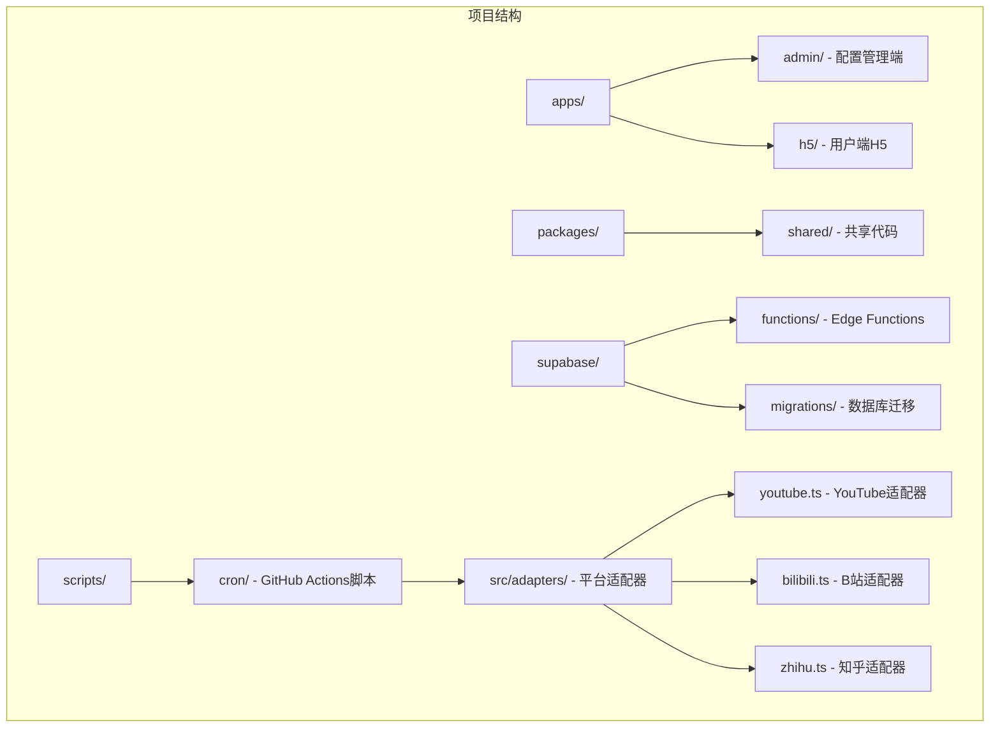

**图表来源**
- [PROJECT_CONTEXT.md:51-141](file://PROJECT_CONTEXT.md#L51-L141)

**章节来源**
- [PROJECT_CONTEXT.md:51-141](file://PROJECT_CONTEXT.md#L51-L141)

## 核心组件

### 平台适配器接口

YouTube适配器遵循统一的PlatformAdapter接口规范，确保与其他平台适配器的一致性：

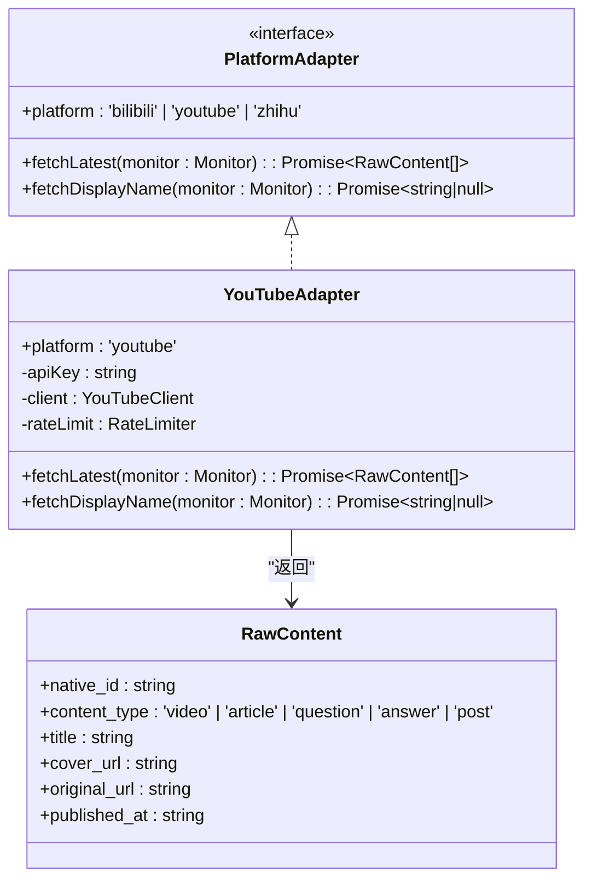

**图表来源**
- [PROJECT_CONTEXT.md:574-598](file://PROJECT_CONTEXT.md#L574-L598)

### YouTube Data API v3集成

YouTube适配器使用YouTube Data API v3进行内容检索，主要依赖于`youtubei.js`或`googleapis`库：

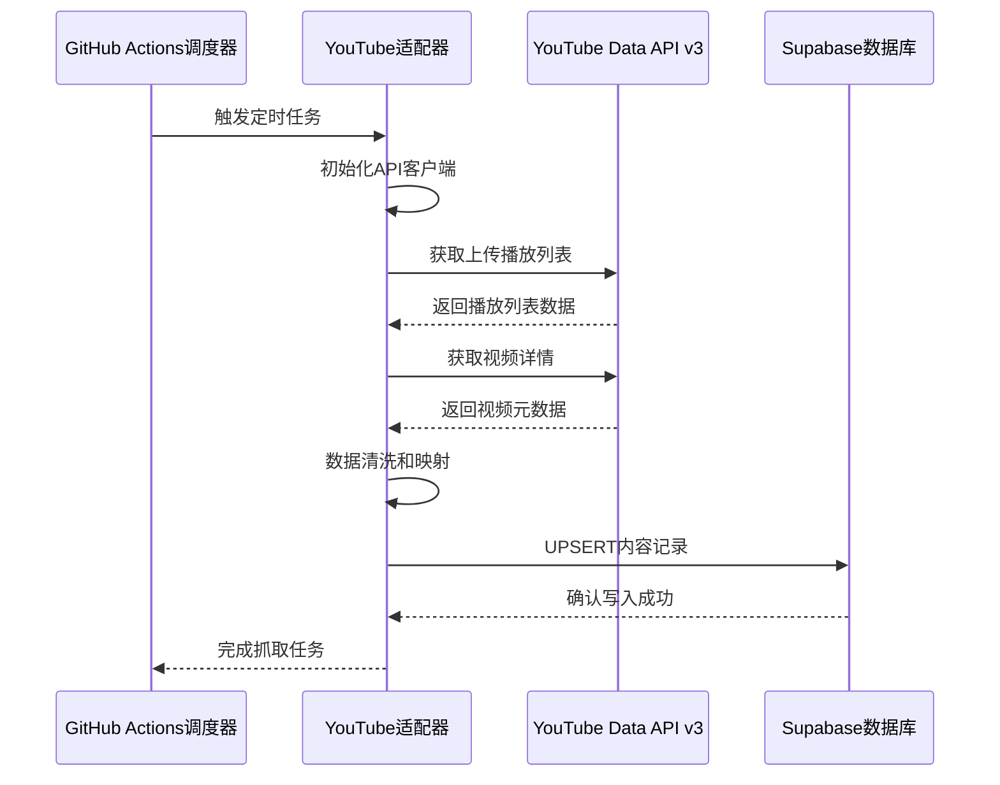

**图表来源**
- [PROJECT_CONTEXT.md:195-200](file://PROJECT_CONTEXT.md#L195-L200)
- [PROJECT_CONTEXT.md:617-643](file://PROJECT_CONTEXT.md#L617-L643)

**章节来源**
- [PROJECT_CONTEXT.md:574-598](file://PROJECT_CONTEXT.md#L574-L598)
- [PROJECT_CONTEXT.md:312-317](file://PROJECT_CONTEXT.md#L312-L317)

## 架构概览

YouTube适配器在整个系统架构中扮演着关键角色，作为后端自动化引擎的一部分：

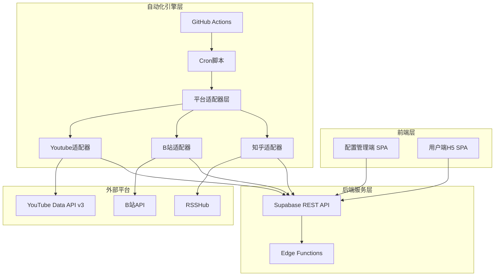

**图表来源**
- [PROJECT_CONTEXT.md:171-207](file://PROJECT_CONTEXT.md#L171-L207)

**章节来源**
- [PROJECT_CONTEXT.md:171-207](file://PROJECT_CONTEXT.md#L171-L207)

## 详细组件分析

### API密钥配置与管理

YouTube适配器使用API密钥进行身份验证，密钥通过GitHub Secrets进行安全管理：

#### 环境变量配置

| 环境变量 | 存储位置 | 用途 | 安全级别 |
|---------|---------|------|---------|
| `YOUTUBE_API_KEY` | GitHub Secrets | YouTube Data API v3密钥 | 高 |
| `SUPABASE_URL` | GitHub Secrets/Vercel | Supabase项目URL | 高 |
| `SUPABASE_SERVICE_ROLE_KEY` | GitHub Secrets | 绕过RLS的密钥 | 极高 |

#### API密钥轮换策略

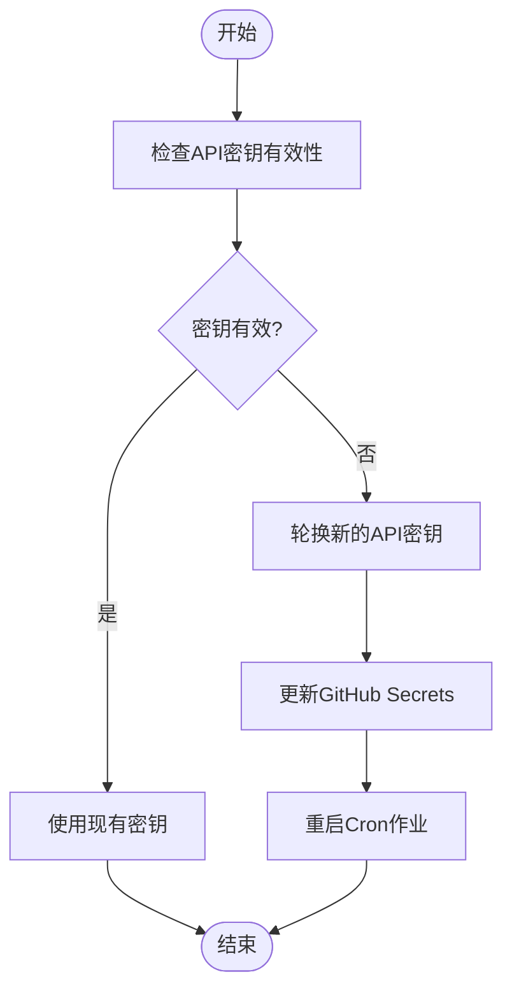

**章节来源**
- [PROJECT_CONTEXT.md:34-46](file://PROJECT_CONTEXT.md#L34-L46)
- [PROJECT_CONTEXT.md:629-634](file://PROJECT_CONTEXT.md#L629-L634)

### OAuth认证流程

虽然YouTube适配器主要使用API密钥进行访问，但系统架构支持OAuth认证流程：

#### OAuth认证序列图

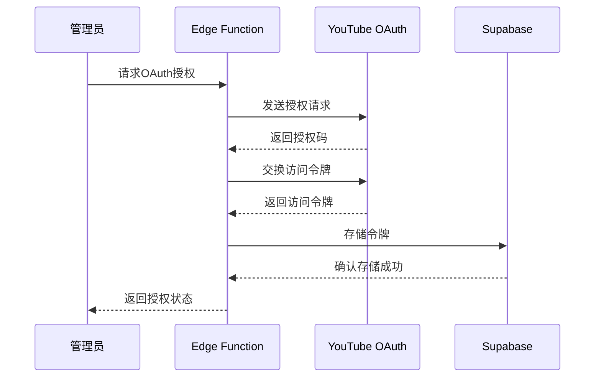

**图表来源**
- [PROJECT_CONTEXT.md:292-299](file://PROJECT_CONTEXT.md#L292-L299)

### 内容检索逻辑

YouTube适配器采用"上传播放列表"模式进行内容检索：

#### 内容检索流程

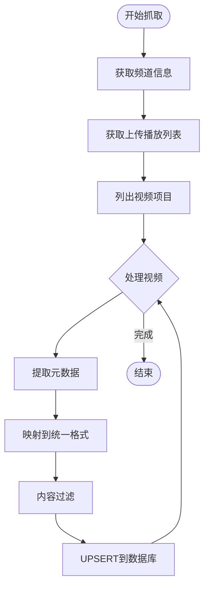

**图表来源**
- [PROJECT_CONTEXT.md:314-316](file://PROJECT_CONTEXT.md#L314-L316)

#### 频道订阅处理

YouTube适配器支持多种频道识别方式：

| 频道识别方式 | API调用 | 参数 | 用途 |
|-------------|--------|------|------|
| 频道ID | `channels.list` | `id=channelId` | 直接通过ID获取 |
| 用户名 | `channels.list` | `forUsername=username` | 通过用户名获取 |
| 处理句柄 | `channels.list` | `forHandle=handle` | 通过@handle获取 |
| 搜索 | `search.list` | `q=channelName` | 通过搜索获取 |

**章节来源**
- [PROJECT_CONTEXT.md:287-290](file://PROJECT_CONTEXT.md#L287-L290)

### API响应处理与错误重试

#### 错误处理机制

YouTube适配器实现了完善的错误处理和重试机制：

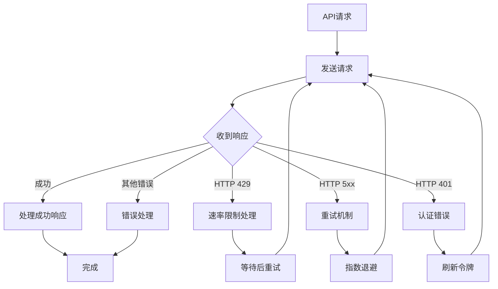

**图表来源**
- [PROJECT_CONTEXT.md:600-614](file://PROJECT_CONTEXT.md#L600-L614)

#### 速率限制策略

YouTube适配器遵循严格的速率限制策略：

| 限制类型 | 限制值 | 说明 | 实施方式 |
|---------|--------|------|---------|
| 请求频率 | 1.5秒/请求 | 防止反爬虫检测 | 代码级延迟 |
| 并发请求 | 1个并发 | 避免API限制 | 串行执行 |
| 重试次数 | 最多3次 | 处理临时错误 | 指数退避 |
| 重试间隔 | 1s, 2s, 4s | 指数退避策略 | 动态计算 |

**章节来源**
- [PROJECT_CONTEXT.md:220](file://PROJECT_CONTEXT.md#L220)
- [PROJECT_CONTEXT.md:600-614](file://PROJECT_CONTEXT.md#L600-L614)

### 数据映射规则

#### YouTube特定数据映射

YouTube适配器将YouTube API响应映射到统一的RawContent格式：

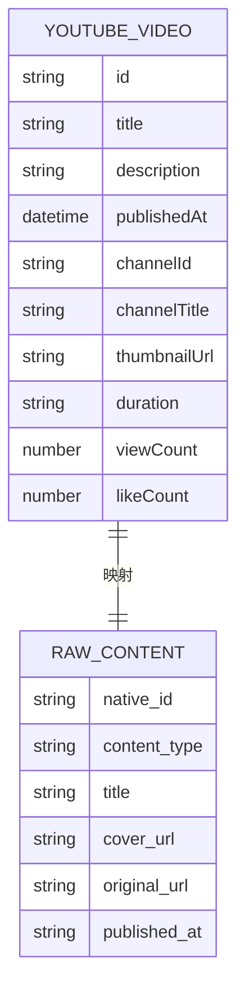

**图表来源**
- [PROJECT_CONTEXT.md:577-585](file://PROJECT_CONTEXT.md#L577-L585)

#### 内容类型映射

| YouTube内容类型 | RawContent.content_type | 说明 |
|----------------|------------------------|------|
| video | 'video' | 标准视频内容 |
| playlist | 'video' | 播放列表中的视频 |
| channel | 'video' | 频道上传内容 |

#### 元数据提取规则

YouTube适配器提取的关键元数据包括：

1. **基础信息**
   - 视频ID → `native_id`
   - 标题 → `title`
   - 发布时间 → `published_at`

2. **媒体信息**
   - 缩略图URL → `cover_url`
   - 原始URL → `original_url`

3. **内容信息**
   - 内容类型 → `content_type`
   - 描述信息 → 标准化处理

**章节来源**
- [PROJECT_CONTEXT.md:577-585](file://PROJECT_CONTEXT.md#L577-L585)

### 内容过滤选项

#### 过滤策略

YouTube适配器支持多种内容过滤选项：

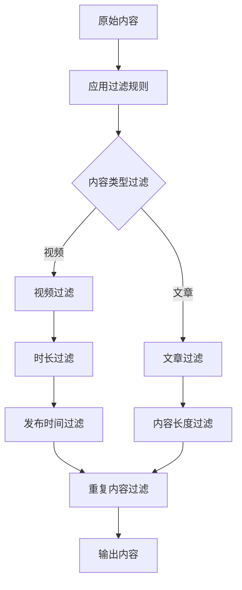

#### 过滤规则

| 过滤类型 | 规则 | 默认值 | 说明 |
|---------|------|--------|------|
| 内容类型 | video | 开启 | 仅抓取视频内容 |
| 发布时间 | 最近7天 | 开启 | 过滤过期内容 |
| 重复检测 | 基于native_id | 开启 | 防止重复内容 |
| 内容长度 | >60秒 | 开启 | 过滤过短内容 |

**章节来源**
- [PROJECT_CONTEXT.md:318-333](file://PROJECT_CONTEXT.md#L318-L333)

## 依赖关系分析

### 外部依赖

YouTube适配器依赖以下外部服务和库：

```mermaid
graph TB
subgraph "外部服务"
A[YouTube Data API v3]
B[GitHub Actions]
C[Supabase]
end
subgraph "内部组件"
D[YouTube适配器]
E[数据清洗模块]
F[UPSERT模块]
G[告警模块]
end
subgraph "工具库"
H[youtubei.js]
I[@supabase/supabase]
J[Node.js]
end
D --> A
D --> C
D --> H
E --> D
F --> C
G --> C
D --> I
D --> J
```

**图表来源**
- [PROJECT_CONTEXT.md:29-31](file://PROJECT_CONTEXT.md#L29-L31)
- [PROJECT_CONTEXT.md:195-200](file://PROJECT_CONTEXT.md#L195-L200)

### 内部依赖关系

YouTube适配器与其他系统组件的依赖关系：

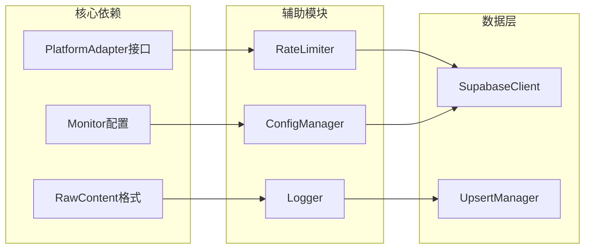

**图表来源**
- [PROJECT_CONTEXT.md:574-598](file://PROJECT_CONTEXT.md#L574-L598)

**章节来源**
- [PROJECT_CONTEXT.md:29-31](file://PROJECT_CONTEXT.md#L29-L31)
- [PROJECT_CONTEXT.md:574-598](file://PROJECT_CONTEXT.md#L574-L598)

## 性能考虑

### API配额管理

YouTube Data API v3具有严格的配额限制，YouTube适配器采用以下策略进行管理：

#### 配额监控

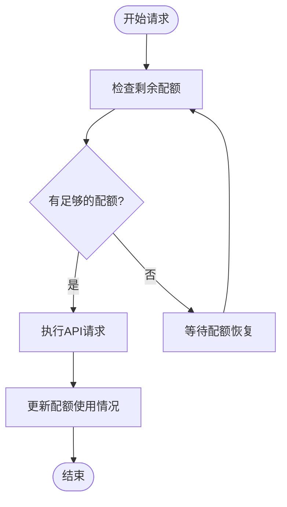

#### 性能优化策略

1. **批量请求优化**
   - 合并多个API调用
   - 使用批量查询减少请求次数

2. **缓存策略**
   - 缓存频道信息和播放列表
   - 避免重复查询相同数据

3. **异步处理**
   - 并行处理多个频道
   - 异步写入数据库

### 内存和CPU优化

YouTube适配器采用内存友好的设计：

- **流式处理**：逐个处理视频项目，避免大量内存占用
- **增量更新**：只处理新内容，避免全量扫描
- **资源清理**：及时释放API客户端和数据库连接

## 故障排除指南

### 常见问题及解决方案

#### API密钥相关问题

| 问题症状 | 可能原因 | 解决方案 |
|---------|---------|---------|
| HTTP 400错误 | API密钥无效 | 检查GitHub Secrets配置 |
| HTTP 403错误 | 配额耗尽 | 等待配额恢复或升级计划 |
| HTTP 401错误 | 认证失败 | 刷新API密钥并重新部署 |

#### 网络连接问题

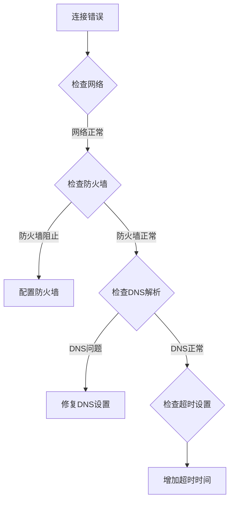

#### 数据处理问题

| 问题类型 | 症状 | 解决方法 |
|---------|------|---------|
| 数据缺失 | 某些字段为空 | 检查API响应格式变化 |
| 重复内容 | 多次出现相同内容 | 检查去重逻辑 |
| 时间戳错误 | 发布时间异常 | 验证ISO 8601格式 |

**章节来源**
- [PROJECT_CONTEXT.md:600-614](file://PROJECT_CONTEXT.md#L600-L614)

### 日志和监控

YouTube适配器实现了完整的日志记录和监控机制：

#### 日志级别

| 日志级别 | 用途 | 示例 |
|---------|------|------|
| DEBUG | 详细调试信息 | API请求详情、响应内容 |
| INFO | 正常操作记录 | 抓取进度、成功状态 |
| WARN | 警告信息 | 重试警告、配额接近 |
| ERROR | 错误信息 | API错误、系统异常 |

#### 监控指标

- **成功率**：API调用成功率统计
- **响应时间**：平均响应时间和95百分位
- **配额使用率**：当前配额使用情况
- **错误率**：各类错误的发生频率

## 结论

YouTube适配器作为多平台内容中枢的核心组件，实现了对YouTube Data API v3的高效集成。通过配置驱动的设计理念和严格的错误处理机制，该适配器能够稳定地从YouTube平台抓取内容数据，并将其标准化为统一格式供前端展示。

关键特性包括：
- **安全性**：通过GitHub Secrets管理和Supabase Vault加密存储敏感信息
- **可靠性**：实现完善的错误处理和重试机制
- **可扩展性**：遵循统一的适配器接口，便于添加新平台
- **性能优化**：采用配额管理和资源优化策略

未来可以考虑的改进方向：
- 增加更多内容过滤选项
- 实现更精细的配额监控
- 添加更多的错误恢复机制
- 优化大规模内容抓取的性能