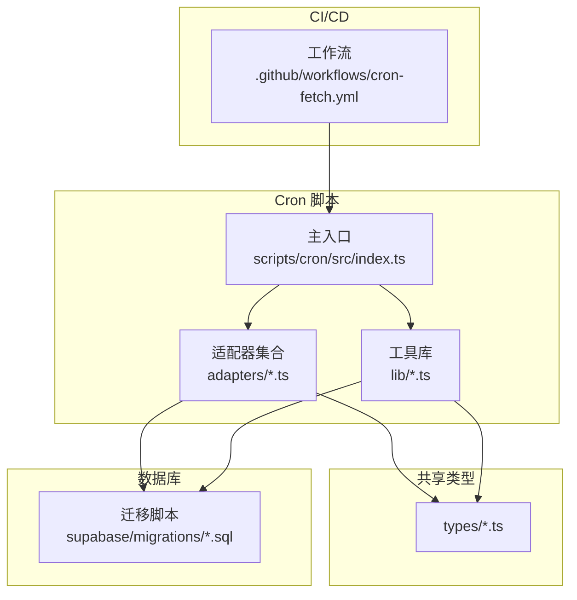
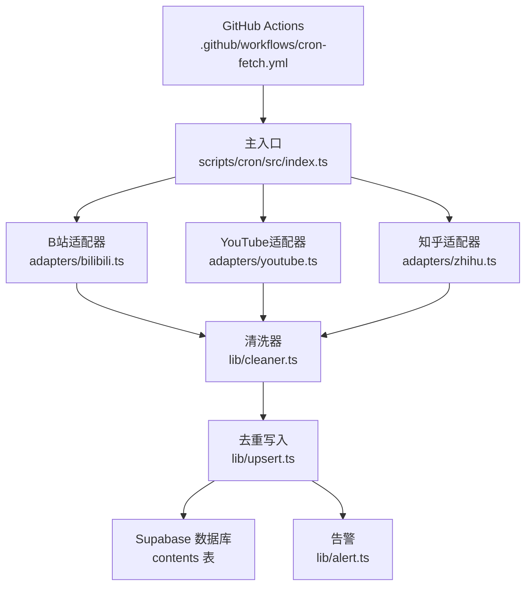
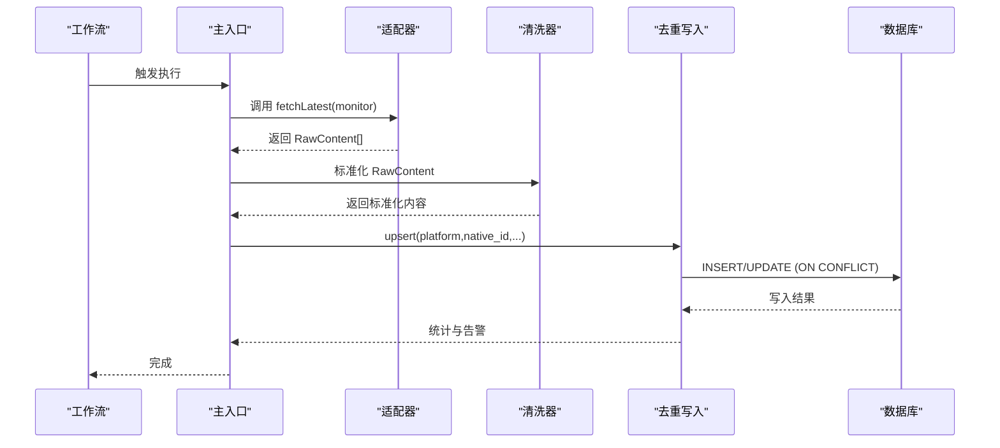
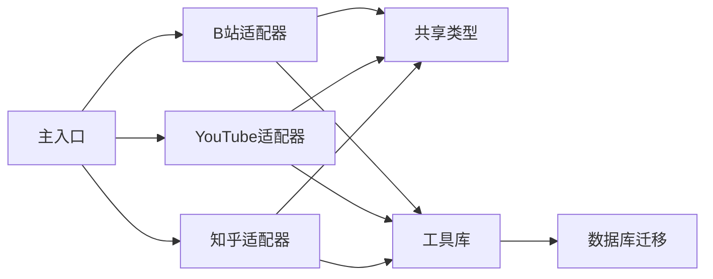

# 基础适配器

<cite>
**本文引用的文件**
- [PROJECT_CONTEXT.md](file://PROJECT_CONTEXT.md)
- [types.ts](file://scripts/cron/src/adapters/types.ts)
- [bilibili.ts](file://scripts/cron/src/adapters/bilibili.ts)
- [youtube.ts](file://scripts/cron/src/adapters/youtube.ts)
- [zhihu.ts](file://scripts/cron/src/adapters/zhihu.ts)
- [index.ts](file://scripts/cron/src/index.ts)
- [cleaner.ts](file://scripts/cron/src/lib/cleaner.ts)
- [upsert.ts](file://scripts/cron/src/lib/upsert.ts)
- [alert.ts](file://scripts/cron/src/lib/alert.ts)
- [monitor.ts](file://packages/shared/src/types/monitor.ts)
- [content.ts](file://packages/shared/src/types/content.ts)
- [platform.ts](file://packages/shared/src/types/platform.ts)
- [platforms.ts](file://packages/shared/src/constants/platforms.ts)
- [deep-link.ts](file://packages/shared/src/constants/deep-link.ts)
- [001_create_monitors.sql](file://supabase/migrations/001_create_monitors.sql)
- [002_create_contents.sql](file://supabase/migrations/002_create_contents.sql)
- [001_create_platform_configs.sql](file://supabase/migrations/001_create_platform_configs.sql)
- [cron-fetch.yml](file://.github/workflows/cron-fetch.yml)
</cite>

## 目录
1. [简介](#简介)
2. [项目结构](#项目结构)
3. [核心组件](#核心组件)
4. [架构总览](#架构总览)
5. [详细组件分析](#详细组件分析)
6. [依赖关系分析](#依赖关系分析)
7. [性能考量](#性能考量)
8. [故障排查指南](#故障排查指南)
9. [结论](#结论)
10. [附录](#附录)

## 简介
本文件面向“基础适配器”主题，系统性阐述适配器基类的设计理念、统一数据模型规范（Content 接口、Monitor 配置）、生命周期管理（初始化、执行、清理）、通用 HTTP 客户端封装与重试策略、超时控制，以及扩展新平台的接入规范、接口实现要求与测试验证方法。文档严格基于仓库现有文件进行分析与总结，确保可追溯与可落地。

## 项目结构
- 适配器层位于 Cron 脚本工程内，采用“平台适配器 + 共享类型 + 工具库”的分层组织：
  - 适配器：scripts/cron/src/adapters/*.ts
  - 共享类型：packages/shared/src/types/*.ts
  - 工具库：scripts/cron/src/lib/*.ts
  - 主入口：scripts/cron/src/index.ts
  - 数据库迁移：supabase/migrations/*.sql
  - 工作流：.github/workflows/cron-fetch.yml

图表来源
- [index.ts](file://scripts/cron/src/index.ts)
- [types.ts](file://scripts/cron/src/adapters/types.ts)
- [cleaner.ts](file://scripts/cron/src/lib/cleaner.ts)
- [upsert.ts](file://scripts/cron/src/lib/upsert.ts)
- [001_create_monitors.sql](file://supabase/migrations/001_create_monitors.sql)
- [002_create_contents.sql](file://supabase/migrations/002_create_contents.sql)
- [cron-fetch.yml](file://.github/workflows/cron-fetch.yml)

章节来源
- [PROJECT_CONTEXT.md:51-142](file://PROJECT_CONTEXT.md#L51-L142)

## 核心组件
- 适配器接口与数据模型
  - 适配器统一接口：PlatformAdapter，包含 platform 标识、fetchLatest、fetchDisplayName 方法。
  - 原始内容模型：RawContent，统一描述 native_id、content_type、title、cover_url、original_url、published_at。
- 共享类型
  - Monitor：监控目标实体，包含平台标识、native_id、显示名、状态等。
  - Content：内容实体，与 RawContent 对应，经清洗与去重后写入数据库。
  - 平台常量：平台枚举、配色、名称、Deep Link Schema 模板等。
- 工具库
  - cleaner：数据清洗与标准化。
  - upsert：基于 PostgreSQL ON CONFLICT 的 UPSERT 去重写入。
  - alert：告警通知（如企业微信 Webhook）。

章节来源
- [types.ts:574-598](file://scripts/cron/src/adapters/types.ts#L574-L598)
- [monitor.ts](file://packages/shared/src/types/monitor.ts)
- [content.ts](file://packages/shared/src/types/content.ts)
- [platform.ts](file://packages/shared/src/types/platform.ts)
- [platforms.ts](file://packages/shared/src/constants/platforms.ts)
- [deep-link.ts](file://packages/shared/src/constants/deep-link.ts)
- [cleaner.ts](file://scripts/cron/src/lib/cleaner.ts)
- [upsert.ts](file://scripts/cron/src/lib/upsert.ts)
- [alert.ts](file://scripts/cron/src/lib/alert.ts)

## 架构总览
- 适配器层负责从各平台拉取最新内容，统一转换为 RawContent，再交由清洗与去重工具写入数据库。
- Cron 工作流定时触发，主入口调度各适配器，最终通过 Supabase REST API 写入 contents 表。
- Edge Functions 与前端交互，但不直接调用第三方平台 API；认证与权限通过 Supabase RLS 与密钥策略保障。

图表来源
- [cron-fetch.yml](file://.github/workflows/cron-fetch.yml)
- [index.ts](file://scripts/cron/src/index.ts)
- [bilibili.ts](file://scripts/cron/src/adapters/bilibili.ts)
- [youtube.ts](file://scripts/cron/src/adapters/youtube.ts)
- [zhihu.ts](file://scripts/cron/src/adapters/zhihu.ts)
- [cleaner.ts](file://scripts/cron/src/lib/cleaner.ts)
- [upsert.ts](file://scripts/cron/src/lib/upsert.ts)
- [002_create_contents.sql](file://supabase/migrations/002_create_contents.sql)
- [alert.ts](file://scripts/cron/src/lib/alert.ts)

## 详细组件分析

### 适配器接口与基类设计
- 设计理念
  - 统一抽象：以 PlatformAdapter 抽象出“平台标识 + 拉取最新内容 + 同步昵称”的最小接口集，屏蔽平台差异。
  - 可扩展性：新增平台只需实现 PlatformAdapter，并在主入口注册。
  - 可观测性：通过 fetchDisplayName 在添加监控时同步获取显示名，提升用户体验。
- 接口定义
  - platform：只读平台标识，用于区分适配器与写入去重。
  - fetchLatest(monitor)：返回 RawContent 数组，按发布时间倒序。
  - fetchDisplayName(monitor)：返回平台显示名，失败时返回 null。
- 基类建议
  - 提供通用 HTTP 客户端封装、超时控制、重试策略、速率限制与日志埋点。
  - 提供统一错误分类与异常转换，便于上层统一处理。
  - 提供初始化与清理钩子，确保资源释放与幂等。

章节来源
- [types.ts:587-597](file://scripts/cron/src/adapters/types.ts#L587-L597)

### 统一数据模型规范
- RawContent（原始内容）
  - 字段：native_id、content_type、title、cover_url、original_url、published_at（ISO 8601 UTC）。
  - 语义：跨平台统一表达，便于清洗与去重。
- Monitor（监控目标）
  - 字段：platform、native_id、display_name、is_active、created_at、updated_at 等。
  - 作用：驱动适配器拉取，决定写入去重键。
- Content（数据库内容）
  - 字段：platform、native_id（唯一索引）、title、cover_url、original_url、published_at、is_display、created_at、updated_at。
  - 语义：最终展示内容，支持软删除与去重。

章节来源
- [types.ts:577-585](file://scripts/cron/src/adapters/types.ts#L577-L585)
- [monitor.ts](file://packages/shared/src/types/monitor.ts)
- [content.ts](file://packages/shared/src/types/content.ts)
- [001_create_monitors.sql](file://supabase/migrations/001_create_monitors.sql)
- [002_create_contents.sql](file://supabase/migrations/002_create_contents.sql)

### 生命周期管理
- 初始化
  - 读取环境变量（如 API Key、Service Role Key）。
  - 构建 HTTP 客户端（设置超时、重试、User-Agent）。
  - 准备数据库连接（通过 Supabase REST API）。
- 执行流程
  - 主入口按平台顺序或并发策略调度适配器。
  - 适配器 fetchLatest 返回 RawContent，交由 cleaner 标准化。
  - upsert 基于 (platform, native_id) 去重写入，避免旧数据复活。
- 清理机制
  - 适配器退出前释放连接与缓存。
  - 主入口汇总统计与告警，记录执行耗时与失败原因。

图表来源
- [cron-fetch.yml](file://.github/workflows/cron-fetch.yml)
- [index.ts](file://scripts/cron/src/index.ts)
- [types.ts](file://scripts/cron/src/adapters/types.ts)
- [cleaner.ts](file://scripts/cron/src/lib/cleaner.ts)
- [upsert.ts](file://scripts/cron/src/lib/upsert.ts)
- [002_create_contents.sql](file://supabase/migrations/002_create_contents.sql)

章节来源
- [index.ts](file://scripts/cron/src/index.ts)
- [cleaner.ts](file://scripts/cron/src/lib/cleaner.ts)
- [upsert.ts](file://scripts/cron/src/lib/upsert.ts)

### 通用 HTTP 客户端封装、重试策略与超时控制
- 封装要点
  - 超时：请求超时与整体作业超时（建议 10–30 秒），避免阻塞。
  - 重试：指数退避（如 1×、2×、4× 秒），上限 3–5 次；对 5xx、网络错误与 429 重试。
  - 速率限制：同平台至少 1.5 秒间隔；不同平台可并行。
  - User-Agent：自定义 UA，便于平台审计。
- 错误处理
  - 区分网络错误、平台错误、鉴权错误与业务错误，统一转换为适配器错误码。
  - 记录请求上下文（URL、参数、耗时、重试次数）以便排障。

章节来源
- [PROJECT_CONTEXT.md:219-221](file://PROJECT_CONTEXT.md#L219-L221)

### 适配器扩展指南
- 新平台接入规范
  - 实现 PlatformAdapter：platform、fetchLatest、fetchDisplayName。
  - 鉴权与限速：在适配器内实现 API Key/Cookie 管理与速率限制。
  - 数据标准化：返回 RawContent，交由 cleaner 统一处理。
- 接口实现要求
  - fetchLatest 必须返回按发布时间倒序的内容列表。
  - fetchDisplayName 失败返回 null，不抛异常。
- 测试验证方法
  - 单元测试：Mock HTTP，覆盖正常路径、鉴权失败、限流与超时。
  - 集成测试：使用真实环境变量（或模拟环境）跑一次完整流程，验证 upsert 去重与数据库写入。
  - 回归测试：在 cron 工作流中加入新平台任务，观察告警与日志。

章节来源
- [types.ts:587-597](file://scripts/cron/src/adapters/types.ts#L587-L597)
- [bilibili.ts](file://scripts/cron/src/adapters/bilibili.ts)
- [youtube.ts](file://scripts/cron/src/adapters/youtube.ts)
- [zhihu.ts](file://scripts/cron/src/adapters/zhihu.ts)

### 典型适配器实现要点（示意）
- B站适配器
  - 数据源：空间 API（需 Cookie）。
  - 限速：同平台 ≥1.5s。
  - 鉴权：从环境变量加载 Cookie，必要时通过 Edge Function 获取。
- YouTube 适配器
  - 数据源：Data API v3（Key 鉴权）。
  - 限速：无需额外限速。
- 知乎适配器
  - 数据源：RSSHub（API Key 鉴权）。
  - 限速：同平台 ≥1.5s。

章节来源
- [PROJECT_CONTEXT.md:301-317](file://PROJECT_CONTEXT.md#L301-L317)

## 依赖关系分析
- 组件耦合
  - 主入口依赖适配器集合；适配器依赖共享类型与工具库；工具库依赖数据库迁移定义。
- 外部依赖
  - 平台 API（B站、YouTube、RSSHub）与 Supabase REST API。
- 潜在风险
  - 平台 API 变更导致解析失败；数据库写入冲突；重试风暴与超时堆积。
- 优化建议
  - 引入平台级并发池与全局互斥锁（基于 advisory_lock）。
  - 增加重试抖动与熔断策略。

图表来源
- [index.ts](file://scripts/cron/src/index.ts)
- [bilibili.ts](file://scripts/cron/src/adapters/bilibili.ts)
- [youtube.ts](file://scripts/cron/src/adapters/youtube.ts)
- [zhihu.ts](file://scripts/cron/src/adapters/zhihu.ts)
- [types.ts](file://scripts/cron/src/adapters/types.ts)
- [001_create_monitors.sql](file://supabase/migrations/001_create_monitors.sql)
- [002_create_contents.sql](file://supabase/migrations/002_create_contents.sql)

章节来源
- [PROJECT_CONTEXT.md:169-240](file://PROJECT_CONTEXT.md#L169-L240)

## 性能考量
- 并发与限速
  - 同平台串行（≥1.5s），平台间并行，避免触发平台风控。
- I/O 优化
  - 批量写入（upsert）减少往返；合理设置超时与重试，避免雪崩。
- 缓存与去重
  - 利用 (platform, native_id) 唯一索引与 WHERE 防复活，降低重复写入成本。
- 监控与告警
  - 记录执行时间、失败率与重试次数，异常时及时告警。

章节来源
- [PROJECT_CONTEXT.md:219-221](file://PROJECT_CONTEXT.md#L219-L221)
- [upsert.ts](file://scripts/cron/src/lib/upsert.ts)

## 故障排查指南
- 常见问题
  - 适配器返回空列表：检查 URL 解析、鉴权与限速是否生效。
  - 写入失败：检查唯一索引冲突、RLS 策略与 Service Role Key 权限。
  - 超时/重试过多：调整超时与退避策略，确认网络与平台可用性。
- 排查步骤
  - 查看工作流日志与告警消息。
  - 在本地复现最小场景，逐步替换为真实环境变量。
  - 核对数据库 contents 表写入状态与 is_display 字段。
- 相关文件定位
  - 适配器错误码与响应格式：见项目上下文中的错误码规范。
  - 数据库迁移与 RLS 策略：参阅迁移脚本与策略定义。

章节来源
- [PROJECT_CONTEXT.md:600-614](file://PROJECT_CONTEXT.md#L600-L614)
- [002_create_contents.sql](file://supabase/migrations/002_create_contents.sql)

## 结论
基础适配器通过统一接口与数据模型，将多平台内容抓取抽象为一致的流水线：适配器 → 清洗 → 去重写入。结合严格的限速、重试与超时控制，以及完善的生命周期管理与告警机制，能够在保证稳定性的同时高效扩展新平台。建议在后续迭代中引入平台级并发池、熔断与更细粒度的日志埋点，持续提升可观测性与弹性。

## 附录
- 平台常量与 Deep Link Schema
  - 平台枚举、配色、名称与 Deep Link 模板集中管理，便于前端与适配器共享。
- 数据库表结构
  - monitors、contents、platform_configs 的字段与约束定义清晰，支撑监控、内容与配置管理。
- 工作流配置
  - GitHub Actions 每 30 分钟触发一次 Cron 抓取，支持手动触发与超时控制。

章节来源
- [platforms.ts](file://packages/shared/src/constants/platforms.ts)
- [deep-link.ts](file://packages/shared/src/constants/deep-link.ts)
- [001_create_monitors.sql](file://supabase/migrations/001_create_monitors.sql)
- [002_create_contents.sql](file://supabase/migrations/002_create_contents.sql)
- [001_create_platform_configs.sql](file://supabase/migrations/001_create_platform_configs.sql)
- [cron-fetch.yml](file://.github/workflows/cron-fetch.yml)