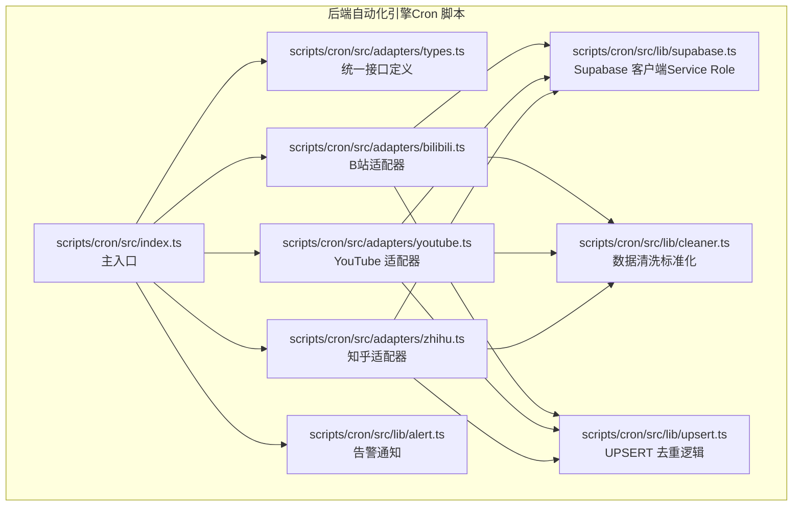
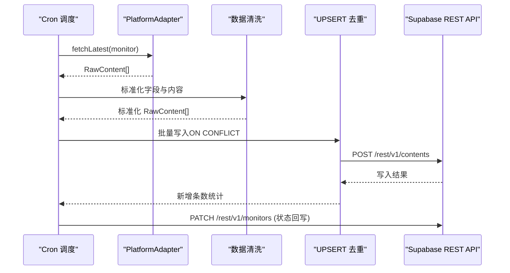
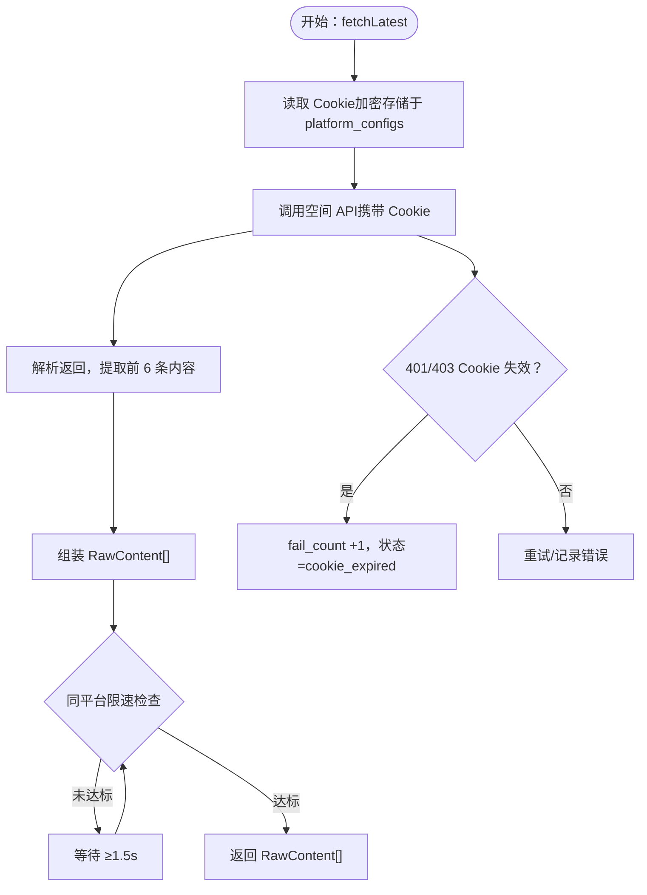
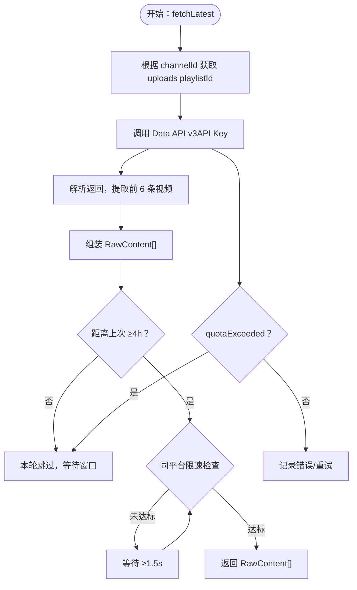
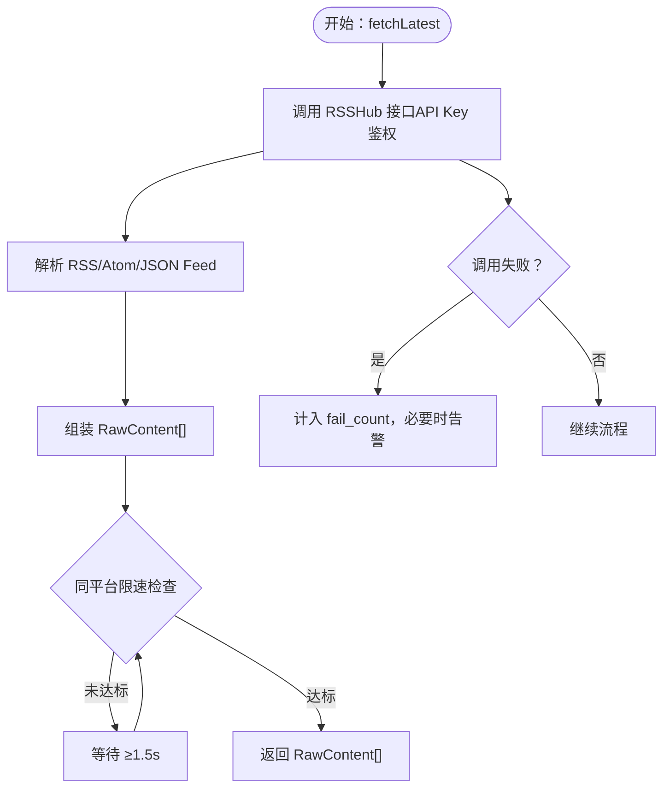
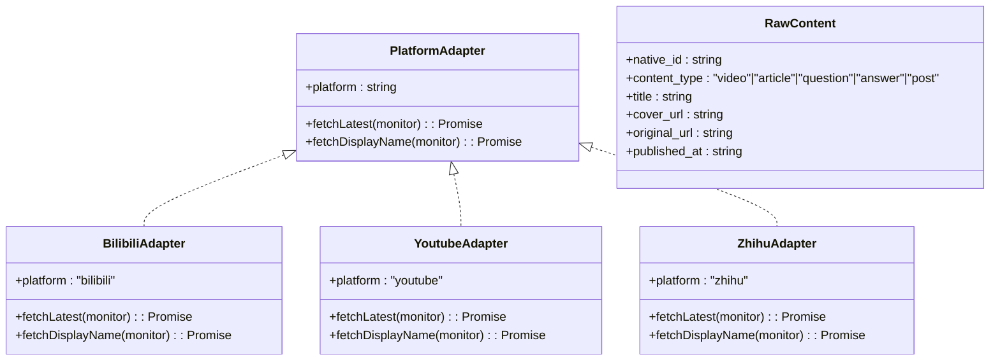
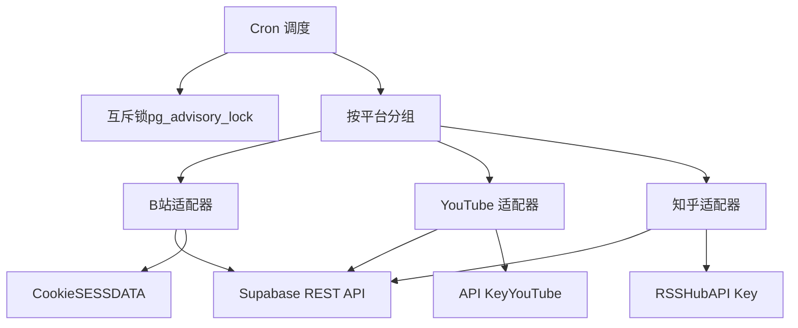

# 平台适配器层

<cite>
**本文引用的文件**
- [PROJECT_CONTEXT.md](file://PROJECT_CONTEXT.md)
- [多平台中枢_PRD.md](file://多平台中枢_PRD.md)
</cite>

## 目录
1. [简介](#简介)
2. [项目结构](#项目结构)
3. [核心组件](#核心组件)
4. [架构总览](#架构总览)
5. [详细组件分析](#详细组件分析)
6. [依赖分析](#依赖分析)
7. [性能考虑](#性能考虑)
8. [故障排查指南](#故障排查指南)
9. [结论](#结论)
10. [附录](#附录)

## 简介
本文件聚焦“平台适配器层”的技术文档，系统阐述适配器架构设计、统一接口规范与继承关系，深入解析三大平台适配器的认证机制与数据获取策略：B站（Cookie + 空间 API）、YouTube（Data API v3 + OAuth）、知乎（RSSHub 中转）。同时提供适配器扩展指南与新平台接入方法，帮助读者快速理解并高效扩展。

## 项目结构
适配器层位于后端自动化引擎（Cron 脚本）内部，采用“统一接口 + 多平台实现”的插件化设计。整体结构遵循 Monorepo 分层与命名规范，适配器模块位于脚本工程内，配合共享类型与工具库共同完成数据抓取、清洗与写回。

**图表来源**
- [PROJECT_CONTEXT.md: 115-131:115-131](file://PROJECT_CONTEXT.md#L115-L131)
- [PROJECT_CONTEXT.md: 569-598:569-598](file://PROJECT_CONTEXT.md#L569-L598)

**章节来源**
- [PROJECT_CONTEXT.md: 115-131:115-131](file://PROJECT_CONTEXT.md#L115-L131)
- [PROJECT_CONTEXT.md: 569-598:569-598](file://PROJECT_CONTEXT.md#L569-L598)

## 核心组件
- 统一接口规范
  - 平台适配器统一实现 PlatformAdapter 接口，包含 platform 标识、fetchLatest 与 fetchDisplayName 两个核心方法，保证不同平台的调用一致性。
  - RawContent 为适配器返回的原始内容结构，统一字段包括 native_id、content_type、title、cover_url、original_url、published_at。
- 平台差异
  - B站：空间 API + Cookie（SESSDATA），限速同平台 ≥1.5 秒。
  - YouTube：Data API v3 + API Key，按平台分组串行，YouTube 专属降频（≥4 小时）。
  - 知乎：RSSHub 中转 + API Key 鉴权，限速同平台 ≥1.5 秒。
- 数据流
  - 适配器返回 RawContent 数组，经清洗标准化后进行去重写回（UPSERT），并回写监控状态。

**章节来源**
- [PROJECT_CONTEXT.md: 570-598:570-598](file://PROJECT_CONTEXT.md#L570-L598)
- [PROJECT_CONTEXT.md: 301-317:301-317](file://PROJECT_CONTEXT.md#L301-L317)

## 架构总览
适配器层在 Cron 调度中被调用，按平台分组串行遍历监控目标，分别委派给对应适配器执行抓取。抓取完成后统一进入清洗与去重流程，并回写监控状态。

**图表来源**
- [PROJECT_CONTEXT.md: 569-598:569-598](file://PROJECT_CONTEXT.md#L569-L598)
- [PROJECT_CONTEXT.md: 318-334:318-334](file://PROJECT_CONTEXT.md#L318-L334)

**章节来源**
- [PROJECT_CONTEXT.md: 569-598:569-598](file://PROJECT_CONTEXT.md#L569-L598)
- [PROJECT_CONTEXT.md: 318-334:318-334](file://PROJECT_CONTEXT.md#L318-L334)

## 详细组件分析

### B站适配器（Cookie + 空间 API）
- 认证机制
  - 使用 B站 Cookie（SESSDATA）进行鉴权，Cookie 通过 Edge Function bilibili-auth 获取并加密存储于 platform_configs 表。
  - Cron 脚本读取 Cookie 并在请求头中携带，调用空间 API 获取博主最新内容。
- 空间 API 调用流程
  - 输入：monitor（包含 platform、native_id、display_name 等）。
  - 输出：RawContent[]（最多前 6 条，穿透置顶区域）。
  - 限速：同平台请求间隔 ≥1.5 秒，防止触发平台频率限制。
- 视频数据获取策略
  - 通过空间 API 返回的视频列表，提取 native_id、标题、封面、原文链接与发布时间，统一为 RawContent。
  - 若 Cookie 失效，状态流转为 cookie_expired，需重新扫码授权。
- 错误处理
  - 401/403：判定为 Cookie 失效，fail_count +1，状态变更为 cookie_expired。
  - 其他异常：计入 fail_count，必要时触发告警。

**图表来源**
- [PROJECT_CONTEXT.md: 292-300:292-300](file://PROJECT_CONTEXT.md#L292-L300)
- [PROJECT_CONTEXT.md: 301-317:301-317](file://PROJECT_CONTEXT.md#L301-L317)

**章节来源**
- [PROJECT_CONTEXT.md: 292-300:292-300](file://PROJECT_CONTEXT.md#L292-L300)
- [PROJECT_CONTEXT.md: 301-317:301-317](file://PROJECT_CONTEXT.md#L301-L317)

### YouTube 适配器（Data API v3 + OAuth）
- Data API v3 集成
  - 使用 API Key 进行鉴权，调用 playlists.items.list 获取上传播放列表（uploads playlist）中的视频条目。
  - 由于免费配额限制（约 10,000 units/天），对 YouTube 适配器实施专属降频策略：同一 monitor 距离上次抓取至少 4 小时。
- OAuth 认证
  - 采用 API Key（YOUTUBE_API_KEY）进行访问，无需用户授权流程。
- 内容检索逻辑
  - 输入：monitor（包含 platform、native_id、display_name）。
  - 输出：RawContent[]（最多前 6 条，穿透置顶区域）。
  - 限速：同平台请求间隔 ≥1.5 秒；且按 monitor 级别 ≥4 小时。
- 错误处理
  - quotaExceeded：本轮跳过，等待下次 4 小时窗口。
  - 其他异常：计入 fail_count，必要时触发告警。

**图表来源**
- [PROJECT_CONTEXT.md: 301-317:301-317](file://PROJECT_CONTEXT.md#L301-L317)
- [PROJECT_CONTEXT.md: 192-194:192-194](file://PROJECT_CONTEXT.md#L192-L194)

**章节来源**
- [PROJECT_CONTEXT.md: 301-317:301-317](file://PROJECT_CONTEXT.md#L301-L317)
- [PROJECT_CONTEXT.md: 192-194:192-194](file://PROJECT_CONTEXT.md#L192-L194)

### 知乎适配器（RSSHub 中转 + 内容解析）
- RSSHub 中转机制
  - 通过 RSSHub HTTP 接口获取博主主页/专栏的最新内容，RSSHub 通过 API Key 鉴权，需在公网部署并启用 ACCESS_CONTROL。
  - 知乎反爬严格，RSSHub 可作为替代路径，降低对知乎直连的依赖。
- 内容解析流程
  - 输入：monitor（包含 platform、native_id、display_name）。
  - 输出：RawContent[]（最多前 6 条，穿透置顶区域）。
  - 限速：同平台请求间隔 ≥1.5 秒。
- 错误处理
  - RSSHub 调用失败：计入 fail_count，必要时触发告警。
  - 若 RSSHub 不可用，可降级为其他策略（如暂停该平台抓取）。

**图表来源**
- [PROJECT_CONTEXT.md: 203-206:203-206](file://PROJECT_CONTEXT.md#L203-L206)
- [PROJECT_CONTEXT.md: 301-317:301-317](file://PROJECT_CONTEXT.md#L301-L317)

**章节来源**
- [PROJECT_CONTEXT.md: 203-206:203-206](file://PROJECT_CONTEXT.md#L203-L206)
- [PROJECT_CONTEXT.md: 301-317:301-317](file://PROJECT_CONTEXT.md#L301-L317)

### 统一接口与继承关系
- 接口定义
  - PlatformAdapter：包含 platform 标识、fetchLatest(monitor) 与 fetchDisplayName(monitor)。
  - RawContent：标准化内容模型，统一字段与类型。
- 继承与实现
  - 各平台适配器实现 PlatformAdapter 接口，分别封装平台特有认证与调用细节。
  - 通过统一接口，Cron 调度可按平台分组串行调度，实现一致的调用体验与错误处理。

**图表来源**
- [PROJECT_CONTEXT.md: 570-598:570-598](file://PROJECT_CONTEXT.md#L570-L598)

**章节来源**
- [PROJECT_CONTEXT.md: 570-598:570-598](file://PROJECT_CONTEXT.md#L570-L598)

## 依赖分析
- 组件耦合
  - 适配器与 Cron 主流程松耦合：通过统一接口解耦，便于新增平台。
  - 适配器与 Supabase：仅通过 REST API 写入数据，不直连数据库。
- 外部依赖
  - B站：Cookie（SESSDATA）+ 空间 API。
  - YouTube：Data API v3 + API Key。
  - 知乎：RSSHub + API Key。
- 互斥与限速
  - Cron 互斥锁：避免并发执行。
  - 同平台限速：≥1.5 秒，防止触发平台反爬。
  - YouTube 专属降频：≥4 小时，保护配额。

**图表来源**
- [PROJECT_CONTEXT.md: 216-222:216-222](file://PROJECT_CONTEXT.md#L216-L222)
- [PROJECT_CONTEXT.md: 301-317:301-317](file://PROJECT_CONTEXT.md#L301-L317)

**章节来源**
- [PROJECT_CONTEXT.md: 216-222:216-222](file://PROJECT_CONTEXT.md#L216-L222)
- [PROJECT_CONTEXT.md: 301-317:301-317](file://PROJECT_CONTEXT.md#L301-L317)

## 性能考虑
- 请求限速
  - 同平台请求间隔 ≥1.5 秒，降低被封禁风险。
  - YouTube 专属降频（≥4 小时），避免配额超限。
- 增量抓取
  - 每次仅抓取前 6 条，穿透置顶区域，减少历史翻阅与封禁概率。
- 去重与写回
  - 使用 ON CONFLICT DO UPDATE 实现 UPSERT，避免重复写入。
  - 防复活保护：软删除记录（is_display=false）不被重置，防止旧数据复活。
- 并发安全
  - Cron 互斥锁确保单实例运行，写回前再次校验 monitor 状态。

**章节来源**
- [PROJECT_CONTEXT.md: 194-198:194-198](file://PROJECT_CONTEXT.md#L194-L198)
- [PROJECT_CONTEXT.md: 318-334:318-334](file://PROJECT_CONTEXT.md#L318-L334)
- [PROJECT_CONTEXT.md: 202-206:202-206](file://PROJECT_CONTEXT.md#L202-L206)

## 故障排查指南
- 常见错误与定位
  - UNKNOWN_PLATFORM / INVALID_URL：URL 解析失败，检查 URL 格式与平台识别规则。
  - DUPLICATE_MONITOR：重复添加，检查 platform + native_id 唯一性。
  - BILIBILI_QRCODE_EXPIRED / BILIBILI_COOKIE_INVALID：B站 Cookie 失效，重新扫码授权。
  - YOUTUBE_API_ERROR：Data API 调用失败，检查 API Key 与配额。
  - RSSHUB_ERROR：RSSHub 接口调用失败，检查 RSSHub 配置与 API Key。
  - INTERNAL_ERROR：未预期错误，查看日志并核对环境变量。
- 状态流转与告警
  - normal → cookie_expired → rate_limited：连续失败触发告警，管理员修复后手动重置。
  - 告警静默期：同一博主 24 小时内不重复告警。

**章节来源**
- [PROJECT_CONTEXT.md: 600-614:600-614](file://PROJECT_CONTEXT.md#L600-L614)
- [PROJECT_CONTEXT.md: 721-786:721-786](file://PROJECT_CONTEXT.md#L721-L786)

## 结论
平台适配器层通过统一接口与插件化设计，实现了对多平台内容抓取的一致抽象。结合限速、互斥与去重策略，系统在保证稳定性的同时兼顾性能与可扩展性。B站、YouTube、知乎三大适配器分别采用 Cookie、API Key 与 RSSHub 中转机制，满足不同平台的鉴权与反爬挑战。未来接入新平台时，遵循统一接口与流程规范，可快速完成适配与上线。

## 附录

### 适配器扩展指南与新平台接入方法
- 设计原则
  - 遵循 PlatformAdapter 接口：实现 platform、fetchLatest、fetchDisplayName。
  - 统一返回 RawContent，确保字段与类型一致。
- 接入步骤
  - 新建适配器文件：scripts/cron/src/adapters/{new_platform}.ts。
  - 实现 fetchLatest：按平台 API 文档组织请求，返回 RawContent[]。
  - 实现 fetchDisplayName：可选，用于添加时同步获取昵称。
  - 注册适配器：在 Cron 主流程中按平台分组调度该适配器。
  - 配置限速与降频：同平台 ≥1.5 秒；如需专属降频（如 YouTube），在逻辑中体现。
  - 集成错误处理：映射平台错误码到统一错误体系，更新 monitor 状态与 fail_count。
  - 写回与去重：调用清洗与去重模块，使用 UPSERT 写回 Supabase。
- 安全与合规
  - 敏感信息（Cookie、API Key）通过环境变量或 Supabase Vault 管理。
  - RSSHub 必须启用 API Key 鉴权，避免公网裸奔。
  - 前端仅使用匿名密钥，服务端使用 Service Role Key。

**章节来源**
- [PROJECT_CONTEXT.md: 570-598:570-598](file://PROJECT_CONTEXT.md#L570-L598)
- [PROJECT_CONTEXT.md: 402-417:402-417](file://PROJECT_CONTEXT.md#L402-L417)
- [PROJECT_CONTEXT.md: 216-222:216-222](file://PROJECT_CONTEXT.md#L216-L222)