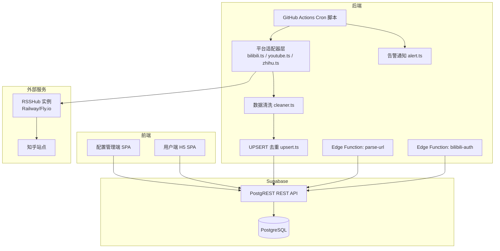
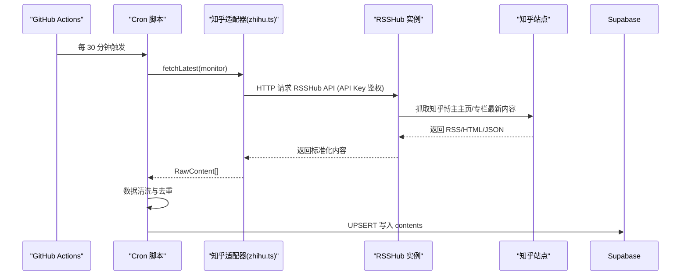
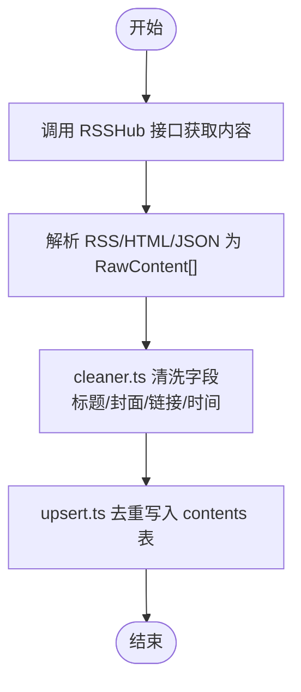
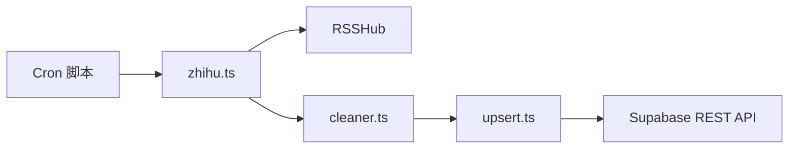

# 知乎适配器

<cite>
**本文引用的文件**
- [PROJECT_CONTEXT.md](file://PROJECT_CONTEXT.md)
- [多平台中枢_PRD.md](file://多平台中枢_PRD.md)
</cite>

## 目录
1. [简介](#简介)
2. [项目结构](#项目结构)
3. [核心组件](#核心组件)
4. [架构总览](#架构总览)
5. [组件详细分析](#组件详细分析)
6. [依赖关系分析](#依赖关系分析)
7. [性能考量](#性能考量)
8. [故障排查指南](#故障排查指南)
9. [结论](#结论)
10. [附录](#附录)

## 简介
本文件面向“知乎适配器”的技术文档，聚焦于 RSSHub 中转机制在本项目中的落地方式与集成实践。根据项目上下文与PRD，知乎内容通过 RSSHub 进行抓取与中转，Cron 脚本在 GitHub Actions 中调用 RSSHub 的 HTTP 接口，获取博主主页/专栏的最新内容，再进入统一的数据清洗与去重流程，最终写入 Supabase 数据库并在 H5 侧展示。

本文件不直接展示具体代码片段，而是基于仓库提供的上下文与规范，系统性地阐述：
- RSSHub API 调用、代理转发与响应处理
- 内容解析流程（RSS 源解析、HTML 内容提取、数据清洗）
- 知乎特有内容格式处理（图片资源转换、链接规范化、富文本渲染）
- 缓存策略、增量更新机制与错误恢复
- RSSHub 集成的最佳实践与性能优化建议

## 项目结构
围绕“知乎适配器”，本项目采用 Monorepo 结构，其中与 RSSHub 集成相关的关键位置如下：
- 脚本层（Cron 脚本）：位于 scripts/cron，负责定时抓取与平台适配器编排
- 平台适配器层：scripts/cron/src/adapters，包含 zhihu.ts（调用 RSSHub）、bilibili.ts、youtube.ts 等
- 工具库：scripts/cron/src/lib，包含 cleaner.ts（数据清洗）、upsert.ts（UPSERT 去重）、alert.ts（告警通知）
- Supabase 边缘函数：supabase/functions，包含 parse-url、bilibili-auth 等轻量逻辑
- 数据模型与迁移：supabase/migrations，定义 monitors、contents 等表结构
- GitHub Actions 工作流：.github/workflows/cron-fetch.yml，调度 Cron 脚本

图表来源
- [PROJECT_CONTEXT.md: 115-141:115-141](file://PROJECT_CONTEXT.md#L115-L141)
- [PROJECT_CONTEXT.md: 173-207:173-207](file://PROJECT_CONTEXT.md#L173-L207)
- [PROJECT_CONTEXT.md: 420-473:420-473](file://PROJECT_CONTEXT.md#L420-L473)
- [PROJECT_CONTEXT.md: 615-644:615-644](file://PROJECT_CONTEXT.md#L615-L644)

章节来源
- [PROJECT_CONTEXT.md: 115-141:115-141](file://PROJECT_CONTEXT.md#L115-L141)
- [PROJECT_CONTEXT.md: 173-207:173-207](file://PROJECT_CONTEXT.md#L173-L207)
- [PROJECT_CONTEXT.md: 420-473:420-473](file://PROJECT_CONTEXT.md#L420-L473)
- [PROJECT_CONTEXT.md: 615-644:615-644](file://PROJECT_CONTEXT.md#L615-L644)

## 核心组件
- RSSHub 中转服务：独立部署于 Railway/Fly.io，提供 RSSHub API Key 鉴权，抓取知乎博主主页/专栏最新内容
- Cron 脚本（GitHub Actions）：定时触发，按平台分组串行遍历监控目标，调用适配器层
- 平台适配器层（zhihu.ts）：封装 RSSHub API 调用，获取原始内容并返回统一模型
- 数据清洗（cleaner.ts）：统一标题、封面、链接、发布时间等字段，保证跨平台一致性
- UPSERT 去重（upsert.ts）：基于 (platform, native_id) 唯一索引进行插入/更新，防止旧数据复活
- 告警通知（alert.ts）：连续失败达到阈值触发通知，辅助运维恢复

章节来源
- [PROJECT_CONTEXT.md: 203-206:203-206](file://PROJECT_CONTEXT.md#L203-L206)
- [PROJECT_CONTEXT.md: 301-317:301-317](file://PROJECT_CONTEXT.md#L301-L317)
- [PROJECT_CONTEXT.md: 570-598:570-598](file://PROJECT_CONTEXT.md#L570-L598)
- [PROJECT_CONTEXT.md: 615-644:615-644](file://PROJECT_CONTEXT.md#L615-L644)

## 架构总览
RSSHub 在本项目中的定位是“反爬严格平台的中转层”。Cron 脚本通过 RSSHub 的 HTTP 接口获取内容，避免直接访问知乎带来的反爬与鉴权问题。RSSHub 作为独立服务，具备公网可访问能力与 API Key 鉴权，满足项目对安全与可用性的要求。

图表来源
- [PROJECT_CONTEXT.md: 198-200:198-200](file://PROJECT_CONTEXT.md#L198-L200)
- [PROJECT_CONTEXT.md: 301-317:301-317](file://PROJECT_CONTEXT.md#L301-L317)
- [PROJECT_CONTEXT.md: 615-644:615-644](file://PROJECT_CONTEXT.md#L615-L644)

## 组件详细分析

### RSSHub API 调用、代理转发与响应处理
- 调用方式：Cron 脚本在 GitHub Actions 中通过 HTTP 调用 RSSHub 接口，使用 RSSHub_URL 与 RSSHUB_API_KEY 作为鉴权参数
- 代理转发：RSSHub 作为独立容器服务，负责代理知乎站点的抓取请求，隐藏源站反爬策略
- 响应处理：RSSHub 返回的内容经适配器解析为 RawContent[]，随后进入清洗与去重流程

章节来源
- [PROJECT_CONTEXT.md: 32-32:32-32](file://PROJECT_CONTEXT.md#L32-L32)
- [PROJECT_CONTEXT.md: 43-44:43-44](file://PROJECT_CONTEXT.md#L43-L44)
- [PROJECT_CONTEXT.md: 198-200:198-200](file://PROJECT_CONTEXT.md#L198-L200)
- [PROJECT_CONTEXT.md: 301-317:301-317](file://PROJECT_CONTEXT.md#L301-L317)

### 内容解析流程
- RSS 源解析：RSSHub 返回 RSS/HTML/JSON，适配器根据平台特性解析为统一模型
- HTML 内容提取：从 HTML 中抽取标题、封面、原文链接、发布时间等字段
- 数据清洗：cleaner.ts 统一标题（去除多余空白/HTML 标签）、封面 URL（HTTPS 绝对路径）、发布时间（UTC）

图表来源
- [PROJECT_CONTEXT.md: 570-598:570-598](file://PROJECT_CONTEXT.md#L570-L598)
- [PROJECT_CONTEXT.md: 207-231:207-231](file://PROJECT_CONTEXT.md#L207-L231)

章节来源
- [PROJECT_CONTEXT.md: 570-598:570-598](file://PROJECT_CONTEXT.md#L570-L598)
- [PROJECT_CONTEXT.md: 207-231:207-231](file://PROJECT_CONTEXT.md#L207-L231)

### 知乎特有内容格式处理
- 图片资源转换：统一为 HTTPS 绝对路径，避免混合内容与加载失败
- 链接规范化：original_url 必须可直接访问，确保 H5 点击卡片可跳转
- 富文本渲染：标题经 HTML 标签清理后展示，避免跨平台富文本差异影响 UI

章节来源
- [PROJECT_CONTEXT.md: 207-231:207-231](file://PROJECT_CONTEXT.md#L207-L231)

### 缓存策略、增量更新与错误恢复
- 缓存策略：Cron 每 30 分钟执行一次，RSSHub 作为中间层承担缓存与反爬处理
- 增量更新：每次抓取取前 6 条，穿透置顶区域，降低被封禁风险
- 错误恢复：连续失败计数与状态机（normal/cookie_expired/rate_limited），达到阈值触发告警通知

章节来源
- [PROJECT_CONTEXT.md: 180-206:180-206](file://PROJECT_CONTEXT.md#L180-L206)
- [PROJECT_CONTEXT.md: 721-786:721-786](file://PROJECT_CONTEXT.md#L721-L786)

### RSSHub 集成最佳实践与性能优化
- 鉴权与安全：RSSHub 必须启用 API Key 鉴权，避免公网裸奔
- 请求限速：同平台请求间隔 ≥ 1.5 秒，避免触发反爬
- 并发与互斥：Cron 互斥锁确保单实例运行，避免重复抓取
- 去重与防复活：基于 (platform, native_id) 唯一索引的 UPSERT，软删除记录不被重置

章节来源
- [PROJECT_CONTEXT.md: 217-221:217-221](file://PROJECT_CONTEXT.md#L217-L221)
- [PROJECT_CONTEXT.md: 180-206:180-206](file://PROJECT_CONTEXT.md#L180-L206)
- [PROJECT_CONTEXT.md: 224-238:224-238](file://PROJECT_CONTEXT.md#L224-L238)

## 依赖关系分析
- 适配器依赖：zhihu.ts 依赖 RSSHub HTTP 接口与 cleaner.ts/upsert.ts
- Cron 调度：GitHub Actions 工作流定时触发，注入 RSSHub_URL 与 RSSHUB_API_KEY
- 数据依赖：Supabase REST API（Service Role Key）用于写入 contents 表

图表来源
- [PROJECT_CONTEXT.md: 118-122:118-122](file://PROJECT_CONTEXT.md#L118-L122)
- [PROJECT_CONTEXT.md: 615-644:615-644](file://PROJECT_CONTEXT.md#L615-L644)

章节来源
- [PROJECT_CONTEXT.md: 118-122:118-122](file://PROJECT_CONTEXT.md#L118-L122)
- [PROJECT_CONTEXT.md: 615-644:615-644](file://PROJECT_CONTEXT.md#L615-L644)

## 性能考量
- 抓取频率：每 30 分钟一次，平衡时效性与反爬压力
- 请求限速：同平台 ≥ 1.5 秒，避免触发平台频率限制
- 增量策略：每次取前 6 条，减少历史翻阅，降低被封风险
- 去重与写入：UPSERT 去重避免重复写入，软删除保留历史，前端仅查询 is_display=true

章节来源
- [PROJECT_CONTEXT.md: 180-206:180-206](file://PROJECT_CONTEXT.md#L180-L206)
- [PROJECT_CONTEXT.md: 224-238:224-238](file://PROJECT_CONTEXT.md#L224-L238)

## 故障排查指南
- RSSHub 调用失败：检查 RSSHUB_URL 与 RSSHUB_API_KEY 是否正确注入，确认 RSSHub 实例可达且已启用 API Key 鉴权
- 内容为空或异常：确认 RSSHub 返回内容结构，检查适配器解析逻辑与 cleaner.ts 字段提取
- 去重异常：核对 (platform, native_id) 唯一索引是否生效，检查 UPSERT 写入条件与 is_display 状态
- 告警触发：连续失败达到阈值会触发告警，检查 monitor.status 与 fail_count，必要时手动重置

章节来源
- [PROJECT_CONTEXT.md: 600-614:600-614](file://PROJECT_CONTEXT.md#L600-L614)
- [PROJECT_CONTEXT.md: 721-786:721-786](file://PROJECT_CONTEXT.md#L721-L786)

## 结论
知乎适配器通过 RSSHub 中转，有效规避了知乎站点的反爬与鉴权挑战，结合 Cron 的定时调度、数据清洗与去重策略，实现了稳定的内容聚合与展示。遵循项目中的鉴权、限速、互斥与去重规范，可确保系统在高并发与不稳定外部环境下保持可靠运行。

## 附录
- 环境变量清单：RSSHUB_URL、RSSHUB_API_KEY 等
- 错误码规范：RSSHUB_ERROR 等统一错误码
- GitHub Actions 工作流：cron-fetch.yml 定时触发 Cron 脚本

章节来源
- [PROJECT_CONTEXT.md: 34-45:34-45](file://PROJECT_CONTEXT.md#L34-L45)
- [PROJECT_CONTEXT.md: 600-614:600-614](file://PROJECT_CONTEXT.md#L600-L614)
- [PROJECT_CONTEXT.md: 615-644:615-644](file://PROJECT_CONTEXT.md#L615-L644)