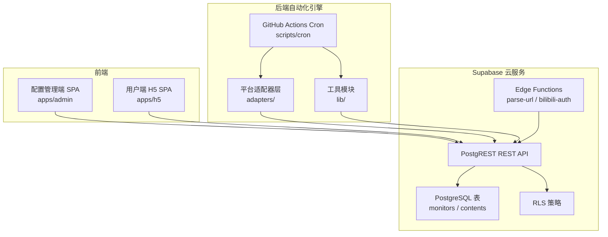
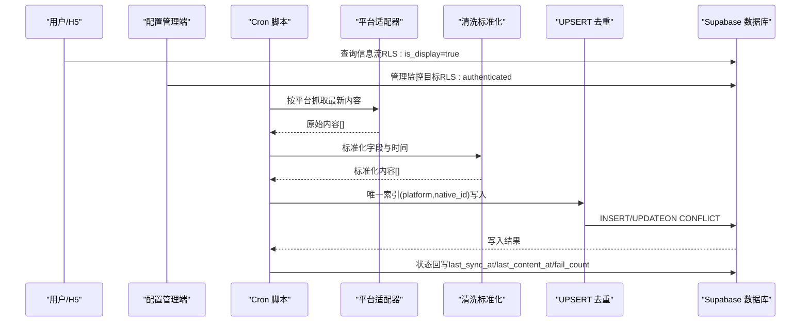
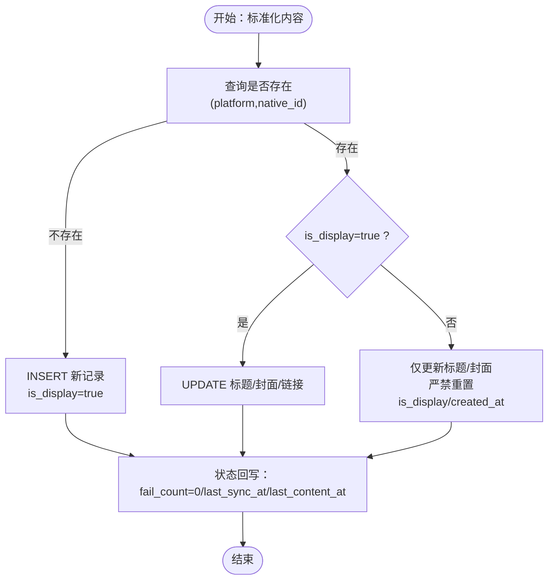
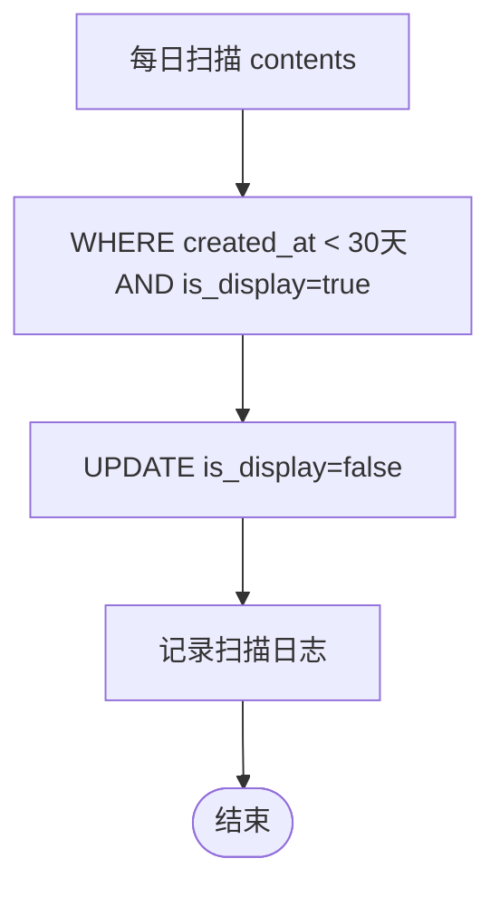
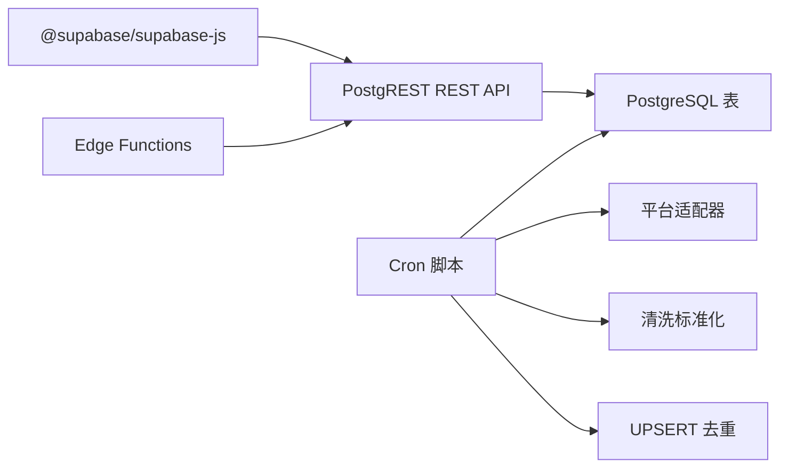

# 数据处理流水线

<cite>
**本文引用的文件**
- [PROJECT_CONTEXT.md](file://PROJECT_CONTEXT.md)
- [多平台中枢_PRD.md](file://多平台中枢_PRD.md)
</cite>

## 目录
1. [简介](#简介)
2. [项目结构](#项目结构)
3. [核心组件](#核心组件)
4. [架构总览](#架构总览)
5. [详细组件分析](#详细组件分析)
6. [依赖分析](#依赖分析)
7. [性能考虑](#性能考虑)
8. [故障排查指南](#故障排查指南)
9. [结论](#结论)
10. [附录](#附录)

## 简介
本技术文档围绕“数据处理流水线”展开，系统性阐述从第三方平台抓取到入库的完整流程，涵盖数据清洗标准化、内容去重（UPSERT）、软删除生命周期管理、数据版本控制与历史保留策略。同时，结合项目上下文与PRD，给出Supabase客户端使用方法、连接池与事务处理建议、唯一索引设计与冲突解决策略，以及在现有Monorepo与GitHub Actions调度下的工程落地方式。

## 项目结构
该项目采用Monorepo组织方式，前端（配置管理端与H5用户端）、后端自动化引擎（Cron脚本）、共享类型与Supabase配置分层清晰。数据处理流水线的关键实现集中在Cron脚本的适配器层与lib工具模块中，Supabase负责数据持久化与Row Level Security（RLS）保护。

图表来源
- [PROJECT_CONTEXT.md:97-141](file://PROJECT_CONTEXT.md#L97-L141)

章节来源
- [PROJECT_CONTEXT.md:51-141](file://PROJECT_CONTEXT.md#L51-L141)

## 核心组件
- 平台适配器层：封装B站、YouTube、知乎等平台的抓取逻辑，统一返回原始内容模型，便于后续清洗与去重。
- 数据清洗标准化：将不同平台的原始字段映射为统一信息卡片模型，保证字段一致性与可检索性。
- UPSERT去重：基于唯一索引（platform, native_id）进行插入或更新，防止重复与死链，同时保护软删除记录不被复活。
- 软删除生命周期：基于pg_cron每日扫描，将超期记录标记为不可见，保留历史以便审计与分析。
- Supabase客户端与RLS：前端使用匿名密钥（anon key）受RLS保护，服务端（Cron/Edge Functions）使用服务角色密钥（service_role）绕过RLS进行写入。

章节来源
- [PROJECT_CONTEXT.md:301-340](file://PROJECT_CONTEXT.md#L301-L340)
- [PROJECT_CONTEXT.md:318-334](file://PROJECT_CONTEXT.md#L318-L334)
- [PROJECT_CONTEXT.md:376-388](file://PROJECT_CONTEXT.md#L376-L388)
- [多平台中枢_PRD.md:178-241](file://多平台中枢_PRD.md#L178-L241)

## 架构总览
数据处理流水线自上而下分为三层：前端交互层、自动化引擎层、数据持久层。前端仅通过Supabase REST API与数据库交互；自动化引擎通过Cron脚本调用平台适配器抓取数据，经清洗与去重后写入数据库；数据库层面通过RLS与唯一索引保障安全与一致性。

图表来源
- [PROJECT_CONTEXT.md:224-239](file://PROJECT_CONTEXT.md#L224-L239)
- [多平台中枢_PRD.md:180-241](file://多平台中枢_PRD.md#L180-L241)

## 详细组件分析

### 数据抓取与适配器
- 统一接口：适配器需实现统一接口，返回标准化的原始内容数组，便于后续清洗与去重。
- 平台差异：B站（Cookie鉴权）、YouTube（API Key）、知乎（RSSHub中转），并设置同平台请求间隔以规避反爬。
- 增量抓取：每次仅抓取最新若干条，穿透置顶区域，降低封禁风险。

章节来源
- [PROJECT_CONTEXT.md:301-317](file://PROJECT_CONTEXT.md#L301-L317)
- [多平台中枢_PRD.md:180-206](file://多平台中枢_PRD.md#L180-L206)

### 数据清洗标准化
- 字段映射：将各平台的标题、封面、原文链接、发布时间等映射为统一模型。
- 时间标准化：统一为UTC时间，便于排序与比较。
- URL规范化：统一HTTPS绝对路径，减少死链与跨协议问题。

章节来源
- [多平台中枢_PRD.md:207-222](file://多平台中枢_PRD.md#L207-L222)

### UPSERT去重与冲突解决
- 唯一索引：(platform, native_id)确保全局唯一性。
- 插入策略：新内容INSERT，is_display=true。
- 更新策略：命中冲突时仅更新标题、封面与原文链接，防止死链与破损图片；若记录is_display=false（软删除），严禁重置is_display与created_at，防止旧数据复活。
- 状态回写：请求成功即重置fail_count并更新last_sync_at；若有新增内容，额外更新last_content_at。

图表来源
- [PROJECT_CONTEXT.md:318-334](file://PROJECT_CONTEXT.md#L318-L334)
- [多平台中枢_PRD.md:224-232](file://多平台中枢_PRD.md#L224-L232)

章节来源
- [PROJECT_CONTEXT.md:318-334](file://PROJECT_CONTEXT.md#L318-L334)
- [多平台中枢_PRD.md:224-232](file://多平台中枢_PRD.md#L224-L232)

### 软删除生命周期与历史保留
- 保留策略：H5信息流仅展示最近30天内is_display=true的记录。
- 软删除：每日扫描将超过30天且is_display=true的记录标记为is_display=false，保留历史。
- 前端过滤：查询强制添加is_display=true条件，确保不可见。
- 执行记录：扫描后记录日志（标记条数、耗时）。

图表来源
- [多平台中枢_PRD.md:233-241](file://多平台中枢_PRD.md#L233-L241)

章节来源
- [多平台中枢_PRD.md:233-241](file://多平台中枢_PRD.md#L233-L241)

### Supabase客户端使用与RLS
- 前端使用匿名密钥（anon key）受RLS保护，仅能读取is_display=true的记录。
- 服务端（Cron/Edge Functions）使用服务角色密钥（service_role）绕过RLS进行写入。
- PostgREST自动生成REST API，遵循统一的请求头与偏好设置（Prefer: resolution=merge-duplicates用于UPSERT）。

章节来源
- [PROJECT_CONTEXT.md:420-473](file://PROJECT_CONTEXT.md#L420-L473)
- [PROJECT_CONTEXT.md:350-409](file://PROJECT_CONTEXT.md#L350-L409)

### 连接池与事务处理建议
- 连接池：Cron脚本通过Supabase REST API写入，不直连PostgreSQL，避免连接池管理复杂度。
- 事务：PostgreSQL UPSERT（ON CONFLICT）天然具备原子性；若需跨表写入（如状态回写），可在服务端逻辑中合并为单次请求或使用数据库函数封装。
- 并发安全：使用pg_advisory_lock实现Cron互斥，确保同一时刻仅有一个实例运行。

章节来源
- [PROJECT_CONTEXT.md:216-222](file://PROJECT_CONTEXT.md#L216-L222)

### 数据版本控制与历史记录
- 历史保留：软删除记录保留历史，便于审计与回溯。
- 版本字段：统一created_at作为入库时间戳，published_at为原始发布时间，用于排序与筛选。
- 去重策略：基于唯一索引避免重复写入，减少冗余历史。

章节来源
- [多平台中枢_PRD.md:233-241](file://多平台中枢_PRD.md#L233-L241)
- [PROJECT_CONTEXT.md:345-361](file://PROJECT_CONTEXT.md#L345-L361)

## 依赖分析
- 前端依赖：@supabase/supabase-js用于前端与Supabase交互。
- Cron脚本依赖：平台适配器（B站、YouTube、知乎）、清洗标准化、UPSERT工具、告警通知。
- Supabase依赖：PostgREST、Edge Functions、pg_cron、pg_advisory_lock、RLS策略。

图表来源
- [PROJECT_CONTEXT.md:25-33](file://PROJECT_CONTEXT.md#L25-L33)
- [PROJECT_CONTEXT.md:97-141](file://PROJECT_CONTEXT.md#L97-L141)

章节来源
- [PROJECT_CONTEXT.md:25-33](file://PROJECT_CONTEXT.md#L25-L33)
- [PROJECT_CONTEXT.md:97-141](file://PROJECT_CONTEXT.md#L97-L141)

## 性能考虑
- 抓取频率：每30分钟一次，避免频繁请求引发平台反爬。
- 同平台限速：同一平台请求间隔≥1.5秒，降低触发频率限制风险。
- 增量抓取：每次仅抓取最新若干条，减少数据量与网络开销。
- 前端分页：H5信息流按时间倒序分页加载，提升用户体验与性能。
- 软删除：仅标记不可见，不物理删除，减少写放大与维护成本。

章节来源
- [多平台中枢_PRD.md:180-206](file://多平台中枢_PRD.md#L180-L206)
- [多平台中枢_PRD.md:244-257](file://多平台中枢_PRD.md#L244-L257)

## 故障排查指南
- Cookie失效：B站适配器返回401/403，fail_count+1，状态流转为cookie_expired；修复后恢复正常。
- API配额用尽：YouTube适配器返回quotaExceeded，本轮跳过，等待4小时后重试。
- RSSHub异常：知乎适配器调用失败，降级尝试RSSHub，仍失败则fail_count+1。
- 数据库连接失败：Cron记录错误日志，跳过本轮，等待下次周期重试。
- 互斥锁冲突：上一轮未完成则跳过本轮，等待下一周期。
- 软删除误判：确认is_display=false的记录是否为超期软删除，必要时调整保留策略。

章节来源
- [多平台中枢_PRD.md:928-951](file://多平台中枢_PRD.md#L928-L951)

## 结论
本数据处理流水线以Supabase为核心，结合Monorepo与GitHub Actions，实现了从抓取、清洗、去重到入库与生命周期管理的完整闭环。通过唯一索引与UPSERT策略、软删除与历史保留、RLS与服务角色密钥的安全隔离，系统在保证数据一致性与可追溯性的同时，兼顾了性能与可维护性。建议在实际落地中持续优化平台适配器与限速策略，完善告警与可观测性，确保长期稳定运行。

## 附录
- 环境变量清单：SUPABASE_URL、SUPABASE_ANON_KEY、SUPABASE_SERVICE_ROLE_KEY、YOUTUBE_API_KEY、BILIBILI_COOKIE_*、RSSHUB_URL、RSSHUB_API_KEY、WECOM_WEBHOOK_URL。
- GitHub Actions工作流：每30分钟触发一次，使用pnpm workspace与tsx运行Cron脚本。

章节来源
- [PROJECT_CONTEXT.md:34-46](file://PROJECT_CONTEXT.md#L34-L46)
- [PROJECT_CONTEXT.md:615-644](file://PROJECT_CONTEXT.md#L615-L644)