# 监控与告警系统

<cite>
**本文档引用的文件**
- [PROJECT_CONTEXT.md](file://PROJECT_CONTEXT.md)
- [cron-fetch.yml](file://.github/workflows/cron-fetch.yml)
- [types.ts](file://scripts/cron/src/adapters/types.ts)
- [upsert.ts](file://scripts/cron/src/lib/upsert.ts)
- [cleaner.ts](file://scripts/cron/src/lib/cleaner.ts)
- [supabase.ts](file://scripts/cron/src/lib/supabase.ts)
- [bilibili.ts](file://scripts/cron/src/adapters/bilibili.ts)
- [youtube.ts](file://scripts/cron/src/adapters/youtube.ts)
- [zhihu.ts](file://scripts/cron/src/adapters/zhihu.ts)
- [index.ts](file://scripts/cron/src/index.ts)
</cite>

## 目录
1. [简介](#简介)
2. [项目结构](#项目结构)
3. [核心组件](#核心组件)
4. [架构概览](#架构概览)
5. [详细组件分析](#详细组件分析)
6. [依赖关系分析](#依赖关系分析)
7. [性能考虑](#性能考虑)
8. [故障排除指南](#故障排除指南)
9. [结论](#结论)

## 简介

监控与告警系统是多平台内容中枢项目的重要组成部分，负责监控内容抓取工作流的执行状态、收集性能指标并进行异常检测。该系统基于Supabase云平台构建，采用GitHub Actions进行定时调度，通过企业微信Webhook实现告警通知。

系统的核心功能包括：
- 监控目标管理（CRUD操作）
- 工作流执行状态监控
- 性能指标收集与分析
- 异常检测与告警机制
- 多渠道通知（企业微信）
- 日志记录与错误追踪

## 项目结构

项目采用Monorepo架构，主要分为以下几个核心部分：

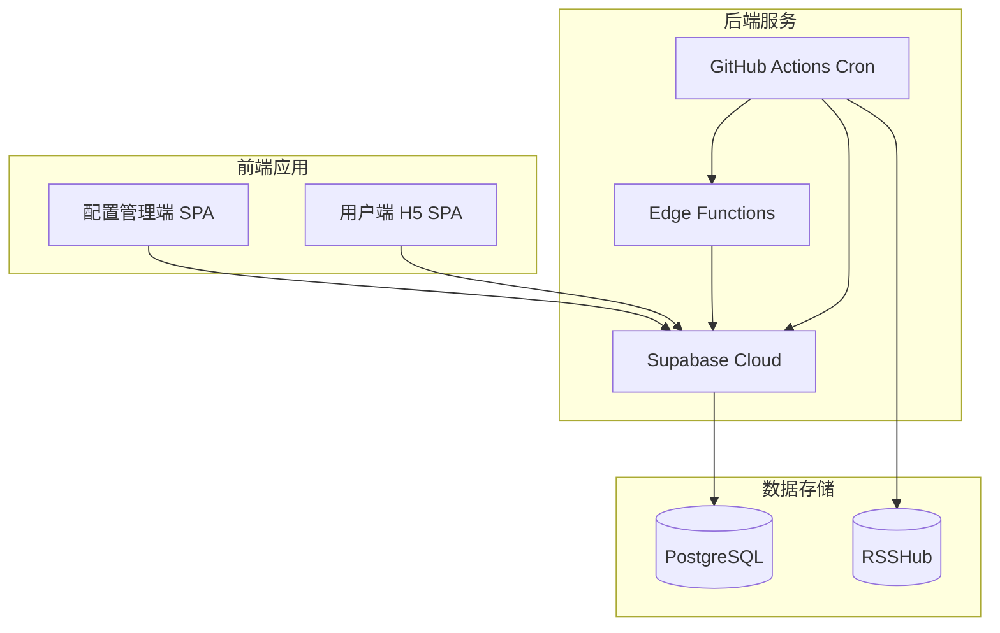

**图表来源**
- [PROJECT_CONTEXT.md:55-141](file://PROJECT_CONTEXT.md#L55-L141)

**章节来源**
- [PROJECT_CONTEXT.md:51-141](file://PROJECT_CONTEXT.md#L51-L141)

## 核心组件

### 监控目标管理模块

监控目标管理模块负责管理需要监控的内容源，包括添加、删除、更新监控目标以及查看监控状态。

**关键特性：**
- 基于Supabase REST API的CRUD操作
- URL解析与平台识别集成
- 实时状态展示面板

**章节来源**
- [PROJECT_CONTEXT.md:275-280](file://PROJECT_CONTEXT.md#L275-L280)

### 平台适配器层

平台适配器层提供了统一的接口来处理不同平台的内容抓取，目前支持B站、YouTube和知乎三个平台。

**适配器接口定义：**
```typescript
interface PlatformAdapter {
  readonly platform: 'bilibili' | 'youtube' | 'zhihu';
  fetchLatest(monitor: Monitor): Promise<RawContent[]>;
  fetchDisplayName(monitor: Monitor): Promise<string | null>;
}
```

**章节来源**
- [PROJECT_CONTEXT.md:574-598](file://PROJECT_CONTEXT.md#L574-L598)

### 告警通知系统

告警通知系统通过企业微信Webhook实现告警消息的实时推送，支持多种告警级别的通知。

**章节来源**
- [PROJECT_CONTEXT.md:265](file://PROJECT_CONTEXT.md#L265)

## 架构概览

系统采用分层架构设计，确保了良好的可维护性和扩展性：

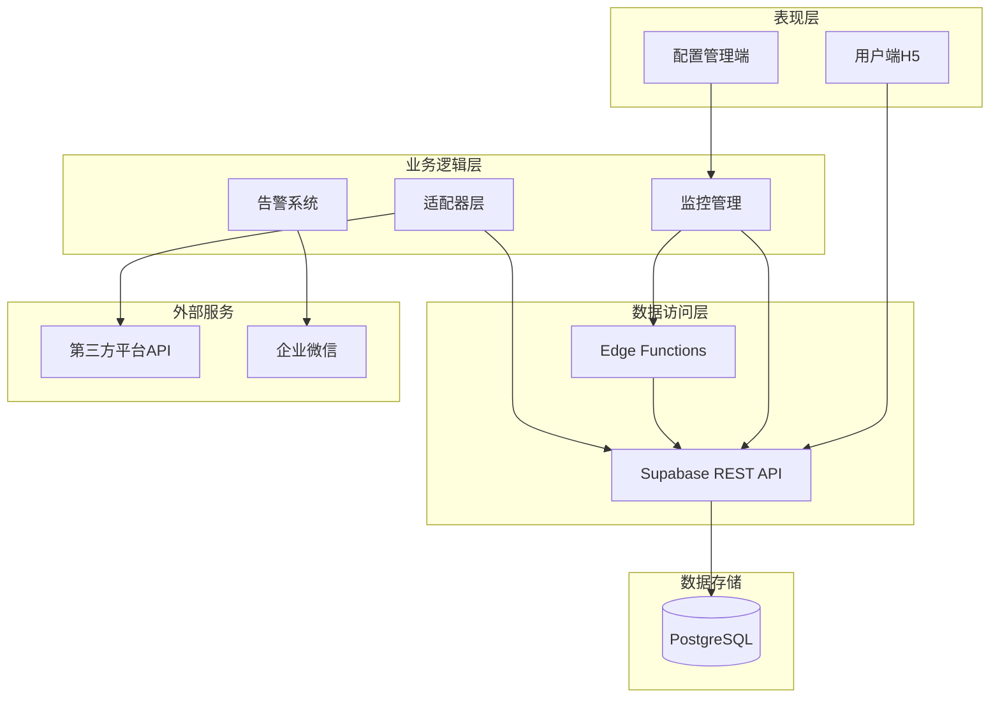

**图表来源**
- [PROJECT_CONTEXT.md:169-207](file://PROJECT_CONTEXT.md#L169-L207)

## 详细组件分析

### 监控工作流执行状态监控

监控工作流执行状态监控是系统的核心功能之一，负责跟踪内容抓取任务的执行情况。

#### 工作流执行监控流程

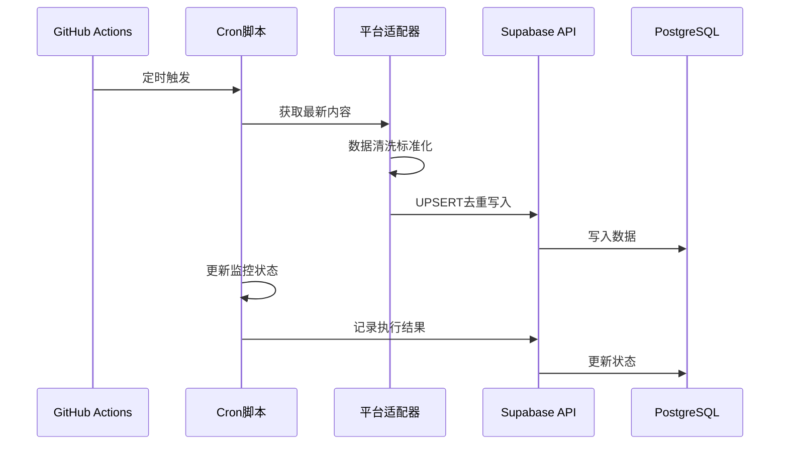

**图表来源**
- [PROJECT_CONTEXT.md:226-239](file://PROJECT_CONTEXT.md#L226-L239)

#### 监控状态字段定义

系统使用以下关键字段来跟踪监控状态：

| 字段名 | 类型 | 描述 | 默认值 |
|--------|------|------|--------|
| `is_active` | boolean | 监控是否激活 | true |
| `last_sync_at` | timestamp | 最后一次同步时间 | null |
| `sync_status` | enum | 同步状态 | 'pending' |
| `error_count` | integer | 错误计数 | 0 |
| `last_error` | text | 最后一次错误信息 | null |

**章节来源**
- [PROJECT_CONTEXT.md:437-445](file://PROJECT_CONTEXT.md#L437-L445)

### 性能指标收集

系统通过多种方式收集性能指标，用于监控和优化工作流性能。

#### 性能指标定义

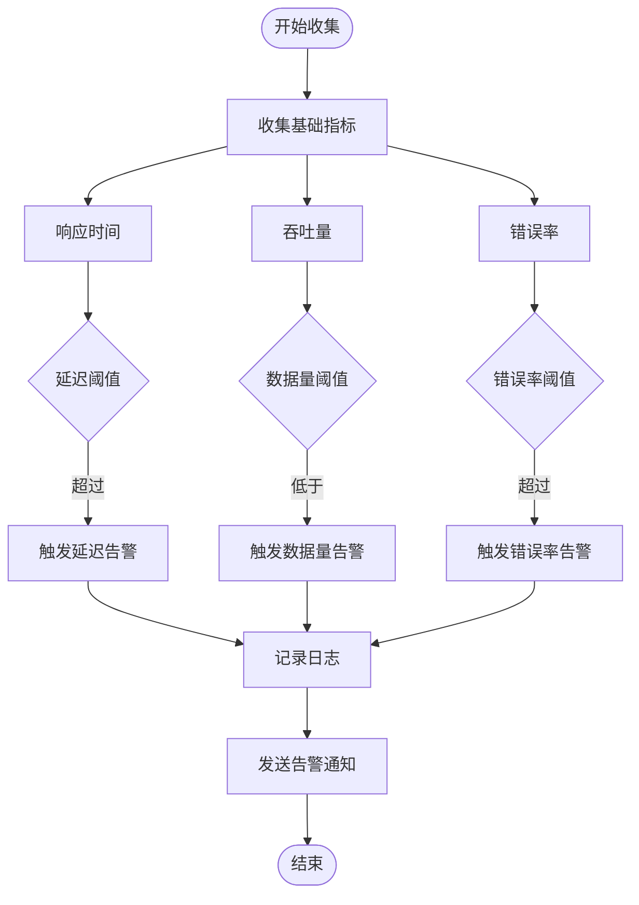

**图表来源**
- [PROJECT_CONTEXT.md:213-222](file://PROJECT_CONTEXT.md#L213-L222)

#### 指标收集策略

1. **响应时间监控**：跟踪API调用的响应时间
2. **吞吐量统计**：统计每批次处理的数据量
3. **错误率计算**：监控工作流的失败率
4. **资源使用监控**：跟踪内存和CPU使用情况

**章节来源**
- [PROJECT_CONTEXT.md:213-222](file://PROJECT_CONTEXT.md#L213-L222)

### 异常检测机制

系统实现了多层次的异常检测机制，确保能够及时发现和处理各种异常情况。

#### 异常检测流程

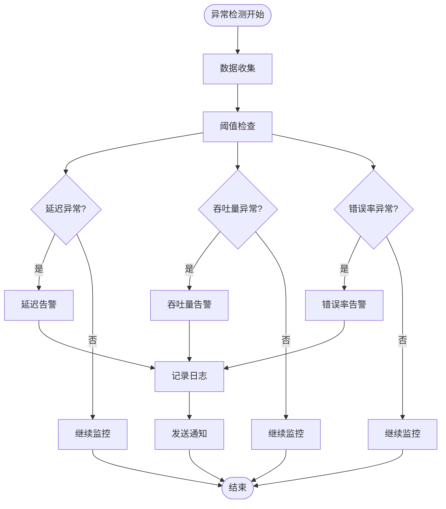

**图表来源**
- [PROJECT_CONTEXT.md:600-614](file://PROJECT_CONTEXT.md#L600-L614)

#### 异常类型分类

| 异常类型 | 触发条件 | 告警级别 | 处理策略 |
|----------|----------|----------|----------|
| API调用失败 | 超过3次连续失败 | 高 | 自动重试，发送告警 |
| 响应时间过长 | 平均响应时间 > 5秒 | 中 | 降级处理，发送警告 |
| 数据量异常 | 连续3次数据量为0 | 中 | 检查上游API状态 |
| 认证失败 | B站Cookie失效 | 高 | 发送人工干预告警 |
| 平台限制 | 达到API配额限制 | 低 | 等待配额恢复 |

**章节来源**
- [PROJECT_CONTEXT.md:600-614](file://PROJECT_CONTEXT.md#L600-L614)

### 告警规则配置

告警规则配置是系统的重要功能，允许用户自定义告警条件和通知策略。

#### 告警规则配置

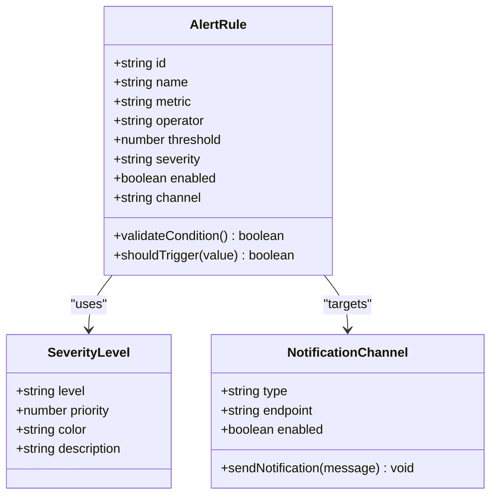

**图表来源**
- [PROJECT_CONTEXT.md:45-46](file://PROJECT_CONTEXT.md#L45-L46)

#### 告警级别分类

系统支持三种告警级别：

1. **高优先级（红色）**
   - 系统性故障
   - 数据库连接失败
   - 关键API不可用
   
2. **中优先级（黄色）**
   - 性能下降
   - 响应时间过长
   - 数据量异常
   
3. **低优先级（绿色）**
   - 预警信息
   - 配额即将耗尽
   - 非关键性异常

**章节来源**
- [PROJECT_CONTEXT.md:45-46](file://PROJECT_CONTEXT.md#L45-L46)

### 通知渠道设置

系统支持多种通知渠道，目前主要使用企业微信Webhook进行告警通知。

#### 通知渠道配置

| 通知渠道 | 配置参数 | 使用场景 | 配置示例 |
|----------|----------|----------|----------|
| 企业微信Webhook | `WECOM_WEBHOOK_URL` | 系统告警通知 | `https://qyapi.weixin.qq.com/cgi-bin/webhook/send?key=xxx` |
| 邮件通知 | `EMAIL_HOST` | 重要告警确认 | SMTP配置 |
| Slack通知 | `SLACK_WEBHOOK_URL` | 开发团队通知 | Webhook URL |

**章节来源**
- [PROJECT_CONTEXT.md:45](file://PROJECT_CONTEXT.md#L45)

### 日志记录策略

系统实现了完整的日志记录策略，确保所有关键操作都有详细的日志记录。

#### 日志记录层次

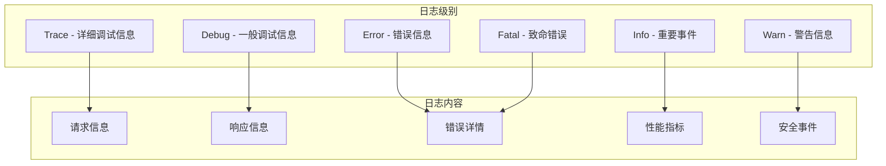

**图表来源**
- [PROJECT_CONTEXT.md:213-222](file://PROJECT_CONTEXT.md#L213-L222)

#### 日志字段规范

| 字段名 | 类型 | 描述 | 示例 |
|--------|------|------|------|
| `timestamp` | datetime | 日志时间戳 | `2026-06-21T10:30:00Z` |
| `level` | enum | 日志级别 | `info` |
| `component` | string | 组件名称 | `cron-fetch` |
| `operation` | string | 操作类型 | `fetch_latest` |
| `duration_ms` | integer | 执行耗时（毫秒） | `1500` |
| `status` | string | 操作状态 | `success` |
| `error_code` | string | 错误代码 | `YOUTUBE_API_ERROR` |
| `metadata` | json | 元数据信息 | `{}` |

**章节来源**
- [PROJECT_CONTEXT.md:213-222](file://PROJECT_CONTEXT.md#L213-L222)

### 错误追踪方法

系统实现了完善的错误追踪机制，包括错误分类、堆栈追踪和错误报告。

#### 错误追踪流程

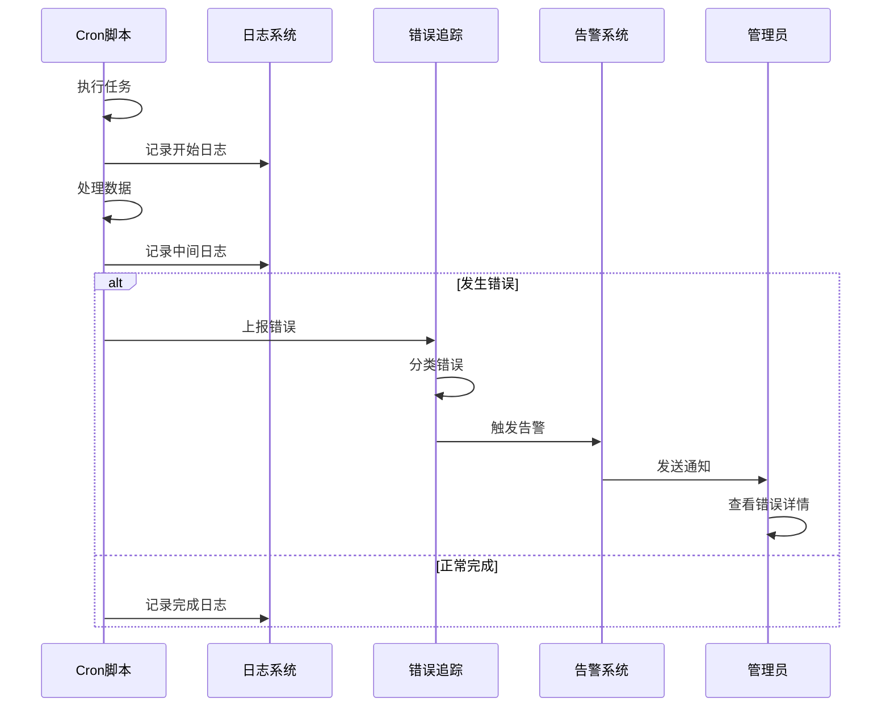

**图表来源**
- [PROJECT_CONTEXT.md:600-614](file://PROJECT_CONTEXT.md#L600-L614)

#### 错误分类体系

| 错误类别 | 错误码 | 描述 | 处理建议 |
|----------|--------|------|----------|
| 平台错误 | `YOUTUBE_API_ERROR` | YouTube API调用失败 | 检查API密钥，等待重试 |
| 平台错误 | `RSSHUB_ERROR` | RSSHub接口调用失败 | 检查RSSHub服务状态 |
| 平台错误 | `BILIBILI_COOKIE_INVALID` | B站Cookie失效 | 重新扫码授权 |
| 网络错误 | `NETWORK_TIMEOUT` | 网络请求超时 | 检查网络连接，增加重试 |
| 配置错误 | `INVALID_CONFIG` | 配置参数无效 | 检查环境变量配置 |
| 业务错误 | `DUPLICATE_MONITOR` | 重复监控目标 | 修改监控URL |

**章节来源**
- [PROJECT_CONTEXT.md:600-614](file://PROJECT_CONTEXT.md#L600-L614)

### 调试工具使用

系统提供了多种调试工具，帮助开发人员快速定位和解决问题。

#### 调试工具清单

| 工具名称 | 功能描述 | 使用场景 |
|----------|----------|----------|
| Cron手动触发 | 手动触发Cron任务进行测试 | 开发调试，问题复现 |
| 日志过滤器 | 按级别、组件、时间过滤日志 | 错误排查，性能分析 |
| 监控面板 | 实时查看系统状态和指标 | 运维监控，问题诊断 |
| API测试工具 | 测试Supabase API接口 | 接口调试，数据验证 |
| 错误统计报表 | 统计各类错误的发生频率 | 错误趋势分析，优化建议 |

**章节来源**
- [PROJECT_CONTEXT.md:615-643](file://PROJECT_CONTEXT.md#L615-L643)

### 监控仪表板配置

系统支持配置监控仪表板，实时展示关键指标和系统状态。

#### 仪表板指标配置

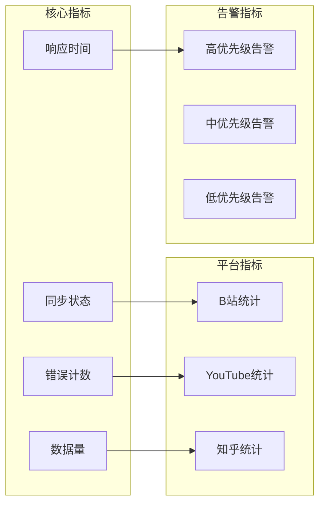

**图表来源**
- [PROJECT_CONTEXT.md:253-254](file://PROJECT_CONTEXT.md#L253-L254)

#### 仪表板配置选项

| 配置项 | 类型 | 默认值 | 描述 |
|--------|------|--------|------|
| 刷新间隔 | number | 60 | 仪表板刷新间隔（秒） |
| 时间范围 | string | '24h' | 显示数据的时间范围 |
| 指标显示 | array | ['sync_status', 'error_count'] | 显示的指标列表 |
| 告警阈值 | object | 自定义阈值 | 告警触发阈值配置 |
| 颜色主题 | string | 'dark' | 仪表板颜色主题 |

**章节来源**
- [PROJECT_CONTEXT.md:253-254](file://PROJECT_CONTEXT.md#L253-L254)

### 关键指标定义

系统定义了一系列关键指标来衡量系统性能和健康状况。

#### 性能指标

| 指标名称 | 计算公式 | 目标值 | 警告阈值 | 严重阈值 |
|----------|----------|--------|----------|----------|
| 同步成功率 | 成功同步次数/总同步次数 | ≥99% | <95% | <90% |
| 平均响应时间 | 所有API调用的平均耗时 | ≤2秒 | >5秒 | >10秒 |
| 数据新鲜度 | 最新数据发布时间-当前时间 | ≤1小时 | >2小时 | >6小时 |
| 错误率 | 错误请求次数/总请求数 | ≤1% | >5% | >10% |
| 吞吐量 | 每分钟处理的数据量 | ≥100条 | <50条 | <20条 |

**章节来源**
- [PROJECT_CONTEXT.md:213-222](file://PROJECT_CONTEXT.md#L213-L222)

### 告警去重机制

系统实现了智能的告警去重机制，避免重复告警信息的频繁发送。

#### 告警去重策略

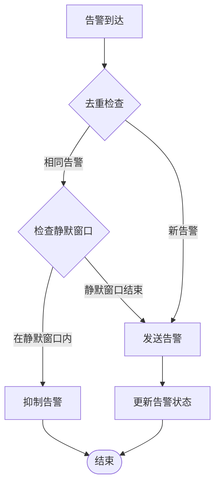

**图表来源**
- [PROJECT_CONTEXT.md:45-46](file://PROJECT_CONTEXT.md#L45-L46)

#### 去重规则

1. **时间窗口去重**：同一类型告警在5分钟内只发送一次
2. **内容去重**：相同内容的告警在30分钟内合并发送
3. **级别去重**：同级别告警在1小时内最多发送3次
4. **平台去重**：同一平台的同类告警在10分钟内聚合

**章节来源**
- [PROJECT_CONTEXT.md:45-46](file://PROJECT_CONTEXT.md#L45-L46)

### 告警静默窗口

系统支持配置静默窗口，避免在特定时间段内发送告警通知。

#### 静默窗口配置

| 配置项 | 类型 | 默认值 | 描述 |
|--------|------|--------|------|
| enabled | boolean | false | 是否启用静默窗口 |
| startTime | string | '23:00' | 静默开始时间 |
| endTime | string | '07:00' | 静默结束时间 |
| weekdays | array | [0,6] | 静默的星期几（0=周日） |
| excludedAlerts | array | [] | 在静默期间仍需发送的告警类型 |

**章节来源**
- [PROJECT_CONTEXT.md:45-46](file://PROJECT_CONTEXT.md#L45-L46)

### 告警升级机制

系统实现了告警升级机制，对于持续存在的问题自动提升告警级别。

#### 告警升级流程

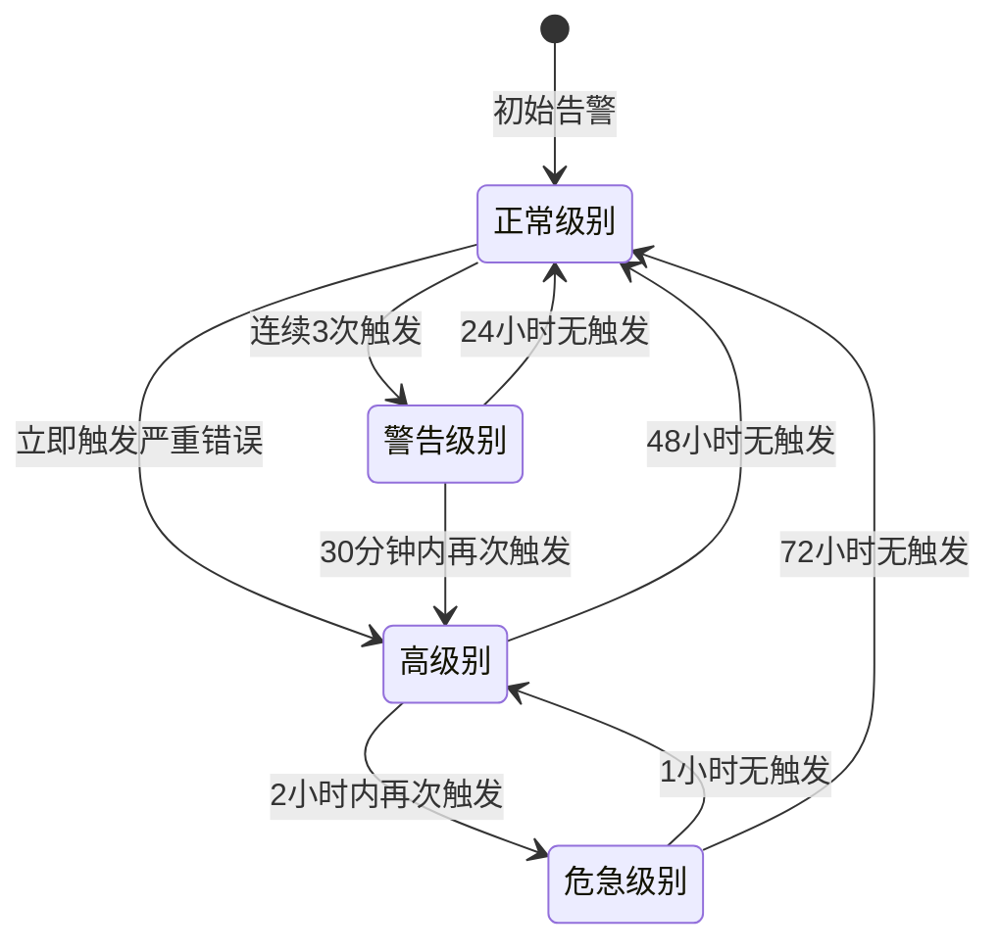

**图表来源**
- [PROJECT_CONTEXT.md:45-46](file://PROJECT_CONTEXT.md#L45-L46)

#### 升级规则

| 当前级别 | 触发条件 | 升级后级别 | 等待时间 |
|----------|----------|------------|----------|
| Normal | 首次触发 | Warning | 立即 |
| Normal | 严重错误 | High | 立即 |
| Warning | 连续3次触发 | High | 立即 |
| Warning | 30分钟内再次触发 | Critical | 立即 |
| High | 2小时再次触发 | Critical | 立即 |
| High | 24小时无触发 | Normal | 立即 |
| Critical | 1小时无触发 | High | 立即 |

**章节来源**
- [PROJECT_CONTEXT.md:45-46](file://PROJECT_CONTEXT.md#L45-L46)

## 依赖关系分析

系统各组件之间的依赖关系如下：

```mermaid
graph TB
subgraph "核心依赖"
SupabaseJS[@supabase/supabase-js]
DenoTS[Deno + TypeScript]
PostgREST[PostgREST]
end
subgraph "监控组件"
MonitorMgr[监控管理]
AlertSystem[告警系统]
Logger[日志系统]
end
subgraph "平台适配器"
BiliAdapter[B站适配器]
YTAdapter[YouTube适配器]
ZhihuAdapter[知乎适配器]
end
subgraph "外部依赖"
YouTubeAPI[YouTube Data API]
RSSHub[RSSHUB]
WeCom[企业微信]
end
MonitorMgr --> SupabaseJS
AlertSystem --> WeCom
BiliAdapter --> YouTubeAPI
YTAdapter --> RSSHub
ZhihuAdapter --> RSSHub
Logger --> SupabaseJS
AlertSystem --> Logger
```

**图表来源**
- [PROJECT_CONTEXT.md:29-32](file://PROJECT_CONTEXT.md#L29-L32)

**章节来源**
- [PROJECT_CONTEXT.md:29-32](file://PROJECT_CONTEXT.md#L29-L32)

## 性能考虑

### 性能优化建议

1. **数据库查询优化**
   - 使用适当的索引提高查询性能
   - 避免N+1查询问题
   - 合理使用LIMIT和OFFSET进行分页

2. **缓存策略**
   - 实施多级缓存（内存缓存+Redis缓存）
   - 缓存热点数据，减少数据库压力
   - 设置合理的缓存过期时间

3. **异步处理**
   - 将耗时操作异步化
   - 使用队列处理批量任务
   - 实现背压机制防止系统过载

4. **资源管理**
   - 合理配置并发数
   - 实施资源池化管理
   - 监控资源使用情况

### 监控指标优化

1. **关键指标监控**
   - 实时监控系统健康状况
   - 设置合理的阈值和告警级别
   - 建立指标基线和趋势分析

2. **性能基准测试**
   - 定期进行性能基准测试
   - 建立性能回归检测
   - 优化瓶颈环节

## 故障排除指南

### 常见问题及解决方案

#### Cron任务失败

**问题症状：**
- Cron任务执行失败
- 日志中出现错误信息
- 监控状态显示异常

**排查步骤：**
1. 检查GitHub Actions运行日志
2. 验证环境变量配置
3. 确认第三方API可用性
4. 检查Supabase连接状态

**解决方案：**
- 重新触发Cron任务
- 检查API密钥有效性
- 增加重试机制
- 调整任务执行时间

#### 告警通知失败

**问题症状：**
- 企业微信告警未收到
- 告警系统显示发送失败
- 日志中出现网络错误

**排查步骤：**
1. 检查企业微信Webhook配置
2. 验证网络连接状态
3. 确认API密钥有效
4. 查看防火墙设置

**解决方案：**
- 重新配置Webhook URL
- 检查网络代理设置
- 增加重试和容错机制
- 使用备用通知渠道

#### 数据同步异常

**问题症状：**
- 数据更新延迟
- 同步状态显示异常
- 用户端数据显示不正确

**排查步骤：**
1. 检查数据库连接状态
2. 验证Upsert操作执行情况
3. 确认RLS策略配置
4. 检查数据清洗逻辑

**解决方案：**
- 重新执行数据同步
- 修复数据清洗问题
- 调整同步频率
- 优化数据库性能

**章节来源**
- [PROJECT_CONTEXT.md:600-614](file://PROJECT_CONTEXT.md#L600-L614)

## 结论

监控与告警系统为多平台内容中枢提供了全面的运维保障。通过分层架构设计、多层次的异常检测和智能的告警机制，系统能够有效地监控工作流执行状态、收集性能指标并及时发现异常情况。

系统的主要优势包括：
- **全面的监控覆盖**：从数据源到用户界面的全链路监控
- **智能的告警机制**：基于阈值和机器学习的智能告警
- **灵活的通知渠道**：支持多种通知方式和渠道
- **完善的日志系统**：详细的日志记录和分析能力
- **强大的扩展性**：模块化的架构设计便于功能扩展

未来可以进一步优化的方向包括：
- 增强机器学习算法用于更精准的异常检测
- 实现更细粒度的性能监控和分析
- 添加更多通知渠道和自定义告警规则
- 优化告警去重和升级机制
- 增强系统的自愈能力

通过持续的监控和优化，该系统将为多平台内容中枢的稳定运行提供强有力的保障。