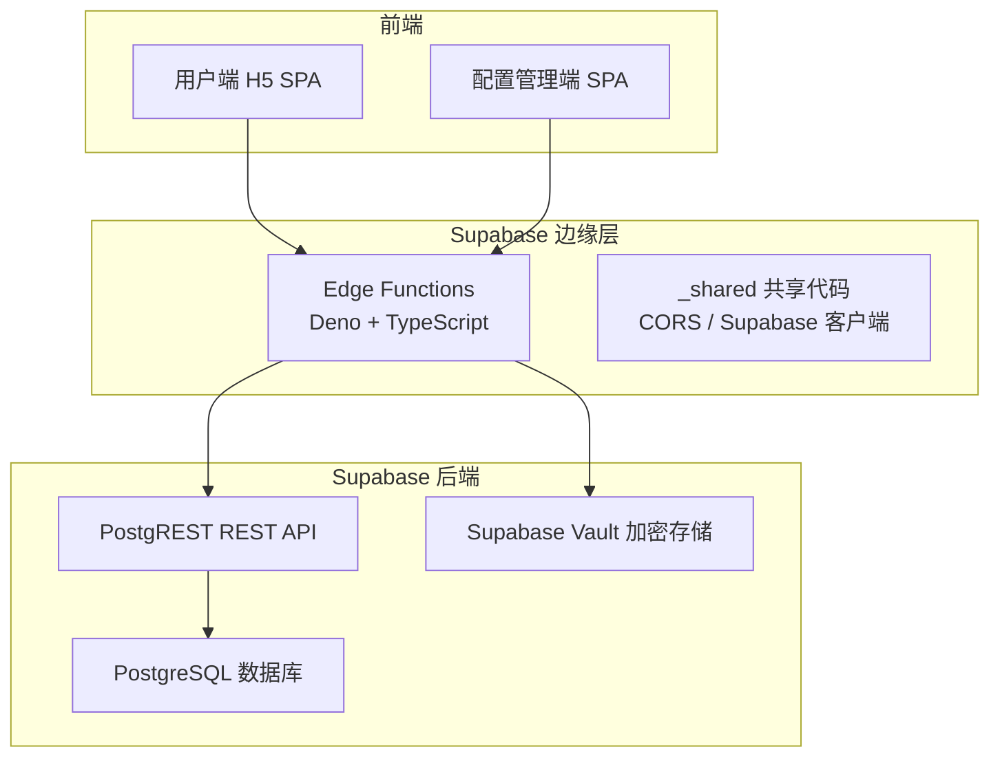
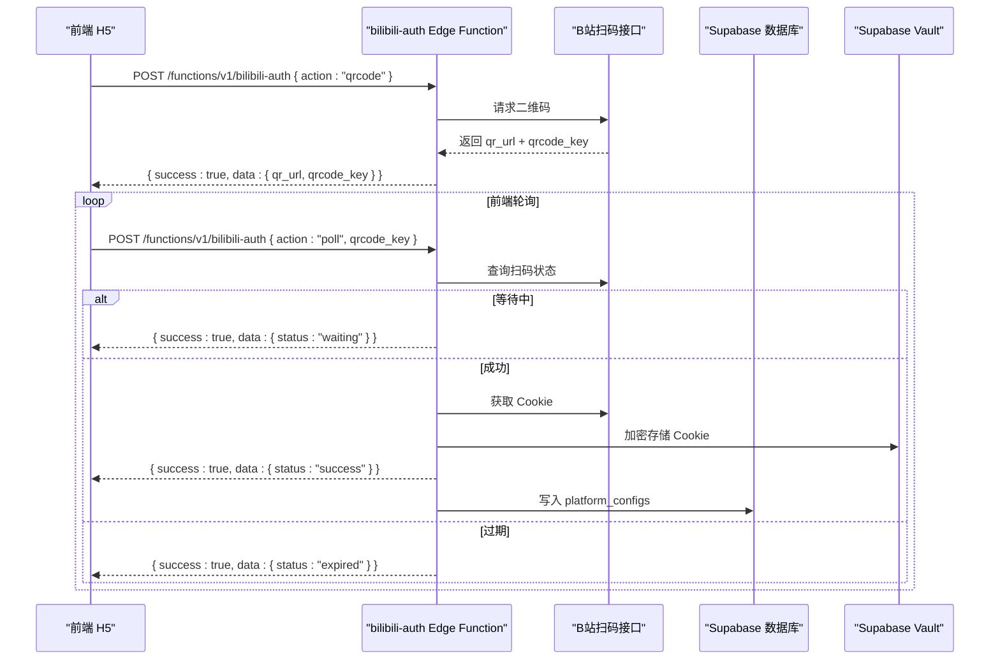
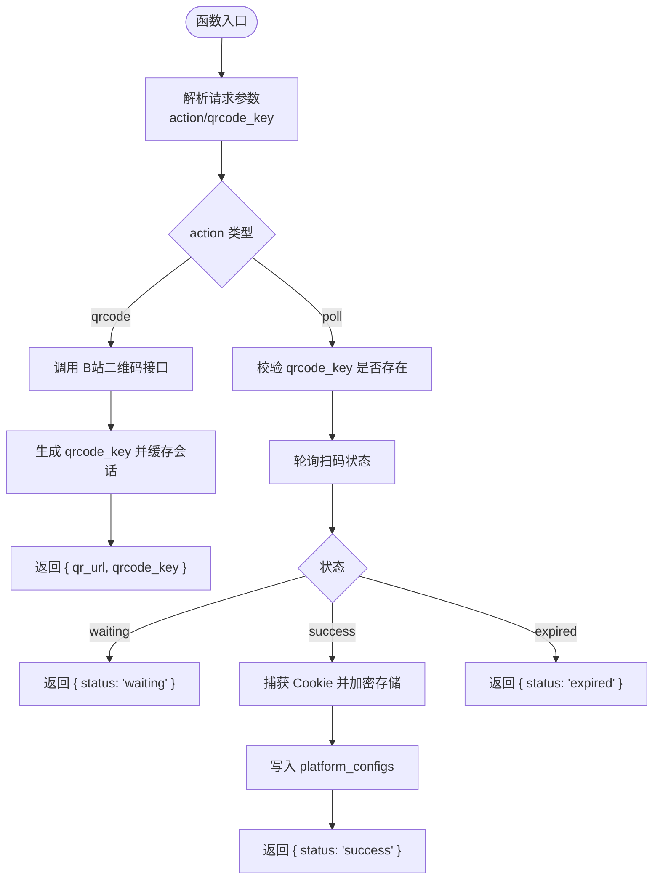
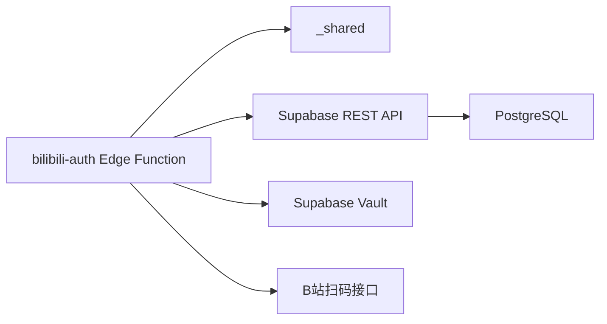

# B站授权函数

<cite>
**本文档引用的文件**
- [PROJECT_CONTEXT.md](file://PROJECT_CONTEXT.md)
- [多平台中枢_PRD.md](file://多平台中枢_PRD.md)
</cite>

## 目录
1. [简介](#简介)
2. [项目结构](#项目结构)
3. [核心组件](#核心组件)
4. [架构总览](#架构总览)
5. [详细组件分析](#详细组件分析)
6. [依赖关系分析](#依赖关系分析)
7. [性能考量](#性能考量)
8. [故障排查指南](#故障排查指南)
9. [结论](#结论)
10. [附录](#附录)

## 简介
本文件为“B站授权函数”（bilibili-auth Edge Function）的技术文档，面向希望在 Supabase Edge Functions（Deno 环境）中实现 B 站扫码登录的开发者。文档基于项目上下文与 PRD，系统阐述扫码登录的完整流程、接口规范、安全与错误处理策略，并给出性能优化建议与最佳实践。

## 项目结构
- 该函数属于 Supabase Edge Functions（Deno + TypeScript）范畴，位于 `supabase/functions/bilibili-auth/` 目录下（按项目上下文约定命名）。
- 与之配套的共享代码位于 `_shared/` 目录（下划线前缀，不参与部署），包含 CORS、Supabase 客户端初始化等。
- 该函数与数据库交互通过 Supabase REST API（匿名密钥或服务角色密钥）进行，遵循统一的请求/响应格式与错误码规范。

图表来源
- [PROJECT_CONTEXT.md: 17-24:17-24](file://PROJECT_CONTEXT.md#L17-L24)
- [PROJECT_CONTEXT.md: 97-114:97-114](file://PROJECT_CONTEXT.md#L97-L114)

章节来源
- [PROJECT_CONTEXT.md: 97-114:97-114](file://PROJECT_CONTEXT.md#L97-L114)
- [PROJECT_CONTEXT.md: 17-24:17-24](file://PROJECT_CONTEXT.md#L17-L24)

## 核心组件
- bilibili-auth Edge Function：负责生成二维码、轮询扫码状态、捕获 Cookie 并加密存储。
- parse-url Edge Function：用于 URL 解析与平台识别，便于统一的 Edge Function 调用。
- _shared 共享代码：提供 CORS 头、Supabase 客户端初始化（匿名/服务角色）。
- 数据库：monitors、contents、platform_configs 等表承载监控、内容与平台配置（含加密 Cookie）。
- Supabase Vault：用于加密存储敏感信息（如 B站 Cookie）。

章节来源
- [PROJECT_CONTEXT.md: 292-299:292-299](file://PROJECT_CONTEXT.md#L292-L299)
- [PROJECT_CONTEXT.md: 475-509:475-509](file://PROJECT_CONTEXT.md#L475-L509)
- [PROJECT_CONTEXT.md: 390-400:390-400](file://PROJECT_CONTEXT.md#L390-L400)

## 架构总览
B站扫码登录的整体流程如下：
- 前端发起“获取二维码”请求，Edge Function 调用 B站二维码接口，返回二维码图片 URL 与临时凭证（qrcode_key）。
- 前端轮询“状态查询”，Edge Function 持续查询扫码状态，直到成功或过期。
- 扫码成功后，Edge Function 从 B站会话中捕获 Cookie，经加密后写入 platform_configs 表，完成授权闭环。

图表来源
- [PROJECT_CONTEXT.md: 539-568:539-568](file://PROJECT_CONTEXT.md#L539-L568)
- [PROJECT_CONTEXT.md: 292-299:292-299](file://PROJECT_CONTEXT.md#L292-L299)

## 详细组件分析

### bilibili-auth Edge Function 设计
- 入口路径：`/functions/v1/bilibili-auth`
- 请求/响应格式：统一 JSON，遵循 Edge Function 通用规范。
- 核心动作：
  - qrcode：生成二维码并返回临时凭证（qrcode_key）。
  - poll：根据 qrcode_key 轮询扫码状态，返回 waiting/success/expired。
- 会话与状态：
  - 使用 qrcode_key 作为短期会话标识，避免在 Edge Function 中持久化状态。
  - 轮询间隔建议前端控制在合理区间（例如 1-3 秒），避免过度请求。
- Cookie 捕获与存储：
  - 扫码成功后，从 B站会话中提取 Cookie（如 SESSDATA 等），经加密后写入 platform_configs。
  - 存储前进行必要校验（如 Cookie 有效性），失败时返回相应错误码。

图表来源
- [PROJECT_CONTEXT.md: 539-568:539-568](file://PROJECT_CONTEXT.md#L539-L568)
- [PROJECT_CONTEXT.md: 292-299:292-299](file://PROJECT_CONTEXT.md#L292-L299)

章节来源
- [PROJECT_CONTEXT.md: 539-568:539-568](file://PROJECT_CONTEXT.md#L539-L568)
- [PROJECT_CONTEXT.md: 570-598:570-598](file://PROJECT_CONTEXT.md#L570-L598)

### API 接口规范
- 通用请求格式
  - 方法：POST
  - 路径：/functions/v1/bilibili-auth
  - 头部：Content-Type: application/json，Authorization: Bearer {anon_key或auth_token}
  - 请求体字段：action（必填），以及各 action 对应的附加字段。
- 通用响应格式
  - 成功：{ success: true, data: { ... } }
  - 失败：{ success: false, error: { code, message } }
- bilibili-auth 接口
  - 获取二维码
    - 请求：{ "action": "qrcode" }
    - 成功响应：{ "success": true, "data": { "qr_url": "...", "qrcode_key": "..." } }
  - 轮询扫码状态
    - 请求：{ "action": "poll", "qrcode_key": "..." }
    - 响应（等待中）：{ "success": true, "data": { "status": "waiting" } }
    - 响应（成功）：{ "success": true, "data": { "status": "success" } }
    - 响应（过期）：{ "success": true, "data": { "status": "expired" } }

章节来源
- [PROJECT_CONTEXT.md: 475-509:475-509](file://PROJECT_CONTEXT.md#L475-L509)
- [PROJECT_CONTEXT.md: 539-568:539-568](file://PROJECT_CONTEXT.md#L539-L568)

### Deno 环境下的异步处理与 HTTP 请求管理
- 异步模型：Edge Function 基于 Deno 的异步 I/O，请求处理在事件循环中非阻塞执行。
- HTTP 请求：使用标准 fetch 或 Supabase 客户端封装的 HTTP 调用，注意设置合理的超时与重试策略。
- 会话状态维护：qrcode_key 作为短期会话标识，建议结合 Supabase Edge Functions 的内存缓存或外部缓存（如 Redis）进行状态跟踪，避免在函数实例间共享状态。
- 跨域与安全：通过 _shared/cors.ts 设置合适的 CORS 头，确保前端 H5 与 Edge Function 的跨域通信。

章节来源
- [PROJECT_CONTEXT.md: 17-24:17-24](file://PROJECT_CONTEXT.md#L17-L24)
- [PROJECT_CONTEXT.md: 99-102:99-102](file://PROJECT_CONTEXT.md#L99-L102)

### 安全考虑
- 密钥与凭据
  - SUPABASE_ANON_KEY 仅用于前端，不得暴露给 Edge Function。
  - SUPABASE_SERVICE_ROLE_KEY 仅用于服务端（Cron 脚本与 Edge Function 内部），不得暴露到前端。
- 敏感信息存储
  - B站 Cookie 通过 Supabase Vault 加密存储，避免明文落盘。
- 授权流程
  - Edge Function 仅处理二维码生成与状态轮询，不直接访问用户隐私数据。
  - 前端负责引导用户扫码，Edge Function 仅在成功时写入加密 Cookie。

章节来源
- [PROJECT_CONTEXT.md: 34-44:34-44](file://PROJECT_CONTEXT.md#L34-L44)
- [PROJECT_CONTEXT.md: 390-400:390-400](file://PROJECT_CONTEXT.md#L390-L400)
- [PROJECT_CONTEXT.md: 402-417:402-417](file://PROJECT_CONTEXT.md#L402-L417)

### 错误处理与错误码
- 统一错误码
  - UNKNOWN_PLATFORM：无法识别平台
  - INVALID_URL：URL 格式不合法
  - DUPLICATE_MONITOR：监控目标重复
  - BILIBILI_QRCODE_EXPIRED：B站二维码已过期
  - BILIBILI_COOKIE_INVALID：B站 Cookie 已失效
  - YOUTUBE_API_ERROR：YouTube API 调用失败
  - RSSHUB_ERROR：RSSHub 接口调用失败
  - INTERNAL_ERROR：未预期的内部错误
- 前端处理建议
  - 对于 BILIBILI_QRCODE_EXPIRED，引导用户重新获取二维码。
  - 对于 BILIBILI_COOKIE_INVALID，提示用户重新扫码授权。
  - 对于网络异常，提供重试与超时提示。

章节来源
- [PROJECT_CONTEXT.md: 600-614:600-614](file://PROJECT_CONTEXT.md#L600-L614)

## 依赖关系分析
- 组件耦合
  - bilibili-auth 与 _shared 共享代码解耦，通过模块化导入实现复用。
  - 与数据库交互通过 Supabase REST API，遵循统一的请求头与响应格式。
- 外部依赖
  - B站扫码接口：用于二维码生成与状态查询。
  - Supabase Vault：用于加密存储 Cookie。
- 潜在环路
  - Edge Function 与数据库之间为单向调用，无循环依赖。
  - 前端与 Edge Function 之间为请求-响应关系，无循环依赖。

图表来源
- [PROJECT_CONTEXT.md: 99-102:99-102](file://PROJECT_CONTEXT.md#L99-L102)
- [PROJECT_CONTEXT.md: 390-400:390-400](file://PROJECT_CONTEXT.md#L390-L400)

章节来源
- [PROJECT_CONTEXT.md: 99-102:99-102](file://PROJECT_CONTEXT.md#L99-L102)
- [PROJECT_CONTEXT.md: 390-400:390-400](file://PROJECT_CONTEXT.md#L390-L400)

## 性能考量
- 轮询策略
  - 前端轮询间隔建议在 1-3 秒之间，避免频繁请求导致 B站接口限流。
  - Edge Function 内部对 qrcode_key 的查询应尽量幂等，避免重复计算。
- 超时与重试
  - 对外部接口调用设置合理超时（如 5-10 秒），并在失败时进行有限重试。
- 缓存与状态
  - qrcode_key 的短期会话状态可缓存于 Edge Functions 的内存或外部缓存，减少数据库压力。
- 并发与伸缩
  - Edge Function 为无状态函数，可水平扩展；注意外部接口（B站）的速率限制。

## 故障排查指南
- 常见问题
  - 二维码过期：前端重新发起“获取二维码”请求。
  - 扫码成功但 Cookie 失效：重新扫码授权，或检查 B站 Cookie 有效期。
  - 网络超时：检查 Edge Function 与 B站接口的连通性，适当增加超时时间。
- 日志与监控
  - 在 Edge Function 中记录关键事件（二维码生成、状态轮询、Cookie 写入）的日志，便于定位问题。
  - 对错误码进行统计与告警，及时发现异常。

章节来源
- [PROJECT_CONTEXT.md: 600-614:600-614](file://PROJECT_CONTEXT.md#L600-L614)

## 结论
bilibili-auth Edge Function 通过“二维码生成—状态轮询—Cookie 捕获—加密存储”的闭环，实现了在 Supabase Edge Functions（Deno）环境中的 B站扫码登录。其设计遵循统一的请求/响应格式与错误码规范，配合 _shared 共享代码与 Supabase Vault，确保了安全性与可维护性。建议在生产环境中严格控制轮询频率、设置合理的超时与重试策略，并完善日志与监控体系。

## 附录
- 相关接口与数据模型
  - 平台配置表（platform_configs）：用于存储加密的 Cookie 等敏感信息。
  - bilibili-auth 接口：统一的二维码与状态查询接口。
- 最佳实践
  - 前端与 Edge Function 的职责分离：前端负责用户体验，Edge Function 负责业务逻辑与数据安全。
  - 敏感信息加密存储：始终通过 Supabase Vault 进行加密处理。
  - 错误码与提示：为用户提供清晰的错误提示与重试指引。

章节来源
- [PROJECT_CONTEXT.md: 390-400:390-400](file://PROJECT_CONTEXT.md#L390-L400)
- [PROJECT_CONTEXT.md: 539-568:539-568](file://PROJECT_CONTEXT.md#L539-L568)
- [PROJECT_CONTEXT.md: 402-417:402-417](file://PROJECT_CONTEXT.md#L402-L417)