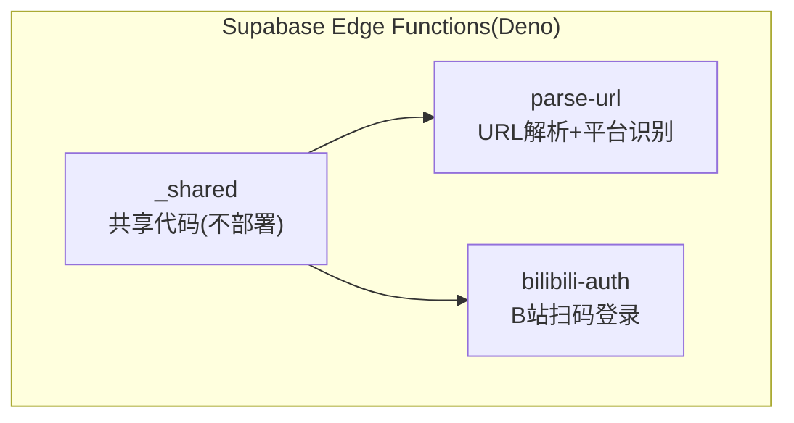
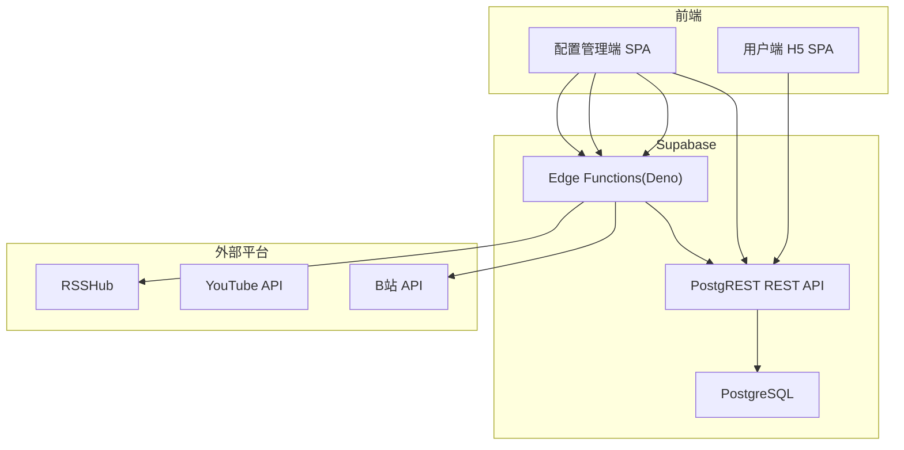
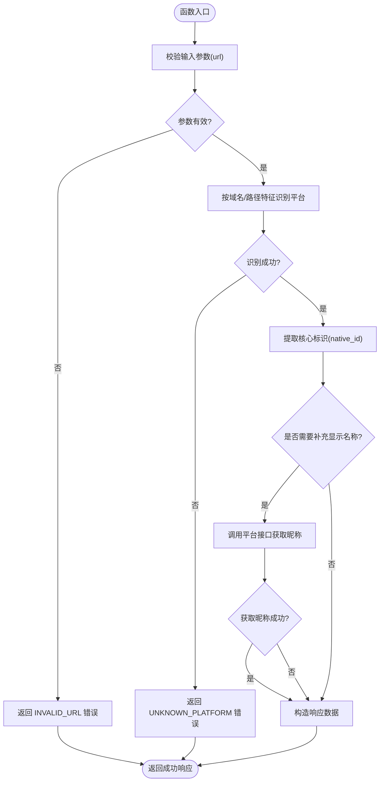
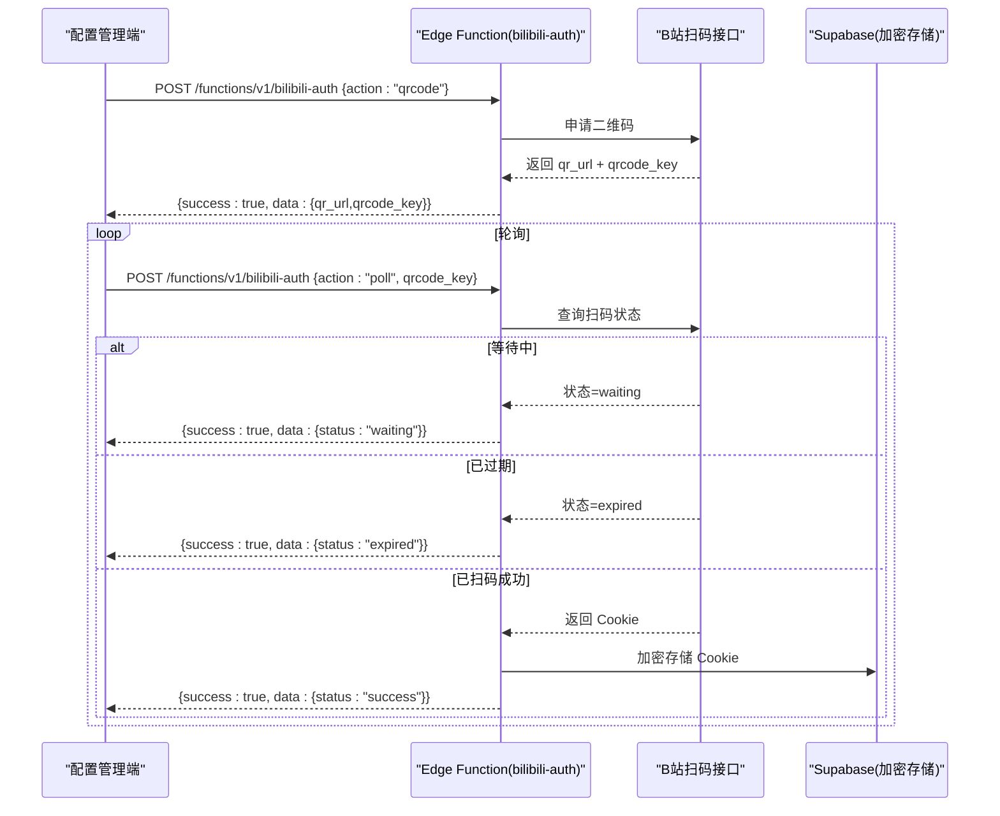
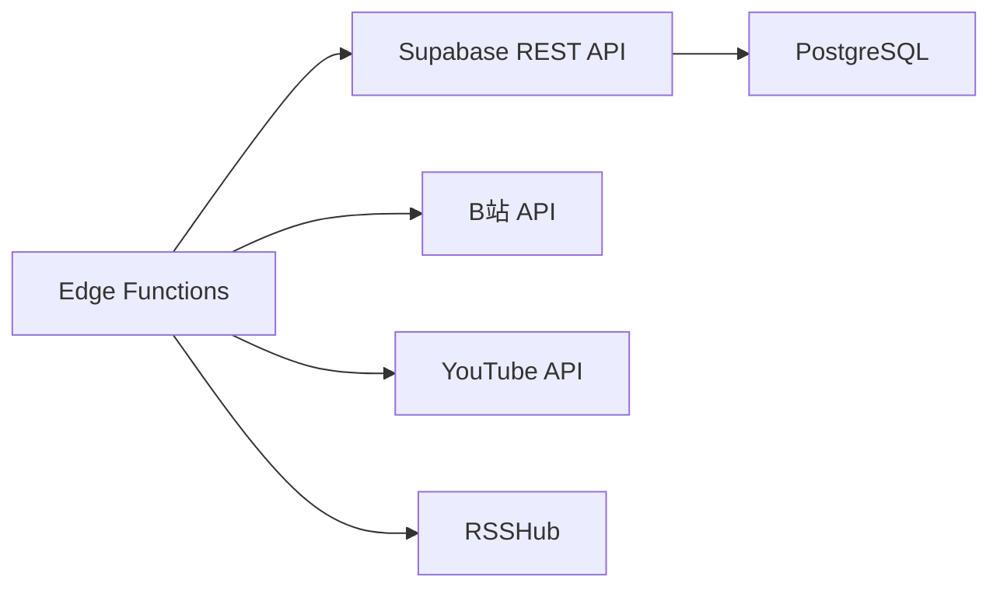

# Supabase Edge Functions

<cite>
**本文引用的文件**
- [PROJECT_CONTEXT.md](file://PROJECT_CONTEXT.md)
- [多平台中枢_PRD.md](file://多平台中枢_PRD.md)
</cite>

## 目录
1. [简介](#简介)
2. [项目结构](#项目结构)
3. [核心组件](#核心组件)
4. [架构总览](#架构总览)
5. [详细组件分析](#详细组件分析)
6. [依赖分析](#依赖分析)
7. [性能考虑](#性能考虑)
8. [故障排除指南](#故障排除指南)
9. [结论](#结论)
10. [附录](#附录)

## 简介
本文件面向 Supabase Edge Functions 的使用者与维护者，系统性梳理在 Deno 环境下的函数架构设计与实现要点，重点覆盖以下主题：
- 函数组织方式：fat functions + _shared 目录的实践与部署规范
- 共享代码管理策略：如何在 Deno 环境中复用类型与工具
- parse-url 函数：URL 解析算法、平台识别逻辑与错误处理
- bilibili-auth 函数：二维码生成、扫码状态轮询与 Cookie 捕获流程
- 开发规范：请求/响应格式、CORS 配置与安全约束
- API 接口规范：使用示例与常见问题排查

## 项目结构
Supabase Edge Functions 位于 supabase/functions 目录下，采用官方推荐的“fat functions + _shared”组织方式，函数名使用 kebab-case 以利于 URL 友好访问。目录结构如下：
- supabase/functions/_shared：共享代码（下划线前缀，不参与部署）
  - supabaseAdmin.ts：使用 service_role 的 Supabase 客户端封装
  - supabaseClient.ts：使用 anon_key 的 Supabase 客户端封装
  - cors.ts：CORS 头部配置
- supabase/functions/parse-url：URL 解析 + 平台识别
- supabase/functions/bilibili-auth：B站扫码登录

图表来源
- [PROJECT_CONTEXT.md:97-113](file://PROJECT_CONTEXT.md#L97-L113)

章节来源
- [PROJECT_CONTEXT.md:49-157](file://PROJECT_CONTEXT.md#L49-L157)

## 核心组件
- parse-url：接收 URL，识别平台并提取核心标识，必要时补充显示名称
- bilibili-auth：生成二维码、轮询扫码状态、成功后捕获 Cookie 并加密存储

章节来源
- [PROJECT_CONTEXT.md:281-299](file://PROJECT_CONTEXT.md#L281-L299)

## 架构总览
整体架构围绕“前端 SPA ↔ Edge Functions ↔ Supabase REST API/PostgreSQL”的模式展开。Edge Functions 仅承担轻量逻辑，数据密集型操作通过 PostgREST 或数据库函数完成。

图表来源
- [PROJECT_CONTEXT.md:171-206](file://PROJECT_CONTEXT.md#L171-L206)

## 详细组件分析

### parse-url 组件
- 职责：根据 URL 特征识别平台，提取核心标识 native_id，必要时补充 display_name
- 输入：请求体包含 url 字段
- 输出：统一的成功/失败响应结构，成功时返回 platform、native_id、display_name
- 平台识别规则：
  - 包含 bilibili.com → B站，正则提取 mid
  - 包含 youtube.com → YouTube，提取 @handle 并调 channels.list?forHandle= 转换为 channelId
  - 包含 zhihu.com → 知乎，正则提取 people_id 或 column_id
- 错误处理：
  - UNKNOWN_PLATFORM：无法识别平台
  - INVALID_URL：URL 格式不合法
  - DUPLICATE_MONITOR：该博主已添加（由上游调用方处理）

图表来源
- [PROJECT_CONTEXT.md:511-537](file://PROJECT_CONTEXT.md#L511-L537)

章节来源
- [PROJECT_CONTEXT.md:281-291](file://PROJECT_CONTEXT.md#L281-L291)
- [PROJECT_CONTEXT.md:511-537](file://PROJECT_CONTEXT.md#L511-L537)

### bilibili-auth 组件
- 职责：生成二维码、轮询扫码状态、成功后捕获 Cookie 并加密存储
- 接口：
  - POST /functions/v1/bilibili-auth
    - action=qrcode：返回二维码图片 URL 与 qrcode_key
    - action=poll + qrcode_key：返回 waiting/expired/success 状态
- 存储：Cookie 加密后写入 platform_configs 表

图表来源
- [PROJECT_CONTEXT.md:292-299](file://PROJECT_CONTEXT.md#L292-L299)
- [PROJECT_CONTEXT.md:539-568](file://PROJECT_CONTEXT.md#L539-L568)

章节来源
- [PROJECT_CONTEXT.md:292-299](file://PROJECT_CONTEXT.md#L292-L299)
- [PROJECT_CONTEXT.md:539-568](file://PROJECT_CONTEXT.md#L539-L568)

### 共享代码管理策略
- _shared 目录中的模块（如 supabaseAdmin.ts、supabaseClient.ts、cors.ts）在 Deno 环境中复用，避免重复实现
- 由于 Edge Functions（Deno）无法直接引用 npm 包，共享类型在 _shared/types.ts 中维护副本并标注同步来源，确保前后端类型一致

章节来源
- [PROJECT_CONTEXT.md:97-102](file://PROJECT_CONTEXT.md#L97-L102)
- [PROJECT_CONTEXT.md:159-166](file://PROJECT_CONTEXT.md#L159-L166)

## 依赖分析
- Edge Functions 与 Supabase 的依赖关系：通过 PostgREST REST API 与数据库交互
- 外部平台依赖：B站、YouTube、RSSHub
- 互斥与限速：Cron 互斥锁与同平台请求间隔 ≥ 1.5s，保障稳定性

图表来源
- [PROJECT_CONTEXT.md:171-206](file://PROJECT_CONTEXT.md#L171-L206)

章节来源
- [PROJECT_CONTEXT.md:169-223](file://PROJECT_CONTEXT.md#L169-L223)

## 性能考虑
- Edge Functions 仅承担轻量逻辑，避免在函数中进行大规模计算或 I/O
- 使用统一的请求/响应格式与错误码，便于前端快速失败与重试
- CORS 配置集中管理，减少跨域问题带来的额外开销

## 故障排除指南
- 常见错误码与含义：
  - UNKNOWN_PLATFORM：无法识别 URL 对应的平台
  - INVALID_URL：URL 格式不合法
  - DUPLICATE_MONITOR：该博主已添加
  - BILIBILI_QRCODE_EXPIRED：B站二维码已过期
  - BILIBILI_COOKIE_INVALID：B站 Cookie 已失效
  - YOUTUBE_API_ERROR：YouTube API 调用失败
  - RSSHUB_ERROR：RSSHub 接口调用失败
  - INTERNAL_ERROR：未预期的内部错误
- 排查步骤：
  - 确认请求体格式与字段命名正确
  - 检查 Edge Function 的授权头（anon_key 或 auth_token）
  - 对 bilibili-auth：确认 qrcode_key 未过期，轮询间隔合理
  - 对 parse-url：确认 URL 可访问且符合平台特征

章节来源
- [PROJECT_CONTEXT.md:600-614](file://PROJECT_CONTEXT.md#L600-L614)

## 结论
本项目在 Supabase Edge Functions 上实现了两类轻量逻辑：URL 解析与 B站扫码登录。通过 fat functions + _shared 的组织方式与统一的请求/响应规范，既保证了可维护性，又满足了 Deno 环境下的部署与运行约束。配合 PostgREST 与数据库函数，系统实现了从“配置管理端”到“用户端 H5”的完整数据流闭环。

## 附录

### 开发规范与接口规范
- 请求/响应格式
  - 请求：JSON，Content-Type: application/json
  - 响应：统一 success/data/error 结构
- CORS 配置
  - 通过 _shared/cors.ts 管理，集中设置允许的来源、方法与头部
- 安全约束
  - SUPABASE_SERVICE_ROLE_KEY 永不出现在前端
  - 前端 SPA 仅使用 SUPABASE_ANON_KEY
  - 敏感信息（Cookie、API Key）加密存储或通过环境变量管理

章节来源
- [PROJECT_CONTEXT.md:475-509](file://PROJECT_CONTEXT.md#L475-L509)
- [PROJECT_CONTEXT.md:97-102](file://PROJECT_CONTEXT.md#L97-L102)
- [PROJECT_CONTEXT.md:402-417](file://PROJECT_CONTEXT.md#L402-L417)

### 使用示例
- parse-url
  - 请求：POST /functions/v1/parse-url
  - 请求体：{ "url": "https://space.bilibili.com/12345" }
  - 成功响应：{ "success": true, "data": { "platform": "bilibili", "native_id": "12345", "display_name": "B站_12345" } }
  - 失败响应：{ "success": false, "error": { "code": "UNKNOWN_PLATFORM", "message": "无法识别该平台" } }
- bilibili-auth
  - 获取二维码：POST /functions/v1/bilibili-auth { "action": "qrcode" }
  - 轮询扫码状态：POST /functions/v1/bilibili-auth { "action": "poll", "qrcode_key": "xxx" }

章节来源
- [PROJECT_CONTEXT.md:511-568](file://PROJECT_CONTEXT.md#L511-L568)