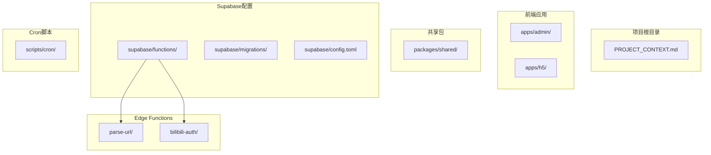
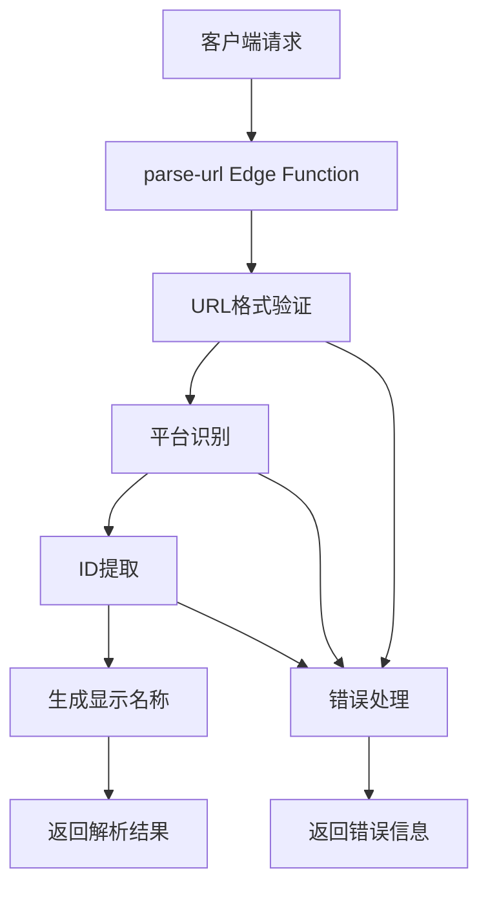
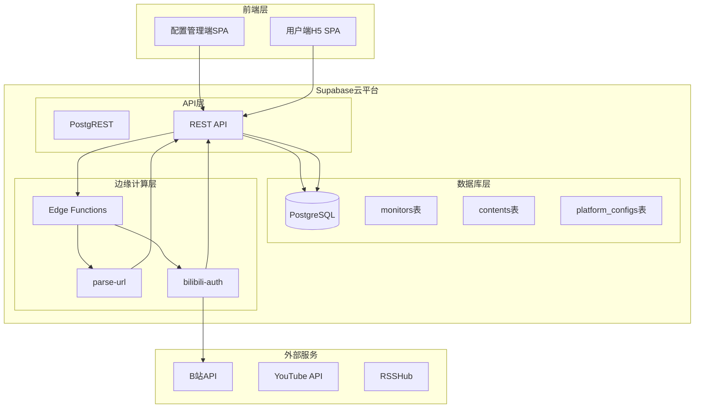
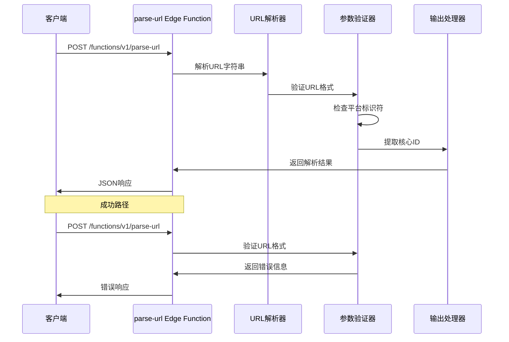
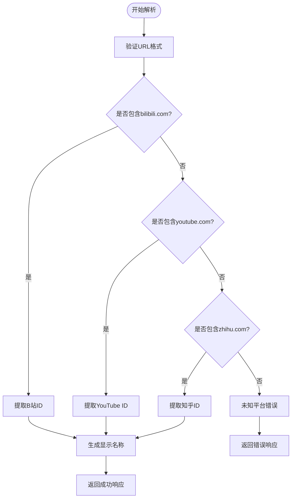
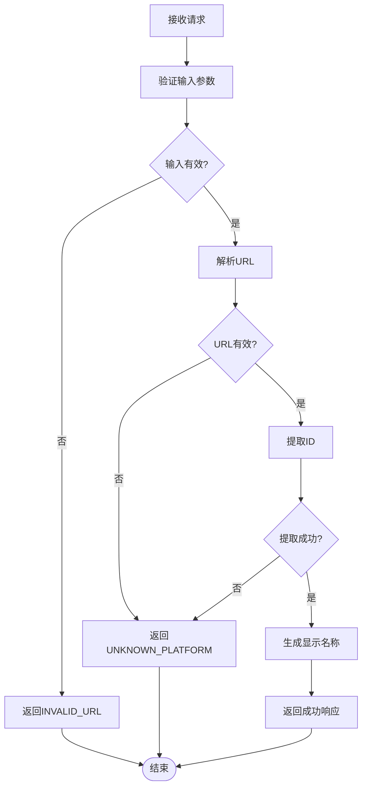

# URL解析函数

<cite>
**本文档引用的文件**
- [PROJECT_CONTEXT.md](file://PROJECT_CONTEXT.md)
</cite>

## 目录
1. [简介](#简介)
2. [项目结构](#项目结构)
3. [核心组件](#核心组件)
4. [架构概览](#架构概览)
5. [详细组件分析](#详细组件分析)
6. [依赖关系分析](#依赖关系分析)
7. [性能考虑](#性能考虑)
8. [故障排除指南](#故障排除指南)
9. [结论](#结论)

## 简介

parse-url Edge Function是多平台内容中枢系统中的核心组件，负责将用户输入的第三方平台URL解析为系统内部可识别的平台标识符和用户标识。该函数运行在Supabase Edge Functions环境中，使用Deno运行时，专门用于轻量级的URL解析和平台识别任务。

该函数的主要职责包括：
- 识别URL所属的平台（抖音、B站、知乎、YouTube等）
- 提取URL中的核心标识符（如用户ID、频道ID等）
- 生成显示名称以便用户界面展示
- 提供统一的错误处理机制

## 项目结构

多平台中枢采用Monorepo架构，parse-url Edge Function位于Supabase Functions目录中，遵循特定的组织规范：

**图表来源**
- [PROJECT_CONTEXT.md:51-141](file://PROJECT_CONTEXT.md#L51-L141)

**章节来源**
- [PROJECT_CONTEXT.md:51-141](file://PROJECT_CONTEXT.md#L51-L141)

## 核心组件

### Edge Function架构

parse-url Edge Function基于以下核心架构设计：

**图表来源**
- [PROJECT_CONTEXT.md:281-291](file://PROJECT_CONTEXT.md#L281-L291)

### 输入输出规范

#### 输入格式
- **URL字符串**: 必填参数，格式为标准URL
- **数据类型**: string
- **验证规则**: 必须为有效的URL格式

#### 输出格式
- **平台标识**: string，如"bilibili"、"youtube"、"zhihu"
- **原生ID**: string，从URL中提取的核心标识符
- **显示名称**: string（可选），用于用户界面展示

**章节来源**
- [PROJECT_CONTEXT.md:281-291](file://PROJECT_CONTEXT.md#L281-L291)

## 架构概览

### 整体系统架构

**图表来源**
- [PROJECT_CONTEXT.md:173-206](file://PROJECT_CONTEXT.md#L173-L206)

### parse-url函数执行流程

**图表来源**
- [PROJECT_CONTEXT.md:511-537](file://PROJECT_CONTEXT.md#L511-L537)

## 详细组件分析

### 平台识别逻辑

#### 支持的平台列表

当前版本支持以下平台的URL解析：

| 平台 | 域名特征 | 标识符提取规则 | 示例URL |
|------|----------|----------------|---------|
| B站 | `bilibili.com` | 提取`mid`参数 | `https://space.bilibili.com/12345` |
| YouTube | `youtube.com` | 提取`@handle`并转换为`channelId` | `https://www.youtube.com/@handle` |
| 知乎 | `zhihu.com` | 提取`people_id`或`column_id` | `https://www.zhihu.com/people/12345` |

#### URL模式匹配算法

**图表来源**
- [PROJECT_CONTEXT.md:287-290](file://PROJECT_CONTEXT.md#L287-L290)

### 参数提取机制

#### B站平台解析规则

对于B站URL，系统采用以下解析策略：
- URL模式：`https://space.bilibili.com/{mid}`
- 标识符提取：直接从路径末尾提取数字ID
- 显示名称生成：格式为"B站_{mid}"

#### YouTube平台解析规则

对于YouTube URL，系统采用以下解析策略：
- URL模式：`https://www.youtube.com/@{handle}`
- 标识符提取：提取`@handle`前缀
- API转换：调用`channels.list?forHandle={handle}`转换为`channelId`
- 显示名称生成：格式为"YouTube_{handle}"

#### 知乎平台解析规则

对于知乎URL，系统采用以下解析策略：
- URL模式：`https://www.zhihu.com/people/{people_id}` 或 `https://www.zhihu.com/column/{column_id}`
- 标识符提取：提取路径中的`people_id`或`column_id`
- 显示名称生成：格式为"知乎_{id}"

**章节来源**
- [PROJECT_CONTEXT.md:287-290](file://PROJECT_CONTEXT.md#L287-L290)

### 错误处理策略

#### 错误码定义

| 错误码 | HTTP状态码 | 描述 | 触发条件 |
|--------|------------|------|----------|
| `UNKNOWN_PLATFORM` | 400 | 无法识别的平台 | URL不匹配任何支持的平台 |
| `INVALID_URL` | 400 | URL格式无效 | URL不是有效的URL格式 |
| `DUPLICATE_MONITOR` | 409 | 监控目标重复 | 该平台ID已被监控 |
| `BILIBILI_QRCODE_EXPIRED` | 400 | B站二维码过期 | B站扫码授权二维码已过期 |
| `BILIBILI_COOKIE_INVALID` | 401 | B站Cookie无效 | B站Cookie认证失败 |
| `YOUTUBE_API_ERROR` | 502 | YouTube API调用失败 | YouTube API请求异常 |
| `RSSHUB_ERROR` | 502 | RSSHub接口调用失败 | RSSHub接口请求异常 |
| `INTERNAL_ERROR` | 500 | 内部服务器错误 | 未预期的系统错误 |

#### 错误处理流程

**图表来源**
- [PROJECT_CONTEXT.md:600-614](file://PROJECT_CONTEXT.md#L600-L614)

**章节来源**
- [PROJECT_CONTEXT.md:600-614](file://PROJECT_CONTEXT.md#L600-L614)

## 依赖关系分析

### 外部依赖

#### Supabase Edge Functions运行时

parse-url函数依赖于Supabase提供的Deno运行时环境，具有以下特性：
- **运行时环境**: Deno 1.x
- **内存限制**: 512MB
- **执行时间**: 最长60秒
- **网络访问**: 仅允许出站HTTPS访问

#### 第三方API依赖

| 依赖服务 | 用途 | 访问方式 | 配置要求 |
|----------|------|----------|----------|
| B站API | Cookie验证和用户信息获取 | HTTPS请求 | B站Cookie |
| YouTube API | 频道信息查询 | HTTPS请求 | API Key |
| RSSHub | 知乎内容抓取 | HTTPS请求 | API Key |
| Supabase REST API | 数据存储和查询 | HTTPS请求 | Service Role Key |

### 内部依赖

#### 类型定义同步

由于Edge Functions环境限制，类型定义需要手动同步：
- **共享类型源**: `packages/shared/src/types/`
- **同步策略**: 在`_shared/types.ts`中维护副本
- **同步标记**: `// SYNC: packages/shared/src/types/`

#### 数据库依赖

parse-url函数与以下数据库表进行交互：
- **monitors表**: 存储监控目标信息
- **platform_configs表**: 存储平台配置和认证信息

**章节来源**
- [PROJECT_CONTEXT.md:159-166](file://PROJECT_CONTEXT.md#L159-L166)

## 性能考虑

### 执行效率优化

#### 内存使用优化

- **字符串处理**: 使用高效的字符串匹配算法
- **正则表达式**: 缓存编译后的正则表达式
- **对象创建**: 避免不必要的对象创建和垃圾回收

#### 网络请求优化

- **超时设置**: 设置合理的请求超时时间（5-10秒）
- **重试机制**: 对临时性错误实施指数退避重试
- **连接复用**: 利用HTTP/2连接复用减少延迟

### 并发处理

#### 请求并发限制

- **最大并发**: 100个并发请求
- **队列处理**: 超出限制的请求进入队列等待
- **超时处理**: 超时请求直接返回错误

#### 缓存策略

- **URL缓存**: 缓存最近使用的URL解析结果
- **平台配置缓存**: 缓存平台配置信息
- **TTL设置**: 缓存有效期设置为5分钟

## 故障排除指南

### 常见问题及解决方案

#### URL格式错误

**问题描述**: 返回`INVALID_URL`错误
**可能原因**:
- URL不是有效的URL格式
- URL缺少协议部分（http/https）
- URL包含特殊字符未正确编码

**解决方案**:
1. 确保URL以`http://`或`https://`开头
2. 使用URL编码函数对特殊字符进行编码
3. 验证URL格式的有效性

#### 平台识别失败

**问题描述**: 返回`UNKNOWN_PLATFORM`错误
**可能原因**:
- URL不属于任何支持的平台
- URL格式不在支持范围内
- 平台域名发生变化

**解决方案**:
1. 检查URL是否包含支持的域名特征
2. 确认URL格式符合平台标准
3. 联系开发团队添加新平台支持

#### 显示名称生成异常

**问题描述**: 显示名称为空或格式不正确
**可能原因**:
- ID提取失败
- 显示名称生成逻辑异常
- 字符编码问题

**解决方案**:
1. 检查ID提取正则表达式的准确性
2. 验证显示名称生成逻辑
3. 处理特殊字符和编码问题

### 调试技巧

#### 日志记录

建议在开发阶段添加适当的日志记录：
- 请求参数记录
- 处理步骤跟踪
- 错误信息记录

#### 性能监控

监控关键指标：
- 请求响应时间
- 错误率统计
- 并发请求数
- 内存使用情况

**章节来源**
- [PROJECT_CONTEXT.md:600-614](file://PROJECT_CONTEXT.md#L600-L614)

## 结论

parse-url Edge Function作为多平台内容中枢系统的核心组件，实现了高效、可靠的URL解析功能。通过清晰的架构设计、完善的错误处理机制和严格的性能优化，该函数能够稳定地支持多个第三方平台的URL解析需求。

### 主要优势

1. **轻量级设计**: 符合Edge Functions的轻量级要求
2. **扩展性强**: 易于添加新的平台支持
3. **错误处理完善**: 提供全面的错误码和处理策略
4. **性能优化**: 采用多种优化技术提升执行效率

### 发展方向

未来可以考虑的功能增强：
- 支持更多第三方平台
- 实现智能URL检测和修复
- 添加URL缓存机制
- 增强错误诊断和日志记录

该函数为整个多平台内容中枢系统的正常运行提供了坚实的基础，确保了用户能够便捷地添加和管理各种平台的监控目标。