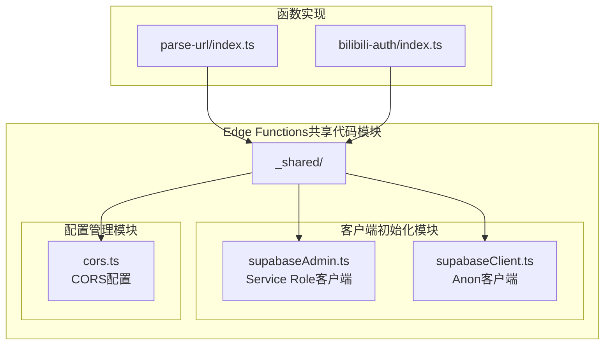
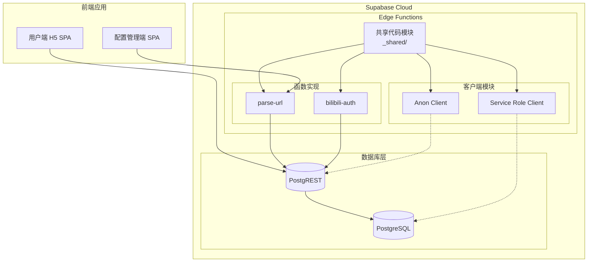
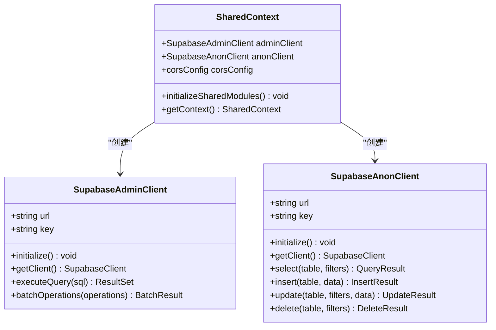
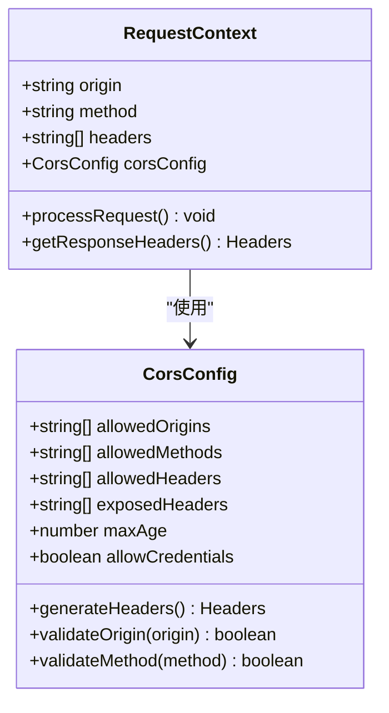
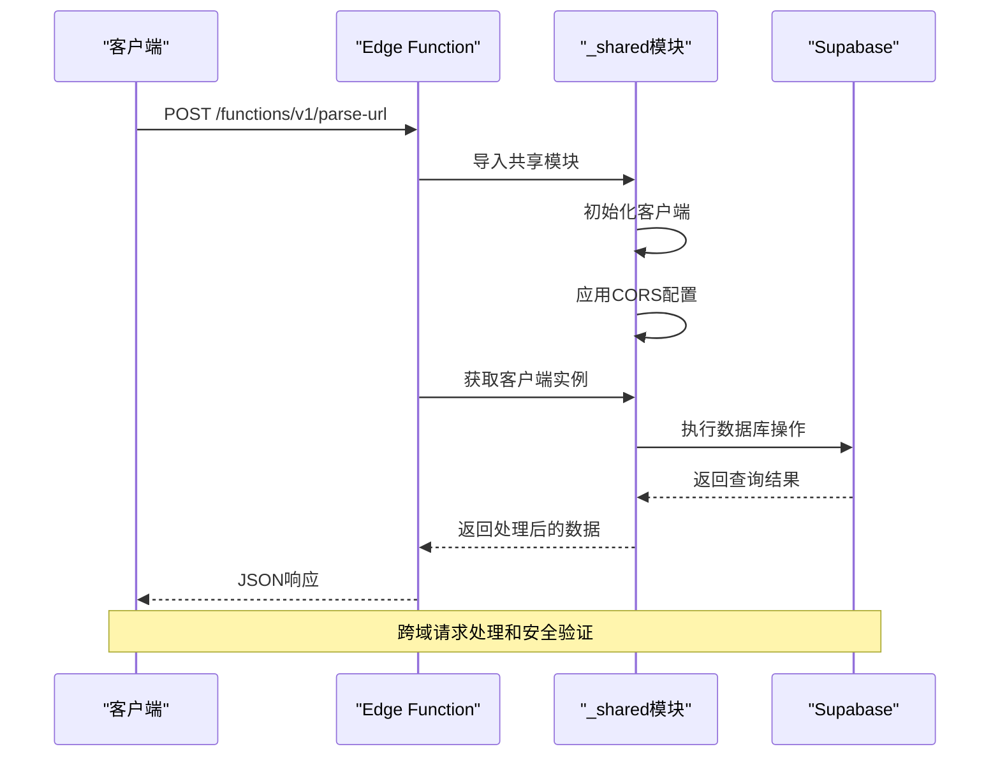

# 共享代码管理

<cite>
**本文档引用的文件**
- [PROJECT_CONTEXT.md](file://PROJECT_CONTEXT.md)
- [多平台中枢_PRD.md](file://多平台中枢_PRD.md)
</cite>

## 目录
1. [简介](#简介)
2. [项目结构](#项目结构)
3. [核心组件](#核心组件)
4. [架构概览](#架构概览)
5. [详细组件分析](#详细组件分析)
6. [依赖关系分析](#依赖关系分析)
7. [性能考虑](#性能考虑)
8. [故障排除指南](#故障排除指南)
9. [结论](#结论)

## 简介

本文档详细阐述了多平台内容中枢项目中Edge Functions共享代码模块的设计理念和实现策略。该项目采用Supabase Edge Functions的官方推荐模式，通过`_shared`目录实现代码复用，确保不同Edge Functions之间的协同工作。

项目的核心设计理念包括：
- **fat functions + _shared目录**：采用官方推荐的"胖函数"模式，将共享代码集中管理
- **代码复用最大化**：通过共享模块减少重复代码，提高维护效率
- **安全隔离**：严格区分匿名客户端和服务端客户端的使用场景
- **跨域资源共享**：统一处理CORS配置，确保API调用的安全性和兼容性

## 项目结构

基于项目上下文文件，Edge Functions共享代码模块位于`supabase/functions/_shared/`目录下，包含以下核心文件：



**图表来源**
- [PROJECT_CONTEXT.md:98-102](file://PROJECT_CONTEXT.md#L98-L102)

**章节来源**
- [PROJECT_CONTEXT.md:52-53](file://PROJECT_CONTEXT.md#L52-L53)
- [PROJECT_CONTEXT.md:98-102](file://PROJECT_CONTEXT.md#L98-L102)

## 核心组件

### 客户端初始化模块

Edge Functions共享代码模块的核心是客户端初始化，主要包含两种不同权限级别的客户端：

#### Service Role客户端 (supabaseAdmin.ts)
- **用途**：用于需要绕过Row Level Security的数据操作
- **权限级别**：最高权限，可执行所有数据库操作
- **使用场景**：Cron任务、内部数据处理、批量操作
- **安全特性**：通过Service Role Key实现，永不暴露给前端

#### Anon客户端 (supabaseClient.ts)
- **用途**：用于前端交互和公开数据访问
- **权限级别**：受RLS策略保护的匿名用户权限
- **使用场景**：用户界面数据展示、基本的CRUD操作
- **安全特性**：严格遵守RLS策略，确保数据安全

### CORS配置模块 (cors.ts)

统一的跨域资源共享配置管理：
- **CORS头设置**：标准化的CORS响应头
- **安全策略**：限制允许的来源和方法
- **预检请求处理**：正确处理OPTIONS请求
- **响应头管理**：确保跨域请求的完整性

**章节来源**
- [PROJECT_CONTEXT.md:99-102](file://PROJECT_CONTEXT.md#L99-L102)

## 架构概览



**图表来源**
- [PROJECT_CONTEXT.md:173-189](file://PROJECT_CONTEXT.md#L173-L189)

## 详细组件分析

### 客户端初始化组件分析

#### Service Role客户端设计


**图表来源**
- [PROJECT_CONTEXT.md:99-102](file://PROJECT_CONTEXT.md#L99-L102)

#### CORS配置组件设计


**图表来源**
- [PROJECT_CONTEXT.md:101](file://PROJECT_CONTEXT.md#L101)

### 函数调用流程分析



**图表来源**
- [PROJECT_CONTEXT.md:475-509](file://PROJECT_CONTEXT.md#L475-L509)

**章节来源**
- [PROJECT_CONTEXT.md:99-102](file://PROJECT_CONTEXT.md#L99-L102)
- [PROJECT_CONTEXT.md:475-509](file://PROJECT_CONTEXT.md#L475-L509)

## 依赖关系分析

### 模块依赖关系

```mermaid
graph TB
subgraph "共享代码模块"
Shared[_shared/]
subgraph "客户端模块"
AdminClient[supabaseAdmin.ts]
AnonClient[supabaseClient.ts]
end
subgraph "配置模块"
CorsConfig[cors.ts]
end
Shared --> AdminClient
Shared --> AnonClient
Shared --> CorsConfig
end
subgraph "函数实现"
ParseURL[parse-url/index.ts]
BAuth[bilibili-auth/index.ts]
end
ParseURL --> Shared
BAuth --> Shared
subgraph "外部依赖"
SupabaseJS[@supabase/supabase (Deno)]
EnvVars[环境变量]
end
AdminClient --> SupabaseJS
AnonClient --> SupabaseJS
AdminClient --> EnvVars
AnonClient --> EnvVars
```

**图表来源**
- [PROJECT_CONTEXT.md:99-102](file://PROJECT_CONTEXT.md#L99-L102)
- [PROJECT_CONTEXT.md:29-30](file://PROJECT_CONTEXT.md#L29-L30)

### 导入导出规范

#### 导入规范
- **模块命名**：使用清晰的模块名，避免冲突
- **路径规范**：使用相对路径导入，确保模块定位准确
- **类型安全**：严格定义接口和类型，确保编译时检查
- **错误处理**：统一的错误处理机制，便于调试和维护

#### 导出规范
- **接口一致性**：保持对外接口的一致性和稳定性
- **文档完善**：为每个导出提供详细的使用说明
- **版本兼容**：确保向后兼容性，避免破坏性变更
- **性能优化**：合理组织导出内容，避免不必要的代码加载

**章节来源**
- [PROJECT_CONTEXT.md:99-102](file://PROJECT_CONTEXT.md#L99-L102)

## 性能考虑

### 代码复用策略
- **模块化设计**：将功能拆分为独立的模块，提高代码复用率
- **懒加载机制**：按需加载模块，减少初始加载时间
- **缓存策略**：合理利用浏览器缓存和CDN加速
- **压缩优化**：使用Tree Shaking和代码分割技术

### 安全性能平衡
- **权限分离**：通过不同权限级别的客户端实现安全隔离
- **最小权限原则**：确保每个模块只获取必要的权限
- **请求优化**：合并相似的数据库请求，减少网络往返
- **错误隔离**：防止单点故障影响整个系统的稳定性

## 故障排除指南

### 常见问题及解决方案

#### CORS相关问题
- **问题现象**：跨域请求被阻止，浏览器控制台显示CORS错误
- **解决方案**：检查CORS配置，确保允许的来源和方法正确设置
- **预防措施**：在开发环境中使用宽松的CORS配置，在生产环境中严格限制

#### 客户端初始化失败
- **问题现象**：Edge Function无法连接到Supabase数据库
- **解决方案**：检查环境变量配置，确保URL和密钥正确
- **预防措施**：在部署前进行环境变量验证

#### 权限不足错误
- **问题现象**：数据库操作被拒绝，返回401或403错误
- **解决方案**：确认使用的客户端权限级别是否正确
- **预防措施**：根据具体需求选择合适的客户端类型

**章节来源**
- [PROJECT_CONTEXT.md:402-417](file://PROJECT_CONTEXT.md#L402-L417)

## 结论

Edge Functions共享代码模块通过`_shared`目录实现了高效的代码复用和统一的配置管理。该设计不仅提高了开发效率，还确保了系统的安全性和可维护性。

### 设计优势
- **代码复用**：通过共享模块减少重复代码，提高开发效率
- **安全隔离**：不同权限级别的客户端实现严格的权限控制
- **统一配置**：CORS配置集中管理，确保跨域请求的一致性
- **易于维护**：模块化设计便于功能扩展和bug修复

### 最佳实践建议
- **模块化开发**：继续坚持模块化设计，保持代码的高内聚低耦合
- **安全优先**：始终将安全放在首位，严格遵守权限分离原则
- **文档完善**：持续完善技术文档，确保团队协作效率
- **性能监控**：建立完善的性能监控机制，及时发现和解决问题

通过遵循这些设计原则和最佳实践，项目能够保持良好的可扩展性和可持续发展能力。