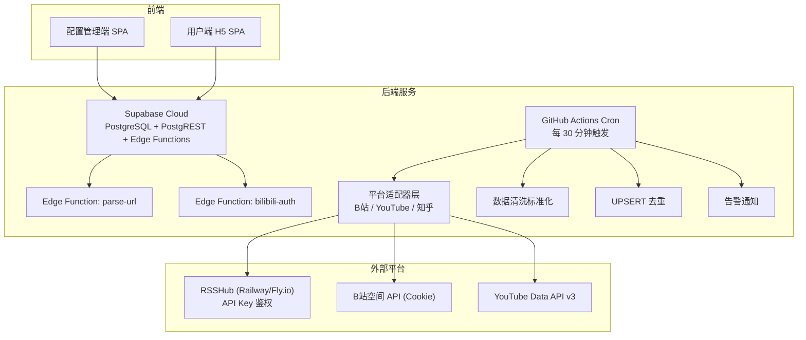
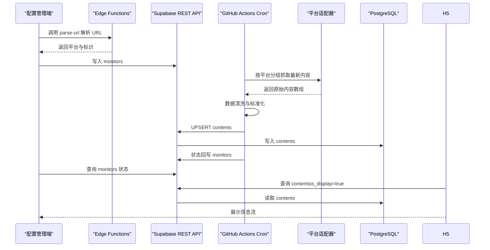
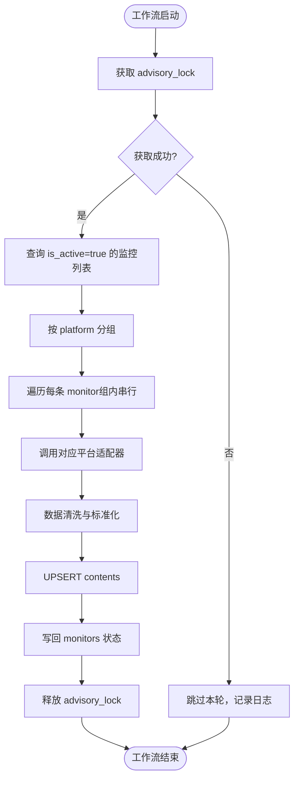
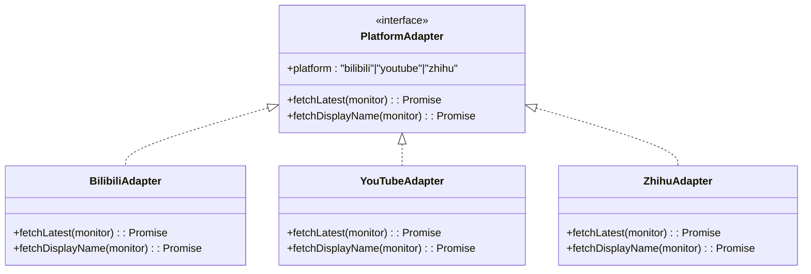
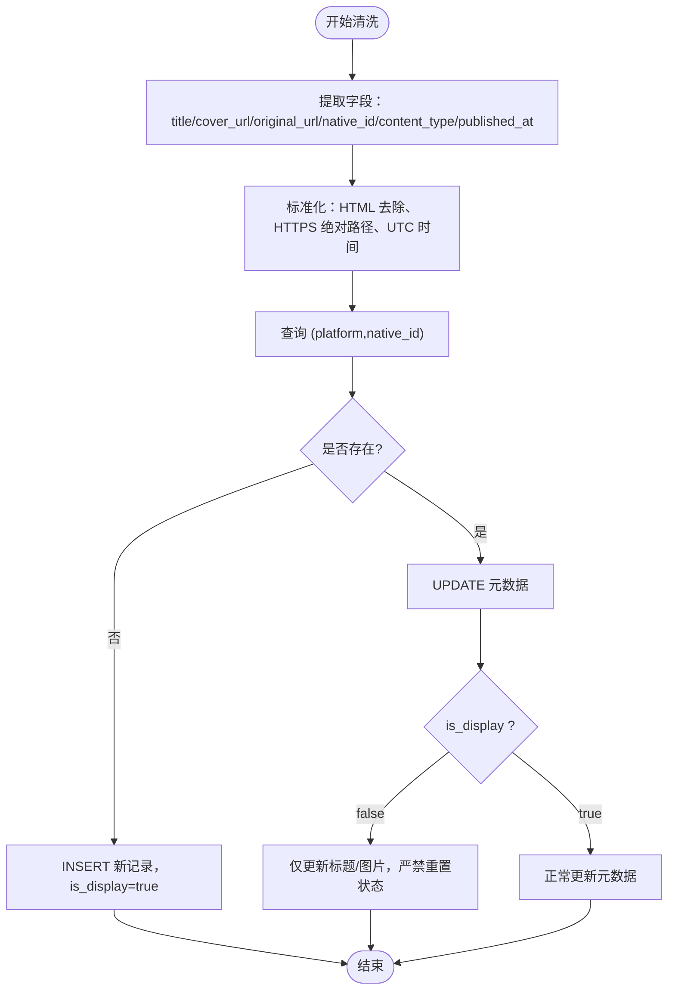
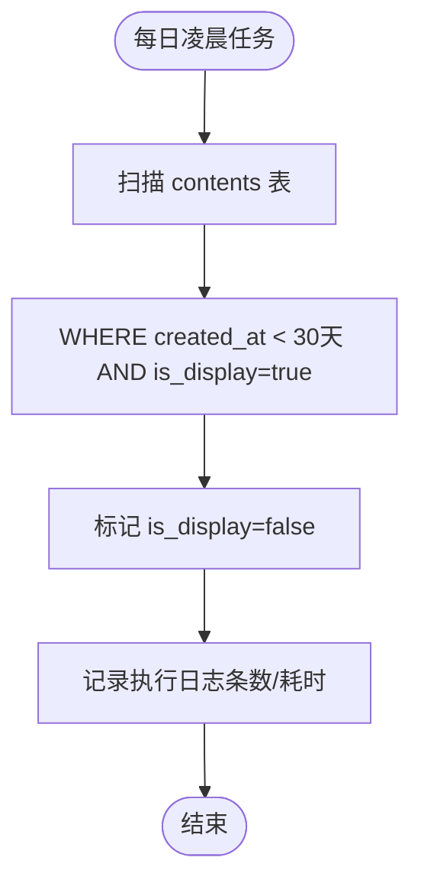
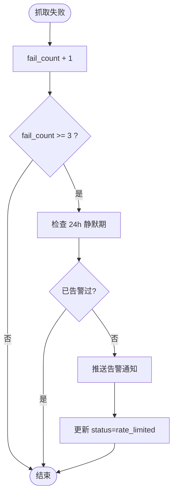
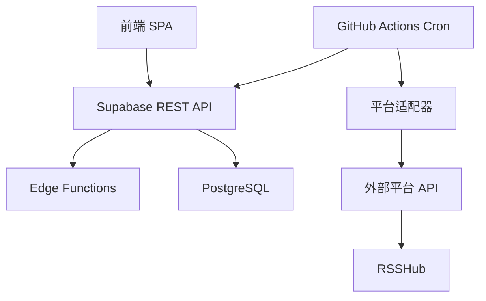

# 后端服务

<cite>
**本文引用的文件**
- [PROJECT_CONTEXT.md](file://PROJECT_CONTEXT.md)
- [多平台中枢_PRD.md](file://多平台中枢_PRD.md)
</cite>

## 目录
1. [简介](#简介)
2. [项目结构](#项目结构)
3. [核心组件](#核心组件)
4. [架构总览](#架构总览)
5. [详细组件分析](#详细组件分析)
6. [依赖分析](#依赖分析)
7. [性能考虑](#性能考虑)
8. [故障排查指南](#故障排查指南)
9. [结论](#结论)
10. [附录](#附录)

## 简介
本文件面向“多平台内容中枢”的后端服务，系统性阐述 Supabase Edge Functions 的架构设计与实现方式，涵盖 Deno 环境下的函数开发、共享代码管理与部署策略；GitHub Actions Cron 的工作流设计，包括定时任务调度、平台适配器实现与数据处理流程；以及后端自动化引擎的整体架构，包括 Cron 调度、数据清洗标准化、UPSERT 去重机制与软删除生命周期管理。文档还提供错误处理机制、告警通知与性能优化建议，并给出 API 接口规范与使用示例，帮助开发者快速理解并高效维护该系统。

## 项目结构
项目采用 Monorepo 结构，结合 Supabase 官方推荐的 Edge Functions 组织方式（fat functions + `_shared` 目录）与前端社区主流的 apps/packages 分层模式。后端服务主要由以下层次构成：
- 前端应用：配置管理端与用户端 H5（React SPA），通过 Supabase REST API 与后端交互
- 后端服务：Supabase Cloud（PostgreSQL + PostgREST + Edge Functions）
- 定时任务：GitHub Actions Cron（每 30 分钟触发 Node.js 抓取脚本）
- 平台中转：RSSHub（独立部署，提供 HTTP 接口）



图表来源
- [PROJECT_CONTEXT.md: 97-141:97-141](file://PROJECT_CONTEXT.md#L97-L141)
- [PROJECT_CONTEXT.md: 115-131:115-131](file://PROJECT_CONTEXT.md#L115-L131)
- [PROJECT_CONTEXT.md: 132-134:132-134](file://PROJECT_CONTEXT.md#L132-L134)

章节来源
- [PROJECT_CONTEXT.md: 49-141:49-141](file://PROJECT_CONTEXT.md#L49-L141)

## 核心组件
- Supabase Edge Functions（Deno + TypeScript）
  - parse-url：URL 解析与平台识别
  - bilibili-auth：B站扫码登录与 Cookie 存储
  - 共享代码：_shared 目录（cors.ts、supabaseAdmin.ts、supabaseClient.ts）
- GitHub Actions Cron（Node.js）
  - 平台适配器：B站、YouTube、知乎（RSSHub）
  - 工具函数：数据清洗、UPSERT 去重、告警通知
  - 主入口：scripts/cron/src/index.ts
- 数据库（PostgreSQL + PostgREST）
  - 表：monitors、contents、platform_configs
  - RLS 策略与唯一索引（platform, native_id）
- 前端 SPA（Vercel 静态托管）
  - 配置管理端：监控目标管理、状态面板
  - 用户端 H5：信息流展示、Deep Link 跳转

章节来源
- [PROJECT_CONTEXT.md: 97-141:97-141](file://PROJECT_CONTEXT.md#L97-L141)
- [PROJECT_CONTEXT.md: 115-131:115-131](file://PROJECT_CONTEXT.md#L115-L131)
- [PROJECT_CONTEXT.md: 169-240:169-240](file://PROJECT_CONTEXT.md#L169-L240)

## 架构总览
系统采用“配置驱动抓取”的架构，核心流程如下：
- 配置管理端通过 Edge Functions 解析 URL，生成监控目标
- GitHub Actions Cron 每 30 分钟触发抓取，平台适配器从各平台获取最新内容
- 抓取完成后进行数据清洗与标准化，通过 UPSERT 去重写入数据库
- 用户端 H5 通过 Supabase REST API 查询并展示内容
- 每日凌晨执行软删除任务，保留历史数据但隐藏过期内容



图表来源
- [PROJECT_CONTEXT.md: 169-240:169-240](file://PROJECT_CONTEXT.md#L169-L240)
- [多平台中枢_PRD.md: 654-717:654-717](file://多平台中枢_PRD.md#L654-L717)

## 详细组件分析

### Edge Functions（Deno）
- 设计原则
  - fat functions + _shared 目录：函数体积较大但功能完整，共享代码放入下划线前缀目录（不部署）
  - 函数命名使用 kebab-case，便于 URL 友好访问
- 共享代码
  - cors.ts：统一跨域头
  - supabaseAdmin.ts：Service Role 客户端（绕过 RLS）
  - supabaseClient.ts：Anon 客户端（受 RLS 保护）
- parse-url
  - 输入：{ url: string }
  - 输出：{ platform: string, native_id: string, display_name?: string }
  - 平台识别规则：bilibili、youtube、zhihu
- bilibili-auth
  - 接口：
    - POST /functions/v1/bilibili-auth
    - action: "qrcode" → 返回二维码图片 URL 与 qrcode_key
    - action: "poll" + qrcode_key → 返回扫码状态（waiting/success/expired）
  - 存储：Cookie 加密存入 platform_configs 表

```mermaid
classDiagram
class ParseUrl {
+输入 : { url }
+输出 : { platform, native_id, display_name? }
+平台识别 : bilibili/youtube/zhihu
}
class BilibiliAuth {
+接口 : POST /functions/v1/bilibili-auth
+动作 : qrcode/poll
+存储 : Cookie(加密) -> platform_configs
}
class Shared {
+cors.ts
+supabaseAdmin.ts
+supabaseClient.ts
}
ParseUrl --> Shared : "使用"
BilibiliAuth --> Shared : "使用"
```

图表来源
- [PROJECT_CONTEXT.md: 99-106:99-106](file://PROJECT_CONTEXT.md#L99-L106)
- [PROJECT_CONTEXT.md: 281-300:281-300](file://PROJECT_CONTEXT.md#L281-L300)

章节来源
- [PROJECT_CONTEXT.md: 97-106:97-106](file://PROJECT_CONTEXT.md#L97-L106)
- [PROJECT_CONTEXT.md: 281-300:281-300](file://PROJECT_CONTEXT.md#L281-L300)

### GitHub Actions Cron 工作流
- 触发策略
  - schedule: '*/30 * * * *'（每 30 分钟）
  - workflow_dispatch：支持手动触发（调试用）
- 环境变量
  - SUPABASE_URL、SUPABASE_SERVICE_ROLE_KEY、YOUTUBE_API_KEY、RSSHUB_URL、RSSHUB_API_KEY
- 步骤
  - checkout、setup-node、pnpm 安装
  - 执行 pnpm --filter cron tsx src/index.ts
- 互斥与并发安全
  - 基于 advisory_lock（pg_advisory_lock）实现 Cron 互斥锁
  - 同平台请求间隔 ≥ 1.5 秒，不同平台无限制
  - 写回前校验 monitor 是否仍存在且 is_active = true



图表来源
- [PROJECT_CONTEXT.md: 132-134:132-134](file://PROJECT_CONTEXT.md#L132-L134)
- [PROJECT_CONTEXT.md: 188-205:188-205](file://PROJECT_CONTEXT.md#L188-L205)

章节来源
- [PROJECT_CONTEXT.md: 132-134:132-134](file://PROJECT_CONTEXT.md#L132-L134)
- [PROJECT_CONTEXT.md: 188-205:188-205](file://PROJECT_CONTEXT.md#L188-L205)

### 平台适配器层
- 统一接口
  - fetchLatest(monitor: Monitor): Promise<RawContent[]>
  - fetchDisplayName(monitor: Monitor): Promise<string | null>
- 各适配器差异
  - B站：Cookie（SESSDATA）+ 空间 API，同平台 ≥1.5s 限速
  - YouTube：Data API v3，无需额外限速
  - 知乎：RSSHub HTTP 接口（API Key 鉴权），同平台 ≥1.5s 限速
- RawContent 字段
  - native_id、content_type、title、cover_url、original_url、published_at（ISO 8601 UTC）



图表来源
- [PROJECT_CONTEXT.md: 301-317:301-317](file://PROJECT_CONTEXT.md#L301-L317)
- [PROJECT_CONTEXT.md: 570-598:570-598](file://PROJECT_CONTEXT.md#L570-L598)

章节来源
- [PROJECT_CONTEXT.md: 301-317:301-317](file://PROJECT_CONTEXT.md#L301-L317)
- [PROJECT_CONTEXT.md: 570-598:570-598](file://PROJECT_CONTEXT.md#L570-L598)

### 数据清洗标准化与 UPSERT 去重
- 清洗流程
  - 标准化字段：title（去除 HTML）、cover_url（HTTPS 绝对路径）、original_url（可直接访问）、published_at（UTC）
  - content_type：video/article/question/answer/post
- UPSERT 机制
  - 唯一索引：(platform, native_id)
  - 新内容：INSERT，is_display = true
  - 已存在：UPDATE title/cover_url/original_url
  - 防复活保护：命中 is_display = false 的记录时，仅更新标题与图片，严禁重置 is_display 与 created_at
- 状态回写
  - 成功联通平台且未触发反爬拦截：fail_count 归零、status = normal、last_sync_at = now()、有新增内容时额外更新 last_content_at



图表来源
- [PROJECT_CONTEXT.md: 318-334:318-334](file://PROJECT_CONTEXT.md#L318-L334)
- [多平台中枢_PRD.md: 679-710:679-710](file://多平台中枢_PRD.md#L679-L710)

章节来源
- [PROJECT_CONTEXT.md: 318-334:318-334](file://PROJECT_CONTEXT.md#L318-L334)
- [多平台中枢_PRD.md: 679-710:679-710](file://多平台中枢_PRD.md#L679-L710)

### 软删除生命周期管理
- 保留策略：H5 信息流仅展示最近 30 天内的内容
- 软删除机制：每日凌晨扫描 contents 表，将 created_at 超过 30 天且 is_display = true 的记录标记为 is_display = false
- 前端过滤：强制添加 WHERE is_display = true 条件
- 执行记录：记录扫描条数与耗时



图表来源
- [PROJECT_CONTEXT.md: 233-239:233-239](file://PROJECT_CONTEXT.md#L233-L239)
- [多平台中枢_PRD.md: 233-240:233-240](file://多平台中枢_PRD.md#L233-L240)

章节来源
- [PROJECT_CONTEXT.md: 233-239:233-239](file://PROJECT_CONTEXT.md#L233-L239)
- [多平台中枢_PRD.md: 233-240:233-240](file://多平台中枢_PRD.md#L233-L240)

### 错误处理与告警通知
- Edge Function 错误码
  - UNKNOWN_PLATFORM、INVALID_URL、DUPLICATE_MONITOR、BILIBILI_QRCODE_EXPIRED、BILIBILI_COOKIE_INVALID、YOUTUBE_API_ERROR、RSSHUB_ERROR、INTERNAL_ERROR
- 告警逻辑
  - 连续失败 ≥3 次 → 状态变红（rate_limited）
  - 检查告警静默期（24h 内不重复告警）
  - 推送企业微信 Webhook 或通知机器人
- 异常处理边界场景
  - Cookie 失效、API 配额用尽、代理 IP 被封、微信/支付宝内环境限制等



图表来源
- [PROJECT_CONTEXT.md: 600-614:600-614](file://PROJECT_CONTEXT.md#L600-L614)
- [多平台中枢_PRD.md: 766-785:766-785](file://多平台中枢_PRD.md#L766-L785)

章节来源
- [PROJECT_CONTEXT.md: 600-614:600-614](file://PROJECT_CONTEXT.md#L600-L614)
- [多平台中枢_PRD.md: 766-785:766-785](file://多平台中枢_PRD.md#L766-L785)

### API 接口规范
- Supabase REST API
  - 路径规则：/rest/v1/{table}?select=*&...
  - 请求头：apikey、Authorization、Content-Type、Prefer
  - 响应格式：{ data, status } 或错误对象
- Edge Functions
  - 统一请求/响应格式，action 字段区分业务
  - parse-url：输入 { url }，输出 { platform, native_id, display_name? }
  - bilibili-auth：支持 qrcode 与 poll 两种 action
- Cron 脚本内部接口（平台适配器）
  - RawContent 与 PlatformAdapter 接口定义

章节来源
- [PROJECT_CONTEXT.md: 420-568:420-568](file://PROJECT_CONTEXT.md#L420-L568)
- [PROJECT_CONTEXT.md: 570-598:570-598](file://PROJECT_CONTEXT.md#L570-L598)

## 依赖分析
- 组件耦合
  - 前端 SPA 仅通过 Supabase REST API 与后端交互，不直接调用第三方平台 API
  - Cron 脚本通过 Supabase REST API 写入数据，不直连 PostgreSQL
  - Edge Functions 仅用于轻量逻辑（URL 解析、B站扫码登录）
- 外部依赖
  - Supabase：PostgreSQL、PostgREST、Edge Functions、pg_cron、pg_advisory_lock
  - GitHub Actions：定时触发与环境变量管理
  - RSSHub：知乎内容中转（API Key 鉴权）
  - 平台 API：B站空间 API（Cookie）、YouTube Data API v3



图表来源
- [PROJECT_CONTEXT.md: 169-207:169-207](file://PROJECT_CONTEXT.md#L169-L207)

章节来源
- [PROJECT_CONTEXT.md: 169-207:169-207](file://PROJECT_CONTEXT.md#L169-L207)

## 性能考虑
- 互斥与并发
  - 基于 advisory_lock 的 Cron 互斥锁，避免重复执行
  - 同平台请求间隔 ≥ 1.5s，不同平台无限制
- 数据写入
  - 使用 UPSERT（ON CONFLICT）实现去重与元数据更新，减少重复写入
  - 防复活保护避免旧数据复活，降低无效更新
- 查询优化
  - H5 信息流强制添加 is_display=true 条件，减少扫描范围
  - contents 表建立 (platform, native_id) 唯一索引，加速去重
- 网络与限速
  - 各平台适配器遵循平台限速策略，避免触发反爬
  - YouTube 专属降频：仅当距上次抓取 ≥ 4 小时才执行

[本节提供一般性指导，不直接分析具体文件]

## 故障排查指南
- Edge Function 常见问题
  - UNKNOWN_PLATFORM/INVALID_URL：检查 URL 格式与平台识别规则
  - BILIBILI_QRCODE_EXPIRED/BILIBILI_COOKIE_INVALID：检查 Cookie 有效性与存储状态
  - YOUTUBE_API_ERROR/RSSHUB_ERROR：检查 API Key 与服务可用性
- Cron 抓取异常
  - 连续失败 ≥3 次：检查告警状态与静默期设置
  - 上一轮未完成：检查 advisory_lock 获取情况
  - 平台限速：确认同平台请求间隔是否满足 ≥1.5s
- 数据一致性
  - UPSERT 命中 is_display=false 的记录：确认防复活保护生效
  - 软删除未生效：检查 pg_cron 任务执行情况与日志

章节来源
- [PROJECT_CONTEXT.md: 600-614:600-614](file://PROJECT_CONTEXT.md#L600-L614)
- [多平台中枢_PRD.md: 928-951:928-951](file://多平台中枢_PRD.md#L928-L951)

## 结论
本后端服务通过 Edge Functions 与 GitHub Actions Cron 的协同，实现了“配置驱动抓取”的轻量、可扩展架构。Deno 环境下的函数开发与共享代码管理保证了可维护性；Cron 调度、数据清洗标准化、UPSERT 去重与软删除生命周期管理共同保障了数据质量与用户体验。配合完善的错误处理与告警通知机制，系统在个人/小团队场景下具备良好的稳定性与可运维性。

[本节为总结性内容，不直接分析具体文件]

## 附录
- 环境变量清单
  - SUPABASE_URL、SUPABASE_ANON_KEY、SUPABASE_SERVICE_ROLE_KEY、YOUTUBE_API_KEY、BILIBILI_COOKIE_*、RSSHUB_URL、RSSHUB_API_KEY、WECOM_WEBHOOK_URL
- 命名规范
  - Edge Function：kebab-case；数据库表/字段：snake_case；TypeScript 文件：kebab-case；类型/接口：PascalCase；常量：UPPER_SNAKE
- 共享类型同步策略
  - packages/shared 作为前后端类型的唯一数据源；Edge Functions 通过手动同步副本维护类型一致性

章节来源
- [PROJECT_CONTEXT.md: 34-46:34-46](file://PROJECT_CONTEXT.md#L34-L46)
- [PROJECT_CONTEXT.md: 159-166:159-166](file://PROJECT_CONTEXT.md#L159-L166)