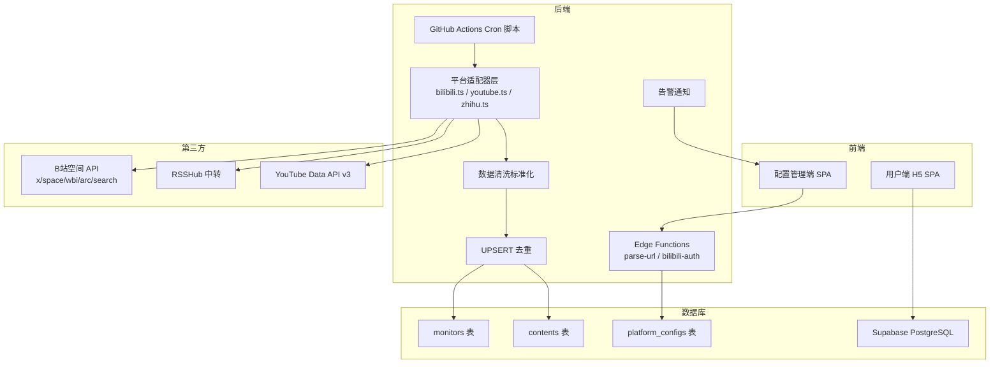
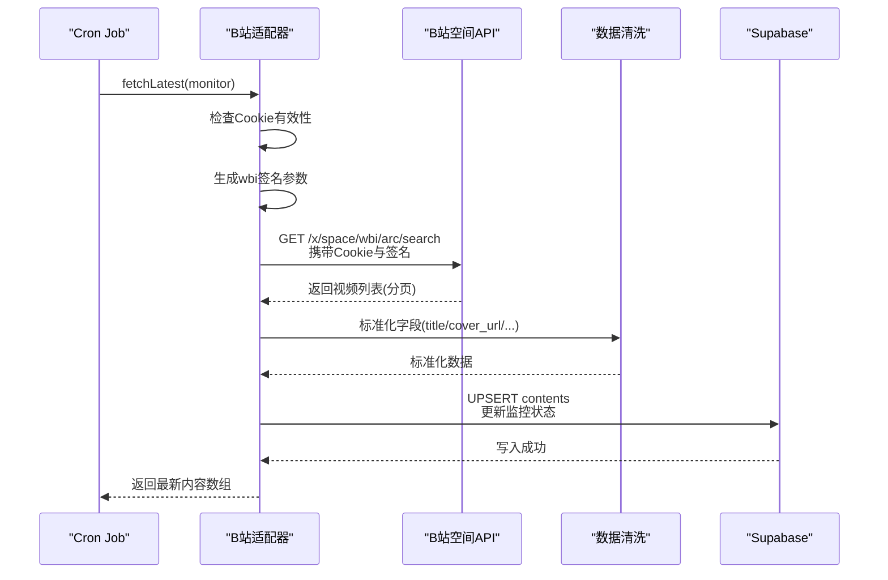
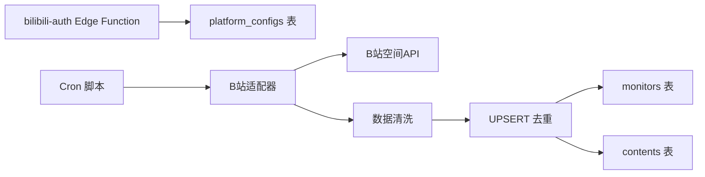

# B站适配器

<cite>
**本文档引用的文件**
- [PROJECT_CONTEXT.md](file://PROJECT_CONTEXT.md)
- [多平台中枢_PRD.md](file://多平台中枢_PRD.md)
</cite>

## 目录
1. [简介](#简介)
2. [项目结构](#项目结构)
3. [核心组件](#核心组件)
4. [架构总览](#架构总览)
5. [详细组件分析](#详细组件分析)
6. [依赖分析](#依赖分析)
7. [性能考虑](#性能考虑)
8. [故障排查指南](#故障排查指南)
9. [结论](#结论)
10. [附录](#附录)

## 简介
本文件为“多平台内容中枢”项目中的B站适配器技术文档，聚焦于基于B站空间API的实现原理与工程实践。文档涵盖：
- wbi签名算法与Cookie认证机制
- API调用流程：从获取用户基本信息到查询最新内容的完整过程
- 限速策略：同平台请求间隔≥1.5秒的防反爬措施
- 数据抓取实现：从空间API获取视频列表、处理分页、提取关键信息字段
- 错误处理机制：Cookie失效检测、API限流应对与网络异常恢复策略
- 具体的代码示例与调试技巧

## 项目结构
B站适配器属于“后端自动化引擎”的一部分，位于定时抓取脚本中，负责调用B站空间API并进行数据清洗与去重写入。

图表来源
- [PROJECT_CONTEXT.md: 194-207:194-207](file://PROJECT_CONTEXT.md#L194-L207)
- [PROJECT_CONTEXT.md: 115-131:115-131](file://PROJECT_CONTEXT.md#L115-L131)
- [PROJECT_CONTEXT.md: 105-106:105-106](file://PROJECT_CONTEXT.md#L105-L106)

章节来源
- [PROJECT_CONTEXT.md: 105-131:105-131](file://PROJECT_CONTEXT.md#L105-L131)
- [PROJECT_CONTEXT.md: 194-207:194-207](file://PROJECT_CONTEXT.md#L194-L207)

## 核心组件
- 平台适配器接口：统一的fetchLatest与fetchDisplayName方法，便于扩展其他平台。
- B站适配器：基于Cookie鉴权的空间API调用，实现wbi签名与限速控制。
- 数据清洗与去重：将原始数据标准化为统一模型，执行UPSERT去重。
- 错误处理与状态机：基于fail_count的状态流转，支持Cookie过期与限流告警。

章节来源
- [PROJECT_CONTEXT.md: 301-317:301-317](file://PROJECT_CONTEXT.md#L301-L317)
- [PROJECT_CONTEXT.md: 570-598:570-598](file://PROJECT_CONTEXT.md#L570-L598)

## 架构总览
B站适配器在Cron Job中被调用，按平台分组串行遍历监控目标，同平台请求间隔≥1.5秒，保证不触发反爬频率限制。抓取到的数据进入清洗与去重流程，最终写入数据库并回写监控状态。

图表来源
- [PROJECT_CONTEXT.md: 180-198:180-198](file://PROJECT_CONTEXT.md#L180-L198)
- [PROJECT_CONTEXT.md: 312-316:312-316](file://PROJECT_CONTEXT.md#L312-L316)

章节来源
- [PROJECT_CONTEXT.md: 180-198:180-198](file://PROJECT_CONTEXT.md#L180-L198)
- [PROJECT_CONTEXT.md: 312-316:312-316](file://PROJECT_CONTEXT.md#L312-L316)

## 详细组件分析

### B站适配器接口与实现要点
- 平台标识：bilibili
- 数据源：B站空间API（x/space/wbi/arc/search）
- 鉴权方式：Cookie（SESSDATA），通过Supabase加密存储
- 限速策略：同平台请求间隔≥1.5秒

章节来源
- [PROJECT_CONTEXT.md: 307-316:307-316](file://PROJECT_CONTEXT.md#L307-L316)
- [PROJECT_CONTEXT.md: 570-598:570-598](file://PROJECT_CONTEXT.md#L570-L598)

### Cookie认证机制
- 存储：B站Cookie加密存入platform_configs表，使用Supabase Vault。
- 获取：Edge Function bilibili-auth提供二维码登录与轮询接口，成功后返回Cookie。
- 使用：Cron脚本读取加密Cookie，解密后在请求头中携带。
- 失效检测：适配器收到401/403时，fail_count+1，状态流转为cookie_expired。

章节来源
- [PROJECT_CONTEXT.md: 42-43:42-43](file://PROJECT_CONTEXT.md#L42-L43)
- [PROJECT_CONTEXT.md: 292-299:292-299](file://PROJECT_CONTEXT.md#L292-L299)
- [PROJECT_CONTEXT.md: 609-610:609-610](file://PROJECT_CONTEXT.md#L609-L610)
- [多平台中枢_PRD.md: 734-744:734-744](file://多平台中枢_PRD.md#L734-L744)

### wbi签名算法
- 数据源：空间API的查询参数（如tid、pn、ps等）。
- 签名流程：对参数进行排序、拼接、计算哈希，得到wbi值。
- 参数注入：将wbi与rkey作为查询参数附加到请求URL。
- 作用：降低反爬检测强度，提高请求成功率。

章节来源
- [PROJECT_CONTEXT.md: 313-313:313-313](file://PROJECT_CONTEXT.md#L313-L313)

### API调用流程（从用户信息到最新内容）
- 获取用户基本信息：解析URL提取mid，调用空间API获取用户昵称与统计信息。
- 查询最新内容：调用/x/space/wbi/arc/search，传入mid、wbi签名、分页参数。
- 处理分页：按pn=1,2,...顺序请求，直到达到阈值或无更多数据。
- 提取关键字段：native_id、content_type、title、cover_url、original_url、published_at。

章节来源
- [PROJECT_CONTEXT.md: 287-291:287-291](file://PROJECT_CONTEXT.md#L287-L291)
- [PROJECT_CONTEXT.md: 313-313:313-313](file://PROJECT_CONTEXT.md#L313-L313)
- [PROJECT_CONTEXT.md: 570-598:570-598](file://PROJECT_CONTEXT.md#L570-L598)

### 限速策略与防反爬
- 同平台请求间隔≥1.5秒：在适配器内部实现sleep，避免密集请求触发平台频率限制。
- Cron互斥锁：确保同一时刻只有一个Cron实例在运行，避免并发冲突。
- 失败计数与状态机：fail_count≥3时进入rate_limited并触发告警。

章节来源
- [PROJECT_CONTEXT.md: 220-220:220-220](file://PROJECT_CONTEXT.md#L220-L220)
- [多平台中枢_PRD.md: 194-194:194-194](file://多平台中枢_PRD.md#L194-L194)
- [多平台中枢_PRD.md: 723-764:723-764](file://多平台中枢_PRD.md#L723-L764)

### 数据抓取与清洗
- 抓取范围：每次取前6条内容，穿透置顶内容，降低被封禁风险。
- 字段标准化：统一title、cover_url、original_url、content_type、published_at。
- 去重策略：基于(platform, native_id)唯一索引的UPSERT，防止旧数据复活。
- 软删除：超过30天的内容is_display=false，前端仅展示is_display=true。

章节来源
- [多平台中枢_PRD.md: 195-195:195-195](file://多平台中枢_PRD.md#L195-L195)
- [多平台中枢_PRD.md: 224-231:224-231](file://多平台中枢_PRD.md#L224-L231)
- [多平台中枢_PRD.md: 324-333:324-333](file://多平台中枢_PRD.md#L324-L333)

### 错误处理与恢复策略
- Cookie失效：401/403 → fail_count+1 → cookie_expired → 告警条件检查。
- 网络异常：指数退避重试（最多2次），超时或限流时记录日志。
- 平台限流：适配器内部sleep≥1.5秒，必要时跳过该轮次。
- 数据库异常：记录错误日志，跳过本轮，等待下次Cron重试。

章节来源
- [多平台中枢_PRD.md: 928-951:928-951](file://多平台中枢_PRD.md#L928-L951)
- [多平台中枢_PRD.md: 721-785:721-785](file://多平台中枢_PRD.md#L721-L785)

## 依赖分析
- 外部依赖：B站空间API、Supabase REST API、Edge Functions。
- 内部依赖：适配器依赖清洗模块与数据库写入逻辑；Cron依赖互斥锁与状态回写。

图表来源
- [PROJECT_CONTEXT.md: 105-106:105-106](file://PROJECT_CONTEXT.md#L105-L106)
- [PROJECT_CONTEXT.md: 115-131:115-131](file://PROJECT_CONTEXT.md#L115-L131)

章节来源
- [PROJECT_CONTEXT.md: 105-106:105-106](file://PROJECT_CONTEXT.md#L105-L106)
- [PROJECT_CONTEXT.md: 115-131:115-131](file://PROJECT_CONTEXT.md#L115-L131)

## 性能考虑
- 请求频率控制：同平台请求间隔≥1.5秒，避免触发平台频率限制。
- 分页策略：每次仅取前6条，减少请求量与解析成本。
- 去重与软删除：基于唯一索引的UPSERT与30天软删除，降低存储与查询压力。
- 并发安全：Cron互斥锁与写回前校验，避免竞态与重复写入。

## 故障排查指南
- Cookie失效
  - 现象：适配器返回401/403，fail_count增加。
  - 处理：通过bilibili-auth Edge Function重新扫码登录，更新加密Cookie。
  - 验证：重新触发Cron，观察状态机回到normal。
  
  章节来源
  - [PROJECT_CONTEXT.md: 609-610:609-610](file://PROJECT_CONTEXT.md#L609-L610)
  - [PROJECT_CONTEXT.md: 292-299:292-299](file://PROJECT_CONTEXT.md#L292-L299)
  - [多平台中枢_PRD.md: 734-744:734-744](file://多平台中枢_PRD.md#L734-L744)

- API限流
  - 现象：请求超时或返回限流错误。
  - 处理：等待≥1.5秒后重试；必要时跳过该轮次，等待下次Cron。
  - 验证：检查Cron日志与监控状态。
  
  章节来源
  - [PROJECT_CONTEXT.md: 220-220:220-220](file://PROJECT_CONTEXT.md#L220-L220)
  - [多平台中枢_PRD.md: 740-744:740-744](file://多平台中枢_PRD.md#L740-L744)

- 网络异常
  - 现象：DNS解析失败、连接超时、TLS握手错误。
  - 处理：指数退避重试（最多2次），记录日志并等待下次Cron。
  - 验证：检查网络连通性与代理设置。
  
  章节来源
  - [多平台中枢_PRD.md: 928-951:928-951](file://多平台中枢_PRD.md#L928-L951)

- 数据库异常
  - 现象：写入失败、连接中断。
  - 处理：记录错误日志，跳过本轮；等待数据库恢复后自动重试。
  - 验证：检查Supabase状态与连接池。
  
  章节来源
  - [多平台中枢_PRD.md: 928-951:928-951](file://多平台中枢_PRD.md#L928-L951)

## 结论
B站适配器通过Cookie鉴权与wbi签名算法，结合严格的限速策略与完善的错误处理机制，实现了稳定可靠的增量抓取。配合数据清洗与UPSERT去重，确保信息流的准确性与时效性。建议在实际部署中持续监控Cookie有效期与平台反爬策略变化，及时调整适配器参数与防护措施。

## 附录
- 调试技巧
  - 使用Edge Function bilibili-auth重新扫码登录，验证Cookie有效性。
  - 在本地模拟Cron流程，逐步打印关键参数（mid、wbi、pn、ps）。
  - 通过Supabase日志与Cron日志定位失败原因（网络/鉴权/限流）。
  - 使用抓包工具（如mitmproxy）观察请求头与响应状态码，辅助定位问题。
  
  章节来源
  - [PROJECT_CONTEXT.md: 292-299:292-299](file://PROJECT_CONTEXT.md#L292-L299)
  - [多平台中枢_PRD.md: 721-785:721-785](file://多平台中枢_PRD.md#L721-L785)