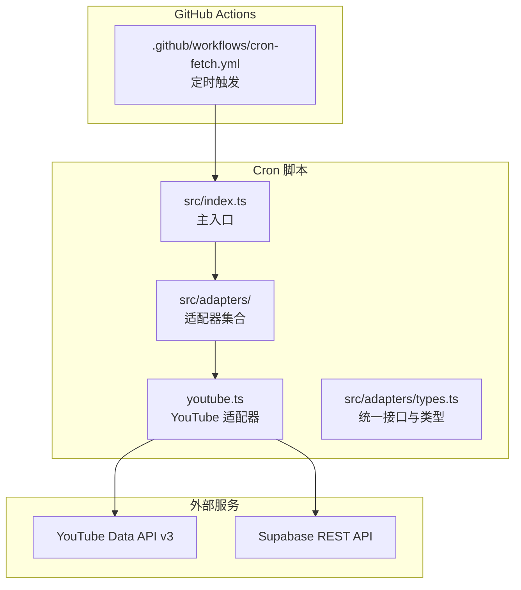
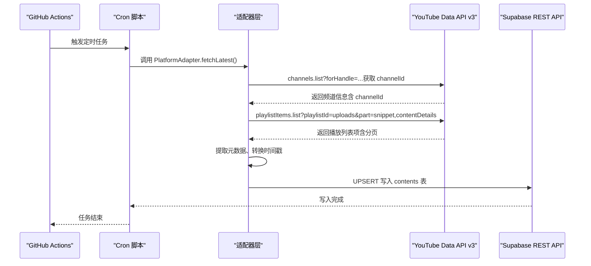
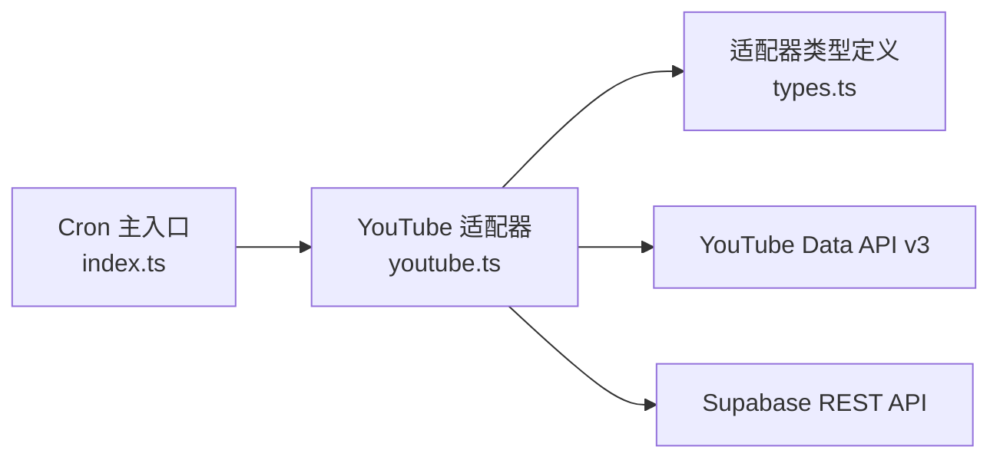

# YouTube适配器

<cite>
**本文引用的文件**
- [PROJECT_CONTEXT.md](file://PROJECT_CONTEXT.md)
- [cron-fetch.yml](file://.github/workflows/cron-fetch.yml)
- [types.ts](file://scripts/cron/src/adapters/types.ts)
</cite>

## 目录
1. [简介](#简介)
2. [项目结构](#项目结构)
3. [核心组件](#核心组件)
4. [架构总览](#架构总览)
5. [详细组件分析](#详细组件分析)
6. [依赖关系分析](#依赖关系分析)
7. [性能考量](#性能考量)
8. [故障排查指南](#故障排查指南)
9. [结论](#结论)
10. [附录](#附录)

## 简介
本文件面向“多平台内容中枢”项目中的YouTube适配器，围绕基于YouTube Data API v3的实现进行系统化技术说明。重点覆盖以下方面：
- API Key认证与频道ID获取流程
- 上传播放列表（uploads playlist）的查询机制：如何通过频道句柄转换为频道ID，以及如何获取最新视频内容
- API调用实现细节：播放列表项查询、分页处理、元数据提取与时间戳转换
- YouTube API的限速策略与配额管理：API Key使用限制与错误码处理
- 最佳实践：请求构造、响应解析与异常处理

## 项目结构
YouTube适配器属于“后端自动化引擎”的一部分，位于Cron脚本的适配器层，负责调用YouTube Data API v3抓取指定博主的最新内容，并将结果标准化后写入Supabase。

图示来源
- [PROJECT_CONTEXT.md: 115-131:115-131](file://PROJECT_CONTEXT.md#L115-L131)
- [.github/workflows/cron-fetch.yml: 617-643:617-643](file://.github/workflows/cron-fetch.yml#L617-L643)

章节来源
- [PROJECT_CONTEXT.md: 115-131:115-131](file://PROJECT_CONTEXT.md#L115-L131)
- [.github/workflows/cron-fetch.yml: 617-643:617-643](file://.github/workflows/cron-fetch.yml#L617-L643)

## 核心组件
- 平台适配器接口与类型定义：统一的适配器接口与原始内容结构，确保不同平台的实现遵循一致的数据契约。
- YouTube适配器：负责将YouTube频道句柄转换为频道ID，查询上传播放列表，分页拉取最新视频，提取元数据并转换时间戳。
- GitHub Actions工作流：定时触发Cron脚本，注入环境变量（含YouTube API Key），并执行抓取与写入流程。

章节来源
- [PROJECT_CONTEXT.md: 570-598:570-598](file://PROJECT_CONTEXT.md#L570-L598)
- [PROJECT_CONTEXT.md: 301-317:301-317](file://PROJECT_CONTEXT.md#L301-L317)
- [.github/workflows/cron-fetch.yml: 617-643:617-643](file://.github/workflows/cron-fetch.yml#L617-L643)

## 架构总览
YouTube适配器在整体架构中的职责与数据流如下：

图示来源
- [PROJECT_CONTEXT.md: 287-290:287-290](file://PROJECT_CONTEXT.md#L287-L290)
- [PROJECT_CONTEXT.md: 301-317:301-317](file://PROJECT_CONTEXT.md#L301-L317)
- [PROJECT_CONTEXT.md: 318-333:318-333](file://PROJECT_CONTEXT.md#L318-L333)

## 详细组件分析

### YouTube适配器：接口与职责
- 平台标识：'youtube'
- 核心方法：
  - fetchLatest(monitor): 获取博主最新内容
  - fetchDisplayName(monitor): 获取博主昵称（添加时同步调用）
- 输入输出：
  - 输入：Monitor（包含平台、native_id、display_name等）
  - 输出：RawContent[]（包含native_id、content_type、title、cover_url、original_url、published_at）

章节来源
- [PROJECT_CONTEXT.md: 587-597:587-597](file://PROJECT_CONTEXT.md#L587-L597)
- [PROJECT_CONTEXT.md: 577-585:577-585](file://PROJECT_CONTEXT.md#L577-L585)

### 频道ID获取与句柄转换
- URL解析阶段：当URL包含youtube.com且为@handle形式时，会调用channels.list?forHandle=...以转换为channelId。
- 适配器侧复用：在fetchLatest中，若monitor.native_id为句柄，则先转换为channelId，再继续后续查询。

章节来源
- [PROJECT_CONTEXT.md: 287-290:287-290](file://PROJECT_CONTEXT.md#L287-L290)

### 上传播放列表查询机制
- 数据源：YouTube Data API v3
- 查询路径：
  - channels.list?forHandle=...（若输入为句柄）
  - playlistItems.list?playlistId=uploads&part=snippet,contentDetails
- 分页处理：对playlistItems.list进行分页迭代，直到达到最大条数或不再有下一页。
- 元数据提取：从snippet与contentDetails中抽取标题、封面、原始链接、发布时间等字段。
- 时间戳转换：将ISO 8601字符串转换为UTC时间戳，统一存储格式。

章节来源
- [PROJECT_CONTEXT.md: 301-317:301-317](file://PROJECT_CONTEXT.md#L301-L317)
- [PROJECT_CONTEXT.md: 577-585:577-585](file://PROJECT_CONTEXT.md#L577-L585)

### API调用实现细节
- 请求构造：
  - 使用API Key进行鉴权（YOUTUBE_API_KEY）
  - channels.list：传入forHandle或id参数
  - playlistItems.list：传入playlistId=uploads，设置part=snippet,contentDetails
- 响应解析：
  - channels.list：解析返回的items数组，提取channelId
  - playlistItems.list：解析items数组，提取videoId、title、thumbnails、publishedAt等
- 异常处理：
  - 对于API调用失败，抛出YOUTUBE_API_ERROR错误码
  - 对于分页异常或数据缺失，进行容错与日志记录

章节来源
- [PROJECT_CONTEXT.md: 600-613:600-613](file://PROJECT_CONTEXT.md#L600-L613)
- [PROJECT_CONTEXT.md: 41-41:41-41](file://PROJECT_CONTEXT.md#L41-L41)

### 限速策略与配额管理
- 适配器层限速：YouTube适配器无需额外限速（同平台≥1.5s的限制适用于B站）
- 配额与错误码：
  - 使用YOUTUBE_API_KEY进行调用
  - 若API调用失败，返回YOUTUBE_API_ERROR（502）
  - 需要结合YouTube Data API v3的配额限制与错误码进行容错处理

章节来源
- [PROJECT_CONTEXT.md: 314-316:314-316](file://PROJECT_CONTEXT.md#L314-L316)
- [PROJECT_CONTEXT.md: 600-613:600-613](file://PROJECT_CONTEXT.md#L600-L613)
- [PROJECT_CONTEXT.md: 41-41:41-41](file://PROJECT_CONTEXT.md#L41-L41)

### 代码实现示例（路径指引）
以下为关键实现的路径指引，便于定位具体代码位置：
- 适配器接口与类型定义：[types.ts](file://scripts/cron/src/adapters/types.ts)
- YouTube适配器入口与实现：[youtube.ts](file://scripts/cron/src/adapters/youtube.ts)
- Cron主入口与调度：[index.ts](file://scripts/cron/src/index.ts)
- GitHub Actions工作流：[cron-fetch.yml](file://.github/workflows/cron-fetch.yml)

章节来源
- [PROJECT_CONTEXT.md: 115-131:115-131](file://PROJECT_CONTEXT.md#L115-L131)
- [PROJECT_CONTEXT.md: 570-598:570-598](file://PROJECT_CONTEXT.md#L570-L598)
- [.github/workflows/cron-fetch.yml: 617-643:617-643](file://.github/workflows/cron-fetch.yml#L617-L643)

## 依赖关系分析
YouTube适配器与外部服务及内部模块的依赖关系如下：

图示来源
- [PROJECT_CONTEXT.md: 570-598:570-598](file://PROJECT_CONTEXT.md#L570-L598)
- [PROJECT_CONTEXT.md: 115-131:115-131](file://PROJECT_CONTEXT.md#L115-L131)

章节来源
- [PROJECT_CONTEXT.md: 570-598:570-598](file://PROJECT_CONTEXT.md#L570-L598)
- [PROJECT_CONTEXT.md: 115-131:115-131](file://PROJECT_CONTEXT.md#L115-L131)

## 性能考量
- 分页与批量处理：playlistItems.list建议合理设置每页大小与最大拉取数量，避免一次性请求过多导致超时或配额压力。
- 缓存与去重：利用Supabase的UPSERT机制，避免重复写入；对已抓取的native_id进行幂等处理。
- 错误重试：对临时性错误（如网络抖动、API限流）进行指数退避重试，提升稳定性。
- 监控与告警：在适配器层增加关键指标埋点（请求数、耗时、错误率），结合告警通知机制及时发现异常。

## 故障排查指南
- 常见错误码
  - YOUTUBE_API_ERROR（502）：表示YouTube API调用失败，需检查API Key有效性、配额使用情况与网络连通性。
- 排查步骤
  - 确认YOUTUBE_API_KEY已正确注入到GitHub Actions工作流环境中。
  - 检查channels.list与playlistItems.list的请求参数是否正确（forHandle/id、playlistId、part等）。
  - 观察分页是否完整，是否存在部分数据缺失。
  - 核对时间戳转换逻辑，确保published_at符合ISO 8601 UTC格式。
- 日志与监控
  - 在适配器中增加关键节点的日志输出，便于定位问题。
  - 结合Supabase与GitHub Actions的日志，进行端到端追踪。

章节来源
- [PROJECT_CONTEXT.md: 600-613:600-613](file://PROJECT_CONTEXT.md#L600-L613)

## 结论
YouTube适配器通过统一的适配器接口与类型定义，实现了对YouTube Data API v3的稳定集成。其核心流程包括：句柄到频道ID的转换、上传播放列表的分页查询、元数据提取与时间戳转换，并通过Supabase完成去重写入。在限速与配额方面，YouTube适配器无需额外限速，但需关注API Key的有效性与错误码处理。建议在生产环境中完善监控与告警，确保抓取任务的高可用与可观测性。

## 附录
- 环境变量
  - YOUTUBE_API_KEY：用于YouTube Data API v3鉴权
- GitHub Actions工作流
  - 定时触发Cron脚本，注入YOUTUBE_API_KEY并执行抓取任务

章节来源
- [PROJECT_CONTEXT.md: 41-41:41-41](file://PROJECT_CONTEXT.md#L41-L41)
- [.github/workflows/cron-fetch.yml: 617-643:617-643](file://.github/workflows/cron-fetch.yml#L617-L643)