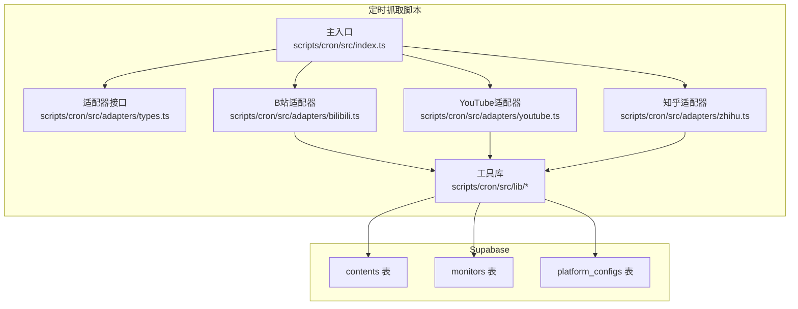
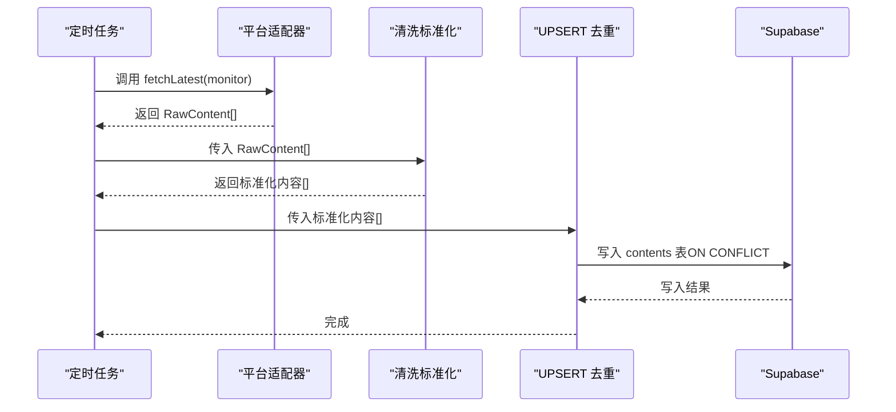
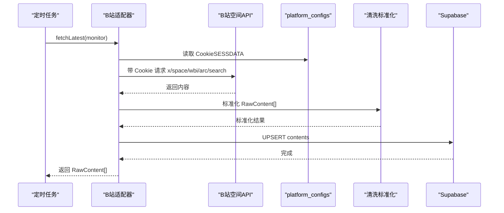
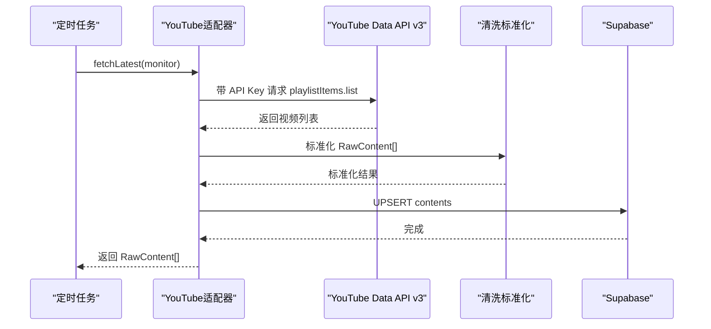
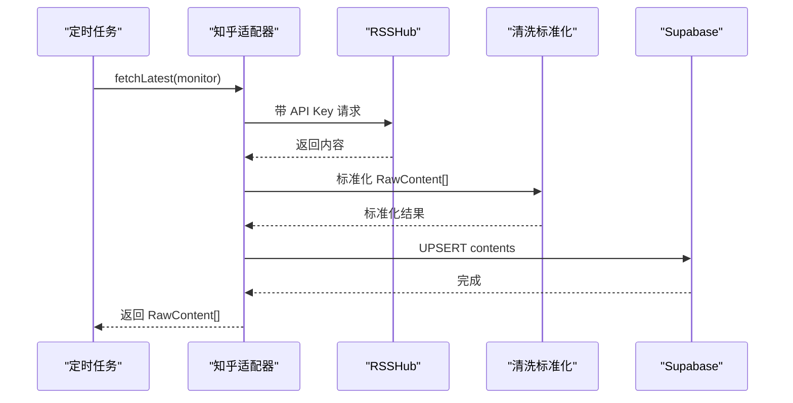
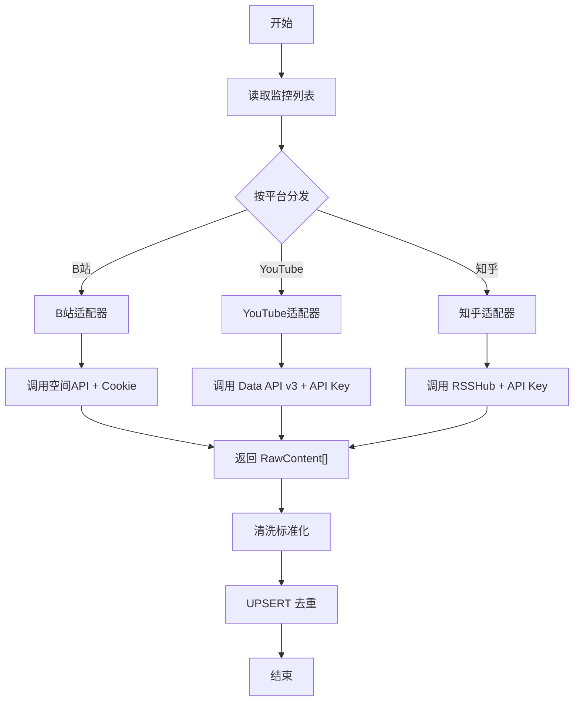
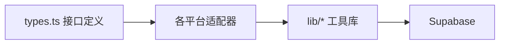

# 平台适配器

<cite>
**本文引用的文件**
- [PROJECT_CONTEXT.md](file://PROJECT_CONTEXT.md)
</cite>

## 目录
1. [简介](#简介)
2. [项目结构](#项目结构)
3. [核心组件](#核心组件)
4. [架构总览](#架构总览)
5. [组件详解](#组件详解)
6. [依赖关系分析](#依赖关系分析)
7. [性能考量](#性能考量)
8. [故障排查指南](#故障排查指南)
9. [结论](#结论)
10. [附录](#附录)

## 简介
本文件面向“多平台内容中枢”的平台适配器系统，系统性阐述适配器架构设计、统一接口规范、各平台适配器实现要点、数据抓取流程、限速策略、错误处理与重试机制、原始内容标准化处理逻辑，并提供新平台适配器的开发指南与扩展点说明。目标是帮助开发者快速理解并高效扩展新的平台适配器。

## 项目结构
- 适配器层位于定时抓取脚本中，按平台拆分为独立模块，统一通过适配器接口进行调用。
- 适配器返回原始内容后，进入清洗标准化与去重写入流程，最终写入 Supabase。

图示来源
- [PROJECT_CONTEXT.md](file://PROJECT_CONTEXT.md)

章节来源
- [PROJECT_CONTEXT.md](file://PROJECT_CONTEXT.md)

## 核心组件
- 平台适配器接口（PlatformAdapter）
  - 统一方法：fetchLatest(monitor) 返回 RawContent[]
  - 可选方法：fetchDisplayName(monitor) 获取昵称
  - 平台标识：'bilibili' | 'youtube' | 'zhihu'
- 原始内容（RawContent）
  - 字段：native_id、content_type、title、cover_url、original_url、published_at（ISO 8601 UTC）
- 工具库
  - 数据清洗标准化（cleaner.ts）
  - UPSERT 去重（upsert.ts）
  - Supabase 客户端封装（supabase.ts）
  - 告警通知（alert.ts）

章节来源
- [PROJECT_CONTEXT.md](file://PROJECT_CONTEXT.md)

## 架构总览
适配器层负责从各平台拉取最新内容，统一转换为 RawContent，再由工具库完成清洗与去重，最后写入 Supabase。整体流程如下：

图示来源
- [PROJECT_CONTEXT.md](file://PROJECT_CONTEXT.md)

## 组件详解

### 平台适配器接口与实现要求
- 接口职责
  - 提供统一的 fetchLatest(monitor) 方法，返回 RawContent[]
  - 可选提供 fetchDisplayName(monitor)，用于首次添加时同步获取昵称
- 平台标识
  - 严格限定为 'bilibili' | 'youtube' | 'zhihu'
- 输入输出
  - 输入：monitor（包含平台标识、native_id、鉴权信息等）
  - 输出：RawContent[]（字段需满足统一规范）

章节来源
- [PROJECT_CONTEXT.md](file://PROJECT_CONTEXT.md)

### B站适配器（基于空间API与Cookie认证）
- 数据源
  - 空间 API：x/space/wbi/arc/search
- 鉴权
  - 使用 Cookie（SESSDATA）进行认证
  - Cookie 存储于 platform_configs 表，由 Edge Function bilibili-auth 管理
- 限速
  - 同平台 ≥1.5 秒
- 典型流程
  - 读取 monitor 中的 native_id 与 Cookie
  - 调用空间 API 获取最近内容
  - 将返回内容映射为 RawContent
  - 标准化字段（标题、封面、发布时间等）
  - 去重写入

图示来源
- [PROJECT_CONTEXT.md](file://PROJECT_CONTEXT.md)

章节来源
- [PROJECT_CONTEXT.md](file://PROJECT_CONTEXT.md)

### YouTube 适配器（基于 Data API v3）
- 数据源
  - playlistItems.list（上传播放列表 uploads playlist）
- 鉴权
  - 使用 API Key
- 限速
  - 无需额外限速（遵循平台速率限制）
- 典型流程
  - 读取 monitor 中的 native_id（通常为 channelId）
  - 调用 Data API v3 获取上传视频
  - 映射为 RawContent
  - 标准化与去重写入

图示来源
- [PROJECT_CONTEXT.md](file://PROJECT_CONTEXT.md)

章节来源
- [PROJECT_CONTEXT.md](file://PROJECT_CONTEXT.md)

### 知乎适配器（基于 RSSHub 中转）
- 数据源
  - RSSHub HTTP 接口
- 鉴权
  - 使用 API Key
- 限速
  - 同平台 ≥1.5 秒
- 典型流程
  - 读取 monitor 中的 native_id（知乎用户 ID 或专栏 ID）
  - 调用 RSSHub 接口获取最新内容
  - 映射为 RawContent
  - 标准化与去重写入

图示来源
- [PROJECT_CONTEXT.md](file://PROJECT_CONTEXT.md)

章节来源
- [PROJECT_CONTEXT.md](file://PROJECT_CONTEXT.md)

### 数据抓取流程与限速策略
- 流程
  - 读取 monitors 列表
  - 按平台调度对应适配器
  - 适配器返回 RawContent[]
  - 清洗标准化（字段映射、数据清洗、格式统一）
  - UPSERT 去重（基于 (platform, native_id) 唯一索引）
- 限速
  - B站：同平台 ≥1.5 秒
  - 知乎：同平台 ≥1.5 秒
  - YouTube：遵循平台速率限制

图示来源
- [PROJECT_CONTEXT.md](file://PROJECT_CONTEXT.md)

章节来源
- [PROJECT_CONTEXT.md](file://PROJECT_CONTEXT.md)

### 错误处理与重试机制
- 错误码规范（Edge Function 与抓取脚本）
  - UNKNOWN_PLATFORM、INVALID_URL、DUPLICATE_MONITOR
  - BILIBILI_QRCODE_EXPIRED、BILIBILI_COOKIE_INVALID
  - YOUTUBE_API_ERROR、RSSHUB_ERROR
  - INTERNAL_ERROR
- 建议的重试策略
  - 对第三方 API 调用失败（如网络抖动、临时限流）进行指数退避重试
  - 对鉴权失败（Cookie 过期、API Key 无效）进行一次性降级处理并上报
  - 对数据库写入失败（UPSERT）进行幂等重试，避免重复写入

章节来源
- [PROJECT_CONTEXT.md](file://PROJECT_CONTEXT.md)

### 原始内容标准化处理逻辑
- 字段映射
  - 将各平台返回字段映射到 RawContent 统一结构
- 数据清洗
  - 去除多余空白、HTML 标签、异常字符
  - 规范时间格式为 ISO 8601 UTC
  - 规范封面 URL 与原文链接
- 格式统一
  - content_type 归一化为 'video' | 'article' | 'question' | 'answer' | 'post'
  - native_id 与 platform 组成唯一键

章节来源
- [PROJECT_CONTEXT.md](file://PROJECT_CONTEXT.md)

### 新平台适配器开发指南与扩展点
- 开发步骤
  - 在 scripts/cron/src/adapters 下新增适配器文件（如 newplatform.ts）
  - 实现 PlatformAdapter 接口：platform、fetchLatest、fetchDisplayName
  - 在主入口中注册新适配器并加入调度逻辑
  - 编写适配器单元测试，覆盖正常与异常路径
- 扩展点
  - 鉴权：支持 Cookie、API Key、OAuth 等多种鉴权方式
  - 限速：在适配器内实现平台特定的限速策略
  - 清洗：针对新平台字段差异完善清洗逻辑
  - 告警：对关键错误接入告警通知

章节来源
- [PROJECT_CONTEXT.md](file://PROJECT_CONTEXT.md)

## 依赖关系分析
- 组件耦合
  - 适配器与工具库松耦合：通过 RawContent 与标准化接口解耦
  - 适配器与数据库通过工具库封装的 Upsert 接口交互
- 外部依赖
  - B站：空间 API + Cookie
  - YouTube：Data API v3 + API Key
  - 知乎：RSSHub + API Key
- 循环依赖
  - 无直接循环依赖；适配器 → 工具库 → 数据库

图示来源
- [PROJECT_CONTEXT.md](file://PROJECT_CONTEXT.md)

章节来源
- [PROJECT_CONTEXT.md](file://PROJECT_CONTEXT.md)

## 性能考量
- 并发与限速
  - 同平台限速（B站、知乎）避免触发平台风控
  - 适配器内部可按 monitor 维度做并发控制
- I/O 优化
  - 批量写入（UPSERT）减少往返次数
  - 缓存热点数据（如昵称、频道信息）降低重复请求
- 超时与重试
  - 为第三方 API 设置合理超时与重试上限
  - 对数据库写入采用幂等策略，避免重复写入

## 故障排查指南
- 常见问题定位
  - 适配器返回空数组：检查 monitor 配置、鉴权信息与平台 API 变更
  - 字段缺失或格式异常：检查清洗标准化逻辑
  - 去重失败：确认 (platform, native_id) 是否正确生成
- 错误码对照
  - UNKNOWN_PLATFORM、INVALID_URL、DUPLICATE_MONITOR
  - BILIBILI_QRCODE_EXPIRED、BILIBILI_COOKIE_INVALID
  - YOUTUBE_API_ERROR、RSSHUB_ERROR
  - INTERNAL_ERROR
- 建议排查步骤
  - 查看抓取日志与告警
  - 单独运行适配器 fetchLatest 验证返回
  - 使用 Supabase 控制台检查 contents 表写入情况

章节来源
- [PROJECT_CONTEXT.md](file://PROJECT_CONTEXT.md)

## 结论
平台适配器系统以统一接口为核心，结合清洗标准化与 UPSERT 去重，实现了跨平台内容采集的一致性与可靠性。通过严格的限速策略与完善的错误处理机制，系统在保证合规的同时提升了稳定性。新平台接入成本低、扩展性强，便于持续演进。

## 附录
- 数据库写入语义（UPSERT）
  - 基于 (platform, native_id) 唯一索引
  - 使用 ON CONFLICT ... DO UPDATE WHERE 防止软删除记录复活
- 请求头与响应格式
  - 使用 Prefer: resolution=merge-duplicates 实现 UPSERT
  - 统一 JSON 响应结构（success/data/error）

章节来源
- [PROJECT_CONTEXT.md](file://PROJECT_CONTEXT.md)