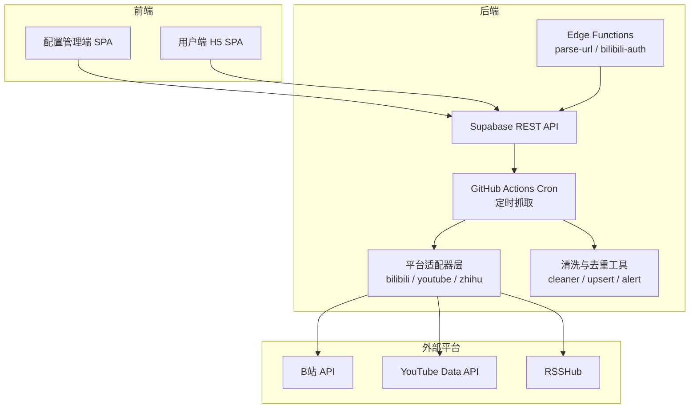
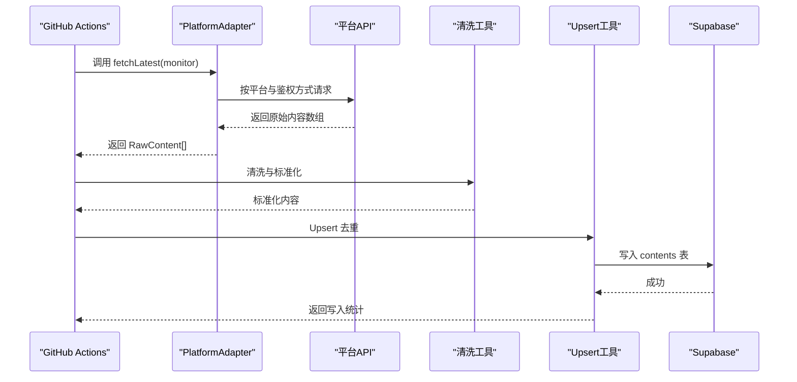
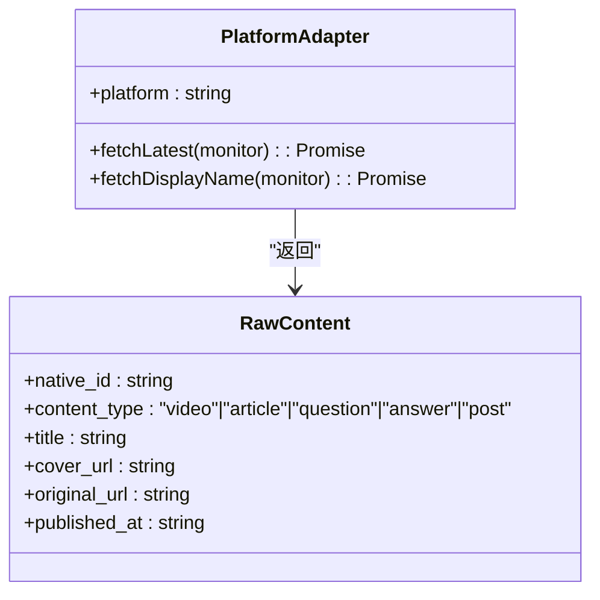
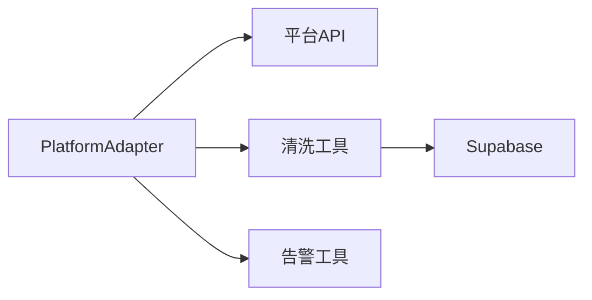

# 新平台适配器开发指南

<cite>
**本文引用的文件**
- [PROJECT_CONTEXT.md](file://PROJECT_CONTEXT.md)
- [多平台中枢_PRD.md](file://多平台中枢_PRD.md)
</cite>

## 目录
1. [简介](#简介)
2. [项目结构](#项目结构)
3. [核心组件](#核心组件)
4. [架构总览](#架构总览)
5. [详细组件分析](#详细组件分析)
6. [依赖分析](#依赖分析)
7. [性能考量](#性能考量)
8. [故障排查指南](#故障排查指南)
9. [结论](#结论)
10. [附录](#附录)

## 简介
本指南面向希望为“多平台内容中枢”新增平台适配器的开发者，围绕 PlatformAdapter 接口的设计与实现，给出从需求分析、API 调研、接口设计、代码实现到测试验证的全流程方法论。文档同时总结了认证方式选择、数据抓取策略、数据标准化、错误处理、日志与告警、性能与安全等关键技术点，并提供开发模板与最佳实践，帮助你快速、高质量地完成新平台适配器的开发与上线。

## 项目结构
- 项目采用 Monorepo 结构，前端应用（admin/h5）、共享类型包（packages/shared）、Supabase 边缘函数（supabase/functions/_shared）、定时抓取脚本（scripts/cron）等分层清晰。
- 平台适配器位于定时抓取脚本目录中，统一实现 PlatformAdapter 接口，负责各平台内容抓取、昵称获取与标准化输出。

图表来源
- [PROJECT_CONTEXT.md: 50-142:50-142](file://PROJECT_CONTEXT.md#L50-L142)
- [PROJECT_CONTEXT.md: 115-131:115-131](file://PROJECT_CONTEXT.md#L115-L131)

章节来源
- [PROJECT_CONTEXT.md: 50-142:50-142](file://PROJECT_CONTEXT.md#L50-L142)

## 核心组件
- 平台适配器接口（PlatformAdapter）
  - 职责：为指定平台提供“获取博主最新内容”和“获取昵称”的统一能力。
  - 关键方法：
    - fetchLatest(monitor): Promise<RawContent[]> —— 抓取最新内容
    - fetchDisplayName(monitor): Promise<string | null> —— 获取昵称（添加时同步调用）
  - 关键属性：
    - platform: 'bilibili' | 'youtube' | 'zhihu'
- RawContent 标准化模型
  - 字段：native_id、content_type、title、cover_url、original_url、published_at（ISO 8601 UTC）
  - 作用：统一各平台原始数据结构，便于清洗、去重与写入数据库

章节来源
- [PROJECT_CONTEXT.md: 570-598:570-598](file://PROJECT_CONTEXT.md#L570-L598)

## 架构总览
- 数据流（抓取侧）：GitHub Actions Cron 触发 → 适配器抓取 → 清洗标准化 → Upsert 去重 → 写入 Supabase → H5 读取
- 认证与鉴权：
  - B站：Cookie（SESSDATA）鉴权，需定期维护
  - YouTube：API Key 鉴权
  - 知乎：RSSHub 中转，API Key 鉴权
- 限速与互斥：
  - 同平台请求间隔 ≥ 1.5 秒
  - Cron 互斥锁（基于数据库咨询锁）保证单实例运行
- 安全与合规：
  - Service Role Key 仅用于服务端，前端仅使用 Anon Key
  - 敏感信息（Cookie、API Key）通过环境变量或加密存储管理

图表来源
- [PROJECT_CONTEXT.md: 570-598:570-598](file://PROJECT_CONTEXT.md#L570-L598)
- [PROJECT_CONTEXT.md: 180-206:180-206](file://PROJECT_CONTEXT.md#L180-L206)

章节来源
- [PROJECT_CONTEXT.md: 180-206:180-206](file://PROJECT_CONTEXT.md#L180-L206)

## 详细组件分析

### PlatformAdapter 接口与实现要点
- 接口定义与职责
  - platform：平台标识，用于统一调度与日志
  - fetchLatest：抓取最新内容，返回 RawContent[]
  - fetchDisplayName：获取昵称，用于添加时同步补充
- 实现注意事项
  - 鉴权方式：依据平台特性选择 Cookie、API Key 或中转服务
  - 限速策略：同平台请求间隔 ≥ 1.5 秒，避免触发平台风控
  - 错误处理：区分网络异常、鉴权失败、配额限制、平台变更等，分别记录与上报
  - 数据标准化：严格遵守 RawContent 字段与时间格式要求
  - 幂等与去重：依赖上游 Upsert 去重，适配器应保证幂等输出

图表来源
- [PROJECT_CONTEXT.md: 570-598:570-598](file://PROJECT_CONTEXT.md#L570-L598)

章节来源
- [PROJECT_CONTEXT.md: 570-598:570-598](file://PROJECT_CONTEXT.md#L570-L598)

### 开发流程与步骤
- 需求分析
  - 明确平台特性：是否需要 Cookie、是否支持公开主页、是否需要中转服务
  - 评估 API 限制：配额、速率限制、鉴权方式
- API 调研
  - 确认可用接口与参数，梳理鉴权流程与失败场景
  - 设计抓取策略：首页/时间线/上传列表等
- 接口设计
  - 严格遵循 PlatformAdapter 接口与 RawContent 标准
  - 设计错误码与状态机，确保可观测性
- 代码实现
  - 实现 fetchLatest 与 fetchDisplayName
  - 统一日志与错误包装，便于定位问题
- 测试验证
  - 单元测试：模拟平台响应、鉴权失败、限速等边界场景
  - 集成测试：连接 Supabase，验证清洗、去重与写入流程
- 上线与监控
  - 配置环境变量与密钥，开启 Cron 并观察日志
  - 设置告警与健康检查，持续跟踪成功率与失败原因

章节来源
- [PROJECT_CONTEXT.md: 570-598:570-598](file://PROJECT_CONTEXT.md#L570-L598)
- [PROJECT_CONTEXT.md: 615-644:615-644](file://PROJECT_CONTEXT.md#L615-L644)

### 关键技术点

#### API 认证方式选择
- B站：Cookie（SESSDATA）鉴权，需定期维护与轮换
- YouTube：API Key 鉴权，注意配额与限额
- 知乎：RSSHub 中转，需配置 API Key 与鉴权策略

章节来源
- [PROJECT_CONTEXT.md: 312-316:312-316](file://PROJECT_CONTEXT.md#L312-L316)

#### 数据抓取策略制定
- 增量抓取：每次抓取前 N 条，穿透置顶内容，降低被封风险
- 平台差异：
  - B站：空间 API，需携带 Cookie
  - YouTube：上传播放列表（uploads playlist），按时间倒序
  - 知乎：RSSHub 中转，按博主主页/专栏最新内容

章节来源
- [PROJECT_CONTEXT.md: 194-196:194-196](file://PROJECT_CONTEXT.md#L194-L196)
- [PROJECT_CONTEXT.md: 312-316:312-316](file://PROJECT_CONTEXT.md#L312-L316)

#### 数据标准化处理
- 字段映射：title、cover_url、original_url、native_id、content_type、published_at
- 时间格式：统一为 ISO 8601 UTC
- 图片 URL：统一为 HTTPS 绝对路径
- 内容类型：video/article/question/answer/post

章节来源
- [PROJECT_CONTEXT.md: 577-585:577-585](file://PROJECT_CONTEXT.md#L577-L585)

#### 错误处理机制
- 失败计数与状态机：normal → cookie_expired → rate_limited
- 告警策略：连续失败达到阈值触发告警，设置静默期
- 降级策略：昵称获取失败时使用默认格式，后续 Cron 补充

章节来源
- [PROJECT_CONTEXT.md: 721-786:721-786](file://PROJECT_CONTEXT.md#L721-L786)
- [PROJECT_CONTEXT.md: 151-156:151-156](file://PROJECT_CONTEXT.md#L151-L156)

### 开发模板与最佳实践

#### 代码组织结构
- 文件命名：平台名小写（如 bilibili.ts、youtube.ts、zhihu.ts）
- 目录：scripts/cron/src/adapters/
- 类型：统一使用 packages/shared 中的 Monitor 类型，或在适配器内声明本地类型并与共享类型保持一致

章节来源
- [PROJECT_CONTEXT.md: 118-122:118-122](file://PROJECT_CONTEXT.md#L118-L122)
- [PROJECT_CONTEXT.md: 159-166:159-166](file://PROJECT_CONTEXT.md#L159-L166)

#### 日志记录
- 记录关键事件：请求开始/结束、鉴权状态、抓取条数、Upsert 结果、错误码
- 区分级别：info（成功）、warn（鉴权即将过期/配额紧张）、error（网络异常/鉴权失败/平台变更）

章节来源
- [PROJECT_CONTEXT.md: 721-786:721-786](file://PROJECT_CONTEXT.md#L721-L786)

#### 性能优化
- 同平台限速：请求间隔 ≥ 1.5 秒
- Cron 互斥：避免并发冲突
- 增量抓取：减少请求量与解析成本

章节来源
- [PROJECT_CONTEXT.md: 220](file://PROJECT_CONTEXT.md#L220)
- [PROJECT_CONTEXT.md: 194](file://PROJECT_CONTEXT.md#L194)

#### 安全性考虑
- Service Role Key 仅用于服务端，前端仅使用 Anon Key
- 敏感信息（Cookie、API Key）通过环境变量或加密存储管理
- RSSHub 必须启用 API Key 鉴权

章节来源
- [PROJECT_CONTEXT.md: 410-417:410-417](file://PROJECT_CONTEXT.md#L410-L417)
- [PROJECT_CONTEXT.md: 217](file://PROJECT_CONTEXT.md#L217)

### 单元测试与集成测试

#### 单元测试
- 模拟数据：构造不同平台的响应（成功/失败/鉴权过期/配额用尽）
- 测试用例设计：
  - 正常路径：返回 RawContent[]，字段完整
  - 异常路径：抛出或返回错误码，状态机正确流转
  - 限速与幂等：多次调用不重复写入
- 覆盖率要求：核心逻辑（鉴权、抓取、清洗、去重）覆盖率 ≥ 80%

章节来源
- [PROJECT_CONTEXT.md: 721-786:721-786](file://PROJECT_CONTEXT.md#L721-L786)

#### 集成测试
- 连接 Supabase：验证 Upsert 去重、软删除、状态回写
- 端到端验证：从添加监控到 H5 展示，确保信息流正确更新
- 告警与日志：确认告警触发与日志记录符合预期

章节来源
- [PROJECT_CONTEXT.md: 318-334:318-334](file://PROJECT_CONTEXT.md#L318-L334)
- [PROJECT_CONTEXT.md: 721-786:721-786](file://PROJECT_CONTEXT.md#L721-L786)

### 开发示例与常见问题

#### 开发示例（概念性流程）
- 以新增抖音适配器为例：
  - 需求：支持公开主页增量抓取，需代理 IP
  - API：短链重定向后解析 sec_uid，抓取首页前 N 条
  - 鉴权：无需登录，需稳定代理 IP
  - 限速：同平台请求间隔 ≥ 1.5 秒
  - 标准化：映射字段，统一时间格式
  - 去重：依赖 Upsert，幂等写入
  - 告警：连续失败触发告警，静默期控制

章节来源
- [PROJECT_CONTEXT.md: 139-147:139-147](file://PROJECT_CONTEXT.md#L139-L147)
- [PROJECT_CONTEXT.md: 194-196:194-196](file://PROJECT_CONTEXT.md#L194-L196)

#### 常见问题与解决方案
- Cookie 失效：状态流转为 cookie_expired，需重新授权或更换 Cookie
- 配额用尽：YouTube API 配额不足时跳过本轮，等待 4 小时窗口
- 反爬触发：知乎验证码或风控，降级使用 RSSHub 或切换代理
- 平台变更：接口变更导致失败，及时更新适配器并记录变更日志
- 数据不一致：检查 Upsert 条件与软删除策略，确保旧数据不复活

章节来源
- [PROJECT_CONTEXT.md: 928-951:928-951](file://PROJECT_CONTEXT.md#L928-L951)

## 依赖分析
- 组件耦合
  - 适配器与平台 API：强耦合（鉴权、接口、限速）
  - 适配器与清洗工具：弱耦合（通过 RawContent 标准化）
  - 适配器与 Supabase：弱耦合（通过 Upsert 工具）
- 外部依赖
  - B站 Cookie、YouTube API Key、RSSHub API Key
  - GitHub Actions Secret、Supabase 环境变量

图表来源
- [PROJECT_CONTEXT.md: 570-598:570-598](file://PROJECT_CONTEXT.md#L570-L598)
- [PROJECT_CONTEXT.md: 118-128:118-128](file://PROJECT_CONTEXT.md#L118-L128)

章节来源
- [PROJECT_CONTEXT.md: 570-598:570-598](file://PROJECT_CONTEXT.md#L570-L598)
- [PROJECT_CONTEXT.md: 118-128:118-128](file://PROJECT_CONTEXT.md#L118-L128)

## 性能考量
- 同平台限速：避免触发平台风控
- 增量抓取：减少请求量与解析成本
- Cron 互斥：避免并发冲突
- Upsert 去重：减少重复写入与索引冲突
- 缓存与降级：在鉴权失败或配额紧张时使用降级策略

章节来源
- [PROJECT_CONTEXT.md: 194-196:194-196](file://PROJECT_CONTEXT.md#L194-L196)
- [PROJECT_CONTEXT.md: 318-334:318-334](file://PROJECT_CONTEXT.md#L318-L334)

## 故障排查指南
- 常见错误码与处理
  - UNKNOWN_PLATFORM：URL 无法识别，检查 URL 特征与解析规则
  - INVALID_URL：URL 格式不合法，前端校验增强
  - DUPLICATE_MONITOR：重复添加，去重校验生效
  - BILIBILI_QRCODE_EXPIRED / BILIBILI_COOKIE_INVALID：B站 Cookie 失效，重新授权
  - YOUTUBE_API_ERROR / RSSHUB_ERROR：平台接口异常，检查鉴权与配额
  - INTERNAL_ERROR：内部异常，查看日志与堆栈
- 状态机与告警
  - normal → cookie_expired → rate_limited，确认失败计数与告警静默期
- 数据一致性
  - 检查 Upsert 条件与软删除策略，确保旧数据不复活

章节来源
- [PROJECT_CONTEXT.md: 600-614:600-614](file://PROJECT_CONTEXT.md#L600-L614)
- [PROJECT_CONTEXT.md: 721-786:721-786](file://PROJECT_CONTEXT.md#L721-L786)
- [PROJECT_CONTEXT.md: 318-334:318-334](file://PROJECT_CONTEXT.md#L318-L334)

## 结论
通过遵循 PlatformAdapter 接口与统一的数据标准化模型，结合严格的鉴权、限速、错误处理与告警机制，你可以高效地为新平台开发适配器。建议在开发过程中始终以“最小可行实现”起步，逐步完善错误处理、日志与监控，并通过单元与集成测试保障质量。上线后持续观察成功率与失败原因，及时调整策略与阈值，确保系统长期稳定运行。

## 附录
- 监控目标与关键指标
  - 内容覆盖完整度：已开启监控的博主，新内容在 1 小时内出现在 H5 信息流的比例 ≥ 95%
  - 用户触达效率：点击卡片后成功跳转到原生 App 的比例 ≥ 80%
  - 系统稳定性：单月因 Cookie 失效或抓取异常导致的信息流断更次数 ≤ 2 次
  - 数据效率：数据库平均单条记录大小 ≈ 1 KB（上限 3 KB）

章节来源
- [多平台中枢_PRD.md: 51-59:51-59](file://多平台中枢_PRD.md#L51-L59)