# 知乎适配器

<cite>
**本文档引用的文件**
- [PROJECT_CONTEXT.md](file://PROJECT_CONTEXT.md)
- [多平台中枢_PRD.md](file://多平台中枢_PRD.md)
</cite>

## 目录
1. [简介](#简介)
2. [项目结构](#项目结构)
3. [核心组件](#核心组件)
4. [架构概览](#架构概览)
5. [详细组件分析](#详细组件分析)
6. [依赖关系分析](#依赖关系分析)
7. [性能考虑](#性能考虑)
8. [故障排除指南](#故障排除指南)
9. [结论](#结论)

## 简介

知乎适配器是多平台内容中枢系统中的重要组成部分，负责通过RSSHub中转服务抓取知乎平台的内容。该适配器采用"基于RSSHub中转"的实现策略，有效规避了知乎平台严格的反爬虫机制和API访问限制。

在当前的架构设计中，知乎适配器作为平台适配器层的一部分，与其他平台适配器（B站、YouTube）共同构成了统一的内容抓取体系。所有平台的API调用都通过GitHub Actions定时任务执行，前端应用仅通过Supabase REST API进行数据交互。

## 项目结构

基于项目上下文文件，知乎适配器位于以下目录结构中：

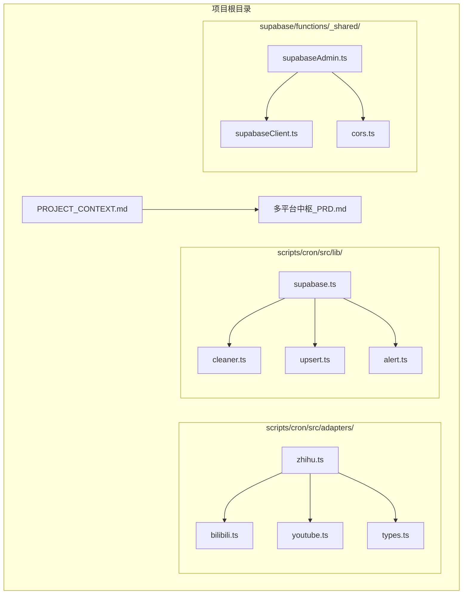

**图表来源**
- [PROJECT_CONTEXT.md:56-141](file://PROJECT_CONTEXT.md#L56-L141)

**章节来源**
- [PROJECT_CONTEXT.md:56-141](file://PROJECT_CONTEXT.md#L56-L141)

## 核心组件

### 平台适配器接口

知乎适配器实现了统一的平台适配器接口，该接口定义了所有平台适配器必须实现的标准方法：

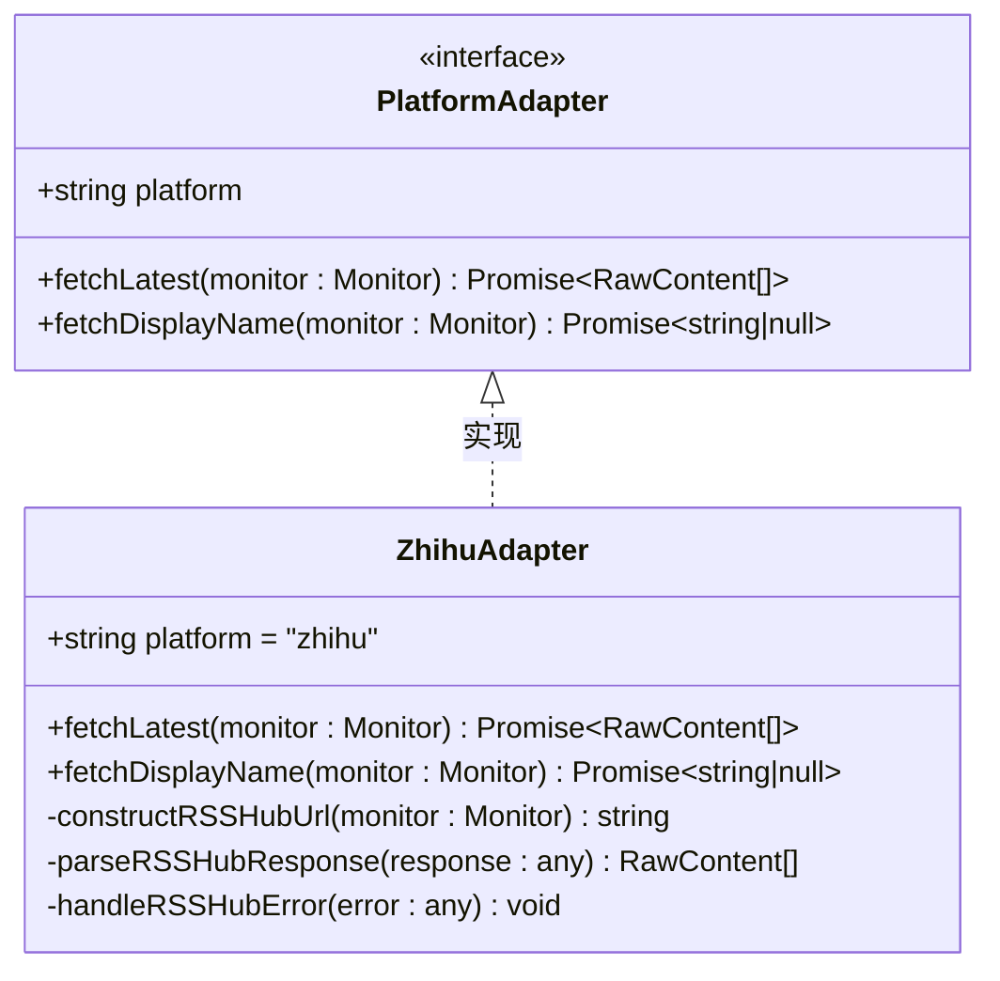

**图表来源**
- [PROJECT_CONTEXT.md:587-597](file://PROJECT_CONTEXT.md#L587-L597)

### 数据模型定义

适配器返回的原始内容数据结构经过标准化处理，确保与其他平台的一致性：

| 字段名 | 类型 | 描述 | 示例值 |
|--------|------|------|--------|
| `native_id` | string | 平台内原生内容ID | "20260620123456789" |
| `content_type` | enum | 内容类型(video/article/question/answer/post) | "article" |
| `title` | string | 内容标题 | "如何提高工作效率" |
| `cover_url` | string | 封面图链接 | "https://..." |
| `original_url` | string | 原文链接 | "https://www.zhihu.com/..." |
| `published_at` | string | 发布时间(ISO 8601 UTC) | "2026-06-20T10:00:00Z" |

**章节来源**
- [PROJECT_CONTEXT.md:577-585](file://PROJECT_CONTEXT.md#L577-L585)

## 架构概览

### 整体架构设计

```mermaid
graph TB
subgraph "前端应用层"
A[配置管理端 SPA] --> B[用户端 H5 SPA]
end
subgraph "后端服务层"
C[Supabase REST API] --> D[Edge Functions]
D --> E[Cron 调度器]
end
subgraph "平台适配器层"
F[B站适配器] --> G[Youtube适配器]
H[Zhihu适配器] --> I[RSSHub中转]
J[抖音适配器]
end
subgraph "外部平台"
K[Zhihu平台] --> I
L[Youtube平台] --> G
M[B站平台] --> F
N[Douyin平台] --> J
end
subgraph "数据存储层"
O[PostgreSQL数据库]
P[Redis缓存(可选)]
end
A --> C
B --> C
E --> F
E --> G
E --> H
E --> J
F --> K
G --> L
H --> I
J --> N
C --> O
E --> O
```

**图表来源**
- [PROJECT_CONTEXT.md:173-206](file://PROJECT_CONTEXT.md#L173-L206)

### RSSHub集成架构

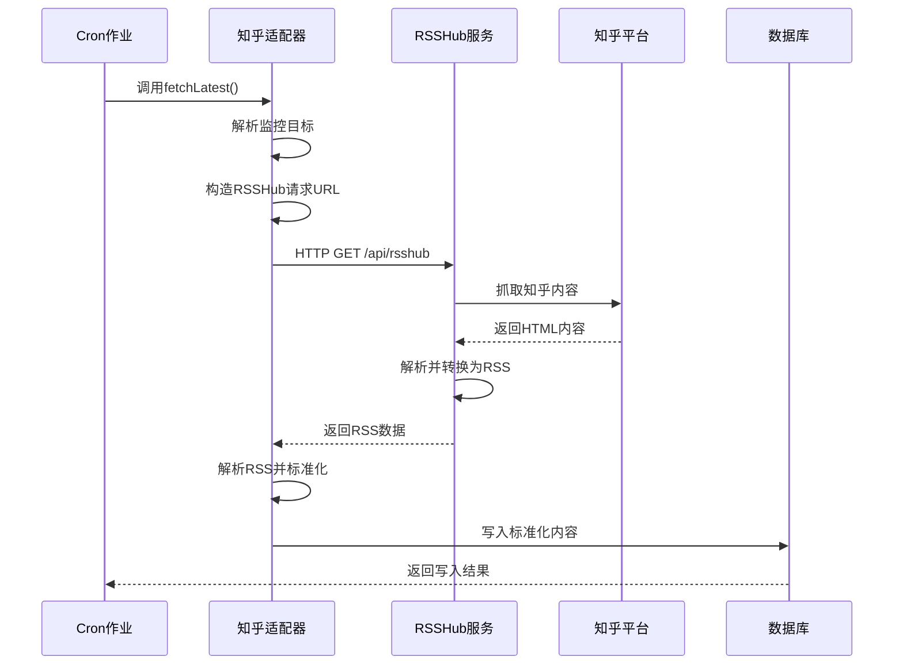

**图表来源**
- [PROJECT_CONTEXT.md:195-198](file://PROJECT_CONTEXT.md#L195-L198)

## 详细组件分析

### RSSHub API Key鉴权机制

#### 鉴权流程

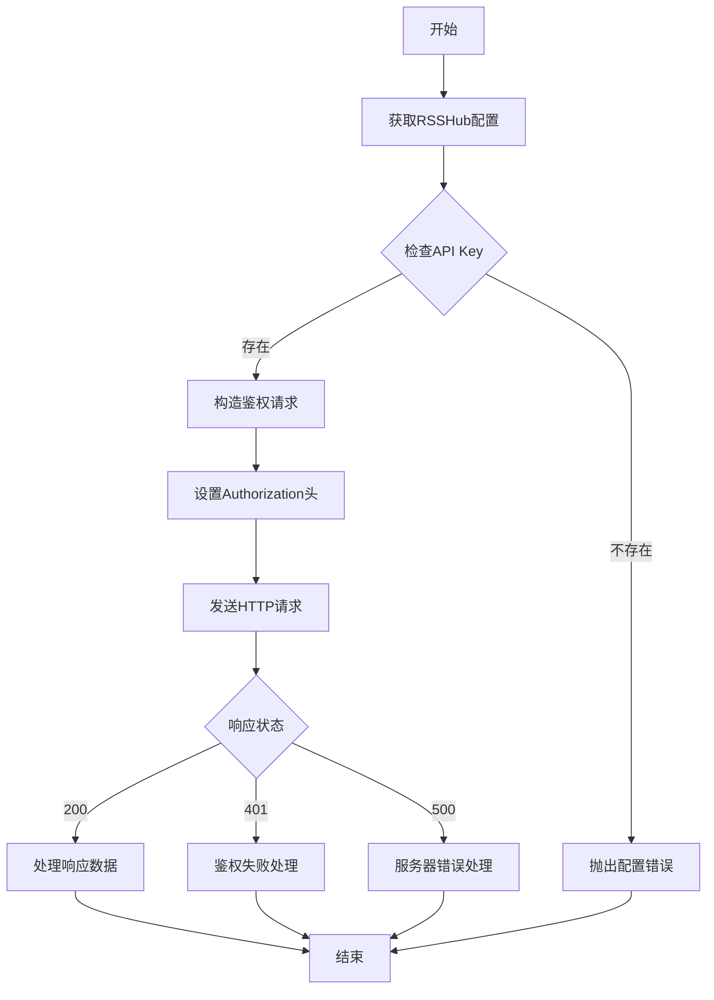

**图表来源**
- [PROJECT_CONTEXT.md:43-44](file://PROJECT_CONTEXT.md#L43-L44)

#### 配置参数说明

| 环境变量 | 用途 | 必填 | 示例值 |
|----------|------|------|--------|
| `RSSHUB_URL` | RSSHub实例地址 | 是 | `https://rsshub.example.com` |
| `RSSHUB_API_KEY` | 访问鉴权密钥 | 是 | `your-api-key-here` |
| `RSSHUB_ACCESS_CONTROL` | 访问控制配置 | 是 | `enabled` |

**章节来源**
- [PROJECT_CONTEXT.md:43-44](file://PROJECT_CONTEXT.md#L43-L44)

### HTTP接口调用机制

#### 请求构造流程

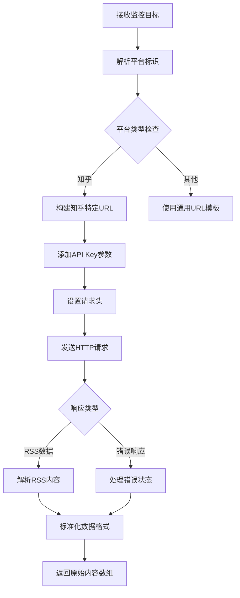

**图表来源**
- [PROJECT_CONTEXT.md:198](file://PROJECT_CONTEXT.md#L198)

#### 响应数据解析

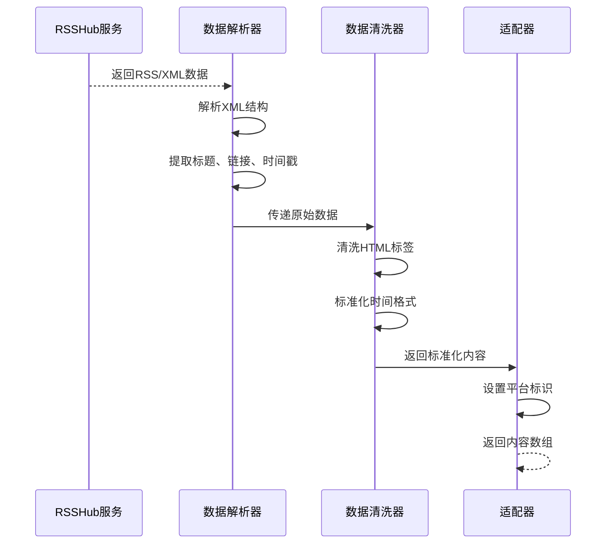

**图表来源**
- [PROJECT_CONTEXT.md:207-222](file://PROJECT_CONTEXT.md#L207-L222)

### 知乎内容抓取流程

#### 内容类型识别策略

```mermaid
flowchart TD
A[获取RSSHub响应] --> B[解析内容类型]
B --> C{内容类型判断}
C --> |文章| D[content_type = "article"]
C --> |问题| E[content_type = "question"]
C --> |回答| F[content_type = "answer"]
C --> |想法| G[content_type = "post"]
D --> H[提取文章相关信息]
E --> I[提取问题相关信息]
F --> J[提取回答相关信息]
G --> K[提取想法相关信息]
H --> L[标准化字段]
I --> L
J --> L
K --> L
L --> M[返回标准化内容]
```

**图表来源**
- [PROJECT_CONTEXT.md:580](file://PROJECT_CONTEXT.md#L580)

#### 数据格式转换

| 原始字段 | 知乎字段 | 标准化字段 | 处理逻辑 |
|----------|----------|------------|----------|
| `title` | RSS标题 | `title` | 直接映射 |
| `link` | RSS链接 | `original_url` | 直接映射 |
| `pubDate` | 发布日期 | `published_at` | ISO 8601格式转换 |
| `description` | 内容描述 | `cover_url` | 提取图片URL |
| `guid` | 唯一标识 | `native_id` | 原始ID |

**章节来源**
- [PROJECT_CONTEXT.md:207-222](file://PROJECT_CONTEXT.md#L207-L222)

### 错误处理和重试机制

#### 错误处理策略

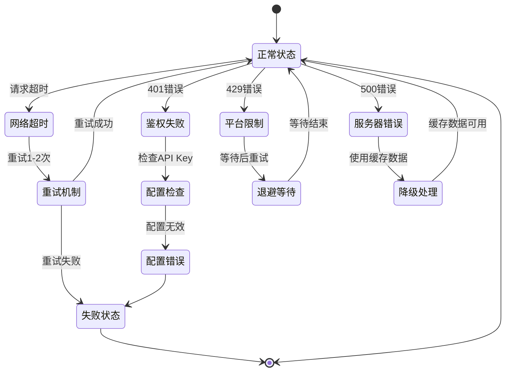

**图表来源**
- [PROJECT_CONTEXT.md:612](file://PROJECT_CONTEXT.md#L612)

#### 重试机制实现

| 错误类型 | 重试次数 | 重试间隔 | 处理策略 |
|----------|----------|----------|----------|
| 网络超时 | 2次 | 3秒 | 指数退避 |
| 401鉴权失败 | 1次 | 5秒 | 检查API Key |
| 429频率限制 | 3次 | 10秒 | 等待后重试 |
| 500服务器错误 | 2次 | 5秒 | 降级处理 |
| DNS解析失败 | 1次 | 1秒 | 直接失败 |

**章节来源**
- [PROJECT_CONTEXT.md:612](file://PROJECT_CONTEXT.md#L612)

## 依赖关系分析

### 外部依赖

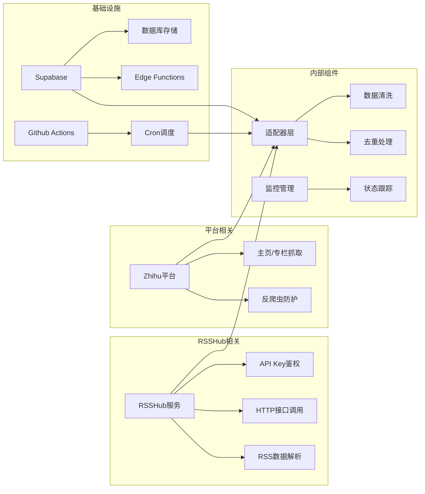

**图表来源**
- [PROJECT_CONTEXT.md:195-206](file://PROJECT_CONTEXT.md#L195-L206)

### 内部依赖关系

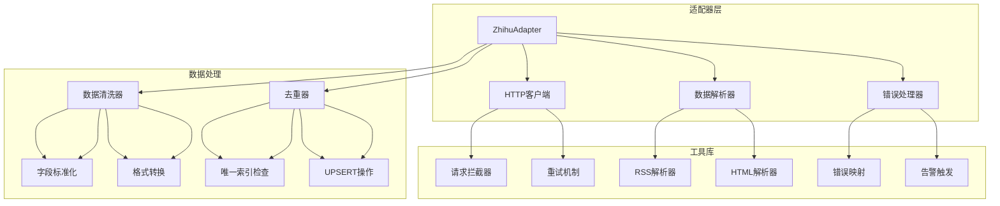

**图表来源**
- [PROJECT_CONTEXT.md:118-130](file://PROJECT_CONTEXT.md#L118-L130)

**章节来源**
- [PROJECT_CONTEXT.md:118-130](file://PROJECT_CONTEXT.md#L118-L130)

## 性能考虑

### 访问频率控制

系统采用了严格的频率控制策略来避免触发知乎平台的反爬虫机制：

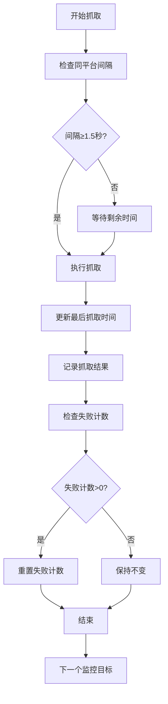

**图表来源**
- [PROJECT_CONTEXT.md:220](file://PROJECT_CONTEXT.md#L220)

### 缓存策略

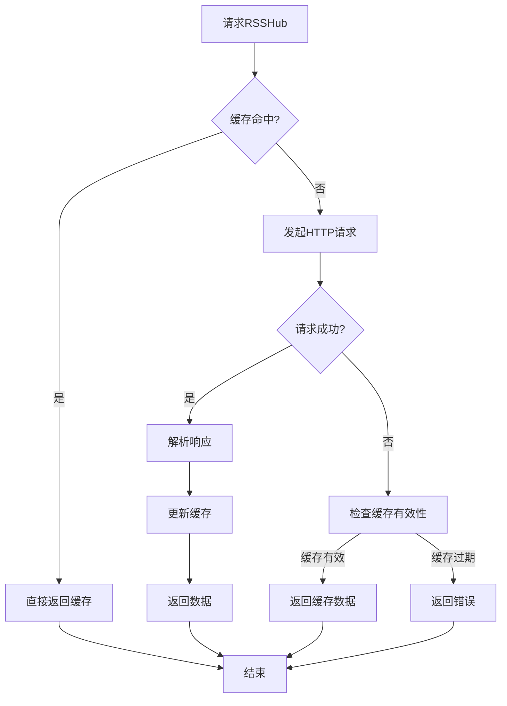

**图表来源**
- [PROJECT_CONTEXT.md:207-222](file://PROJECT_CONTEXT.md#L207-L222)

## 故障排除指南

### 常见问题及解决方案

#### RSSHub配置问题

| 问题症状 | 可能原因 | 解决方案 |
|----------|----------|----------|
| 401 Unauthorized | API Key错误或过期 | 检查RSSHUB_API_KEY配置 |
| 403 Forbidden | 访问权限不足 | 验证RSSHub ACCESS_CONTROL配置 |
| 502 Bad Gateway | RSSHub服务不可用 | 检查RSSHub实例状态 |
| 504 Gateway Timeout | 请求超时 | 增加超时时间或检查网络 |

#### 网络连接问题

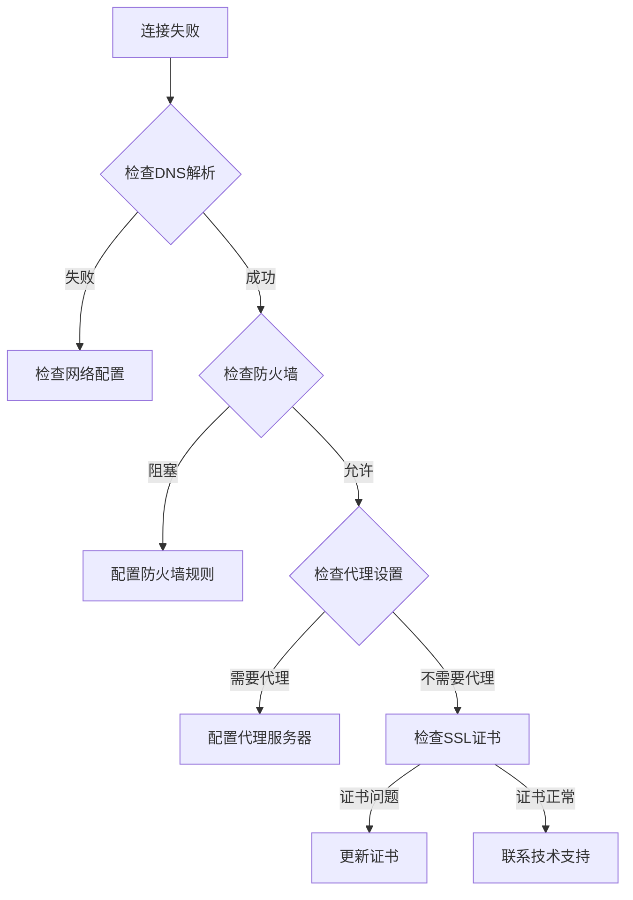

**图表来源**
- [PROJECT_CONTEXT.md:612](file://PROJECT_CONTEXT.md#L612)

#### 数据解析错误

| 错误类型 | 症状表现 | 处理方法 |
|----------|----------|----------|
| RSS格式错误 | 解析失败 | 检查RSSHub响应格式 |
| 编码问题 | 中文乱码 | 设置正确的字符编码 |
| 时间格式错误 | 时间解析失败 | 标准化时间为ISO 8601格式 |
| 图片链接失效 | 封面图加载失败 | 使用备用图片或占位符 |

**章节来源**
- [PROJECT_CONTEXT.md:612](file://PROJECT_CONTEXT.md#L612)

### 监控和告警

#### 状态监控指标

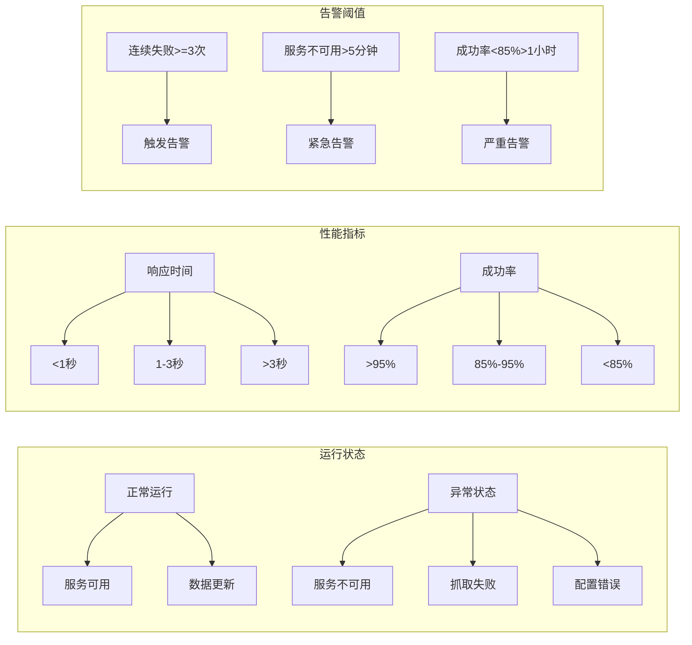

**图表来源**
- [PROJECT_CONTEXT.md:721-785](file://PROJECT_CONTEXT.md#L721-L785)

## 结论

知乎适配器通过RSSHub中转机制成功解决了知乎平台严格反爬虫限制的问题，为多平台内容中枢系统提供了稳定可靠的内容抓取能力。该适配器的设计充分体现了以下特点：

1. **安全性**：通过API Key鉴权和HTTPS传输确保数据安全
2. **可靠性**：完善的错误处理和重试机制保证服务稳定性
3. **可扩展性**：标准化的数据格式便于未来扩展新的内容类型
4. **可维护性**：清晰的代码结构和详细的文档便于维护和升级

在未来的发展中，建议持续关注RSSHub服务的稳定性，定期检查API Key的有效性，并根据实际使用情况调整频率控制策略，以确保系统的长期稳定运行。