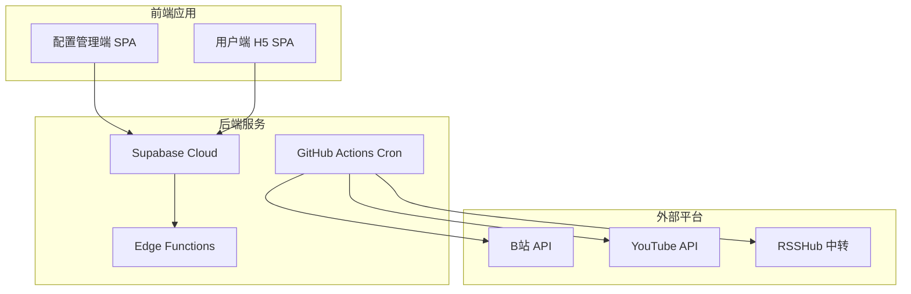
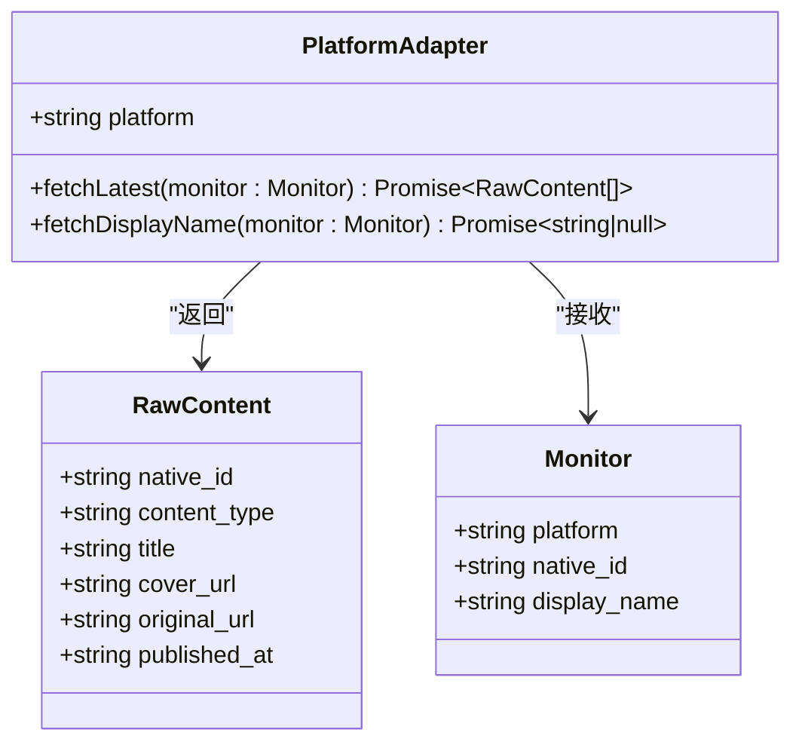
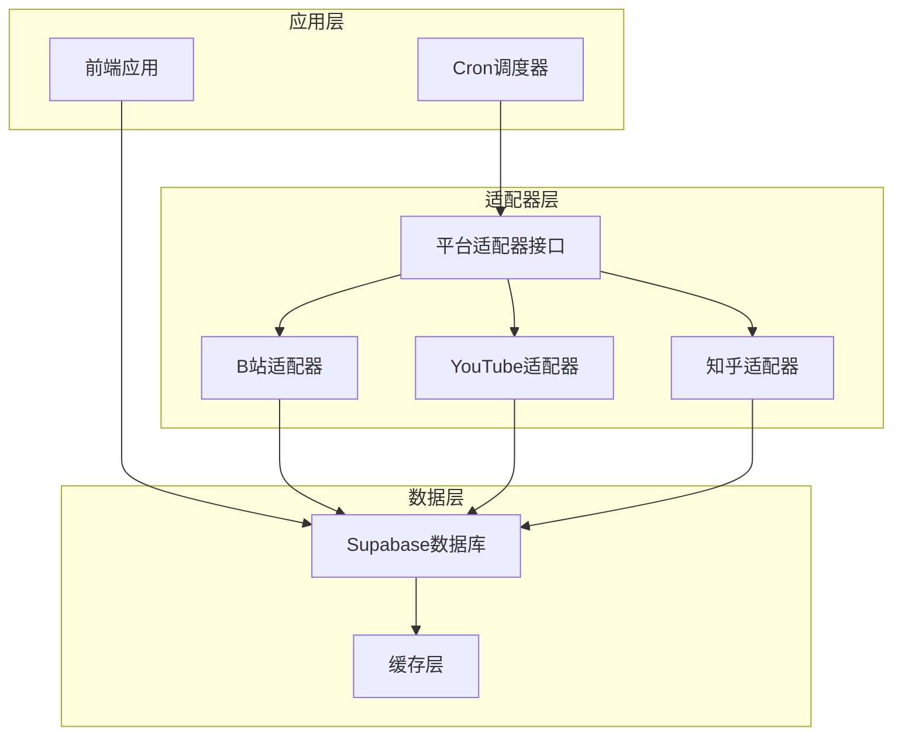
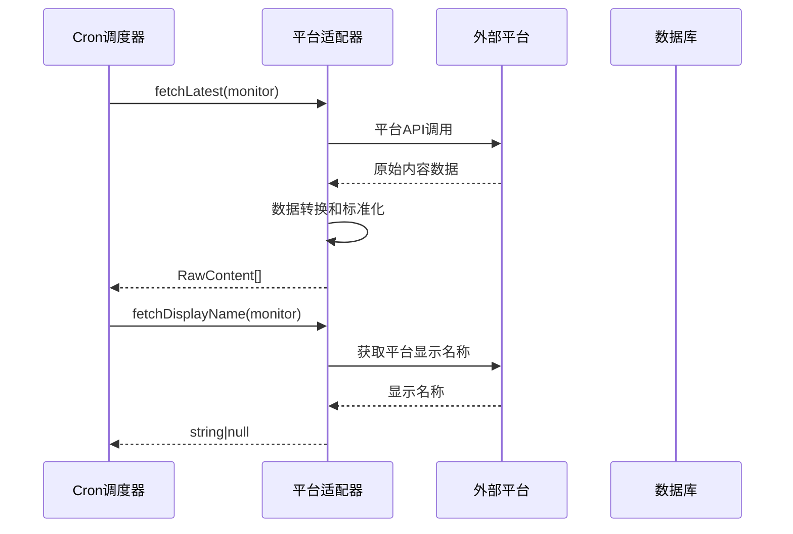
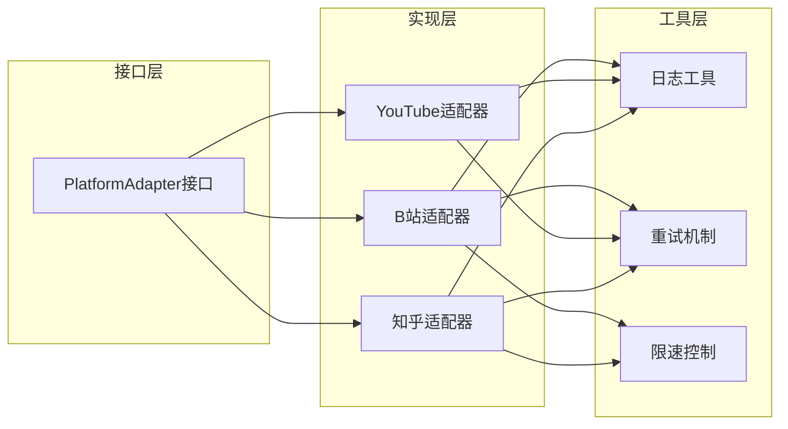
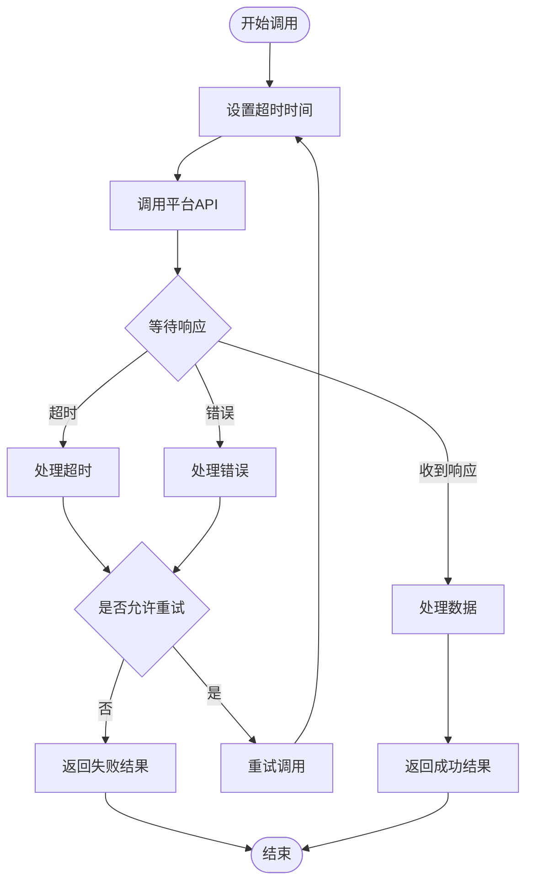
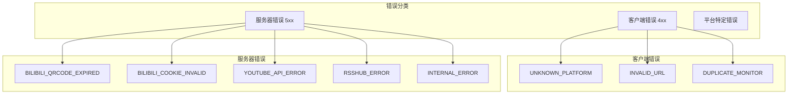

# 适配器接口规范

<cite>
**本文档引用的文件**
- [PROJECT_CONTEXT.md](file://PROJECT_CONTEXT.md)
</cite>

## 目录
1. [简介](#简介)
2. [项目结构](#项目结构)
3. [核心组件](#核心组件)
4. [架构概览](#架构概览)
5. [详细组件分析](#详细组件分析)
6. [依赖关系分析](#依赖关系分析)
7. [性能考虑](#性能考虑)
8. [故障排除指南](#故障排除指南)
9. [结论](#结论)

## 简介

本文档详细阐述了多平台内容中枢项目的平台适配器接口规范。该规范定义了统一的接口抽象，用于从不同平台（B站、YouTube、知乎）抓取内容，确保系统能够以一致的方式处理来自多个平台的数据。

平台适配器接口的核心设计理念是通过统一的抽象层屏蔽底层平台差异，为上层业务逻辑提供标准化的数据访问接口。这种设计使得新增支持新的内容平台变得简单且可控，同时保证了系统的可维护性和扩展性。

## 项目结构

多平台内容中枢采用Monorepo架构，主要分为以下几个部分：

**图表来源**
- [PROJECT_CONTEXT.md:56-141](file://PROJECT_CONTEXT.md#L56-L141)

**章节来源**
- [PROJECT_CONTEXT.md:49-141](file://PROJECT_CONTEXT.md#L49-L141)

## 核心组件

### 平台适配器接口定义

平台适配器接口是整个系统的核心抽象层，定义了统一的内容抓取规范：

**图表来源**
- [PROJECT_CONTEXT.md:574-598](file://PROJECT_CONTEXT.md#L574-L598)

### RawContent数据结构详解

RawContent是适配器返回的原始内容数据结构，包含了跨平台统一的内容表示：

| 字段名 | 类型 | 必填 | 描述 | 格式要求 |
|--------|------|------|------|----------|
| native_id | string | 是 | 平台原始ID | 平台特定格式，如B站的数字ID |
| content_type | enum | 是 | 内容类型 | 'video' \| 'article' \| 'question' \| 'answer' \| 'post' |
| title | string | 是 | 内容标题 | UTF-8编码，长度限制建议 |
| cover_url | string | 是 | 封面图片URL | HTTP/HTTPS绝对路径 |
| original_url | string | 是 | 原始链接URL | 完整的HTTP/HTTPS链接 |
| published_at | string | 是 | 发布时间 | ISO 8601 UTC格式 |

**章节来源**
- [PROJECT_CONTEXT.md:577-585](file://PROJECT_CONTEXT.md#L577-L585)

### 平台标识枚举

系统支持三个主要平台，每个平台都有其特定的标识符：

| 平台名称 | 枚举值 | 使用场景 | 特殊要求 |
|----------|--------|----------|----------|
| B站 | 'bilibili' | 视频内容、文章内容 | 需要Cookie鉴权，限速1.5秒/次 |
| YouTube | 'youtube' | 视频内容 | API Key鉴权，无额外限速 |
| 知乎 | 'zhihu' | 问答、文章内容 | 通过RSSHub中转，API Key鉴权 |

**章节来源**
- [PROJECT_CONTEXT.md:589-590](file://PROJECT_CONTEXT.md#L589-L590)

## 架构概览

系统采用分层架构设计，平台适配器位于数据访问层，负责与各个外部平台进行交互：

**图表来源**
- [PROJECT_CONTEXT.md:169-240](file://PROJECT_CONTEXT.md#L169-L240)

**章节来源**
- [PROJECT_CONTEXT.md:169-240](file://PROJECT_CONTEXT.md#L169-L240)

## 详细组件分析

### PlatformAdapter接口设计

PlatformAdapter接口的设计体现了单一职责原则和开闭原则：

**图表来源**
- [PROJECT_CONTEXT.md:592-596](file://PROJECT_CONTEXT.md#L592-L596)

#### fetchLatest方法规范

fetchLatest方法负责获取指定监控目标的最新内容：

**方法签名**: `fetchLatest(monitor: Monitor): Promise<RawContent[]>`

**参数说明**:
- `monitor`: Monitor对象，包含平台标识、原始ID、显示名称等信息

**返回值**:
- Promise<RawContent[]>：标准化后的原始内容数组

**实现要求**:
1. 异步调用平台API获取最新内容
2. 将平台特定的数据结构转换为RawContent格式
3. 处理分页和限速逻辑
4. 实现适当的错误处理和重试机制

#### fetchDisplayName方法规范

fetchDisplayName方法用于获取平台用户的显示名称：

**方法签名**: `fetchDisplayName(monitor: Monitor): Promise<string | null>`

**功能说明**:
- 在添加监控目标时同步获取用户昵称
- 为用户提供更好的用户体验
- 便于后续的数据展示和关联

**实现要求**:
1. 调用平台API获取用户信息
2. 提取并返回用户显示名称
3. 处理用户不存在或API调用失败的情况
4. 返回null表示无法获取显示名称

**章节来源**
- [PROJECT_CONTEXT.md:587-597](file://PROJECT_CONTEXT.md#L587-L597)

### 平台适配器实现对比

不同平台的适配器实现存在显著差异：

| 特性 | B站适配器 | YouTube适配器 | 知乎适配器 |
|------|-----------|---------------|------------|
| 数据源 | 空间API | YouTube Data API | RSSHub中转 |
| 鉴权方式 | Cookie (SESSDATA) | API Key | API Key |
| 限速要求 | ≥1.5秒/次 | 无需额外限速 | ≥1.5秒/次 |
| 特殊处理 | Cookie管理 | Channel ID解析 | URL重写 |
| 错误处理 | Cookie失效检测 | API错误码处理 | 中转服务异常 |

**章节来源**
- [PROJECT_CONTEXT.md:311-316](file://PROJECT_CONTEXT.md#L311-L316)

## 依赖关系分析

平台适配器之间的依赖关系相对简单，主要体现为对共同接口的实现：

**图表来源**
- [PROJECT_CONTEXT.md:587-597](file://PROJECT_CONTEXT.md#L587-L597)

**章节来源**
- [PROJECT_CONTEXT.md:587-597](file://PROJECT_CONTEXT.md#L587-L597)

## 性能考虑

### 异步调用模式

平台适配器采用异步编程模型，充分利用现代JavaScript的Promise和async/await语法：

1. **并发处理**: 不同平台间的适配器调用可以并行执行
2. **串行处理**: 同一平台内的多次调用需要遵守限速要求
3. **超时控制**: 为每个平台API调用设置合理的超时时间
4. **资源管理**: 合理管理网络连接和内存使用

### 超时处理策略

**图表来源**
- [PROJECT_CONTEXT.md:615-643](file://PROJECT_CONTEXT.md#L615-L643)

### 重试机制设计

重试机制应该考虑以下因素：

1. **指数退避**: 每次重试间隔按指数增长
2. **最大重试次数**: 设置合理的最大重试上限
3. **错误分类**: 区分可重试错误和不可重试错误
4. **熔断保护**: 当错误率过高时暂时停止重试

## 故障排除指南

### 常见错误类型及处理

| 错误类型 | 错误码 | 处理建议 | 预防措施 |
|----------|--------|----------|----------|
| 平台识别失败 | UNKNOWN_PLATFORM | 检查URL格式和平台支持情况 | 添加URL验证和平台识别测试 |
| API调用失败 | YOUTUBE_API_ERROR | 检查API Key有效性 | 实施API Key轮换和健康检查 |
| 认证失败 | BILIBILI_COOKIE_INVALID | 重新获取Cookie | 实施Cookie自动刷新机制 |
| 中转服务异常 | RSSHUB_ERROR | 检查RSSHub服务状态 | 实施服务可用性监控 |
| 超时错误 | TIMEOUT | 增加超时时间或重试 | 优化网络配置和连接池 |

### 错误码规范

系统使用统一的错误码规范，便于错误诊断和处理：

**图表来源**
- [PROJECT_CONTEXT.md:600-614](file://PROJECT_CONTEXT.md#L600-L614)

**章节来源**
- [PROJECT_CONTEXT.md:600-614](file://PROJECT_CONTEXT.md#L600-L614)

## 结论

平台适配器接口规范为多平台内容中枢提供了清晰的抽象层，通过统一的接口设计实现了对多个平台的标准化支持。该规范的关键优势包括：

1. **统一抽象**: 通过PlatformAdapter接口屏蔽平台差异
2. **扩展性强**: 新增平台只需实现统一接口
3. **错误处理**: 完善的错误码规范和处理策略
4. **性能优化**: 合理的异步调用模式和限速控制
5. **安全性**: 严格的认证机制和数据保护

未来在实现具体适配器时，应重点关注错误处理的完善性、性能优化的持续改进，以及新平台支持的快速集成能力。通过遵循这套规范，可以确保系统的稳定性和可维护性。