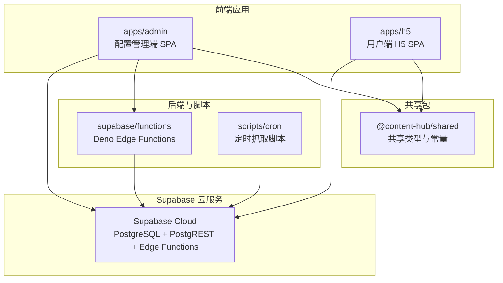
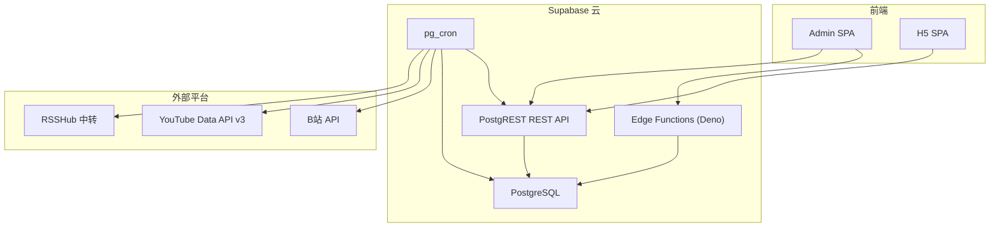

# 快速开始

<cite>
**本文引用的文件**
- [PROJECT_CONTEXT.md](file://PROJECT_CONTEXT.md)
- [多平台中枢_PRD.md](file://多平台中枢_PRD.md)
</cite>

## 目录
1. [简介](#简介)
2. [项目结构](#项目结构)
3. [核心组件](#核心组件)
4. [架构总览](#架构总览)
5. [详细组件分析](#详细组件分析)
6. [依赖分析](#依赖分析)
7. [性能考虑](#性能考虑)
8. [故障排除指南](#故障排除指南)
9. [结论](#结论)
10. [附录](#附录)

## 简介
本指南面向新手开发者，帮助你在约 30 分钟内完成多平台内容中枢项目的本地环境搭建、项目克隆、依赖安装、环境变量配置，并成功启动前端应用（配置管理端 Admin SPA 与用户端 H5 SPA）。你还将了解从添加监控目标到查看聚合信息流的完整首次使用流程，并掌握常见问题的排查与解决思路。

## 项目结构
项目采用 pnpm workspace 的 Monorepo 结构，分为前端应用、共享包、Supabase 后端与定时抓取脚本四大部分。目录组织遵循“apps/packages/supabase/scripts”的分层模式，便于前后端共享类型与跨模块协作。

- apps/admin：配置管理端（React SPA）
- apps/h5：用户端 H5（React SPA）
- packages/shared：前后端共享类型与常量
- supabase/functions：Deno Edge Functions（URL 解析、B站扫码授权等）
- scripts/cron：GitHub Actions Cron 脚本（平台适配器、数据清洗、UPSERT 写入）
- .github/workflows：定时工作流（每 30 分钟触发）

图表来源
- [PROJECT_CONTEXT.md:51-141](file://PROJECT_CONTEXT.md#L51-L141)

章节来源
- [PROJECT_CONTEXT.md:51-141](file://PROJECT_CONTEXT.md#L51-L141)

## 核心组件
- 前端框架：React 18 + TypeScript，构建工具 Vite 5，样式方案 Tailwind CSS 3
- 后端服务：Supabase Cloud（PostgreSQL + PostgREST + Edge Functions）
- 包管理：pnpm workspace
- 前端托管：Vercel（静态 SPA 部署）
- 定时任务：GitHub Actions（每 30 分钟触发 Node.js 抓取脚本）
- 知乎中转：RSSHub（Railway/Fly.io 部署，API Key 鉴权）

章节来源
- [PROJECT_CONTEXT.md:8-24](file://PROJECT_CONTEXT.md#L8-L24)

## 架构总览
系统由“配置管理端”“后端自动化引擎”“用户端 H5”三层构成，数据通过 Supabase REST API 与 Edge Functions 串联，定时任务负责从各平台抓取最新内容并写入数据库，前端仅负责展示与交互。

图表来源
- [PROJECT_CONTEXT.md:169-240](file://PROJECT_CONTEXT.md#L169-L240)

章节来源
- [PROJECT_CONTEXT.md:169-240](file://PROJECT_CONTEXT.md#L169-L240)

## 详细组件分析

### 环境准备与安装
- Node.js：建议使用 Node.js 20.x（与 GitHub Actions 工作流一致）
- pnpm：使用 pnpm workspace 管理 Monorepo
- Supabase CLI：用于本地初始化与部署（可选，云端 Supabase 已提供服务）
- Git：用于克隆仓库与版本管理

章节来源
- [PROJECT_CONTEXT.md:637-642](file://PROJECT_CONTEXT.md#L637-L642)

### 项目克隆与依赖安装
- 克隆仓库后，进入项目根目录
- 安装根依赖（pnpm workspace）
- 安装各子包依赖（apps/admin、apps/h5、packages/shared、scripts/cron）

章节来源
- [PROJECT_CONTEXT.md:138-141](file://PROJECT_CONTEXT.md#L138-L141)
- [PROJECT_CONTEXT.md:637-642](file://PROJECT_CONTEXT.md#L637-L642)

### 环境变量配置
- 前端运行所需变量（Vercel/本地）：
  - SUPABASE_URL
  - SUPABASE_ANON_KEY
- 仅 Cron/Edge Functions 使用的变量（GitHub Secrets/Vercel）：
  - SUPABASE_SERVICE_ROLE_KEY
  - YOUTUBE_API_KEY
  - BILIBILI_COOKIE_*（加密存储于数据库）
  - RSSHUB_URL
  - RSSHUB_API_KEY
  - WECOM_WEBHOOK_URL（可选）

章节来源
- [PROJECT_CONTEXT.md:34-46](file://PROJECT_CONTEXT.md#L34-L46)

### 前端应用启动（Admin SPA 与 H5 SPA）
- 进入 apps/admin 或 apps/h5 目录
- 安装依赖后启动开发服务器
- 构建产物用于 Vercel 部署（静态 SPA）

章节来源
- [PROJECT_CONTEXT.md:58-82](file://PROJECT_CONTEXT.md#L58-L82)

### Edge Functions 与 Supabase 配置
- Edge Functions（Deno）位于 supabase/functions，包含：
  - parse-url：URL 解析与平台识别
  - bilibili-auth：B站扫码授权与 Cookie 存储
- 共享代码位于 _shared 目录（下划线前缀，不部署）
- 数据库迁移与策略位于 supabase/migrations 与 seed.sql

章节来源
- [PROJECT_CONTEXT.md:97-113](file://PROJECT_CONTEXT.md#L97-L113)

### 定时抓取与数据写入
- GitHub Actions 工作流每 30 分钟触发一次
- 抓取脚本按平台分组串行执行，同平台请求间隔 ≥ 1.5 秒
- 通过 Supabase REST API（Service Role Key）进行 UPSERT 写入

章节来源
- [PROJECT_CONTEXT.md:615-643](file://PROJECT_CONTEXT.md#L615-L643)

### 首次使用全流程演示
- 在配置管理端粘贴博主主页链接，前端校验 URL 后调用后端解析接口
- 后端识别平台并提取唯一标识，写入 monitors 表
- 定时任务抓取最新内容，清洗标准化后写入 contents 表
- 用户端 H5 读取 contents 表展示聚合信息流
- 点击卡片尝试 Deep Link 跳转原生 App，失败时弹出兜底弹窗

章节来源
- [PROJECT_CONTEXT.md:274-346](file://PROJECT_CONTEXT.md#L274-L346)
- [PROJECT_CONTEXT.md:615-643](file://PROJECT_CONTEXT.md#L615-L643)
- [多平台中枢_PRD.md:102-127](file://多平台中枢_PRD.md#L102-L127)

## 依赖分析
- 前端依赖：@supabase/supabase-js（用于前端 SPA 与 Cron 脚本）
- Edge Functions 依赖：@supabase/supabase（Deno 模块导入）
- 平台适配器：youtubei.js 或 googleapis（YouTube）、RSSHub（知乎）
- 包管理：pnpm workspace（Monorepo 依赖管理）

章节来源
- [PROJECT_CONTEXT.md:25-32](file://PROJECT_CONTEXT.md#L25-L32)

## 性能考虑
- 前端 SPA 为纯客户端渲染，适合静态托管（Vercel）
- 定时任务按平台分组串行执行，避免反爬与 API 限流
- 数据去重采用 PostgreSQL ON CONFLICT，配合软删除策略控制数据规模
- 建议在本地开发时使用 Vite 的热更新提升迭代速度

章节来源
- [PROJECT_CONTEXT.md:318-334](file://PROJECT_CONTEXT.md#L318-L334)
- [PROJECT_CONTEXT.md:233-239](file://PROJECT_CONTEXT.md#L233-L239)

## 故障排除指南
- 前端无法连接 Supabase
  - 检查 SUPABASE_URL 与 SUPABASE_ANON_KEY 是否正确配置
  - 确认 RLS 策略允许匿名用户读取 contents 表（is_display=true）
- 添加监控时报“无法识别该平台”
  - 确认 URL 包含受支持平台的特征（如 bilibili.com、youtube.com、zhihu.com）
  - 检查 parse-url Edge Function 是否可用
- B站 Cookie 失效
  - 通过 bilibili-auth Edge Function 重新扫码授权并更新 Cookie
- YouTube API 调用失败
  - 检查 YOUTUBE_API_KEY 与配额使用情况
  - 确认请求间隔满足每 4 小时一次的策略
- 知乎抓取异常
  - 确认 RSSHub 实例可达且启用了 API Key 鉴权
- H5 信息流为空
  - 等待定时任务完成一轮抓取，或手动触发一次 Cron
- 微信内点击卡片无法跳转
  - 微信/支付宝内为受限环境，系统会弹出“复制链接 + 引导在浏览器打开”弹窗

章节来源
- [PROJECT_CONTEXT.md:600-614](file://PROJECT_CONTEXT.md#L600-L614)
- [PROJECT_CONTEXT.md:390-400](file://PROJECT_CONTEXT.md#L390-L400)
- [PROJECT_CONTEXT.md:898-951](file://PROJECT_CONTEXT.md#L898-L951)

## 结论
通过本快速开始指南，你可以在 30 分钟内完成环境搭建、项目启动与首次使用流程。建议在本地先行验证配置管理端与 H5 的基本功能，随后逐步完善定时任务与平台适配器，最终实现稳定的内容聚合与跳转体验。

## 附录

### A. 环境变量清单（摘要）
- 前端运行必需：SUPABASE_URL、SUPABASE_ANON_KEY
- Cron/Edge Functions 使用：SUPABASE_SERVICE_ROLE_KEY、YOUTUBE_API_KEY、BILIBILI_COOKIE_*、RSSHUB_URL、RSSHUB_API_KEY、WECOM_WEBHOOK_URL（可选）

章节来源
- [PROJECT_CONTEXT.md:34-46](file://PROJECT_CONTEXT.md#L34-L46)

### B. 目录规范与命名规范
- Monorepo 结构：apps、packages、supabase、scripts
- Edge Function 命名：连字符（kebab-case）
- 数据库表/字段：蛇形（snake_case）
- TypeScript 文件：连字符（kebab-case）
- 常量：全大写蛇形（UPPER_SNAKE）

章节来源
- [PROJECT_CONTEXT.md:144-157](file://PROJECT_CONTEXT.md#L144-L157)