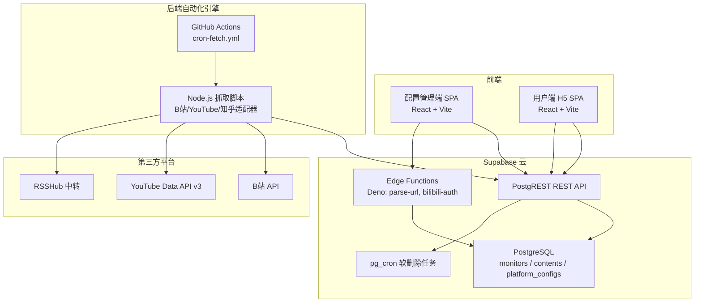
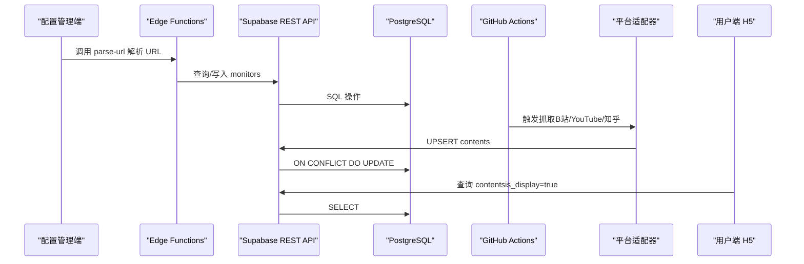
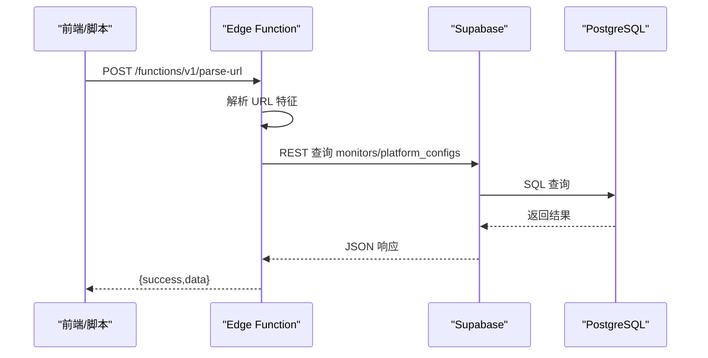
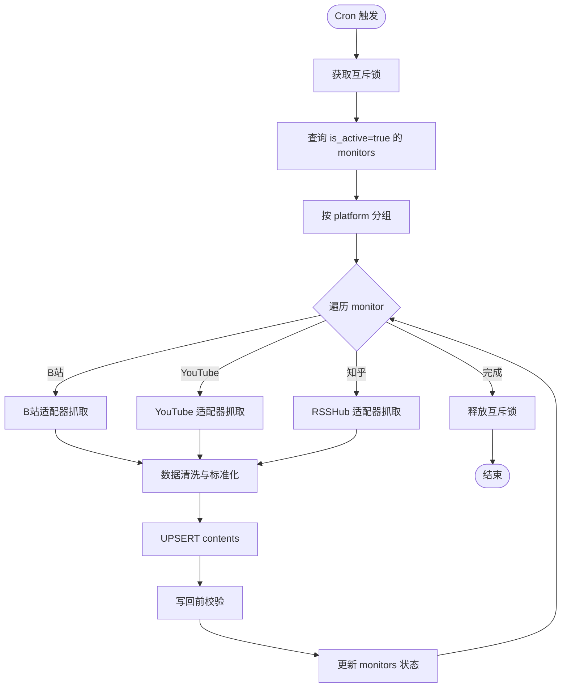
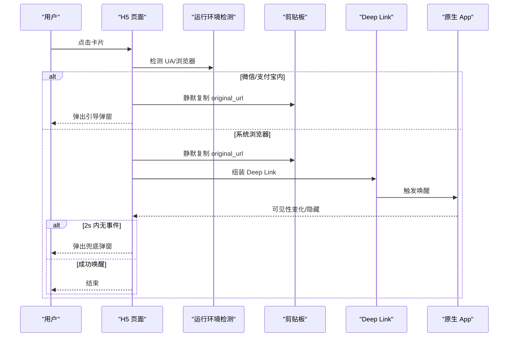

# 故障排除

<cite>
**本文引用的文件**
- [PROJECT_CONTEXT.md](file://PROJECT_CONTEXT.md)
- [多平台中枢_PRD.md](file://多平台中枢_PRD.md)
</cite>

## 目录
1. [简介](#简介)
2. [项目结构](#项目结构)
3. [核心组件](#核心组件)
4. [架构总览](#架构总览)
5. [详细组件分析](#详细组件分析)
6. [依赖分析](#依赖分析)
7. [性能考虑](#性能考虑)
8. [故障排除指南](#故障排除指南)
9. [结论](#结论)
10. [附录](#附录)

## 简介
本指南面向“多平台内容中枢”项目的运维与开发人员，提供系统性的故障排查方法与解决方案，覆盖部署问题、功能异常、性能问题、日志分析与错误码解读，并给出紧急处置流程与恢复策略。项目采用“配置驱动抓取”的架构，前端通过 Supabase REST API 与 Edge Functions 与后端自动化引擎（GitHub Actions Cron）协作，实现跨平台内容聚合与展示。

## 项目结构
项目采用 Monorepo 结构，包含前端应用（配置管理端与用户端 H5）、共享类型包、Supabase 项目配置（含 Edge Functions 与迁移）、Cron 脚本（Node.js）以及 GitHub Actions 工作流。核心职责边界清晰：前端不直接调用第三方平台 API，Cron 脚本通过 Supabase REST API 写入数据，Edge Functions 仅承担轻量逻辑（URL 解析、B站扫码授权）。

图表来源
- [PROJECT_CONTEXT.md: 173-207:173-207](file://PROJECT_CONTEXT.md#L173-L207)
- [PROJECT_CONTEXT.md: 97-141:97-141](file://PROJECT_CONTEXT.md#L97-L141)
- [PROJECT_CONTEXT.md: 132-135:132-135](file://PROJECT_CONTEXT.md#L132-L135)

章节来源
- [PROJECT_CONTEXT.md: 49-141:49-141](file://PROJECT_CONTEXT.md#L49-L141)

## 核心组件
- 配置管理端（React SPA）：负责添加监控目标、平台识别、状态管理与昵称管理。
- 用户端 H5（React SPA）：负责信息流展示、按平台筛选、Deep Link 跳转与兜底弹窗。
- Supabase 后端：PostgREST REST API、Edge Functions、数据库与 pg_cron。
- GitHub Actions Cron：定时触发 Node.js 抓取脚本，按平台适配器抓取内容并写入数据库。
- RSSHub：为知乎提供中转服务，需启用 API Key 鉴权。

章节来源
- [PROJECT_CONTEXT.md: 243-271:243-271](file://PROJECT_CONTEXT.md#L243-L271)
- [PROJECT_CONTEXT.md: 420-474:420-474](file://PROJECT_CONTEXT.md#L420-L474)
- [PROJECT_CONTEXT.md: 615-644:615-644](file://PROJECT_CONTEXT.md#L615-L644)

## 架构总览
系统围绕 Supabase 构建，前端与后端通过 REST API 与 Edge Functions 交互，Cron 通过 Supabase REST API 写入数据，避免直接数据库连接。数据流分为“写入流（Cron 抓取）”、“读取流（H5 浏览）”、“配置流（管理端）”和“清理流（软删除）”。

图表来源
- [PROJECT_CONTEXT.md: 224-239:224-239](file://PROJECT_CONTEXT.md#L224-L239)
- [PROJECT_CONTEXT.md: 420-474:420-474](file://PROJECT_CONTEXT.md#L420-L474)
- [PROJECT_CONTEXT.md: 615-644:615-644](file://PROJECT_CONTEXT.md#L615-L644)

## 详细组件分析

### 组件A：Supabase REST API 与 Edge Functions
- REST API：PostgREST 自动生成，遵循标准 RESTful 约定；请求头包含 apikey 与 Authorization；支持 Prefer 头进行 UPSERT 与返回策略。
- Edge Functions：Deno 实现，统一请求/响应格式；parse-url 用于 URL 解析与平台识别；bilibili-auth 用于扫码授权与 Cookie 存储。

图表来源
- [PROJECT_CONTEXT.md: 511-537:511-537](file://PROJECT_CONTEXT.md#L511-L537)
- [PROJECT_CONTEXT.md: 475-509:475-509](file://PROJECT_CONTEXT.md#L475-L509)

章节来源
- [PROJECT_CONTEXT.md: 420-509:420-509](file://PROJECT_CONTEXT.md#L420-L509)

### 组件B：GitHub Actions Cron 脚本与平台适配器
- 工作流：每 30 分钟触发一次，使用 Node.js 运行时，读取 GitHub Secrets，调用平台适配器抓取内容。
- 适配器：B站（Cookie + 空间 API）、YouTube（Data API v3）、知乎（RSSHub 中转）；统一接口 fetchLatest 与 fetchDisplayName。
- 去重与写回：基于 (platform, native_id) 唯一索引的 UPSERT，防止旧数据复活。

图表来源
- [PROJECT_CONTEXT.md: 615-644:615-644](file://PROJECT_CONTEXT.md#L615-L644)
- [PROJECT_CONTEXT.md: 301-333:301-333](file://PROJECT_CONTEXT.md#L301-L333)

章节来源
- [PROJECT_CONTEXT.md: 615-644:615-644](file://PROJECT_CONTEXT.md#L615-L644)
- [多平台中枢_PRD.md: 654-717:654-717](file://多平台中枢_PRD.md#L654-L717)

### 组件C：用户端 H5 与 Deep Link 跳转
- 信息流：按 published_at 倒序展示，支持平台筛选与无限滚动。
- 跳转逻辑：根据 (platform, content_type) 选择 Schema；微信/支付宝内走复制链接兜底；系统浏览器内尝试 Deep Link 并超时检测。

图表来源
- [多平台中枢_PRD.md: 789-898:789-898](file://多平台中枢_PRD.md#L789-L898)

章节来源
- [多平台中枢_PRD.md: 789-898:789-898](file://多平台中枢_PRD.md#L789-L898)

## 依赖分析
- 前端依赖：@supabase/supabase-js 用于与 Supabase 交互；Vite 5 构建；Tailwind CSS。
- 后端依赖：Deno + TypeScript 的 Edge Functions；Node.js Cron 脚本；Supabase REST API。
- 第三方依赖：YouTube Data API v3、RSSHub（Railway/Fly.io 部署）、B站 Cookie（加密存储）。
- 部署依赖：Vercel（前端托管）、Supabase Cloud（数据库+Edge Functions）、GitHub Actions（定时任务）。

章节来源
- [PROJECT_CONTEXT.md: 8-33:8-33](file://PROJECT_CONTEXT.md#L8-L33)

## 性能考虑
- 查询优化：H5 信息流强制过滤 is_display=true，避免软删除记录参与排序；contents 表按 (platform, native_id) 建立唯一索引，支撑 UPSERT。
- 缓存策略：前端可对近期热门内容进行本地缓存；RSSHub 中转可利用 CDN 缓存；Edge Functions 仅做轻量逻辑，避免热点数据缓存。
- 资源监控：监控 GitHub Actions 运行时长与失败率；监控 Supabase 数据库查询慢日志；监控第三方平台 API 配额使用情况。
- 并发与限速：同平台请求间隔 ≥ 1.5 秒；YouTube 适配器每 4 小时执行一次；Cron 互斥锁避免并发冲突。

章节来源
- [PROJECT_CONTEXT.md: 318-334:318-334](file://PROJECT_CONTEXT.md#L318-L334)
- [PROJECT_CONTEXT.md: 209-222:209-222](file://PROJECT_CONTEXT.md#L209-L222)
- [多平台中枢_PRD.md: 654-717:654-717](file://多平台中枢_PRD.md#L654-L717)

## 故障排除指南

### 一、部署问题排查
- 前端部署（Vercel）
  - 症状：页面空白、资源 404、登录后无数据。
  - 排查要点：检查环境变量（SUPABASE_URL、SUPABASE_ANON_KEY）是否正确注入；确认域名与 CORS 设置；检查构建产物与路由配置。
  - 解决方案：在 Vercel 项目设置中补齐环境变量；确认 Next.js/Vite 静态资源路径；检查自定义域名与 SSL 证书。
- Supabase 部署
  - 症状：Edge Functions 500、数据库连接失败、RLS 策略导致读取异常。
  - 排查要点：检查 Edge Functions 日志（Deno 运行时）；确认 service_role key 仅用于 Cron 与 Edge Functions；核对 RLS 策略与角色权限。
  - 解决方案：修正 RLS 策略；确保前端使用 anon_key；为 Cron 与 Edge Functions 使用 service_role key。
- GitHub Actions 部署
  - 症状：工作流失败、Secrets 读取异常、定时任务未触发。
  - 排查要点：检查 cron 表达式与 workflow_dispatch；确认 Secrets 注入；查看工作流日志中的环境变量。
  - 解决方案：修正 cron 表达式；在 GitHub 仓库 Secrets 中补齐缺失项；检查 pnpm 安装与 Node 版本。

章节来源
- [PROJECT_CONTEXT.md: 34-46:34-46](file://PROJECT_CONTEXT.md#L34-L46)
- [PROJECT_CONTEXT.md: 132-135:132-135](file://PROJECT_CONTEXT.md#L132-L135)

### 二、功能异常排查
- 配置管理端无法添加监控
  - 症状：添加按钮无效、提示“无法识别该平台”或“该博主已添加”。
  - 排查要点：前端 URL 校验是否通过；parse-url Edge Function 是否返回成功；数据库去重校验是否命中 (platform, native_id)。
  - 解决方案：确认 URL 格式；检查 Edge Function 日志；清理重复监控记录。
- 用户端 H5 无内容或内容过旧
  - 症状：信息流为空、内容超过 30 天未更新。
  - 排查要点：检查 contents 表 is_display=true 的记录；确认 Cron 是否正常运行；检查软删除任务是否执行。
  - 解决方案：触发手动同步；检查 Cron 日志；确认 pg_cron 任务状态。
- Deep Link 跳转失败
  - 症状：点击卡片无反应、微信内无法唤醒、兜底弹窗频繁出现。
  - 排查要点：运行环境检测是否正确；Deep Link Schema 是否匹配；App 是否安装；Schema 是否支持。
  - 解决方案：在系统浏览器中测试；确认 App 支持对应 Schema；调整跳转策略与超时检测。

章节来源
- [PROJECT_CONTEXT.md: 275-300:275-300](file://PROJECT_CONTEXT.md#L275-L300)
- [多平台中枢_PRD.md: 789-898:789-898](file://多平台中枢_PRD.md#L789-L898)

### 三、性能问题排查
- Cron 抓取耗时过长
  - 症状：工作流超时、数据库写入延迟。
  - 排查要点：检查同平台请求限速（≥1.5s）；YouTube 适配器 4 小时窗口；Cron 互斥锁是否生效。
  - 解决方案：优化适配器并发策略；增加互斥锁日志；缩短单次抓取范围。
- H5 页面加载缓慢
  - 症状：首屏慢、分页加载卡顿。
  - 排查要点：检查数据库索引与查询计划；确认 is_display=true 过滤是否生效；前端分页与懒加载是否正确。
  - 解决方案：优化数据库查询；启用前端缓存；减少一次性渲染数量。

章节来源
- [PROJECT_CONTEXT.md: 209-222:209-222](file://PROJECT_CONTEXT.md#L209-L222)
- [多平台中枢_PRD.md: 902-924:902-924](file://多平台中枢_PRD.md#L902-L924)

### 四、日志分析技巧
- Supabase 日志
  - Edge Functions：在 Supabase Dashboard 的 Functions 页面查看实时日志；关注 Deno 运行时错误、网络超时与数据库连接异常。
  - 数据库：查看 pg_cron 任务日志与慢查询；确认 RLS 策略是否导致权限问题。
- Edge Functions 日志
  - 关注 parse-url 与 bilibili-auth 的请求参数与响应；检查平台 API 调用失败原因（401/403/429/502）。
- GitHub Actions 日志
  - 关注工作流运行时长、Secrets 读取、Node.js 版本与 pnpm 安装过程；检查平台适配器返回的数据结构与去重结果。

章节来源
- [PROJECT_CONTEXT.md: 475-509:475-509](file://PROJECT_CONTEXT.md#L475-L509)
- [PROJECT_CONTEXT.md: 615-644:615-644](file://PROJECT_CONTEXT.md#L615-L644)

### 五、错误码与处理
- Edge Function 错误码
  - UNKNOWN_PLATFORM/INVALID_URL：URL 格式或特征不匹配，需修正输入或扩展识别规则。
  - DUPLICATE_MONITOR：去重命中 (platform, native_id)，需删除重复或修改监控配置。
  - BILIBILI_QRCODE_EXPIRED/BILIBILI_COOKIE_INVALID：B站 Cookie 失效，需重新扫码授权。
  - YOUTUBE_API_ERROR/RSSHUB_ERROR：平台 API 调用失败，检查配额与鉴权；必要时降级或重试。
  - INTERNAL_ERROR：未预期错误，需查看日志并修复。
- 平台 API 错误
  - B站：401/403（Cookie 失效/鉴权失败）、429（频率限制）、5xx（服务异常）。
  - YouTube：403 quotaExceeded（配额用尽）、400/5xx（请求错误/服务异常）。
  - RSSHub：401/403（API Key 错误/鉴权失败）、5xx（服务异常）。
- 数据库约束冲突
  - UNIQUE(platform, native_id) 冲突：UPSERT 已存在记录，检查 is_display 状态与防复活保护逻辑。
  - RLS 权限失败：确认角色与策略；前端使用 anon_key，服务端使用 service_role key。

章节来源
- [PROJECT_CONTEXT.md: 600-614:600-614](file://PROJECT_CONTEXT.md#L600-L614)
- [PROJECT_CONTEXT.md: 360-401:360-401](file://PROJECT_CONTEXT.md#L360-L401)

### 六、问题定位方法
- 网络连接检查
  - 使用 curl/浏览器开发者工具检查 Supabase REST API 与第三方平台 API 的可达性；确认 DNS 解析与防火墙策略。
- API 调用验证
  - 使用 Postman/Insomnia 验证 REST API 请求头（apikey、Authorization、Prefer）与响应格式；对比 Edge Functions 的请求参数。
- 数据库查询分析
  - 使用 Supabase SQL Editor 执行 H5 信息流查询，确认 is_display=true 过滤与排序；检查 contents 表索引与统计信息。

章节来源
- [PROJECT_CONTEXT.md: 431-474:431-474](file://PROJECT_CONTEXT.md#L431-L474)

### 七、紧急情况处理与恢复策略
- Cookie 失效
  - 立即触发 bilibili-auth 重新扫码授权；在管理端将状态从 cookie_expired 恢复为 normal。
- 平台 API 限流/配额用尽
  - 临时降低抓取频率；YouTube 适配器等待 4 小时窗口；RSSHub 临时切换备用实例。
- 数据库写入异常
  - 检查 UPSERT 逻辑与防复活保护；必要时回滚或人工修复 contents 表记录。
- 前端白屏
  - 检查 Vercel 构建日志与环境变量；回滚到上一个稳定版本；确认 Supabase 服务可用性。

章节来源
- [PROJECT_CONTEXT.md: 209-222:209-222](file://PROJECT_CONTEXT.md#L209-L222)
- [多平台中枢_PRD.md: 928-951:928-951](file://多平台中枢_PRD.md#L928-L951)

## 结论
本指南提供了从部署、功能、性能到日志与错误码的系统性故障排除方法。建议在日常运维中建立“日志监控—问题定位—修复验证—回归观察”的闭环流程，并结合项目约束（如 service_role key 不暴露、RLS 策略、Cron 互斥锁）制定针对性的应急预案与恢复策略。

## 附录
- 环境变量清单与用途：SUPABASE_URL、SUPABASE_ANON_KEY、SUPABASE_SERVICE_ROLE_KEY、YOUTUBE_API_KEY、BILIBILI_COOKIE_*、RSSHUB_URL、RSSHUB_API_KEY、WECOM_WEBHOOK_URL。
- 关键接口规范：Supabase REST API、Edge Functions、平台 API、GitHub Actions 工作流。
- 数据模型：monitors、contents、platform_configs 表的关键字段与约束。

章节来源
- [PROJECT_CONTEXT.md: 34-46:34-46](file://PROJECT_CONTEXT.md#L34-L46)
- [PROJECT_CONTEXT.md: 420-474:420-474](file://PROJECT_CONTEXT.md#L420-L474)
- [PROJECT_CONTEXT.md: 615-644:615-644](file://PROJECT_CONTEXT.md#L615-L644)