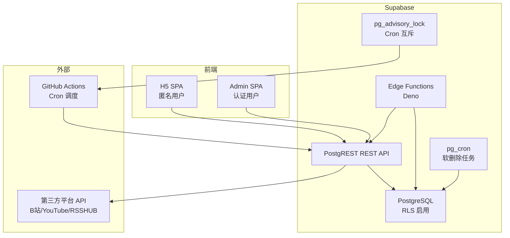
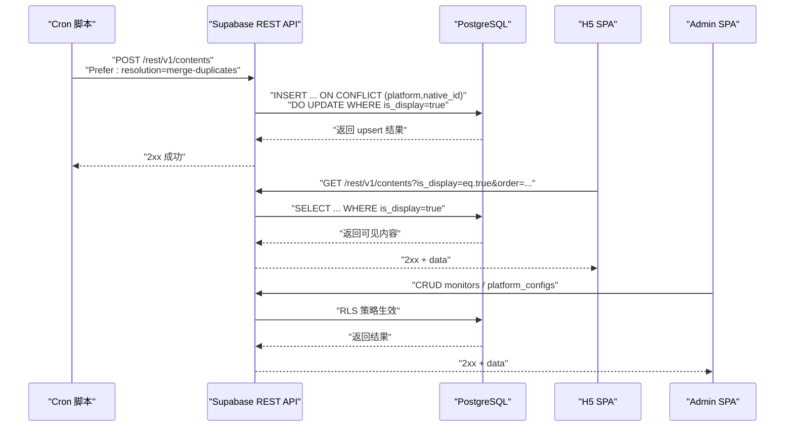
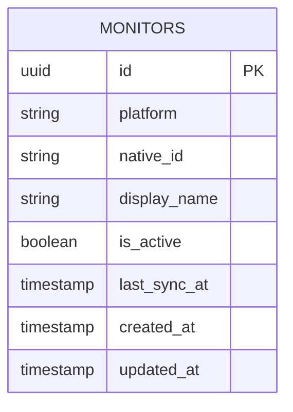
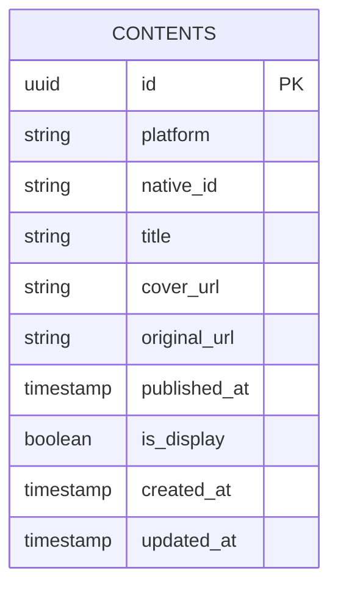
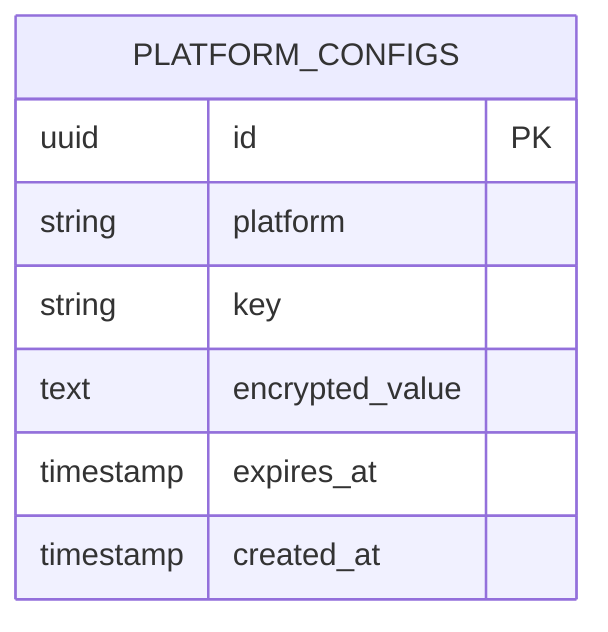
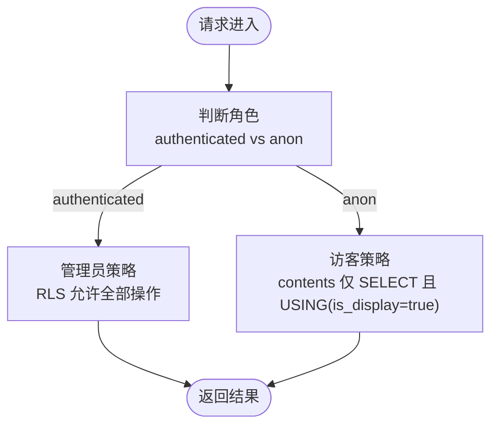
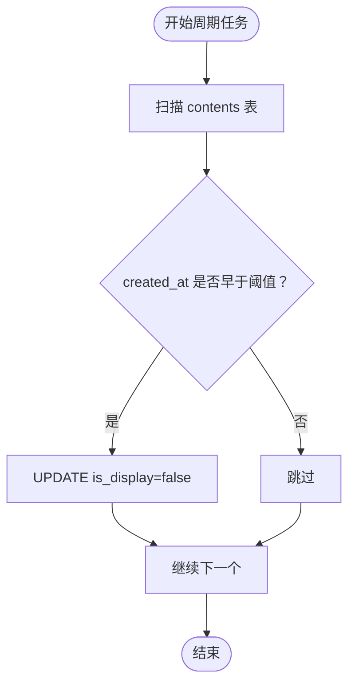
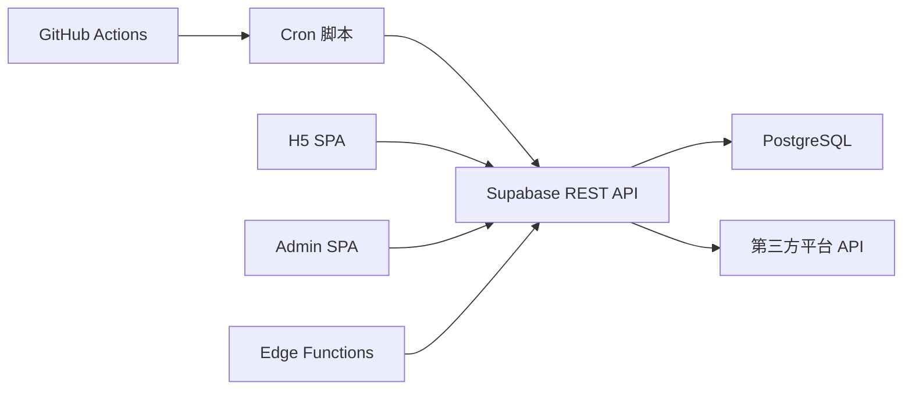

# 数据库设计

<cite>
**本文引用的文件**
- [PROJECT_CONTEXT.md](file://PROJECT_CONTEXT.md)
</cite>

## 目录
1. [简介](#简介)
2. [项目结构](#项目结构)
3. [核心组件](#核心组件)
4. [架构总览](#架构总览)
5. [详细组件分析](#详细组件分析)
6. [依赖分析](#依赖分析)
7. [性能考虑](#性能考虑)
8. [故障排查指南](#故障排查指南)
9. [结论](#结论)
10. [附录](#附录)

## 简介
本文件面向“多平台内容中枢”项目，系统性阐述其基于 Supabase 托管 PostgreSQL 的数据库设计与实现。重点覆盖三张核心表（monitors、contents、platform_configs）的表结构设计、约束关系与索引策略；解释行级安全（RLS）策略如何在管理员与访客之间进行权限隔离；梳理数据访问模式、缓存策略与性能考量；明确数据生命周期管理（软删除、保留与归档）；并给出数据库迁移管理、版本控制与备份恢复的最佳实践建议。

## 项目结构
- 数据库层：Supabase 托管 PostgreSQL（PostgreSQL 15），启用 RLS、pg_cron、advisory_lock。
- 后端接口：PostgREST 自动生成 REST API，配合 Edge Functions（Deno）处理轻量逻辑。
- 数据写入：GitHub Actions Cron 每 30 分钟触发 Node.js 抓取脚本，经 Supabase REST API 写入数据库。
- 数据读取：H5 SPA 通过 REST API 读取 contents 表中 is_display=true 的记录；Admin SPA 读写 monitors、platform_configs。
- 辅助能力：pg_cron 负责软删除任务；pg_advisory_lock 提供 Cron 互斥锁。

图表来源
- [PROJECT_CONTEXT.md: 173-207:173-207](file://PROJECT_CONTEXT.md#L173-L207)
- [PROJECT_CONTEXT.md: 224-239:224-239](file://PROJECT_CONTEXT.md#L224-L239)

章节来源
- [PROJECT_CONTEXT.md: 17-240:17-240](file://PROJECT_CONTEXT.md#L17-L240)

## 核心组件
- monitors 监控表：记录需要抓取的目标（平台、native_id、显示名、状态等），支持管理员 CRUD。
- contents 内容表：聚合来自各平台的内容，支持软删除与访客只读。
- platform_configs 平台配置表：存储敏感配置（如 B站 Cookie），管理员可读写，访客不可见。

章节来源
- [PROJECT_CONTEXT.md: 275-346:275-346](file://PROJECT_CONTEXT.md#L275-L346)

## 架构总览
- 数据访问路径
  - 写入：Cron 脚本 → Supabase REST API（Service Role Key）→ PostgreSQL（UPSERT 去重）。
  - 读取：H5 SPA → Supabase REST API（Anon Key + RLS）→ PostgreSQL（仅 is_display=true）。
  - 配置：Admin SPA → Edge Function → Supabase REST API → PostgreSQL。
- 安全边界
  - 前端仅使用 anon_key；管理员使用 Auth Token；Service Role Key 仅在服务端使用。
  - 所有表启用 RLS，策略显式控制访问。

图表来源
- [PROJECT_CONTEXT.md: 318-333:318-333](file://PROJECT_CONTEXT.md#L318-L333)
- [PROJECT_CONTEXT.md: 431-445:431-445](file://PROJECT_CONTEXT.md#L431-L445)

章节来源
- [PROJECT_CONTEXT.md: 318-346:318-346](file://PROJECT_CONTEXT.md#L318-L346)
- [PROJECT_CONTEXT.md: 431-473:431-473](file://PROJECT_CONTEXT.md#L431-L473)

## 详细组件分析

### monitors 监控表
- 设计理念
  - 记录需要持续抓取的目标，包含平台标识、native_id、显示名、状态字段（如是否激活）等。
  - 通过 Edge Function 的 URL 解析能力，将任意 URL 转换为平台与标识，确保唯一性与可扩展性。
- 字段要点（基于上下文推断）
  - 平台标识、native_id：用于唯一识别目标。
  - 显示名：便于管理端展示与编辑。
  - 状态字段：如 is_active、last_sync_at 等，用于管理端状态面板。
  - 时间戳：created_at、updated_at。
- 约束与索引
  - 唯一性：(platform, native_id) 保证同一平台下目标唯一。
  - 索引：对 platform、native_id、is_active、created_at 建立复合索引，支撑查询与排序。
- RLS 策略
  - 管理员：全部读写。
  - 访客：不可见（默认拒绝）。

图表来源
- [PROJECT_CONTEXT.md: 364-374:364-374](file://PROJECT_CONTEXT.md#L364-L374)

章节来源
- [PROJECT_CONTEXT.md: 275-291:275-291](file://PROJECT_CONTEXT.md#L275-L291)
- [PROJECT_CONTEXT.md: 364-374:364-374](file://PROJECT_CONTEXT.md#L364-L374)

### contents 内容表
- 设计理念
  - 聚合来自各平台的内容，统一字段（标题、封面、原始链接、发布时间等）。
  - 引入 is_display 字段实现软删除，避免物理删除带来的复杂性与数据回溯成本。
  - 通过 UPSERT 去重，保证相同平台+native_id 的内容只保留一条最新有效记录。
- 字段要点（基于上下文推断）
  - 标识：platform、native_id。
  - 内容元数据：title、cover_url、original_url、published_at。
  - 状态：is_display（软删除）、is_deleted（可选）。
  - 时间戳：created_at、updated_at。
- 约束与索引
  - 唯一性：(platform, native_id)。
  - 索引：published_at（降序）、is_display、platform/native_id 组合索引，支撑分页与筛选。
- RLS 策略
  - 管理员：全部读写。
  - 访客：仅 SELECT is_display=true 的记录。

图表来源
- [PROJECT_CONTEXT.md: 376-388:376-388](file://PROJECT_CONTEXT.md#L376-L388)
- [PROJECT_CONTEXT.md: 322-333:322-333](file://PROJECT_CONTEXT.md#L322-L333)

章节来源
- [PROJECT_CONTEXT.md: 322-333:322-333](file://PROJECT_CONTEXT.md#L322-L333)
- [PROJECT_CONTEXT.md: 376-388:376-388](file://PROJECT_CONTEXT.md#L376-L388)

### platform_configs 平台配置表
- 设计理念
  - 存储敏感配置（如 B站 Cookie），通过 Supabase Vault 加密存储，仅管理员可读写。
  - 与 monitors 关联：某些平台的抓取需要凭据（如 B站 Cookie），通过该表集中管理。
- 字段要点（基于上下文推断）
  - 平台标识、配置键名、配置值（加密存储）、有效期、创建时间。
- 约束与索引
  - 唯一性：(platform, key)。
  - 索引：platform、key、created_at。
- RLS 策略
  - 管理员：全部读写。
  - 访客：不可见（默认拒绝）。

图表来源
- [PROJECT_CONTEXT.md: 390-400:390-400](file://PROJECT_CONTEXT.md#L390-L400)

章节来源
- [PROJECT_CONTEXT.md: 292-299:292-299](file://PROJECT_CONTEXT.md#L292-L299)
- [PROJECT_CONTEXT.md: 390-400:390-400](file://PROJECT_CONTEXT.md#L390-L400)

### RLS 策略与权限控制
- 角色模型
  - 管理员：authenticated，具备所有表的读写权限。
  - 访客：anon，仅能读取 contents 表中 is_display=true 的记录。
- 策略实现
  - monitors：管理员全部读写，访客默认拒绝。
  - contents：管理员全部读写；访客仅 SELECT 且 USING (is_display=true)。
  - platform_configs：管理员全部读写，访客默认拒绝。
- 密钥与行为
  - SUPABASE_ANON_KEY：前端使用，受 RLS 约束。
  - SUPABASE_SERVICE_ROLE_KEY：绕过 RLS，仅 Cron 与 Edge Function 使用。
  - Supabase Auth Token：管理员会话，认证为 authenticated。

图表来源
- [PROJECT_CONTEXT.md: 360-400:360-400](file://PROJECT_CONTEXT.md#L360-L400)

章节来源
- [PROJECT_CONTEXT.md: 351-417:351-417](file://PROJECT_CONTEXT.md#L351-L417)

### 数据访问模式与缓存策略
- 访问模式
  - H5 SPA：通过 REST API 读取 contents，使用 is_display=true 过滤与 published_at 排序，结合 limit/offset 分页。
  - Admin SPA：直接 CRUD monitors 与 platform_configs，Edge Function 用于 URL 解析与 B站扫码授权。
- 缓存策略
  - 前端缓存：H5 SPA 可在本地缓存近期分页结果，结合 ETag/Last-Modified 与服务端协商缓存。
  - 服务端缓存：PostgREST 默认具备连接池与查询缓存，结合合理索引提升查询性能。
  - 外部缓存：Cron 抓取时可利用平台 API 的缓存与限速策略，避免重复请求。
- 性能考量
  - 索引：contents 上的 published_at、is_display、platform/native_id 组合索引。
  - 查询：使用 WHERE + ORDER + LIMIT/OFFSET，避免全表扫描。
  - 写入：UPSERT 去重，避免重复写入与索引冲突。

章节来源
- [PROJECT_CONTEXT.md: 431-473:431-473](file://PROJECT_CONTEXT.md#L431-L473)
- [PROJECT_CONTEXT.md: 322-333:322-333](file://PROJECT_CONTEXT.md#L322-L333)

### 数据生命周期管理
- 软删除
  - contents 表通过 is_display 字段实现软删除，避免物理删除带来的复杂性。
  - UPSERT 逻辑中，WHERE contents.is_display = true，防止旧记录复活。
- 保留策略
  - pg_cron 定期执行 SQL UPDATE，将 created_at 早于阈值的记录标记为 is_display=false。
  - 阈值可根据业务需求调整（例如 30 天）。
- 归档规则
  - 建议：将长期不活跃的数据迁移到归档表或冷存储，保留 contents 表的热数据规模可控。
  - 归档后仍需保留必要的检索字段，以便未来恢复或审计。

图表来源
- [PROJECT_CONTEXT.md: 237-239:237-239](file://PROJECT_CONTEXT.md#L237-L239)
- [PROJECT_CONTEXT.md: 322-333:322-333](file://PROJECT_CONTEXT.md#L322-L333)

章节来源
- [PROJECT_CONTEXT.md: 237-239:237-239](file://PROJECT_CONTEXT.md#L237-L239)
- [PROJECT_CONTEXT.md: 322-333:322-333](file://PROJECT_CONTEXT.md#L322-L333)

### 数据库迁移管理、版本控制与备份恢复
- 迁移与版本控制
  - 使用 Supabase 的 migrations 目录管理 SQL 迁移脚本，命名采用数字前缀 + 蛇形（如 001_create_monitors.sql）。
  - 迁移脚本应幂等，先检查对象是否存在再创建或修改。
  - 将迁移脚本纳入 Git 版本控制，每次变更提交时附带对应迁移文件。
- RLS 与策略
  - 在迁移中显式启用 RLS，并创建策略，确保策略随数据库版本一致。
  - 策略命名具有语义性（如 contents_admin_all、contents_anon_read），便于审计与回滚。
- 备份与恢复
  - 利用 Supabase 的备份功能定期导出数据库快照。
  - 恢复时先在测试环境验证迁移与策略，再进行生产恢复。
  - 对敏感数据（如 platform_configs）单独备份，确保加密密钥与数据库一致。
- 最佳实践
  - 迁移前先在开发/预发布环境验证。
  - 对大表变更（如新增索引）安排在低峰时段执行。
  - 记录每次迁移的变更点与影响范围，便于回溯。

章节来源
- [PROJECT_CONTEXT.md: 97-113:97-113](file://PROJECT_CONTEXT.md#L97-L113)

## 依赖分析
- 组件耦合
  - Cron 脚本依赖 Supabase REST API（Service Role Key）写入 contents。
  - H5 SPA 依赖 contents 表的只读访问与 RLS 策略。
  - Admin SPA 依赖 monitors 与 platform_configs 的读写权限。
  - Edge Functions 依赖解析 URL 与 B站扫码授权，间接影响 platform_configs 的写入。
- 外部依赖
  - 第三方平台 API：B站空间 API、YouTube Data API v3、RSSHUB。
  - GitHub Actions：调度 Cron 脚本，触发数据抓取。
- 循环依赖
  - 无循环依赖：数据流单向（抓取→写入→读取），RLS 策略为纯访问控制，不改变数据流向。

图表来源
- [PROJECT_CONTEXT.md: 173-207:173-207](file://PROJECT_CONTEXT.md#L173-L207)

章节来源
- [PROJECT_CONTEXT.md: 173-207:173-207](file://PROJECT_CONTEXT.md#L173-L207)

## 性能考虑
- 查询性能
  - contents 表使用 published_at 降序排序与 is_display 过滤，结合 LIMIT/ OFFSET 分页。
  - 建议在 platform、native_id、is_display 上建立复合索引，减少排序与过滤成本。
- 写入性能
  - UPSERT 去重避免重复写入，减少索引冲突与回滚。
  - Cron 抓取时按平台串行、平台间并行，降低第三方 API 限速压力。
- 缓存与连接
  - PostgREST 默认连接池与查询缓存，结合合理索引与查询计划提升吞吐。
  - 前端可缓存近期分页结果，减少重复请求。
- 索引策略
  - contents：(platform, native_id) 唯一索引；(is_display, published_at) 复合索引；(platform, is_display) 复合索引。
  - monitors：(platform, native_id) 唯一索引；(is_active, created_at) 复合索引。
  - platform_configs：(platform, key) 唯一索引。

章节来源
- [PROJECT_CONTEXT.md: 322-333:322-333](file://PROJECT_CONTEXT.md#L322-L333)

## 故障排查指南
- 常见问题
  - 访客无法看到内容：确认 contents 表策略是否正确，is_display 是否为 true。
  - 写入失败：检查 Prefer: resolution=merge-duplicates 是否设置，以及 (platform, native_id) 是否唯一。
  - Cron 写入异常：检查 SUPABASE_SERVICE_ROLE_KEY 是否正确传递，第三方 API 是否可用。
- 调试步骤
  - 使用 Supabase Dashboard 查看策略与索引状态。
  - 在测试环境模拟请求，逐步定位问题（RLS、索引、查询条件）。
  - 查看 pg_cron 任务日志，确认软删除任务是否按预期执行。
- 安全与合规
  - 确保 Service Role Key 不泄露至前端。
  - 对敏感配置（Cookie、API Key）使用 Supabase Vault 加密存储。

章节来源
- [PROJECT_CONTEXT.md: 402-417:402-417](file://PROJECT_CONTEXT.md#L402-L417)
- [PROJECT_CONTEXT.md: 237-239:237-239](file://PROJECT_CONTEXT.md#L237-L239)

## 结论
本数据库设计围绕“最小权限 + 软删除 + 去重写入”的核心思想展开：通过 RLS 明确管理员与访客的边界；通过 is_display 实现软删除与数据保留策略；通过 UPSERT 去重保障数据一致性与性能。配合 Cron 调度、Edge Functions 与 PostgREST，形成从抓取、清洗、写入到展示的完整闭环。建议在后续迭代中完善索引与分区策略，进一步优化大规模数据场景下的查询与写入性能。

## 附录
- 名词解释
  - RLS：Row Level Security，行级安全策略。
  - UPSERT：插入或更新（ON CONFLICT）。
  - Service Role Key：绕过 RLS 的高权限密钥，仅在服务端使用。
  - Anon Key：前端公开使用的密钥，受 RLS 保护。
- 参考规范
  - Supabase Edge Functions 组织方式与命名规范。
  - Monorepo 共享类型与版本同步策略。
  - GitHub Actions Secrets 管理与 Cron 工作流规范。