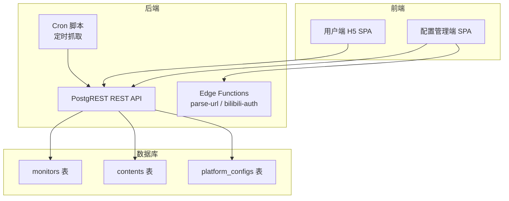
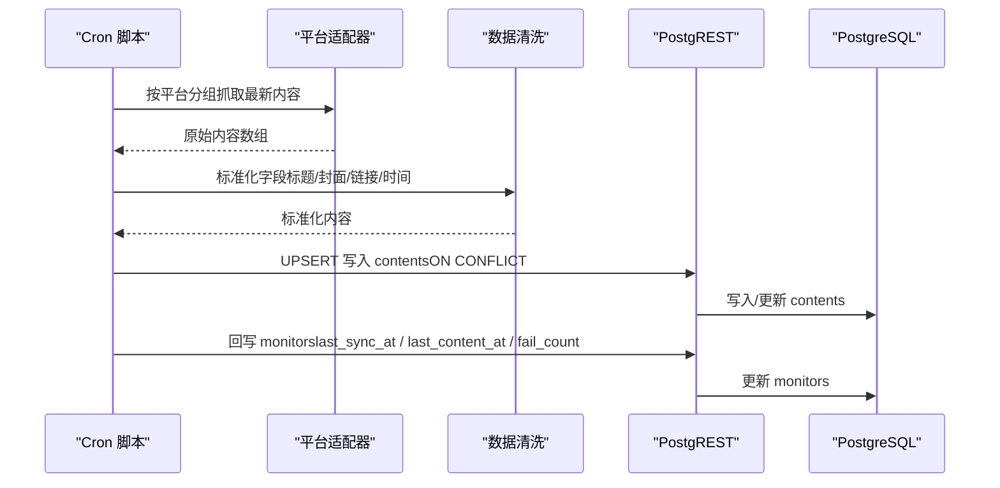
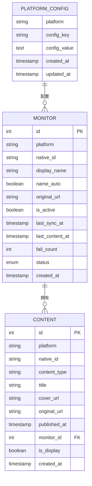
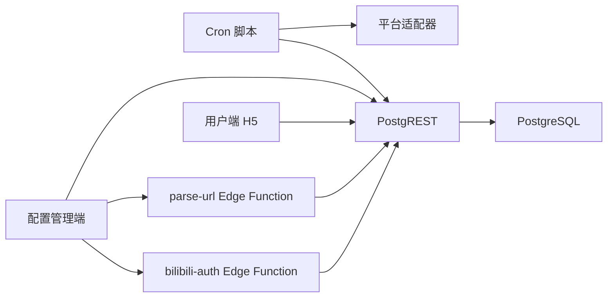

# 数据模型

<cite>
**本文引用的文件**   
- [PROJECT_CONTEXT.md](file://PROJECT_CONTEXT.md)
- [多平台中枢_PRD.md](file://多平台中枢_PRD.md)
</cite>

## 目录
1. [简介](#简介)
2. [项目结构](#项目结构)
3. [核心数据模型](#核心数据模型)
4. [架构总览](#架构总览)
5. [详细组件分析](#详细组件分析)
6. [依赖分析](#依赖分析)
7. [性能考虑](#性能考虑)
8. [故障排查指南](#故障排查指南)
9. [结论](#结论)
10. [附录](#附录)

## 简介
本文件围绕“多平台内容中枢”的核心数据模型进行系统化说明，重点覆盖三大模型：
- Monitor（监控模型）：用于表示各平台的博主信息，承载监控状态、同步信息与平台标识。
- Content（内容模型）：用于表示从各平台抓取的内容卡片，统一跨平台信息结构，支撑聚合展示与跳转。
- PlatformConfig（平台配置模型）：用于存储平台相关的配置信息，例如敏感凭据与平台特性。

文档将从属性定义、数据类型、业务含义、模型关系、序列化/反序列化示例、验证规则与业务约束等方面展开，并结合项目上下文与PRD中的数据流与约束进行说明。

## 项目结构
项目采用 Monorepo 架构，核心数据模型的类型定义与共享常量位于 packages/shared 中，作为前后端的“单一事实来源”。数据库层面，Supabase 承载 monitors、contents、platform_configs 三张表，配合 PostgREST 提供 REST API，Edge Functions 提供轻量逻辑（如 URL 解析、B站扫码授权），Cron 脚本负责定时抓取与数据写入。

图表来源
- [PROJECT_CONTEXT.md: 55-141:55-141](file://PROJECT_CONTEXT.md#L55-L141)
- [PROJECT_CONTEXT.md: 173-207:173-207](file://PROJECT_CONTEXT.md#L173-L207)

章节来源
- [PROJECT_CONTEXT.md: 55-141:55-141](file://PROJECT_CONTEXT.md#L55-L141)
- [PROJECT_CONTEXT.md: 173-207:173-207](file://PROJECT_CONTEXT.md#L173-L207)

## 核心数据模型
本节对 Monitor、Content、PlatformConfig 三大模型进行逐一说明，包括属性定义、数据类型、业务含义与典型取值范围。

- Monitor（监控模型）
  - 用途：记录各平台博主的监控信息，包含平台标识、原生 ID、显示名称、状态、同步时间等。
  - 关键字段（来源于 PRD 表结构与业务流程）：
    - id：整型，主键
    - platform：字符串，平台标识（如 douyin、bilibili、zhihu、youtube）
    - native_id：字符串，平台内博主唯一标识
    - display_name：字符串，显示名称（可手动修改）
    - name_auto：布尔，名称是否为自动获取
    - original_url：字符串，原始粘贴链接
    - is_active：布尔，是否开启监控
    - last_sync_at：时间戳，最后成功同步时间
    - last_content_at：时间戳，最后获得新内容的时间
    - fail_count：整型，连续失败次数
    - status：枚举，normal / cookie_expired / rate_limited
    - created_at：时间戳，创建时间
  - 业务含义：用于控制与跟踪各博主的抓取状态、活跃度与异常情况，支撑配置管理端的开关、状态展示与告警。

- Content（内容模型）
  - 用途：记录从各平台抓取的内容卡片，统一跨平台字段，支撑信息流展示与跳转。
  - 关键字段（来源于 PRD 表结构与业务流程）：
    - id：整型，主键
    - platform：字符串，平台标识
    - native_id：字符串，平台内内容唯一标识
    - content_type：字符串，内容类型（video / article / question / answer / post）
    - title：字符串，内容标题
    - cover_url：字符串，封面图链接
    - original_url：字符串，原文链接
    - published_at：时间戳，原始发布时间
    - monitor_id：整型，关联的博主监控 ID（外键）
    - is_display：布尔，是否在 H5 信息流中展示（默认 true；超 30 天软删除后为 false）
    - created_at：时间戳，入库时间
  - 业务含义：作为信息流的最小单元，承载标题、封面、链接与发布时间，用于聚合展示与 Deep Link 跳转。

- PlatformConfig（平台配置模型）
  - 用途：存储平台相关的配置信息，如敏感凭据（Cookie）、API Key、代理设置、Deep Link Schema 模板与平台 Tag 配色等。
  - 关键字段（来源于上下文与迁移策略描述）：
    - platform：字符串，平台标识（如 bilibili、youtube、zhihu）
    - config_key：字符串，配置键（如 cookie、api_key、proxy、deep_link_template）
    - config_value：文本，配置值（敏感信息通过 Supabase Vault 加密存储）
    - created_at / updated_at：时间戳，记录创建与更新时间
  - 业务含义：集中管理平台配置与凭据，保障抓取与授权流程的可维护性与安全性。

章节来源
- [多平台中枢_PRD.md: 327-361:327-361](file://多平台中枢_PRD.md#L327-L361)
- [PROJECT_CONTEXT.md: 364-400:364-400](file://PROJECT_CONTEXT.md#L364-L400)

## 架构总览
数据模型在系统中的流转如下：
- 写入流（Cron 抓取）：Cron 脚本按平台分组抓取，经数据清洗与去重后写入 contents 表；同时回写 monitors 表的状态与时间信息。
- 读取流（H5 浏览）：H5 SPA 通过 PostgREST 查询 contents 表（仅 is_display = true），按 published_at 倒序展示。
- 配置流（管理端）：Admin SPA 调用 Edge Functions 解析 URL 并写入 monitors；B站扫码授权将 Cookie 加密存储于 platform_configs。

图表来源
- [PROJECT_CONTEXT.md: 227-239:227-239](file://PROJECT_CONTEXT.md#L227-L239)
- [PROJECT_CONTEXT.md: 318-333:318-333](file://PROJECT_CONTEXT.md#L318-L333)
- [多平台中枢_PRD.md: 654-717:654-717](file://多平台中枢_PRD.md#L654-L717)

章节来源
- [PROJECT_CONTEXT.md: 227-239:227-239](file://PROJECT_CONTEXT.md#L227-L239)
- [PROJECT_CONTEXT.md: 318-333:318-333](file://PROJECT_CONTEXT.md#L318-L333)
- [多平台中枢_PRD.md: 654-717:654-717](file://多平台中枢_PRD.md#L654-L717)

## 详细组件分析

### Monitor 模型
- 属性与类型
  - id: 整型（主键）
  - platform: 字符串（平台标识）
  - native_id: 字符串（博主唯一标识）
  - display_name: 字符串（显示名称）
  - name_auto: 布尔（是否自动获取）
  - original_url: 字符串（原始链接）
  - is_active: 布尔（是否开启）
  - last_sync_at / last_content_at / created_at: 时间戳
  - fail_count: 整型（连续失败次数）
  - status: 枚举（normal / cookie_expired / rate_limited）
- 业务含义
  - 控制与跟踪各博主的抓取状态与活跃度，支撑配置管理端的开关、状态展示与告警。
- 关系映射
  - 一对一/多对一：PlatformConfig（平台配置，按 platform 聚合）
  - 一对多：Content（一个 Monitor 可对应多条 Content）
- 序列化/反序列化示例
  - 典型 JSON 结构（字段示意）：{"id":1,"platform":"bilibili","native_id":"12345","display_name":"B站_12345","is_active":true,"status":"normal","last_sync_at":"2026-06-20T10:00:00Z","created_at":"2026-06-19T09:00:00Z"}
  - 前端/后端传输：通过 PostgREST REST API（application/json），请求头包含 apikey 与 Authorization。
- 验证规则与约束
  - 唯一性：(platform, native_id) 唯一，防止重复添加。
  - 状态机：fail_count 与 status 的联动，连续失败触发告警与状态变更。
  - RLS：管理员可读写，匿名用户不可见。

章节来源
- [多平台中枢_PRD.md: 327-344:327-344](file://多平台中枢_PRD.md#L327-L344)
- [PROJECT_CONTEXT.md: 364-374:364-374](file://PROJECT_CONTEXT.md#L364-L374)
- [PROJECT_CONTEXT.md: 437-445:437-445](file://PROJECT_CONTEXT.md#L437-L445)

### Content 模型
- 属性与类型
  - id: 整型（主键）
  - platform: 字符串（平台标识）
  - native_id: 字符串（内容唯一标识）
  - content_type: 字符串（video / article / question / answer / post）
  - title: 字符串（标题）
  - cover_url: 字符串（封面图链接）
  - original_url: 字符串（原文链接）
  - published_at: 时间戳（原始发布时间）
  - monitor_id: 整型（外键，关联 Monitor）
  - is_display: 布尔（是否展示）
  - created_at: 时间戳（入库时间）
- 业务含义
  - 作为信息流的最小单元，统一跨平台字段，支撑聚合展示与 Deep Link 跳转。
- 关系映射
  - 多对一：Monitor（每条 Content 关联一个 Monitor）
  - 一对一/多对一：PlatformConfig（按 platform 聚合，用于跳转模板与配色）
- 序列化/反序列化示例
  - 典型 JSON 结构（字段示意）：{"id":101,"platform":"bilibili","native_id":"BV1xx411c7mD","content_type":"video","title":"视频标题","cover_url":"https://...","original_url":"https://...","published_at":"2026-06-20T10:00:00Z","monitor_id":1,"is_display":true,"created_at":"2026-06-20T11:00:00Z"}
  - 前端/后端传输：通过 PostgREST REST API，查询时强制添加 is_display=true 条件。
- 验证规则与约束
  - 唯一性：(platform, native_id) 唯一，去重写入（UPSERT）。
  - 防复活：软删除记录（is_display=false）不得被重置状态。
  - 生命周期：超过 30 天自动标记为软删除（is_display=false）。

章节来源
- [多平台中枢_PRD.md: 345-361:345-361](file://多平台中枢_PRD.md#L345-L361)
- [PROJECT_CONTEXT.md: 376-388:376-388](file://PROJECT_CONTEXT.md#L376-L388)
- [PROJECT_CONTEXT.md: 443-444:443-444](file://PROJECT_CONTEXT.md#L443-L444)

### PlatformConfig 模型
- 属性与类型
  - platform: 字符串（平台标识）
  - config_key: 字符串（配置键）
  - config_value: 文本（配置值，敏感信息加密存储）
  - created_at / updated_at: 时间戳
- 业务含义
  - 集中管理平台配置与凭据，如 Cookie、API Key、代理、Deep Link Schema 模板与平台 Tag 配色。
- 关系映射
  - 一对多：Monitor（一个平台配置可对应多个 Monitor）
- 序列化/反序列化示例
  - 典型 JSON 结构（字段示意）：{"platform":"bilibili","config_key":"cookie","config_value":"加密的SESSDATA...","created_at":"2026-06-19T09:00:00Z","updated_at":"2026-06-20T09:00:00Z"}
  - 前端/后端传输：通过 PostgREST REST API，管理员可读写。
- 验证规则与约束
  - RLS：管理员可读写，匿名用户不可见。
  - 加密存储：敏感信息通过 Supabase Vault 加密。

章节来源
- [PROJECT_CONTEXT.md: 390-400:390-400](file://PROJECT_CONTEXT.md#L390-L400)
- [PROJECT_CONTEXT.md: 219-222:219-222](file://PROJECT_CONTEXT.md#L219-L222)

### 模型关系图

图表来源
- [多平台中枢_PRD.md: 327-361:327-361](file://多平台中枢_PRD.md#L327-L361)
- [PROJECT_CONTEXT.md: 364-400:364-400](file://PROJECT_CONTEXT.md#L364-L400)

## 依赖分析
- 组件耦合与内聚
  - Monitor 与 Content：通过 monitor_id 建立强关联，体现“一个博主对应多条内容”的内聚关系。
  - PlatformConfig 与 Monitor：通过 platform 建立弱关联，体现“平台配置影响多个博主”的解耦关系。
- 直接与间接依赖
  - Cron 脚本直接依赖平台适配器与 PostgREST；间接依赖 Edge Functions（URL 解析、B站扫码授权）。
  - 前端（Admin/H5）仅依赖 PostgREST，不直接调用第三方平台 API。
- 外部依赖与集成点
  - Supabase：PostgREST、RLS、Vault（加密）、pg_cron（软删除）、advisory_lock（互斥）。
  - 第三方平台：B站 Cookie、YouTube API Key、RSSHub API Key。
- 接口契约
  - PostgREST 约定：统一的 REST 路径、请求头（apikey、Authorization、Prefer）与响应格式。
  - Edge Functions：统一请求/响应格式与错误码规范。

图表来源
- [PROJECT_CONTEXT.md: 173-207:173-207](file://PROJECT_CONTEXT.md#L173-L207)
- [PROJECT_CONTEXT.md: 420-509:420-509](file://PROJECT_CONTEXT.md#L420-L509)

章节来源
- [PROJECT_CONTEXT.md: 173-207:173-207](file://PROJECT_CONTEXT.md#L173-L207)
- [PROJECT_CONTEXT.md: 420-509:420-509](file://PROJECT_CONTEXT.md#L420-L509)

## 性能考虑
- 查询性能
  - 信息流查询强制添加 is_display=true 条件，避免软删除记录参与排序与分页。
  - 按 published_at 倒序查询，建议在该字段建立索引以提升排序性能。
- 写入性能
  - UPSERT 基于 (platform, native_id) 唯一索引，避免重复写入；软删除记录不被重置，防止旧数据复活。
  - Cron 按平台分组串行抓取，同平台请求间隔 ≥ 1.5 秒，降低反爬风险并提升整体吞吐。
- 缓存与降级
  - H5 在 Cookie 失效等异常情况下继续展示历史缓存，保证用户体验。
- 存储与生命周期
  - 单条记录大小控制在约 1 KB（上限 3 KB），30 天后软删除，保留历史数据用于分析。

## 故障排查指南
- 常见问题与处理
  - 同一博主重复添加：后端去重校验 (platform + native_id)，返回 409。
  - B站 Cookie 过期：适配器请求返回鉴权失败 → fail_count +1 → 状态流转为 cookie_expired。
  - 知乎反爬触发验证码：适配器失败 → 降级尝试 RSSHub → 仍失败则 fail_count +1。
  - YouTube API 配额用尽：适配器返回配额错误 → 本轮跳过，下轮 4 小时后重试。
  - 微信/支付宝内点击卡片：UA 检测为受限环境 → 跳过 Deep Link，直接弹出“复制链接 + 引导在浏览器打开”弹窗。
  - 数据库连接失败：Cron 记录错误日志，跳过本轮，30 分钟后重试。
  - 封面图 URL 失效：前端 img onerror → 显示平台默认占位图。
  - 上一轮 Cron 未完成：互斥锁检测 → 跳过本轮，记录日志。
  - Cron 抓取期间管理员删除了某 Monitor：写回前校验 → 不存在则跳过写回。
- 告警与恢复
  - 连续失败 ≥3 次 → 状态变红并推送通知；管理员修复后手动重置。
  - 监控开关关闭 → Cron 跳过该 Monitor 的抓取。

章节来源
- [多平台中枢_PRD.md: 928-951:928-951](file://多平台中枢_PRD.md#L928-L951)
- [PROJECT_CONTEXT.md: 213-222:213-222](file://PROJECT_CONTEXT.md#L213-L222)

## 结论
Monitor、Content、PlatformConfig 三类模型共同构成“多平台内容中枢”的数据基石。通过统一的 REST API、严格的 RLS 与加密存储策略，以及基于 Cron 的定时抓取与去重机制，系统实现了跨平台内容的聚合展示与可靠跳转。模型间的一对多关系清晰、职责边界明确，既满足当前四平台覆盖，也为未来扩展更多平台提供了良好的可维护性与扩展性。

## 附录
- 数据模型序列化/反序列化要点
  - 统一使用 application/json，请求头包含 apikey 与 Authorization。
  - 创建/更新时使用 Prefer: return=representation，确保返回完整对象。
  - 写入时使用 Prefer: resolution=merge-duplicates，启用 UPSERT。
- 平台枚举与内容类型
  - 平台：douyin、bilibili、zhihu、youtube
  - 内容类型：video、article、question、answer、post
- 安全与合规
  - Service Role Key 永不出现在前端；敏感信息通过 Supabase Vault 加密存储。
  - RSSHub 必须启用 API Key 鉴权，防止公网暴露。