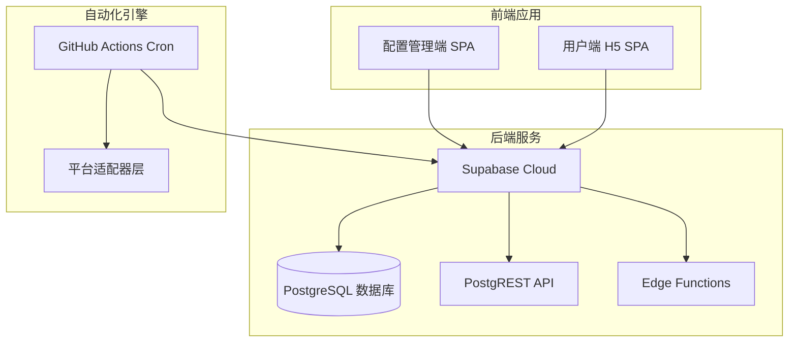
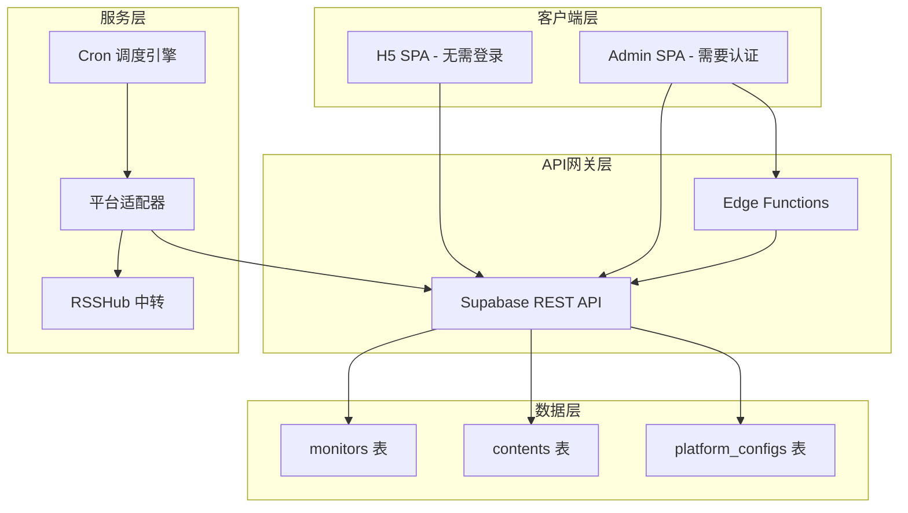
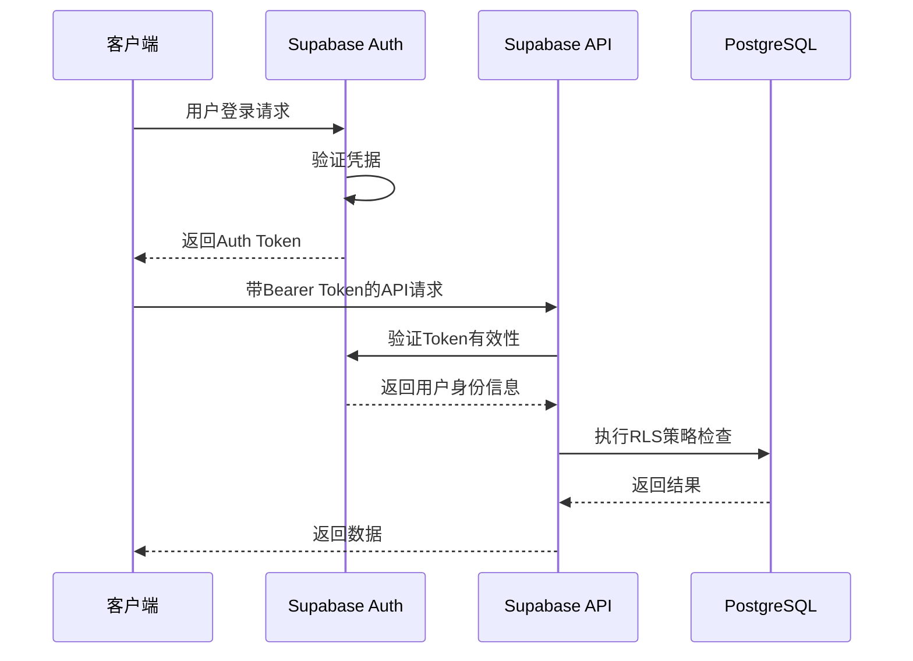
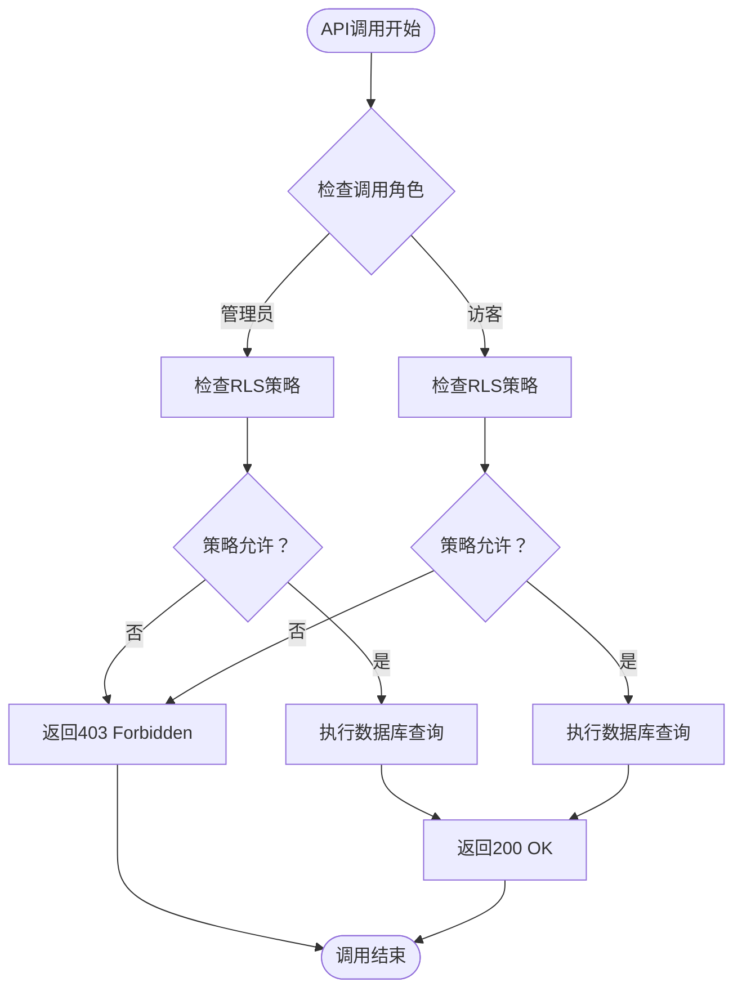
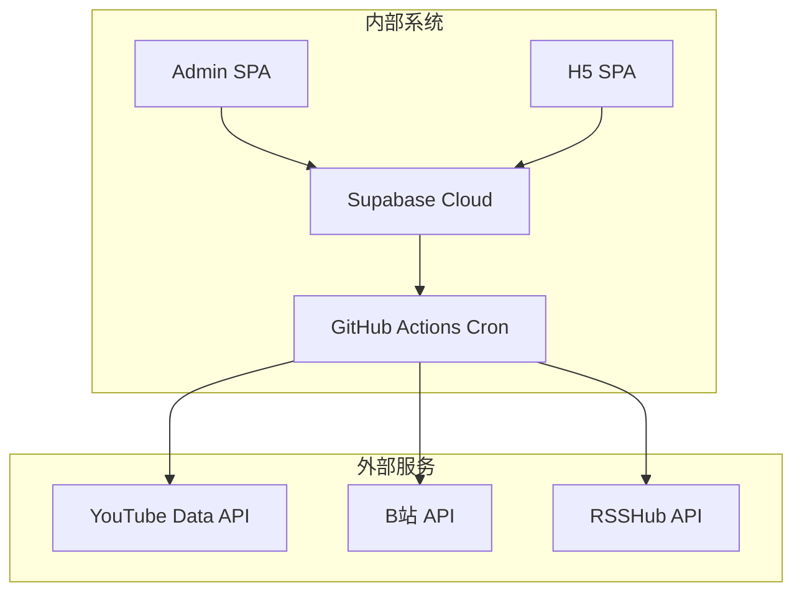

# 权限体系

<cite>
**本文档引用的文件**
- [PROJECT_CONTEXT.md](file://PROJECT_CONTEXT.md)
</cite>

## 目录
1. [简介](#简介)
2. [项目结构](#项目结构)
3. [核心组件](#核心组件)
4. [架构总览](#架构总览)
5. [详细组件分析](#详细组件分析)
6. [依赖关系分析](#依赖关系分析)
7. [性能考虑](#性能考虑)
8. [故障排除指南](#故障排除指南)
9. [结论](#结论)

## 简介

多平台内容中枢项目采用极简双角色模型，通过Supabase的Row Level Security（RLS）策略实现精细的数据库权限控制。该项目是一个个人/小团队工具，通过Supabase Cloud提供完整的后端服务，包括PostgreSQL数据库、PostgREST API、Edge Functions等。

系统的核心设计理念是"前端只使用匿名密钥，服务端拥有完全权限"，通过RLS策略确保数据访问的安全性和隔离性。管理员角色拥有对所有表的完全读写权限，而访客角色仅能访问标记为显示的内容。

## 项目结构

项目采用Monorepo架构，主要分为以下几个层次：

**图表来源**
- [PROJECT_CONTEXT.md:55-141](file://PROJECT_CONTEXT.md#L55-L141)

**章节来源**
- [PROJECT_CONTEXT.md:49-141](file://PROJECT_CONTEXT.md#L49-L141)

## 核心组件

### 角色模型

系统采用极简双角色模型：

| 角色 | 身份 | 访问方式 | 权限范围 |
|---|---|---|---|
| **管理员** | Supabase Auth 认证用户（邮箱+密码） | Admin SPA（登录后） | monitors / contents / platform_configs 全部读写 |
| **访客** | 匿名用户（anon） | H5 SPA（无需登录） | contents 表只读（仅 `is_display = true` 的记录） |

### RLS策略实现

所有数据库表都启用了Row Level Security，通过明确的策略定义实现访问控制：

#### monitors表策略
- 管理员：完全读写权限
- 访客：默认拒绝访问

#### contents表策略  
- 管理员：完全读写权限
- 访客：仅允许SELECT查询且必须满足`is_display = true`条件

#### platform_configs表策略
- 管理员：完全读写权限
- 访客：默认拒绝访问

**章节来源**
- [PROJECT_CONTEXT.md:349-417](file://PROJECT_CONTEXT.md#L349-L417)

## 架构总览

系统采用分层架构设计，确保数据流向清晰和权限边界明确：

**图表来源**
- [PROJECT_CONTEXT.md:169-206](file://PROJECT_CONTEXT.md#L169-L206)

**章节来源**
- [PROJECT_CONTEXT.md:169-240](file://PROJECT_CONTEXT.md#L169-L240)

## 详细组件分析

### 数据库表结构与权限

#### monitors表
- **用途**：存储监控目标的元数据
- **管理员权限**：完全读写，支持CRUD操作
- **访客权限**：无访问权限
- **典型操作**：添加监控目标、更新状态、删除监控

#### contents表  
- **用途**：存储抓取到的内容数据
- **管理员权限**：完全读写，支持内容发布/撤回
- **访客权限**：只读，仅能查看标记为显示的内容
- **显示控制**：通过`is_display`字段控制内容可见性

#### platform_configs表
- **用途**：存储平台配置和敏感信息
- **管理员权限**：完全读写，包含加密的Cookie等
- **访客权限**：无访问权限
- **安全特性**：敏感信息通过Supabase Vault加密存储

### Supabase认证系统集成

#### 认证流程

**图表来源**
- [PROJECT_CONTEXT.md:408](file://PROJECT_CONTEXT.md#L408)

#### 角色映射机制

- **管理员**：通过邮箱+密码认证，获得`authenticated`角色
- **访客**：匿名访问，使用`anon`角色
- **系统角色**：`service_role`用于后台作业，绕过RLS

**章节来源**
- [PROJECT_CONTEXT.md:349-417](file://PROJECT_CONTEXT.md#L349-L417)

### API接口规范与权限控制

#### Supabase REST API规范

系统使用PostgREST自动生成REST API，遵循标准的RESTful约定：

**请求头规范**：
- `apikey`: 使用`SUPABASE_ANON_KEY`或`SUPABASE_SERVICE_ROLE_KEY`
- `Authorization`: Bearer {token}（管理员认证）
- `Content-Type`: application/json
- `Prefer`: return=representation（返回完整对象）

**典型API调用**：

**图表来源**
- [PROJECT_CONTEXT.md:431-473](file://PROJECT_CONTEXT.md#L431-L473)

**章节来源**
- [PROJECT_CONTEXT.md:420-473](file://PROJECT_CONTEXT.md#L420-L473)

### Edge Functions权限控制

系统使用Deno Edge Functions处理轻量级服务端逻辑：

#### parse-url函数
- **用途**：解析URL并识别平台
- **权限**：使用`SUPABASE_ANON_KEY`或管理员Auth Token
- **输出**：平台标识、原生ID、显示名称

#### bilibili-auth函数
- **用途**：处理B站扫码登录流程
- **权限**：使用`SUPABASE_ANON_KEY`或管理员Auth Token
- **功能**：生成二维码、轮询扫码状态、存储Cookie

**章节来源**
- [PROJECT_CONTEXT.md:475-568](file://PROJECT_CONTEXT.md#L475-L568)

## 依赖关系分析

### 外部依赖

**图表来源**
- [PROJECT_CONTEXT.md:194-206](file://PROJECT_CONTEXT.md#L194-L206)

### 内部依赖关系

系统内部各组件之间的依赖关系清晰明确：

- **前端应用**：Admin SPA和H5 SPA都依赖Supabase REST API
- **后台作业**：Cron脚本依赖平台适配器和外部API
- **Edge Functions**：处理特定的轻量级逻辑
- **数据库**：通过RLS策略实现权限控制

**章节来源**
- [PROJECT_CONTEXT.md:169-240](file://PROJECT_CONTEXT.md#L169-L240)

## 性能考虑

### RLS性能影响

- **策略评估**：每次查询都会评估RLS策略，但开销相对较小
- **缓存机制**：Supabase内置查询缓存，减少重复计算
- **索引优化**：对常用查询字段建立适当索引

### API性能优化

- **批量操作**：使用PostgREST的批量插入/更新功能
- **分页查询**：合理设置limit和offset参数
- **条件过滤**：在查询中使用适当的WHERE条件

## 故障排除指南

### 常见权限问题

#### 问题1：管理员无法访问数据
**症状**：登录后仍然无法看到数据
**排查步骤**：
1. 检查Auth Token是否正确传递
2. 验证用户是否已激活
3. 确认RLS策略是否正确配置

#### 问题2：访客能看到不应显示的内容
**症状**：访客能够看到标记为隐藏的内容
**排查步骤**：
1. 检查contents表的RLS策略
2. 验证is_display字段的值
3. 确认查询条件是否包含显示过滤

#### 问题3：Edge Functions调用失败
**症状**：URL解析或扫码登录功能异常
**排查步骤**：
1. 检查Edge Function的Auth Token
2. 验证外部API的可用性
3. 查看函数日志输出

### 权限测试用例

#### 管理员权限测试
- **测试场景**：管理员登录后访问所有表
- **预期结果**：完全读写权限
- **验证方法**：执行CRUD操作并检查返回状态

#### 访客权限测试  
- **测试场景**：匿名用户访问contents表
- **预期结果**：只能读取is_display=true的内容
- **验证方法**：查询contents表并验证过滤条件

#### Edge Functions测试
- **测试场景**：调用parse-url和bilibili-auth函数
- **预期结果**：正确的URL解析和扫码登录流程
- **验证方法**：检查函数响应和数据库变更

**章节来源**
- [PROJECT_CONTEXT.md:600-614](file://PROJECT_CONTEXT.md#L600-L614)

## 结论

多平台内容中枢项目的权限体系设计体现了"最小权限原则"和"纵深防御"的安全理念。通过Supabase的RLS策略，系统实现了精确的访问控制，确保了数据的安全性和完整性。

### 设计优势

1. **简洁明了**：极简双角色模型降低了复杂性
2. **安全可靠**：前端仅使用匿名密钥，服务端拥有完全权限
3. **易于维护**：RLS策略集中管理，便于审计和修改
4. **扩展性强**：支持新的表和角色，保持一致的安全模型

### 最佳实践建议

1. **定期审计**：定期检查RLS策略的有效性
2. **监控告警**：建立权限相关的监控和告警机制
3. **文档维护**：保持权限文档与实际实现同步
4. **安全培训**：对管理员进行权限管理和安全意识培训

通过这种设计，系统既保证了功能的完整性，又确保了数据的安全性，为个人和小团队提供了可靠的权限管理解决方案。