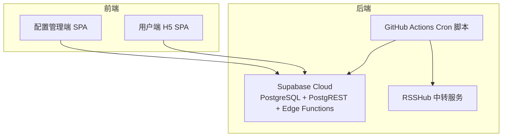
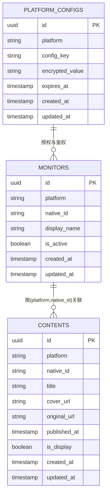
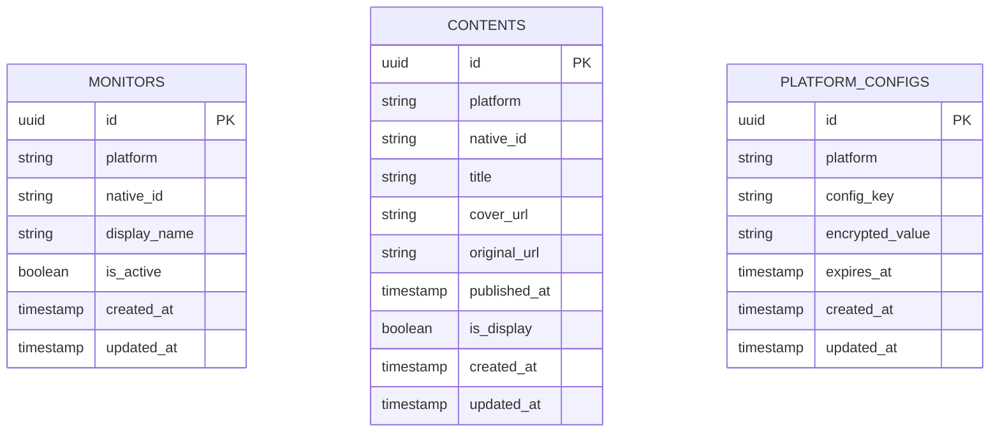
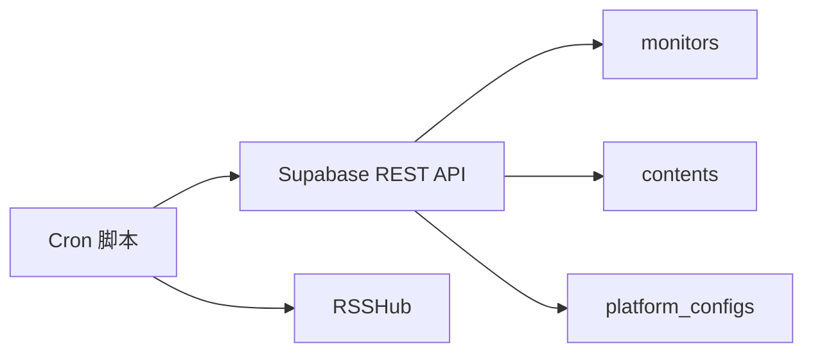

# 表结构设计

<cite>
**本文档引用的文件**
- [PROJECT_CONTEXT.md](file://PROJECT_CONTEXT.md)
- [多平台中枢_PRD.md](file://多平台中枢_PRD.md)
</cite>

## 目录
1. [简介](#简介)
2. [项目结构](#项目结构)
3. [核心组件](#核心组件)
4. [架构概览](#架构概览)
5. [详细组件分析](#详细组件分析)
6. [依赖分析](#依赖分析)
7. [性能考虑](#性能考虑)
8. [故障排除指南](#故障排除指南)
9. [结论](#结论)

## 简介
本文件面向多平台内容中枢（Content Hub）的数据库表结构设计，聚焦于三大核心表：monitors（监控表）、contents（内容表）、platform_configs（平台配置表）。文档从设计理念、字段定义、约束与索引策略、表间关系与外键约束、ER 图与字段对照表、命名规范与数据验证规则等方面进行系统阐述，并结合项目上下文中的迁移与策略信息，提供可执行的建模与实现指导。

## 项目结构
- 项目采用 Monorepo 架构，数据库相关配置位于 Supabase 项目中，包含迁移脚本、种子数据与配置文件。
- 数据库层由 Supabase 提供，使用 PostgreSQL 15，配合 PostgREST 自动生成 REST API、RLS（行级安全）策略以及 pg_cron 软删除任务。
- 三张核心表分别承载“监控目标”“聚合内容”“平台配置与敏感信息”的持久化需求，支撑前端管理端与用户端的读写场景。

**图表来源**
- [PROJECT_CONTEXT.md: 173-206:173-206](file://PROJECT_CONTEXT.md#L173-L206)

**章节来源**
- [PROJECT_CONTEXT.md: 97-141:97-141](file://PROJECT_CONTEXT.md#L97-L141)

## 核心组件
本节对三大核心表进行总体说明，涵盖设计目标、典型字段与约束、索引策略及与其他表的关系。

- monitors（监控表）
  - 设计目标：记录需要持续抓取的目标（如博主主页、频道等），支持增删改查与状态管理。
  - 关键字段：包含平台标识、原生 ID、显示名称、状态标志、时间戳等。
  - 约束与索引：建议主键、唯一索引（平台+原生ID组合）、状态过滤索引；RLS 策略仅允许认证用户访问。
  - 外键：无外键，但与 contents 的去重逻辑通过平台+原生ID关联。

- contents（内容表）
  - 设计目标：存储聚合后的内容卡片，支持分页查询、筛选与软删除。
  - 关键字段：平台标识、原生ID、标题、封面、原始链接、发布时间、是否展示、时间戳等。
  - 约束与索引：唯一索引（平台+原生ID）；RLS 策略对匿名用户仅允许读取 is_display=true 的记录。
  - 外键：无外键，但与 monitors 的关联体现在抓取与去重逻辑中。

- platform_configs（平台配置表）
  - 设计目标：集中存储平台配置与敏感信息（如 Cookie、API Key），通过 Supabase Vault 加密存储。
  - 关键字段：平台标识、配置键、加密值、有效期、时间戳等。
  - 约束与索引：建议主键、唯一索引（平台+配置键）；RLS 策略仅允许认证用户访问。
  - 外键：无外键，但与监控目标的授权流程相关联。

**章节来源**
- [PROJECT_CONTEXT.md: 364-L400:364-400](file://PROJECT_CONTEXT.md#L364-L400)
- [PROJECT_CONTEXT.md: 318-L333:318-333](file://PROJECT_CONTEXT.md#L318-L333)

## 架构概览
下图展示了三张核心表在整体系统中的定位与交互关系，以及与前端、后端自动化引擎和外部平台的连接。

**图表来源**
- [PROJECT_CONTEXT.md: 318-L333:318-333](file://PROJECT_CONTEXT.md#L318-L333)
- [PROJECT_CONTEXT.md: 364-L400:364-400](file://PROJECT_CONTEXT.md#L364-L400)

## 详细组件分析

### monitors（监控表）设计详解
- 字段与类型
  - id：主键（UUID）
  - platform：平台标识（字符串，如 bilibili/youtube/zhihu）
  - native_id：平台原生标识（字符串，如用户ID、频道ID）
  - display_name：显示名称（字符串）
  - is_active：是否激活（布尔）
  - created_at/updated_at：时间戳
- 约束与索引
  - 主键：id
  - 唯一性：建议在 platform + native_id 上建立唯一索引，确保同一平台下原生ID唯一
  - 状态过滤：is_active 字段上建立索引，便于查询活跃监控目标
  - RLS：管理员可全部读写；匿名用户不可见
- 外键关系
  - 无外键；与 contents 的关联通过抓取流程中的平台+原生ID实现
- 数据验证规则
  - platform 与 native_id 必填且非空
  - is_active 默认为 true
  - created_at/updated_at 自动维护

**章节来源**
- [PROJECT_CONTEXT.md: 364-L374:364-374](file://PROJECT_CONTEXT.md#L364-L374)

### contents（内容表）设计详解
- 字段与类型
  - id：主键（UUID）
  - platform：平台标识（字符串）
  - native_id：平台原生标识（字符串）
  - title：标题（字符串）
  - cover_url：封面URL（字符串）
  - original_url：原始链接（字符串）
  - published_at：发布时间（时间戳）
  - is_display：是否展示（布尔）
  - created_at/updated_at：时间戳
- 约束与索引
  - 主键：id
  - 唯一索引：platform + native_id（用于去重与 UPSERT）
  - 查询索引：published_at（降序排序）、is_display（筛选）
  - RLS：管理员可全部读写；匿名用户仅可读 is_display=true 的记录
- 外键关系
  - 无外键；与 monitors 的关联通过平台+原生ID实现
- 数据验证规则
  - platform + native_id 组合唯一
  - is_display 默认为 true
  - published_at 与 created_at/updated_at 自动维护

**章节来源**
- [PROJECT_CONTEXT.md: 376-L388:376-388](file://PROJECT_CONTEXT.md#L376-L388)
- [PROJECT_CONTEXT.md: 318-L333:318-333](file://PROJECT_CONTEXT.md#L318-L333)

### platform_configs（平台配置表）设计详解
- 字段与类型
  - id：主键（UUID）
  - platform：平台标识（字符串）
  - config_key：配置键（字符串，如 cookie、api_key）
  - encrypted_value：加密后的配置值（字符串）
  - expires_at：过期时间（时间戳）
  - created_at/updated_at：时间戳
- 约束与索引
  - 主键：id
  - 唯一索引：platform + config_key（保证同一平台下配置键唯一）
  - 过期索引：expires_at（便于清理过期配置）
  - RLS：管理员可全部读写；匿名用户不可见
- 外键关系
  - 无外键；与 monitors 的授权流程相关联
- 数据验证规则
  - encrypted_value 必须通过 Supabase Vault 加密存储
  - expires_at 可为空表示永久有效
  - platform 与 config_key 必填且非空

**章节来源**
- [PROJECT_CONTEXT.md: 390-L400:390-400](file://PROJECT_CONTEXT.md#L390-L400)
- [PROJECT_CONTEXT.md: 221](file://PROJECT_CONTEXT.md#L221)

### 三表关系与外键约束
- monitors 与 contents
  - 通过 (platform, native_id) 建立逻辑关联，用于抓取与去重
  - contents 的 platform + native_id 唯一索引确保同一监控目标的内容不重复
- platform_configs 与 monitors
  - platform_configs 为监控目标提供授权凭据（如 Cookie、API Key），支撑 Cron 脚本抓取
  - 二者无物理外键，通过业务流程保证一致性
- 外键策略
  - 本设计采用无外键策略，通过应用层与数据库唯一索引保障数据一致性
  - 若未来扩展需要强一致，可在平台与原生ID维度增加外键约束

**章节来源**
- [PROJECT_CONTEXT.md: 318-L333:318-333](file://PROJECT_CONTEXT.md#L318-L333)
- [PROJECT_CONTEXT.md: 221](file://PROJECT_CONTEXT.md#L221)

### ER 图与字段对照表

- ER 图（映射实际表结构）

**图表来源**
- [PROJECT_CONTEXT.md: 318-L333:318-333](file://PROJECT_CONTEXT.md#L318-L333)
- [PROJECT_CONTEXT.md: 364-L400:364-400](file://PROJECT_CONTEXT.md#L364-L400)

- 字段对照表（按表分组）

monitors 表字段对照
- id：主键（UUID）
- platform：平台标识（字符串）
- native_id：平台原生标识（字符串）
- display_name：显示名称（字符串）
- is_active：是否激活（布尔）
- created_at/updated_at：时间戳

contents 表字段对照
- id：主键（UUID）
- platform：平台标识（字符串）
- native_id：平台原生标识（字符串）
- title：标题（字符串）
- cover_url：封面URL（字符串）
- original_url：原始链接（字符串）
- published_at：发布时间（时间戳）
- is_display：是否展示（布尔）
- created_at/updated_at：时间戳

platform_configs 表字段对照
- id：主键（UUID）
- platform：平台标识（字符串）
- config_key：配置键（字符串）
- encrypted_value：加密后的配置值（字符串）
- expires_at：过期时间（时间戳）
- created_at/updated_at：时间戳

**章节来源**
- [PROJECT_CONTEXT.md: 318-L333:318-333](file://PROJECT_CONTEXT.md#L318-L333)
- [PROJECT_CONTEXT.md: 364-L400:364-400](file://PROJECT_CONTEXT.md#L364-L400)

### 字段命名规范与数据验证规则
- 命名规范
  - 数据库表/字段采用蛇形（snake_case）
  - Edge Function 名称采用 kebab-case
  - TypeScript 文件与类型采用帕斯卡（PascalCase）
  - 常量采用 UPPER_SNAKE_CASE
- 数据验证规则
  - 平台标识与原生ID必填且非空
  - 唯一索引（platform + native_id）用于去重与 UPSERT
  - RLS 策略严格区分管理员与匿名用户权限
  - 敏感信息通过 Supabase Vault 加密存储

**章节来源**
- [PROJECT_CONTEXT.md: 144-L157:144-157](file://PROJECT_CONTEXT.md#L144-L157)
- [PROJECT_CONTEXT.md: 364-L400:364-400](file://PROJECT_CONTEXT.md#L364-L400)
- [PROJECT_CONTEXT.md: 221](file://PROJECT_CONTEXT.md#L221)

## 依赖分析
- 组件耦合与内聚
  - monitors 与 contents 通过平台+原生ID逻辑关联，内聚于抓取与去重流程
  - platform_configs 与 monitors 的耦合体现在授权与鉴权流程
- 直接与间接依赖
  - contents 的唯一索引依赖于平台+原生ID的稳定性
  - RLS 策略依赖 Supabase 的行级安全机制
- 外部依赖
  - GitHub Actions Cron 脚本负责数据抓取与写入
  - RSSHub 作为知乎内容中转服务
  - Supabase Vault 用于敏感信息加密存储

**图表来源**
- [PROJECT_CONTEXT.md: 194-L206:194-206](file://PROJECT_CONTEXT.md#L194-L206)
- [PROJECT_CONTEXT.md: 221](file://PROJECT_CONTEXT.md#L221)

**章节来源**
- [PROJECT_CONTEXT.md: 194-L206:194-206](file://PROJECT_CONTEXT.md#L194-L206)
- [PROJECT_CONTEXT.md: 221](file://PROJECT_CONTEXT.md#L221)

## 性能考虑
- 索引策略
  - contents：唯一索引（platform, native_id）+ 查询索引（published_at, is_display）
  - monitors：唯一索引（platform, native_id）+ 状态索引（is_active）
  - platform_configs：唯一索引（platform, config_key）+ 过期索引（expires_at）
- 查询优化
  - H5 分页查询使用 is_display=true 与 published_at 降序排序
  - 管理端查询使用 is_active=true 过滤活跃监控目标
- 写入优化
  - UPSERT 去重通过唯一索引与 WHERE 条件实现，避免旧数据复活
  - Cron 脚本按平台串行、平台间并行，降低反爬风险

**章节来源**
- [PROJECT_CONTEXT.md: 443-L444:443-444](file://PROJECT_CONTEXT.md#L443-L444)
- [PROJECT_CONTEXT.md: 318-L333:318-333](file://PROJECT_CONTEXT.md#L318-L333)
- [PROJECT_CONTEXT.md: 220](file://PROJECT_CONTEXT.md#L220)

## 故障排除指南
- 常见问题与处理
  - 重复监控目标：检查 platform + native_id 是否已存在，避免重复添加
  - 内容未展示：确认 is_display=true 且 published_at 在合理范围内
  - 授权失败：检查 platform_configs 中对应平台的配置键与有效期
  - RLS 权限异常：确认调用方角色（管理员/匿名）与策略匹配
- 监控与告警
  - Cron 互斥锁基于 pg_advisory_lock，避免并发冲突
  - 软删除任务定期清理超过 30 天的内容记录

**章节来源**
- [PROJECT_CONTEXT.md: 410-L417:410-417](file://PROJECT_CONTEXT.md#L410-L417)
- [PROJECT_CONTEXT.md: 218-L219:218-219](file://PROJECT_CONTEXT.md#L218-L219)
- [PROJECT_CONTEXT.md: 237-L239:237-239](file://PROJECT_CONTEXT.md#L237-L239)

## 结论
本设计以“最小外键、最大索引”为核心原则，结合 Supabase 的 RLS 与 Vault 能力，实现了监控目标、聚合内容与平台配置的安全、高效与可维护的数据模型。通过唯一索引与 UPSERT 去重策略，确保数据一致性；通过 RLS 与角色分离，保障读写权限边界；通过 Cron 与 RSSHub 的协作，形成稳定的内容采集与分发闭环。建议在后续演进中根据业务增长逐步评估外键引入与分区策略，以进一步提升性能与可维护性。