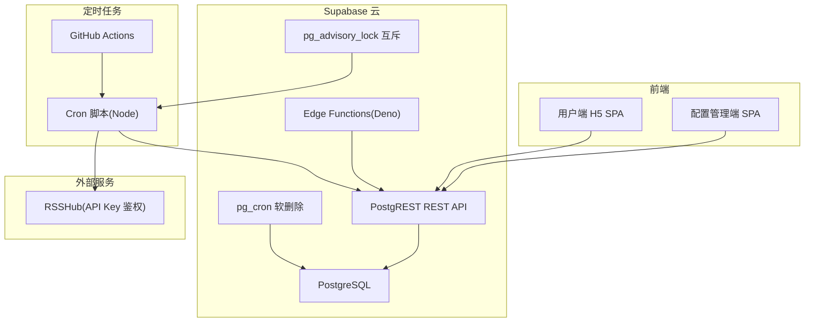
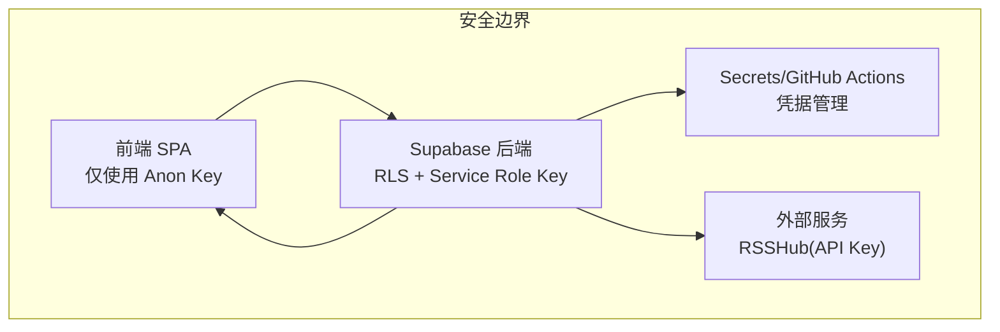
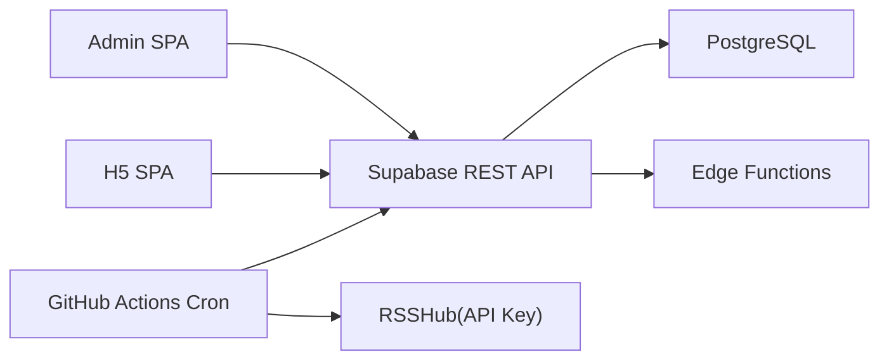

# 安全最佳实践

<cite>
**本文档引用的文件**
- [PROJECT_CONTEXT.md](file://PROJECT_CONTEXT.md)
- [多平台中枢_PRD.md](file://多平台中枢_PRD.md)
</cite>

## 目录
1. [简介](#简介)
2. [项目结构](#项目结构)
3. [核心组件](#核心组件)
4. [架构总览](#架构总览)
5. [详细组件分析](#详细组件分析)
6. [依赖分析](#依赖分析)
7. [性能考虑](#性能考虑)
8. [故障排查指南](#故障排查指南)
9. [结论](#结论)
10. [附录](#附录)

## 简介
本文件面向“多平台内容中枢”项目，聚焦安全红线与安全约束，总结项目中的关键安全原则（如 Service Role Key 永远不出现在前端、前端 SPA 仅使用 Anon Key、RSSHub 必须配置 API Key 鉴权等），并提供安全开发指南（代码审查要点、安全测试方法、漏洞防护策略、应急响应流程）、实施建议与检查清单，帮助团队建立完善的安全部署与运维体系。

## 项目结构
项目采用 Monorepo 架构，前端（apps/admin、apps/h5）为 React SPA，后端由 Supabase 托管（PostgreSQL + PostgREST + Edge Functions），定时任务通过 GitHub Actions 调用 Cron 脚本，RSSHub 作为独立公网服务提供中转能力。整体安全边界清晰：前端仅通过 Supabase REST API 与后端交互，敏感密钥与第三方平台凭据通过环境变量与数据库加密存储。

图表来源
- [PROJECT_CONTEXT.md:173-206](file://PROJECT_CONTEXT.md#L173-L206)
- [PROJECT_CONTEXT.md:115-131](file://PROJECT_CONTEXT.md#L115-L131)

章节来源
- [PROJECT_CONTEXT.md:51-142](file://PROJECT_CONTEXT.md#L51-L142)

## 核心组件
- 前端 SPA（Admin/H5）：纯客户端渲染，通过 Supabase REST API 与后端交互，仅使用 Anon Key。
- Supabase 后端：PostgreSQL + PostgREST + Edge Functions，所有表启用 RLS，敏感密钥仅在服务端使用。
- GitHub Actions 定时任务：负责调用第三方平台 API（B站/YouTube/RSSHub），通过 Service Role Key 写入数据库。
- RSSHub：公网可访问，必须启用 API Key 鉴权。

章节来源
- [PROJECT_CONTEXT.md:17-23](file://PROJECT_CONTEXT.md#L17-L23)
- [PROJECT_CONTEXT.md:209-222](file://PROJECT_CONTEXT.md#L209-L222)

## 架构总览
项目安全架构围绕“最小暴露面、强隔离、强审计”的原则设计：
- 前端不直接调用第三方平台 API，所有抓取逻辑在服务端完成。
- Service Role Key 永远不暴露给前端，仅在 GitHub Secrets 与 Edge Functions 中使用。
- 所有数据库表启用 RLS，前端仅能通过 Anon Key 访问受控资源。
- RSSHub 暴露在公网，必须启用 API Key 鉴权，防止滥用。

图表来源
- [PROJECT_CONTEXT.md:209-217](file://PROJECT_CONTEXT.md#L209-L217)
- [PROJECT_CONTEXT.md:402-417](file://PROJECT_CONTEXT.md#L402-L417)

章节来源
- [PROJECT_CONTEXT.md:209-222](file://PROJECT_CONTEXT.md#L209-L222)
- [PROJECT_CONTEXT.md:402-417](file://PROJECT_CONTEXT.md#L402-L417)

## 详细组件分析

### 安全红线与约束
- Service Role Key 永远不出现在前端代码中，仅在 GitHub Secrets 与 Edge Functions 中使用。
- 前端 SPA 仅使用 Anon Key，所有写操作受 RLS 策略约束。
- 敏感信息（Cookie、API Key）通过环境变量或 Supabase Vault 管理，不硬编码。
- RSSHub 必须配置 API Key 鉴权，裸奔部署是安全红线。
- Admin SPA 登录页面应有限流保护（Supabase Auth 自带基础限流）。

章节来源
- [PROJECT_CONTEXT.md:410-417](file://PROJECT_CONTEXT.md#L410-L417)
- [PROJECT_CONTEXT.md:216-217](file://PROJECT_CONTEXT.md#L216-L217)

### 密钥与凭据管理
- 前端密钥：SUPABASE_ANON_KEY（公开，受 RLS 保护）。
- 服务端密钥：SUPABASE_SERVICE_ROLE_KEY（仅在 GitHub Secrets、Edge Functions 使用）。
- 第三方密钥：YOUTUBE_API_KEY、RSSHUB_API_KEY、B站 Cookie（加密存储于数据库）。
- 环境变量存储位置：Vercel（前端）、GitHub Secrets（后端与第三方）。

章节来源
- [PROJECT_CONTEXT.md:34-46](file://PROJECT_CONTEXT.md#L34-L46)
- [PROJECT_CONTEXT.md:402-409](file://PROJECT_CONTEXT.md#L402-L409)

### 数据库 RLS 策略
- monitors 表：管理员完全读写；访客不可见。
- contents 表：管理员完全读写；访客仅能读取 is_display=true 的记录。
- platform_configs 表：管理员完全读写；访客不可见。

章节来源
- [PROJECT_CONTEXT.md:364-400](file://PROJECT_CONTEXT.md#L364-L400)

### 定时任务与互斥锁
- GitHub Actions 每 30 分钟触发 Cron 脚本，使用 Service Role Key 通过 REST API 写入数据库。
- 使用 pg_advisory_lock 实现 Cron 互斥，避免并发冲突。
- 同平台请求间隔 ≥ 1.5 秒，不同平台可并行，降低反爬风险。

章节来源
- [PROJECT_CONTEXT.md:218-221](file://PROJECT_CONTEXT.md#L218-L221)
- [PROJECT_CONTEXT.md:615-644](file://PROJECT_CONTEXT.md#L615-L644)

### RSSHub 鉴权
- RSSHub 暴露在公网，必须启用 API Key 鉴权，通过 ACCESS_CONTROL 限制访问。
- Cron 脚本调用 RSSHub 时携带 API Key，防止被滥用。

章节来源
- [PROJECT_CONTEXT.md:203-206](file://PROJECT_CONTEXT.md#L203-L206)
- [PROJECT_CONTEXT.md:217](file://PROJECT_CONTEXT.md#L217)

## 依赖分析
- 前端依赖 Supabase 客户端库与 Vercel 环境变量。
- 后端依赖 Supabase Edge Functions 与数据库策略。
- 定时任务依赖 GitHub Actions Secrets 与第三方平台 API。
- RSSHub 依赖 API Key 鉴权配置。

图表来源
- [PROJECT_CONTEXT.md:422-430](file://PROJECT_CONTEXT.md#L422-L430)
- [PROJECT_CONTEXT.md:194-206](file://PROJECT_CONTEXT.md#L194-L206)

章节来源
- [PROJECT_CONTEXT.md:422-430](file://PROJECT_CONTEXT.md#L422-L430)

## 性能考虑
- 前端仅进行只读查询（contents 表），RLS 策略在服务端生效，避免前端绕过。
- Cron 互斥锁与同平台限速降低反爬风险，提升整体稳定性。
- 数据生命周期管理（软删除）减少前端查询压力，提高响应速度。

[本节为一般性指导，不直接分析具体文件]

## 故障排查指南
- 前端无法写入：检查是否使用 Anon Key，确认 RLS 策略是否正确。
- Service Role Key 泄露风险：检查前端代码与构建产物，确保未包含任何密钥。
- RSSHub 调用失败：确认 RSSHub API Key 配置正确，网络可达。
- Cron 任务未执行：检查 GitHub Actions Secrets、互斥锁状态与日志。

章节来源
- [PROJECT_CONTEXT.md:410-417](file://PROJECT_CONTEXT.md#L410-L417)
- [PROJECT_CONTEXT.md:615-644](file://PROJECT_CONTEXT.md#L615-L644)

## 结论
本项目通过“前端最小暴露、服务端强隔离、凭据严格管理、RLS 强约束”的安全架构，有效降低了攻击面。遵循安全红线与约束，配合完善的代码审查与测试流程，可显著提升系统的安全性与可靠性。

[本节为总结性内容，不直接分析具体文件]

## 附录

### 安全开发指南

- 代码审查要点
  - 禁止在前端代码中出现任何密钥或凭据。
  - 确认所有写操作仅通过 Supabase REST API，且使用 Anon Key。
  - 检查 Edge Functions 是否仅使用 Service Role Key，且不向客户端泄露。
  - 确认 RSSHub 调用必须携带 API Key，且部署在受控网络环境。
  - 审查数据库 RLS 策略，确保匿名用户仅能访问受控资源。

- 安全测试方法
  - 前端测试：模拟匿名用户访问，验证只读策略与错误处理。
  - 后端测试：使用 Service Role Key 执行写操作，验证 RLS 生效。
  - 外部集成测试：验证 RSSHub API Key 鉴权与限流效果。
  - 渗透测试：模拟密钥泄露、跨站脚本、CSRF 等常见攻击场景。

- 漏洞防护策略
  - 严格分离前端与后端密钥，使用环境变量与密钥管理服务。
  - 启用并定期审计 RLS 策略，确保最小权限原则。
  - 对外服务（RSSHub）启用 API Key 鉴权与速率限制。
  - 使用 GitHub Actions Secrets 管理敏感信息，避免硬编码。

- 应急响应流程
  - 密钥泄露：立即撤销并更换密钥，检查访问日志与受影响范围。
  - 外部服务异常：切换备用实例或临时降级策略，通知用户。
  - 数据库异常：回滚可疑变更，恢复备份，评估影响。
  - 安全事件：启动应急预案，隔离问题、调查原因、修复并复盘。

章节来源
- [PROJECT_CONTEXT.md:410-417](file://PROJECT_CONTEXT.md#L410-L417)
- [PROJECT_CONTEXT.md:216-217](file://PROJECT_CONTEXT.md#L216-L217)

### 安全实施检查清单

- 前端
  - [ ] 仅使用 SUPABASE_ANON_KEY
  - [ ] 未包含任何密钥或凭据
  - [ ] 仅进行只读查询（contents 表）

- 后端
  - [ ] SUPABASE_SERVICE_ROLE_KEY 仅存在于 GitHub Secrets 与 Edge Functions
  - [ ] 所有表启用 RLS
  - [ ] 管理员与匿名用户的访问范围明确

- 定时任务
  - [ ] 使用 GitHub Actions Secrets 管理密钥
  - [ ] Cron 互斥锁生效
  - [ ] 同平台请求间隔 ≥ 1.5 秒

- 外部服务
  - [ ] RSSHub 启用 API Key 鉴权
  - [ ] 网络访问受控，仅允许必要来源

- 运维与审计
  - [ ] 定期审计密钥轮换与访问日志
  - [ ] 建立应急响应预案与演练

章节来源
- [PROJECT_CONTEXT.md:34-46](file://PROJECT_CONTEXT.md#L34-L46)
- [PROJECT_CONTEXT.md:209-222](file://PROJECT_CONTEXT.md#L209-L222)
- [PROJECT_CONTEXT.md:615-644](file://PROJECT_CONTEXT.md#L615-L644)