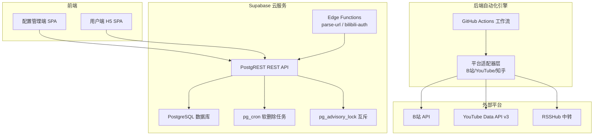
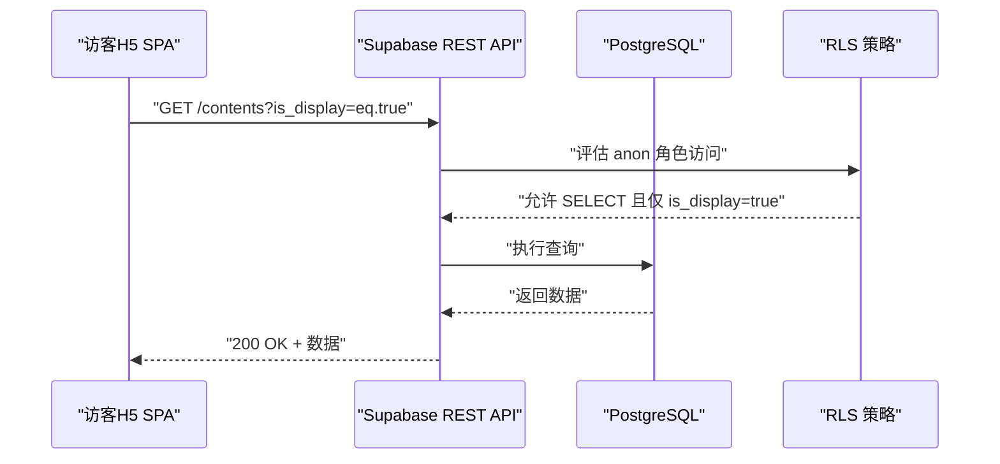
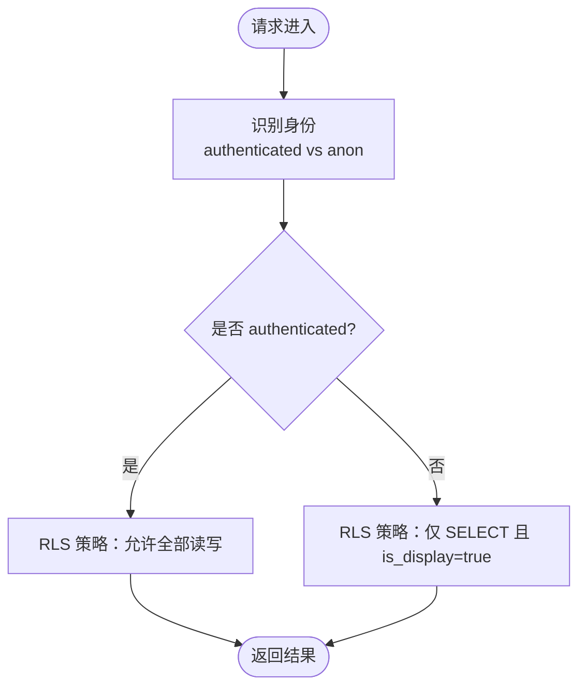
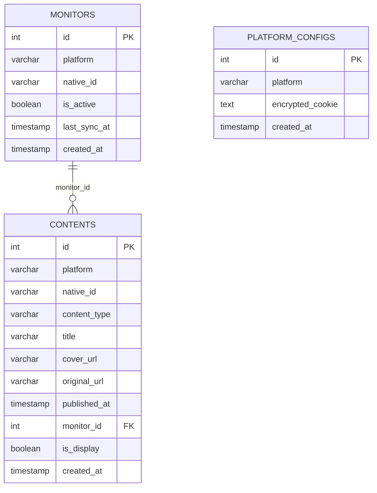
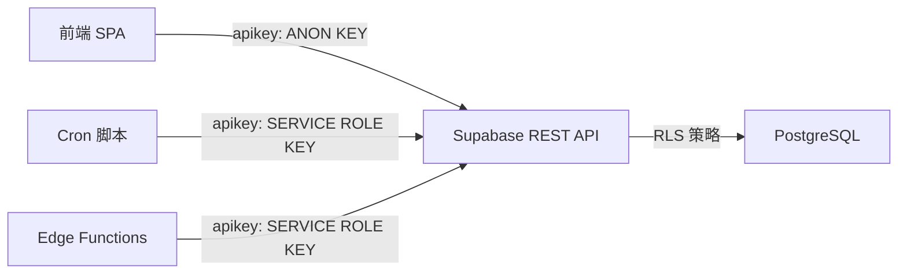
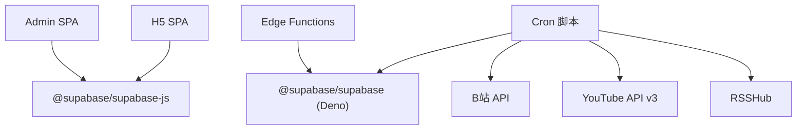

# 安全架构

<cite>
**本文引用的文件**
- [PROJECT_CONTEXT.md](file://PROJECT_CONTEXT.md)
- [多平台中枢_PRD.md](file://多平台中枢_PRD.md)
</cite>

## 目录
1. [简介](#简介)
2. [项目结构](#项目结构)
3. [核心组件](#核心组件)
4. [架构总览](#架构总览)
5. [详细组件分析](#详细组件分析)
6. [依赖分析](#依赖分析)
7. [性能考虑](#性能考虑)
8. [故障排查指南](#故障排查指南)
9. [结论](#结论)
10. [附录](#附录)

## 简介
本文件面向“多平台内容中枢”项目，聚焦安全架构与合规实践，围绕权限体系（管理员/访客）、行级安全（RLS）策略、密钥管理（Supabase ANON KEY、SERVICE ROLE KEY）、敏感信息存储与传输（B站 Cookie、API Key）进行系统化阐述，并给出安全红线与最佳实践，确保系统在最小权限、最小暴露面的前提下稳定运行。

## 项目结构
项目采用 Monorepo 架构，前端（配置管理端与用户端 H5）通过 Supabase REST API 与数据库交互；后端自动化引擎通过 GitHub Actions 定时任务与平台 API 交互；Edge Functions 用于轻量逻辑（URL 解析、B站扫码登录）。Supabase 承载数据库、PostgREST、Edge Functions、定时任务与咨询锁等能力。

图表来源
- [PROJECT_CONTEXT.md:173-207](file://PROJECT_CONTEXT.md#L173-L207)
- [PROJECT_CONTEXT.md:224-239](file://PROJECT_CONTEXT.md#L224-L239)

章节来源
- [PROJECT_CONTEXT.md:49-142](file://PROJECT_CONTEXT.md#L49-L142)

## 核心组件
- 权限与角色模型：管理员（authenticated）与访客（anon）双角色，管理员具备 monitors/contents/platform_configs 的全部读写权限，访客仅可读取 contents 中 is_display=true 的记录。
- 行级安全（RLS）：所有暴露表启用 RLS，策略显式控制访问边界，前端仅能通过 ANON KEY 在策略范围内访问。
- 密钥层级：前端 SPA 使用 ANON KEY；服务端（Cron、Edge Functions）使用 SERVICE ROLE KEY；认证令牌用于管理员会话。
- 敏感信息管理：B站 Cookie 等敏感信息通过 Supabase Vault 加密存储；API Key 通过环境变量管理；传输通道采用 HTTPS。

章节来源
- [PROJECT_CONTEXT.md:349-417](file://PROJECT_CONTEXT.md#L349-L417)
- [PROJECT_CONTEXT.md:402-417](file://PROJECT_CONTEXT.md#L402-L417)

## 架构总览
系统安全边界清晰：前端 SPA 仅通过受 RLS 保护的 REST API 访问数据；服务端（Cron 与 Edge Functions）通过 SERVICE ROLE KEY 绕过 RLS，但严格限定使用范围与职责；外部平台 API 通过各自鉴权机制访问，RSSHub 必须启用 API Key 鉴权。

图表来源
- [PROJECT_CONTEXT.md:376-388](file://PROJECT_CONTEXT.md#L376-L388)
- [PROJECT_CONTEXT.md:447-473](file://PROJECT_CONTEXT.md#L447-L473)

## 详细组件分析

### 权限体系与角色模型
- 管理员（authenticated）：通过 Supabase Auth 登录后获得认证令牌，具备 monitors/contents/platform_configs 的全部读写权限。
- 访客（anon）：无需登录，仅能读取 contents 表中 is_display=true 的记录，其余表不可见。
- 角色与策略分离：管理员与访客通过 RLS 策略隔离，避免越权访问。

图表来源
- [PROJECT_CONTEXT.md:355-358](file://PROJECT_CONTEXT.md#L355-L358)
- [PROJECT_CONTEXT.md:364-388](file://PROJECT_CONTEXT.md#L364-L388)

章节来源
- [PROJECT_CONTEXT.md:349-417](file://PROJECT_CONTEXT.md#L349-L417)

### 行级安全（RLS）策略
- monitors 表：管理员全部读写；访客不可见。
- contents 表：管理员全部读写；访客仅 SELECT 且 is_display=true。
- platform_configs 表：管理员全部读写；访客不可见。
- 策略实施：所有暴露表启用 RLS，策略显式声明，避免默认开放。

图表来源
- [PROJECT_CONTEXT.md:364-400](file://PROJECT_CONTEXT.md#L364-L400)
- [PROJECT_CONTEXT.md:328-361](file://PROJECT_CONTEXT.md#L328-L361)

章节来源
- [PROJECT_CONTEXT.md:360-401](file://PROJECT_CONTEXT.md#L360-L401)

### 密钥管理策略
- ANON KEY：前端 SPA 使用，受 RLS 保护，仅用于匿名访问范围内的读写。
- SERVICE ROLE KEY：仅在服务端使用（Cron、Edge Functions），绕过 RLS，用于写入数据与内部操作。
- 认证令牌：管理员浏览器会话令牌，用于管理员端操作。
- 环境变量与 Secrets：敏感信息（API Key、Service Role Key）存储在 GitHub Secrets/Vercel Secrets，不硬编码到代码或前端。

图表来源
- [PROJECT_CONTEXT.md:404-417](file://PROJECT_CONTEXT.md#L404-L417)
- [PROJECT_CONTEXT.md:629-643](file://PROJECT_CONTEXT.md#L629-L643)

章节来源
- [PROJECT_CONTEXT.md:34-46](file://PROJECT_CONTEXT.md#L34-L46)
- [PROJECT_CONTEXT.md:402-417](file://PROJECT_CONTEXT.md#L402-L417)

### 敏感信息存储与传输安全
- B站 Cookie：通过 Edge Function 完成扫码登录，成功后加密存储于 platform_configs 表，使用 Supabase Vault 进行加密。
- API Key 管理：YouTube API Key、RSSHub API Key 通过环境变量注入，不硬编码。
- 传输安全：所有外部调用与内部通信采用 HTTPS；前端与 Supabase 通信通过 HTTPS REST API。
- 平台鉴权：RSSHub 必须启用 API Key 鉴权；B站 Cookie 仅在受控环境下使用。

章节来源
- [PROJECT_CONTEXT.md:292-300](file://PROJECT_CONTEXT.md#L292-L300)
- [PROJECT_CONTEXT.md:414-416](file://PROJECT_CONTEXT.md#L414-L416)
- [PROJECT_CONTEXT.md:629-634](file://PROJECT_CONTEXT.md#L629-L634)

### 安全红线与最佳实践
- 红线
  - SERVICE ROLE KEY 永不出现在前端代码中。
  - 前端 SPA 仅使用 ANON KEY。
  - B站 Cookie、API Key 等敏感信息不硬编码，通过环境变量或 Supabase Vault 管理。
  - RSSHub 必须配置 API Key 鉴权，裸奔部署是安全红线。
  - Admin SPA 登录页面应有限流保护（Supabase Auth 自带基础限流）。
- 最佳实践
  - 所有暴露表启用 RLS，策略显式控制访问。
  - Cron 互斥锁基于 pg_advisory_lock，避免并发冲突。
  - 平台适配器统一接口，不对外暴露，仅在服务端调用。
  - 数据去重与 UPSERT 机制防止旧数据复活，软删除保留历史。

章节来源
- [PROJECT_CONTEXT.md:410-417](file://PROJECT_CONTEXT.md#L410-L417)
- [PROJECT_CONTEXT.md:216-222](file://PROJECT_CONTEXT.md#L216-L222)

## 依赖分析
- 前端依赖 Supabase JS 客户端与 Supabase REST API。
- Cron 脚本依赖 Supabase REST API（Service Role Key）与平台 API。
- Edge Functions 依赖 Deno 环境与 Supabase Edge Runtime。
- 外部平台依赖：B站 Cookie、YouTube API Key、RSSHub API Key。

图表来源
- [PROJECT_CONTEXT.md:29-32](file://PROJECT_CONTEXT.md#L29-L32)
- [PROJECT_CONTEXT.md:617-643](file://PROJECT_CONTEXT.md#L617-L643)

章节来源
- [PROJECT_CONTEXT.md:25-32](file://PROJECT_CONTEXT.md#L25-L32)
- [PROJECT_CONTEXT.md:615-643](file://PROJECT_CONTEXT.md#L615-L643)

## 性能考虑
- RLS 评估开销：RLS 策略在 PostgREST 层评估，合理设计策略可避免不必要的计算。
- 并发与互斥：使用 pg_advisory_lock 保证 Cron 互斥，避免重复抓取与资源竞争。
- 请求限速：同平台请求间隔 ≥ 1.5 秒，防止触发平台频率限制。
- UPSERT 去重：基于唯一索引的 UPSERT，减少重复写入与死链风险。

章节来源
- [PROJECT_CONTEXT.md:216-222](file://PROJECT_CONTEXT.md#L216-L222)
- [PROJECT_CONTEXT.md:228-239](file://PROJECT_CONTEXT.md#L228-L239)

## 故障排查指南
- 访客无法看到内容
  - 检查 contents 表 is_display 是否为 true；确认 RLSS 策略生效。
- 管理员无法写入
  - 检查 ANON KEY 与 SERVICE ROLE KEY 使用是否正确；确认策略允许 authenticated 全部读写。
- B站 Cookie 失效
  - 通过 bilibili-auth Edge Function 重新扫码登录并更新 Cookie；检查 platform_configs 表加密存储状态。
- RSSHub 调用失败
  - 确认 RSSHub 已启用 API Key 鉴权；检查 RSSHUB_URL 与 RSSHUB_API_KEY 配置。
- Cron 未执行或重复执行
  - 检查 pg_advisory_lock 互斥状态；确认上一轮是否完成。

章节来源
- [PROJECT_CONTEXT.md:600-614](file://PROJECT_CONTEXT.md#L600-L614)
- [PROJECT_CONTEXT.md:216-222](file://PROJECT_CONTEXT.md#L216-L222)

## 结论
本项目通过“最小权限 + RLS + 服务端密钥隔离 + 加密存储”的安全架构，实现了前端与服务端的职责分离与边界控制。配合严格的密钥管理、敏感信息加密与外部平台鉴权策略，系统在保障可用性的同时，有效降低了安全风险。建议持续遵循安全红线与最佳实践，定期审计策略与密钥轮换，确保长期稳定运行。

## 附录
- 环境变量与密钥清单
  - SUPABASE_URL、SUPABASE_ANON_KEY、SUPABASE_SERVICE_ROLE_KEY、YOUTUBE_API_KEY、BILIBILI_COOKIE_*、RSSHUB_URL、RSSHUB_API_KEY、WECOM_WEBHOOK_URL
- 接口规范要点
  - Supabase REST API：apikey 头部使用 ANON KEY 或 SERVICE ROLE KEY；Prefer 头部用于返回与去重。
  - Edge Functions：统一请求/响应格式，错误码规范。
  - GitHub Actions：工作流中注入 Secrets，定时触发 Cron 脚本。

章节来源
- [PROJECT_CONTEXT.md:34-46](file://PROJECT_CONTEXT.md#L34-L46)
- [PROJECT_CONTEXT.md:447-509](file://PROJECT_CONTEXT.md#L447-L509)
- [PROJECT_CONTEXT.md:615-643](file://PROJECT_CONTEXT.md#L615-L643)