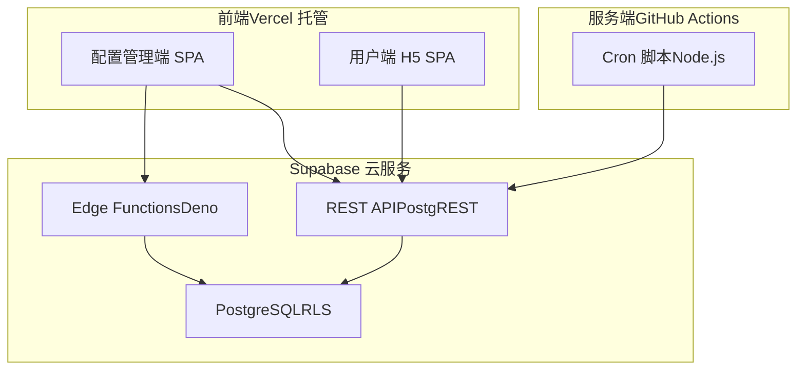
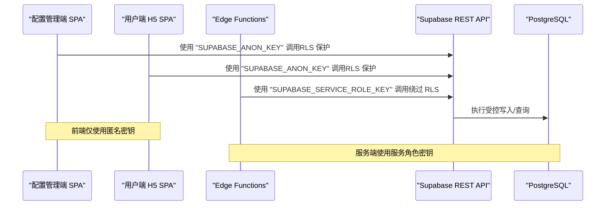
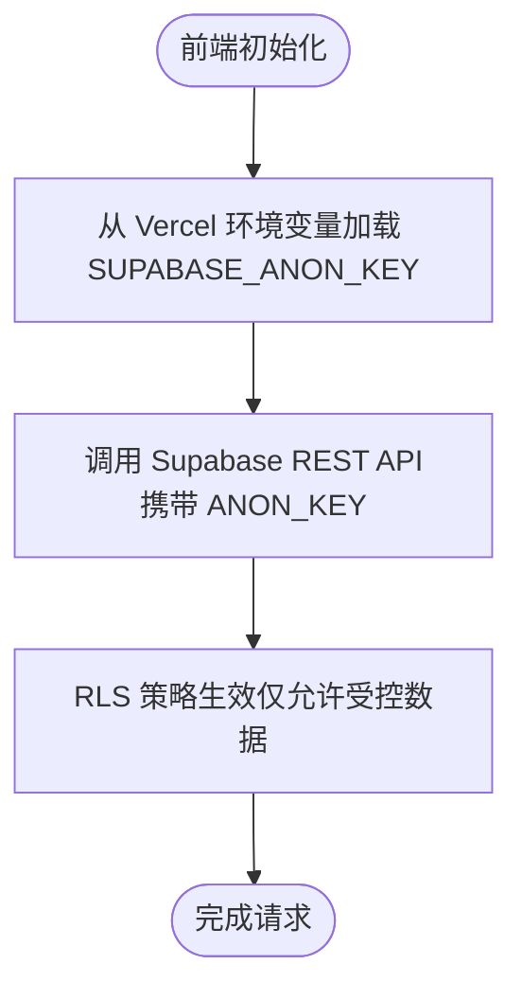
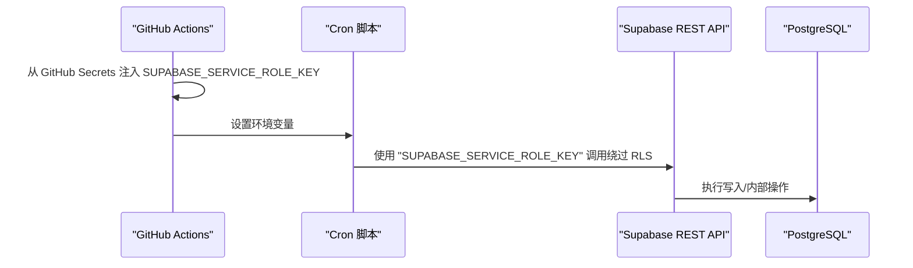
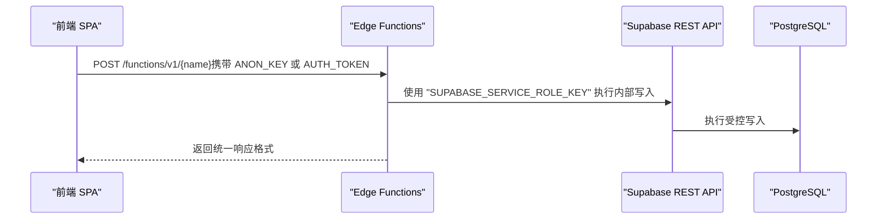
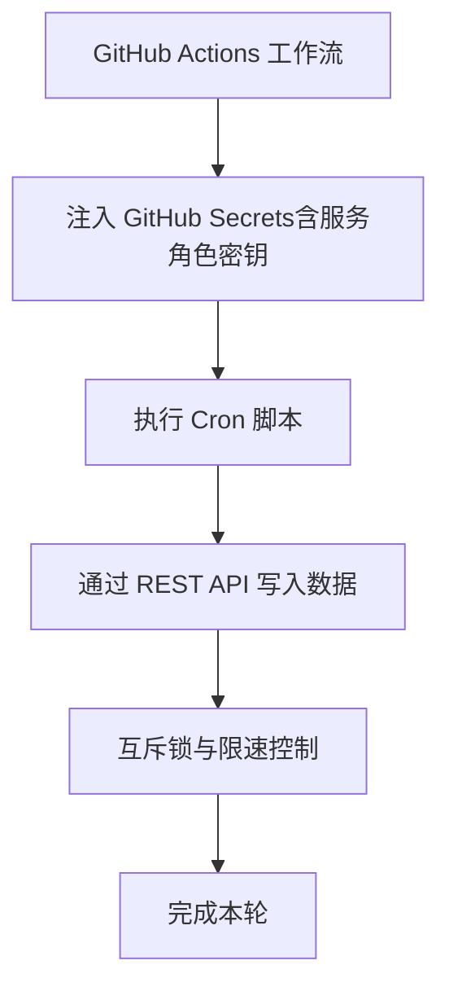
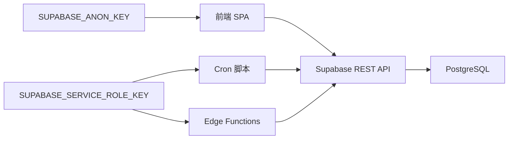

# 密钥管理

<cite>
**本文引用的文件**
- [PROJECT_CONTEXT.md](file://PROJECT_CONTEXT.md)
- [多平台中枢_PRD.md](file://多平台中枢_PRD.md)
</cite>

## 目录
1. [简介](#简介)
2. [项目结构](#项目结构)
3. [核心组件](#核心组件)
4. [架构总览](#架构总览)
5. [详细组件分析](#详细组件分析)
6. [依赖分析](#依赖分析)
7. [性能考虑](#性能考虑)
8. [故障排查指南](#故障排查指南)
9. [结论](#结论)
10. [附录](#附录)

## 简介
本文件聚焦“多平台内容中枢”项目中的 Supabase 密钥管理，系统性阐述密钥层级、使用场景、安全约束与最佳实践，覆盖前端（Vercel）、服务端（GitHub Secrets）与边缘函数（Edge Functions）的密钥分发与访问控制策略，确保开发团队正确配置与使用各类密钥，规避安全风险。

## 项目结构
围绕密钥管理的关键上下文分布在项目文档中，主要涉及：
- 环境变量与密钥清单
- 密钥层级与角色模型
- 安全红线与访问控制策略
- GitHub Actions 工作流中的密钥注入与使用

**图表来源**
- [PROJECT_CONTEXT.md:171-207](file://PROJECT_CONTEXT.md#L171-L207)

**章节来源**
- [PROJECT_CONTEXT.md:8-47](file://PROJECT_CONTEXT.md#L8-L47)
- [PROJECT_CONTEXT.md:171-207](file://PROJECT_CONTEXT.md#L171-L207)

## 核心组件
- SUPABASE_ANON_KEY：前端 SPA 公开展示使用的密钥，受 RLS 策略保护，用于读写受控数据。
- SUPABASE_SERVICE_ROLE_KEY：绕过 RLS 的高权限密钥，仅在服务端使用，存储于 GitHub Secrets，供 Cron 脚本与 Edge Functions 内部操作使用。
- Supabase Auth Token：管理员浏览器会话令牌，认证为 authenticated 角色，用于 Admin SPA 操作。

上述密钥的存储位置与使用边界如下：
- SUPABASE_URL：Vercel / GitHub Secrets
- SUPABASE_ANON_KEY：Vercel
- SUPABASE_SERVICE_ROLE_KEY：GitHub Secrets（仅）
- 其他敏感密钥：GitHub Secrets（如 YOUTUBE_API_KEY、RSSHUB_URL、RSSHUB_API_KEY 等）

**章节来源**
- [PROJECT_CONTEXT.md:34-46](file://PROJECT_CONTEXT.md#L34-L46)
- [PROJECT_CONTEXT.md:402-409](file://PROJECT_CONTEXT.md#L402-L409)

## 架构总览
密钥在系统中的流转与使用遵循“前端只用匿名密钥、服务端使用服务角色密钥”的原则，前端通过 REST API 与 Edge Functions 与 Supabase 交互，服务端 Cron 脚本通过 REST API 写入数据，严格避免前端直接接触服务角色密钥。

**图表来源**
- [PROJECT_CONTEXT.md:402-409](file://PROJECT_CONTEXT.md#L402-L409)
- [PROJECT_CONTEXT.md:420-473](file://PROJECT_CONTEXT.md#L420-L473)

**章节来源**
- [PROJECT_CONTEXT.md:402-409](file://PROJECT_CONTEXT.md#L402-L409)
- [PROJECT_CONTEXT.md:420-473](file://PROJECT_CONTEXT.md#L420-L473)

## 详细组件分析

### SUPABASE_ANON_KEY 管理与使用
- 存储位置：Vercel（前端公开使用）
- 使用场景：前端 SPA 与 Edge Functions 的公开调用，受 RLS 策略保护
- 安全约束：不得在前端代码中暴露服务角色密钥；前端仅能进行受控读写
- 配置要点：在 Vercel 项目中设置环境变量，确保前端构建产物不泄露

**图表来源**
- [PROJECT_CONTEXT.md:39](file://PROJECT_CONTEXT.md#L39)
- [PROJECT_CONTEXT.md:447-455](file://PROJECT_CONTEXT.md#L447-L455)

**章节来源**
- [PROJECT_CONTEXT.md:39](file://PROJECT_CONTEXT.md#L39)
- [PROJECT_CONTEXT.md:447-455](file://PROJECT_CONTEXT.md#L447-L455)

### SUPABASE_SERVICE_ROLE_KEY 管理与使用
- 存储位置：GitHub Secrets（仅）
- 使用场景：Cron 脚本写入数据、Edge Functions 内部操作
- 安全约束：严禁在前端代码中使用；仅在服务端注入到工作流环境变量
- 配置要点：在 GitHub Actions 工作流中通过 secrets 注入，供 Cron 脚本与 Edge Functions 使用

**图表来源**
- [PROJECT_CONTEXT.md:40](file://PROJECT_CONTEXT.md#L40)
- [PROJECT_CONTEXT.md:615-643](file://PROJECT_CONTEXT.md#L615-L643)

**章节来源**
- [PROJECT_CONTEXT.md:40](file://PROJECT_CONTEXT.md#L40)
- [PROJECT_CONTEXT.md:615-643](file://PROJECT_CONTEXT.md#L615-L643)

### Edge Functions 中的密钥使用
- Edge Functions（Deno）通过统一的请求/响应格式与 Supabase 交互
- 请求头中可携带匿名密钥或认证令牌，用于不同场景的调用
- 服务端内部操作（如写入数据库）可使用服务角色密钥

**图表来源**
- [PROJECT_CONTEXT.md:475-509](file://PROJECT_CONTEXT.md#L475-L509)
- [PROJECT_CONTEXT.md:407](file://PROJECT_CONTEXT.md#L407)

**章节来源**
- [PROJECT_CONTEXT.md:475-509](file://PROJECT_CONTEXT.md#L475-L509)
- [PROJECT_CONTEXT.md:407](file://PROJECT_CONTEXT.md#L407)

### GitHub Actions 工作流中的密钥注入
- 工作流在运行时从 GitHub Secrets 注入密钥到环境变量
- Cron 脚本通过 REST API 写入数据，避免直连数据库
- 互斥锁与限速策略保障并发安全与平台反爬合规

**图表来源**
- [PROJECT_CONTEXT.md:615-643](file://PROJECT_CONTEXT.md#L615-L643)

**章节来源**
- [PROJECT_CONTEXT.md:615-643](file://PROJECT_CONTEXT.md#L615-L643)

## 依赖分析
密钥在系统中的依赖关系与耦合度如下：
- 前端依赖 Vercel 环境变量中的匿名密钥，与服务端密钥解耦
- 服务端 Cron 脚本与 Edge Functions 依赖 GitHub Secrets 中的服务角色密钥
- REST API 作为统一入口，通过 RLS 或服务角色密钥控制访问

**图表来源**
- [PROJECT_CONTEXT.md:39-40](file://PROJECT_CONTEXT.md#L39-L40)
- [PROJECT_CONTEXT.md:407](file://PROJECT_CONTEXT.md#L407)
- [PROJECT_CONTEXT.md:420-473](file://PROJECT_CONTEXT.md#L420-L473)

**章节来源**
- [PROJECT_CONTEXT.md:39-40](file://PROJECT_CONTEXT.md#L39-L40)
- [PROJECT_CONTEXT.md:407](file://PROJECT_CONTEXT.md#L407)
- [PROJECT_CONTEXT.md:420-473](file://PROJECT_CONTEXT.md#L420-L473)

## 性能考虑
- 前端通过匿名密钥与 REST API 交互，避免不必要的服务端开销
- 服务端使用服务角色密钥进行批量写入与内部操作，提升吞吐
- Cron 互斥锁与平台限速策略降低平台反爬风险，提高整体稳定性

[本节为通用指导，不直接分析具体文件]

## 故障排查指南
常见问题与排查要点：
- 前端无法读写数据：检查 Vercel 环境变量是否正确注入匿名密钥，确认 RLS 策略是否允许当前角色访问
- 服务端写入失败：检查 GitHub Secrets 中服务角色密钥是否正确注入，确认工作流环境变量是否生效
- Edge Functions 调用异常：核对请求头中携带的密钥类型与调用场景是否匹配
- 安全红线违规：若发现前端暴露服务角色密钥，立即撤销并重新配置密钥注入策略

**章节来源**
- [PROJECT_CONTEXT.md:410-417](file://PROJECT_CONTEXT.md#L410-L417)
- [PROJECT_CONTEXT.md:615-643](file://PROJECT_CONTEXT.md#L615-L643)

## 结论
本项目通过清晰的密钥层级与严格的访问控制策略，实现了“前端只用匿名密钥、服务端使用服务角色密钥”的安全边界。配合 RLS、互斥锁与限速策略，既保证了系统的可用性与稳定性，又有效降低了密钥泄露与越权访问的风险。建议持续遵循安全红线，定期审计密钥注入与使用日志，确保密钥管理的长期安全。

[本节为总结性内容，不直接分析具体文件]

## 附录
- 环境变量与密钥清单（摘自项目上下文）
  - SUPABASE_URL：Vercel / GitHub Secrets
  - SUPABASE_ANON_KEY：Vercel
  - SUPABASE_SERVICE_ROLE_KEY：GitHub Secrets（仅）
  - YOUTUBE_API_KEY：GitHub Secrets
  - BILIBILI_COOKIE_*：Supabase 数据库（加密）
  - RSSHUB_URL：GitHub Secrets
  - RSSHUB_API_KEY：GitHub Secrets
  - WECOM_WEBHOOK_URL：GitHub Secrets（可选）

- 角色与 RLS 策略概览（摘自项目上下文）
  - 管理员：authenticated 角色，具备全部读写权限
  - 访客：anon 角色，仅能读取 is_display=true 的记录
  - 所有表启用 RLS，服务角色密钥绕过 RLS

**章节来源**
- [PROJECT_CONTEXT.md:34-46](file://PROJECT_CONTEXT.md#L34-L46)
- [PROJECT_CONTEXT.md:355-400](file://PROJECT_CONTEXT.md#L355-L400)