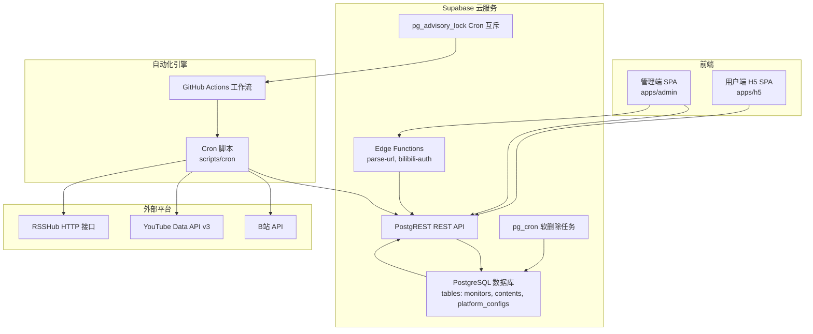
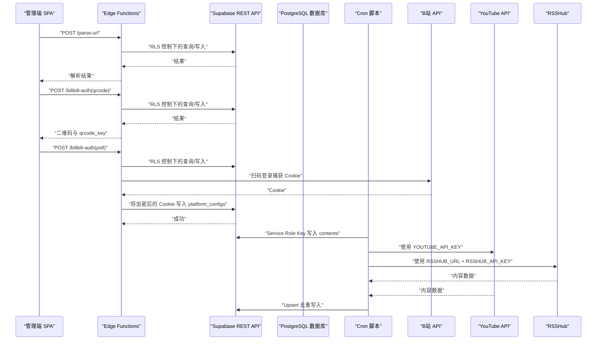
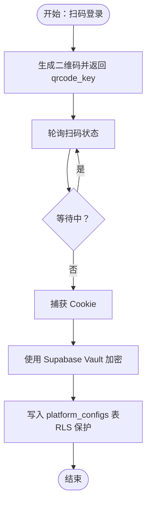
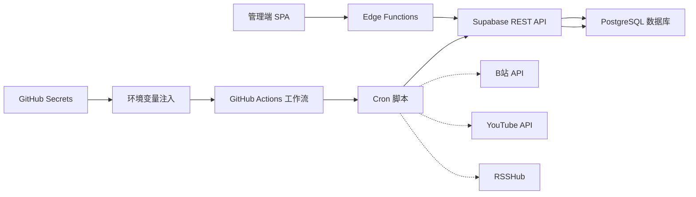

# 敏感数据保护

<cite>
**本文引用的文件**
- [PROJECT_CONTEXT.md](file://PROJECT_CONTEXT.md)
</cite>

## 目录
1. [简介](#简介)
2. [项目结构](#项目结构)
3. [核心组件](#核心组件)
4. [架构总览](#架构总览)
5. [详细组件分析](#详细组件分析)
6. [依赖关系分析](#依赖关系分析)
7. [性能考虑](#性能考虑)
8. [故障排查指南](#故障排查指南)
9. [结论](#结论)
10. [附录](#附录)

## 简介
本文件面向“多平台内容中枢”项目，聚焦于敏感数据的全生命周期保护，重点覆盖以下方面：
- B站 Cookie 的加密存储机制：基于 Supabase Vault 的加密策略与存储位置
- YouTube API Key、RSSHub API Key 等敏感信息的管理：环境变量配置、访问控制与安全传输
- 敏感数据的生命周期管理、访问审计与安全监控建议
- 在现有架构约束下，确保敏感信息在系统中的安全存储与合规使用

## 项目结构
项目采用 Monorepo 架构，结合 Supabase Cloud 提供的数据库、Edge Functions、PostgREST 与 RLS 等能力，形成“前端 SPA + 服务端自动化引擎 + 第三方平台”的整体数据流。

图示来源
- [PROJECT_CONTEXT.md: 173-207:173-207](file://PROJECT_CONTEXT.md#L173-L207)
- [PROJECT_CONTEXT.md: 420-430:420-430](file://PROJECT_CONTEXT.md#L420-L430)

章节来源
- [PROJECT_CONTEXT.md: 51-142:51-142](file://PROJECT_CONTEXT.md#L51-L142)
- [PROJECT_CONTEXT.md: 173-207:173-207](file://PROJECT_CONTEXT.md#L173-L207)

## 核心组件
围绕敏感数据保护的关键组件如下：
- Supabase 数据库与 RLS：对敏感表（如 platform_configs）进行细粒度访问控制
- Edge Functions：执行轻量逻辑（如 URL 解析、B站扫码授权），并与数据库交互
- GitHub Actions 工作流：承载 Cron 脚本，负责从第三方平台抓取数据并写入数据库
- 环境变量与 Secrets：集中管理敏感信息（如 API Key、Service Role Key）

章节来源
- [PROJECT_CONTEXT.md: 34-46:34-46](file://PROJECT_CONTEXT.md#L34-L46)
- [PROJECT_CONTEXT.md: 402-417:402-417](file://PROJECT_CONTEXT.md#L402-L417)
- [PROJECT_CONTEXT.md: 615-644:615-644](file://PROJECT_CONTEXT.md#L615-L644)

## 架构总览
下图展示了敏感数据在系统中的流转路径与保护边界：

图示来源
- [PROJECT_CONTEXT.md: 281-300:281-300](file://PROJECT_CONTEXT.md#L281-L300)
- [PROJECT_CONTEXT.md: 420-568:420-568](file://PROJECT_CONTEXT.md#L420-L568)
- [PROJECT_CONTEXT.md: 615-644:615-644](file://PROJECT_CONTEXT.md#L615-L644)

## 详细组件分析

### B站 Cookie 的加密存储机制
- 存储位置与表结构
  - 敏感信息（如 B站 Cookie）存储于 platform_configs 表，受 RLS 策略保护，仅认证用户可见
- 加密与访问控制
  - 项目明确要求敏感信息（Cookie、API Key）采用加密存储；结合 Supabase Vault 的能力，可在数据库层面实现透明加密
  - 前端仅能通过 Edge Functions 与 Supabase REST API 进行受限访问，不直接接触明文敏感数据
- 生命周期与访问审计
  - 建议在 platform_configs 表中增加审计字段（如 created_by、updated_at、last_used_at），并配合 Supabase 的审计日志功能进行追踪
- 安全监控
  - 建议开启数据库慢查询与异常访问告警，并对 Edge Functions 的错误码进行集中监控（如 B站 Cookie 失效等）

图示来源
- [PROJECT_CONTEXT.md: 292-300:292-300](file://PROJECT_CONTEXT.md#L292-L300)
- [PROJECT_CONTEXT.md: 390-400:390-400](file://PROJECT_CONTEXT.md#L390-L400)
- [PROJECT_CONTEXT.md: 410-417:410-417](file://PROJECT_CONTEXT.md#L410-L417)

章节来源
- [PROJECT_CONTEXT.md: 292-300:292-300](file://PROJECT_CONTEXT.md#L292-L300)
- [PROJECT_CONTEXT.md: 390-400:390-400](file://PROJECT_CONTEXT.md#L390-L400)
- [PROJECT_CONTEXT.md: 410-417:410-417](file://PROJECT_CONTEXT.md#L410-L417)

### YouTube API Key 管理
- 环境变量与 Secrets
  - YouTube API Key 存储于 GitHub Secrets 中，Cron 工作流在运行时注入环境变量
- 访问控制与安全传输
  - Cron 脚本通过 Supabase REST API 写入数据，不直接暴露 API Key 至前端
  - 建议在 Google Cloud Console 中为 API Key 设置 HTTP Referrer 限制，降低泄露风险
- 生命周期与审计
  - 建议定期轮换 API Key，并在数据库中记录变更历史（如 created_by、updated_at）

章节来源
- [PROJECT_CONTEXT.md: 41-42:41-42](file://PROJECT_CONTEXT.md#L41-L42)
- [PROJECT_CONTEXT.md: 615-644:615-644](file://PROJECT_CONTEXT.md#L615-L644)

### RSSHub API Key 管理
- 环境变量与 Secrets
  - RSSHub URL 与 API Key 均存储于 GitHub Secrets，工作流注入
- 访问控制与安全传输
  - RSSHub 暴露在公网，必须启用 API Key 鉴权；建议在 RSSHub 配置中开启 ACCESS_CONTROL 限制访问
- 生命周期与审计
  - 建议对 RSSHub 的访问日志进行集中采集与分析，发现异常请求及时阻断

章节来源
- [PROJECT_CONTEXT.md: 43-44:43-44](file://PROJECT_CONTEXT.md#L43-L44)
- [PROJECT_CONTEXT.md: 217](file://PROJECT_CONTEXT.md#L217)
- [PROJECT_CONTEXT.md: 615-644:615-644](file://PROJECT_CONTEXT.md#L615-L644)

### Edge Functions 与敏感数据
- 职责边界
  - Edge Functions 仅执行轻量逻辑（URL 解析、B站扫码授权），不直接处理大量数据
- 安全要点
  - 使用 Supabase 的匿名密钥或认证令牌进行调用，避免在函数内硬编码敏感信息
  - 对外暴露的错误码需避免泄露内部细节（例如统一错误码与提示）

章节来源
- [PROJECT_CONTEXT.md: 186-187:186-187](file://PROJECT_CONTEXT.md#L186-L187)
- [PROJECT_CONTEXT.md: 475-568:475-568](file://PROJECT_CONTEXT.md#L475-L568)

### GitHub Actions 工作流与 Cron 脚本
- 环境变量注入
  - 工作流在运行时注入 SUPABASE_SERVICE_ROLE_KEY、YOUTUBE_API_KEY、RSSHUB_URL、RSSHUB_API_KEY 等敏感变量
- 安全建议
  - 严格限制工作流权限，最小化 Secrets 访问范围
  - 对 Cron 互斥使用 pg_advisory_lock，避免并发冲突与资源争用

章节来源
- [PROJECT_CONTEXT.md: 615-644:615-644](file://PROJECT_CONTEXT.md#L615-L644)
- [PROJECT_CONTEXT.md: 216-219:216-219](file://PROJECT_CONTEXT.md#L216-L219)

## 依赖关系分析
敏感数据在系统中的依赖关系如下：

图示来源
- [PROJECT_CONTEXT.md: 615-644:615-644](file://PROJECT_CONTEXT.md#L615-L644)
- [PROJECT_CONTEXT.md: 420-430:420-430](file://PROJECT_CONTEXT.md#L420-L430)

章节来源
- [PROJECT_CONTEXT.md: 615-644:615-644](file://PROJECT_CONTEXT.md#L615-L644)
- [PROJECT_CONTEXT.md: 420-430:420-430](file://PROJECT_CONTEXT.md#L420-L430)

## 性能考虑
- 并发与限速
  - Cron 脚本按平台串行、平台间可并行，同平台请求间隔 ≥ 1.5 秒（防反爬）
- 数据写入
  - 使用 Upsert 去重（ON CONFLICT）避免重复写入，减少数据库压力
- 存储与检索
  - 利用 RLS 与索引优化查询性能，同时保证敏感数据访问边界

章节来源
- [PROJECT_CONTEXT.md: 220-221:220-221](file://PROJECT_CONTEXT.md#L220-L221)
- [PROJECT_CONTEXT.md: 318-334:318-334](file://PROJECT_CONTEXT.md#L318-L334)

## 故障排查指南
- 常见错误与定位
  - B站 Cookie 失效：检查 Edge Functions 的扫码流程与 Cookie 存储是否成功，确认 platform_configs 表中记录状态
  - YouTube API 调用失败：核对 YOUTUBE_API_KEY 是否正确注入，以及 API 限额与配额
  - RSSHub 接口调用失败：确认 RSSHUB_URL 与 RSSHUB_API_KEY，检查 RSSHub 的 ACCESS_CONTROL 配置
- 日志与监控
  - 集中采集 Edge Functions 与 Cron 脚本的日志，设置告警阈值
  - 对数据库访问异常与慢查询进行监控与告警

章节来源
- [PROJECT_CONTEXT.md: 600-614:600-614](file://PROJECT_CONTEXT.md#L600-L614)
- [PROJECT_CONTEXT.md: 217](file://PROJECT_CONTEXT.md#L217)

## 结论
本项目通过“前端只与 Supabase 交互 + Cron 脚本集中抓取 + Edge Functions 轻量逻辑 + RLS 访问控制 + Secrets 管理”的组合，形成了对敏感数据的闭环保护。针对 B站 Cookie 的加密存储，建议充分利用 Supabase Vault 的透明加密能力，并在 platform_configs 表中完善审计字段与访问日志。对于 YouTube API Key 与 RSSHub API Key，务必通过环境变量与 Secrets 管理，配合 API 层面的访问控制与网络限制，确保在全生命周期内的安全可控。

## 附录
- 行业最佳实践参考
  - Supabase Edge Functions 组织方式、RLS 安全模式、Monorepo 共享类型、Secrets 管理、PostgreSQL Upsert 模式、pg_advisory_lock 互斥等

章节来源
- [PROJECT_CONTEXT.md: 647-657:647-657](file://PROJECT_CONTEXT.md#L647-L657)