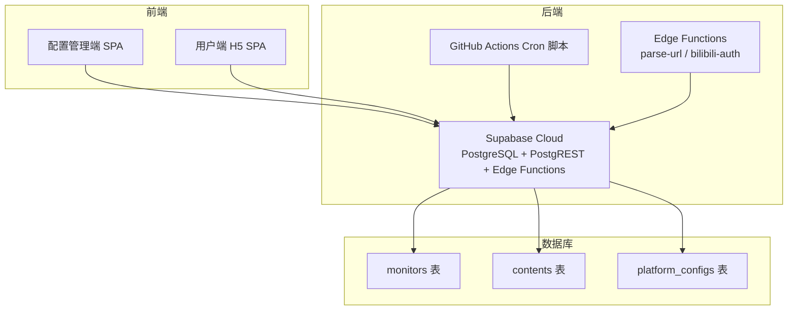
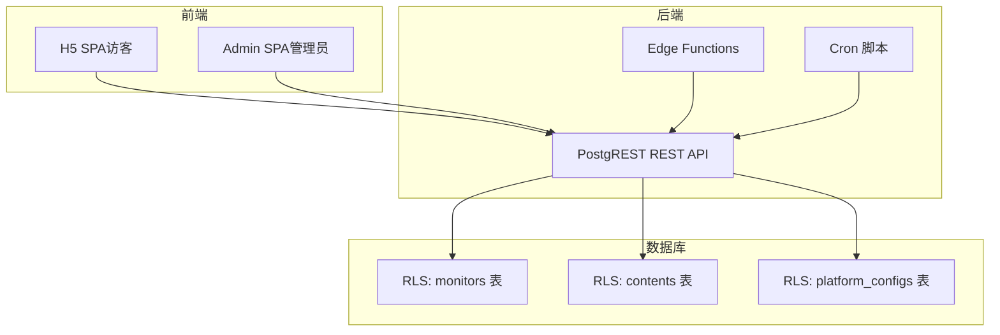
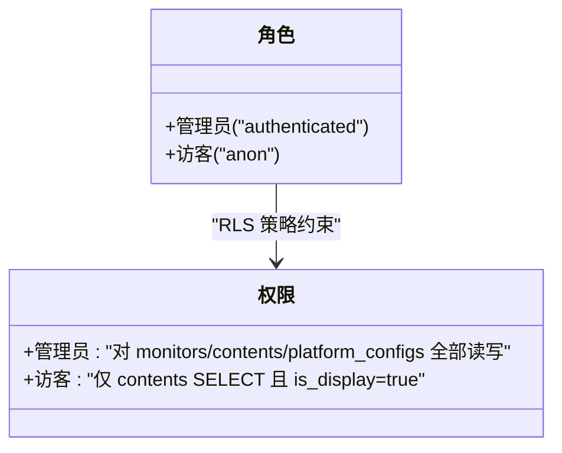
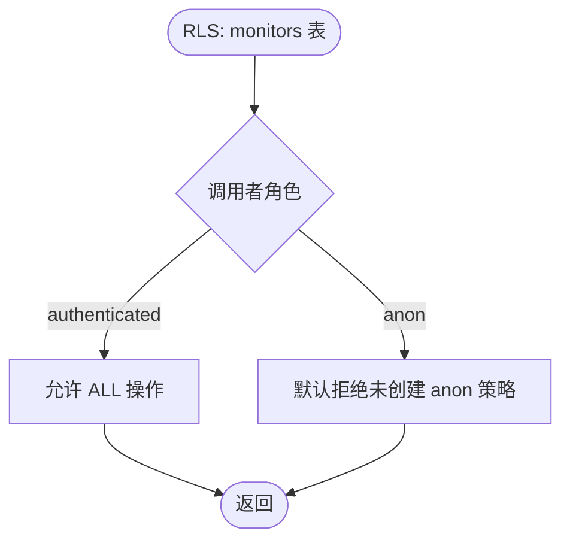
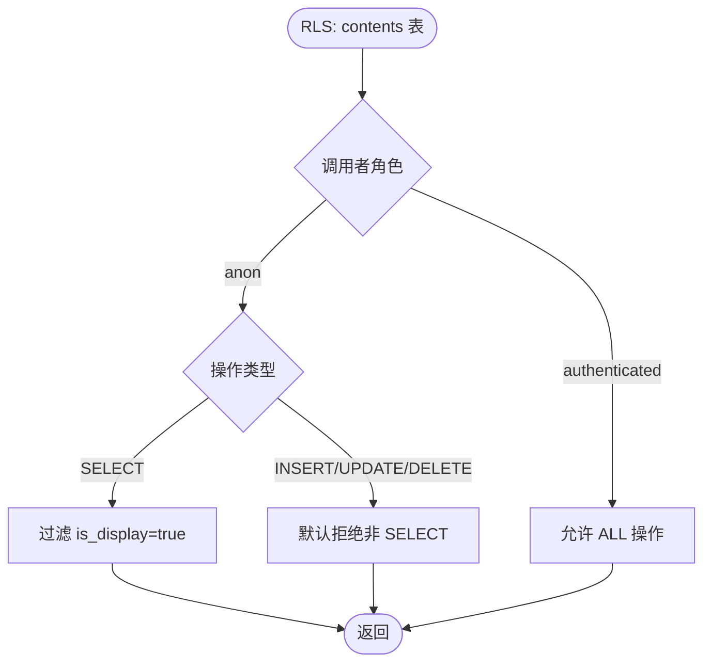
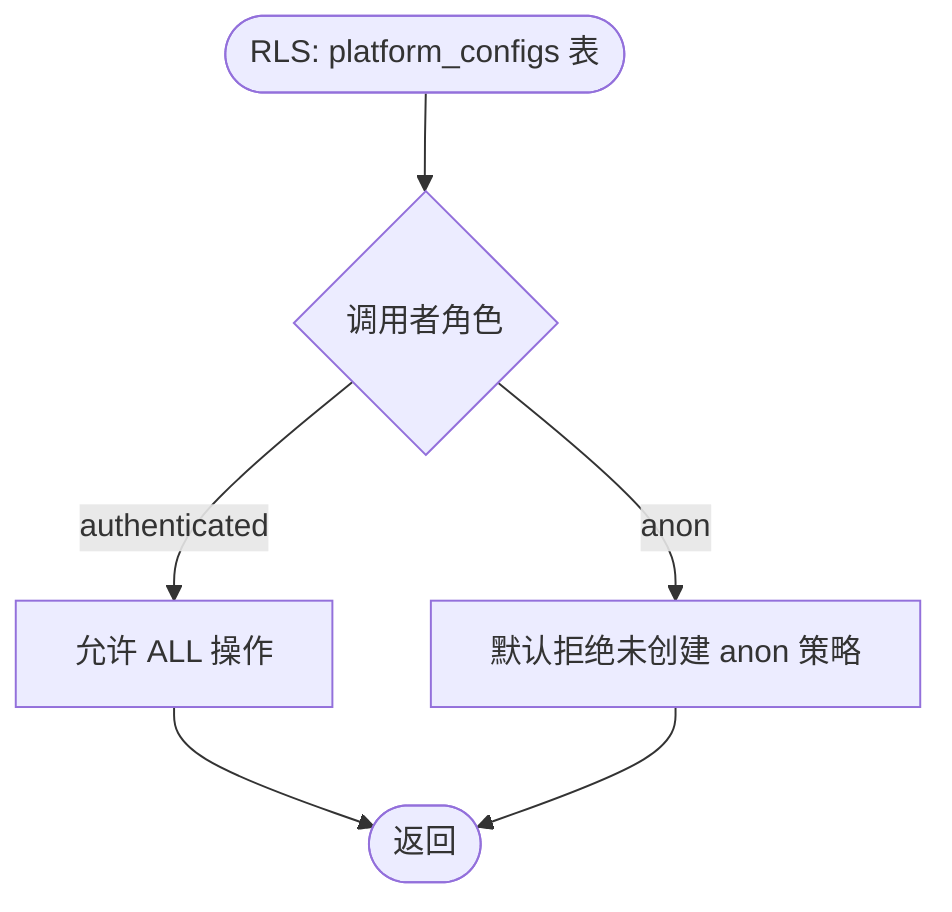
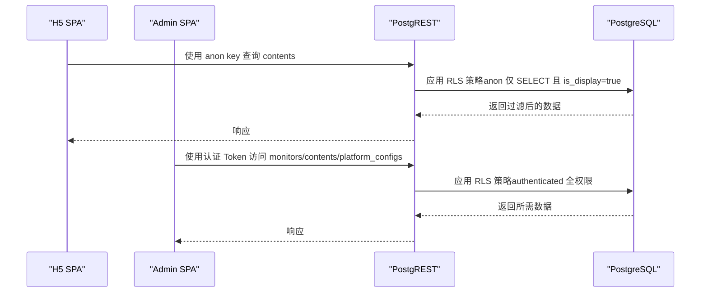
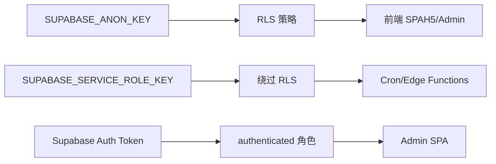
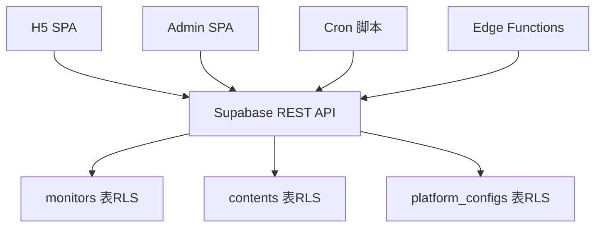

# 权限体系

<cite>
**本文档引用的文件**
- [PROJECT_CONTEXT.md](file://PROJECT_CONTEXT.md)
- [多平台中枢_PRD.md](file://多平台中枢_PRD.md)
</cite>

## 目录
1. [简介](#简介)
2. [项目结构](#项目结构)
3. [核心组件](#核心组件)
4. [架构总览](#架构总览)
5. [详细组件分析](#详细组件分析)
6. [依赖关系分析](#依赖关系分析)
7. [性能考虑](#性能考虑)
8. [故障排查指南](#故障排查指南)
9. [结论](#结论)

## 简介
本文件系统性阐述多平台内容中枢项目的权限体系设计，重点围绕双角色模型（管理员 authenticated 与访客 anon）与行级安全（RLS）策略展开。项目采用 Supabase Cloud 作为后端基础设施，通过匿名密钥（anon key）与服务角色密钥（service_role key）实现最小权限原则与数据隔离，确保前端 SPA 仅能访问经策略授权的数据集合。

## 项目结构
项目采用 Monorepo 架构，前端（配置管理端与用户端 H5）与后端（Supabase、Edge Functions、Cron 脚本）协同工作。权限体系的关键落点在 Supabase 数据库层，通过 RLS 策略对 monitors、contents、platform_configs 三张核心表进行访问控制。

**图表来源**
- [PROJECT_CONTEXT.md: 173-207:173-207](file://PROJECT_CONTEXT.md#L173-L207)

**章节来源**
- [PROJECT_CONTEXT.md: 9-24:9-24](file://PROJECT_CONTEXT.md#L9-L24)
- [PROJECT_CONTEXT.md: 49-142:49-142](file://PROJECT_CONTEXT.md#L49-L142)

## 核心组件
- 双角色模型
  - 管理员（authenticated）：通过 Supabase Auth 认证，具备 monitors、contents、platform_configs 的完全读写权限。
  - 访客（anon）：匿名用户，仅能读取 contents 表中 is_display = true 的记录。
- RLS 策略
  - monitors 表：管理员全权限；访客默认拒绝。
  - contents 表：管理员全权限；访客仅 SELECT 且限定 is_display = true。
  - platform_configs 表：管理员全权限；访客默认拒绝。
- 密钥层级
  - SUPABASE_ANON_KEY：前端公开使用，受 RLS 策略约束。
  - SUPABASE_SERVICE_ROLE_KEY：绕过 RLS，仅 Cron 与 Edge Functions 使用。
  - Supabase Auth Token：认证为 authenticated 角色，用于 Admin SPA。

**章节来源**
- [PROJECT_CONTEXT.md: 349-417:349-417](file://PROJECT_CONTEXT.md#L349-L417)

## 架构总览
权限体系贯穿前端、后端与数据库三层，形成“前端只用 anon key + RLS”和“服务端用 service_role key 绕过 RLS”的最小权限边界。

**图表来源**
- [PROJECT_CONTEXT.md: 179-191:179-191](file://PROJECT_CONTEXT.md#L179-L191)
- [PROJECT_CONTEXT.md: 360-400:360-400](file://PROJECT_CONTEXT.md#L360-L400)

## 详细组件分析

### 角色模型与身份认证
- 管理员（authenticated）
  - 身份来源：Supabase Auth（邮箱+密码）。
  - 访问方式：Admin SPA 登录后获取认证 Token。
  - 权限范围：对 monitors、contents、platform_configs 的全部读写。
- 访客（anon）
  - 身份来源：匿名用户。
  - 访问方式：H5 SPA 无需登录。
  - 权限范围：仅 contents 表只读，且仅限 is_display = true 的记录。

**图表来源**
- [PROJECT_CONTEXT.md: 351-359:351-359](file://PROJECT_CONTEXT.md#L351-L359)

**章节来源**
- [PROJECT_CONTEXT.md: 351-359:351-359](file://PROJECT_CONTEXT.md#L351-L359)

### RLS 策略详解

#### monitors 表
- 策略目标
  - 管理员：全部读写。
  - 访客：不可见（默认拒绝）。
- 策略要点
  - 使用 FOR ALL TO authenticated，WITH CHECK (true) 确保管理员可写入。
  - 不为 anon 创建策略，从而默认拒绝访问。

**图表来源**
- [PROJECT_CONTEXT.md: 364-374:364-374](file://PROJECT_CONTEXT.md#L364-L374)

**章节来源**
- [PROJECT_CONTEXT.md: 364-374:364-374](file://PROJECT_CONTEXT.md#L364-L374)

#### contents 表
- 策略目标
  - 管理员：全部读写。
  - 访客：仅 SELECT，且限定 is_display = true。
- 策略要点
  - FOR ALL TO authenticated，WITH CHECK (true)。
  - FOR SELECT TO anon，USING (is_display = true)。

**图表来源**
- [PROJECT_CONTEXT.md: 376-388:376-388](file://PROJECT_CONTEXT.md#L376-L388)

**章节来源**
- [PROJECT_CONTEXT.md: 376-388:376-388](file://PROJECT_CONTEXT.md#L376-L388)

#### platform_configs 表
- 策略目标
  - 管理员：全部读写。
  - 访客：不可见（默认拒绝）。
- 策略要点
  - FOR ALL TO authenticated，WITH CHECK (true)。
  - 不为 anon 创建策略，从而默认拒绝访问。

**图表来源**
- [PROJECT_CONTEXT.md: 390-400:390-400](file://PROJECT_CONTEXT.md#L390-L400)

**章节来源**
- [PROJECT_CONTEXT.md: 390-400:390-400](file://PROJECT_CONTEXT.md#L390-L400)

### 访问控制规则与数据隔离
- 前端访问
  - H5 SPA 使用 SUPABASE_ANON_KEY，仅能访问经 RLS 允许的数据（访客仅 contents.is_display=true）。
  - Admin SPA 使用认证 Token，以 authenticated 角色访问全部表。
- 服务端访问
  - Cron 脚本与 Edge Functions 使用 SUPABASE_SERVICE_ROLE_KEY，绕过 RLS，用于数据写入与内部操作。
- 数据隔离
  - monitors 与 platform_configs 对访客默认拒绝，确保敏感配置与监控目标不被泄露。
  - contents 对访客仅允许可见的展示数据，实现内容层面的访问隔离。

**图表来源**
- [PROJECT_CONTEXT.md: 360-417:360-417](file://PROJECT_CONTEXT.md#L360-L417)

**章节来源**
- [PROJECT_CONTEXT.md: 360-417:360-417](file://PROJECT_CONTEXT.md#L360-L417)

### 密钥层级与安全边界
- SUPABASE_ANON_KEY
  - 用途：前端公开使用，受 RLS 策略约束。
  - 安全性：仅能访问经策略允许的数据，无法越权。
- SUPABASE_SERVICE_ROLE_KEY
  - 用途：Cron 与 Edge Functions 内部写入与操作。
  - 安全性：绕过 RLS，严格限制在服务端使用，永不暴露到前端。
- Supabase Auth Token
  - 用途：认证为 authenticated 角色，用于 Admin SPA。
  - 安全性：通过 Supabase Auth 管理，配合 RLS 实现细粒度权限。

**图表来源**
- [PROJECT_CONTEXT.md: 402-417:402-417](file://PROJECT_CONTEXT.md#L402-L417)

**章节来源**
- [PROJECT_CONTEXT.md: 402-417:402-417](file://PROJECT_CONTEXT.md#L402-L417)

## 依赖关系分析
- 前端依赖
  - H5 SPA 依赖 Supabase REST API 与 RLS 策略，实现只读访问 contents。
  - Admin SPA 依赖 Supabase Auth 与 RLS 策略，实现全权限访问。
- 后端依赖
  - Cron 脚本与 Edge Functions 依赖 Supabase REST API，使用 service_role key 绕过 RLS。
- 数据库依赖
  - monitors、contents、platform_configs 三表均启用 RLS，策略由 Supabase 管理。

**图表来源**
- [PROJECT_CONTEXT.md: 179-191:179-191](file://PROJECT_CONTEXT.md#L179-L191)
- [PROJECT_CONTEXT.md: 360-400:360-400](file://PROJECT_CONTEXT.md#L360-L400)

**章节来源**
- [PROJECT_CONTEXT.md: 179-191:179-191](file://PROJECT_CONTEXT.md#L179-L191)
- [PROJECT_CONTEXT.md: 360-400:360-400](file://PROJECT_CONTEXT.md#L360-L400)

## 性能考虑
- RLS 开销
  - RLS 在数据库层生效，对查询性能影响可控，建议在高频查询字段上建立合适索引（如 contents.platform、contents.is_display）。
- 前端缓存
  - H5 SPA 可在客户端缓存近期数据，减少重复查询，但需注意软删除与 is_display 状态变化。
- 服务端写入
  - Cron 与 Edge Functions 使用 service_role key 绕过 RLS，写入性能不受策略影响，但仍需遵守数据库写入最佳实践（批量写入、事务控制）。

## 故障排查指南
- 访客无法看到内容
  - 检查 contents.is_display 是否为 true；确认 RLS 策略对 anon 的 SELECT 条件。
- 管理员无法写入
  - 检查 Supabase Auth Token 是否有效；确认 RLS 策略对 authenticated 的权限。
- 服务端写入失败
  - 检查 SUPABASE_SERVICE_ROLE_KEY 是否正确配置；确认服务端调用是否使用 service_role key。
- 策略未生效
  - 确认表已启用 RLS；检查策略创建顺序与语法；验证角色绑定与会话状态。

**章节来源**
- [PROJECT_CONTEXT.md: 410-417:410-417](file://PROJECT_CONTEXT.md#L410-L417)

## 结论
本项目通过“前端仅用 anon key + RLS + 服务端用 service_role key 绕过 RLS”的双层边界，实现了清晰的权限分层与数据隔离。双角色模型（管理员/访客）与三表 RLS 策略（monitors/contents/platform_configs）共同构成最小权限原则下的安全基线，既满足个人/小团队的使用需求，又为后续扩展提供稳固的安全基础。