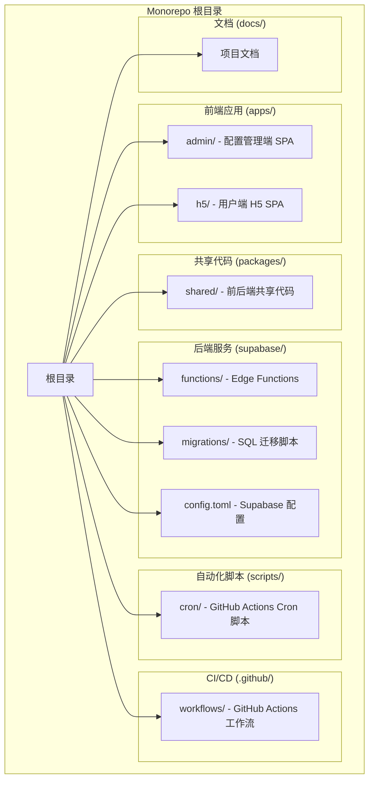
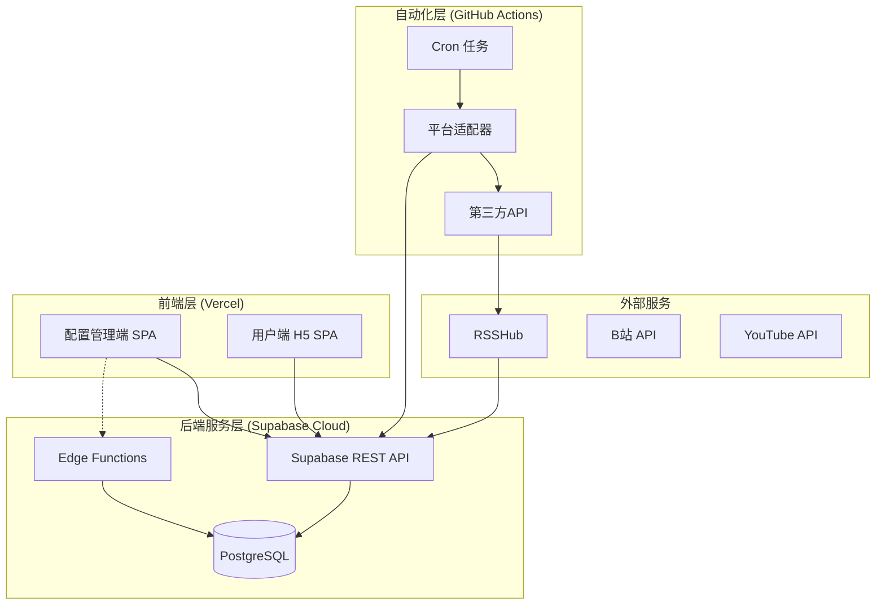
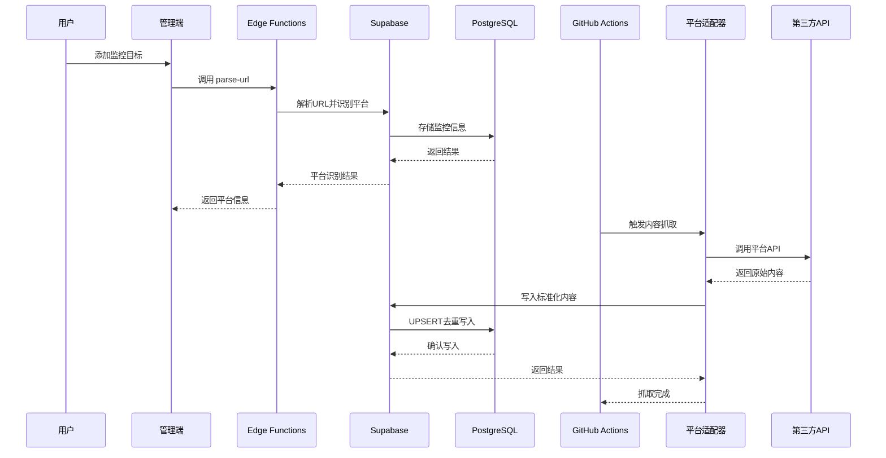
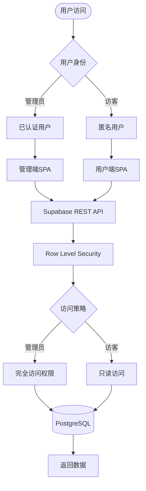

# 技术选型

<cite>
**本文档引用的文件**
- [PROJECT_CONTEXT.md](file://PROJECT_CONTEXT.md)
</cite>

## 目录
1. [简介](#简介)
2. [项目结构](#项目结构)
3. [核心技术栈](#核心技术栈)
4. [架构概览](#架构概览)
5. [详细技术分析](#详细技术分析)
6. [技术协同机制](#技术协同机制)
7. [性能考量](#性能考量)
8. [故障排查指南](#故障排查指南)
9. [结论](#结论)

## 简介

多平台内容中枢项目是一个基于云原生技术栈构建的内容聚合平台，旨在整合多个社交媒体平台的内容资源。该项目采用了现代化的技术组合，包括前端React 18 + TypeScript、构建工具Vite 5、后端Supabase Cloud、数据库PostgreSQL 15、边缘计算Deno + Edge Functions以及CI/CD流水线GitHub Actions等关键技术。

该项目的核心目标是提供一个安全、可靠、可扩展的内容聚合解决方案，通过云端基础设施实现内容的自动化抓取、处理和展示。

## 项目结构

项目采用Monorepo架构，基于pnpm workspace进行统一管理。整体结构设计遵循了现代前端开发的最佳实践，将前端应用、共享代码、后端服务和自动化脚本进行合理分离。

**图表来源**
- [PROJECT_CONTEXT.md: 55-142:55-142](file://PROJECT_CONTEXT.md#L55-L142)

**章节来源**
- [PROJECT_CONTEXT.md: 51-142:51-142](file://PROJECT_CONTEXT.md#L51-L142)

## 核心技术栈

### 前端框架：React 18 + TypeScript

项目采用React 18作为前端框架，结合TypeScript提供强类型支持。系统包含两个独立的SPA应用：配置管理端和用户端H5。

**技术选型理由：**
- **React 18**：提供最新的并发特性和性能优化，支持Suspense、自动批处理等特性
- **TypeScript**：增强代码可维护性，提供编译时类型检查，减少运行时错误
- **双SPA架构**：分离管理功能和用户展示，降低复杂度，提高开发效率

**适用场景：**
- 快速原型开发和迭代
- 大型单页应用的状态管理
- 组件化开发模式

### 构建工具：Vite 5

采用Vite 5作为构建工具，提供极速的开发体验和高效的生产构建。

**技术选型理由：**
- **快速HMR**：热模块替换速度极快，提升开发体验
- **生产构建优化**：Tree-shaking、代码分割等优化技术
- **原生ES模块支持**：更好的现代浏览器兼容性

**优势：**
- 开发服务器启动时间短
- 模块热替换响应迅速
- 生产构建体积更小

### 样式方案：Tailwind CSS 3

使用Tailwind CSS 3作为原子化CSS框架，移动端优先的设计理念。

**技术选型理由：**
- **原子化设计**：类名即样式，减少CSS文件大小
- **移动端优先**：符合现代Web开发趋势
- **高度可定制**：灵活的主题配置和自定义选项

### 后端服务：Supabase Cloud

采用Supabase Cloud作为后端即服务（BaaS）解决方案，集成了PostgreSQL、PostgREST和Edge Functions。

**技术选型理由：**
- **一体化解决方案**：数据库、认证、存储、实时功能集成
- **开源免费**：降低基础设施成本
- **云原生架构**：自动扩缩容，高可用性
- **开发者友好**：丰富的API和工具链

### 数据库：PostgreSQL 15（Supabase托管）

使用PostgreSQL 15版本，通过Supabase托管服务提供数据库服务。

**技术选型理由：**
- **ACID事务**：保证数据一致性和可靠性
- **丰富功能**：JSON支持、全文搜索、地理空间数据等
- **企业级特性**：备份恢复、复制、性能监控
- **RLS支持**：行级安全控制，满足复杂的权限需求

### 边缘计算：Deno + Edge Functions

利用Deno运行时和Supabase Edge Functions实现轻量级serverless函数。

**技术选型理由：**
- **高性能**：Deno的V8引擎提供优秀的执行性能
- **TypeScript原生支持**：无需额外编译步骤
- **轻量级**：冷启动速度快，成本低
- **安全性**：沙箱环境，权限控制严格

### 定时任务：GitHub Actions

使用GitHub Actions实现每30分钟触发的自动化任务。

**技术选型理由：**
- **集成度高**：与GitHub仓库无缝集成
- **成本效益**：免费额度充足，适合小型项目
- **灵活性**：支持复杂的CI/CD流程
- **可观测性**：详细的执行日志和状态报告

### 知乎中转：RSSHub

通过RSSHub作为知乎内容的中转服务，部署在Railway/Fly.io平台上。

**技术选型理由：**
- **专门化服务**：RSSHub专为RSS/订阅内容设计
- **易于部署**：Docker容器化，部署简单
- **API Key鉴权**：安全访问控制
- **稳定可靠**：成熟的开源项目

**章节来源**
- [PROJECT_CONTEXT.md: 8-24:8-24](file://PROJECT_CONTEXT.md#L8-L24)

## 架构概览

项目采用分层架构设计，实现了前后端分离、数据流清晰、权限控制严格的系统架构。

**图表来源**
- [PROJECT_CONTEXT.md: 173-207:173-207](file://PROJECT_CONTEXT.md#L173-L207)

**章节来源**
- [PROJECT_CONTEXT.md: 169-240:169-240](file://PROJECT_CONTEXT.md#L169-L240)

## 详细技术分析

### React 18 + TypeScript 详细分析

React 18为项目提供了现代化的前端开发体验，结合TypeScript确保了代码质量。

**组件架构：**
- **通用组件**：位于`components/`目录，可复用性强
- **页面组件**：位于`pages/`目录，负责页面级别的布局
- **自定义Hooks**：位于`hooks/`目录，封装业务逻辑
- **工具函数**：位于`lib/`目录，提供辅助功能

**TypeScript集成：**
- **类型安全**：通过共享类型定义确保前后端一致性
- **开发体验**：智能提示和编译时错误检查
- **重构安全**：类型系统保障代码重构的安全性

### Vite 5 构建系统

Vite 5提供了现代化的构建工具链，支持快速开发和高效生产构建。

**开发特性：**
- **快速启动**：毫秒级的开发服务器启动时间
- **热模块替换**：实时代码更新，无需刷新页面
- **原生ES模块**：支持现代JavaScript特性

**生产优化：**
- **Tree Shaking**：消除未使用的代码
- **代码分割**：按需加载，提升首屏性能
- **压缩优化**：生成最小化的生产代码

### Supabase Cloud 核心功能

Supabase Cloud作为一体化后端服务，提供了完整的云原生解决方案。

**数据库功能：**
- **PostgreSQL 15**：企业级关系型数据库
- **PostgREST**：自动生成REST API
- **Row Level Security**：细粒度权限控制

**边缘计算：**
- **Deno运行时**：高性能serverless函数
- **冷启动优化**：快速响应请求
- **安全沙箱**：隔离执行环境

### Deno Edge Functions 实现

Edge Functions使用Deno运行时，提供轻量级的serverless能力。

**函数组织：**
- **parse-url**：URL解析和平台识别
- **bilibili-auth**：B站扫码登录授权
- **共享代码**：`_shared/`目录中的公共模块

**安全特性：**
- **权限控制**：严格的访问控制
- **资源限制**：内存和执行时间限制
- **日志审计**：完整的执行日志

### GitHub Actions 自动化

GitHub Actions实现了内容抓取的自动化流程。

**工作流设计：**
- **定时触发**：每30分钟执行一次
- **平台适配器**：针对不同平台的专用适配器
- **数据处理**：清洗、标准化、去重逻辑

**错误处理：**
- **重试机制**：网络异常时的自动重试
- **告警通知**：失败时的通知机制
- **日志记录**：详细的执行日志

**章节来源**
- [PROJECT_CONTEXT.md: 243-347:243-347](file://PROJECT_CONTEXT.md#L243-L347)

## 技术协同机制

### 数据流协同

项目实现了清晰的数据流向，确保各组件间的协调工作。

**图表来源**
- [PROJECT_CONTEXT.md: 227-239:227-239](file://PROJECT_CONTEXT.md#L227-L239)

### 权限控制协同

项目实现了多层次的权限控制机制，确保数据安全。

**图表来源**
- [PROJECT_CONTEXT.md: 350-417:350-417](file://PROJECT_CONTEXT.md#L350-L417)

### 安全机制协同

项目采用了多层安全防护措施，确保系统的安全性。

**密钥管理：**
- **前端密钥**：`SUPABASE_ANON_KEY`，受RLS保护
- **服务密钥**：`SUPABASE_SERVICE_ROLE_KEY`，仅用于服务端
- **第三方密钥**：API Key存储在GitHub Secrets中

**数据保护：**
- **敏感信息加密**：B站Cookie使用Supabase Vault加密
- **访问控制**：所有表启用RLS策略
- **审计日志**：完整的操作记录

**章节来源**
- [PROJECT_CONTEXT.md: 349-417:349-417](file://PROJECT_CONTEXT.md#L349-L417)

## 性能考量

### 前端性能优化

**React 18并发特性：**
- **自动批处理**：减少不必要的重渲染
- **Suspense**：支持异步组件加载
- **并发渲染**：提高用户体验

**Vite构建优化：**
- **代码分割**：按需加载，减少初始包大小
- **缓存策略**：浏览器缓存优化
- **Tree Shaking**：消除未使用代码

### 后端性能优化

**Supabase优化：**
- **连接池管理**：高效的数据库连接复用
- **查询优化**：索引和查询计划优化
- **缓存策略**：合理的缓存配置

**Edge Functions优化：**
- **冷启动优化**：预热机制减少延迟
- **资源限制**：防止资源滥用
- **并发控制**：合理的并发限制

### 数据库性能

**PostgreSQL优化：**
- **索引设计**：针对查询模式的索引优化
- **分区策略**：大数据量的分区管理
- **统计信息**：定期更新表统计信息

**查询优化：**
- **批量操作**：使用UPSERT减少往返次数
- **分页查询**：避免全表扫描
- **连接复用**：减少连接建立开销

## 故障排查指南

### 常见问题诊断

**前端问题：**
- **组件渲染异常**：检查React DevTools，确认props传递
- **TypeScript编译错误**：验证共享类型定义的一致性
- **构建失败**：检查Vite配置和依赖版本

**后端问题：**
- **API调用失败**：验证Supabase密钥配置
- **Edge Functions错误**：检查Deno运行时日志
- **数据库连接问题**：确认连接字符串和网络配置

**自动化问题：**
- **Cron任务失败**：检查GitHub Actions日志
- **第三方API限制**：验证API配额和速率限制
- **数据同步问题**：确认UPSERT逻辑和冲突处理

### 性能监控

**指标监控：**
- **前端性能**：LCP、FID、CLS等Core Web Vitals
- **后端性能**：API响应时间、数据库查询时间
- **系统健康**：CPU使用率、内存占用、网络延迟

**日志分析：**
- **错误日志**：定期审查错误日志
- **性能日志**：分析慢查询和性能瓶颈
- **安全日志**：监控异常访问和权限尝试

**章节来源**
- [PROJECT_CONTEXT.md: 600-646:600-646](file://PROJECT_CONTEXT.md#L600-L646)

## 结论

多平台内容中枢项目的技术选型体现了现代Web开发的最佳实践，通过精心选择的技术栈实现了功能完整性、性能优化和安全性保障的平衡。

**技术选型的优势：**

1. **云原生架构**：充分利用云服务的优势，降低运维复杂度
2. **现代化开发体验**：React 18 + TypeScript + Vite提供优秀的开发体验
3. **安全优先设计**：多层安全防护确保系统安全
4. **可扩展性**：微服务化架构支持未来的功能扩展
5. **成本效益**：开源技术栈和云服务的组合实现成本优化

**技术组合的协同效应：**

- **前后端分离**：清晰的职责边界，提高开发效率
- **数据流清晰**：从第三方API到数据库的完整数据管道
- **权限控制严格**：基于RLS的细粒度访问控制
- **自动化程度高**：GitHub Actions实现内容的自动化抓取

**未来发展方向：**

1. **监控和可观测性**：增加更完善的监控指标
2. **缓存策略**：优化前端和后端的缓存机制
3. **国际化支持**：扩展多语言功能
4. **移动端优化**：进一步优化移动端用户体验

这个技术选型为项目奠定了坚实的基础，既满足了当前的功能需求，也为未来的扩展和发展提供了良好的技术支撑。