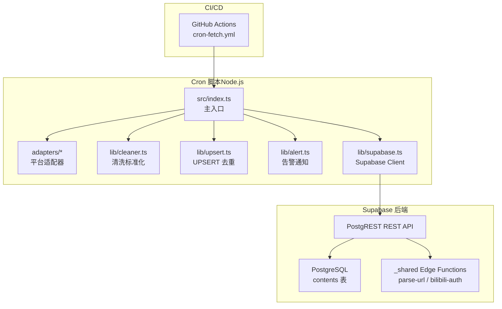
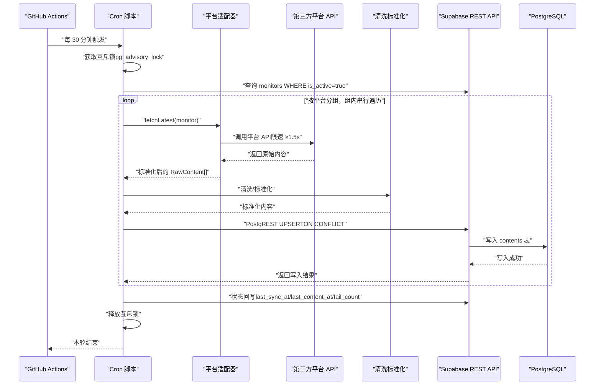
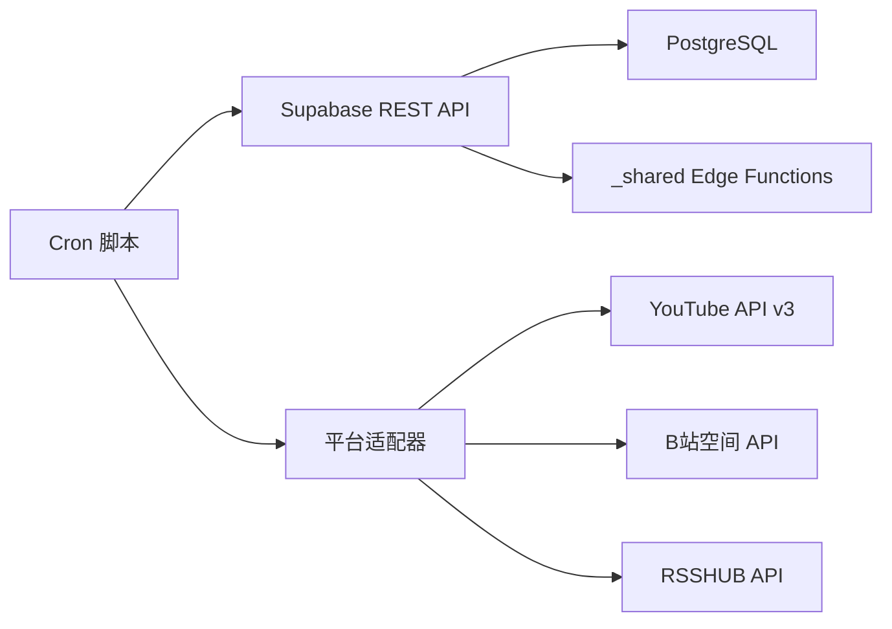

# 写入流（Cron抓取）

<cite>
**本文引用的文件**
- [PROJECT_CONTEXT.md](file://PROJECT_CONTEXT.md)
- [多平台中枢_PRD.md](file://多平台中枢_PRD.md)
</cite>

## 目录
1. [简介](#简介)
2. [项目结构](#项目结构)
3. [核心组件](#核心组件)
4. [架构总览](#架构总览)
5. [详细组件分析](#详细组件分析)
6. [依赖分析](#依赖分析)
7. [性能考虑](#性能考虑)
8. [故障排查指南](#故障排查指南)
9. [结论](#结论)
10. [附录](#附录)

## 简介
本文件聚焦“写入流（Cron抓取）”的数据流，完整描述从 GitHub Actions 触发到数据库写入的端到端过程：  
GitHub Actions Cron 调度 → 第三方平台 API 调用 → 数据清洗标准化 → Supabase REST API UPSERT 写入 → PostgreSQL 数据库存储。

同时解释平台适配器的工作原理、数据清洗与标准化流程、UPSERT 去重机制、以及 pg_advisory_lock 互斥锁的使用方式，并提供时序图与流程图帮助理解。

## 项目结构
- 仓库采用 Monorepo 结构，核心与本写入流相关的目录与职责如下：
  - scripts/cron：GitHub Actions Cron 脚本（Node.js），负责平台适配器调用、数据清洗、UPSERT 写入、状态回写与告警通知。
  - .github/workflows：GitHub Actions 工作流定义，定时触发 Cron 脚本。
  - supabase/functions/_shared：Edge Functions 共享代码（Deno），与写入流无直接耦合，但与 Supabase 后端交互相关。
  - supabase/migrations：数据库迁移脚本，定义 monitors、contents 等表及 RLS 策略。
  - packages/shared：前后端共享类型定义，保证类型一致性。

图表来源
- [PROJECT_CONTEXT.md:115-141](file://PROJECT_CONTEXT.md#L115-L141)
- [PROJECT_CONTEXT.md:617-643](file://PROJECT_CONTEXT.md#L617-L643)

章节来源
- [PROJECT_CONTEXT.md:115-141](file://PROJECT_CONTEXT.md#L115-L141)
- [PROJECT_CONTEXT.md:617-643](file://PROJECT_CONTEXT.md#L617-L643)

## 核心组件
- GitHub Actions 工作流：每 30 分钟触发一次 Cron 脚本，注入 Supabase Service Role Key、YouTube API Key、RSSHUB 地址与密钥等环境变量。
- 平台适配器层：统一接口定义，屏蔽不同平台差异，返回标准化的原始内容集合。
- 数据清洗标准化：统一字段、清洗标题、规范化封面与链接、统一发布时间为 UTC。
- UPSERT 去重：基于 (platform, native_id) 唯一索引，使用 PostgREST 的 merge-duplicates 模式进行去重写入。
- 状态回写：在写入完成后，更新 monitors 表的 last_sync_at、last_content_at、fail_count 等字段。
- pg_advisory_lock 互斥：使用 PostgreSQL 咨询锁，确保同一时刻只有一个 Cron 实例在运行，避免并发冲突。

章节来源
- [PROJECT_CONTEXT.md:301-317](file://PROJECT_CONTEXT.md#L301-L317)
- [PROJECT_CONTEXT.md:318-333](file://PROJECT_CONTEXT.md#L318-L333)
- [PROJECT_CONTEXT.md:617-643](file://PROJECT_CONTEXT.md#L617-L643)

## 架构总览
写入流的端到端时序如下：

图表来源
- [PROJECT_CONTEXT.md:654-717](file://PROJECT_CONTEXT.md#L654-L717)
- [PROJECT_CONTEXT.md:318-333](file://PROJECT_CONTEXT.md#L318-L333)
- [PROJECT_CONTEXT.md:617-643](file://PROJECT_CONTEXT.md#L617-L643)

章节来源
- [PROJECT_CONTEXT.md:654-717](file://PROJECT_CONTEXT.md#L654-L717)
- [PROJECT_CONTEXT.md:227-239](file://PROJECT_CONTEXT.md#L227-L239)

## 详细组件分析

### GitHub Actions Cron 调度
- 触发周期：每 30 分钟（*/30 * * * *）。
- 环境变量：Supabase URL、Service Role Key、YouTube API Key、RSSHUB 地址与 API Key。
- 执行步骤：安装依赖 → 运行 Cron 脚本入口文件。
- 超时控制：作业超时 10 分钟，避免长时间占用资源。

章节来源
- [PROJECT_CONTEXT.md:617-643](file://PROJECT_CONTEXT.md#L617-L643)

### 平台适配器层
- 统一接口：PlatformAdapter 定义 platform、fetchLatest、fetchDisplayName。
- 适配器差异：
  - B站：空间 API，使用 Cookie（SESSDATA），同平台请求间隔 ≥1.5s。
  - YouTube：Data API v3，使用 API Key，无需额外限速。
  - 知乎：通过 RSSHub 中转，使用 API Key 鉴权，同平台请求间隔 ≥1.5s。
- 输出：RawContent[]，包含 native_id、content_type、title、cover_url、original_url、published_at（ISO 8601 UTC）。

章节来源
- [PROJECT_CONTEXT.md:301-317](file://PROJECT_CONTEXT.md#L301-L317)
- [PROJECT_CONTEXT.md:574-598](file://PROJECT_CONTEXT.md#L574-L598)

### 数据清洗标准化
- 字段统一：标题去除 HTML 标签、封面图统一为 HTTPS 绝对路径、原文链接确保可达。
- 时间标准化：published_at 统一为 UTC。
- 关联字段：为每条内容附加 monitor_id，形成与 monitors 的外键关系。
- 增量策略：每次仅抓取最新前若干条，穿透置顶内容，降低被封禁风险。

章节来源
- [PROJECT_CONTEXT.md:654-717](file://PROJECT_CONTEXT.md#L654-L717)

### UPSERT 去重与元数据同步
- 唯一索引：(platform, native_id)。
- 写入模式：PostgREST 使用 Prefer: resolution=merge-duplicates 实现 UPSERT。
- 更新策略：
  - 新内容：INSERT，is_display = true。
  - 已存在：UPDATE title、cover_url、original_url。
  - 防复活保护：仅当 is_display = true 时才允许更新，防止软删除记录复活。
- 元数据同步：写入完成后，更新 monitors 的 last_sync_at；若有新增内容，额外更新 last_content_at。

章节来源
- [PROJECT_CONTEXT.md:318-333](file://PROJECT_CONTEXT.md#L318-L333)
- [PROJECT_CONTEXT.md:654-717](file://PROJECT_CONTEXT.md#L654-L717)

### 状态回写与告警
- 写回前校验：再次查询 monitor 是否仍存在且 is_active = true，避免并发删除或关闭导致的状态错误写回。
- 状态回写：只要适配器成功联通平台且未触发反爬拦截，则强制更新 fail_count = 0、status = normal、last_sync_at = now()；若有新增内容，额外更新 last_content_at = now()。
- 告警策略：fail_count ≥ 3 且 24h 内未告警时触发，消息包含平台名、昵称、失败次数、最后成功时间等。

章节来源
- [PROJECT_CONTEXT.md:654-717](file://PROJECT_CONTEXT.md#L654-L717)

### pg_advisory_lock 互斥锁
- 作用：确保同一时刻只有一个 Cron 实例在运行，避免并发冲突与重复写入。
- 实现：在 Cron 脚本启动时尝试获取咨询锁，若上一轮未完成则跳过本轮并记录日志；本轮结束后释放锁。

章节来源
- [PROJECT_CONTEXT.md:218](file://PROJECT_CONTEXT.md#L218)
- [PROJECT_CONTEXT.md:654-717](file://PROJECT_CONTEXT.md#L654-L717)

## 依赖分析
- Cron 脚本依赖 Supabase REST API（Service Role Key）进行写入，不直连 PostgreSQL。
- 平台适配器依赖各平台自有 API 与鉴权方式（Cookie、API Key、RSSHUB）。
- Edge Functions 与写入流解耦，仅用于 URL 解析与 B站扫码授权等轻量逻辑。

图表来源
- [PROJECT_CONTEXT.md:301-317](file://PROJECT_CONTEXT.md#L301-L317)
- [PROJECT_CONTEXT.md:318-333](file://PROJECT_CONTEXT.md#L318-L333)

章节来源
- [PROJECT_CONTEXT.md:301-317](file://PROJECT_CONTEXT.md#L301-L317)
- [PROJECT_CONTEXT.md:318-333](file://PROJECT_CONTEXT.md#L318-L333)

## 性能考虑
- 同平台请求间隔 ≥1.5s，避免触发平台频率限制。
- 每 30 分钟一次的抓取频率平衡了时效性与资源消耗。
- PostgREST UPSERT 使用 merge-duplicates，减少客户端复杂度与网络往返。
- 软删除保留 30 天历史，兼顾检索与存储成本。

## 故障排查指南
- Cookie 失效：B站 Cookie 失效会导致抓取失败，状态机进入 cookie_expired；修复后会自动恢复。
- API 限流/反爬：若连续失败达到阈值，状态机进入 rate_limited 并触发告警。
- 写入异常：检查 Supabase Service Role Key 是否正确、contents 表唯一索引是否冲突、PostgREST 请求头 Prefer 设置是否正确。
- Cron 并发冲突：若发现重复写入或数据不一致，检查 pg_advisory_lock 是否生效、上一轮是否提前退出。

章节来源
- [PROJECT_CONTEXT.md:721-785](file://PROJECT_CONTEXT.md#L721-L785)
- [PROJECT_CONTEXT.md:318-333](file://PROJECT_CONTEXT.md#L318-L333)

## 结论
本写入流通过 GitHub Actions 定时触发、平台适配器统一抽象、清洗标准化与 PostgREST UPSERT 去重，实现了从第三方平台到 PostgreSQL 的高可靠数据管道。结合 pg_advisory_lock 互斥锁与软删除策略，系统在保证数据一致性的同时具备良好的可维护性与扩展性。

## 附录
- 数据模型（简化）：
  - contents 表：platform、native_id、content_type、title、cover_url、original_url、published_at、monitor_id、is_display、created_at；唯一索引 (platform, native_id)。
  - monitors 表：id、platform、native_id、display_name、name_auto、original_url、is_active、last_sync_at、last_content_at、fail_count、status、created_at。

章节来源
- [PROJECT_CONTEXT.md:345-361](file://PROJECT_CONTEXT.md#L345-L361)
- [PROJECT_CONTEXT.md:328-344](file://PROJECT_CONTEXT.md#L328-L344)