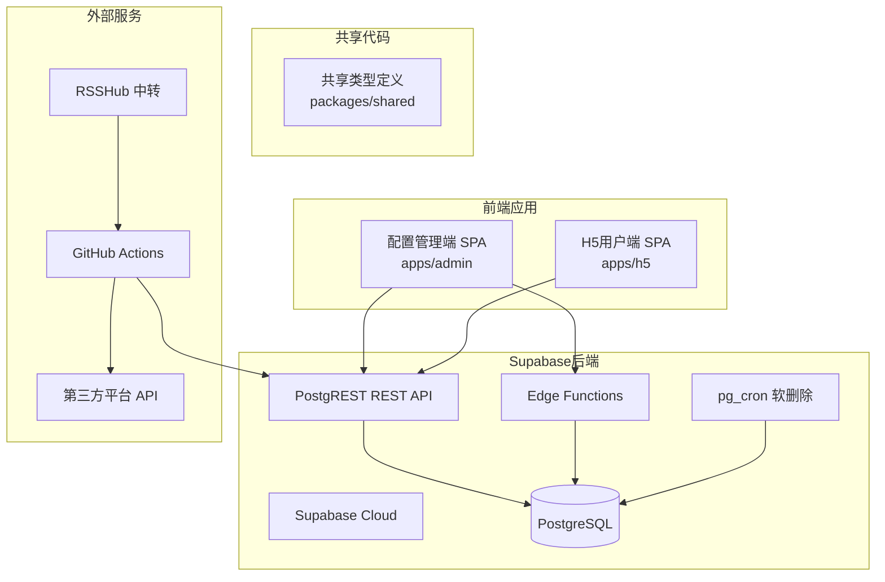
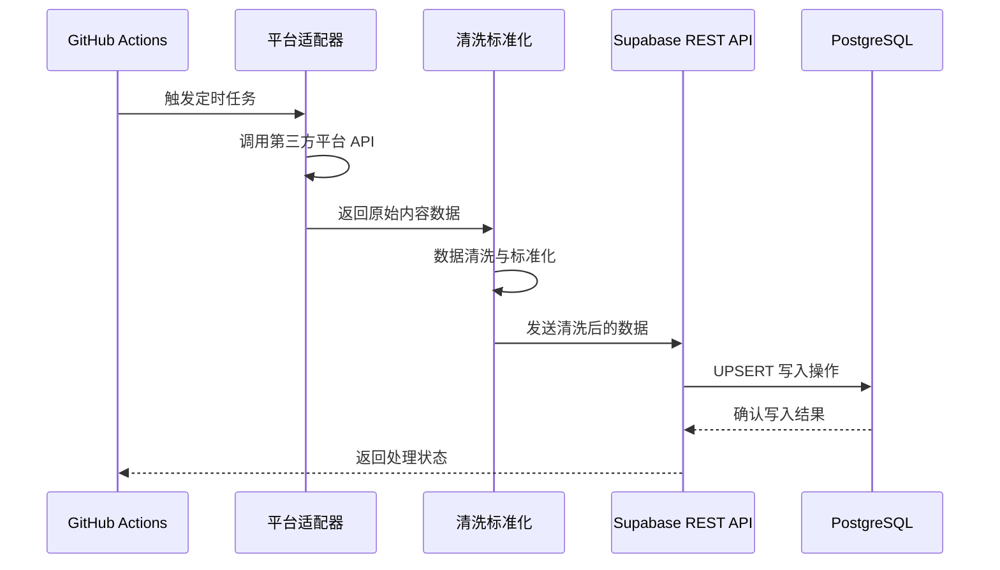
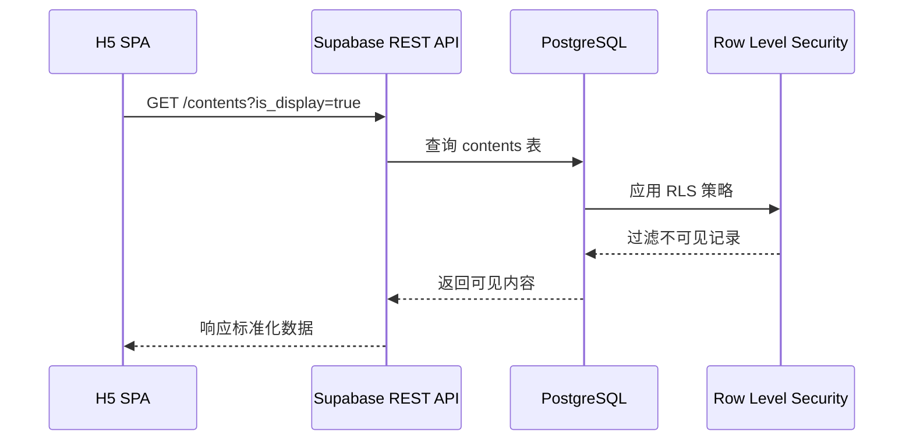
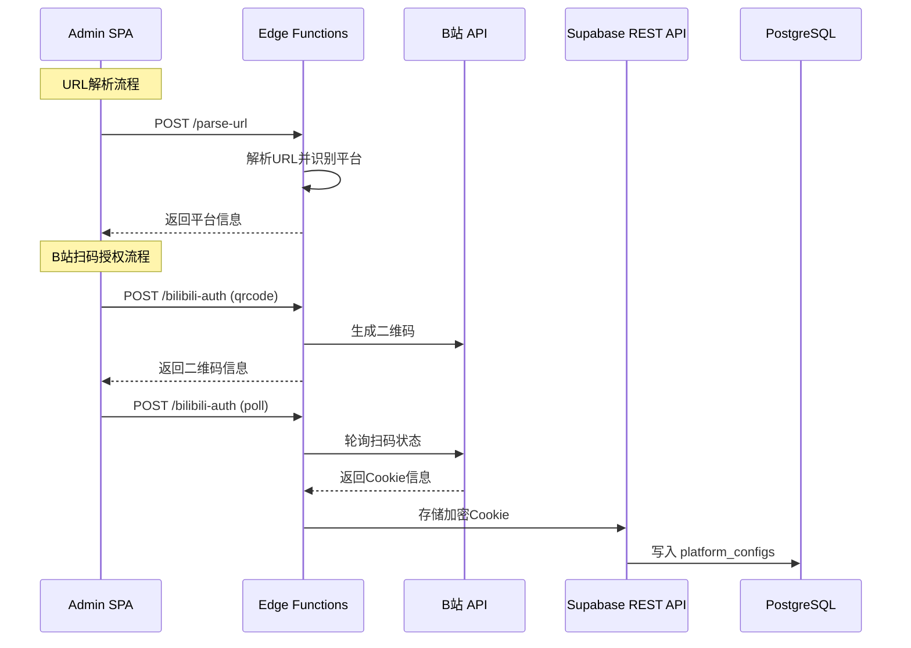
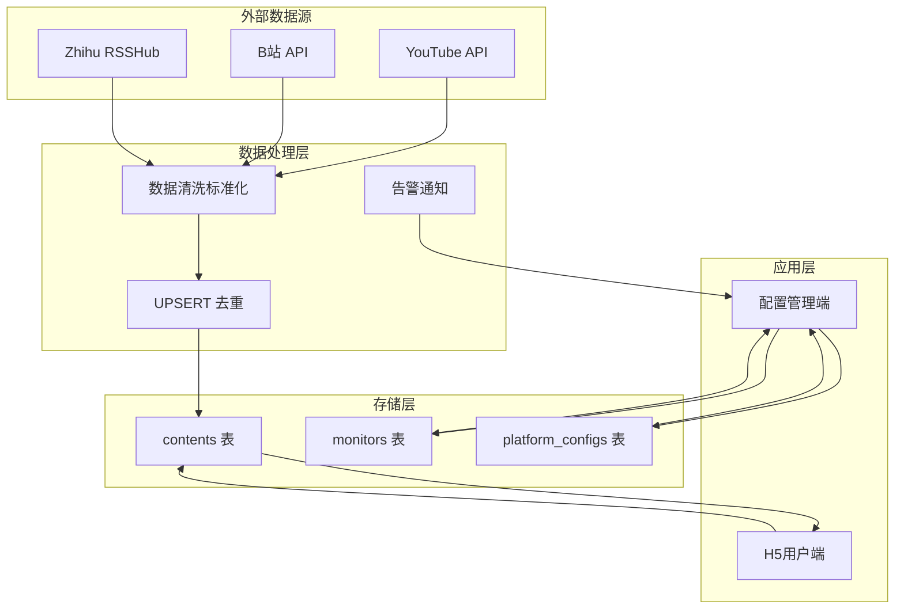
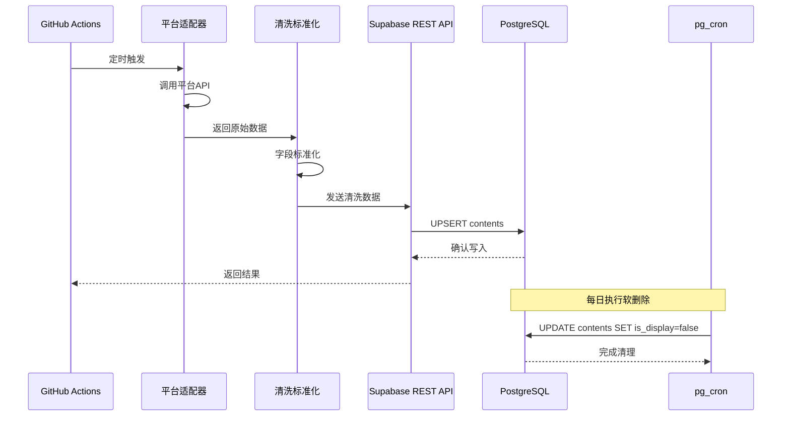
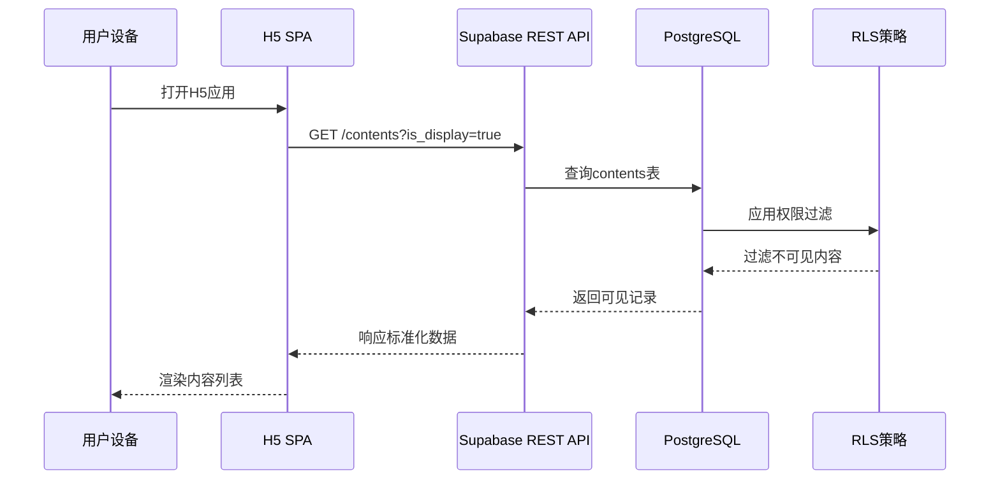
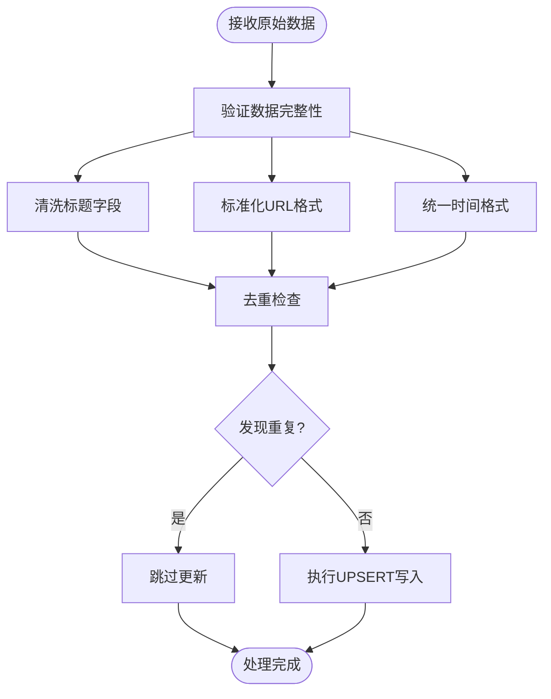

# 数据流设计

<cite>
**本文档引用的文件**
- [PROJECT_CONTEXT.md](file://PROJECT_CONTEXT.md)
</cite>

## 目录
1. [简介](#简介)
2. [项目结构](#项目结构)
3. [核心数据流概览](#核心数据流概览)
4. [写入流（Cron抓取）](#写入流cron抓取)
5. [读取流（H5浏览）](#读取流h5浏览)
6. [配置流（管理端）](#配置流管理端)
7. [数据流图](#数据流图)
8. [时序图](#时序图)
9. [数据处理与质量保障](#数据处理与质量保障)
10. [性能考虑](#性能考虑)
11. [故障排查指南](#故障排查指南)
12. [结论](#结论)

## 简介

多平台内容中枢是一个基于 Supabase Cloud 的内容聚合平台，通过 GitHub Actions 定时抓取多个平台的内容，并提供配置管理端和用户端 H5 应用。本文档详细描述了三个核心数据流的设计与实现：写入流（Cron抓取）、读取流（H5浏览）、配置流（管理端），以及它们在系统中的流转过程和处理逻辑。

## 项目结构

项目采用 Monorepo 架构，基于 pnpm workspace 管理，包含以下主要组件：

**图表来源**
- [PROJECT_CONTEXT.md: 55-141:55-141](file://PROJECT_CONTEXT.md#L55-L141)

**章节来源**
- [PROJECT_CONTEXT.md: 51-141:51-141](file://PROJECT_CONTEXT.md#L51-L141)

## 核心数据流概览

系统包含三个核心数据流，每个都有明确的职责边界和处理流程：

```mermaid
flowchart TD
subgraph "写入流Cron抓取"
A1[GitHub Actions 触发] --> A2[第三方平台 API 调用]
A2 --> A3[数据清洗标准化]
A3 --> A4[Supabase REST API UPSERT]
A4 --> A5[PostgreSQL 数据库]
end
subgraph "读取流H5浏览"
B1[H5 SPA 用户请求] --> B2[Supabase REST API 查询]
B2 --> B3[PostgreSQL 查询]
B3 --> B4[RLS 权限过滤]
B4 --> B5[返回可见内容]
end
subgraph "配置流管理端"
C1[Admin SPA 配置请求] --> C2[Edge Function 处理]
C2 --> C3[Supabase REST API]
C3 --> C4[PostgreSQL 配置更新]
end
```

**图表来源**
- [PROJECT_CONTEXT.md: 224-239:224-239](file://PROJECT_CONTEXT.md#L224-L239)

## 写入流（Cron抓取）

写入流是系统的核心数据输入管道，负责从各个平台抓取内容并写入数据库。

### 数据流路径

**图表来源**
- [PROJECT_CONTEXT.md: 227-228:227-228](file://PROJECT_CONTEXT.md#L227-L228)

### 处理逻辑详解

#### 1. 平台适配器层
- **B站适配器**：使用 Cookie + 空间 API，支持同平台请求间隔 ≥ 1.5 秒
- **YouTube适配器**：使用 Data API v3，无需额外限速
- **知乎适配器**：通过 RSSHub 中转，使用 API Key 鉴权

#### 2. 数据清洗标准化
- 标准化字段格式（native_id、content_type、title等）
- 统一时间戳格式（ISO 8601 UTC）
- 清理无效或重复的数据

#### 3. UPSERT 去重机制
基于 `(platform, native_id)` 唯一索引的去重写入，使用 PostgreSQL `ON CONFLICT` 语法，防止软删除记录复活。

**章节来源**
- [PROJECT_CONTEXT.md: 301-334:301-334](file://PROJECT_CONTEXT.md#L301-L334)

## 读取流（H5浏览）

读取流为用户提供只读的内容浏览体验，严格遵循 RLS 权限控制。

### 数据流路径

**图表来源**
- [PROJECT_CONTEXT.md: 230-231:230-231](file://PROJECT_CONTEXT.md#L230-L231)

### 权限控制机制

系统采用极简双角色模型：

| 角色 | 访问方式 | 权限范围 | RLS 策略 |
|------|----------|----------|----------|
| 管理员 | Supabase Auth 认证 | monitors / contents / platform_configs 全部读写 | 全部允许 |
| 访客 | 匿名用户（anon） | contents 表只读 | 仅 `is_display = true` 的记录 |

**章节来源**
- [PROJECT_CONTEXT.md: 349-417:349-417](file://PROJECT_CONTEXT.md#L349-L417)

## 配置流（管理端）

配置流服务于管理员，提供监控目标管理、URL解析、B站扫码授权等功能。

### 数据流路径

**图表来源**
- [PROJECT_CONTEXT.md: 233-235:233-235](file://PROJECT_CONTEXT.md#L233-L235)

### Edge Functions 功能

#### parse-url 功能
- 输入：`{ url: string }`
- 输出：`{ platform: string, native_id: string, display_name?: string }`
- 平台识别规则：
  - 含 `bilibili.com` → B站，正则提取 `mid`
  - 含 `youtube.com` → YouTube，提取 `@handle` 并调 `channels.list?forHandle=` 转 `channelId`
  - 含 `zhihu.com` → 知乎，正则提取 `people_id` 或 `column_id`

#### bilibili-auth 功能
- 二维码生成：`POST /bilibili-auth` body `{ action: "qrcode" }`
- 状态轮询：`POST /bilibili-auth` body `{ action: "poll", qrcode_key: string }`
- Cookie存储：成功后将加密 Cookie 存入 `platform_configs` 表

**章节来源**
- [PROJECT_CONTEXT.md: 281-300:281-300](file://PROJECT_CONTEXT.md#L281-L300)

## 数据流图

### 系统整体数据流

**图表来源**
- [PROJECT_CONTEXT.md: 224-239:224-239](file://PROJECT_CONTEXT.md#L224-L239)

## 时序图

### 内容抓取与写入流程

**图表来源**
- [PROJECT_CONTEXT.md: 227-239:227-239](file://PROJECT_CONTEXT.md#L227-L239)

### 用户内容浏览流程

**图表来源**
- [PROJECT_CONTEXT.md: 230-231:230-231](file://PROJECT_CONTEXT.md#L230-L231)

## 数据处理与质量保障

### 数据清洗标准化流程

**图表来源**
- [PROJECT_CONTEXT.md: 318-334:318-334](file://PROJECT_CONTEXT.md#L318-L334)

### 安全与权限控制

系统实施多层次的安全防护：

1. **密钥分离**：`SUPABASE_ANON_KEY` 用于前端，`SUPABASE_SERVICE_ROLE_KEY` 仅用于服务端
2. **RLS策略**：所有表启用 Row Level Security，严格控制访问权限
3. **敏感信息加密**：B站 Cookie 使用 Supabase Vault 加密存储
4. **API鉴权**：RSSHub 启用 API Key 鉴权，防止未授权访问

**章节来源**
- [PROJECT_CONTEXT.md: 402-417:402-417](file://PROJECT_CONTEXT.md#L402-L417)

## 性能考虑

### 并发与限速策略

- **平台间并行**：不同平台间可同时抓取，提高整体效率
- **平台内串行**：同平台请求间隔 ≥ 1.5 秒，防止反爬虫检测
- **缓存策略**：Edge Functions 仅处理轻量逻辑，避免缓存热点
- **数据库优化**：使用咨询锁 (`pg_advisory_lock`) 防止 Cron 任务并发冲突

### 监控与告警

系统集成了企业微信 Webhook 告警机制，当抓取过程中出现异常时能够及时通知管理员。

**章节来源**
- [PROJECT_CONTEXT.md: 218-221:218-221](file://PROJECT_CONTEXT.md#L218-L221)

## 故障排查指南

### 常见问题诊断

#### 写入流问题
- **症状**：内容长时间不更新
- **排查要点**：检查 GitHub Actions 工作流状态、平台 API 密钥有效性、数据库连接状态
- **解决方案**：重新触发工作流、更新 API 密钥、检查网络连接

#### 读取流问题  
- **症状**：H5 页面显示空白或内容不完整
- **排查要点**：确认用户身份认证状态、检查 RLS 策略配置、验证 is_display 字段
- **解决方案**：重新登录、检查权限设置、清理浏览器缓存

#### 配置流问题
- **症状**：管理端无法添加新的监控目标
- **排查要点**：检查 Edge Functions 日志、验证 URL 解析功能、确认 B站 Cookie 状态
- **解决方案**：重新生成二维码、检查 B站 API 状态、更新认证信息

### 错误码参考

| 错误码 | HTTP状态 | 含义 | 处理建议 |
|--------|----------|------|----------|
| UNKNOWN_PLATFORM | 400 | 无法识别URL对应的平台 | 检查URL格式是否正确 |
| INVALID_URL | 400 | URL格式不合法 | 修正URL格式 |
| DUPLICATE_MONITOR | 409 | 该博主已添加 | 检查现有监控列表 |
| BILIBILI_QRCODE_EXPIRED | 400 | B站二维码已过期 | 重新生成二维码 |
| BILIBILI_COOKIE_INVALID | 401 | B站Cookie已失效 | 重新扫码登录 |
| YOUTUBE_API_ERROR | 502 | YouTube API调用失败 | 检查API密钥和配额 |
| RSSHUB_ERROR | 502 | RSSHub接口调用失败 | 检查RSSHub服务状态 |

**章节来源**
- [PROJECT_CONTEXT.md: 600-614:600-614](file://PROJECT_CONTEXT.md#L600-L614)

## 结论

多平台内容中枢通过清晰的数据流设计实现了高效的内容聚合与分发。三个核心数据流各有明确的职责边界：写入流专注于数据采集与入库，读取流确保数据安全访问，配置流提供灵活的管理能力。系统采用的架构模式既保证了可扩展性，又确保了安全性与可靠性。

通过合理的数据处理流程、严格的权限控制和完善的监控告警机制，该系统能够在保证用户体验的同时，为后续的功能扩展和性能优化奠定了坚实的基础。