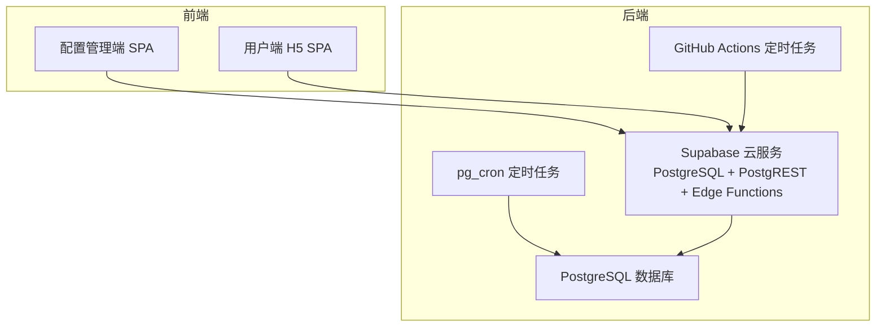
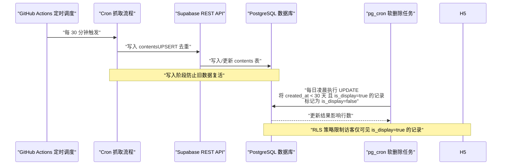
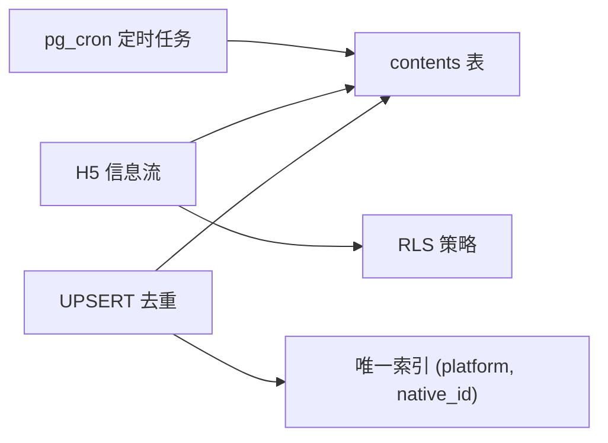

# 清理流（软删除）

<cite>
**本文引用的文件**
- [PROJECT_CONTEXT.md](file://PROJECT_CONTEXT.md)
- [多平台中枢_PRD.md](file://多平台中枢_PRD.md)
</cite>

## 目录
1. [简介](#简介)
2. [项目结构](#项目结构)
3. [核心组件](#核心组件)
4. [架构总览](#架构总览)
5. [详细组件分析](#详细组件分析)
6. [依赖关系分析](#依赖关系分析)
7. [性能考量](#性能考量)
8. [故障排查指南](#故障排查指南)
9. [结论](#结论)

## 简介
本文件聚焦“清理流（软删除）”主题，系统性阐述基于 Supabase pg_cron 的自动清理机制：定时任务触发 → SQL UPDATE 操作 → contents 表软删除（is_display=false）。文档详细解释如何通过 SQL 将超过 30 天未显示的内容标记为不可见，以及该软删除策略如何与 UPSERT 去重机制协同，防止旧数据复活；同时说明 pg_cron 的配置要点、SQL UPDATE 的执行逻辑，以及软删除对用户端 H5 信息流展示的影响。

## 项目结构
- 本项目采用 Monorepo 结构，前端（apps/admin、apps/h5）、共享类型（packages/shared）、Supabase 配置（supabase/）、定时抓取脚本（scripts/cron）等模块清晰分离。
- 清理流属于“后端自动化引擎”的一部分，与“定时轮询（Cron Job）”“数据清洗与去重（UPSERT）”共同构成数据生命周期管理闭环。

章节来源
- [PROJECT_CONTEXT.md: 51-142:51-142](file://PROJECT_CONTEXT.md#L51-L142)

## 核心组件
- 定时任务（GitHub Actions）：每 30 分钟触发一次抓取流程，负责增量采集与去重写入。
- pg_cron：每日凌晨执行软删除扫描任务，将超过 30 天且 is_display=true 的记录标记为 is_display=false。
- contents 表：承载内容卡片数据，包含 is_display 字段用于软删除控制。
- RLS 策略：访客仅能读取 is_display=true 的记录，确保软删除内容对用户端不可见。
- UPSERT 去重：在写入阶段通过 ON CONFLICT ... WHERE contents.is_display = true 防止旧数据复活。

章节来源
- [PROJECT_CONTEXT.md: 179-189:179-189](file://PROJECT_CONTEXT.md#L179-L189)
- [PROJECT_CONTEXT.md: 237-239:237-239](file://PROJECT_CONTEXT.md#L237-L239)
- [PROJECT_CONTEXT.md: 318-333:318-333](file://PROJECT_CONTEXT.md#L318-L333)
- [PROJECT_CONTEXT.md: 376-388:376-388](file://PROJECT_CONTEXT.md#L376-L388)
- [多平台中枢_PRD.md: 233-241:233-241](file://多平台中枢_PRD.md#L233-L241)

## 架构总览
清理流在整体数据流中的定位如下：

图表来源
- [PROJECT_CONTEXT.md: 227-239:227-239](file://PROJECT_CONTEXT.md#L227-L239)
- [多平台中枢_PRD.md: 233-241:233-241](file://多平台中枢_PRD.md#L233-L241)

## 详细组件分析

### pg_cron 定时任务配置与执行
- 触发频率：每日凌晨执行一次扫描任务。
- 执行主体：pg_cron 在 Supabase 托管环境中运行，负责扫描 contents 表并执行软删除。
- 执行条件：仅对 created_at 超过 30 天且 is_display=true 的记录进行更新。
- 执行结果：将这些记录的 is_display 字段置为 false，保留历史数据但使其在用户端不可见。

章节来源
- [PROJECT_CONTEXT.md: 188](file://PROJECT_CONTEXT.md#L188)
- [PROJECT_CONTEXT.md: 237-239:237-239](file://PROJECT_CONTEXT.md#L237-L239)
- [多平台中枢_PRD.md: 233-241:233-241](file://多平台中枢_PRD.md#L233-L241)

### SQL UPDATE 执行逻辑
- 目标表：contents
- 更新字段：is_display=false
- 过滤条件：
  - created_at < NOW() - INTERVAL '30 days'
  - is_display = true
- 执行方式：由 pg_cron 定时触发，直接在数据库层面执行 UPDATE。
- 影响范围：仅标记超期记录为不可见，不删除物理数据，便于后续审计与回溯。

章节来源
- [PROJECT_CONTEXT.md: 237-239:237-239](file://PROJECT_CONTEXT.md#L237-L239)
- [多平台中枢_PRD.md: 236-237:236-237](file://多平台中枢_PRD.md#L236-L237)

### 与 UPSERT 去重机制的协同
- UPSERT 写入阶段：
  - ON CONFLICT (platform, native_id) DO UPDATE SET ... WHERE contents.is_display = true
  - 防止旧数据复活：当记录 is_display=false（软删除）时，仅更新标题/封面/链接，严禁重置 is_display 和 created_at。
- 清理流与 UPSERT 的配合：
  - 清理流将超期记录标记为 is_display=false；
  - UPSERT 不会将这些记录视为“新内容”进行复活，从而形成稳定的生命周期闭环。

章节来源
- [PROJECT_CONTEXT.md: 322-333:322-333](file://PROJECT_CONTEXT.md#L322-L333)
- [多平台中枢_PRD.md: 224-232:224-232](file://多平台中枢_PRD.md#L224-L232)

### 对用户端 H5 信息流展示的影响
- 查询过滤：H5 信息流接口强制添加 WHERE is_display=true 条件，确保仅展示未软删除的内容。
- 展示范围：仅展示最近 30 天内的内容；超过 30 天的内容虽保留历史数据，但对用户不可见。
- RLS 保障：访客角色仅能读取 is_display=true 的记录，软删除内容对普通用户透明。

章节来源
- [PROJECT_CONTEXT.md: 443](file://PROJECT_CONTEXT.md#L443)
- [PROJECT_CONTEXT.md: 384-387:384-387](file://PROJECT_CONTEXT.md#L384-L387)
- [多平台中枢_PRD.md: 246-250:246-250](file://多平台中枢_PRD.md#L246-L250)

### 数据模型与字段说明
- contents 表关键字段：
  - is_display：布尔值，控制是否在 H5 信息流中展示（默认 true；超 30 天软删除后为 false）
  - created_at：入库时间，用于计算是否超过 30 天
  - published_at：原始发布时间，用于信息流排序
- RLS 策略：
  - 访客仅能 SELECT WHERE is_display = true
  - 管理员可读写全部记录

章节来源
- [多平台中枢_PRD.md: 345-361:345-361](file://多平台中枢_PRD.md#L345-L361)
- [PROJECT_CONTEXT.md: 376-388:376-388](file://PROJECT_CONTEXT.md#L376-L388)

## 依赖关系分析
- 组件耦合：
  - pg_cron 依赖 contents 表结构与 created_at 字段；
  - H5 信息流依赖 RLS 策略与 is_display 字段；
  - UPSERT 去重依赖 contents 表唯一索引 (platform, native_id) 与 is_display 字段。
- 外部依赖：
  - Supabase pg_cron 服务（托管于 Supabase Cloud）
  - GitHub Actions 定时调度（用于触发抓取流程，间接影响软删除时机）

图表来源
- [PROJECT_CONTEXT.md: 188](file://PROJECT_CONTEXT.md#L188)
- [PROJECT_CONTEXT.md: 376-388:376-388](file://PROJECT_CONTEXT.md#L376-L388)
- [多平台中枢_PRD.md: 224-232:224-232](file://多平台中枢_PRD.md#L224-L232)

## 性能考量
- 软删除扫描范围：仅扫描 created_at 超过 30 天且 is_display=true 的记录，避免全表扫描带来的性能压力。
- 执行频率：每日一次，与抓取频率（每 30 分钟）解耦，降低并发冲突风险。
- 历史数据保留：软删除不物理删除数据，便于审计与回溯，但需关注长期数据增长对查询性能的影响。

## 故障排查指南
- 软删除未生效
  - 检查 pg_cron 是否正常运行（Supabase 控制台查看任务日志）。
  - 确认 contents 表 created_at 字段是否正确，以及 is_display 字段是否按预期更新。
- H5 信息流仍显示超期内容
  - 检查 RLS 策略是否正确生效（访客仅能读取 is_display=true 的记录）。
  - 确认 H5 查询接口是否附加 WHERE is_display=true 条件。
- UPSERT 误复活旧数据
  - 检查 ON CONFLICT ... WHERE contents.is_display = true 的逻辑是否正确实现。
  - 确认软删除记录的 is_display=false 未被意外重置。

章节来源
- [PROJECT_CONTEXT.md: 376-388:376-388](file://PROJECT_CONTEXT.md#L376-L388)
- [多平台中枢_PRD.md: 233-241:233-241](file://多平台中枢_PRD.md#L233-L241)

## 结论
清理流通过 pg_cron 的每日软删除任务，结合 RLS 与 UPSERT 去重机制，实现了“保留历史、控制可见”的稳健数据生命周期管理。该方案既满足用户端 H5 信息流的展示需求，又为未来审计与分析保留完整数据，同时有效防止旧数据复活，提升系统的可维护性与一致性。