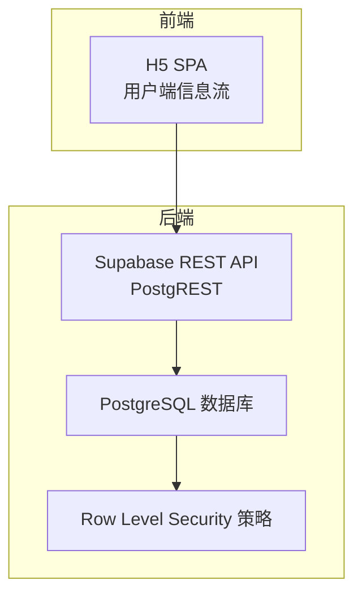
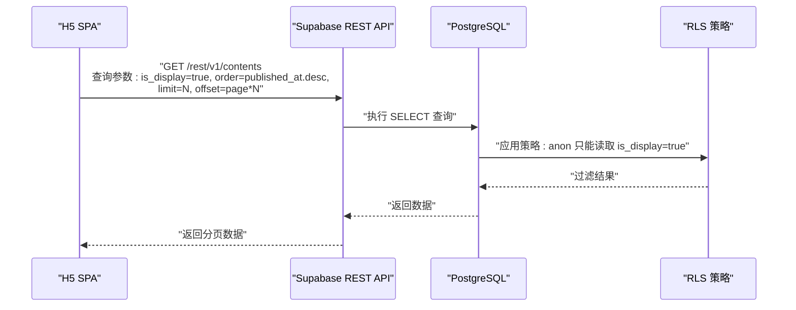
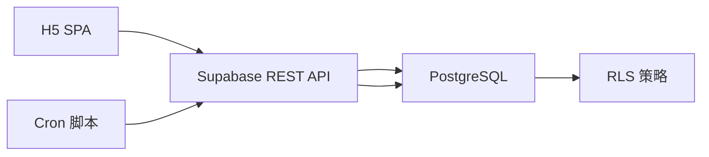

# 读取流（H5浏览）

<cite>
**本文引用的文件**
- [PROJECT_CONTEXT.md](file://PROJECT_CONTEXT.md)
- [多平台中枢_PRD.md](file://多平台中枢_PRD.md)
</cite>

## 目录
1. [简介](#简介)
2. [项目结构](#项目结构)
3. [核心组件](#核心组件)
4. [架构总览](#架构总览)
5. [详细组件分析](#详细组件分析)
6. [依赖关系分析](#依赖关系分析)
7. [性能考量](#性能考量)
8. [故障排查指南](#故障排查指南)
9. [结论](#结论)
10. [附录](#附录)

## 简介
本文件面向“多平台内容中枢”的用户端 H5 浏览场景，系统化梳理“读取流”数据链路：从前端 H5 SPA，经由 Supabase REST API，最终落到 PostgreSQL 数据库的完整过程。重点说明前端如何通过 Supabase REST API 查询 contents 表中 is_display=true 的记录，涵盖查询参数、排序规则、分页机制与 RLS 策略的应用；同时阐述用户端 H5 的信息流展示逻辑与 Deep Link 跳转机制，并解释 PostgreSQL 的 Row Level Security 如何确保访客只能读取显示的内容。

## 项目结构
- 前端应用（apps/h5）：用户端 H5 SPA，负责信息流展示与 Deep Link 跳转。
- Supabase 后端（PostgREST + PostgreSQL + Edge Functions）：提供 REST API、RLS 策略与数据库访问。
- 数据来源：由 GitHub Actions Cron 脚本抓取第三方平台内容，写入 contents 表，再由 H5 通过 REST API 读取。

图表来源
- [PROJECT_CONTEXT.md:230-231](file://PROJECT_CONTEXT.md#L230-L231)
- [PROJECT_CONTEXT.md:431-445](file://PROJECT_CONTEXT.md#L431-L445)

章节来源
- [PROJECT_CONTEXT.md:17-24](file://PROJECT_CONTEXT.md#L17-L24)
- [PROJECT_CONTEXT.md:51-142](file://PROJECT_CONTEXT.md#L51-L142)
- [PROJECT_CONTEXT.md:230-239](file://PROJECT_CONTEXT.md#L230-L239)

## 核心组件
- H5 SPA 前端：负责信息流展示、分页加载、按平台筛选、Deep Link 跳转与兜底弹窗。
- Supabase REST API：PostgREST 自动生成的 REST 接口，提供 contents 表的查询能力。
- PostgreSQL 数据库：存储 monitors、contents、platform_configs 等表，启用 RLS。
- RLS 策略：对 contents 表的匿名用户（anon）仅允许 SELECT is_display=true 的记录。

章节来源
- [PROJECT_CONTEXT.md:356-409](file://PROJECT_CONTEXT.md#L356-L409)
- [PROJECT_CONTEXT.md:420-473](file://PROJECT_CONTEXT.md#L420-L473)
- [PROJECT_CONTEXT.md:443](file://PROJECT_CONTEXT.md#L443)

## 架构总览
H5 浏览的读取流严格遵循“前端只用 anon key + RLS 保护”的原则：前端通过 Supabase REST API 查询 contents 表，强制包含 is_display=true 条件与 published_at 倒序排序，结合 limit/offset 实现分页；数据库侧 RLS 策略确保访客无法看到 is_display=false 的记录（如软删除内容）。

图表来源
- [PROJECT_CONTEXT.md:443](file://PROJECT_CONTEXT.md#L443)
- [PROJECT_CONTEXT.md:384-387](file://PROJECT_CONTEXT.md#L384-L387)

章节来源
- [PROJECT_CONTEXT.md:230-231](file://PROJECT_CONTEXT.md#L230-L231)
- [PROJECT_CONTEXT.md:431-445](file://PROJECT_CONTEXT.md#L431-L445)
- [PROJECT_CONTEXT.md:384-387](file://PROJECT_CONTEXT.md#L384-L387)

## 详细组件分析

### 1) H5 信息流展示与分页
- 展示规则：按 published_at 倒序展示所有 is_display=true 的内容卡片。
- 分页机制：每页固定数量（例如 20 条），通过 limit/offset 实现分页加载。
- 平台筛选：支持按平台 Tab 切换，前端在查询时附加 platform 等过滤条件。
- 交互细节：点击卡片时执行 Deep Link 跳转，失败则弹出兜底提示并可直接打开 original_url。

章节来源
- [PROJECT_CONTEXT.md:248-249](file://PROJECT_CONTEXT.md#L248-L249)
- [PROJECT_CONTEXT.md:443](file://PROJECT_CONTEXT.md#L443)
- [多平台中枢_PRD.md:248-256](file://多平台中枢_PRD.md#L248-L256)

### 2) Supabase REST API 查询参数与排序
- 路径与方法：GET /rest/v1/contents
- 查询参数要点：
  - select：限定返回字段（建议仅返回展示所需字段）
  - is_display=eq.true：RLS 保护的关键条件
  - order：published_at.desc（时间倒序）
  - limit：每页条数（如 20）
  - offset：页偏移（page*limit）
- 请求头：
  - apikey：使用 SUPABASE_ANON_KEY
  - Authorization：Bearer {token}（如有认证）
  - Content-Type：application/json
  - Prefer：return=representation（创建/更新时返回完整对象）
  - Prefer：resolution=merge-duplicates（UPSERT 模式）

章节来源
- [PROJECT_CONTEXT.md:431-455](file://PROJECT_CONTEXT.md#L431-L455)
- [PROJECT_CONTEXT.md:443](file://PROJECT_CONTEXT.md#L443)

### 3) PostgreSQL RLS 策略与访问控制
- contents 表策略：
  - 管理员（authenticated）：全部读写
  - 匿名用户（anon）：仅 SELECT 且必须满足 is_display=true
- 其他表策略：
  - monitors、platform_configs 等表同样启用 RLS，匿名用户默认不可见
- 密钥层级：
  - SUPABASE_ANON_KEY：前端公开使用，受 RLS 约束
  - SUPABASE_SERVICE_ROLE_KEY：仅 Cron 与 Edge Function 使用，绕过 RLS

章节来源
- [PROJECT_CONTEXT.md:360-409](file://PROJECT_CONTEXT.md#L360-L409)
- [PROJECT_CONTEXT.md:384-387](file://PROJECT_CONTEXT.md#L384-L387)

### 4) Deep Link 跳转机制
- 跳转优先级：
  1) 环境检测：微信/支付宝内直接复制 original_url 并引导在浏览器打开
  2) 系统浏览器：静默复制 original_url 至剪贴板
  3) Deep Link 唤醒：根据 (platform, content_type) 选择对应 Schema
  4) 兜底弹窗：若唤醒超时（约 2 秒），提示“链接已复制”，并提供“网页打开”按钮
- 支持平台与 Schema（示例）：
  - B站 video/article → bilibili://video/{native_id} / bilibili://article/{native_id}
  - YouTube video → youtube://watch?v={native_id}
  - 知乎：question/answer/article → zhihu://question/{native_id} 等
- 若无法匹配 Schema，则直接使用 original_url 打开网页

章节来源
- [多平台中枢_PRD.md:258-292](file://多平台中枢_PRD.md#L258-L292)
- [PROJECT_CONTEXT.md:339-344](file://PROJECT_CONTEXT.md#L339-L344)

### 5) 数据生命周期与软删除
- 生命周期：H5 信息流仅展示最近 30 天内的内容；超过 30 天的数据标记为 is_display=false（软删除），但仍保留在数据库中
- 执行机制：每日凌晨 Cron 扫描 contents 表，对 created_at 超过 30 天且 is_display=true 的记录执行 UPDATE
- 前端过滤：H5 查询强制包含 is_display=true 条件，确保软删除内容不可见

章节来源
- [PROJECT_CONTEXT.md:235-238](file://PROJECT_CONTEXT.md#L235-L238)
- [PROJECT_CONTEXT.md:331-333](file://PROJECT_CONTEXT.md#L331-L333)
- [PROJECT_CONTEXT.md:443](file://PROJECT_CONTEXT.md#L443)

## 依赖关系分析
- 前端依赖 Supabase REST API 提供的 contents 表查询能力
- Supabase 后端依赖 PostgreSQL 数据库与 RLS 策略实现访问控制
- 数据写入链路（上游）：Cron 脚本抓取第三方平台内容，写入 contents 表，再由 H5 通过 REST API 读取
- Edge Functions 与 Service Role Key 仅用于服务端操作，不参与 H5 的读取流

图表来源
- [PROJECT_CONTEXT.md:227-239](file://PROJECT_CONTEXT.md#L227-L239)
- [PROJECT_CONTEXT.md:431-445](file://PROJECT_CONTEXT.md#L431-L445)

章节来源
- [PROJECT_CONTEXT.md:227-239](file://PROJECT_CONTEXT.md#L227-L239)
- [PROJECT_CONTEXT.md:431-445](file://PROJECT_CONTEXT.md#L431-L445)

## 性能考量
- 查询优化：合理使用 is_display=true 与 published_at.desc 排序，避免全表扫描
- 分页策略：通过 limit/offset 控制单页大小，降低网络与前端渲染压力
- 字段裁剪：使用 select 仅返回展示所需字段，减少传输体积
- 缓存建议：前端可在本地缓存近期分页结果，提升滚动体验（注意与软删除策略配合）

## 故障排查指南
- 无数据或数据过少
  - 检查 contents 表是否写入成功（Cron 脚本状态）
  - 确认 is_display=true 条件是否生效（RLS 策略）
- 排序异常
  - 确认查询中包含 order=published_at.desc
- 分页错乱
  - 检查 limit/offset 参数计算是否一致
- 跳转失败
  - 确认当前环境是否为微信/支付宝内（应走复制链接路径）
  - 检查 Deep Link Schema 是否与 (platform, content_type) 匹配
  - 若超时，确认兜底弹窗是否出现并可打开 original_url

章节来源
- [PROJECT_CONTEXT.md:384-387](file://PROJECT_CONTEXT.md#L384-L387)
- [PROJECT_CONTEXT.md:443](file://PROJECT_CONTEXT.md#L443)
- [多平台中枢_PRD.md:258-292](file://多平台中枢_PRD.md#L258-L292)

## 结论
H5 读取流以“前端只用 anon key + RLS 保护”为核心设计，通过 Supabase REST API 的标准查询参数与 PostgreSQL 的 RLS 策略，确保访客只能读取 is_display=true 的内容。配合分页与排序，H5 实现了高效、稳定的聚合信息流展示；Deep Link 机制进一步提升了用户直达原生应用的体验。软删除策略保障了数据生命周期管理与历史可追溯性，同时不影响前端展示稳定性。

## 附录
- 查询示例路径（参数说明）：[PROJECT_CONTEXT.md:443](file://PROJECT_CONTEXT.md#L443)
- RLS 策略定义（contents 表）：[PROJECT_CONTEXT.md:384-387](file://PROJECT_CONTEXT.md#L384-L387)
- 信息流展示与分页规范：[PROJECT_CONTEXT.md:248-249](file://PROJECT_CONTEXT.md#L248-L249)
- Deep Link 跳转规则：[多平台中枢_PRD.md:258-292](file://多平台中枢_PRD.md#L258-L292)
- 数据生命周期与软删除：[PROJECT_CONTEXT.md:235-238](file://PROJECT_CONTEXT.md#L235-L238)