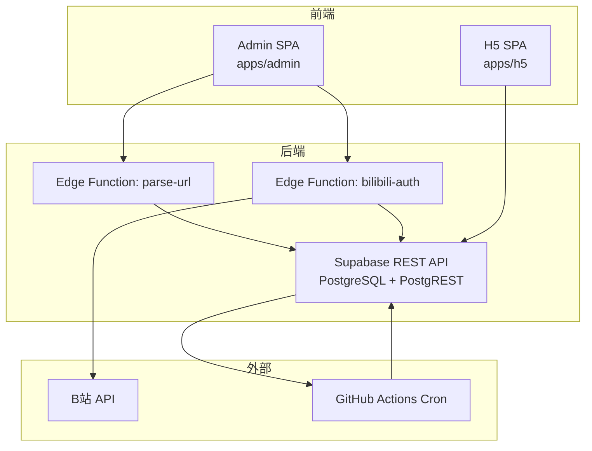
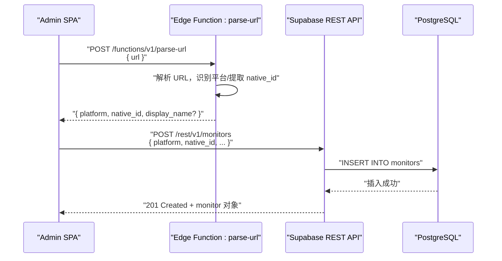
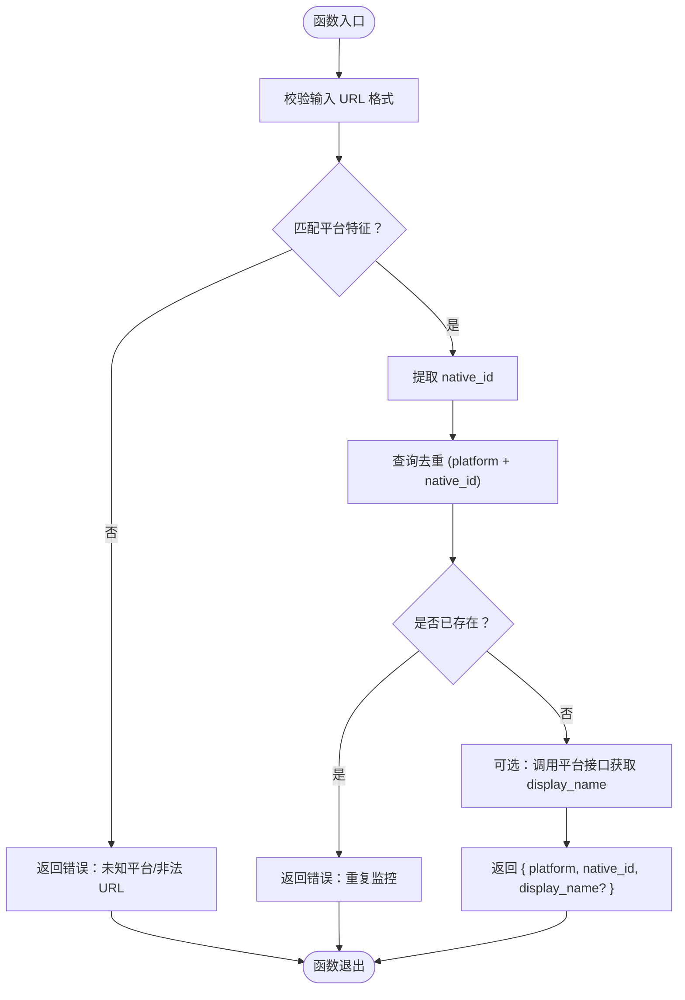
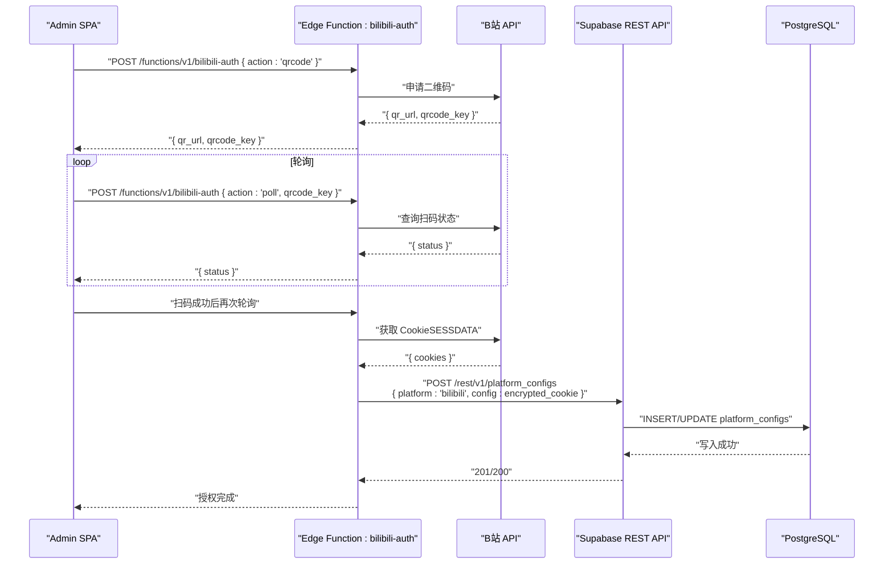
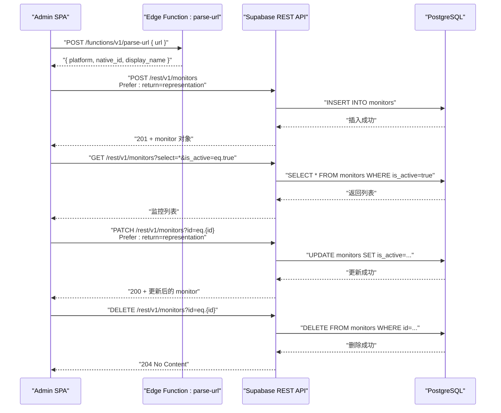
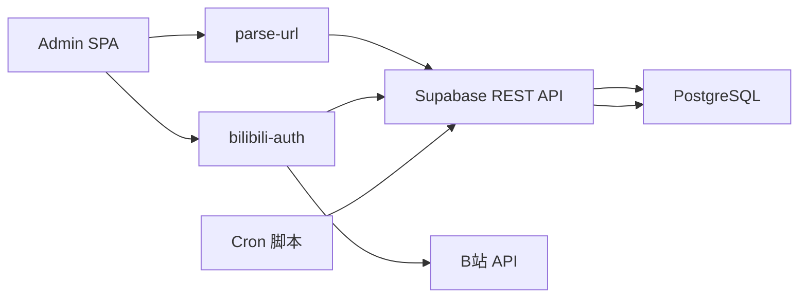

# 配置流（管理端）

<cite>
**本文引用的文件**
- [PROJECT_CONTEXT.md](file://PROJECT_CONTEXT.md)
- [多平台中枢_PRD.md](file://多平台中枢_PRD.md)
</cite>

## 目录
1. [简介](#简介)
2. [项目结构](#项目结构)
3. [核心组件](#核心组件)
4. [架构总览](#架构总览)
5. [详细组件分析](#详细组件分析)
6. [依赖分析](#依赖分析)
7. [性能考虑](#性能考虑)
8. [故障排查指南](#故障排查指南)
9. [结论](#结论)
10. [附录](#附录)

## 简介
本文件聚焦“配置流（管理端）”的数据流，完整描述从配置管理端到数据库配置的端到端过程：Admin SPA 前端应用 → Edge Functions（parse-url、bilibili-auth）→ Supabase REST API → PostgreSQL 数据库。重点解释：
- URL 解析与平台识别的 Edge Function 实现
- B站扫码授权的完整流程
- 监控目标的 CRUD 操作
- 平台配置信息的存储与管理
- Edge Functions 如何处理认证、如何与 Supabase 数据库交互
- 配置变更对整个系统的影响

## 项目结构
- 前端应用：apps/admin（配置管理端 SPA）、apps/h5（用户端 H5 SPA）
- 后端服务：Supabase Cloud（PostgreSQL + PostgREST + Edge Functions）
- 自动化引擎：GitHub Actions Cron 脚本（定时抓取）
- 共享代码：packages/shared（前后端共享类型）
- Edge Functions：parse-url（URL 解析 + 平台识别）、bilibili-auth（B站扫码登录）

图表来源
- [PROJECT_CONTEXT.md: 173-207:173-207](file://PROJECT_CONTEXT.md#L173-L207)
- [PROJECT_CONTEXT.md: 97-141:97-141](file://PROJECT_CONTEXT.md#L97-L141)

章节来源
- [PROJECT_CONTEXT.md: 51-141:51-141](file://PROJECT_CONTEXT.md#L51-L141)

## 核心组件
- 配置管理端（Admin SPA）
  - 负责监控目标的 CRUD 操作
  - 添加时调用 parse-url Edge Function 解析平台与标识
  - B站扫码授权通过 bilibili-auth Edge Function 完成
- Edge Functions
  - parse-url：根据 URL 特征识别平台并提取 native_id
  - bilibili-auth：生成二维码、轮询扫码状态、捕获 Cookie 并加密存储
- Supabase REST API
  - Admin SPA 直接调用进行 CRUD
  - Edge Functions 使用 service_role key 绕过 RLS 写入数据库
- 数据库（PostgreSQL）
  - monitors、contents、platform_configs 等表承载配置与内容数据
  - RLS 策略控制访问权限

章节来源
- [PROJECT_CONTEXT.md: 275-300:275-300](file://PROJECT_CONTEXT.md#L275-L300)
- [PROJECT_CONTEXT.md: 420-474:420-474](file://PROJECT_CONTEXT.md#L420-L474)
- [PROJECT_CONTEXT.md: 360-400:360-400](file://PROJECT_CONTEXT.md#L360-L400)

## 架构总览
配置流（管理端）的关键路径如下：
- Admin SPA → Edge Function parse-url → Supabase REST API → PostgreSQL（添加监控目标）
- Admin SPA → Edge Function bilibili-auth → B站 API → Supabase（存入 B站 Cookie）

图表来源
- [PROJECT_CONTEXT.md: 511-537:511-537](file://PROJECT_CONTEXT.md#L511-L537)
- [PROJECT_CONTEXT.md: 431-455:431-455](file://PROJECT_CONTEXT.md#L431-L455)

章节来源
- [PROJECT_CONTEXT.md: 233-235:233-235](file://PROJECT_CONTEXT.md#L233-L235)
- [PROJECT_CONTEXT.md: 281-291:281-291](file://PROJECT_CONTEXT.md#L281-L291)

## 详细组件分析

### 组件A：URL 解析与平台识别（parse-url）
- 输入：{ url: string }
- 输出：{ platform: string, native_id: string, display_name?: string }
- 平台识别规则：
  - 含 bilibili.com → B站，正则提取 mid
  - 含 youtube.com → YouTube，提取 @handle 并调 channels.list?forHandle= 转 channelId
  - 含 zhihu.com → 知乎，正则提取 people_id 或 column_id
- 与数据库交互：
  - Edge Function 使用 service_role key 绕过 RLS，执行解析逻辑
  - 解析成功后，前端调用 Supabase REST API 写入 monitors 表

图表来源
- [PROJECT_CONTEXT.md: 281-291:281-291](file://PROJECT_CONTEXT.md#L281-L291)
- [PROJECT_CONTEXT.md: 511-537:511-537](file://PROJECT_CONTEXT.md#L511-L537)

章节来源
- [PROJECT_CONTEXT.md: 281-291:281-291](file://PROJECT_CONTEXT.md#L281-L291)
- [PROJECT_CONTEXT.md: 511-537:511-537](file://PROJECT_CONTEXT.md#L511-L537)

### 组件B：B站扫码授权（bilibili-auth）
- 接口：
  - POST /functions/v1/bilibili-auth
    - action: "qrcode" → 返回二维码图片 URL + qrcode_key
    - action: "poll" + qrcode_key → 返回扫码状态（waiting/expired/success）
- 流程：
  - 生成二维码并持久化 qrcode_key
  - 轮询扫码状态，成功后捕获 Cookie（SESSDATA）
  - 将 Cookie 加密存储到 platform_configs 表
- 与数据库交互：
  - Edge Function 使用 service_role key 绕过 RLS
  - 存储敏感信息（Cookie）到 platform_configs 表（Supabase Vault 加密）

图表来源
- [PROJECT_CONTEXT.md: 539-568:539-568](file://PROJECT_CONTEXT.md#L539-L568)
- [PROJECT_CONTEXT.md: 390-400:390-400](file://PROJECT_CONTEXT.md#L390-L400)

章节来源
- [PROJECT_CONTEXT.md: 292-299:292-299](file://PROJECT_CONTEXT.md#L292-L299)
- [PROJECT_CONTEXT.md: 539-568:539-568](file://PROJECT_CONTEXT.md#L539-L568)

### 组件C：监控目标 CRUD（Admin SPA ↔ Supabase）
- 添加监控：
  - 前端校验 URL 格式
  - 调用 parse-url Edge Function 获取 platform/native_id/display_name
  - 调用 Supabase REST API POST /rest/v1/monitors 写入数据库
- 列表管理：
  - 查询 monitors 表，支持筛选、排序、分页
  - 切换 is_active 开关控制是否纳入 Cron 抓取
  - 删除监控目标（二次确认）
- 与数据库交互：
  - Admin SPA 使用 anon key + RLS 策略
  - Edge Functions 使用 service_role key 绕过 RLS

图表来源
- [PROJECT_CONTEXT.md: 431-455:431-455](file://PROJECT_CONTEXT.md#L431-L455)
- [PROJECT_CONTEXT.md: 511-537:511-537](file://PROJECT_CONTEXT.md#L511-L537)
- [PROJECT_CONTEXT.md: 275-280:275-280](file://PROJECT_CONTEXT.md#L275-L280)

章节来源
- [PROJECT_CONTEXT.md: 275-280:275-280](file://PROJECT_CONTEXT.md#L275-L280)
- [PROJECT_CONTEXT.md: 431-455:431-455](file://PROJECT_CONTEXT.md#L431-L455)

### 组件D：平台配置信息的存储与管理
- platform_configs 表用于存储敏感配置（如 B站 Cookie），使用 Supabase Vault 加密
- Edge Functions 使用 service_role key 绕过 RLS 写入/更新配置
- Admin SPA 通过 Supabase REST API 读取/更新配置（受 RLS 保护）

章节来源
- [PROJECT_CONTEXT.md: 390-400:390-400](file://PROJECT_CONTEXT.md#L390-L400)
- [PROJECT_CONTEXT.md: 402-417:402-417](file://PROJECT_CONTEXT.md#L402-L417)

## 依赖分析
- 前端依赖 Supabase JS 客户端与 Edge Functions
- Edge Functions 依赖 Supabase 客户端（service_role）与第三方平台 API（B站）
- Cron 脚本依赖 Supabase REST API（service_role）写入数据
- 数据库依赖 RLS 策略与 pg_cron 软删除任务

图表来源
- [PROJECT_CONTEXT.md: 173-207:173-207](file://PROJECT_CONTEXT.md#L173-L207)
- [PROJECT_CONTEXT.md: 420-474:420-474](file://PROJECT_CONTEXT.md#L420-L474)

章节来源
- [PROJECT_CONTEXT.md: 169-223:169-223](file://PROJECT_CONTEXT.md#L169-L223)

## 性能考虑
- Edge Functions 仅用于轻量逻辑（URL 解析、扫码轮询），避免在函数内做大量数据库写入
- Supabase REST API 使用 Prefer: return=representation 与 Prefer: resolution=merge-duplicates 提升写入一致性
- 平台间可并行、同平台串行，请求间隔 ≥ 1.5 秒，降低反爬风险
- Cron 互斥锁基于 pg_advisory_lock，避免并发冲突

## 故障排查指南
- URL 无法识别/格式不合法
  - 检查 parse-url 的平台识别规则与输入 URL
  - 确认 Edge Function 返回的错误码
- 重复监控
  - 去重校验失败，检查 (platform, native_id) 是否已存在
- B站二维码过期/扫码失败
  - 检查 qrcode_key 是否过期，重新发起 qrcode 请求
  - 确认 B站 API 可用性与网络连通
- Cookie 失效
  - 重新发起扫码授权流程，更新 platform_configs 中的加密 Cookie
- 数据库写入失败
  - 检查 RLS 策略与 service_role key 权限
  - 确认 Supabase REST API 请求头与 Prefer 参数

章节来源
- [PROJECT_CONTEXT.md: 600-614:600-614](file://PROJECT_CONTEXT.md#L600-L614)
- [PROJECT_CONTEXT.md: 360-400:360-400](file://PROJECT_CONTEXT.md#L360-L400)

## 结论
配置流（管理端）通过 Admin SPA 与 Edge Functions 的协作，实现了从 URL 解析、平台识别到监控目标 CRUD 的完整闭环。parse-url 与 bilibili-auth 作为轻量逻辑的 Edge Functions，配合 Supabase REST API 与 RLS 策略，既保证了前端交互的简洁性，又确保了数据库访问的安全性与一致性。配置变更直接影响 Cron 抓取与用户端展示，形成“配置驱动抓取”的核心机制。

## 附录
- 接口规范与错误码详见项目上下文文件中的“接口规范”与“错误码规范”
- 数据模型与 RLS 策略详见项目上下文文件中的“数据模型”与“RLS 策略”