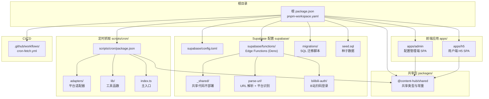
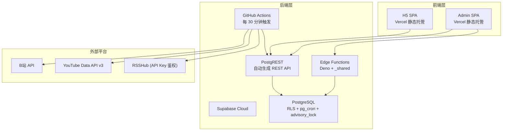
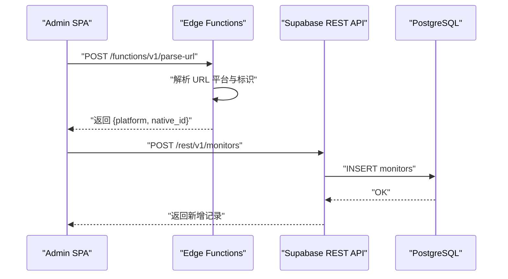
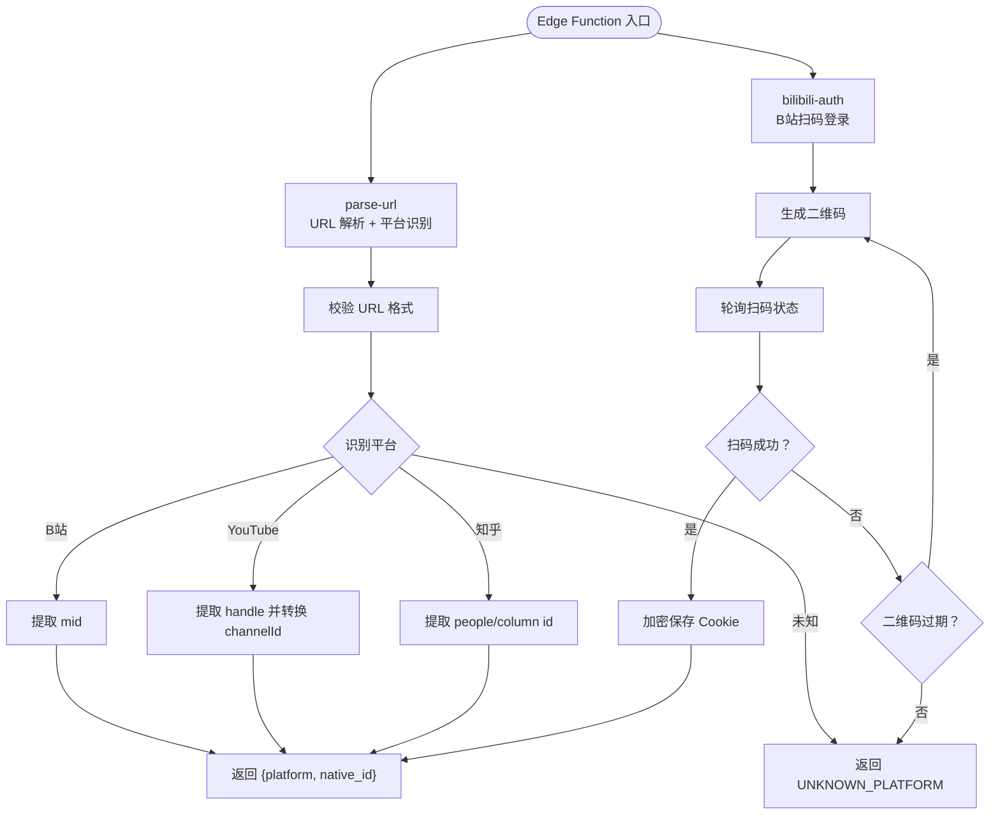
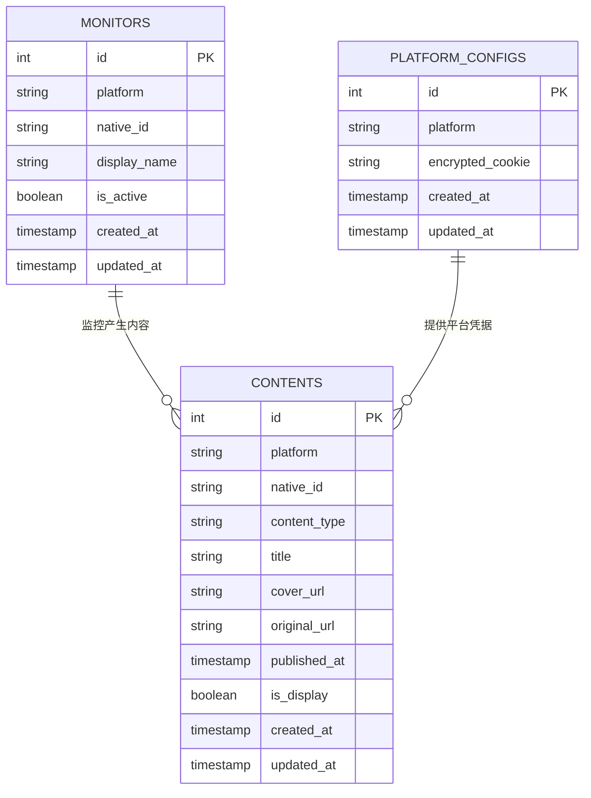
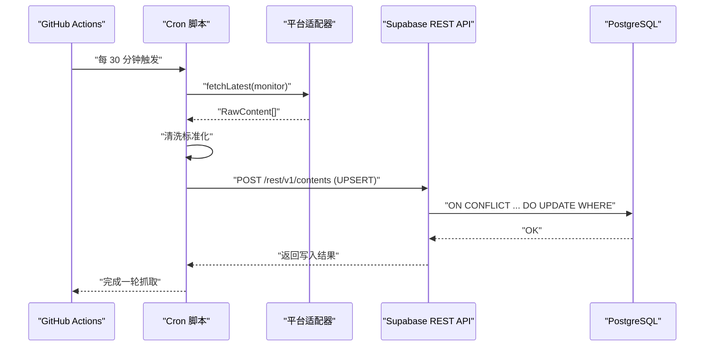
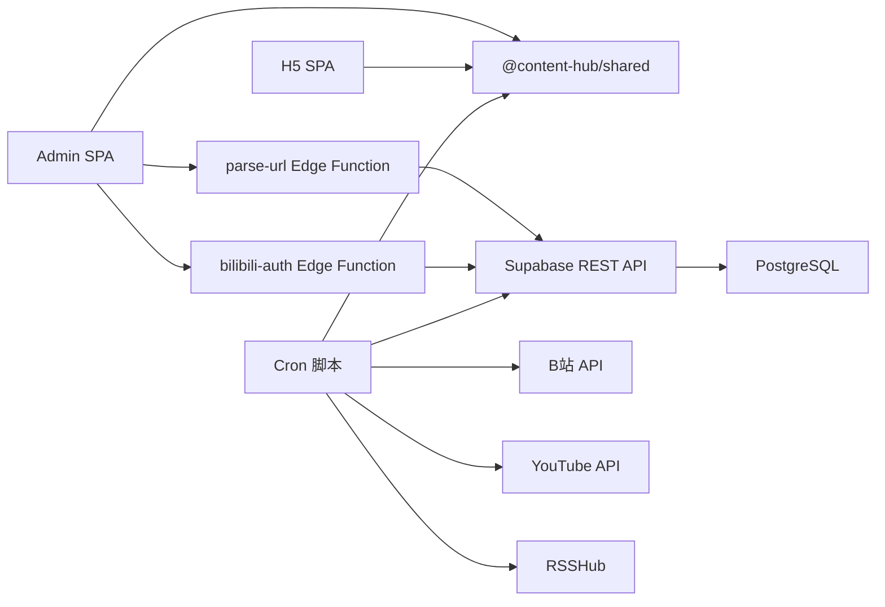

# 整体架构

<cite>
**本文档引用的文件**
- [PROJECT_CONTEXT.md](file://PROJECT_CONTEXT.md)
</cite>

## 目录
1. [简介](#简介)
2. [项目结构](#项目结构)
3. [核心组件](#核心组件)
4. [架构总览](#架构总览)
5. [详细组件分析](#详细组件分析)
6. [依赖关系分析](#依赖关系分析)
7. [性能考量](#性能考量)
8. [故障排查指南](#故障排查指南)
9. [结论](#结论)
10. [附录](#附录)

## 简介
本项目“多平台内容中枢”是一个面向多平台内容聚合与分发的全栈系统，采用前端 SPA + 后端 Serverless + Supabase Cloud 的现代化架构。系统通过 Monorepo 组织方式统一管理前端应用、共享类型、Supabase 配置与定时抓取脚本，并以 Supabase 提供的 PostgreSQL、PostgREST、Edge Functions、RLS 等能力为核心，构建出高可用、低运维成本的内容采集与展示平台。

## 项目结构
项目采用 pnpm workspace 的 Monorepo 结构，结合 Supabase 官方推荐的 Edge Functions 组织方式与前端社区主流的 apps/packages 分层模式，形成清晰的职责边界与复用机制。

**图表来源**
- [PROJECT_CONTEXT.md:51-142](file://PROJECT_CONTEXT.md#L51-L142)

**章节来源**
- [PROJECT_CONTEXT.md:51-142](file://PROJECT_CONTEXT.md#L51-L142)

## 核心组件
系统围绕以下核心组件展开：
- 前端 SPA：配置管理端与用户端 H5，均基于 React 18 + TypeScript + Vite 5，Tailwind CSS 3 原子化样式，Vercel 静态托管。
- 后端 Serverless：Supabase Cloud 提供的 PostgreSQL + PostgREST + Edge Functions，配合 pg_cron 与 advisory_lock。
- 定时抓取引擎：GitHub Actions 每 30 分钟触发一次 Node.js 抓取脚本，负责从各平台 API 抓取内容并写入 Supabase。
- 知乎中转：RSSHub（Railway/Fly.io 部署）通过 API Key 鉴权，作为知乎内容抓取的中转服务。
- Monorepo 共享：packages/shared 作为前后端共享类型与常量的单一真实来源；Edge Functions 通过手动同步保持类型一致性。

**章节来源**
- [PROJECT_CONTEXT.md:10-46](file://PROJECT_CONTEXT.md#L10-L46)
- [PROJECT_CONTEXT.md:159-166](file://PROJECT_CONTEXT.md#L159-L166)

## 架构总览
系统采用“前端 SPA + Supabase Serverless + 外部平台 API”的三层架构，前端仅通过 Supabase REST API 与 Edge Functions 与后端交互，后端通过 PostgREST 暴露标准 REST 接口，定时任务通过 Supabase REST API 写入数据，确保安全与一致性。

**图表来源**
- [PROJECT_CONTEXT.md:17-22](file://PROJECT_CONTEXT.md#L17-L22)
- [PROJECT_CONTEXT.md:169-207](file://PROJECT_CONTEXT.md#L169-L207)

**章节来源**
- [PROJECT_CONTEXT.md:17-22](file://PROJECT_CONTEXT.md#L17-L22)
- [PROJECT_CONTEXT.md:169-207](file://PROJECT_CONTEXT.md#L169-L207)

## 详细组件分析

### 前端 SPA 架构
- 配置管理端（Admin SPA）：提供监控目标管理、URL 解析与平台识别、B站扫码授权、监控状态面板等功能，通过 Supabase REST API 与 Edge Functions 完成数据读写与业务逻辑处理。
- 用户端 H5 SPA：提供内容聚合信息流、Deep Link 跳转与兜底弹窗，仅读取 contents 表中 is_display=true 的记录，满足访客只读需求。
- 技术栈：React 18 + TypeScript + Vite 5 + Tailwind CSS 3，纯前端渲染，Vercel 静态托管。

**图表来源**
- [PROJECT_CONTEXT.md:281-287](file://PROJECT_CONTEXT.md#L281-L287)
- [PROJECT_CONTEXT.md:426-445](file://PROJECT_CONTEXT.md#L426-L445)

**章节来源**
- [PROJECT_CONTEXT.md:14](file://PROJECT_CONTEXT.md#L14)
- [PROJECT_CONTEXT.md:281-287](file://PROJECT_CONTEXT.md#L281-L287)
- [PROJECT_CONTEXT.md:426-445](file://PROJECT_CONTEXT.md#L426-L445)

### 后端 Serverless 架构
- Supabase Cloud：提供 PostgreSQL、PostgREST、Edge Functions、pg_cron、advisory_lock 等能力，统一管理数据与业务逻辑。
- Edge Functions：采用“fat functions + _shared”组织方式，函数名使用连字符（URL 友好），共享代码位于 _shared 目录（下划线前缀不部署）。
- PostgREST：自动生成 REST API，遵循标准 REST 约定，支持查询、插入、更新、删除等操作。

**图表来源**
- [PROJECT_CONTEXT.md:98-106](file://PROJECT_CONTEXT.md#L98-L106)
- [PROJECT_CONTEXT.md:103-106](file://PROJECT_CONTEXT.md#L103-L106)
- [PROJECT_CONTEXT.md:281-299](file://PROJECT_CONTEXT.md#L281-L299)

**章节来源**
- [PROJECT_CONTEXT.md:98-106](file://PROJECT_CONTEXT.md#L98-L106)
- [PROJECT_CONTEXT.md:281-299](file://PROJECT_CONTEXT.md#L281-L299)

### 数据库架构与集成模式
- 表结构：monitors、contents、platform_configs 等，均启用 RLS，通过策略控制访问权限。
- RLS 策略：管理员（authenticated）拥有全部读写权限；访客（anon）仅能读取 is_display=true 的 contents 记录。
- 写入模式：Cron 脚本通过 Supabase REST API 执行 UPSERT 去重，使用 ON CONFLICT ... DO UPDATE WHERE 防止软删除记录复活。
- 清理策略：pg_cron 定时任务将超过 30 天未显示的内容标记为不显示，实现生命周期管理。

**图表来源**
- [PROJECT_CONTEXT.md:107-113](file://PROJECT_CONTEXT.md#L107-L113)
- [PROJECT_CONTEXT.md:364-400](file://PROJECT_CONTEXT.md#L364-L400)
- [PROJECT_CONTEXT.md:318-334](file://PROJECT_CONTEXT.md#L318-L334)

**章节来源**
- [PROJECT_CONTEXT.md:107-113](file://PROJECT_CONTEXT.md#L107-L113)
- [PROJECT_CONTEXT.md:364-400](file://PROJECT_CONTEXT.md#L364-L400)
- [PROJECT_CONTEXT.md:318-334](file://PROJECT_CONTEXT.md#L318-L334)

### 定时抓取引擎与外部集成
- 触发机制：GitHub Actions 每 30 分钟触发一次 Cron 脚本，支持手动触发用于调试。
- 平台适配器：B站（Cookie + 空间 API）、YouTube（Data API v3）、知乎（RSSHub 中转），统一接口定义，差异化实现。
- 数据清洗与去重：对原始内容进行清洗标准化，使用 UPSERT 去重，避免重复写入。
- 安全与限速：同平台请求间隔 ≥ 1.5 秒（防反爬），不同平台无额外限制；敏感信息加密存储。

**图表来源**
- [PROJECT_CONTEXT.md:115-131](file://PROJECT_CONTEXT.md#L115-L131)
- [PROJECT_CONTEXT.md:301-317](file://PROJECT_CONTEXT.md#L301-L317)
- [PROJECT_CONTEXT.md:318-334](file://PROJECT_CONTEXT.md#L318-L334)

**章节来源**
- [PROJECT_CONTEXT.md:115-131](file://PROJECT_CONTEXT.md#L115-L131)
- [PROJECT_CONTEXT.md:301-317](file://PROJECT_CONTEXT.md#L301-L317)
- [PROJECT_CONTEXT.md:318-334](file://PROJECT_CONTEXT.md#L318-L334)

### Monorepo 组织方式与共享类型同步
- apps/admin 与 apps/h5 通过 workspace 依赖引用 @content-hub/shared，共享类型与常量。
- Edge Functions（Deno 环境）无法直接引用 npm 包，需手动在 _shared/types.ts 中维护类型副本并标注同步标记，确保类型一致性。

**章节来源**
- [PROJECT_CONTEXT.md:84-96](file://PROJECT_CONTEXT.md#L84-L96)
- [PROJECT_CONTEXT.md:159-166](file://PROJECT_CONTEXT.md#L159-L166)

## 依赖关系分析
系统各组件之间的依赖关系如下：

**图表来源**
- [PROJECT_CONTEXT.md:51-142](file://PROJECT_CONTEXT.md#L51-L142)
- [PROJECT_CONTEXT.md:169-207](file://PROJECT_CONTEXT.md#L169-L207)

**章节来源**
- [PROJECT_CONTEXT.md:51-142](file://PROJECT_CONTEXT.md#L51-L142)
- [PROJECT_CONTEXT.md:169-207](file://PROJECT_CONTEXT.md#L169-L207)

## 性能考量
- 前端性能：Vite 5 提供快速 HMR 与生产构建优化，Tailwind CSS 原子化样式提升开发效率与运行时性能。
- 后端性能：Supabase Edge Functions 适合轻量逻辑，数据密集型操作通过 PostgREST 或数据库函数处理；pg_cron 与 advisory_lock 提供可靠的定时任务与互斥控制。
- 抓取性能：平台间可并行、同平台串行的策略平衡了抓取效率与反爬虫风险；UPSERT 去重减少重复写入开销。
- 存储性能：RLS 策略在保证安全的同时尽量简化查询路径，避免不必要的复杂 JOIN。

## 故障排查指南
- Edge Function 错误码：统一错误码涵盖平台识别失败、URL 格式不合法、重复监控、二维码过期、Cookie 失效、第三方 API 错误等场景，便于前端统一处理与用户提示。
- 定时任务异常：检查 GitHub Actions 工作流日志、RSSHub 鉴权配置、第三方 API Key 是否有效；确认 pg_advisory_lock 是否导致任务阻塞。
- 数据一致性：若出现重复内容，检查 UPSERT 逻辑与 ON CONFLICT 条件；若软删除记录复活，检查 is_display 字段与 WHERE 条件。
- 安全问题：确保 SUPABASE_SERVICE_ROLE_KEY 不暴露到前端；RSSHub 必须启用 API Key 鉴权；敏感信息加密存储。

**章节来源**
- [PROJECT_CONTEXT.md:600-614](file://PROJECT_CONTEXT.md#L600-L614)
- [PROJECT_CONTEXT.md:213-222](file://PROJECT_CONTEXT.md#L213-L222)

## 结论
本项目通过“前端 SPA + Supabase Serverless + 外部平台 API”的架构组合，实现了低成本、高扩展的内容中枢系统。Monorepo 统一管理共享类型与配置，Edge Functions 与 PostgREST 提供灵活的后端能力，GitHub Actions 定时任务保障内容持续更新。在安全方面，RLS、Service Role Key 绕过策略、加密存储与 API Key 鉴权等措施共同构成完整的安全防线。

## 附录
- 行业最佳实践参考：Supabase Edge Functions 组织方式、RLS 安全模式、Monorepo 共享类型、Secrets 管理、PostgreSQL UPSERT 模式、pg_advisory_lock 互斥等。

**章节来源**
- [PROJECT_CONTEXT.md:647-657](file://PROJECT_CONTEXT.md#L647-L657)