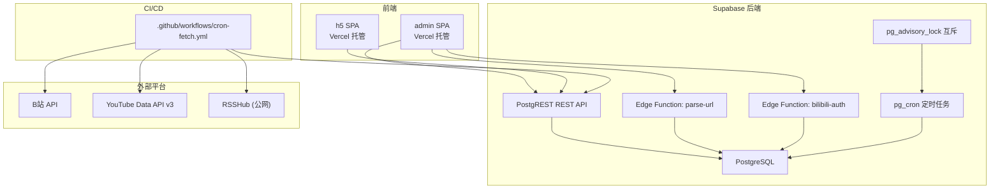
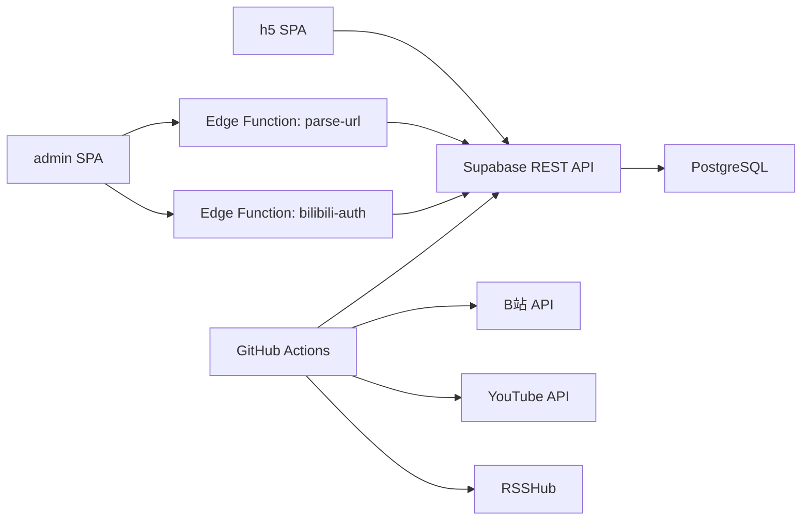

# 架构设计

<cite>
**本文引用的文件**
- [PROJECT_CONTEXT.md](file://PROJECT_CONTEXT.md)
</cite>

## 目录
1. [简介](#简介)
2. [项目结构](#项目结构)
3. [核心组件](#核心组件)
4. [架构总览](#架构总览)
5. [详细组件分析](#详细组件分析)
6. [依赖关系分析](#依赖关系分析)
7. [性能考虑](#性能考虑)
8. [故障排查指南](#故障排查指南)
9. [结论](#结论)
10. [附录](#附录)

## 简介
本项目“多平台内容中枢”是一个以 Supabase 为核心的数据驱动聚合平台，面向个人/小团队的内容订阅与展示场景。其整体架构围绕“前端 SPA + Supabase 后端 + Serverless 边缘函数 + GitHub Actions 定时任务”的组合展开，强调最小化基础设施、强安全边界与清晰的数据流。

- 前端：两套独立的 React SPA（配置管理端与用户端 H5），通过 Vercel 静态托管。
- 后端：Supabase 提供 PostgreSQL、PostgREST、Edge Functions、定时任务与行级安全策略（RLS）。
- 数据采集：通过 GitHub Actions 每 30 分钟运行一次 Node.js 抓取脚本，将内容写入 Supabase。
- 安全：严格的密钥分层与 RLS 策略，前端仅使用匿名密钥，服务端凭据严格保密。

## 项目结构
项目采用 pnpm workspace 的 Monorepo 组织方式，结合 Supabase 官方推荐的 Edge Functions 组织方式与前端社区主流的 apps/packages 分层模式：

- apps：包含两套前端应用
  - admin：配置管理端（React SPA）
  - h5：用户端 H5（React SPA）
- packages：前后端共享代码（类型定义、常量等）
- supabase：Supabase 项目配置与 Edge Functions
  - functions：Deno 编写的边缘函数（parse-url、bilibili-auth 等）
  - migrations：数据库迁移脚本
  - seed.sql：种子数据
  - config.toml：Supabase 项目配置
- scripts/cron：GitHub Actions Cron 脚本（Node.js），负责平台适配器抓取、清洗、UPSERT 写入
- .github/workflows：CI/CD 工作流（定时触发）

命名与同步规范：
- Edge Function 名称使用连字符（URL 友好）
- 数据库表/字段使用蛇形命名
- TypeScript 文件使用连字符命名
- 类型/接口使用帕斯卡命名
- React 组件使用帕斯卡命名
- 常量使用全大写蛇形
- 共享类型以 packages/shared 为单一真实来源，Edge Functions 侧手动同步

章节来源
- [PROJECT_CONTEXT.md:51-142](file://PROJECT_CONTEXT.md#L51-L142)

## 核心组件
- 前端 SPA（Vercel 托管）
  - admin：配置管理端，负责监控目标管理、URL 解析、B站扫码授权等
  - h5：用户端 H5，展示聚合内容流
- Supabase 后端
  - PostgreSQL：存储 monitors、contents、platform_configs 等表
  - PostgREST：自动生成 REST API，支持查询、写入、RLS
  - Edge Functions（Deno）：parse-url、bilibili-auth 等轻量逻辑
  - pg_cron：定时软删除任务
  - advisory_lock：Cron 互斥锁
- GitHub Actions 定时任务
  - 每 30 分钟触发一次 Node.js 抓取脚本
  - 平台适配器：B站、YouTube、知乎（经 RSSHub 中转）
  - 数据清洗、UPSERT 去重、告警通知
- RSSHub（Railway/Fly.io 部署）
  - Docker 容器，公网可访问，需启用 API Key 鉴权

章节来源
- [PROJECT_CONTEXT.md:10-46](file://PROJECT_CONTEXT.md#L10-L46)
- [PROJECT_CONTEXT.md:115-135](file://PROJECT_CONTEXT.md#L115-L135)

## 架构总览
整体系统边界与集成模式如下：

图表来源
- [PROJECT_CONTEXT.md:169-223](file://PROJECT_CONTEXT.md#L169-L223)
- [PROJECT_CONTEXT.md:194-206](file://PROJECT_CONTEXT.md#L194-L206)

章节来源
- [PROJECT_CONTEXT.md:169-223](file://PROJECT_CONTEXT.md#L169-L223)

## 详细组件分析

### 前端 SPA（admin/h5）
- admin SPA
  - 功能：监控目标管理（CRUD）、URL 解析（parse-url Edge Function）、B站扫码授权（bilibili-auth Edge Function）、监控状态面板、昵称管理
  - 交互：直接调用 Supabase REST API；解析与授权通过 Edge Function 完成
- h5 SPA
  - 功能：内容流展示（分页、筛选）、Deep Link 跳转（B站/YouTube）、兜底弹窗
  - 交互：只读访问 contents 表（RLS 限制）

章节来源
- [PROJECT_CONTEXT.md:249-271](file://PROJECT_CONTEXT.md#L249-L271)
- [PROJECT_CONTEXT.md:267-271](file://PROJECT_CONTEXT.md#L267-L271)

### Supabase 后端
- 数据库表与 RLS
  - monitors：管理员全权限，匿名用户不可见
  - contents：管理员全权限，匿名用户仅可读 is_display=true 的记录
  - platform_configs：管理员全权限，匿名用户不可见（存放加密 Cookie 等敏感信息）
- Edge Functions
  - parse-url：根据 URL 特征识别平台与标识
  - bilibili-auth：生成二维码、轮询扫码状态、捕获 Cookie 并加密存储
- pg_cron 与 advisory_lock
  - pg_cron：定期执行软删除（is_display=false）
  - advisory_lock：保证 Cron 任务互斥执行，避免并发冲突

章节来源
- [PROJECT_CONTEXT.md:360-401](file://PROJECT_CONTEXT.md#L360-L401)
- [PROJECT_CONTEXT.md:186-189](file://PROJECT_CONTEXT.md#L186-L189)

### GitHub Actions 定时任务
- 触发频率：每 30 分钟
- 负责内容：平台适配器抓取（B站、YouTube、知乎 via RSSHub）、数据清洗、UPSERT 去重、告警通知
- 安全约束：仅使用 GitHub Secrets 中的密钥，不直连数据库

章节来源
- [PROJECT_CONTEXT.md:194-200](file://PROJECT_CONTEXT.md#L194-L200)
- [PROJECT_CONTEXT.md:615-644](file://PROJECT_CONTEXT.md#L615-L644)

### RSSHub 中转
- 部署：Railway/Fly.io（容器化）
- 访问：通过 Supabase REST API 调用，需启用 API Key 鉴权
- 作用：抓取知乎内容，作为第三方 API 的中转

章节来源
- [PROJECT_CONTEXT.md:21-22](file://PROJECT_CONTEXT.md#L21-L22)
- [PROJECT_CONTEXT.md:203-206](file://PROJECT_CONTEXT.md#L203-L206)

### 数据流设计
- 写入流（Cron 抓取）
  - GitHub Actions → 第三方 API → 清洗标准化 → Supabase REST API（UPSERT）→ PostgreSQL
- 读取流（H5 浏览）
  - H5 SPA → Supabase REST API（SELECT is_display=true）→ PostgreSQL
- 配置流（管理端）
  - Admin SPA → Edge Function（parse-url）→ Supabase REST API → PostgreSQL
  - Admin SPA → Edge Function（bilibili-auth）→ B站 API → Supabase（存 Cookie）
- 清理流（软删除）
  - pg_cron → SQL UPDATE（is_display=false WHERE created_at < 30天）

章节来源
- [PROJECT_CONTEXT.md:224-239](file://PROJECT_CONTEXT.md#L224-L239)

### 安全架构
- 角色模型
  - 管理员：authenticated，对 monitors/contents/platform_configs 全部读写
  - 访客：anon，仅可读 contents.is_display=true 的记录
- RLS 策略
  - 所有表启用 RLS；策略显式控制访问
- 密钥层级
  - SUPABASE_ANON_KEY：前端公开使用，受 RLS 保护
  - SUPABASE_SERVICE_ROLE_KEY：仅 Cron 与 Edge Function 使用，绕过 RLS
- 安全红线
  - Service Role Key 永不出现在前端
  - 前端仅使用匿名密钥
  - 敏感信息（Cookie、API Key）不硬编码，通过环境变量或 Supabase Vault 管理
  - RSSHub 必须配置 API Key 鉴权

章节来源
- [PROJECT_CONTEXT.md:349-417](file://PROJECT_CONTEXT.md#L349-L417)

### 接口规范
- Supabase REST API
  - PostgREST 自动生成，遵循 select/filter/order/limit/offset 约定
  - 请求头：apikey、Authorization、Content-Type、Prefer（return/merge-duplicates）
- Edge Functions
  - 统一 JSON 请求/响应格式，错误码统一
  - parse-url：识别平台与标识
  - bilibili-auth：二维码生成与扫码轮询
- Cron 脚本内部接口
  - 平台适配器统一接口，屏蔽第三方差异

章节来源
- [PROJECT_CONTEXT.md:420-598](file://PROJECT_CONTEXT.md#L420-L598)

## 依赖关系分析
- 组件耦合与内聚
  - 前端与后端通过 Supabase REST API 强解耦，Edge Functions 仅承担轻量逻辑
  - Cron 脚本与数据库通过 REST API 写入，避免直连
  - 共享类型通过 packages/shared 保持一致，Edge Functions 侧手动同步
- 外部依赖
  - B站、YouTube、RSSHub 的 API 与鉴权策略
  - Vercel（前端托管）、Railway/Fly.io（RSSHub 托管）、GitHub（CI/CD）
- 循环依赖
  - 无直接循环依赖；数据流单向从外部平台流向 Supabase

图表来源
- [PROJECT_CONTEXT.md:169-223](file://PROJECT_CONTEXT.md#L169-L223)

章节来源
- [PROJECT_CONTEXT.md:169-223](file://PROJECT_CONTEXT.md#L169-L223)

## 性能考虑
- Serverless 优势
  - Edge Functions 轻量处理 URL 解析与扫码授权，降低后端压力
  - GitHub Actions Cron 以事件驱动方式拉取数据，避免长驻进程
- 数据库层面
  - UPSERT 去重使用 PostgreSQL ON CONFLICT，避免重复写入
  - 软删除策略减少历史数据膨胀，提升查询性能
- 前端层面
  - Vite 构建优化与 Tailwind 原子化样式，提升开发与打包效率
- 并发与限速
  - Cron 任务按平台串行、平台间并行，同平台请求间隔 ≥1.5 秒，防反爬
  - 使用 advisory_lock 保证 Cron 互斥

章节来源
- [PROJECT_CONTEXT.md:218-222](file://PROJECT_CONTEXT.md#L218-L222)
- [PROJECT_CONTEXT.md:318-334](file://PROJECT_CONTEXT.md#L318-L334)

## 故障排查指南
- Edge Function 常见错误
  - UNKNOWN_PLATFORM / INVALID_URL：URL 格式或平台识别异常
  - DUPLICATE_MONITOR：重复添加监控目标
  - BILIBILI_QRCODE_EXPIRED / BILIBILI_COOKIE_INVALID：扫码过期或 Cookie 失效
  - YOUTUBE_API_ERROR / RSSHUB_ERROR：第三方 API 调用失败
  - INTERNAL_ERROR：未预期的内部错误
- 建议排查步骤
  - 检查 Edge Function 请求参数与返回体
  - 核对 Supabase RLS 策略是否正确生效
  - 确认 Cron 工作流环境变量与 Secrets 是否正确注入
  - 验证 RSSHub API Key 配置与网络可达性
  - 查看 pg_cron 任务日志与 advisory_lock 是否阻塞

章节来源
- [PROJECT_CONTEXT.md:600-614](file://PROJECT_CONTEXT.md#L600-L614)
- [PROJECT_CONTEXT.md:615-644](file://PROJECT_CONTEXT.md#L615-L644)

## 结论
本项目通过“前端 SPA + Supabase + Serverless + CI/CD”的组合，实现了低运维成本、高扩展性的内容中枢架构。Monorepo 与共享类型确保了前后端一致性；严格的密钥分层与 RLS 策略保障了数据安全；清晰的数据流与定时任务机制提升了系统的可靠性与可维护性。建议持续关注第三方平台 API 变更与 RSSHub 的鉴权配置，确保系统稳定运行。

## 附录
- 行业最佳实践参考
  - Edge Functions 组织方式、RLS 安全模式、Monorepo 共享类型、Secrets 管理、PostgreSQL UPSERT 模式、pg_advisory_lock 互斥

章节来源
- [PROJECT_CONTEXT.md:647-657](file://PROJECT_CONTEXT.md#L647-L657)