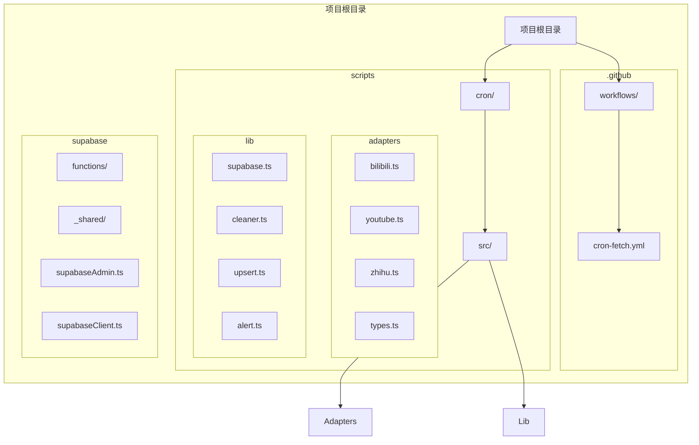
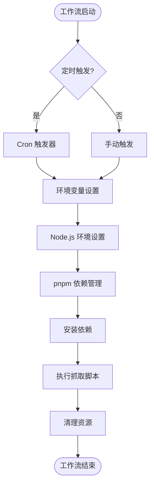
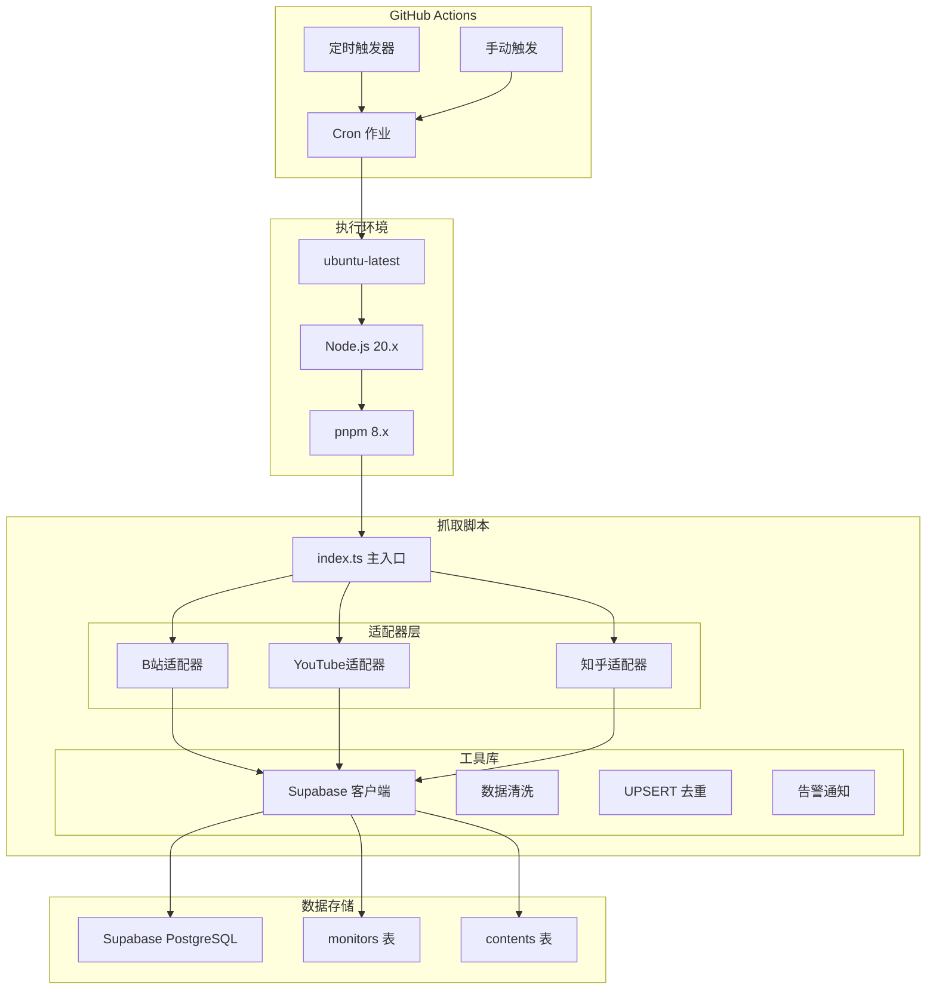
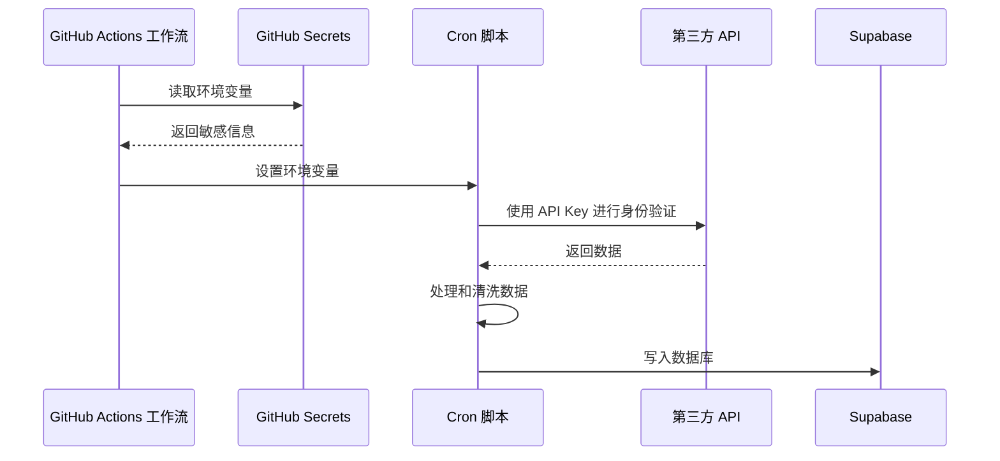
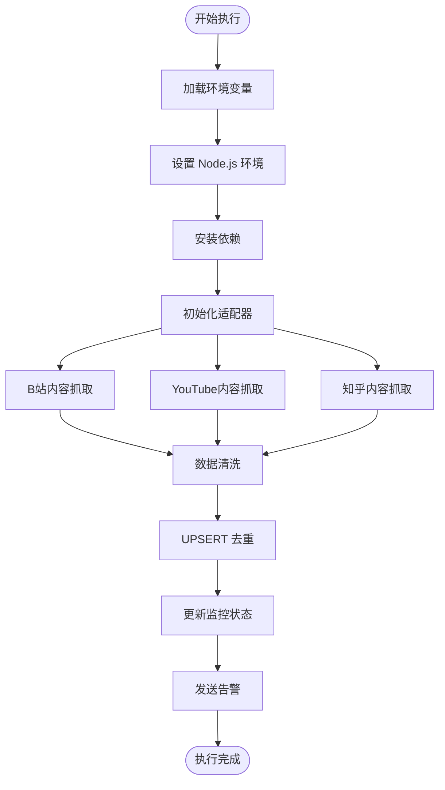
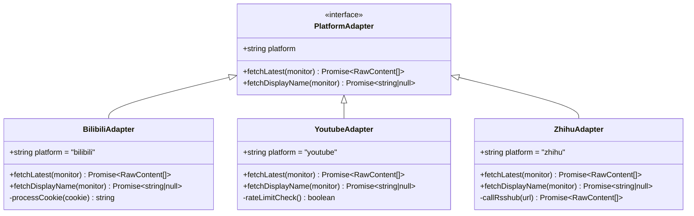
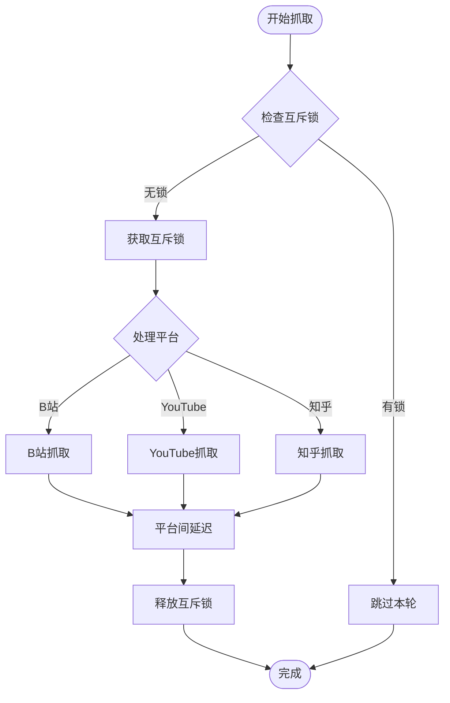
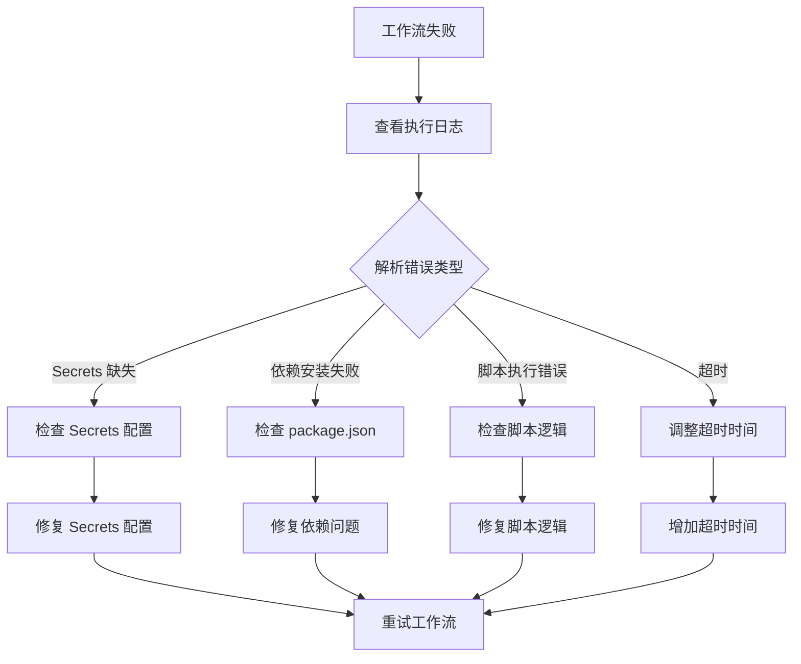
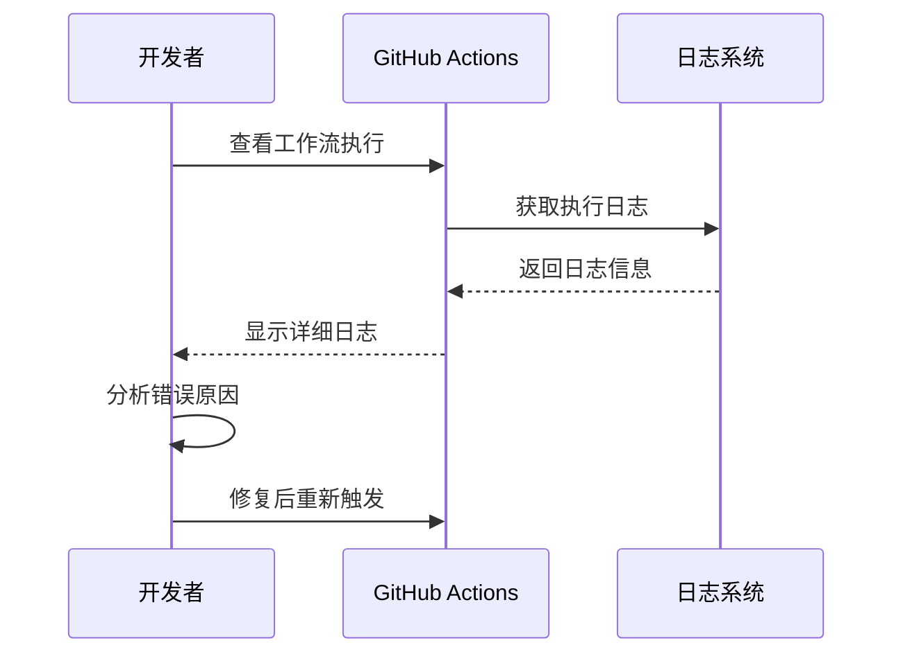

# GitHub Actions 工作流部署

<cite>
**本文档引用的文件**
- [PROJECT_CONTEXT.md](file://PROJECT_CONTEXT.md)
- [多平台中枢_PRD.md](file://多平台中枢_PRD.md)
</cite>

## 目录
1. [简介](#简介)
2. [项目结构](#项目结构)
3. [核心组件](#核心组件)
4. [架构概览](#架构概览)
5. [详细组件分析](#详细组件分析)
6. [依赖分析](#依赖分析)
7. [性能考虑](#性能考虑)
8. [故障排除指南](#故障排除指南)
9. [结论](#结论)
10. [附录](#附录)

## 简介

本文档为多平台内容中枢项目提供详细的 GitHub Actions 工作流部署指南。该项目采用 GitHub Actions 作为定时任务调度器，每 30 分钟自动执行 Node.js 抓取脚本，从多个内容平台（B站、YouTube、知乎等）获取最新的内容并写入 Supabase 数据库。

项目采用"配置驱动抓取"的架构模式，通过 GitHub Actions Cron 作业实现自动化内容采集，结合 Supabase 的 RLS（行级安全策略）确保数据访问的安全性。

## 项目结构

多平台内容中枢项目采用 Monorepo 结构，其中 GitHub Actions 工作流位于 `.github/workflows/` 目录下：



**图表来源**
- [PROJECT_CONTEXT.md:115-130](file://PROJECT_CONTEXT.md#L115-L130)
- [PROJECT_CONTEXT.md:132-135](file://PROJECT_CONTEXT.md#L132-L135)

**章节来源**
- [PROJECT_CONTEXT.md:51-142](file://PROJECT_CONTEXT.md#L51-L142)

## 核心组件

### GitHub Actions 工作流配置

项目使用标准的 GitHub Actions 工作流配置，支持定时触发和手动触发两种模式：



**图表来源**
- [PROJECT_CONTEXT.md:617-643](file://PROJECT_CONTEXT.md#L617-L643)

### Cron 工作流配置详情

工作流采用以下关键配置：

- **触发器设置**：每 30 分钟执行一次
- **运行环境**：ubuntu-latest
- **超时控制**：10 分钟
- **手动触发**：支持 workflow_dispatch

**章节来源**
- [PROJECT_CONTEXT.md:615-643](file://PROJECT_CONTEXT.md#L615-L643)

## 架构概览

多平台内容中枢的 GitHub Actions 工作流在整个系统架构中扮演着关键角色：



**图表来源**
- [PROJECT_CONTEXT.md:194-200](file://PROJECT_CONTEXT.md#L194-L200)
- [PROJECT_CONTEXT.md:617-643](file://PROJECT_CONTEXT.md#L617-L643)

## 详细组件分析

### Cron 工作流配置详解

#### 触发器配置

工作流使用标准的 Cron 表达式实现定时触发：

```yaml
schedule:
  - cron: '*/30 * * * *'  # 每 30 分钟
workflow_dispatch: {}       # 支持手动触发
```

这种配置确保系统能够及时获取最新的内容更新，同时避免过于频繁的触发导致资源浪费。

#### 运行环境配置

工作流在 `ubuntu-latest` 环境中执行，使用 Node.js 20.x 作为运行时：

```yaml
runs-on: ubuntu-latest
env:
  SUPABASE_URL: ${{ secrets.SUPABASE_URL }}
  SUPABASE_SERVICE_ROLE_KEY: ${{ secrets.SUPABASE_SERVICE_ROLE_KEY }}
  YOUTUBE_API_KEY: ${{ secrets.YOUTUBE_API_KEY }}
  RSSHUB_URL: ${{ secrets.RSSHUB_URL }}
  RSSHUB_API_KEY: ${{ secrets.RSSHUB_API_KEY }}
```

#### 依赖管理

使用 pnpm 作为包管理器，确保依赖安装的一致性和速度：

```yaml
- uses: pnpm/action-setup@v4
- run: pnpm install --frozen-lockfile
```

**章节来源**
- [PROJECT_CONTEXT.md:617-643](file://PROJECT_CONTEXT.md#L617-L643)

### Secrets 管理

项目使用 GitHub Secrets 管理敏感信息，确保安全存储和使用：

#### 必需的 Secrets 列表

| 变量名 | 存储位置 | 用途 | 安全级别 |
|--------|----------|------|----------|
| `SUPABASE_URL` | GitHub Secrets | Supabase 项目 URL | 高 |
| `SUPABASE_SERVICE_ROLE_KEY` | GitHub Secrets | 绕过 RLS 的服务密钥 | 最高 |
| `YOUTUBE_API_KEY` | GitHub Secrets | YouTube Data API 密钥 | 高 |
| `RSSHUB_URL` | GitHub Secrets | RSSHub 实例地址 | 中 |
| `RSSHUB_API_KEY` | GitHub Secrets | RSSHub 访问鉴权 | 高 |
| `WECOM_WEBHOOK_URL` | GitHub Secrets | 企业微信告警 Webhook | 中 |

#### Secrets 使用模式



**图表来源**
- [PROJECT_CONTEXT.md:34-46](file://PROJECT_CONTEXT.md#L34-L46)

**章节来源**
- [PROJECT_CONTEXT.md:34-46](file://PROJECT_CONTEXT.md#L34-L46)

### Cron 脚本执行流程

#### 脚本执行顺序



#### 平台适配器架构



**图表来源**
- [PROJECT_CONTEXT.md:574-598](file://PROJECT_CONTEXT.md#L574-L598)

**章节来源**
- [PROJECT_CONTEXT.md:574-598](file://PROJECT_CONTEXT.md#L574-L598)

## 依赖分析

### 工作流依赖关系

```mermaid
graph TB
subgraph "GitHub Actions 工作流"
CronWorkflow[cron-fetch.yml]
end
subgraph "外部依赖"
ActionsCheckout[actions/checkout@v4]
ActionsSetupNode[actions/setup-node@v4]
PNPMAction[pnpm/action-setup@v4]
end
subgraph "内部依赖"
CronPackage[scripts/cron/package.json]
CronTSConfig[scripts/cron/tsconfig.json]
CronIndex[scripts/cron/src/index.ts]
end
subgraph "Supabase 依赖"
SupabaseJS[@supabase/supabase-js]
SupabaseTS[@supabase/supabase (Deno)]
end
CronWorkflow --> ActionsCheckout
CronWorkflow --> ActionsSetupNode
CronWorkflow --> PNPMAction
CronWorkflow --> CronPackage
CronPackage --> CronTSConfig
CronPackage --> CronIndex
CronIndex --> SupabaseJS
CronIndex --> SupabaseTS
```

**图表来源**
- [PROJECT_CONTEXT.md:115-130](file://PROJECT_CONTEXT.md#L115-L130)

### 依赖版本管理

工作流使用固定版本的 Action，确保执行环境的稳定性：

- `actions/checkout@v4` - 代码检出
- `actions/setup-node@v4` - Node.js 环境设置
- `pnpm/action-setup@v4` - pnpm 包管理器

**章节来源**
- [PROJECT_CONTEXT.md:636-642](file://PROJECT_CONTEXT.md#L636-L642)

## 性能考虑

### 超时控制策略

工作流设置了 10 分钟的超时时间，这是一个合理的平衡点：

- **充足的时间**：允许处理多个平台的数据抓取
- **及时的失败**：避免长时间占用资源
- **重试机制**：超时后 GitHub Actions 会自动重试

### 并发控制



**图表来源**
- [PROJECT_CONTEXT.md:180-198](file://PROJECT_CONTEXT.md#L180-L198)

### 成本优化策略

1. **定时频率优化**：每 30 分钟执行一次，平衡时效性和成本
2. **互斥锁机制**：防止重复执行，节省计算资源
3. **增量抓取**：只获取最新的内容，减少 API 调用次数
4. **依赖缓存**：pnpm 的依赖缓存机制提高安装速度

## 故障排除指南

### 常见问题诊断

#### 工作流执行失败



#### Secrets 配置问题

常见的 Secrets 配置问题及解决方案：

1. **变量名不匹配**：确保变量名与工作流配置完全一致
2. **值格式错误**：检查 API Key 的格式和完整性
3. **权限不足**：确认 GitHub 仓库对该变量有读取权限

#### 依赖安装问题

```bash
# 检查 pnpm 版本
pnpm --version

# 清理缓存并重新安装
pnpm store prune
pnpm install --frozen-lockfile

# 检查 package.json 格式
cat package.json | jq .
```

**章节来源**
- [PROJECT_CONTEXT.md:617-643](file://PROJECT_CONTEXT.md#L617-L643)

### 调试方法

#### 手动触发工作流

GitHub Actions 支持手动触发，便于调试和测试：

1. 进入 GitHub 仓库的 Actions 页面
2. 选择 "Cron Fetch" 工作流
3. 点击 "Run workflow" 按钮
4. 观察执行过程和结果

#### 日志查看



#### 错误排查步骤

1. **检查 Secrets 配置**：确认所有必需的 Secrets 都已正确设置
2. **验证 API Key**：测试 API Key 的有效性
3. **检查网络连接**：确认 GitHub Actions Runner 可以访问外部 API
4. **查看依赖版本**：确保使用的 Action 版本兼容

## 结论

GitHub Actions 工作流为多平台内容中枢提供了可靠的自动化内容采集能力。通过合理的配置和安全管理，系统能够在保证数据新鲜度的同时，最大化地控制成本和资源消耗。

关键的成功因素包括：
- **安全的 Secrets 管理**：敏感信息的安全存储和使用
- **稳定的执行环境**：固定版本的 Action 和依赖管理
- **高效的超时控制**：平衡执行时间和资源消耗
- **完善的监控机制**：日志记录和告警通知

## 附录

### 多环境工作流管理

#### 开发环境配置

```yaml
on:
  push:
    branches: [ develop ]
  pull_request:
    branches: [ develop ]
  
jobs:
  test:
    runs-on: ubuntu-latest
    steps:
      - run: echo "开发环境测试"
```

#### 生产环境配置

```yaml
on:
  schedule:
    - cron: '*/30 * * * *'
  workflow_dispatch: {}
  
jobs:
  production:
    runs-on: ubuntu-latest
    steps:
      - run: echo "生产环境执行"
```

### 最佳实践总结

1. **版本锁定**：始终使用固定版本的 Action
2. **最小权限原则**：只授予必要的 Secrets 权限
3. **监控告警**：建立完善的日志和告警机制
4. **备份恢复**：定期备份关键配置和数据
5. **性能优化**：合理设置超时和重试策略