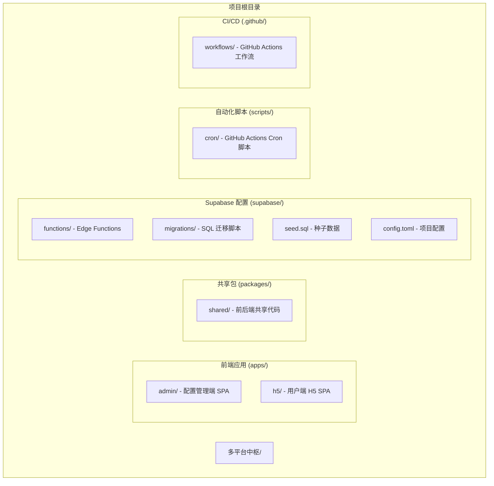
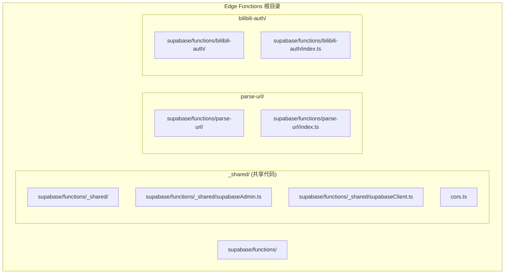
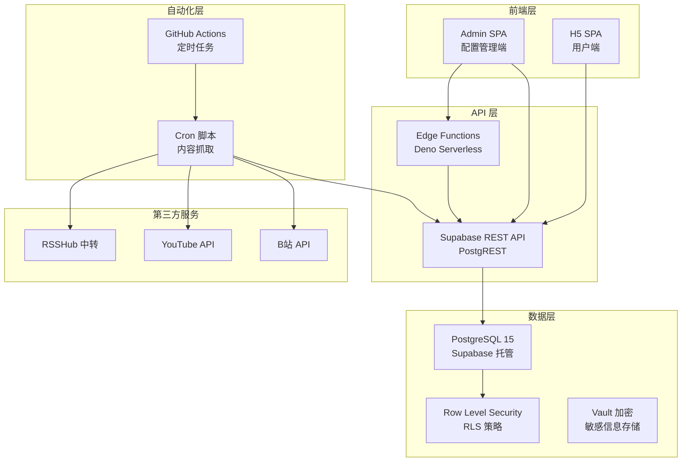
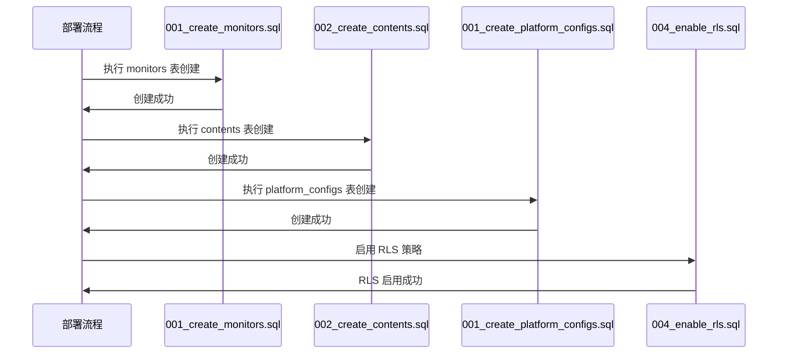
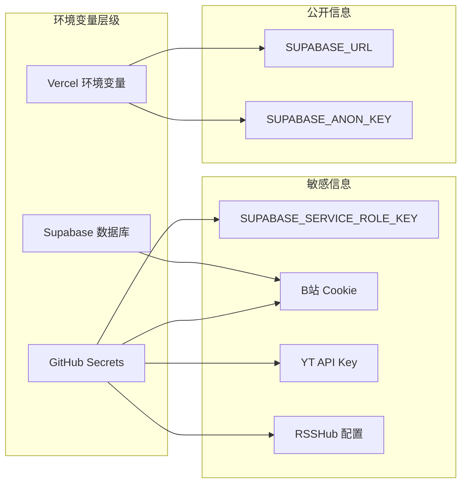

# Supabase 项目部署

<cite>
**本文档引用的文件**
- [PROJECT_CONTEXT.md](file://PROJECT_CONTEXT.md)
</cite>

## 目录
1. [简介](#简介)
2. [项目结构](#项目结构)
3. [核心组件](#核心组件)
4. [架构概览](#架构概览)
5. [详细组件分析](#详细组件分析)
6. [依赖关系分析](#依赖关系分析)
7. [性能考虑](#性能考虑)
8. [故障排除指南](#故障排除指南)
9. [结论](#结论)

## 简介

多平台内容中枢是一个基于 Supabase Cloud 的全栈内容聚合平台，支持 B站、YouTube 和知乎等多个平台的内容抓取和展示。该项目采用现代化的全栈架构，结合前端 SPA、后端自动化引擎和 Supabase 云服务，实现了高效的内容聚合和管理功能。

本项目的核心特点包括：
- **多平台内容聚合**：支持 B站、YouTube、知乎等平台的内容抓取
- **实时数据更新**：通过 GitHub Actions 每 30 分钟自动抓取最新内容
- **安全的数据管理**：采用 Supabase RLS 策略和加密存储机制
- **Serverless 架构**：利用 Edge Functions 实现轻量级服务端逻辑
- **Monorepo 管理**：统一的代码组织和类型定义管理

## 项目结构

项目采用 Monorepo 结构，专门针对 Supabase 项目进行了优化配置：



**图表来源**
- [PROJECT_CONTEXT.md:55-141](file://PROJECT_CONTEXT.md#L55-L141)

**章节来源**
- [PROJECT_CONTEXT.md:49-141](file://PROJECT_CONTEXT.md#L49-L141)

## 核心组件

### Supabase 项目配置

Supabase 项目配置位于 `supabase/` 目录下，包含完整的项目结构：

| 组件 | 位置 | 描述 |
|------|------|------|
| Edge Functions | `supabase/functions/` | Deno 编写的轻量级 serverless 函数 |
| 迁移脚本 | `supabase/migrations/` | 数据库结构变更的 SQL 脚本 |
| 种子数据 | `supabase/seed.sql` | 初始数据填充 |
| 项目配置 | `supabase/config.toml` | Supabase 项目全局配置 |

### Edge Functions 结构



**图表来源**
- [PROJECT_CONTEXT.md:97-113](file://PROJECT_CONTEXT.md#L97-L113)

**章节来源**
- [PROJECT_CONTEXT.md:97-113](file://PROJECT_CONTEXT.md#L97-L113)

## 架构概览

系统采用分层架构设计，确保各组件职责清晰、耦合度低：



**图表来源**
- [PROJECT_CONTEXT.md:169-207](file://PROJECT_CONTEXT.md#L169-L207)

**章节来源**
- [PROJECT_CONTEXT.md:169-207](file://PROJECT_CONTEXT.md#L169-L207)

## 详细组件分析

### 数据库迁移脚本

项目包含四个关键的数据库迁移脚本，按照特定顺序执行：

#### 迁移脚本执行顺序



**图表来源**
- [PROJECT_CONTEXT.md:107-111](file://PROJECT_CONTEXT.md#L107-L111)

#### monitors 表结构

| 字段名 | 类型 | 约束 | 描述 |
|--------|------|------|------|
| id | bigint | PRIMARY KEY | 主键标识 |
| created_at | timestamp | DEFAULT now() | 创建时间 |
| updated_at | timestamp | DEFAULT now() | 更新时间 |
| is_active | boolean | DEFAULT true | 是否激活 |
| platform | varchar | NOT NULL | 平台标识 (bilibili/youtube/zhihu) |
| native_id | varchar | NOT NULL | 平台原始 ID |
| display_name | varchar | | 显示名称 |
| last_sync_at | timestamp | | 最后同步时间 |

#### contents 表结构

| 字段名 | 类型 | 约束 | 描述 |
|--------|------|------|------|
| id | bigint | PRIMARY KEY | 主键标识 |
| created_at | timestamp | DEFAULT now() | 创建时间 |
| updated_at | timestamp | DEFAULT now() | 更新时间 |
| platform | varchar | NOT NULL | 平台标识 |
| native_id | varchar | NOT NULL | 平台原始 ID |
| content_type | varchar | NOT NULL | 内容类型 (video/article/question/answer/post) |
| title | varchar | NOT NULL | 标题 |
| cover_url | varchar | | 封面图片 URL |
| original_url | varchar | NOT NULL | 原始链接 |
| published_at | timestamp | NOT NULL | 发布时间 |
| is_display | boolean | DEFAULT true | 是否显示 |

#### platform_configs 表结构

| 字段名 | 类型 | 约束 | 描述 |
|--------|------|------|------|
| id | bigint | PRIMARY KEY | 主键标识 |
| created_at | timestamp | DEFAULT now() | 创建时间 |
| updated_at | timestamp | DEFAULT now() | 更新时间 |
| platform | varchar | NOT NULL | 平台标识 |
| config_key | varchar | NOT NULL | 配置键名 |
| encrypted_value | bytea | NOT NULL | 加密后的值 |
| expires_at | timestamp | | 过期时间 |

**章节来源**
- [PROJECT_CONTEXT.md:107-111](file://PROJECT_CONTEXT.md#L107-L111)

### RLS 策略配置

项目实现了严格的 Row Level Security 策略，确保数据访问的安全性：

#### monitors 表 RLS 策略

```sql
-- 管理员：全部读写权限
CREATE POLICY "monitors_admin_all" ON monitors
  FOR ALL TO authenticated
  USING (true) WITH CHECK (true);

-- 访客：默认拒绝访问
-- 不创建 anon 策略，默认拒绝
```

#### contents 表 RLS 策略

```sql
-- 管理员：全部读写权限
CREATE POLICY "contents_admin_all" ON contents
  FOR ALL TO authenticated
  USING (true) WITH CHECK (true);

-- 访客：只能读取 is_display = true 的记录
CREATE POLICY "contents_anon_read" ON contents
  FOR SELECT TO anon
  USING (is_display = true);
```

#### platform_configs 表 RLS 策略

```sql
-- 管理员：全部读写权限
CREATE POLICY "platform_configs_admin_all" ON platform_configs
  FOR ALL TO authenticated
  USING (true) WITH CHECK (true);

-- 访客：默认拒绝访问
-- 不创建 anon 策略，默认拒绝
```

**章节来源**
- [PROJECT_CONTEXT.md:360-400](file://PROJECT_CONTEXT.md#L360-L400)

### Edge Functions 部署

#### parse-url 函数

parse-url 函数负责解析 URL 并识别平台类型：

**功能特性**：
- 支持 B站、YouTube、知乎等平台的 URL 解析
- 提取平台标识符和显示名称
- 返回标准化的平台信息

**接口规范**：
```json
POST /functions/v1/parse-url

请求:
{ "url": "https://space.bilibili.com/12345" }

成功响应:
{
  "success": true,
  "data": {
    "platform": "bilibili",
    "native_id": "12345",
    "display_name": "B站_12345"
  }
}
```

#### bilibili-auth 函数

bilibili-auth 函数处理 B站扫码登录流程：

**功能特性**：
- 生成二维码图片 URL
- 轮询扫码状态
- 捕获并存储 B站 Cookie
- 加密存储敏感信息

**接口规范**：
```json
POST /functions/v1/bilibili-auth

# 获取二维码
请求: { "action": "qrcode" }
响应: {
  "success": true,
  "data": {
    "qr_url": "https://...",
    "qrcode_key": "xxx"
  }
}

# 轮询扫码状态
请求: { "action": "poll", "qrcode_key": "xxx" }
响应（等待中）: {
  "success": true,
  "data": { "status": "waiting" }
}
响应（成功）: {
  "success": true,
  "data": { "status": "success" }
}
响应（过期）: {
  "success": true,
  "data": { "status": "expired" }
}
```

**章节来源**
- [PROJECT_CONTEXT.md:281-300](file://PROJECT_CONTEXT.md#L281-L300)
- [PROJECT_CONTEXT.md:511-568](file://PROJECT_CONTEXT.md#L511-L568)

### 数据库种子数据

项目提供了初始的种子数据，用于快速启动和测试：

**种子数据包含**：
- 默认的平台配置
- 示例监控目标
- 基础的用户权限设置

**导入步骤**：
1. 在 Supabase Dashboard 中选择 "SQL Editor"
2. 运行 `supabase/seed.sql` 文件中的 SQL 语句
3. 验证数据导入结果

**章节来源**
- [PROJECT_CONTEXT.md:112](file://PROJECT_CONTEXT.md#L112)

## 依赖关系分析

### 环境变量管理

项目使用严格的环境变量管理策略，确保安全性：



**图表来源**
- [PROJECT_CONTEXT.md:34-46](file://PROJECT_CONTEXT.md#L34-L46)

### 密钥安全管理

项目实施了多层次的密钥安全策略：

| 密钥类型 | 存储位置 | 使用场景 | 安全措施 |
|----------|----------|----------|----------|
| SUPABASE_ANON_KEY | Vercel | 前端 SPA | 受 RLS 策略保护 |
| SUPABASE_SERVICE_ROLE_KEY | GitHub Secrets | Cron 脚本 | 仅服务端使用 |
| B站 Cookie | Supabase 数据库 | B站认证 | Vault 加密存储 |
| YouTube API Key | GitHub Secrets | 内容抓取 | 限流和监控 |
| RSSHub API Key | GitHub Secrets | 知乎中转 | 网络隔离 |

**章节来源**
- [PROJECT_CONTEXT.md:34-46](file://PROJECT_CONTEXT.md#L34-L46)
- [PROJECT_CONTEXT.md:402-417](file://PROJECT_CONTEXT.md#L402-L417)

## 性能考虑

### 数据库性能优化

项目采用了多种数据库性能优化策略：

1. **索引设计**：为常用查询字段建立合适的索引
2. **分区策略**：对大量数据表考虑分区存储
3. **查询优化**：使用 LIMIT 和 OFFSET 实现分页
4. **缓存策略**：利用 Edge Functions 缓存热点数据

### Edge Functions 性能

- **冷启动优化**：合理配置函数内存和超时时间
- **并发控制**：避免同时触发过多函数实例
- **资源复用**：在 _shared 目录中共享连接和配置

### API 性能

- **批量操作**：使用 PostgREST 的批量插入和更新
- **条件查询**：合理使用 WHERE 条件和排序
- **数据压缩**：传输大文本内容时考虑压缩

## 故障排除指南

### 常见部署问题

#### 数据库迁移失败

**问题症状**：
- 迁移脚本执行报错
- 表结构创建失败

**解决方案**：
1. 检查迁移脚本的依赖关系
2. 确认执行顺序正确
3. 验证数据库连接权限
4. 查看具体的错误日志

#### Edge Functions 部署失败

**问题症状**：
- 函数部署报错
- 运行时超时

**解决方案**：
1. 检查函数代码语法
2. 验证依赖包版本
3. 确认函数内存配置
4. 查看部署日志

#### RLS 策略冲突

**问题症状**：
- 用户无法访问数据
- 权限异常

**解决方案**：
1. 检查 RLS 策略定义
2. 验证用户角色
3. 确认策略优先级
4. 测试策略效果

#### CORS 配置问题

**问题症状**：
- 跨域请求失败
- API 调用被阻止

**解决方案**：
1. 检查 CORS 头部配置
2. 验证允许的域名
3. 确认预检请求处理
4. 测试跨域请求

### 监控和调试

**监控指标**：
- 数据库查询性能
- Edge Functions 执行时间
- API 响应延迟
- 用户访问统计

**调试工具**：
- Supabase Dashboard
- Edge Functions 日志
- 数据库查询分析
- 前端网络监控

**章节来源**
- [PROJECT_CONTEXT.md:600-614](file://PROJECT_CONTEXT.md#L600-L614)

## 结论

多平台内容中枢项目展示了现代全栈应用的最佳实践，特别是在 Supabase 生态系统中的应用。通过合理的架构设计、严格的安全策略和完善的自动化流程，该项目实现了高效的内容聚合和管理功能。

**关键优势**：
- **安全性**：基于 RLS 的细粒度权限控制
- **可扩展性**：Serverless 架构支持弹性扩展
- **可维护性**：Monorepo 结构便于代码管理
- **可靠性**：自动化流程确保数据及时更新

**实施建议**：
1. 严格按照迁移脚本顺序执行
2. 重视密钥安全管理
3. 建立完善的监控体系
4. 定期审查和优化性能

通过遵循本指南，您可以成功部署和维护这个多平台内容中枢项目，为用户提供稳定可靠的内容聚合服务。