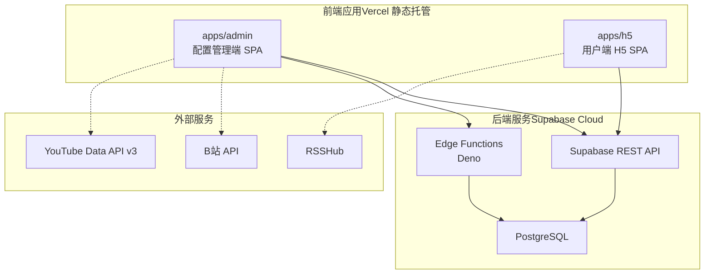
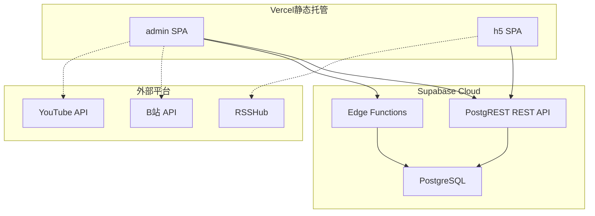
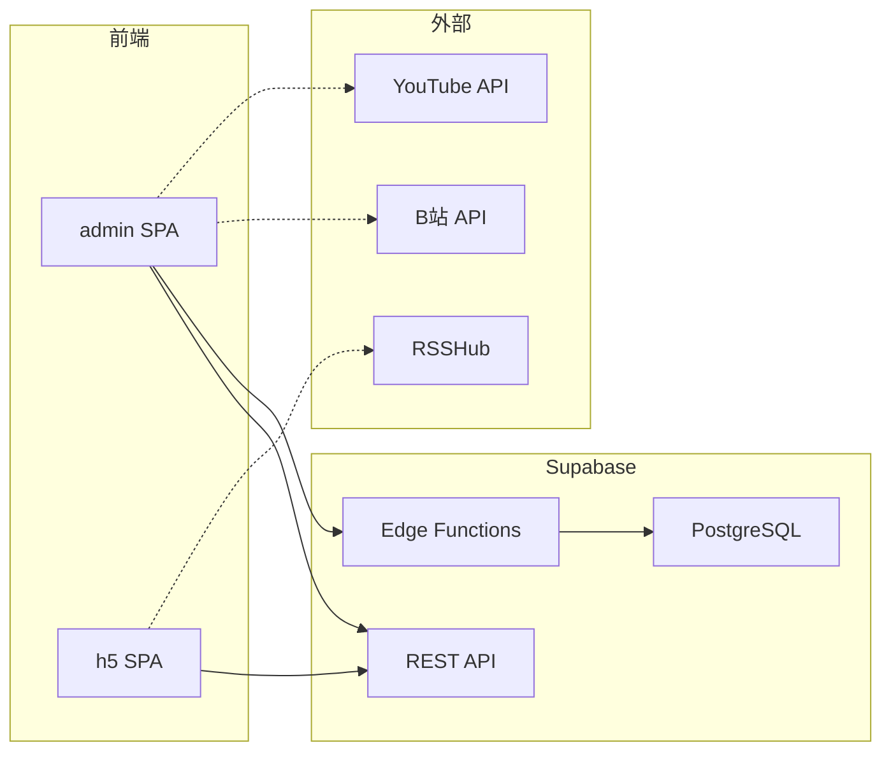

# 前端应用部署

<cite>
**本文引用的文件**
- [PROJECT_CONTEXT.md](file://PROJECT_CONTEXT.md)
- [.github/workflows/cron-fetch.yml](file://.github/workflows/cron-fetch.yml)
</cite>

## 目录
1. [简介](#简介)
2. [项目结构](#项目结构)
3. [核心组件](#核心组件)
4. [架构总览](#架构总览)
5. [详细组件分析](#详细组件分析)
6. [依赖关系分析](#依赖关系分析)
7. [性能考虑](#性能考虑)
8. [故障排查指南](#故障排查指南)
9. [结论](#结论)
10. [附录](#附录)

## 简介
本指南面向“多平台内容中枢”项目的前端应用部署，聚焦于 Vercel 静态托管场景下的配置管理端（admin SPA）与用户端 H5（h5 SPA）的独立部署流程。文档将从项目背景、技术栈、目录规范、环境变量、构建与路由要点、缓存与 CDN 策略、性能优化、部署后验证以及多环境管理策略等方面进行系统性说明，帮助读者在不同环境中稳定、高效地交付前端应用。

## 项目结构
- 前端应用采用 Monorepo 结构，使用 pnpm workspace 管理，包含两个独立的 React SPA：
  - 配置管理端：apps/admin
  - 用户端 H5：apps/h5
- 两套应用均基于 Vite 5 构建，使用 React 18 + TypeScript，并采用 Tailwind CSS 3 原子化样式方案。
- 前端通过 Supabase 提供的 REST API 与数据库交互，前端仅使用匿名密钥（anon key），受 RLS 策略保护；服务端（Cron、Edge Functions）使用服务角色密钥（service_role key）绕过 RLS。

图示来源
- [PROJECT_CONTEXT.md:17-24](file://PROJECT_CONTEXT.md#L17-L24)
- [PROJECT_CONTEXT.md:55-142](file://PROJECT_CONTEXT.md#L55-L142)

章节来源
- [PROJECT_CONTEXT.md:55-142](file://PROJECT_CONTEXT.md#L55-L142)

## 核心组件
- 配置管理端（admin SPA）
  - 职责：监控目标管理、URL 解析与平台识别（Edge Function）、B站扫码授权（Edge Function + B站 API）、监控状态面板、昵称管理。
  - 交互：直接调用 Supabase REST API；解析 URL 时调用 parse-url Edge Function；扫码授权时调用 bilibili-auth Edge Function。
- 用户端 H5（h5 SPA）
  - 职责：聚合信息流（分页 + 筛选）、Deep Link 跳转（B站 + YouTube）、兜底弹窗。
  - 交互：只读访问 contents 表（is_display=true），通过 Supabase REST API 获取数据。
- 辅助组件
  - Edge Functions：parse-url、bilibili-auth，负责轻量逻辑与第三方平台对接。
  - GitHub Actions：定时抓取脚本，通过 Supabase REST API 写入数据，不直连数据库。

章节来源
- [PROJECT_CONTEXT.md:247-346](file://PROJECT_CONTEXT.md#L247-L346)
- [PROJECT_CONTEXT.md:420-568](file://PROJECT_CONTEXT.md#L420-L568)

## 架构总览
- 前端 SPA（Vercel 静态托管）通过 Supabase REST API 与数据库交互，前端仅使用匿名密钥（anon key），受 RLS 策略保护。
- 后端自动化引擎（GitHub Actions）定时抓取第三方平台内容，清洗标准化后通过 Supabase REST API 写入数据库。
- Edge Functions 用于 URL 解析与 B站扫码授权等轻量逻辑，不直接操作数据库连接。

图示来源
- [PROJECT_CONTEXT.md:169-240](file://PROJECT_CONTEXT.md#L169-L240)

## 详细组件分析

### 配置管理端（admin SPA）部署流程
- 独立部署
  - 在 Vercel 控制台中为 apps/admin 创建独立项目，确保构建目录指向该应用。
  - 构建参数建议
    - 框架预设：React 18 + TypeScript
    - 构建工具：Vite 5
    - 输出目录：dist（由 Vite 生产构建生成）
    - 基础路径：如需子路径部署，设置 basePath（例如 /admin）
  - 路由配置
    - SPA 路由：使用 history 模式或 hash 模式均可；若使用 history 模式，需在 Vercel 上配置重写规则，将未匹配路径回退到 index.html。
  - 环境变量
    - SUPABASE_URL：Supabase 项目 URL
    - SUPABASE_ANON_KEY：前端公开使用，受 RLS 保护
    - SUPABASE_SERVICE_ROLE_KEY：不应出现在前端，仅用于服务端（Cron、Edge Functions）
  - 静态资源优化
    - 启用压缩与缓存（Vercel 默认开启 gzip/br），合理设置静态资源缓存策略（如 dist/* 缓存较长，index.html 缓存较短）。
- Edge Function 集成
  - URL 解析：调用 parse-url Edge Function，解析 URL 并返回平台与标识。
  - B站扫码授权：调用 bilibili-auth Edge Function，获取二维码、轮询扫码状态并捕获 Cookie。

章节来源
- [PROJECT_CONTEXT.md:34-46](file://PROJECT_CONTEXT.md#L34-L46)
- [PROJECT_CONTEXT.md:475-568](file://PROJECT_CONTEXT.md#L475-L568)

### 用户端 H5（h5 SPA）部署流程
- 独立部署
  - 在 Vercel 控制台中为 apps/h5 创建独立项目，确保构建目录指向该应用。
  - 构建参数建议
    - 框架预设：React 18 + TypeScript
    - 构建工具：Vite 5
    - 输出目录：dist（由 Vite 生产构建生成）
    - 基础路径：如需子路径部署，设置 basePath（例如 /h5）
  - 路由配置
    - SPA 路由：history 或 hash 模式皆可；若使用 history 模式，需在 Vercel 上配置重写规则，将未匹配路径回退到 index.html。
  - 环境变量
    - SUPABASE_URL：Supabase 项目 URL
    - SUPABASE_ANON_KEY：前端公开使用，受 RLS 保护
  - 静态资源优化
    - 启用压缩与缓存（Vercel 默认开启 gzip/br），合理设置静态资源缓存策略（如 dist/* 缓存较长，index.html 缓存较短）。
- 数据读取
  - 通过 Supabase REST API 查询 contents 表（is_display=true），按发布时间倒序分页加载。

章节来源
- [PROJECT_CONTEXT.md:34-46](file://PROJECT_CONTEXT.md#L34-L46)
- [PROJECT_CONTEXT.md:431-473](file://PROJECT_CONTEXT.md#L431-L473)

### Vercel 项目设置与环境变量配置
- 项目设置
  - 构建命令：pnpm build（或对应 Vite 构建命令）
  - 输出目录：dist
  - 开发目录：apps/admin 或 apps/h5（分别对应两个项目）
  - 基础路径：如需子路径部署，设置 basePath
- 环境变量
  - 前端公开变量（Vercel）
    - SUPABASE_URL：Supabase 项目 URL
    - SUPABASE_ANON_KEY：前端公开使用，受 RLS 保护
  - 服务端专用变量（GitHub Secrets）
    - SUPABASE_SERVICE_ROLE_KEY：绕过 RLS，仅 Cron 与 Edge Function 使用
    - YOUTUBE_API_KEY：YouTube Data API v3 密钥
    - BILIBILI_COOKIE_*：B站 Cookie（加密存储于数据库）
    - RSSHUB_URL：RSSHub 实例地址
    - RSSHUB_API_KEY：RSSHub 访问鉴权密钥
    - WECOM_WEBHOOK_URL：企业微信告警 Webhook（可选）

章节来源
- [PROJECT_CONTEXT.md:34-46](file://PROJECT_CONTEXT.md#L34-L46)
- [PROJECT_CONTEXT.md:615-643](file://PROJECT_CONTEXT.md#L615-L643)

### 部署后的验证步骤
- 功能测试
  - 配置管理端：登录后可对监控目标进行 CRUD 操作；调用 parse-url Edge Function 验证 URL 解析；B站扫码授权流程验证。
  - 用户端 H5：分页加载信息流，筛选与排序正常；Deep Link 跳转（B站/YouTube）与兜底弹窗可用。
- 性能检查
  - 首屏加载时间（TTFB、FCP、LCP）与交互时间（INP）监控；静态资源缓存命中率检查；Gzip/Br 压缩生效验证。
- 错误监控
  - 前端错误上报（如 Sentry、LogRocket）；Edge Function 错误码与日志检查；Supabase REST API 请求状态与错误提示。
- 安全核验
  - 确认前端仅使用 SUPABASE_ANON_KEY；SUPABASE_SERVICE_ROLE_KEY 未泄露至前端；RLS 策略生效（访客仅可见 is_display=true 的内容）。

章节来源
- [PROJECT_CONTEXT.md:402-417](file://PROJECT_CONTEXT.md#L402-L417)
- [PROJECT_CONTEXT.md:600-614](file://PROJECT_CONTEXT.md#L600-L614)

### 多环境部署（开发、测试、生产）管理策略
- 环境隔离
  - 开发环境：本地开发或独立的 Vercel 预览分支；使用独立的 Supabase 开发实例与密钥。
  - 测试环境：预发布分支（Preview Deployment）；使用独立的 Supabase 测试实例与密钥。
  - 生产环境：主分支（Production Deployment）；使用正式的 Supabase 实例与密钥。
- 变更管理
  - 环境变量通过 Vercel 环境面板与 GitHub Secrets 管理；禁止在代码中硬编码密钥。
  - 部署前进行自动化测试（单元测试、集成测试、E2E 测试）与安全扫描。
- 回滚与灰度
  - 使用 Vercel 的部署历史与回滚功能；必要时进行灰度发布，逐步扩大流量比例。
- 监控与告警
  - 前端性能与错误监控；后端 API 与 Edge Function 日志；数据库访问与 RLS 策略审计。

章节来源
- [PROJECT_CONTEXT.md:615-643](file://PROJECT_CONTEXT.md#L615-L643)

## 依赖关系分析
- 前端应用依赖 Supabase REST API 与 Edge Functions，不直接调用第三方平台 API。
- GitHub Actions Cron 脚本通过 Supabase REST API 写入数据，不直连数据库。
- Edge Functions 仅用于轻量逻辑（URL 解析、B站扫码授权），数据密集型操作通过 PostgREST 或数据库函数处理。

图示来源
- [PROJECT_CONTEXT.md:213-222](file://PROJECT_CONTEXT.md#L213-L222)

章节来源
- [PROJECT_CONTEXT.md:213-222](file://PROJECT_CONTEXT.md#L213-L222)

## 性能考虑
- 构建与打包
  - 使用 Vite 5 的快速 HMR 与生产构建优化；启用 Tree Shaking 与按需加载；合理拆分代码块。
- 缓存策略
  - 静态资源：dist/* 设置较长缓存（如一年），index.html 设置较短缓存（如 0 或 1 小时）。
  - CDN：Vercel 默认提供全球 CDN，结合缓存策略提升首屏与二次访问性能。
- 资源优化
  - 图片与媒体资源压缩；字体与图标按需加载；禁用不必要的第三方脚本。
- 网络与 API
  - 合理分页与懒加载；缓存 API 响应（如内容列表）；对 Edge Function 调用进行必要的重试与降级。

章节来源
- [PROJECT_CONTEXT.md:14-16](file://PROJECT_CONTEXT.md#L14-L16)

## 故障排查指南
- 常见问题
  - 401/403 权限错误：确认前端使用的是 SUPABASE_ANON_KEY，且 RLS 策略正确；服务端密钥不要暴露给前端。
  - 400/409 Edge Function 错误：检查 parse-url 输入 URL 格式与 bilibili-auth 的二维码状态轮询。
  - 502/503 API 调用失败：检查第三方平台（YouTube、RSSHub）可用性与鉴权配置。
- 排查步骤
  - 查看 Vercel 构建日志与部署状态；检查环境变量是否正确注入。
  - 使用浏览器开发者工具 Network 面板检查 API 请求与响应；查看 Edge Function 日志。
  - 核对 Supabase REST API 请求头（apikey、Authorization、Prefer）与 SQL 策略。
- 安全核验
  - 确保 SUPABASE_SERVICE_ROLE_KEY 仅存在于 GitHub Secrets；前端不出现服务端密钥。

章节来源
- [PROJECT_CONTEXT.md:402-417](file://PROJECT_CONTEXT.md#L402-L417)
- [PROJECT_CONTEXT.md:600-614](file://PROJECT_CONTEXT.md#L600-L614)

## 结论
通过将配置管理端与用户端 H5 作为独立 SPA 在 Vercel 上部署，并严格区分前端公开密钥与服务端专用密钥，结合 Edge Functions 与 Supabase REST API 的协作，可以实现安全、稳定、高性能的前端交付。配合完善的多环境管理策略、缓存与 CDN 优化、部署后验证与错误监控，能够有效保障产品在不同阶段的质量与体验。

## 附录
- 关键环境变量清单
  - SUPABASE_URL：Supabase 项目 URL
  - SUPABASE_ANON_KEY：前端公开使用，受 RLS 保护
  - SUPABASE_SERVICE_ROLE_KEY：绕过 RLS，仅 Cron 与 Edge Function 使用
  - YOUTUBE_API_KEY：YouTube Data API v3 密钥
  - BILIBILI_COOKIE_*：B站 Cookie（加密存储于数据库）
  - RSSHUB_URL：RSSHub 实例地址
  - RSSHUB_API_KEY：RSSHub 访问鉴权密钥
  - WECOM_WEBHOOK_URL：企业微信告警 Webhook（可选）
- GitHub Actions 工作流
  - 定时触发 Cron 脚本，通过 Supabase REST API 写入数据，使用 GitHub Secrets 注入敏感变量。

章节来源
- [PROJECT_CONTEXT.md:34-46](file://PROJECT_CONTEXT.md#L34-L46)
- [PROJECT_CONTEXT.md:615-643](file://PROJECT_CONTEXT.md#L615-L643)