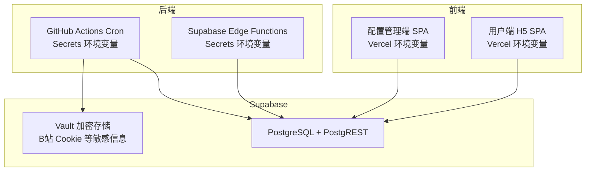
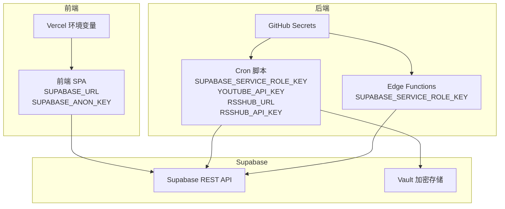
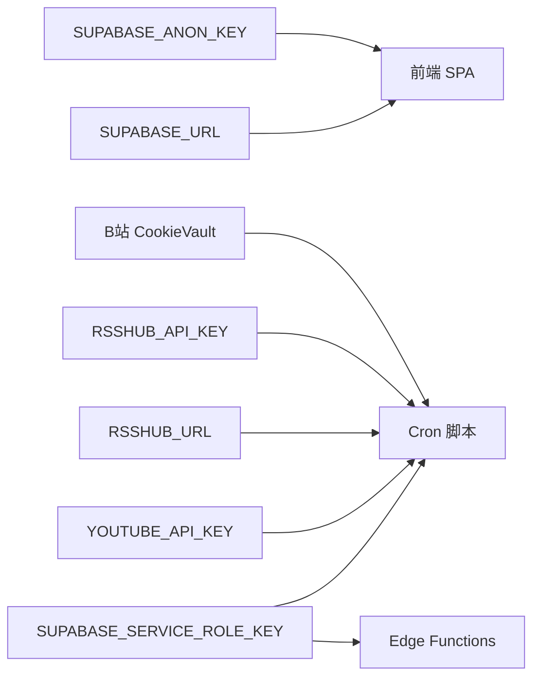

# 环境变量配置

<cite>
**本文引用的文件**
- [PROJECT_CONTEXT.md](file://PROJECT_CONTEXT.md)
- [多平台中枢_PRD.md](file://多平台中枢_PRD.md)
</cite>

## 目录
1. [简介](#简介)
2. [项目结构](#项目结构)
3. [核心组件](#核心组件)
4. [架构总览](#架构总览)
5. [详细组件分析](#详细组件分析)
6. [依赖分析](#依赖分析)
7. [性能考虑](#性能考虑)
8. [故障排查指南](#故障排查指南)
9. [结论](#结论)
10. [附录](#附录)

## 简介
本指南面向“多平台内容中枢”项目，提供一套完整的环境变量配置与管理策略。内容涵盖关键变量的作用与配置方法、不同部署环境（开发、测试、生产）的差异与管理策略、敏感信息的安全存储（GitHub Secrets、Vercel 环境变量、Supabase 数据库加密存储）、变量验证与常见错误排查、环境切换最佳实践与多环境管理策略，以及变量变更的影响评估与回滚方案。

## 项目结构
项目采用 Monorepo 结构，前端应用（配置管理端与用户端 H5）通过 Vercel 静态托管；后端自动化引擎通过 GitHub Actions 定时触发；Supabase 提供数据库、PostgREST、Edge Functions 与 Vault 加密存储。环境变量主要分布在以下位置：
- Vercel：前端应用的运行时环境变量（如 SUPABASE_URL、SUPABASE_ANON_KEY）
- GitHub Secrets：后端自动化引擎与 Edge Functions 的敏感密钥（如 SUPABASE_SERVICE_ROLE_KEY、YOUTUBE_API_KEY、RSSHUB_URL、RSSHUB_API_KEY）
- Supabase 数据库：敏感信息（如 B站 Cookie）通过 Vault 加密存储

图表来源
- [PROJECT_CONTEXT.md: 174-207:174-207](file://PROJECT_CONTEXT.md#L174-L207)
- [PROJECT_CONTEXT.md: 132-141:132-141](file://PROJECT_CONTEXT.md#L132-L141)

章节来源
- [PROJECT_CONTEXT.md: 51-141:51-141](file://PROJECT_CONTEXT.md#L51-L141)

## 核心组件
本节聚焦于与环境变量直接相关的关键组件及其职责边界，便于理解变量的来源与使用场景。

- 前端 SPA（配置管理端与用户端 H5）
  - 仅使用 SUPABASE_ANON_KEY 与 Supabase REST API 交互，受 RLS 策略保护
  - 通过 Vercel 注入环境变量（如 SUPABASE_URL、SUPABASE_ANON_KEY）

- GitHub Actions Cron
  - 使用 SUPABASE_SERVICE_ROLE_KEY 通过 REST API 写入数据
  - 使用 YOUTUBE_API_KEY、RSSHUB_URL、RSSHUB_API_KEY 等进行平台抓取
  - 通过 GitHub Secrets 注入

- Supabase Edge Functions（Deno）
  - 使用 SUPABASE_SERVICE_ROLE_KEY 与数据库交互
  - 通过 _shared 目录共享代码（如 supabaseClient、supabaseAdmin）

- Supabase 数据库与 Vault
  - B站 Cookie 等敏感信息通过 Vault 加密存储
  - 平台配置表（platform_configs）存放加密凭据

章节来源
- [PROJECT_CONTEXT.md: 34-46:34-46](file://PROJECT_CONTEXT.md#L34-L46)
- [PROJECT_CONTEXT.md: 402-417:402-417](file://PROJECT_CONTEXT.md#L402-L417)
- [PROJECT_CONTEXT.md: 97-113:97-113](file://PROJECT_CONTEXT.md#L97-L113)

## 架构总览
下图展示了环境变量在整体架构中的分布与流向，强调前端、后端与 Supabase 的边界与密钥使用原则。

图表来源
- [PROJECT_CONTEXT.md: 34-46:34-46](file://PROJECT_CONTEXT.md#L34-L46)
- [PROJECT_CONTEXT.md: 615-643:615-643](file://PROJECT_CONTEXT.md#L615-L643)
- [PROJECT_CONTEXT.md: 97-113:97-113](file://PROJECT_CONTEXT.md#L97-L113)

## 详细组件分析

### SUPABASE_URL
- 作用
  - 指向 Supabase 项目的服务端点，供前端与后端通过 REST API 访问
- 配置位置
  - 前端：Vercel 环境变量
  - 后端：GitHub Actions Secrets
- 环境差异
  - 开发：指向本地或测试 Supabase 实例
  - 生产：指向正式 Supabase 实例
- 安全要点
  - 该变量本身不包含认证信息，但需配合正确的密钥使用
- 常见问题
  - URL 格式错误或实例不可达会导致请求失败
  - 与密钥不匹配（如 ANON_KEY 与 SERVICE_ROLE_KEY 混用）也会导致鉴权失败

章节来源
- [PROJECT_CONTEXT.md: 38](file://PROJECT_CONTEXT.md#L38)
- [PROJECT_CONTEXT.md: 615-643:615-643](file://PROJECT_CONTEXT.md#L615-L643)

### SUPABASE_ANON_KEY
- 作用
  - 前端 SPA 与匿名用户访问的密钥，受 RLS 策略保护
- 配置位置
  - 前端：Vercel 环境变量
- 环境差异
  - 开发/测试/生产：通常保持一致，但建议在不同环境使用独立密钥以便审计
- 安全要点
  - 仅用于前端与匿名访问，不得在后端或 Cron 中使用
- 常见问题
  - 密钥过期或被撤销导致前端无法读写
  - RLS 策略配置不当导致前端无法访问预期数据

章节来源
- [PROJECT_CONTEXT.md: 39](file://PROJECT_CONTEXT.md#L39)
- [PROJECT_CONTEXT.md: 406](file://PROJECT_CONTEXT.md#L406)

### SUPABASE_SERVICE_ROLE_KEY
- 作用
  - 绕过 RLS 的高权限密钥，用于 Cron 脚本与 Edge Functions 内部操作
- 配置位置
  - 后端：GitHub Secrets（仅后端使用）
  - Edge Functions：通过 Secrets 注入
- 环境差异
  - 开发/测试/生产：建议使用独立密钥，便于隔离与审计
- 安全要点
  - 严禁暴露到前端或公共代码仓库
  - 严格最小权限原则，仅授予必要操作
- 常见问题
  - 密钥泄露或误用导致越权访问
  - 与 SUPABASE_ANON_KEY 混用造成鉴权异常

章节来源
- [PROJECT_CONTEXT.md: 40](file://PROJECT_CONTEXT.md#L40)
- [PROJECT_CONTEXT.md: 407](file://PROJECT_CONTEXT.md#L407)
- [PROJECT_CONTEXT.md: 615-643:615-643](file://PROJECT_CONTEXT.md#L615-L643)

### YOUTUBE_API_KEY
- 作用
  - YouTube Data API v3 的访问密钥，用于 Cron 脚本抓取
- 配置位置
  - 后端：GitHub Secrets
- 环境差异
  - 开发/测试/生产：建议使用独立密钥，避免跨环境干扰
- 安全要点
  - 限制 API Key 的使用范围与来源（如仅允许特定域名或来源）
- 常见问题
  - 配额用尽或被限制导致抓取失败
  - 密钥泄露或被滥用

章节来源
- [PROJECT_CONTEXT.md: 41](file://PROJECT_CONTEXT.md#L41)
- [PROJECT_CONTEXT.md: 615-643:615-643](file://PROJECT_CONTEXT.md#L615-L643)

### BILIBILI_COOKIE_*
- 作用
  - B站 Cookie，扫码登录后存储于 Supabase 数据库（加密）
- 配置位置
  - 数据库：Supabase Vault 加密存储
- 环境差异
  - 开发/测试/生产：建议使用独立的测试账号与 Cookie，避免影响真实用户
- 安全要点
  - 通过 Vault 加密存储，严格访问控制
- 常见问题
  - Cookie 过期导致抓取失败
  - 存储格式不正确或解密失败

章节来源
- [PROJECT_CONTEXT.md: 42](file://PROJECT_CONTEXT.md#L42)
- [PROJECT_CONTEXT.md: 390-400:390-400](file://PROJECT_CONTEXT.md#L390-L400)

### RSSHUB_URL 与 RSSHUB_API_KEY
- 作用
  - RSSHub 实例地址与 API Key，用于 Cron 脚本抓取知乎内容
- 配置位置
  - 后端：GitHub Secrets
- 环境差异
  - 开发/测试/生产：建议使用独立实例与密钥
- 安全要点
  - RSSHub 必须启用 API Key 鉴权，防止公网暴露
- 常见问题
  - RSSHub 未启用鉴权导致抓取失败
  - 密钥错误或实例不可达

章节来源
- [PROJECT_CONTEXT.md: 43-44:43-44](file://PROJECT_CONTEXT.md#L43-L44)
- [PROJECT_CONTEXT.md: 615-643:615-643](file://PROJECT_CONTEXT.md#L615-L643)

### WECOM_WEBHOOK_URL（可选）
- 作用
  - 企业微信告警 Webhook，用于异常通知
- 配置位置
  - 后端：GitHub Secrets
- 环境差异
  - 开发/测试/生产：可按需启用或禁用
- 安全要点
  - 仅在需要告警通知时启用，避免泄露
- 常见问题
  - Webhook 地址错误或权限不足导致通知失败

章节来源
- [PROJECT_CONTEXT.md: 45](file://PROJECT_CONTEXT.md#L45)
- [PROJECT_CONTEXT.md: 615-643:615-643](file://PROJECT_CONTEXT.md#L615-L643)

## 依赖分析
环境变量在系统中的依赖关系如下：
- 前端 SPA 依赖 SUPABASE_URL 与 SUPABASE_ANON_KEY
- Cron 脚本与 Edge Functions 依赖 SUPABASE_SERVICE_ROLE_KEY、YOUTUBE_API_KEY、RSSHUB_URL、RSSHUB_API_KEY
- B站 Cookie 通过 Vault 存储，供 Cron 脚本读取

图表来源
- [PROJECT_CONTEXT.md: 34-46:34-46](file://PROJECT_CONTEXT.md#L34-L46)
- [PROJECT_CONTEXT.md: 615-643:615-643](file://PROJECT_CONTEXT.md#L615-L643)

章节来源
- [PROJECT_CONTEXT.md: 34-46:34-46](file://PROJECT_CONTEXT.md#L34-L46)
- [PROJECT_CONTEXT.md: 615-643:615-643](file://PROJECT_CONTEXT.md#L615-L643)

## 性能考虑
- 密钥轮换与缓存
  - 建议在不同环境使用独立密钥，便于轮换与审计
  - Cron 抓取时对 API Key 与 RSSHub 密钥进行缓存与重试策略
- 互斥与限速
  - 使用 pg_advisory_lock 避免 Cron 并发冲突
  - 同平台请求间隔 ≥ 1.5 秒，YouTube 专属降频（每 4 小时一次）
- 数据生命周期
  - 30 天软删除策略减少前端查询压力，提升性能

章节来源
- [PROJECT_CONTEXT.md: 216-222:216-222](file://PROJECT_CONTEXT.md#L216-L222)
- [PROJECT_CONTEXT.md: 655-657:655-657](file://PROJECT_CONTEXT.md#L655-L657)

## 故障排查指南
- 常见错误与定位
  - 401/403 鉴权失败：检查密钥类型（ANON vs SERVICE_ROLE）与密钥有效性
  - 404/502 平台接口错误：检查 API Key、URL、网络连通性
  - 409 去重冲突：确认平台 + native_id 唯一性
  - Vault 解密失败：检查加密密钥与存储格式
- 验证方法
  - 前端：使用 Supabase REST API 测试 ANON_KEY 的 SELECT 权限
  - 后端：使用 Supabase REST API 测试 SERVICE_ROLE_KEY 的写入权限
  - Cron：通过 GitHub Actions 日志检查变量注入与抓取结果
- 回滚策略
  - 密钥回滚：使用上一个有效密钥替换当前密钥
  - 配置回滚：冻结当前配置，恢复到上一个稳定版本
  - 数据回滚：利用软删除机制与备份恢复历史数据

章节来源
- [PROJECT_CONTEXT.md: 600-614:600-614](file://PROJECT_CONTEXT.md#L600-L614)
- [PROJECT_CONTEXT.md: 615-643:615-643](file://PROJECT_CONTEXT.md#L615-L643)

## 结论
本指南总结了多平台内容中枢的环境变量配置与管理策略。通过明确变量职责、区分前端与后端使用边界、强化敏感信息的安全存储与轮换机制，结合严格的验证与回滚流程，可显著提升系统的安全性与可维护性。建议在实际落地中，将本指南作为基线规范，结合项目实际情况持续优化。

## 附录

### 环境变量清单与配置要点
- SUPABASE_URL：前端与后端均需，注意实例可达性与 DNS 解析
- SUPABASE_ANON_KEY：前端使用，RLS 保护，避免在后端使用
- SUPABASE_SERVICE_ROLE_KEY：后端与 Edge Functions 使用，严禁暴露到前端
- YOUTUBE_API_KEY：Cron 抓取使用，注意配额与来源限制
- BILIBILI_COOKIE_*：通过 Vault 加密存储，定期轮换与健康检查
- RSSHUB_URL/RSSHUB_API_KEY：Cron 抓取使用，RSSHub 必须启用鉴权
- WECOM_WEBHOOK_URL：可选，按需启用

章节来源
- [PROJECT_CONTEXT.md: 34-46:34-46](file://PROJECT_CONTEXT.md#L34-L46)

### 不同部署环境的配置差异与管理策略
- 开发环境
  - 使用独立的 Supabase 实例与密钥
  - 前端与后端密钥分离，便于本地调试
- 测试环境
  - 使用测试账号与 Cookie，避免影响生产数据
  - Cron 抓取频率可适当提高，便于验证
- 生产环境
  - 使用正式实例与密钥，启用严格的访问控制与审计
  - 密钥轮换与告警通知机制完善

章节来源
- [PROJECT_CONTEXT.md: 402-417:402-417](file://PROJECT_CONTEXT.md#L402-L417)

### 敏感信息的安全存储方法
- GitHub Secrets
  - 存储后端密钥（SERVICE_ROLE_KEY、API Keys、RSSHub 配置）
  - 通过工作流注入，避免硬编码
- Vercel 环境变量
  - 存储前端密钥（SUPABASE_URL、SUPABASE_ANON_KEY）
  - 通过项目设置注入，避免硬编码
- Supabase Vault
  - 存储 B站 Cookie 等敏感信息，加密存储与访问控制
  - Cron 脚本读取时进行解密与校验

章节来源
- [PROJECT_CONTEXT.md: 34-46:34-46](file://PROJECT_CONTEXT.md#L34-L46)
- [PROJECT_CONTEXT.md: 390-400:390-400](file://PROJECT_CONTEXT.md#L390-L400)

### 环境切换的最佳实践与多环境管理策略
- 环境隔离
  - 不同环境使用独立的密钥与实例，避免交叉污染
- 变更流程
  - 通过 Pull Request 审批与自动化测试验证
  - 变更前进行影响评估与回滚准备
- 监控与告警
  - 配置密钥轮换与异常告警，及时发现与处置问题

章节来源
- [PROJECT_CONTEXT.md: 402-417:402-417](file://PROJECT_CONTEXT.md#L402-L417)

### 环境变量变更的影响评估与回滚方案
- 影响评估
  - 前端：密钥变更可能导致鉴权失败或数据不可见
  - 后端：密钥变更可能导致抓取失败或写入异常
  - 数据：Vault 解密失败或格式不正确
- 回滚方案
  - 密钥回滚：使用上一个有效密钥替换当前密钥
  - 配置回滚：冻结当前配置，恢复到上一个稳定版本
  - 数据回滚：利用软删除机制与备份恢复历史数据

章节来源
- [PROJECT_CONTEXT.md: 600-614:600-614](file://PROJECT_CONTEXT.md#L600-L614)
- [PROJECT_CONTEXT.md: 615-643:615-643](file://PROJECT_CONTEXT.md#L615-L643)